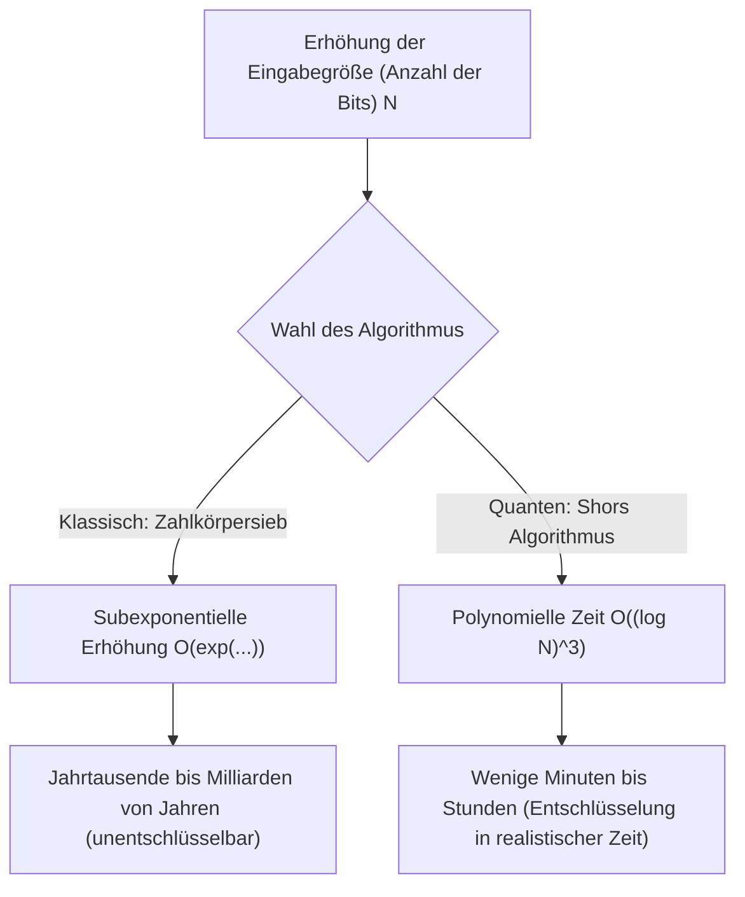
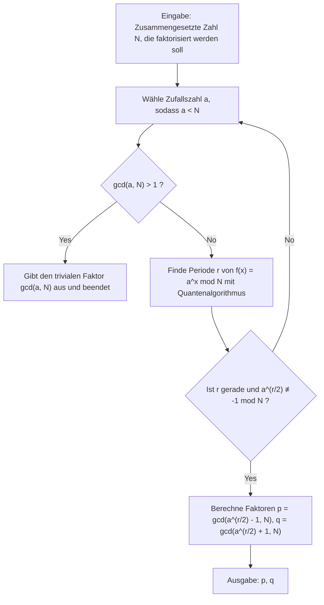
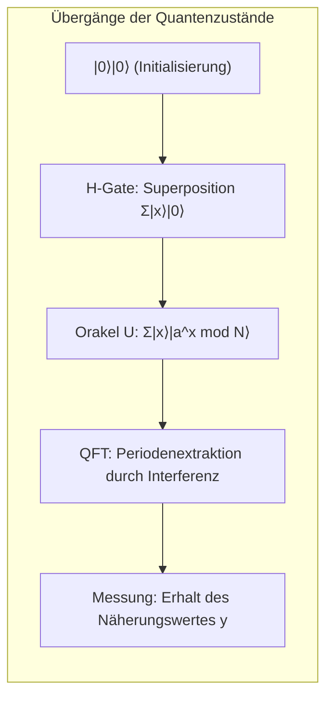

# 1. Einführung: Die kryptographische Krise durch Quantencomputer

Ein Großteil der Sicherheit in der modernen Internetgesellschaft hängt von **Public-Key-Kryptographie** (insbesondere RSA-Verschlüsselung) ab. Wenn wir beim Online-Shopping Kreditkarteninformationen senden oder hochsensible Daten austauschen, wird der Inhalt dieser Kommunikation stark durch RSA-Kryptographie geschützt.

Die Sicherheit der RSA-Verschlüsselung beruht auf der mathematischen Tatsache, dass "**die Primfaktorzerlegung riesiger ganzer Zahlen für klassische Computer (die PCs und Supercomputer, die wir normalerweise verwenden) extrem schwierig ist**". Der 1994 von Peter Shor vorgestellte "**Shor-Algorithmus (Shor's Algorithm)**" stellte diese Prämisse jedoch grundlegend in Frage. Es wurde mathematisch bewiesen, dass der Shor-Algorithmus, wenn er auf einem großen Quantencomputer ausgeführt wird, die Primfaktorzerlegung, für die klassische Computer länger als das Alter des Universums benötigen würden, in nur wenigen Minuten bis Stunden lösen kann.

In diesem Artikel werden wir ausführlich im Detail erklären, wie dieser Shor-Algorithmus eine schnelle Primfaktorzerlegung durchführt, von seinem mathematischen Mechanismus bis hin zu einer konkreten Simulationsimplementierung mit Python und dem Quanten-Computing-Framework **Qiskit**.

---

# 2. Dramatische Änderung der Komplexität: Von exponentieller zu polynomieller Zeit

Warum ist die Primfaktorzerlegung so schwierig? Selbst mit dem "Zahlkörpersieb (General Number Field Sieve, GNFS)", das als bester Primfaktorzerlegungsalgorithmus für klassische Computer bekannt ist, ist die zeitliche Komplexität subexponentiell.

Die Zeitkomplexität zur Primfaktorzerlegung einer zusammengesetzten Zahl mit $N$ Ziffern bei Verwendung klassischer Methoden ist wie folgt:

$$ O\left(\exp\left( c (\log N)^{1/3} (\log \log N)^{2/3} \right)\right) $$

Daher würde allein durch die Verlängerung der Schlüssellänge (z. B. auf 2048 Bit oder 4096 Bit) die Entschlüsselung auf einem klassischen Computer eine unrealistische Zeit wie Jahrtausende oder Zehntausende von Jahren in Anspruch nehmen.

Wenn jedoch der **Shor-Algorithmus** auf einem Quantencomputer verwendet wird, reduziert sich die zeitliche Komplexität dramatisch auf polynomielle Zeit in Bezug auf die Anzahl der Eingabebits $\log N$.

$$ O((\log N)^3) $$

Dies bedeutet, dass sich bei einer Verdoppelung der Bitzahl die Rechenzeit für einen klassischen Computer astronomisch erhöht, während sie für einen Quantencomputer höchstens um das Achtfache steigt. Diese **Reduzierung der Komplexitätsklasse von exponentieller auf polynomielle Zeit (Aufnahme in die BQP-Klasse)** ist die wahre Genialität von Shors Algorithmus.



---

# 3. Gesamtbild des Algorithmus und mathematischer Hintergrund

Beim Shor-Algorithmus wird nicht alles auf einem Quantencomputer ausgeführt. Er basiert auf der Zusammenarbeit zwischen Vorverarbeitung/Nachbearbeitung durch klassische Computer und dem Kernteil (Periodenfindungsalgorithmus) durch Quantencomputer.

Der Gesamtablauf des Algorithmus ist wie folgt:



## Reduktion der Primfaktorzerlegung auf das Periodenfindungsproblem

Shors geniale Idee bestand darin, das "**Primfaktorzerlegungsproblem**" in das "**Periodenfindungsproblem (Order Finding Problem)**" umzuwandeln.

Betrachten wir die ganze Zahl $N$ (die zu faktorisierende Zahl) und eine teilerfremde ganze Zahl $a$ ($1 < a < N$). Wir definieren die folgende modulare Exponentialfunktion:

$$ f(x) = a^x \bmod N $$

Diese Funktion hat eine bestimmte Periode $r$. Das heißt, für jedes $x$ gilt $f(x+r) = f(x)$. Insbesondere wenn $x=0$, nennt man die kleinste positive ganze Zahl $r$, die

$$ a^r \equiv 1 \pmod N $$

erfüllt, die "Ordnung von $a$ modulo $N$ (Order)". Wenn wir diese Periode $r$ finden können, können wir die Primfaktoren wie folgt ableiten.

Wenn wir die Formel umstellen, erhalten wir:
$$ a^r - 1 \equiv 0 \pmod N $$
Wenn $r$ gerade ist, kann dies mit der binomischen Formel (Differenz von Quadraten) faktorisiert werden.
$$ (a^{r/2} - 1)(a^{r/2} + 1) \equiv 0 \pmod N $$

Dies bedeutet, dass $N$ einen gemeinsamen Teiler mit entweder $(a^{r/2} - 1)$ oder $(a^{r/2} + 1)$ hat (unter der Bedingung, dass $a^{r/2} \not\equiv -1 \pmod N$). Durch Anwendung des euklidischen Algorithmus zur Berechnung von

$$ p = \gcd(a^{r/2} - 1, N) $$
$$ q = \gcd(a^{r/2} + 1, N) $$

können wir die nichttrivialen Primfaktoren $p, q$ von $N$ finden. Diese Berechnungen (Berechnung des größten gemeinsamen Teilers und Generierung von Zufallszahlen) können von klassischen Computern sehr schnell durchgeführt werden. Das Problem beschränkt sich also auf die Frage, **wie man die Periode $r$ schnell finden kann**. Auf klassischen Computern erfordert das Finden dieser Periode $r$ selbst exponentielle Zeit. Hier kommt der Quantencomputer ins Spiel.

---

# 4. Quantenalgorithmus-Teil: Wie die Periodenfindung funktioniert

Die Subroutine zum Finden der Periode $r$ mithilfe eines Quantencomputers besteht aus den folgenden 4 Schritten:



## Schritt 1: Initialisierung und Superposition der Quantenregister

Zunächst bereiten wir zwei Quantenregister vor. Das erste Register dient zur Eingabe des Zustands und das zweite zur Speicherung der Ergebnisse der Funktionsberechnung.
Der Anfangszustand ist überall $|0\rangle$.

$$ |\psi_0\rangle = |0\rangle_1 |0\rangle_2 $$

Wir wenden ein Hadamard-Gatter (Hadamard Gate) auf alle Qubits im ersten Register an, um einen Zustand gleicher Wahrscheinlichkeits-Superposition für alle möglichen Eingaben $x$ (von $0$ bis $Q-1$, mit $Q=2^n$) zu erzeugen.

$$ |\psi_1\rangle = \frac{1}{\sqrt{Q}} \sum_{x=0}^{Q-1} |x\rangle_1 |0\rangle_2 $$

Dadurch kann der Quantencomputer mit einer einzigen Operation Zustände für alle $Q$ Eingaben gleichzeitig speichern. Dies ist die mächtige Quelle der **Quantenparallelität**.

## Schritt 2: Anwendung der Orakelfunktion (Modulare Exponentiation)

Als Nächstes verwenden wir die Quantenschaltung $U_f$, um die Funktion $f(x) = a^x \bmod N$ zu berechnen und das Ergebnis im zweiten Register zu speichern.

$$ |\psi_2\rangle = \frac{1}{\sqrt{Q}} \sum_{x=0}^{Q-1} |x\rangle_1 |a^x \bmod N\rangle_2 $$

Zu diesem Zeitpunkt befinden sich das erste und zweite Register in einem Zustand der **Quantenverschränkung (Entanglement)**. Wenn wir (hypothetisch) das zweite Register beobachten und einen bestimmten Wert $k = a^{x_0} \bmod N$ erhalten, kollabiert der Zustand des ersten Registers in eine Superposition derjenigen $x$, die diesen Wert $k$ ergeben. Da die Funktion die Periode $r$ hat, sind die verbleibenden Zustände im Abstand $r$, wie $x_0, x_0+r, x_0+2r, \dots$.

$$ |\psi_3\rangle = \sqrt{\frac{r}{Q}} \sum_{j=0}^{M-1} |x_0 + j r\rangle_1 |k\rangle_2 $$

Wir wollen jedoch nicht $x_0$ wissen, sondern die Periode $r$ selbst. Es ist unmöglich, $r$ direkt aus diesem Zustand zu beobachten. Daher verwenden wir die Quanten-Fouriertransformation.

## Schritt 3: Phaseninterferenz durch Quanten-Fouriertransformation (QFT)

Wir wenden die **Quanten-Fouriertransformation (Quantum Fourier Transform, QFT)** auf das erste Register an. Die QFT ist die Quantenversion der klassischen diskreten Fouriertransformation und transformiert die Amplituden von Zustandsvektoren. Die Wirkung der QFT auf den Basiszustand $|x\rangle$ ist wie folgt definiert:

$$ QFT |x\rangle = \frac{1}{\sqrt{Q}} \sum_{y=0}^{Q-1} \omega^{xy} |y\rangle $$

Wobei $\omega = e^{2\pi i / Q}$.

Wenn die QFT angewendet wird, interferieren die Amplituden der Zustände. Ohne auf mathematische Details einzugehen: Wenn QFT auf einen Zustand mit Periode $r$ angewendet wird, verursachen die Wellen nur dann eine **konstruktive Interferenz (Constructive Interference)**, wenn $y$ extrem nahe an einem ganzzahligen Vielfachen von $Q/r$ liegt. Für andere Zustände heben sich die Wahrscheinlichkeitsamplituden aufgrund von **destruktiver Interferenz (Destructive Interference)** gegenseitig auf und nähern sich Null.

## Schritt 4: Messung und Kettenbruchentwicklung

Schließlich messen wir das erste Register. Der durch die Messung erhaltene Wert $y$ erfüllt mit hoher Wahrscheinlichkeit folgende Bedingung:

$$ y \approx c \frac{Q}{r} \implies \frac{y}{Q} \approx \frac{c}{r} $$

($c$ ist eine unbekannte ganze Zahl mit $0 \le c < r$)

Durch Anwendung der **Kettenbruchentwicklung (Continued Fraction Expansion)**, einem klassischen Algorithmus, auf die erhaltene rationale Zahl $y/Q$ berechnen wir den Näherungsbruch $c/r$ und extrahieren die Periode $r$ aus dem Nenner.

---

# 5. Simulationsimplementierung mit Python und Qiskit

Da Theorie allein schwer greifbar ist, simulieren wir Shors Algorithmus tatsächlich mit Python und **Qiskit**, dem Quanten-Computing-Framework von IBM.

Hier implementieren wir das klassischste und bekannteste Beispiel-Szenario: "**Faktorisierung von $N=15$ unter Verwendung von $a=7$**".

## Vorbereitung der Ausführungsumgebung

Bitte installieren Sie Qiskit im Voraus.

```bash
pip install qiskit qiskit-aer numpy
```

## Übersicht über den Python-Implementierungscode

Der folgende Code ist ein Implementierungsbeispiel von Shors Algorithmus, der auf $N=15, a=7$ spezialisiert ist. Da der Aufbau einer universellen modularen Exponentiationsschaltung auf aktuellen Simulatoren zu rechenintensiv ist, sind die Gatteroperationen für den spezifischen Fall von $a=7$ hartcodiert.

```python
import numpy as np
from qiskit import QuantumCircuit
from qiskit_aer import AerSimulator
from qiskit.visualization import plot_histogram
from fractions import Fraction
import math

# 1. Funktion zum Aufbau der inversen Quanten-Fouriertransformation (QFT†)
def qft_dagger(n):
    """Generiert eine inverse Quanten-Fouriertransformationsschaltung für n Qubits"""
    qc = QuantumCircuit(n)
    # SWAP-Gatter zur Umkehrung der Reihenfolge
    for qubit in range(n//2):
        qc.swap(qubit, n-qubit-1)
    # Anwendung von kontrollierten Phasengattern und H-Gattern
    for j in range(n):
        for m in range(j):
            qc.cp(-np.pi/float(2**(j-m)), m, j)
        qc.h(j)
    qc.name = "QFT_dagger"
    return qc

# 2. Funktion zum Aufbau der kontrollierten modularen Exponentiation für 7^x mod 15
def c_amod15(a, power):
    """Generiert ein kontrolliertes U-Gatter für ein spezifisches a und eine Potenz (nur für N=15)"""
    U = QuantumCircuit(4)        
    for _ in range(power):
        # Hartcodierte Logik für 7^x mod 15, wenn a=7
        if a in [2,13]:
            U.swap(2,3)
            U.swap(1,2)
            U.swap(0,1)
        if a in [7,8]:
            U.swap(0,1)
            U.swap(1,2)
            U.swap(2,3)
        if a in [4, 11]:
            U.swap(1,3)
            U.swap(0,2)
        if a in [7,11,13]:
            for q in range(4):
                U.x(q)
    U = U.to_gate()
    U.name = f"{a}^{power} mod 15"
    c_U = U.control()
    return c_U

# 3. Aufbau der Haupt-Quantenschaltung
def shor_circuit(a, n_count):
    # n_count: Anzahl der Bits im Kontrollregister
    # Das Zielregister hat 4 Bits, um 0 bis 15 darzustellen
    qc = QuantumCircuit(n_count + 4, n_count)
    
    # Initialisierung des 1. Registers (Kontrollregister) (Erzeugung der Superposition)
    for q in range(n_count):
        qc.h(q)
        
    # Initialisierung des 2. Registers (Zielregister) auf |1> (0001)
    qc.x(3 + n_count)
    
    # Anwendung der kontrollierten modularen Exponentiation (Orakel)
    for q in range(n_count):
        # Anwendung der 2^q-ten Potenz-Operation
        qc.append(c_amod15(a, 2**q), 
                 [q] + [i+n_count for i in range(4)])
        
    # Anwendung der inversen Quanten-Fouriertransformation auf das 1. Register
    qc.append(qft_dagger(n_count), range(n_count))
    
    # Messung des 1. Registers
    qc.measure(range(n_count), range(n_count))
    return qc

# --- Ausführungsbereich ---
if __name__ == "__main__":
    N = 15
    a = 7
    n_count = 8  # Verwendung von 8 Qubits für das Kontrollregister (Q=256)
    
    print(f"Sucheinstellungen: N={N}, a={a}, Anzahl Kontroll-Qubits={n_count}")
    
    # Generierung der Schaltung
    qc = shor_circuit(a, n_count)
    
    # Ausführung im Simulator
    sim = AerSimulator()
    # In der neuesten Version von Qiskit wird transpile empfohlen
    from qiskit import transpile
    compiled_circuit = transpile(qc, sim)
    job = sim.run(compiled_circuit, shots=1024)
    result = job.result()
    counts = result.get_counts()
    
    print("\nMessergebnis (Bitfolge: Anzahl der Beobachtungen):")
    for bitstring, count in counts.items():
        print(f"  {bitstring}: {count} Mal")
        
    # Klassische Nachbearbeitung: Identifizierung der Periode r durch Kettenbruchentwicklung
    print("\n--- Berechnung der Periode und Primfaktorzerlegung ---")
    phases = []
    for output in counts:
        # Umwandlung der Bitfolge in eine Dezimalzahl
        decimal = int(output, 2)
        # Phase = Messwert / 2^n_count
        phase = decimal / (2**n_count)
        phases.append(phase)
        
        # Erhalt des Näherungsbruchs durch Kettenbruchentwicklung. Die Obergrenze des Nenners ist N=15
        frac = Fraction(phase).limit_denominator(15)
        r = frac.denominator
        
        print(f"Beobachteter Wert: {decimal:3d} | Phase: {phase:.4f} | Kettenbruch: {frac} | Geschätzte Periode r = {r}")
        
        # Überprüfen, ob Periode r gerade ist und ein gültiges Ergebnis liefert
        if r % 2 == 0:
            guess1 = math.gcd(a**(r//2) - 1, N)
            guess2 = math.gcd(a**(r//2) + 1, N)
            if guess1 not in [1, N] or guess2 not in [1, N]:
                print(f"  => Erfolgreich! Die Primfaktoren von {N} sind {guess1} und {guess2}.")
            else:
                print(f"  => Nur triviale Faktoren. Noch einmal versuchen.")
        else:
            print(f"  => Fehlgeschlagen, da die Periode ungerade ist.")
```

## Code-Erklärung und Analyse der Ausführungsergebnisse

Wenn Sie den obigen Code ausführen, erhalten Sie mit hoher Wahrscheinlichkeit bestimmte Peaks (Beobachtungswerte) als Messergebnis des Kontrollregisters. Für `n_count=8` ($Q=256$) treten bei einem idealen Quantencomputer (oder Simulator) Werte wie `0`, `64`, `128`, `192` mit überwältigender Wahrscheinlichkeit auf.

Teilt man diese durch $Q=256$, erhält man die Phasen $y/Q$ als $0.0$, $0.25$, $0.5$, bzw. $0.75$.
Wendet man auf diese Phasen die Kettenbruchentwicklung an:
- $0.25 \to 1/4$ (Geschätzte Periode $r=4$)
- $0.50 \to 1/2$ (Geschätzte Periode $r=2$)
- $0.75 \to 3/4$ (Geschätzte Periode $r=4$)

Mit der hier erhaltenen Periode $r=4$ berechnen wir die Primfaktoren.
Da $a=7, r=4$, gilt:
$p = \gcd(7^2 - 1, 15) = \gcd(48, 15) = 3$
$q = \gcd(7^2 + 1, 15) = \gcd(50, 15) = 5$

Wir haben erfolgreich die Primfaktorzerlegung $15 = 3 \times 5$ durchgeführt.

> [!TIP]
> Wenn der Messwert $y=128$ (Phase $0.5$) erhalten wird, ist der Nenner $2$, und wir erhalten einen Teiler anstelle der wahren Periode $r=4$. In solchen Fällen können wir die wahre Periode finden, indem wir den Algorithmus mehrmals ausführen oder Vielfache der erhaltenen $r$ untersuchen.

---

# 6. Herausforderungen für die praktische Anwendung und die Grenzen der NISQ-Ära

Obwohl es einfach war, $N=15$ auf einem Simulator zu faktorisieren, gibt es für reale Quantencomputer noch viele Hürden, um RSA-2048 (eine 617-stellige Dezimalzahl), wie es in der realen Welt verwendet wird, zu faktorisieren.

Die Ära, in der wir derzeit leben, wird als **NISQ-Ära (Noisy Intermediate-Scale Quantum: verrauschtes, mittelgroßes Quanten-Computing)** bezeichnet. Qubits sind extrem anfällig für Umgebungsrauschen und unterliegen während der Berechnungen der "Dekohärenz", wodurch ihre Zustände zerstört werden.

Um tiefe Schaltungen (mit vielen Gattern) wie Shors Algorithmus fehlerfrei auszuführen, ist eine **Quantenfehlerkorrektur (Quantum Error Correction)** unerlässlich, um das Rauschen zu korrigieren. Um ein rauschfreies "logisches Qubit" zu erzeugen, müssen Tausende von "physischen Qubits" mit Verfahren wie dem Surface Code codiert werden.

Um eine 2048-Bit-RSA-Verschlüsselung zu knacken, werden Tausende von perfekten logischen Qubits benötigt. Schätzungen zufolge ist dafür ein fehlertoleranter Quantencomputer mit **Millionen bis zig Millionen physischen Qubits** erforderlich. Da selbst die modernsten heutigen Quantenprozessoren nur über einige Hundert bis Tausend physische Qubits verfügen, werden die Verschlüsselungen der Welt nicht unmittelbar morgen geknackt.

> [!WARNING]
> Es gibt jedoch ein Bedrohungsmodell namens "Store Now, Decrypt Later (Jetzt speichern, später entschlüsseln)". Angreifer könnten große Mengen der aktuell verschlüsselten vertraulichen Kommunikation in verschlüsselter Form speichern und die Strategie verfolgen, alles zu entschlüsseln, sobald in 10 bis 20 Jahren ein leistungsstarker Quantencomputer gebaut ist.

---

# 7. Übergang zur Post-Quanten-Kryptographie (PQC)

In Vorbereitung auf die Ankunft eines solchen "Q-Day (der Tag, an dem Quantencomputer Verschlüsselungen knacken)" standardisieren Kryptographen weltweit, allen voran das amerikanische National Institute of Standards and Technology (NIST), die **Post-Quanten-Kryptographie (Post-Quantum Cryptography, PQC)**.

PQC basiert auf neuen mathematischen Problemen (Gitterprobleme, multivariate Polynome, hashbasiert usw.), von denen mathematisch angenommen wird, dass sie selbst mit Shors Algorithmus (oder Grovers Algorithmus) nicht effizient lösbar sind. Algorithmen wie "CRYSTALS-Kyber" und "CRYSTALS-Dilithium" wurden bereits als Standard ausgewählt und schrittweise in Apples iMessage und verschiedene Webbrowser-Kommunikationsprotokolle eingeführt.

Für Ingenieure, die IT-Infrastrukturen verwalten, wird der Einbau von "Crypto-Agility (Krypto-Agilität: das Design zum schnellen Wechseln von Verschlüsselungsmethoden)" von bestehenden RSA- oder elliptischen Kurven zu PQC eine wichtige zukünftige Aufgabe sein.

---

# 8. Fazit

In diesem Artikel haben wir eine umfassende Erklärung im Umfang von etwa 10.000 Zeichen geliefert, beginnend mit dem theoretischen mathematischen Hintergrund des Shor-Algorithmus, über den Mechanismus der Periodenextraktion mittels der Quanten-Fouriertransformation, bis hin zu spezifischem Simulationscode mit Python und Qiskit.

Die Tatsache, dass die physikalischen Gesetze der mikroskopischen Welt der Quantenmechanik die Grundlagen der Komplexitätstheorie und der Kryptographietheorie, die die Grundlagen der makroskopischen Informationswissenschaft bilden, komplett umstürzen können, ist einer der aufregendsten Paradigmenwechsel in der Geschichte der Wissenschaft. Es bleibt spannend, die anhaltende technologische Entwicklung der Quantencomputer und die Abwehrschlacht durch neue Verschlüsselungstechnologien weiter zu beobachten.

Wir ermutigen Sie, den hier vorgestellten Python-Code in Ihrer eigenen Umgebung auszuführen und die "Magie der Berechnung" zu erleben, die durch die Superposition und Interferenz von Quantenzuständen entsteht.

---
**Referenzen**
- Shor, P. W. (1994). "Algorithms for quantum computation: discrete logarithms and factoring". Proceedings 35th Annual Symposium on Foundations of Computer Science.
- Nielsen, M. A., & Chuang, I. L. (2010). "Quantum Computation and Quantum Information". Cambridge University Press.
- Qiskit Documentation: https://qiskit.org/documentation/

