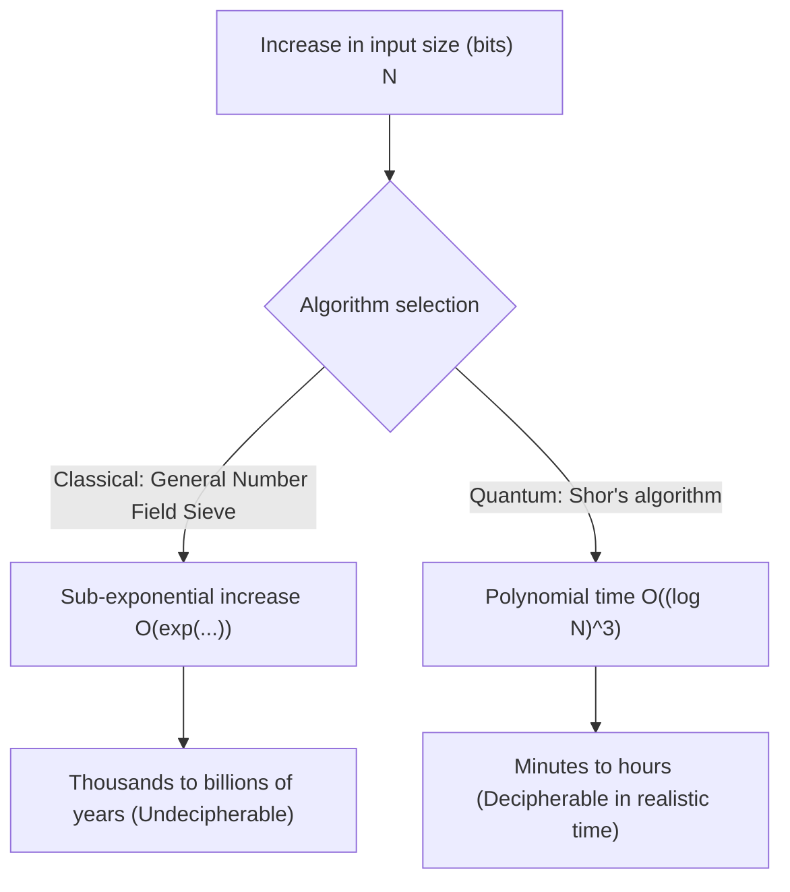
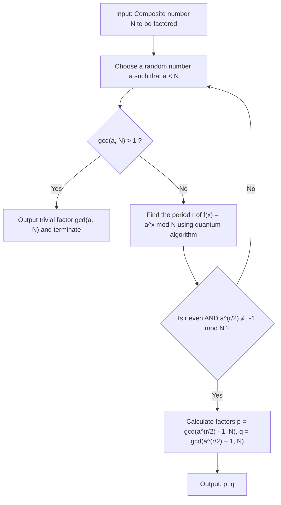
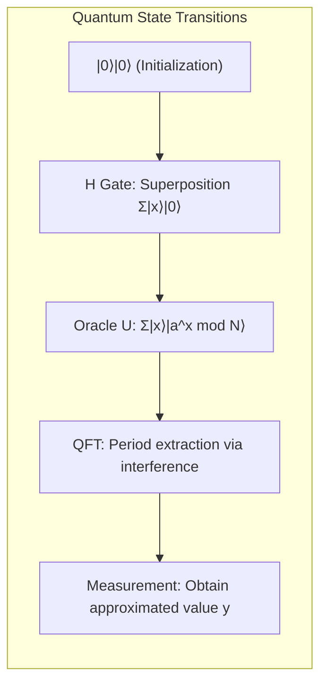

# 1. Introduction: The Cryptographic Crisis Brought by Quantum Computers

Much of the security in modern internet society relies on **public-key cryptography** (especially RSA encryption). When we transmit credit card information for online shopping or exchange highly confidential data, the content of that communication is strongly protected by RSA encryption.

The basis for the security of RSA encryption relies on the mathematical fact that "**factoring huge integers is extremely difficult for classical computers (the PCs and supercomputers we use every day).**" However, **Shor's Algorithm**, published by Peter Shor in 1994, fundamentally overturned this premise. It was mathematically proven that if Shor's algorithm were executed on a large-scale quantum computer, it could solve factorization problems—which would take classical computers longer than the age of the universe—in just minutes to hours.

In this article, we will thoroughly explain how Shor's algorithm performs integer factorization so quickly in detail, from its mathematical mechanics to a concrete simulation implementation using Python and the quantum computing framework **Qiskit**.

---

# 2. Dramatic Shift in Computational Complexity: From Exponential to Polynomial Time

Why is prime factorization so difficult? Even if we use the "General Number Field Sieve (GNFS)," known as the best factorization algorithm for classical computers, its computational complexity is sub-exponential.

The time complexity to factorize a composite number of $N$ digits using classical methods is as follows:

$$ O\left(\exp\left( c (\log N)^{1/3} (\log \log N)^{2/3} \right)\right) $$

Because of this, simply increasing the key length (e.g., to 2048 bits or 4096 bits) ensures that deciphering it on a classical computer would take thousands or tens of thousands of years—an unrealistic amount of time.

However, using **Shor's Algorithm** on a quantum computer dramatically reduces the computational complexity to polynomial time relative to the number of input bits $\log N$:

$$ O((\log N)^3) $$

This means that if we double the number of bits, the computation time on a classical computer increases astronomically, whereas on a quantum computer it only increases by at most about 8 times. This **reduction in complexity class from exponential time to polynomial time (inclusion in the BQP class)** is the true marvel of Shor's algorithm.



---

# 3. Algorithm Overview and Mathematical Background

Shor's algorithm does not actually perform everything on a quantum computer. It is composed of a collaboration between pre-processing and post-processing on a classical computer and the core part (the order-finding algorithm) on a quantum computer.

The overall flow of the algorithm is as follows:



## Reduction of Factorization to the Order Finding Problem

Shor's stroke of genius lies in converting the "**factorization problem**" into an "**Order Finding Problem**".

Consider an integer $N$ (the number to be factored) and an integer $a$ coprime to $N$ ($1 < a < N$). We define the following modular exponentiation function:

$$ f(x) = a^x \bmod N $$

This function has a certain period $r$. That is, $f(x+r) = f(x)$ holds true for any $x$. In particular, when $x=0$, the smallest positive integer $r$ such that:

$$ a^r \equiv 1 \pmod N $$

is called the "order of $a$ modulo $N$". If we can find this period $r$, we can derive the prime factors as follows.

Rearranging the equation gives:
$$ a^r - 1 \equiv 0 \pmod N $$
If $r$ is even, we can factor it using the difference of squares formula:
$$ (a^{r/2} - 1)(a^{r/2} + 1) \equiv 0 \pmod N $$

This means that $N$ shares a common divisor with either $(a^{r/2} - 1)$ or $(a^{r/2} + 1)$ (provided that the condition $a^{r/2} \not\equiv -1 \pmod N$ is met). Therefore, using the Euclidean algorithm to calculate:

$$ p = \gcd(a^{r/2} - 1, N) $$
$$ q = \gcd(a^{r/2} + 1, N) $$

allows us to find the non-trivial prime factors $p, q$ of $N$. This computation (calculating the greatest common divisor and generating random numbers) can be done extremely fast on classical computers. The problem is thus narrowed down to **how to find the period $r$ quickly**. On a classical computer, finding this period $r$ itself takes exponential time. This is where the quantum computer comes into play.

---

# 4. Quantum Algorithm Part: Mechanics of Order Finding

The subroutine for finding the period $r$ using a quantum computer consists of the following 4 steps:



## Step 1: Initialization of Quantum Registers and Superposition

First, we prepare two quantum registers. The first register is for inputting states, and the second register is for storing the result of the function's calculation.
The initial state is all $|0\rangle$.

$$ |\psi_0\rangle = |0\rangle_1 |0\rangle_2 $$

We apply Hadamard gates to all qubits in the first register, creating an equal-probability superposition of all possible inputs $x$ (from $0$ to $Q-1$, where $Q=2^n$).

$$ |\psi_1\rangle = \frac{1}{\sqrt{Q}} \sum_{x=0}^{Q-1} |x\rangle_1 |0\rangle_2 $$

Through this, the quantum computer simultaneously holds the states for all $Q$ inputs in a single operation. This is the powerful source of **quantum parallelism**.

## Step 2: Application of the Oracle Function (Modular Exponentiation)

Next, using a quantum arithmetic circuit $U_f$, we calculate the function $f(x) = a^x \bmod N$ and store the result in the second register.

$$ |\psi_2\rangle = \frac{1}{\sqrt{Q}} \sum_{x=0}^{Q-1} |x\rangle_1 |a^x \bmod N\rangle_2 $$

At this point, the first and second registers are in a state of **quantum entanglement**. If we were to (hypothetically) observe the second register and obtain a specific value $k = a^{x_0} \bmod N$, the state of the first register would collapse into a superposition of $x$ values that yield that $k$. Since the period of the function is $r$, the remaining states will be values separated by $r$: $x_0, x_0+r, x_0+2r, \dots$

$$ |\psi_3\rangle = \sqrt{\frac{r}{Q}} \sum_{j=0}^{M-1} |x_0 + j r\rangle_1 |k\rangle_2 $$

However, we do not want to know $x_0$; we want to know the period $r$ itself. It is impossible to observe $r$ directly from this state. Therefore, we use the Quantum Fourier Transform.

## Step 3: Phase Interference via Quantum Fourier Transform (QFT)

We apply the **Quantum Fourier Transform (QFT)** to the first register. QFT is the quantum version of the classical discrete Fourier transform, and it transforms the amplitudes of the state vector. The action of QFT on the basis state $|x\rangle$ is defined as follows:

$$ QFT |x\rangle = \frac{1}{\sqrt{Q}} \sum_{y=0}^{Q-1} \omega^{xy} |y\rangle $$

Here, $\omega = e^{2\pi i / Q}$.

When QFT is applied, the state amplitudes interfere with each other. Skipping the mathematical details, when QFT is applied to a state with period $r$, the waves cause **Constructive Interference** only when $y$ is extremely close to an integer multiple of $Q/r$. For all other states, the probability amplitudes cancel out due to **Destructive Interference**, approaching zero.

## Step 4: Measurement and Continued Fraction Expansion

Finally, we measure the first register. The value $y$ obtained from the measurement will satisfy the following condition with high probability:

$$ y \approx c \frac{Q}{r} \implies \frac{y}{Q} \approx \frac{c}{r} $$

(where $c$ is an unknown integer such that $0 \le c < r$)

By applying the classical algorithm of **Continued Fraction Expansion** to the obtained rational number $y/Q$, we can calculate the approximated fraction $c/r$ and extract the period $r$ from its denominator.

---

# 5. Simulation Implementation using Python and Qiskit

Since theory alone can be hard to grasp, let's actually simulate Shor's algorithm using Python and IBM's quantum computing framework, **Qiskit**.

Here, we will implement the most classic and famous example scenario: **"Factoring $N=15$ using $a=7$."**

## Preparation of the Execution Environment

Please install Qiskit beforehand.

```bash
pip install qiskit qiskit-aer numpy
```

## Overview of the Python Implementation Code

The code below is an example implementation of Shor's algorithm specialized for $N=15, a=7$. Because building a general-purpose modular exponentiation circuit is currently too computationally expensive for simulators, we are hardcoding the gate operations for the specific case of $a=7$.

```python
import numpy as np
from qiskit import QuantumCircuit
from qiskit_aer import AerSimulator
from qiskit.visualization import plot_histogram
from fractions import Fraction
import math

# 1. Function to build the inverse Quantum Fourier Transform (QFT†)
def qft_dagger(n):
    """Generates an n-qubit inverse Quantum Fourier Transform circuit"""
    qc = QuantumCircuit(n)
    # SWAP gates to reverse the order
    for qubit in range(n//2):
        qc.swap(qubit, n-qubit-1)
    # Applying controlled-phase and H gates
    for j in range(n):
        for m in range(j):
            qc.cp(-np.pi/float(2**(j-m)), m, j)
        qc.h(j)
    qc.name = "QFT_dagger"
    return qc

# 2. Function to build the controlled modular exponentiation for 7^x mod 15
def c_amod15(a, power):
    """Generates a controlled U gate for specific a and power (N=15 only)"""
    U = QuantumCircuit(4)        
    for _ in range(power):
        # Hardcoded logic for 7^x mod 15 when a=7
        if a in [2,13]:
            U.swap(2,3)
            U.swap(1,2)
            U.swap(0,1)
        if a in [7,8]:
            U.swap(0,1)
            U.swap(1,2)
            U.swap(2,3)
        if a in [4, 11]:
            U.swap(1,3)
            U.swap(0,2)
        if a in [7,11,13]:
            for q in range(4):
                U.x(q)
    U = U.to_gate()
    U.name = f"{a}^{power} mod 15"
    c_U = U.control()
    return c_U

# 3. Main quantum circuit configuration
def shor_circuit(a, n_count):
    # n_count: Number of qubits in the control register
    # The target register is 4 bits to represent 0 to 15
    qc = QuantumCircuit(n_count + 4, n_count)
    
    # Initialization of the 1st register (control register) (Generating superposition)
    for q in range(n_count):
        qc.h(q)
        
    # Initialization of the 2nd register (target register) to |1> (0001)
    qc.x(3 + n_count)
    
    # Application of the controlled modular exponentiation (oracle)
    for q in range(n_count):
        # Apply the operation for 2^q
        qc.append(c_amod15(a, 2**q), 
                 [q] + [i+n_count for i in range(4)])
        
    # Apply inverse quantum Fourier transform to the 1st register
    qc.append(qft_dagger(n_count), range(n_count))
    
    # Measure the 1st register
    qc.measure(range(n_count), range(n_count))
    return qc

# --- Execution Section ---
if __name__ == "__main__":
    N = 15
    a = 7
    n_count = 8  # Use 8 qubits for the control register (Q=256)
    
    print(f"Search settings: N={N}, a={a}, Control qubits={n_count}")
    
    # Generate the circuit
    qc = shor_circuit(a, n_count)
    
    # Execute on the simulator
    sim = AerSimulator()
    # transpilation is recommended in newer Qiskit versions
    from qiskit import transpile
    compiled_circuit = transpile(qc, sim)
    job = sim.run(compiled_circuit, shots=1024)
    result = job.result()
    counts = result.get_counts()
    
    print("\nMeasurement results (bitstring: observation count):")
    for bitstring, count in counts.items():
        print(f"  {bitstring}: {count} times")
        
    # Classical post-processing: Identifying period r using continued fraction expansion
    print("\n--- Period calculation and factorization ---")
    phases = []
    for output in counts:
        # Convert bitstring to decimal
        decimal = int(output, 2)
        # Phase = measurement value / 2^n_count
        phase = decimal / (2**n_count)
        phases.append(phase)
        
        # Get approximated fraction using continued fraction expansion. Denominator limit is N=15
        frac = Fraction(phase).limit_denominator(15)
        r = frac.denominator
        
        print(f"Observation: {decimal:3d} | Phase: {phase:.4f} | Continued fraction: {frac} | Estimated period r = {r}")
        
        # Check if period r is even and yields valid results
        if r % 2 == 0:
            guess1 = math.gcd(a**(r//2) - 1, N)
            guess2 = math.gcd(a**(r//2) + 1, N)
            if guess1 not in [1, N] or guess2 not in [1, N]:
                print(f"  => Success! The prime factors of {N} are {guess1} and {guess2}.")
            else:
                print(f"  => Only trivial factors found. Try again.")
        else:
            print(f"  => Failed because the period is odd.")
```

## Code Explanation and Result Analysis

When executing the above code, specific peaks (observed values) are obtained with high probability as the measurement results of the control register. In the case of `n_count=8` ($Q=256$), with an ideal quantum computer (or simulator), values like `0`, `64`, `128`, and `192` will appear as observed values with overwhelming probability.

Dividing these by $Q=256$, the phase $y/Q$ becomes $0.0$, $0.25$, $0.5$, and $0.75$, respectively.
Applying continued fraction expansion to these phases yields:
- $0.25 \to 1/4$ (Estimated period $r=4$)
- $0.50 \to 1/2$ (Estimated period $r=2$)
- $0.75 \to 3/4$ (Estimated period $r=4$)

Using the period $r=4$ obtained here, we calculate the prime factors.
Since $a=7, r=4$:
$p = \gcd(7^2 - 1, 15) = \gcd(48, 15) = 3$
$q = \gcd(7^2 + 1, 15) = \gcd(50, 15) = 5$

Brilliantly, we have successfully factorized $15 = 3 \times 5$.

> [!TIP]
> If a measurement value of $y=128$ (phase $0.5$) is obtained, the denominator becomes $2$, yielding a divisor of the true period rather than the true period $r=4$. In such cases, the true period can be reached by either executing the algorithm multiple times or by investigating multiples of the obtained $r$.

---

# 6. Challenges Toward Practical Application and the Limits of the NISQ Era

While it was easy to factorize $N=15$ on a simulator, factoring RSA-2048 (a 617-digit decimal number) used in real-world applications still faces numerous walls for actual quantum computers.

The era we are currently living in is called the **NISQ (Noisy Intermediate-Scale Quantum) era**. Qubits are extremely vulnerable to noise from the external environment, and their states break down midway through computations due to "decoherence."

In order to accurately execute deep circuits (with many gates) like Shor's algorithm, **Quantum Error Correction** to correct noise is essential. To create a single noise-free "logical qubit," it is necessary to encode thousands of "physical qubits" using methods like the Surface Code.

To break 2048-bit RSA encryption, it is estimated that thousands of perfect logical qubits are required, and realizing this would necessitate a fault-tolerant quantum computer equipped with **millions to tens of millions of physical qubits**. Since even the most advanced current quantum processors only have around a few hundred to a few thousand physical qubits, the world's cryptography will not be broken immediately.

> [!WARNING]
> However, there exists a threat model known as "Store Now, Decrypt Later". Attackers might store large amounts of currently encrypted confidential communication data, adopting a strategy to decrypt everything all at once 10 to 20 years later the moment a powerful quantum computer is completed.

---

# 7. Transitioning to Post-Quantum Cryptography (PQC)

In preparation for the arrival of "Q-Day" (the day quantum computers break cryptography), cryptographers around the world, spearheaded by the National Institute of Standards and Technology (NIST) in the US, are pushing forward with the standardization of **Post-Quantum Cryptography (PQC)**.

PQC is based on new mathematical problems (such as lattice problems, multivariate polynomial problems, and hash-based functions) that are mathematically considered inefficient to solve even using Shor's algorithm (or Grover's algorithm). Algorithms like "CRYSTALS-Kyber" and "CRYSTALS-Dilithium" have already been selected as standard specifications, and their integration into Apple's iMessage and various web browser communication protocols is gradually beginning.

For engineers managing IT infrastructure, building "crypto-agility" (the ability to quickly switch cryptographic methods) into systems to transition from existing RSA or elliptic curve cryptography to PQC will be a major mission going forward.

---

# 8. Conclusion

In this article, we provided a thorough explanation on a scale of 10,000 characters, starting from the theoretical mathematical background of Shor's algorithm, covering the mechanics of period extraction using the Quantum Fourier Transform, and ending with a concrete simulation code using Python and Qiskit.

The fact that the laws of physics in the microscopic world of quantum mechanics can fundamentally overturn computational complexity theory and cryptography—which are the foundations of macroscopic information science—is one of the most exciting paradigm shifts in the history of science. We must keep a close eye on the ongoing offensive and defensive battle between the continuously evolving quantum computing technology and the new cryptographic techniques standing up against it.

By all means, please try executing the Python code introduced this time in your own environment, and experience the "magic of computation" created by the superposition and interference of quantum states.

---
**References**
- Shor, P. W. (1994). "Algorithms for quantum computation: discrete logarithms and factoring". Proceedings 35th Annual Symposium on Foundations of Computer Science.
- Nielsen, M. A., & Chuang, I. L. (2010). "Quantum Computation and Quantum Information". Cambridge University Press.
- Qiskit Documentation: https://qiskit.org/documentation/
