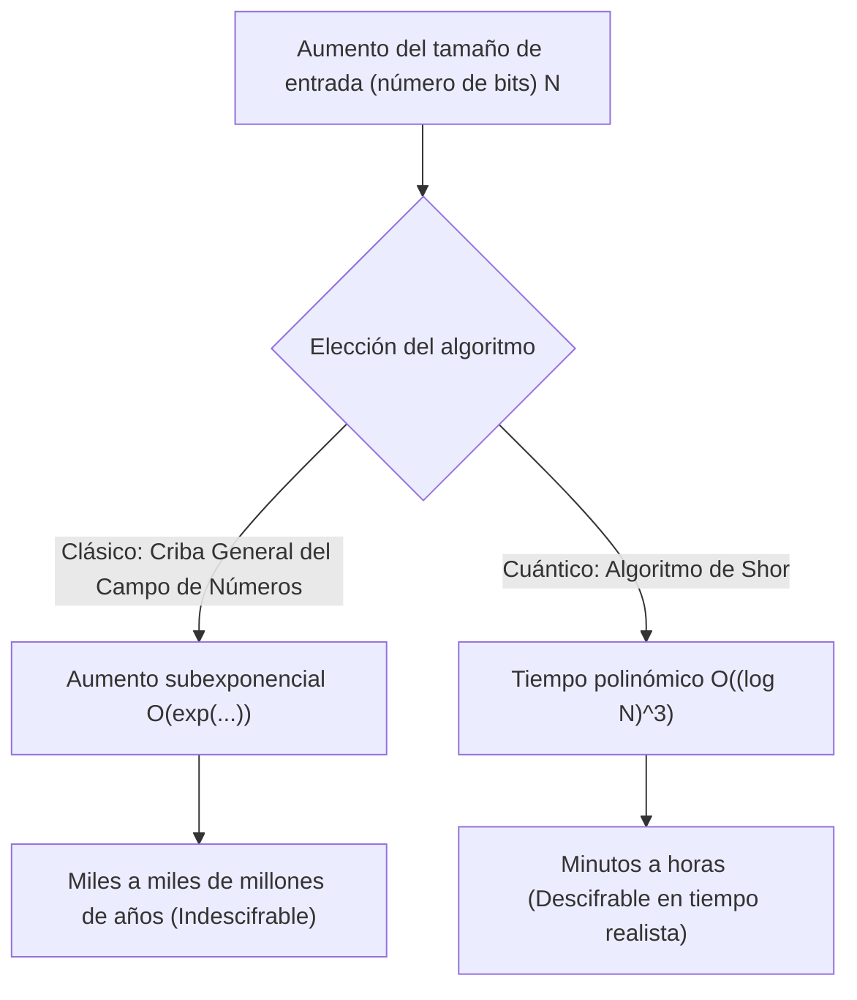
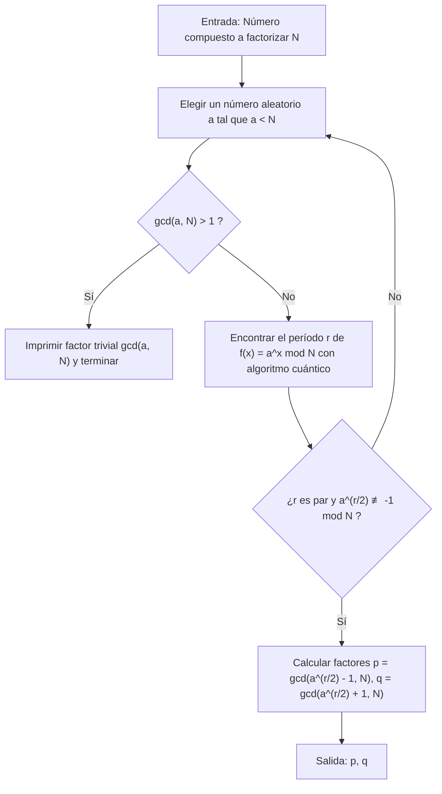
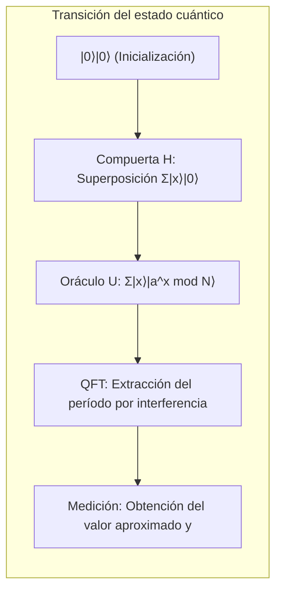

# 1. Introducción: La crisis de la criptografía provocada por las computadoras cuánticas

Gran parte de la seguridad en la sociedad de Internet moderna depende de la **criptografía de clave pública** (especialmente RSA). Cuando enviamos la información de nuestra tarjeta de crédito en compras en línea o intercambiamos datos altamente confidenciales, el contenido de esa comunicación está fuertemente protegido por la criptografía RSA.

La base de la seguridad de la criptografía RSA radica en el hecho matemático de que "**la factorización de números enteros enormes es extremadamente difícil para las computadoras clásicas (las PC y supercomputadoras que usamos normalmente)**". Sin embargo, el "**Algoritmo de Shor (Shor's Algorithm)**", publicado por Peter Shor en 1994, socavó esta premisa desde sus cimientos. Se demostró matemáticamente que, si se ejecuta el algoritmo de Shor en una computadora cuántica a gran escala, la factorización de números primos, que le tomaría a una computadora clásica más tiempo que la edad del universo, puede resolverse en solo unos minutos a unas horas.

En este artículo, explicaremos exhaustiva y detalladamente cómo el algoritmo de Shor realiza la factorización de manera rápida, desde su mecanismo matemático hasta la implementación de una simulación concreta utilizando Python y el marco de computación cuántica **Qiskit**.

---

# 2. Cambio dramático en la complejidad computacional: De tiempo exponencial a polinómico

¿Por qué es difícil la factorización? Incluso si utilizamos la "Criba General del Campo de Números (General Number Field Sieve, GNFS)", conocida como el mejor algoritmo de factorización en computadoras clásicas, su complejidad computacional es subexponencial.

La complejidad temporal para factorizar un número compuesto de $N$ dígitos con métodos clásicos es la siguiente:

$$ O\left(\exp\left( c (\log N)^{1/3} (\log \log N)^{2/3} \right)\right) $$

Por lo tanto, con solo aumentar la longitud de la clave (por ejemplo, a 2048 o 4096 bits), a una computadora clásica le tomará miles o decenas de miles de años descifrarla, un tiempo que no es realista.

Sin embargo, al utilizar el **algoritmo de Shor** en una computadora cuántica, la complejidad computacional se reduce dramáticamente a tiempo polinómico respecto al número de bits de entrada $\log N$.

$$ O((\log N)^3) $$

Esto significa que si se duplica el número de bits, el tiempo de cálculo en una computadora clásica aumentaría astronómicamente, mientras que en una computadora cuántica aumentaría como mucho unas 8 veces. Esta **reducción de la clase de complejidad de tiempo exponencial a polinómico (inclusión en la clase BQP)** es la verdadera grandeza del algoritmo de Shor.



---

# 3. Visión general del algoritmo y fundamentos matemáticos

De hecho, el algoritmo de Shor no realiza todo en la computadora cuántica. Está compuesto por una colaboración entre el preprocesamiento y posprocesamiento mediante una computadora clásica y la parte central (algoritmo de búsqueda de período) realizada por la computadora cuántica.

El flujo general del algoritmo es el siguiente:



## Reducción del problema de factorización al problema de búsqueda de período

La genialidad de Shor consistió en transformar el "**problema de factorización**" en el "**problema de búsqueda de período (Order Finding Problem)**".

Consideremos un entero $N$ (el número que queremos factorizar) y un entero $a$ coprimo con $N$ ($1 < a < N$). Definimos la siguiente función exponencial modular:

$$ f(x) = a^x \bmod N $$

Esta función tiene un cierto período $r$. Es decir, para cualquier $x$, se cumple que $f(x+r) = f(x)$. Especialmente cuando $x=0$,

$$ a^r \equiv 1 \pmod N $$

El número entero positivo más pequeño $r$ que cumple esto se llama el "orden (Order) de $a$ módulo $N$". Si podemos encontrar este período $r$, podemos deducir los factores primos de la siguiente manera.

Transformando la ecuación,
$$ a^r - 1 \equiv 0 \pmod N $$
Si $r$ es par, se puede factorizar usando la fórmula de diferencia de cuadrados.
$$ (a^{r/2} - 1)(a^{r/2} + 1) \equiv 0 \pmod N $$

Esto significa que $N$ tiene un factor común con $(a^{r/2} - 1)$ o con $(a^{r/2} + 1)$ (siempre que se cumpla la condición $a^{r/2} \not\equiv -1 \pmod N$). Por lo tanto, utilizando el algoritmo de Euclides, calculando

$$ p = \gcd(a^{r/2} - 1, N) $$
$$ q = \gcd(a^{r/2} + 1, N) $$

podemos encontrar los factores primos no triviales $p, q$ de $N$. Este cálculo (el cálculo del máximo común divisor y la generación de números aleatorios) se puede realizar de manera muy rápida en una computadora clásica. El problema se reduce a **cómo encontrar rápidamente el período $r$**. En una computadora clásica, encontrar este período $r$ en sí mismo requiere un tiempo exponencial. Aquí es donde entra en juego la computadora cuántica.

---

# 4. Parte del algoritmo cuántico: Mecanismo de búsqueda de período

La subrutina para encontrar el período $r$ utilizando una computadora cuántica consta de los siguientes cuatro pasos.



## Paso 1: Inicialización de los registros cuánticos y superposición

Primero, preparamos dos registros cuánticos. El primer registro es para la entrada de estado, y el segundo registro es para almacenar el resultado del cálculo de la función.
El estado inicial es todo $|0\rangle$.

$$ |\psi_0\rangle = |0\rangle_1 |0\rangle_2 $$

Aplicamos la compuerta de Hadamard (Hadamard Gate) a todos los qubits del primer registro, creando un estado de superposición equiprobable de todas las entradas posibles $x$ (desde $0$ hasta $Q-1$, $Q=2^n$).

$$ |\psi_1\rangle = \frac{1}{\sqrt{Q}} \sum_{x=0}^{Q-1} |x\rangle_1 |0\rangle_2 $$

De esta manera, la computadora cuántica mantendrá los estados de todas las $Q$ entradas simultáneamente en una sola operación. Esta es la poderosa fuente del **paralelismo cuántico**.

## Paso 2: Aplicación de la función oráculo (exponenciación modular)

A continuación, utilizamos el circuito de operación cuántica $U_f$ para calcular la función $f(x) = a^x \bmod N$ y almacenamos el resultado en el segundo registro.

$$ |\psi_2\rangle = \frac{1}{\sqrt{Q}} \sum_{x=0}^{Q-1} |x\rangle_1 |a^x \bmod N\rangle_2 $$

En este punto, el primer y el segundo registro se encuentran en un estado de **entrelazamiento cuántico (Entanglement)**. Si (hipotéticamente) observáramos el segundo registro y obtuviéramos un valor específico $k = a^{x_0} \bmod N$, el estado del primer registro colapsaría a una superposición de las $x$ que producen ese valor $k$. Dado que el período de la función es $r$, los estados restantes serán valores separados por $r$: $x_0, x_0+r, x_0+2r, \dots$

$$ |\psi_3\rangle = \sqrt{\frac{r}{Q}} \sum_{j=0}^{M-1} |x_0 + j r\rangle_1 |k\rangle_2 $$

Sin embargo, no queremos conocer $x_0$, sino el período $r$ en sí. Es imposible observar $r$ directamente desde este estado. Por lo tanto, utilizamos la transformada de Fourier cuántica.

## Paso 3: Interferencia de fase mediante la Transformada de Fourier Cuántica (QFT)

Aplicamos la **Transformada de Fourier Cuántica (Quantum Fourier Transform, QFT)** al primer registro. La QFT es la versión cuántica de la transformada de Fourier discreta clásica y transforma la amplitud del vector de estado. La acción de la QFT sobre el estado base $|x\rangle$ se define de la siguiente manera:

$$ QFT |x\rangle = \frac{1}{\sqrt{Q}} \sum_{y=0}^{Q-1} \omega^{xy} |y\rangle $$

Aquí, $\omega = e^{2\pi i / Q}$.

Al aplicar la QFT, las amplitudes de estado interfieren. Omitiendo los detalles matemáticos, cuando se aplica la QFT a un estado con período $r$, las ondas causan una **interferencia constructiva (Constructive Interference)** solo cuando $y$ es un valor extremadamente cercano a un múltiplo entero de $Q/r$. Para los demás estados, las amplitudes de probabilidad se anulan debido a la **interferencia destructiva (Destructive Interference)** y se acercan a cero.

## Paso 4: Medición y expansión en fracciones continuas

Finalmente, medimos el primer registro. El valor $y$ obtenido de la medición satisfará la siguiente condición con alta probabilidad:

$$ y \approx c \frac{Q}{r} \implies \frac{y}{Q} \approx \frac{c}{r} $$

($c$ es un entero desconocido tal que $0 \le c < r$)

Al aplicar el algoritmo clásico de **expansión en fracciones continuas (Continued Fraction Expansion)** al número racional obtenido $y/Q$, calculamos la fracción aproximada $c/r$ y extraemos el período $r$ del denominador.

---

# 5. Implementación de simulación utilizando Python y Qiskit

Dado que la teoría por sí sola puede ser difícil de visualizar, simulemos realmente el algoritmo de Shor utilizando Python y el marco de cálculo cuántico de IBM, **Qiskit**.

Aquí implementaremos el escenario más clásico y famoso: **"factorizar $N=15$ utilizando $a=7$"**.

## Preparación del entorno de ejecución

Instala Qiskit de antemano.

```bash
pip install qiskit qiskit-aer numpy
```

## Resumen del código de implementación en Python

El siguiente código es un ejemplo de implementación del algoritmo de Shor especializado para $N=15, a=7$. Construir un circuito de exponenciación modular de propósito general tiene un costo computacional demasiado alto para los simuladores actuales, por lo que las operaciones de las compuertas para el caso específico de $a=7$ están programadas en duro (hardcoded).

```python
import numpy as np
from qiskit import QuantumCircuit
from qiskit_aer import AerSimulator
from qiskit.visualization import plot_histogram
from fractions import Fraction
import math

# 1. Función para construir la Transformada de Fourier Cuántica Inversa (QFT†)
def qft_dagger(n):
    """Genera un circuito de transformada de Fourier cuántica inversa de n qubits"""
    qc = QuantumCircuit(n)
    # Compuertas SWAP para invertir el orden
    for qubit in range(n//2):
        qc.swap(qubit, n-qubit-1)
    # Aplicación de compuertas de fase controladas y compuertas H
    for j in range(n):
        for m in range(j):
            qc.cp(-np.pi/float(2**(j-m)), m, j)
        qc.h(j)
    qc.name = "QFT_dagger"
    return qc

# 2. Función para construir la operación de exponenciación modular controlada 7^x mod 15
def c_amod15(a, power):
    """Genera una compuerta U controlada para un a específico y su potencia (exclusivo para N=15)"""
    U = QuantumCircuit(4)        
    for _ in range(power):
        # Lógica de codificación dura (hardcoding) de 7^x mod 15 para el caso a=7
        if a in [2,13]:
            U.swap(2,3)
            U.swap(1,2)
            U.swap(0,1)
        if a in [7,8]:
            U.swap(0,1)
            U.swap(1,2)
            U.swap(2,3)
        if a in [4, 11]:
            U.swap(1,3)
            U.swap(0,2)
        if a in [7,11,13]:
            for q in range(4):
                U.x(q)
    U = U.to_gate()
    U.name = f"{a}^{power} mod 15"
    c_U = U.control()
    return c_U

# 3. Construcción del circuito cuántico principal
def shor_circuit(a, n_count):
    # n_count: Número de bits del registro de control
    # El registro objetivo requiere 4 bits para representar de 0 a 15
    qc = QuantumCircuit(n_count + 4, n_count)
    
    # Inicialización del primer registro (registro de control) (generación de superposición)
    for q in range(n_count):
        qc.h(q)
        
    # Inicialización del segundo registro (registro objetivo) a |1> (0001)
    qc.x(3 + n_count)
    
    # Aplicación de la operación de exponenciación modular controlada (Oráculo)
    for q in range(n_count):
        # Aplicación de la operación elevada a la potencia 2^q
        qc.append(c_amod15(a, 2**q), 
                 [q] + [i+n_count for i in range(4)])
        
    # Aplicación de la transformada de Fourier cuántica inversa al primer registro
    qc.append(qft_dagger(n_count), range(n_count))
    
    # Medición del primer registro
    qc.measure(range(n_count), range(n_count))
    return qc

# --- Sección de ejecución ---
if __name__ == "__main__":
    N = 15
    a = 7
    n_count = 8  # Uso de 8 qubits para el registro de control (Q=256)
    
    print(f"Configuración de búsqueda: N={N}, a={a}, qubits de control={n_count}")
    
    # Generación del circuito
    qc = shor_circuit(a, n_count)
    
    # Ejecución en el simulador
    sim = AerSimulator()
    # Se recomienda usar transpile en las versiones recientes de Qiskit
    from qiskit import transpile
    compiled_circuit = transpile(qc, sim)
    job = sim.run(compiled_circuit, shots=1024)
    result = job.result()
    counts = result.get_counts()
    
    print("\nResultados de medición (cadena de bits: número de observaciones):")
    for bitstring, count in counts.items():
        print(f"  {bitstring}: {count} veces")
        
    # Posprocesamiento clásico: Identificación del período r mediante expansión de fracciones continuas
    print("\n--- Cálculo del período y factorización ---")
    phases = []
    for output in counts:
        # Convertir cadena de bits a número decimal
        decimal = int(output, 2)
        # Fase = valor medido / 2^n_count
        phase = decimal / (2**n_count)
        phases.append(phase)
        
        # Obtener la fracción aproximada por expansión de fracciones continuas. El límite del denominador es N=15
        frac = Fraction(phase).limit_denominator(15)
        r = frac.denominator
        
        print(f"Valor observado: {decimal:3d} | Fase: {phase:.4f} | Fracción continua: {frac} | Período estimado r = {r}")
        
        # Comprobar si el período r es par y produce resultados válidos
        if r % 2 == 0:
            guess1 = math.gcd(a**(r//2) - 1, N)
            guess2 = math.gcd(a**(r//2) + 1, N)
            if guess1 not in [1, N] or guess2 not in [1, N]:
                print(f"  => ¡Éxito! Los factores primos de {N} son {guess1} y {guess2}.")
            else:
                print(f"  => Solo factores triviales. Intentando de nuevo.")
        else:
            print(f"  => Fallo porque el período es impar.")
```

## Explicación del código y análisis de los resultados de ejecución

Al ejecutar el código anterior, como resultado de la medición del registro de control, se obtienen picos específicos (valores observados) con alta probabilidad. En el caso de `n_count=8` ($Q=256$), si se trata de una computadora cuántica ideal (o un simulador), los valores observados como `0`, `64`, `128` y `192` aparecerán con una probabilidad abrumadora.

Si dividimos estos valores por $Q=256$, las fases $y/Q$ serán $0.0$, $0.25$, $0.5$ y $0.75$, respectivamente.
Al expandir estas fases en fracciones continuas, obtenemos:
- $0.25 \to 1/4$ (Período estimado $r=4$)
- $0.50 \to 1/2$ (Período estimado $r=2$)
- $0.75 \to 3/4$ (Período estimado $r=4$)

Utilizando el período obtenido $r=4$, calculamos los factores primos.
Dado que $a=7, r=4$,
$p = \gcd(7^2 - 1, 15) = \gcd(48, 15) = 3$
$q = \gcd(7^2 + 1, 15) = \gcd(50, 15) = 5$

Impresionantemente, hemos tenido éxito en la factorización de $15 = 3 \times 5$.

> [!TIP]
> Si se obtiene $y=128$ (fase $0.5$) como valor de medición, el denominador será $2$, y obtendremos un divisor del verdadero período $r=4$ en lugar del período real. En tales casos, se puede llegar al verdadero período ejecutando el algoritmo varias veces o examinando los múltiplos del $r$ obtenido.

---

# 6. Desafíos para la implementación práctica y los límites de la era NISQ

Si bien fue fácil factorizar $N=15$ en un simulador, factorizar RSA-2048 (un número decimal de 617 dígitos) utilizado en el mundo real presenta numerosos obstáculos para las computadoras cuánticas actuales.

La época en la que vivimos actualmente se llama la **era NISQ (Noisy Intermediate-Scale Quantum: Cuántica de Escala Intermedia Ruidosa)**. Los qubits son extremadamente vulnerables al ruido ambiental y sufren "decoherencia" durante los cálculos, lo que destruye su estado.

Para ejecutar con precisión circuitos profundos (con muchas compuertas) como el algoritmo de Shor, la **corrección de errores cuánticos (Quantum Error Correction)**, que corrige el ruido, es indispensable. Para crear un solo "qubit lógico" sin ruido, es necesario codificar miles de "qubits físicos" utilizando un código de superficie (Surface Code) u otros métodos.

Se estima que para romper la criptografía RSA de 2048 bits se requieren miles de qubits lógicos perfectos, y lograr esto requeriría una computadora cuántica tolerante a fallos (fault-tolerant) equipada con **millones a decenas de millones de qubits físicos**. Dado que los procesadores cuánticos más avanzados de la actualidad tienen solo unos cientos a unos pocos miles de qubits físicos, la criptografía mundial no se romperá de manera inminente.

> [!WARNING]
> Sin embargo, existe un modelo de amenaza llamado "Store Now, Decrypt Later (Almacenar ahora, descifrar después)". Los atacantes podrían adoptar la estrategia de almacenar masivamente comunicaciones confidenciales actualmente encriptadas en forma de datos cifrados, con el objetivo de descifrarlo todo en el momento en que se complete una computadora cuántica poderosa dentro de 10 a 20 años.

---

# 7. Transición hacia la Criptografía Post-Cuántica (PQC)

En preparación para la llegada de ese "Día Q (Q-Day)" (el día en que las computadoras cuánticas rompan la criptografía), los criptógrafos de todo el mundo, liderados por el Instituto Nacional de Estándares y Tecnología de EE. UU. (NIST), están avanzando en el desarrollo de la **Criptografía Post-Cuántica (Post-Quantum Cryptography, PQC)**.

La PQC se basa en nuevos problemas matemáticos (problemas basados en retículos, polinomios multivariantes, funciones hash, etc.) que se consideran matemáticamente difíciles de resolver de manera eficiente incluso utilizando el algoritmo de Shor (o el algoritmo de Grover). Algoritmos como "CRYSTALS-Kyber" y "CRYSTALS-Dilithium" ya han sido seleccionados como estándares y su implementación en protocolos de comunicación para navegadores web e iMessage de Apple está comenzando gradualmente.

Para los ingenieros que gestionan la infraestructura de TI, incorporar "agilidad criptográfica (crypto-agility: la capacidad del diseño para cambiar rápidamente los esquemas criptográficos)" en sus sistemas para hacer la transición desde la actual RSA y la criptografía de curva elíptica a PQC será una misión importante en el futuro.

---

# 8. Conclusión

En este artículo, hemos proporcionado una explicación exhaustiva de aproximadamente 10,000 caracteres, que abarca desde los fundamentos teóricos y matemáticos del algoritmo de Shor hasta el mecanismo de extracción de períodos mediante la transformada de Fourier cuántica y, finalmente, un código de simulación concreto utilizando Python y Qiskit.

El hecho de que las leyes físicas del mundo microscópico de la mecánica cuántica estén subvirtiendo fundamentalmente la teoría de la complejidad computacional y la teoría de la criptografía, que son la base de la ciencia de la información macroscópica, es uno de los cambios de paradigma más emocionantes en la historia de la ciencia. No podemos quitarle los ojos de encima a las continuas batallas ofensivas y defensivas entre la tecnología de la computación cuántica, que continúa desarrollándose en tiempo real, y las nuevas tecnologías criptográficas que la enfrentan.

Te invitamos a ejecutar el código de Python presentado aquí en tu propio entorno para experimentar la "magia computacional" producida por la superposición de estados cuánticos y la interferencia.

---
**Referencias**
- Shor, P. W. (1994). "Algorithms for quantum computation: discrete logarithms and factoring". Proceedings 35th Annual Symposium on Foundations of Computer Science.
- Nielsen, M. A., & Chuang, I. L. (2010). "Quantum Computation and Quantum Information". Cambridge University Press.
- Qiskit Documentation: https://qiskit.org/documentation/

