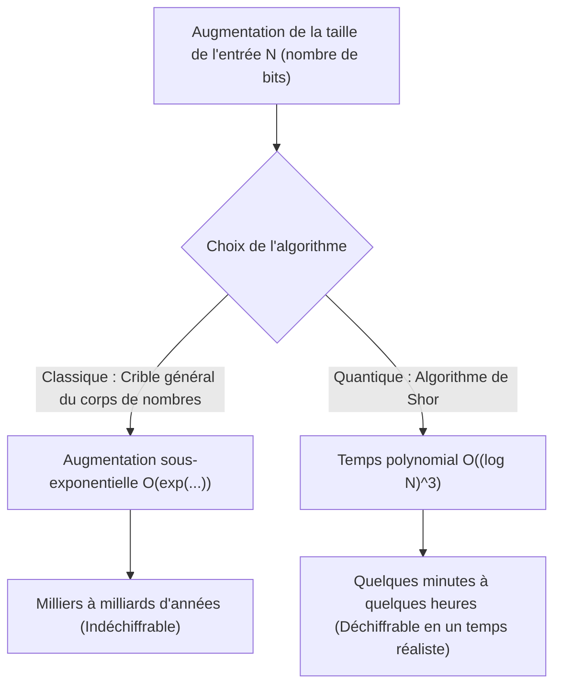
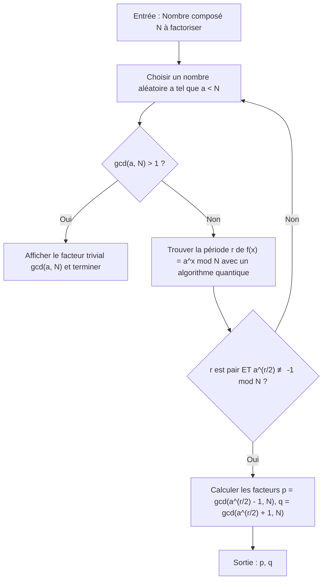
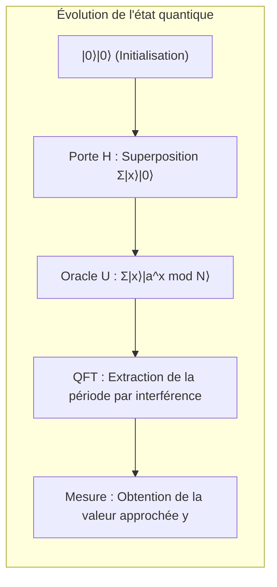

# 1. Introduction : La crise de la cryptographie provoquée par les ordinateurs quantiques

Une grande partie de la sécurité dans notre société Internet moderne repose sur la **cryptographie à clé publique** (en particulier le chiffrement RSA). Lorsque nous transmettons nos informations de carte de crédit lors d'achats en ligne ou que nous échangeons des données hautement confidentielles, ces communications sont solidement protégées par le chiffrement RSA.

La sécurité du chiffrement RSA repose sur un fait mathématique : « **la factorisation en nombres premiers de très grands entiers est extrêmement difficile pour les ordinateurs classiques (les PC ou supercalculateurs que nous utilisons habituellement)** ». Cependant, l'« **algorithme de Shor** » (Shor's Algorithm), publié en 1994 par Peter Shor, a complètement remis en cause ce postulat. Il a été prouvé mathématiquement que si l'algorithme de Shor était exécuté sur un ordinateur quantique à grande échelle, il pourrait résoudre en quelques minutes ou quelques heures une factorisation qui prendrait plus de temps que l'âge de l'univers sur un ordinateur classique.

Dans cet article, nous expliquerons en détail comment cet algorithme de Shor parvient à effectuer cette factorisation à grande vitesse, de son mécanisme mathématique jusqu'à une implémentation de simulation concrète en Python utilisant le framework de calcul quantique **Qiskit**.

---

# 2. Le changement spectaculaire de la complexité : De la fonction exponentielle au temps polynomial

Pourquoi la factorisation en nombres premiers est-elle si difficile ? Même en utilisant le « crible général du corps de nombres » (General Number Field Sieve, GNFS), connu comme le meilleur algorithme de factorisation pour les ordinateurs classiques, sa complexité en temps reste sous-exponentielle.

La complexité en temps pour factoriser un nombre composé de $N$ chiffres avec une méthode classique est la suivante :

$$ O\left(\exp\left( c (\log N)^{1/3} (\log \log N)^{2/3} \right)\right) $$

Pour cette raison, il suffit d'augmenter la longueur de la clé (par exemple à 2048 ou 4096 bits) pour que le temps de décryptage sur un ordinateur classique devienne irréaliste, atteignant des milliers ou des dizaines de milliers d'années.

Cependant, en utilisant l'**algorithme de Shor** sur un ordinateur quantique, la complexité est considérablement réduite à un temps polynomial par rapport au nombre de bits d'entrée $\log N$.

$$ O((\log N)^3) $$

Cela signifie que si l'on double le nombre de bits, le temps de calcul augmente de manière astronomique pour un ordinateur classique, alors qu'il n'est multiplié que par 8 environ pour un ordinateur quantique. Cette **réduction de la classe de complexité d'un temps exponentiel à un temps polynomial (inclusion dans la classe BQP)** est ce qui rend l'algorithme de Shor si impressionnant.



---

# 3. Vue d'ensemble de l'algorithme et contexte mathématique

En réalité, l'algorithme de Shor n'effectue pas toutes les opérations sur un ordinateur quantique. Il repose sur la collaboration entre des pré-traitements et post-traitements par un ordinateur classique, et la partie centrale (l'algorithme de recherche de période) exécutée par un ordinateur quantique.

Le flux global de l'algorithme est le suivant :



## Réduction de la factorisation au problème de recherche de période

L'intuition géniale de Shor réside dans la transformation du « **problème de factorisation** » en un « **problème de recherche de période** » (Order Finding Problem).

Considérons un entier $N$ (le nombre à factoriser) et un entier premier avec lui $a$ ($1 < a < N$). Nous définissons la fonction d'exponentiation modulaire suivante :

$$ f(x) = a^x \bmod N $$

Cette fonction possède une certaine période $r$. Cela signifie que pour tout $x$, on a $f(x+r) = f(x)$. En particulier pour $x=0$, le plus petit entier positif $r$ tel que :

$$ a^r \equiv 1 \pmod N $$

est appelé l'« ordre » (Order) de $a$ modulo $N$. Si nous parvenons à trouver cette période $r$, nous pouvons en déduire les facteurs premiers de la manière suivante.

En transformant l'équation, on obtient :
$$ a^r - 1 \equiv 0 \pmod N $$
Si $r$ est pair, nous pouvons factoriser en utilisant la différence de deux carrés :
$$ (a^{r/2} - 1)(a^{r/2} + 1) \equiv 0 \pmod N $$

Cela implique que $N$ partage un diviseur commun avec $(a^{r/2} - 1)$ ou $(a^{r/2} + 1)$ (à condition que $a^{r/2} \not\equiv -1 \pmod N$). Ainsi, en utilisant l'algorithme d'Euclide pour calculer :

$$ p = \gcd(a^{r/2} - 1, N) $$
$$ q = \gcd(a^{r/2} + 1, N) $$

nous pouvons trouver des facteurs non triviaux $p$ et $q$ de $N$. Ces calculs (le plus grand commun diviseur et la génération de nombres aléatoires) sont très rapides sur un ordinateur classique. Le cœur du problème est donc de savoir **comment trouver rapidement la période $r$**. Sur un ordinateur classique, trouver cette période requiert un temps exponentiel. C'est ici que l'ordinateur quantique entre en jeu.

---

# 4. La partie algorithmique quantique : Le mécanisme de recherche de période

La sous-routine permettant de trouver la période $r$ à l'aide d'un ordinateur quantique se compose des 4 étapes suivantes :



## Étape 1 : Initialisation des registres quantiques et superposition

Tout d'abord, nous préparons deux registres quantiques. Le premier registre sert à entrer l'état, et le second sert à stocker le résultat du calcul de la fonction.
L'état initial est entièrement $|0\rangle$.

$$ |\psi_0\rangle = |0\rangle_1 |0\rangle_2 $$

Nous appliquons une porte de Hadamard (Hadamard Gate) à tous les qubits du premier registre, créant un état de superposition équiprobable de toutes les entrées possibles $x$ (de $0$ à $Q-1$, avec $Q=2^n$).

$$ |\psi_1\rangle = \frac{1}{\sqrt{Q}} \sum_{x=0}^{Q-1} |x\rangle_1 |0\rangle_2 $$

Ainsi, l'ordinateur quantique conserve simultanément l'état pour les $Q$ entrées en une seule opération. C'est la source puissante du **parallélisme quantique**.

## Étape 2 : Application de la fonction oracle (exponentiation modulaire)

Ensuite, nous utilisons un circuit quantique $U_f$ pour calculer la fonction $f(x) = a^x \bmod N$ et stockons le résultat dans le second registre.

$$ |\psi_2\rangle = \frac{1}{\sqrt{Q}} \sum_{x=0}^{Q-1} |x\rangle_1 |a^x \bmod N\rangle_2 $$

À ce stade, le premier et le second registre sont dans un état d'**intrication quantique** (entanglement). Si (hypothétiquement) nous observions le second registre et obtenions une valeur spécifique $k = a^{x_0} \bmod N$, l'état du premier registre s'effondrerait sur la superposition des $x$ qui donnent cette valeur $k$. Puisque la fonction a une période $r$, les états restants seront espacés de $r$, soit $x_0, x_0+r, x_0+2r, \dots$.

$$ |\psi_3\rangle = \sqrt{\frac{r}{Q}} \sum_{j=0}^{M-1} |x_0 + j r\rangle_1 |k\rangle_2 $$

Cependant, ce n'est pas $x_0$ que nous voulons connaître, mais la période $r$ elle-même. Il est impossible d'observer directement $r$ à partir de cet état. C'est pourquoi nous utilisons la transformée de Fourier quantique.

## Étape 3 : Interférence de phase par la transformée de Fourier quantique (QFT)

Nous appliquons la **transformée de Fourier quantique** (Quantum Fourier Transform, QFT) au premier registre. La QFT est la version quantique de la transformée de Fourier discrète classique et convertit les amplitudes des vecteurs d'état. L'action de la QFT sur l'état de base $|x\rangle$ est définie comme suit :

$$ QFT |x\rangle = \frac{1}{\sqrt{Q}} \sum_{y=0}^{Q-1} \omega^{xy} |y\rangle $$

Où $\omega = e^{2\pi i / Q}$.

Lorsque la QFT est appliquée, les amplitudes de l'état interfèrent. Bien que nous omettions les détails mathématiques, lorsqu'on applique la QFT à un état ayant une période $r$, les ondes provoquent une **interférence constructive** uniquement lorsque $y$ est très proche d'un multiple entier de $Q/r$. Pour les autres états, les amplitudes de probabilité s'annulent à cause d'une **interférence destructive** et s'approchent de zéro.

## Étape 4 : Mesure et développement en fractions continues

Enfin, nous mesurons le premier registre. La valeur mesurée $y$ satisfait très probablement à la condition suivante :

$$ y \approx c \frac{Q}{r} \implies \frac{y}{Q} \approx \frac{c}{r} $$

($c$ est un entier inconnu tel que $0 \le c < r$)

En appliquant un algorithme classique de **développement en fractions continues** (Continued Fraction Expansion) au nombre rationnel obtenu $y/Q$, nous pouvons calculer la fraction approchée $c/r$ et extraire la période $r$ du dénominateur.

---

# 5. Implémentation de simulation avec Python et Qiskit

Puisque la théorie seule peut être abstraite, simulons l'algorithme de Shor en pratique avec Python et le framework quantique d'IBM, **Qiskit**.

Nous implémenterons ici le scénario le plus classique et le plus célèbre : **« factoriser $N=15$ en utilisant $a=7$ »**.

## Préparation de l'environnement d'exécution

Veuillez installer Qiskit au préalable.

```bash
pip install qiskit qiskit-aer numpy
```

## Aperçu du code de l'implémentation Python

Le code suivant est un exemple d'implémentation de l'algorithme de Shor spécifiquement pour $N=15$ et $a=7$. Étant donné que le coût de calcul pour construire un circuit d'exponentiation modulaire généralisé est trop élevé sur les simulateurs actuels, la logique des portes pour le cas particulier de $a=7$ a été codée en dur (hardcoded).

```python
import numpy as np
from qiskit import QuantumCircuit
from qiskit_aer import AerSimulator
from qiskit.visualization import plot_histogram
from fractions import Fraction
import math

# 1. Fonction pour construire la transformée de Fourier quantique inverse (QFT†)
def qft_dagger(n):
    """Génère le circuit de la transformée de Fourier quantique inverse pour n qubits"""
    qc = QuantumCircuit(n)
    # Portes SWAP pour inverser l'ordre
    for qubit in range(n//2):
        qc.swap(qubit, n-qubit-1)
    # Application des portes de phase contrôlée et H
    for j in range(n):
        for m in range(j):
            qc.cp(-np.pi/float(2**(j-m)), m, j)
        qc.h(j)
    qc.name = "QFT_dagger"
    return qc

# 2. Fonction pour construire l'opération contrôlée d'exponentiation modulaire 7^x mod 15
def c_amod15(a, power):
    """Génère la porte U contrôlée pour un 'a' spécifique et une puissance (Dédié à N=15)"""
    U = QuantumCircuit(4)        
    for _ in range(power):
        # Logique codée en dur pour 7^x mod 15 avec a=7
        if a in [2,13]:
            U.swap(2,3)
            U.swap(1,2)
            U.swap(0,1)
        if a in [7,8]:
            U.swap(0,1)
            U.swap(1,2)
            U.swap(2,3)
        if a in [4, 11]:
            U.swap(1,3)
            U.swap(0,2)
        if a in [7,11,13]:
            for q in range(4):
                U.x(q)
    U = U.to_gate()
    U.name = f"{a}^{power} mod 15"
    c_U = U.control()
    return c_U

# 3. Construction du circuit quantique principal
def shor_circuit(a, n_count):
    # n_count : nombre de bits du registre de contrôle
    # Le registre cible utilise 4 bits pour représenter de 0 à 15
    qc = QuantumCircuit(n_count + 4, n_count)
    
    # Initialisation du 1er registre (registre de contrôle) pour créer la superposition
    for q in range(n_count):
        qc.h(q)
        
    # Initialisation du 2ème registre (registre cible) à |1> (0001)
    qc.x(3 + n_count)
    
    # Application de l'opération d'exponentiation modulaire contrôlée (Oracle)
    for q in range(n_count):
        # Applique l'opération à la puissance 2^q
        qc.append(c_amod15(a, 2**q), 
                 [q] + [i+n_count for i in range(4)])
        
    # Application de la transformée de Fourier quantique inverse au 1er registre
    qc.append(qft_dagger(n_count), range(n_count))
    
    # Mesure du 1er registre
    qc.measure(range(n_count), range(n_count))
    return qc

# --- Section d'exécution ---
if __name__ == "__main__":
    N = 15
    a = 7
    n_count = 8  # Utilisation de 8 qubits pour le registre de contrôle (Q=256)
    
    print(f"Paramètres de recherche : N={N}, a={a}, qubits de contrôle={n_count}")
    
    # Génération du circuit
    qc = shor_circuit(a, n_count)
    
    # Exécution avec le simulateur
    sim = AerSimulator()
    # La transpilation est recommandée dans les versions récentes de Qiskit
    from qiskit import transpile
    compiled_circuit = transpile(qc, sim)
    job = sim.run(compiled_circuit, shots=1024)
    result = job.result()
    counts = result.get_counts()
    
    print("\nRésultats de la mesure (chaîne de bits : nombre d'observations) :")
    for bitstring, count in counts.items():
        print(f"  {bitstring} : {count} fois")
        
    # Post-traitement classique : Détermination de la période r via les fractions continues
    print("\n--- Calcul de la période et factorisation ---")
    phases = []
    for output in counts:
        # Conversion de la chaîne de bits en décimal
        decimal = int(output, 2)
        # Phase = valeur mesurée / 2^n_count
        phase = decimal / (2**n_count)
        phases.append(phase)
        
        # Obtention de la fraction approchée. Le dénominateur max est N=15
        frac = Fraction(phase).limit_denominator(15)
        r = frac.denominator
        
        print(f"Mesure : {decimal:3d} | Phase : {phase:.4f} | Fraction continue : {frac} | Période estimée r = {r}")
        
        # Vérification : la période r est-elle paire et produit-elle un résultat valide ?
        if r % 2 == 0:
            guess1 = math.gcd(a**(r//2) - 1, N)
            guess2 = math.gcd(a**(r//2) + 1, N)
            if guess1 not in [1, N] or guess2 not in [1, N]:
                print(f"  => Succès ! Les facteurs de {N} sont {guess1} et {guess2}.")
            else:
                print(f"  => Facteurs triviaux uniquement. À refaire.")
        else:
            print(f"  => Échec car la période est impaire.")
```

## Explication du code et analyse des résultats

L'exécution du code ci-dessus montre des pics spécifiques (valeurs mesurées) avec une forte probabilité pour le registre de contrôle. Dans le cas où `n_count=8` ($Q=256$), si nous avions un ordinateur quantique idéal (ou un simulateur), les valeurs `0`, `64`, `128`, `192` apparaîtraient avec une probabilité écrasante.

En divisant ces valeurs par $Q=256$, nous obtenons les phases respectives $y/Q$ de $0.0$, $0.25$, $0.5$ et $0.75$.
Le développement en fractions continues de ces phases donne :
- $0.25 \to 1/4$ (Période estimée $r=4$)
- $0.50 \to 1/2$ (Période estimée $r=2$)
- $0.75 \to 3/4$ (Période estimée $r=4$)

En utilisant la période $r=4$ ainsi obtenue, nous calculons les facteurs premiers.
Puisque $a=7$ et $r=4$,
$p = \gcd(7^2 - 1, 15) = \gcd(48, 15) = 3$
$q = \gcd(7^2 + 1, 15) = \gcd(50, 15) = 5$

Nous avons réussi brillamment la factorisation de $15 = 3 \times 5$.

> [!TIP]
> Si la valeur mesurée est $y=128$ (phase $0.5$), le dénominateur devient $2$, et nous obtenons un diviseur de la vraie période au lieu de $r=4$. Dans ce cas, nous pouvons relancer l'algorithme ou tester les multiples de la période $r$ obtenue pour trouver la vraie période.

---

# 6. Défis pour l'application pratique et les limites de l'ère NISQ

Bien qu'il soit facile de factoriser $N=15$ sur un simulateur, factoriser le chiffrement RSA-2048 utilisé dans le monde réel (un nombre de 617 chiffres) se heurte encore à de nombreux obstacles avec les ordinateurs quantiques actuels.

L'époque dans laquelle nous vivons actuellement est appelée l'**ère NISQ (Noisy Intermediate-Scale Quantum : ordinateurs quantiques bruités de taille intermédiaire)**. Les qubits sont extrêmement sensibles au bruit ambiant et subissent de la « décohérence » pendant les calculs, ce qui détruit leur état.

Pour exécuter avec précision un circuit profond (avec de nombreuses portes quantiques) comme l'algorithme de Shor, il est indispensable de disposer de la **correction d'erreurs quantiques** (Quantum Error Correction). Pour créer un seul « qubit logique » sans bruit, il faut encoder des milliers de « qubits physiques » en utilisant des méthodes comme le code de surface (Surface Code).

Pour casser le chiffrement RSA 2048 bits, on estime qu'il faudrait quelques milliers de qubits logiques parfaits, ce qui nécessiterait un ordinateur quantique tolérant aux pannes (fault-tolerant) doté de **plusieurs millions à dizaines de millions de qubits physiques**. Les processeurs quantiques les plus avancés d'aujourd'hui ne comptant que quelques centaines à quelques milliers de qubits physiques, les chiffrements du monde entier ne seront pas brisés dans l'immédiat.

> [!WARNING]
> Cependant, il existe un modèle de menace appelé « Store Now, Decrypt Later » (Sauvegarder maintenant, déchiffrer plus tard). Des attaquants pourraient stocker massivement les communications chiffrées actuelles et les déchiffrer entièrement dans 10 à 20 ans dès qu'un ordinateur quantique suffisamment puissant sera construit.

---

# 7. Transition vers la cryptographie post-quantique (PQC)

Pour se préparer à l'arrivée du « Q-Day » (le jour où les ordinateurs quantiques briseront la cryptographie), les cryptographes du monde entier, menés par le National Institute of Standards and Technology (NIST) américain, élaborent la **cryptographie post-quantique (Post-Quantum Cryptography, PQC)**.

La PQC est basée sur de nouveaux problèmes mathématiques (problèmes de réseaux euclidiens, polynômes multivariés, fonctions de hachage, etc.) que l'on considère impossibles à résoudre efficacement même avec l'algorithme de Shor (ou l'algorithme de Grover). Des algorithmes comme « CRYSTALS-Kyber » et « CRYSTALS-Dilithium » ont déjà été sélectionnés comme normes standards, et leur intégration commence progressivement dans les protocoles de communication des navigateurs web ou iMessage d'Apple.

Pour les ingénieurs qui gèrent les infrastructures informatiques, intégrer l'« agilité cryptographique » (la capacité à changer rapidement de méthode de chiffrement) pour passer du RSA existant ou de la cryptographie sur les courbes elliptiques à la PQC, constituera une mission majeure dans le futur.

---

# 8. Conclusion

Dans cet article, nous avons fourni une explication exhaustive d'environ 10 000 caractères, allant du contexte mathématique théorique de l'algorithme de Shor aux mécanismes d'extraction de période par la transformée de Fourier quantique, jusqu'au code de simulation concret avec Python et Qiskit.

Le fait que les lois physiques du monde microscopique de la mécanique quantique bouleversent fondamentalement les fondations de l'informatique macroscopique telles que la théorie de la complexité et la cryptographie est l'un des changements de paradigme les plus excitants de l'histoire des sciences. Il est crucial de continuer à suivre cette bataille en cours entre l'évolution des technologies informatiques quantiques et les nouvelles technologies cryptographiques conçues pour y résister.

N'hésitez pas à exécuter le code Python présenté dans cet article sur votre propre environnement pour expérimenter la « magie du calcul » créée par la superposition et l'interférence des états quantiques.

---
**Références**
- Shor, P. W. (1994). "Algorithms for quantum computation: discrete logarithms and factoring". Proceedings 35th Annual Symposium on Foundations of Computer Science.
- Nielsen, M. A., & Chuang, I. L. (2010). "Quantum Computation and Quantum Information". Cambridge University Press.
- Documentation Qiskit : https://qiskit.org/documentation/

