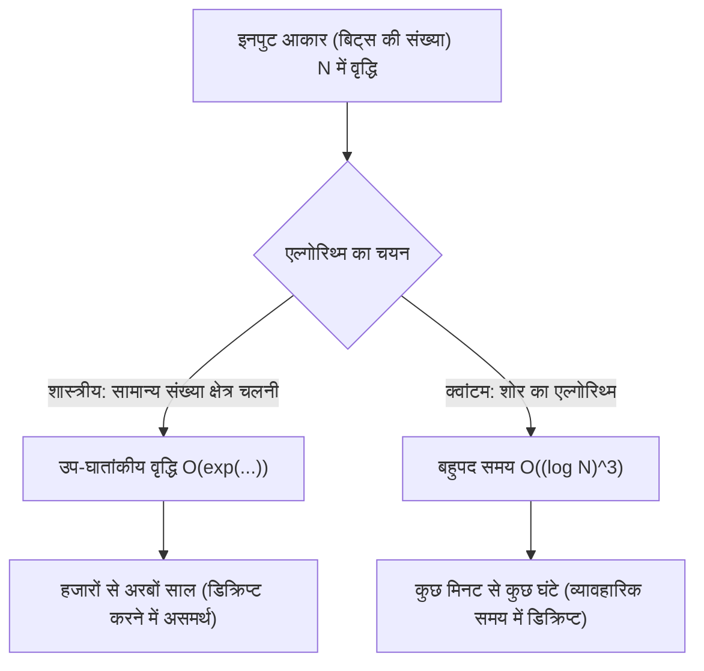
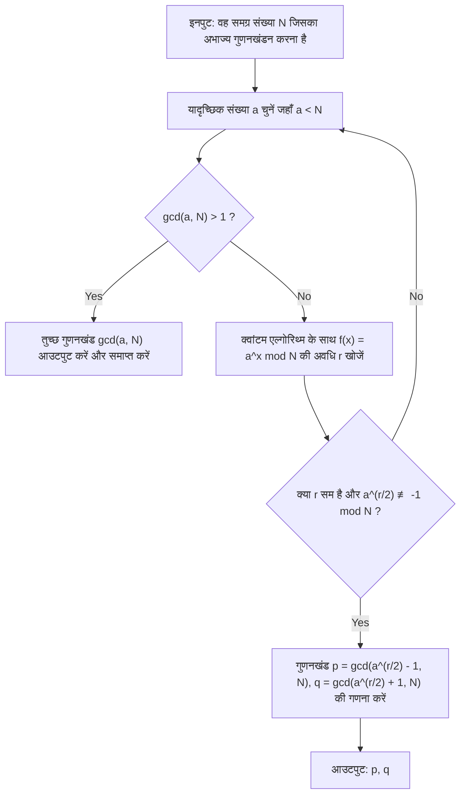
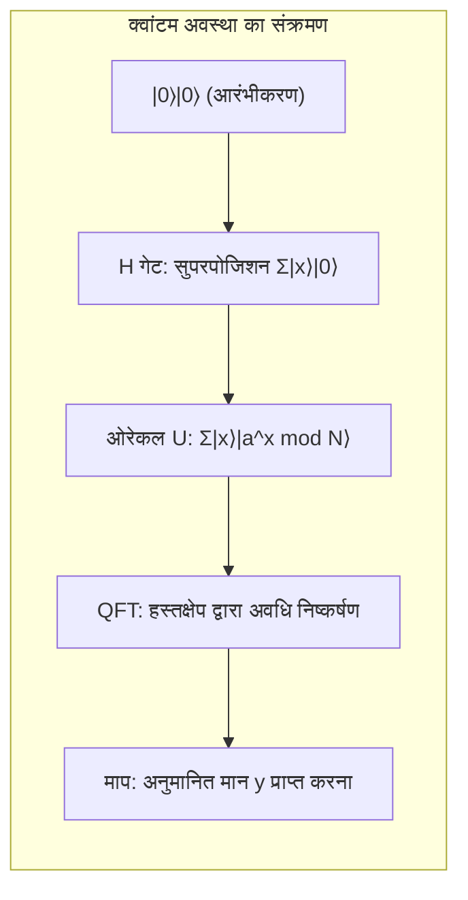

# 1. परिचय: क्वांटम कंप्यूटर द्वारा लाया गया क्रिप्टोग्राफी का संकट

आधुनिक इंटरनेट समाज में सुरक्षा का अधिकांश हिस्सा **सार्वजनिक कुंजी क्रिप्टोग्राफी (Public Key Cryptography)** (विशेष रूप से RSA एन्क्रिप्शन) पर निर्भर करता है। जब हम ऑनलाइन शॉपिंग के दौरान क्रेडिट कार्ड की जानकारी भेजते हैं या अत्यधिक गोपनीय डेटा का आदान-प्रदान करते हैं, तो उस संचार की सामग्री को RSA एन्क्रिप्शन द्वारा दृढ़ता से सुरक्षित किया जाता है।

RSA एन्क्रिप्शन की सुरक्षा का आधार इस गणितीय तथ्य पर निर्भर करता है कि "**एक बहुत बड़े पूर्णांक का अभाज्य गुणनखंडन शास्त्रीय कंप्यूटरों (जैसे पीसी या सुपरकंप्यूटर) के लिए अत्यंत कठिन है**।" हालाँकि, 1994 में पीटर शोर (Peter Shor) द्वारा प्रकाशित "**शोर का एल्गोरिथ्म (Shor's Algorithm)**" इस आधार को पूरी तरह से पलट देता है। यह गणितीय रूप से सिद्ध हो चुका है कि यदि शोर के एल्गोरिथ्म को बड़े पैमाने के क्वांटम कंप्यूटर पर निष्पादित किया जाए, तो अभाज्य गुणनखंडन, जिसे शास्त्रीय कंप्यूटर पर हल करने में ब्रह्मांड की आयु से अधिक समय लग सकता है, उसे केवल कुछ मिनटों से लेकर कुछ घंटों में हल किया जा सकता है।

इस लेख में, हम विस्तार से बताएंगे कि कैसे शोर का एल्गोरिथ्म अभाज्य गुणनखंडन को इतनी तेज़ी से करता है, इसके गणितीय तंत्र से लेकर, क्वांटम कंप्यूटिंग फ्रेमवर्क **Qiskit** और Python का उपयोग करके इसके विशिष्ट सिमुलेशन कार्यान्वयन तक।

---

# 2. कम्प्यूटेशनल जटिलता में नाटकीय बदलाव: घातांकीय से बहुपद समय तक

अभाज्य गुणनखंडन इतना कठिन क्यों है? भले ही हम "सामान्य संख्या क्षेत्र चलनी (General Number Field Sieve, GNFS)" का उपयोग करें, जिसे शास्त्रीय कंप्यूटरों के लिए सबसे अच्छा अभाज्य गुणनखंडन एल्गोरिथ्म माना जाता है, इसकी कम्प्यूटेशनल जटिलता उप-घातांकीय (sub-exponential) है।

$N$ अंकों की एक समग्र संख्या (composite number) का अभाज्य गुणनखंडन करने के लिए आवश्यक समय जटिलता (time complexity) शास्त्रीय तरीकों से इस प्रकार है:

$$ O\left(\exp\left( c (\log N)^{1/3} (\log \log N)^{2/3} \right)\right) $$

इस वजह से, केवल कुंजी की लंबाई बढ़ाने (उदाहरण के लिए, इसे 2048 बिट्स या 4096 बिट्स करने) से शास्त्रीय कंप्यूटरों के लिए डिक्रिप्शन में हजारों या लाखों साल लग सकते हैं, जो कि अव्यावहारिक है।

हालाँकि, जब क्वांटम कंप्यूटर पर **शोर के एल्गोरिथ्म** का उपयोग किया जाता है, तो इनपुट बिट्स $\log N$ की संख्या के सापेक्ष कम्प्यूटेशनल जटिलता नाटकीय रूप से कम होकर बहुपद समय (polynomial time) में आ जाती है।

$$ O((\log N)^3) $$

इसका मतलब यह है कि यदि बिट्स की संख्या दोगुनी कर दी जाए, तो शास्त्रीय कंप्यूटरों के लिए गणना का समय खगोलीय रूप से बढ़ जाता है, जबकि क्वांटम कंप्यूटरों के लिए गणना का समय केवल लगभग 8 गुना बढ़ जाता है। **घातांकीय समय से बहुपद समय तक जटिलता वर्ग में यह कमी (BQP वर्ग में शामिल होना)** ही शोर के एल्गोरिथ्म की सच्ची महानता है।



---

# 3. एल्गोरिथ्म का अवलोकन और गणितीय पृष्ठभूमि

असल में, शोर के एल्गोरिथ्म में सब कुछ क्वांटम कंप्यूटर पर नहीं किया जाता है। यह शास्त्रीय कंप्यूटर द्वारा प्री-प्रोसेसिंग और पोस्ट-प्रोसेसिंग, और क्वांटम कंप्यूटर द्वारा मुख्य भाग (अवधि खोजने का एल्गोरिथ्म - Period Finding Algorithm) के बीच सहयोग पर निर्भर करता है।

एल्गोरिथ्म का समग्र प्रवाह इस प्रकार है:



## अभाज्य गुणनखंडन को अवधि खोजने की समस्या (Period Finding Problem) में बदलना

शोर का प्रतिभाशाली विचार "**अभाज्य गुणनखंडन समस्या**" को "**अवधि खोजने की समस्या (Order Finding Problem)**" में परिवर्तित करना था।

मान लीजिए कि एक पूर्णांक $N$ (वह संख्या जिसका अभाज्य गुणनखंडन किया जाना है) और एक सह-अभाज्य (coprime) पूर्णांक $a$ ($1 < a < N$) है। हम निम्नलिखित मॉड्यूलर एक्सपोनेंशियल फ़ंक्शन को परिभाषित करते हैं:

$$ f(x) = a^x \bmod N $$

इस फ़ंक्शन की एक निश्चित अवधि $r$ होती है। अर्थात, किसी भी $x$ के लिए, $f(x+r) = f(x)$ सत्य होता है। विशेष रूप से, जब $x=0$ होता है,

$$ a^r \equiv 1 \pmod N $$

सबसे छोटा धनात्मक पूर्णांक $r$ जो इसे संतुष्ट करता है, उसे "$N$ के मापांक में $a$ का क्रम (Order)" कहा जाता है। यदि हम इस अवधि $r$ को पा सकते हैं, तो हम अभाज्य गुणनखंडों को निम्न प्रकार से निकाल सकते हैं:

समीकरण को बदलने पर,
$$ a^r - 1 \equiv 0 \pmod N $$
यदि $r$ सम है, तो हम इसे वर्गों के अंतर के सूत्र का उपयोग करके गुणनखंडित कर सकते हैं:
$$ (a^{r/2} - 1)(a^{r/2} + 1) \equiv 0 \pmod N $$

यह इंगित करता है कि $N$ का $(a^{r/2} - 1)$ या $(a^{r/2} + 1)$ के साथ कोई सार्व भाजक (common divisor) है (बशर्ते कि शर्त $a^{r/2} \not\equiv -1 \pmod N$ संतुष्ट हो)। इसलिए, यूक्लिडियन एल्गोरिथ्म (Euclidean algorithm) का उपयोग करके,

$$ p = \gcd(a^{r/2} - 1, N) $$
$$ q = \gcd(a^{r/2} + 1, N) $$

की गणना करके, हम $N$ के गैर-तुच्छ अभाज्य गुणनखंड (non-trivial prime factors) $p, q$ खोज सकते हैं। यह गणना (महत्तम समापवर्तक की गणना और यादृच्छिक संख्या का निर्माण) शास्त्रीय कंप्यूटरों पर बहुत तेजी से की जा सकती है। समस्या केवल इस बात पर केंद्रित हो जाती है कि **हम अवधि $r$ को तेजी से कैसे खोज सकते हैं**। शास्त्रीय कंप्यूटरों के लिए, केवल इस अवधि $r$ को खोजने में ही घातांकीय समय लगता है। यहीं क्वांटम कंप्यूटर काम में आते हैं।

---

# 4. क्वांटम एल्गोरिथ्म भाग: अवधि खोजने का तंत्र

क्वांटम कंप्यूटर का उपयोग करके अवधि $r$ खोजने के लिए सबरूटीन में निम्नलिखित 4 चरण शामिल हैं:



## चरण 1: क्वांटम रजिस्टर का आरंभीकरण और सुपरपोजिशन

सबसे पहले, हम दो क्वांटम रजिस्टर तैयार करते हैं। पहला रजिस्टर अवस्था इनपुट करने के लिए है, और दूसरा रजिस्टर फ़ंक्शन के गणना परिणामों को संग्रहीत करने के लिए है।
प्रारंभिक अवस्था पूरी तरह से $|0\rangle$ है।

$$ |\psi_0\rangle = |0\rangle_1 |0\rangle_2 $$

हम पहले रजिस्टर के सभी क्विबिट्स पर हैडमार्ड गेट (Hadamard Gate) लागू करते हैं ताकि सभी संभावित इनपुट्स $x$ ($0$ से $Q-1$ तक, $Q=2^n$) की समान संभावना वाली सुपरपोजिशन अवस्था (superposition state) बनाई जा सके।

$$ |\psi_1\rangle = \frac{1}{\sqrt{Q}} \sum_{x=0}^{Q-1} |x\rangle_1 |0\rangle_2 $$

इसके साथ, क्वांटम कंप्यूटर एक ही ऑपरेशन में एक साथ सभी $Q$ इनपुट्स के लिए अवस्था को बनाए रखता है। यही **क्वांटम समानांतरता (quantum parallelism)** का शक्तिशाली स्रोत है।

## चरण 2: ओरेकल फ़ंक्शन (मॉड्यूलर एक्सपोनेंटिएशन) लागू करना

इसके बाद, हम फ़ंक्शन $f(x) = a^x \bmod N$ की गणना करने के लिए क्वांटम ऑपरेशन सर्किट $U_f$ का उपयोग करते हैं और परिणाम को दूसरे रजिस्टर में संग्रहीत करते हैं।

$$ |\psi_2\rangle = \frac{1}{\sqrt{Q}} \sum_{x=0}^{Q-1} |x\rangle_1 |a^x \bmod N\rangle_2 $$

इस बिंदु पर, पहला रजिस्टर और दूसरा रजिस्टर **क्वांटम एंटैंगलमेंट (quantum entanglement)** की अवस्था में होते हैं। यदि हम (काल्पनिक रूप से) दूसरे रजिस्टर का अवलोकन करते हैं और एक विशिष्ट मान $k = a^{x_0} \bmod N$ प्राप्त करते हैं, तो पहले रजिस्टर की अवस्था उस $x$ की सुपरपोजिशन अवस्था में ढह जाएगी जो वह मान $k$ देता है। चूंकि फ़ंक्शन की अवधि $r$ है, शेष अवस्थाएं $x_0, x_0+r, x_0+2r, \dots$ जैसे मानों के $r$ छलांग पर होंगी।

$$ |\psi_3\rangle = \sqrt{\frac{r}{Q}} \sum_{j=0}^{M-1} |x_0 + j r\rangle_1 |k\rangle_2 $$

हालाँकि, हम $x_0$ नहीं जानना चाहते हैं, बल्कि हम स्वयं अवधि $r$ जानना चाहते हैं। इस अवस्था से $r$ को सीधे मापना असंभव है। इसलिए, हम क्वांटम फूरियर ट्रांसफॉर्म (Quantum Fourier Transform) का उपयोग करते हैं।

## चरण 3: क्वांटम फूरियर ट्रांसफॉर्म (QFT) के माध्यम से चरण हस्तक्षेप

हम पहले रजिस्टर पर **क्वांटम फूरियर ट्रांसफॉर्म (QFT)** लागू करते हैं। QFT शास्त्रीय असतत फूरियर ट्रांसफॉर्म (discrete Fourier transform) का क्वांटम संस्करण है, जो अवस्था वेक्टर के आयाम (amplitude) को परिवर्तित करता है। आधार अवस्था (basis state) $|x\rangle$ पर QFT की क्रिया को इस प्रकार परिभाषित किया गया है:

$$ QFT |x\rangle = \frac{1}{\sqrt{Q}} \sum_{y=0}^{Q-1} \omega^{xy} |y\rangle $$

यहाँ, $\omega = e^{2\pi i / Q}$ है।

जब QFT लागू किया जाता है, तो अवस्थाओं के आयाम में हस्तक्षेप (interference) होता है। गणितीय विवरण को छोड़ते हुए, जब अवधि $r$ वाली अवस्था पर QFT लागू किया जाता है, तो तरंगों में **रचनात्मक हस्तक्षेप (Constructive Interference)** केवल तभी होता है जब $y$ का मान $Q/r$ के पूर्णांक गुणज के बहुत करीब होता है। अन्य अवस्थाओं के लिए, संभावना आयाम (probability amplitude) **विनाशकारी हस्तक्षेप (Destructive Interference)** द्वारा रद्द हो जाते हैं और शून्य के करीब पहुंच जाते हैं।

## चरण 4: मापन और निरंतर भिन्न विस्तार

अंत में, हम पहले रजिस्टर को मापते हैं। माप से प्राप्त मान $y$ उच्च संभावना के साथ निम्नलिखित शर्त को पूरा करता है:

$$ y \approx c \frac{Q}{r} \implies \frac{y}{Q} \approx \frac{c}{r} $$

($c$ एक अज्ञात पूर्णांक है जहाँ $0 \le c < r$ है)

प्राप्त परिमेय संख्या $y/Q$ पर शास्त्रीय एल्गोरिथ्म **निरंतर भिन्न विस्तार (Continued Fraction Expansion)** लागू करके, हम सन्निकट भिन्न (approximate fraction) $c/r$ की गणना करते हैं और हर (denominator) से अवधि $r$ निकालते हैं।

---

# 5. Python और Qiskit का उपयोग करके सिमुलेशन कार्यान्वयन

चूंकि केवल सिद्धांत से इसे समझना मुश्किल है, आइए वास्तव में Python और IBM के क्वांटम कंप्यूटिंग फ्रेमवर्क **Qiskit** का उपयोग करके शोर के एल्गोरिथ्म का सिमुलेशन करें।

यहाँ, हम सबसे क्लासिक और प्रसिद्ध परिदृश्य को लागू करेंगे: **"$a=7$ का उपयोग करके $N=15$ का अभाज्य गुणनखंडन करना।"**

## निष्पादन वातावरण तैयार करना

कृपया सुनिश्चित करें कि आपने पहले ही Qiskit स्थापित कर लिया है।

```bash
pip install qiskit qiskit-aer numpy
```

## Python कार्यान्वयन कोड का अवलोकन

नीचे दिया गया कोड $N=15, a=7$ के लिए विशेषीकृत शोर के एल्गोरिथ्म कार्यान्वयन का एक उदाहरण है। चूंकि वर्तमान सिमुलेटर में सामान्य प्रयोजन के मॉड्यूलर घातांक सर्किट का निर्माण करना कम्प्यूटेशनल रूप से बहुत महंगा है, हम विशेष रूप से $a=7$ के मामले में गेट ऑपरेशंस को हार्डकोड कर रहे हैं।

```python
import numpy as np
from qiskit import QuantumCircuit
from qiskit_aer import AerSimulator
from qiskit.visualization import plot_histogram
from fractions import Fraction
import math

# 1. व्युत्क्रम क्वांटम फूरियर ट्रांसफॉर्म (QFT†) बनाने का फलन
def qft_dagger(n):
    """n क्विबिट्स का इनवर्स क्वांटम फूरियर ट्रांसफॉर्म सर्किट बनाता है"""
    qc = QuantumCircuit(n)
    # क्रम को उलटने के लिए SWAP गेट
    for qubit in range(n//2):
        qc.swap(qubit, n-qubit-1)
    # नियंत्रित फेज़ गेट और H गेट को लागू करना
    for j in range(n):
        for m in range(j):
            qc.cp(-np.pi/float(2**(j-m)), m, j)
        qc.h(j)
    qc.name = "QFT_dagger"
    return qc

# 2. 7^x mod 15 के लिए नियंत्रित मॉड्यूलर एक्सपोनेंटिएशन ऑपरेशन बनाने का फलन
def c_amod15(a, power):
    """विशिष्ट 'a' और 'power' के लिए नियंत्रित U गेट बनाता है (केवल N=15 के लिए)"""
    U = QuantumCircuit(4)        
    for _ in range(power):
        # a=7 होने पर 7^x mod 15 के लिए हार्डकोडेड लॉजिक
        if a in [2,13]:
            U.swap(2,3)
            U.swap(1,2)
            U.swap(0,1)
        if a in [7,8]:
            U.swap(0,1)
            U.swap(1,2)
            U.swap(2,3)
        if a in [4, 11]:
            U.swap(1,3)
            U.swap(0,2)
        if a in [7,11,13]:
            for q in range(4):
                U.x(q)
    U = U.to_gate()
    U.name = f"{a}^{power} mod 15"
    c_U = U.control()
    return c_U

# 3. मुख्य क्वांटम सर्किट विन्यास
def shor_circuit(a, n_count):
    # n_count: नियंत्रण रजिस्टर में बिट्स की संख्या
    # लक्ष्य रजिस्टर 0 से 15 तक दर्शाने के लिए 4 बिट्स का उपयोग करता है
    qc = QuantumCircuit(n_count + 4, n_count)
    
    # पहले रजिस्टर (नियंत्रण रजिस्टर) का आरंभीकरण (सुपरपोजिशन उत्पन्न करना)
    for q in range(n_count):
        qc.h(q)
        
    # दूसरे रजिस्टर (लक्ष्य रजिस्टर) को |1> (0001) पर आरंभ करना
    qc.x(3 + n_count)
    
    # नियंत्रित मॉड्यूलर एक्सपोनेंटिएशन (ओरेकल) को लागू करना
    for q in range(n_count):
        # 2^q घातांक ऑपरेशन लागू करना
        qc.append(c_amod15(a, 2**q), 
                 [q] + [i+n_count for i in range(4)])
        
    # पहले रजिस्टर पर इनवर्स क्वांटम फूरियर ट्रांसफॉर्म लागू करना
    qc.append(qft_dagger(n_count), range(n_count))
    
    # पहले रजिस्टर को मापना
    qc.measure(range(n_count), range(n_count))
    return qc

# --- निष्पादन अनुभाग ---
if __name__ == "__main__":
    N = 15
    a = 7
    n_count = 8  # नियंत्रण रजिस्टर में 8 क्विबिट्स का उपयोग करें (Q=256)
    
    print(f"खोज सेटिंग्स: N={N}, a={a}, नियंत्रण क्विबिट्स की संख्या={n_count}")
    
    # सर्किट का निर्माण
    qc = shor_circuit(a, n_count)
    
    # सिमुलेटर पर निष्पादन
    sim = AerSimulator()
    # नवीनतम Qiskit में transpile की अनुशंसा की जाती है
    from qiskit import transpile
    compiled_circuit = transpile(qc, sim)
    job = sim.run(compiled_circuit, shots=1024)
    result = job.result()
    counts = result.get_counts()
    
    print("\nमाप परिणाम (बिट स्ट्रिंग: प्रेक्षणों की संख्या):")
    for bitstring, count in counts.items():
        print(f"  {bitstring}: {count} बार")
        
    # शास्त्रीय पोस्ट-प्रोसेसिंग: निरंतर भिन्न विस्तार (Continued fractions) का उपयोग करके अवधि r खोजना
    print("\n--- अवधि की गणना और अभाज्य गुणनखंडन ---")
    phases = []
    for output in counts:
        # बिट स्ट्रिंग को दशमलव में परिवर्तित करना
        decimal = int(output, 2)
        # फेज़ (Phase) = मापा गया मान / 2^n_count
        phase = decimal / (2**n_count)
        phases.append(phase)
        
        # निरंतर भिन्न विस्तार के माध्यम से सन्निकट भिन्न प्राप्त करें। हर (denominator) की ऊपरी सीमा N=15 है
        frac = Fraction(phase).limit_denominator(15)
        r = frac.denominator
        
        print(f"प्रेक्षित मान: {decimal:3d} | फेज़: {phase:.4f} | भिन्न: {frac} | अनुमानित अवधि r = {r}")
        
        # जांचें कि क्या अवधि r सम है और वैध परिणाम देती है
        if r % 2 == 0:
            guess1 = math.gcd(a**(r//2) - 1, N)
            guess2 = math.gcd(a**(r//2) + 1, N)
            if guess1 not in [1, N] or guess2 not in [1, N]:
                print(f"  => सफलता! {N} के अभाज्य गुणनखंड {guess1} और {guess2} हैं।")
            else:
                print(f"  => केवल तुच्छ गुणनखंड। पुनः प्रयास करें।")
        else:
            print(f"  => विफलता क्योंकि अवधि विषम है।")
```

## कोड की व्याख्या और निष्पादन परिणामों का विश्लेषण

जब आप उपरोक्त कोड निष्पादित करते हैं, तो आपको उच्च संभावना के साथ नियंत्रण रजिस्टर के मापन परिणामों के रूप में विशिष्ट चोटियाँ (प्रेक्षित मान) प्राप्त होंगी। `n_count=8` ($Q=256$) के मामले में, एक आदर्श क्वांटम कंप्यूटर (या सिमुलेटर) पर, भारी संभावना के साथ प्रेक्षित मानों के रूप में `0`, `64`, `128`, और `192` जैसी संख्याएं दिखाई देंगी।

जब इन्हें $Q=256$ से विभाजित किया जाता है, तो चरण (phase) $y/Q$ क्रमशः $0.0$, $0.25$, $0.5$, और $0.75$ हो जाते हैं।
जब इन चरणों को निरंतर भिन्न (continued fraction) के रूप में विस्तारित किया जाता है:
- $0.25 \to 1/4$ (अनुमानित अवधि $r=4$)
- $0.50 \to 1/2$ (अनुमानित अवधि $r=2$)
- $0.75 \to 3/4$ (अनुमानित अवधि $r=4$)

यहां प्राप्त अवधि $r=4$ का उपयोग करके, हम अभाज्य गुणनखंडों की गणना करते हैं।
चूंकि $a=7, r=4$ है,
$p = \gcd(7^2 - 1, 15) = \gcd(48, 15) = 3$
$q = \gcd(7^2 + 1, 15) = \gcd(50, 15) = 5$

शानदार ढंग से, हम सफलतापूर्वक $15 = 3 \times 5$ का अभाज्य गुणनखंडन कर चुके हैं।

> [!TIP]
> यदि प्रेक्षित मान $y=128$ (चरण $0.5$) प्राप्त होता है, तो हर (denominator) $2$ होगा, और हमें सही अवधि $r=4$ के बजाय इसका एक विभाजक मिलेगा। ऐसे मामलों में, एल्गोरिथ्म को कई बार निष्पादित करके या प्राप्त $r$ के गुणकों की जाँच करके, सही अवधि तक पहुँचा जा सकता है।

---

# 6. व्यावहारिक अनुप्रयोग के लिए चुनौतियाँ और NISQ युग की सीमाएँ

हालाँकि एक सिमुलेटर पर $N=15$ का अभाज्य गुणनखंडन करना आसान था, वास्तविक दुनिया में उपयोग किए जा रहे RSA-2048 (617 अंकों की दशमलव संख्या) का अभाज्य गुणनखंडन करने के लिए वास्तविक क्वांटम कंप्यूटरों को अभी भी कई बाधाओं का सामना करना पड़ता है।

जिस युग में हम वर्तमान में रह रहे हैं उसे **NISQ (Noisy Intermediate-Scale Quantum: शोरगुल वाले मध्यवर्ती-स्तरीय क्वांटम) युग** कहा जाता है। क्वांटम बिट्स बाहरी वातावरण के शोर के प्रति बेहद संवेदनशील होते हैं, और गणना के बीच में "डिकोहेरेंस (decoherence)" के कारण उनकी अवस्था नष्ट हो जाती है।

शोर के एल्गोरिथ्म जैसे गहरे (बड़ी संख्या में गेट्स वाले) सर्किट को सटीक रूप से निष्पादित करने के लिए, **क्वांटम त्रुटि सुधार (Quantum Error Correction)** आवश्यक है जो शोर को ठीक करता है। एक शोर-मुक्त "लॉजिकल क्विबिट (logical qubit)" बनाने के लिए, सरफेस कोड (Surface Code) आदि के माध्यम से हजारों "फिजिकल क्विबिट्स (physical qubits)" को एन्कोड करना आवश्यक है।

अनुमान है कि 2048-बिट RSA एन्क्रिप्शन को तोड़ने के लिए हजारों पूर्ण लॉजिकल क्विबिट्स की आवश्यकता होगी, और इसे प्राप्त करने के लिए **लाखों से करोड़ों फिजिकल क्विबिट्स** से सुसज्जित एक फॉल्ट-टॉलरेंट (दोष-सहिष्णु) क्वांटम कंप्यूटर की आवश्यकता होगी। यहाँ तक कि आज के सबसे उन्नत क्वांटम प्रोसेसर में भी केवल कुछ सौ से कुछ हज़ार फिजिकल क्विबिट्स हैं, इसलिए दुनिया की एन्क्रिप्शन व्यवस्था तुरंत नहीं टूटेगी।

> [!WARNING]
> हालाँकि, "Store Now, Decrypt Later (अभी सहेजें, बाद में डिक्रिप्ट करें)" नामक एक खतरे का मॉडल (threat model) मौजूद है। हमलावर वर्तमान में एन्क्रिप्टेड गोपनीय संचार डेटा को बड़ी मात्रा में सहेज सकते हैं, और 10 से 20 साल बाद एक शक्तिशाली क्वांटम कंप्यूटर पूरा होने के तुरंत बाद उन सभी को डिक्रिप्ट करने की रणनीति अपना सकते हैं।

---

# 7. पोस्ट-क्वांटम क्रिप्टोग्राफी (PQC) में स्थानांतरण

ऐसे "Q-Day (वह दिन जब क्वांटम कंप्यूटर एन्क्रिप्शन को तोड़ेंगे)" के आगमन की तैयारी में, अमेरिका के नेशनल इंस्टीट्यूट ऑफ स्टैंडर्ड्स एंड टेक्नोलॉजी (NIST) के नेतृत्व में, दुनिया भर के क्रिप्टोग्राफर **पोस्ट-क्वांटम क्रिप्टोग्राफी (Post-Quantum Cryptography, PQC)** के लिए मानक विकसित कर रहे हैं।

PQC नई गणितीय समस्याओं (जैसे कि जालक समस्याएँ (lattice problems), बहुभिन्नरूपी बहुपद समस्याएँ (multivariate polynomial problems), हैश फ़ंक्शन-आधारित आदि) पर आधारित है, जिनके बारे में गणितीय रूप से माना जाता है कि उन्हें शोर के एल्गोरिथ्म (या ग्रोवर के एल्गोरिथ्म) का उपयोग करके भी कुशलता से हल नहीं किया जा सकता है। "CRYSTALS-Kyber" और "CRYSTALS-Dilithium" जैसे एल्गोरिथ्म को पहले ही मानक विनिर्देशों के रूप में चुना जा चुका है, और इन्हें धीरे-धीरे Apple के iMessage और विभिन्न वेब ब्राउज़र के संचार प्रोटोकॉल में पेश किया जा रहा है।

IT इन्फ्रास्ट्रक्चर का प्रबंधन करने वाले इंजीनियरों के लिए, मौजूदा RSA और इलिप्टिक कर्व क्रिप्टोग्राफी (elliptic curve cryptography) से PQC में सिस्टमिक बदलाव करना, अर्थात् "क्रिप्टो-एजिलिटी (Crypto-agility: एन्क्रिप्शन विधियों को तेज़ी से बदलने की क्षमता)" को सिस्टम में शामिल करना, भविष्य का एक बड़ा मिशन होगा।

---

# 8. निष्कर्ष

इस लेख में, हमने शोर के एल्गोरिथ्म की सैद्धांतिक गणितीय पृष्ठभूमि से शुरुआत करके, क्वांटम फूरियर ट्रांसफॉर्म का उपयोग करके अवधि निष्कर्षण तंत्र, और अंततः Python और Qiskit का उपयोग करके विशिष्ट सिमुलेशन कोड तक, 10,000 वर्णों के पैमाने पर एक विस्तृत व्याख्या प्रदान की है।

यह तथ्य कि क्वांटम यांत्रिकी के सूक्ष्म विश्व के भौतिक नियम, मैक्रोस्कोपिक सूचना विज्ञान के मूल (जैसे कम्प्यूटेशनल जटिलता सिद्धांत और क्रिप्टोग्राफी सिद्धांत) को पूरी तरह से पलट सकते हैं, विज्ञान के इतिहास में सबसे रोमांचक प्रतिमान बदलावों (paradigm shifts) में से एक है। हमें क्वांटम कंप्यूटिंग तकनीक के चल ক্রিম विकास और इसके खिलाफ बचाव करने वाली नई एन्क्रिप्शन तकनीकों के बीच लड़ाई पर नज़र रखनी चाहिए।

हम आपको इस लेख में प्रस्तुत Python कोड को अपने स्वयं के वातावरण में निष्पादित करने के लिए प्रोत्साहित करते हैं, और क्वांटम अवस्था सुपरपोजिशन (superposition) और हस्तक्षेप (interference) द्वारा बनाए गए "कम्प्यूटेशनल जादू (magic of computation)" का अनुभव करते हैं।

---
**संदर्भ (References)**
- Shor, P. W. (1994). "Algorithms for quantum computation: discrete logarithms and factoring". Proceedings 35th Annual Symposium on Foundations of Computer Science.
- Nielsen, M. A., & Chuang, I. L. (2010). "Quantum Computation and Quantum Information". Cambridge University Press.
- Qiskit Documentation: https://qiskit.org/documentation/

