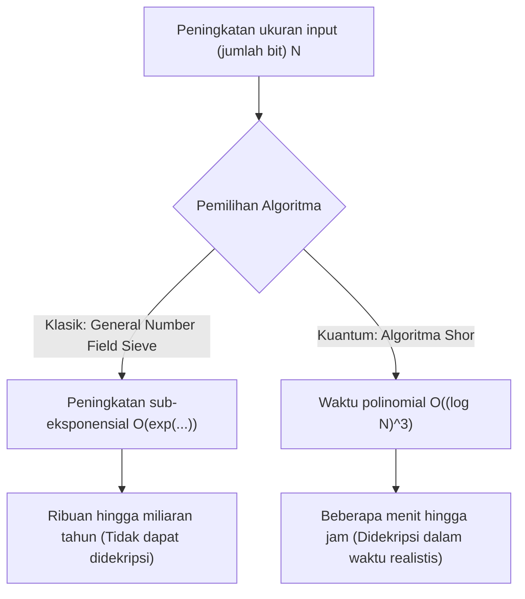
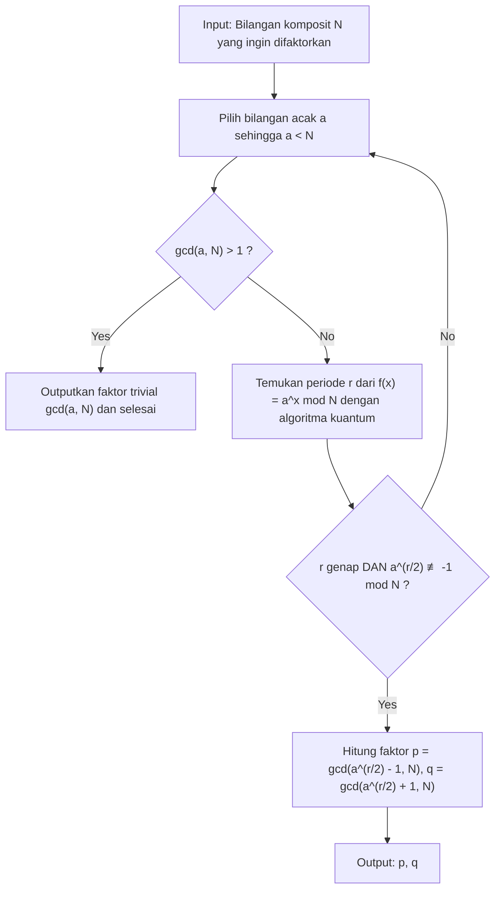
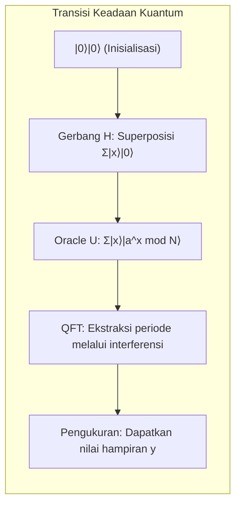

# 1. Pendahuluan: Krisis Kriptografi yang Dibawa oleh Komputer Kuantum

Sebagian besar keamanan dalam masyarakat internet modern bergantung pada **kriptografi kunci publik** (terutama enkripsi RSA). Saat kita mengirimkan informasi kartu kredit saat berbelanja online, atau bertukar data yang sangat rahasia, konten komunikasi tersebut dilindungi dengan kuat oleh enkripsi RSA.

Dasar keamanan enkripsi RSA bergantung pada fakta matematis bahwa "**memfaktorkan bilangan bulat raksasa ke dalam faktor prima sangat sulit dilakukan oleh komputer klasik (PC atau superkomputer yang biasa kita gunakan)**". Namun, "**Algoritma Shor (Shor's Algorithm)**" yang dipublikasikan oleh Peter Shor pada tahun 1994, meruntuhkan asumsi ini dari dasarnya. Terbukti secara matematis bahwa jika Algoritma Shor dijalankan pada komputer kuantum skala besar, faktorisasi prima yang akan memakan waktu lebih lama dari usia alam semesta pada komputer klasik, dapat diselesaikan hanya dalam beberapa menit hingga beberapa jam.

Dalam artikel ini, kami akan menjelaskan secara detail dan menyeluruh tentang bagaimana Algoritma Shor ini melakukan faktorisasi prima dengan cepat, mulai dari mekanisme matematisnya hingga implementasi simulasi konkret menggunakan Python dan framework komputasi kuantum **Qiskit**.

---

# 2. Perubahan Drastis dalam Kompleksitas Komputasi: Dari Fungsi Eksponensial ke Waktu Polinomial

Mengapa faktorisasi prima itu sulit? Bahkan jika kita menggunakan "General Number Field Sieve (GNFS)", yang dikenal sebagai algoritma faktorisasi prima terbaik di komputer klasik, kompleksitas komputasinya menjadi sub-eksponensial.

Kompleksitas waktu yang dibutuhkan untuk memfaktorkan bilangan komposit dengan $N$ digit menggunakan metode klasik adalah sebagai berikut:

$$ O\left(\exp\left( c (\log N)^{1/3} (\log \log N)^{2/3} \right)\right) $$

Oleh karena itu, hanya dengan memperpanjang ukuran kunci (misalnya, menjadi 2048 bit atau 4096 bit), dekripsi di komputer klasik akan memakan waktu yang tidak realistis seperti ribuan atau puluhan ribu tahun.

Namun, ketika **Algoritma Shor** digunakan pada komputer kuantum, kompleksitas komputasinya berkurang secara drastis menjadi waktu polinomial terhadap jumlah bit input $\log N$.

$$ O((\log N)^3) $$

Ini berarti bahwa jika jumlah bit digandakan, waktu komputasi pada komputer klasik akan meningkat secara astronomis, sedangkan pada komputer kuantum, waktu komputasi paling banyak hanya akan meningkat sekitar 8 kali lipat. **Pengurangan kelas kompleksitas dari waktu eksponensial ke waktu polinomial (inklusi ke dalam kelas BQP)** inilah yang merupakan kehebatan sesungguhnya dari Algoritma Shor.



---

# 3. Gambaran Keseluruhan Algoritma dan Latar Belakang Matematis

Algoritma Shor sebenarnya tidak melakukan semuanya di komputer kuantum. Ia dibangun atas kerja sama antara pra-pemrosesan dan pasca-pemrosesan oleh komputer klasik, dan bagian inti (algoritma pencarian periode) oleh komputer kuantum.

Alur keseluruhan algoritma adalah sebagai berikut:



## Reduksi dari Faktorisasi Prima ke Masalah Pencarian Periode

Ide jenius Shor terletak pada mengubah "**masalah faktorisasi prima**" menjadi "**masalah pencarian periode (Order Finding Problem)**".

Misalkan bilangan bulat $N$ (bilangan yang ingin difaktorkan) dan bilangan bulat coprime $a$ ($1 < a < N$). Kita mendefinisikan fungsi eksponensial modular sebagai berikut:

$$ f(x) = a^x \bmod N $$

Fungsi ini memiliki suatu periode $r$. Dengan kata lain, untuk sembarang $x$, berlaku $f(x+r) = f(x)$. Khususnya saat $x=0$,

$$ a^r \equiv 1 \pmod N $$

Bilangan bulat positif terkecil $r$ yang memenuhi hal ini disebut "order dari $a$ modulo $N$". Jika kita dapat menemukan periode $r$ ini, kita dapat memperoleh faktor primanya dengan cara berikut.

Dengan mengubah bentuk persamaannya,
$$ a^r - 1 \equiv 0 \pmod N $$
Jika $r$ adalah bilangan genap, kita dapat memfaktorkannya menggunakan rumus selisih kuadrat:
$$ (a^{r/2} - 1)(a^{r/2} + 1) \equiv 0 \pmod N $$

Ini berarti bahwa $N$ memiliki pembagi persekutuan dengan $(a^{r/2} - 1)$ atau $(a^{r/2} + 1)$ (dengan syarat kondisi $a^{r/2} \not\equiv -1 \pmod N$ terpenuhi). Oleh karena itu, dengan menggunakan Algoritma Euclidean (Euclidean algorithm),

$$ p = \gcd(a^{r/2} - 1, N) $$
$$ q = \gcd(a^{r/2} + 1, N) $$

Jika kita menghitung ini, kita dapat menemukan faktor non-trivial $p, q$ dari $N$. Perhitungan ini (perhitungan faktor persekutuan terbesar dan pembangkitan bilangan acak) dapat dilakukan dengan sangat cepat oleh komputer klasik. Masalahnya menyempit pada **bagaimana menemukan periode $r$ ini dengan cepat**. Pada komputer klasik, menemukan periode $r$ itu sendiri membutuhkan waktu yang eksponensial. Di sinilah komputer kuantum berperan.

---

# 4. Bagian Algoritma Kuantum: Mekanisme Pencarian Periode

Subrutin untuk menemukan periode $r$ menggunakan komputer kuantum terdiri dari 4 langkah berikut.



## Langkah 1: Inisialisasi Register Kuantum dan Superposisi

Pertama, kita siapkan dua register kuantum. Register pertama adalah untuk menginput keadaan, dan register kedua adalah untuk menyimpan hasil perhitungan fungsi.
Keadaan awal semuanya adalah $|0\rangle$.

$$ |\psi_0\rangle = |0\rangle_1 |0\rangle_2 $$

Terapkan gerbang Hadamard (Hadamard Gate) pada semua qubit di register pertama untuk menciptakan keadaan superposisi probabilitas yang sama untuk semua kemungkinan input $x$ (dari $0$ hingga $Q-1$, dengan $Q=2^n$).

$$ |\psi_1\rangle = \frac{1}{\sqrt{Q}} \sum_{x=0}^{Q-1} |x\rangle_1 |0\rangle_2 $$

Dengan ini, komputer kuantum akan secara bersamaan menahan keadaan untuk semua $Q$ input dalam satu operasi. Ini adalah sumber kekuatan yang tangguh dari **paralelisme kuantum**.

## Langkah 2: Penerapan Fungsi Oracle (Eksponensial Modular)

Selanjutnya, dengan menggunakan sirkuit operasi kuantum $U_f$, kita menghitung fungsi $f(x) = a^x \bmod N$ dan menyimpan hasilnya di register kedua.

$$ |\psi_2\rangle = \frac{1}{\sqrt{Q}} \sum_{x=0}^{Q-1} |x\rangle_1 |a^x \bmod N\rangle_2 $$

Pada titik ini, register pertama dan register kedua berada dalam keadaan **quantum entanglement (keterikatan kuantum)**. Jika (seandainya) kita mengukur register kedua dan mendapatkan nilai tertentu $k = a^{x_0} \bmod N$, maka keadaan register pertama akan runtuh (collapse) ke keadaan superposisi dari $x$ yang memberikan nilai $k$ tersebut. Karena periode fungsi adalah $r$, keadaan yang tersisa akan menjadi nilai yang melompat-lompat dengan rentang $r$, yaitu $x_0, x_0+r, x_0+2r, \dots$.

$$ |\psi_3\rangle = \sqrt{\frac{r}{Q}} \sum_{j=0}^{M-1} |x_0 + j r\rangle_1 |k\rangle_2 $$

Namun, kita tidak ingin mengetahui $x_0$, melainkan ingin mengetahui periode $r$ itu sendiri. Tidak mungkin mengamati $r$ secara langsung dari keadaan ini. Oleh karena itu, kita menggunakan Transformasi Fourier Kuantum.

## Langkah 3: Interferensi Fase melalui Transformasi Fourier Kuantum (QFT)

Terapkan **Transformasi Fourier Kuantum (Quantum Fourier Transform, QFT)** ke register pertama. QFT adalah versi kuantum dari Transformasi Fourier Diskrit klasik dan mengubah amplitudo vektor keadaan. Aksi QFT pada keadaan basis $|x\rangle$ didefinisikan sebagai berikut:

$$ QFT |x\rangle = \frac{1}{\sqrt{Q}} \sum_{y=0}^{Q-1} \omega^{xy} |y\rangle $$

Di mana, $\omega = e^{2\pi i / Q}$.

Saat QFT diterapkan, amplitudo keadaan mengalami interferensi. Meskipun detail matematisnya dihilangkan, ketika QFT diterapkan pada keadaan dengan periode $r$, gelombang akan menghasilkan **interferensi konstruktif (Constructive Interference)** hanya pada saat $y$ adalah nilai yang sangat dekat dengan kelipatan bilangan bulat dari $Q/r$. Keadaan lainnya akan saling meniadakan amplitudo probabilitasnya akibat **interferensi destruktif (Destructive Interference)** dan mendekati nol.

## Langkah 4: Pengukuran dan Ekspansi Pecahan Berlanjut

Terakhir, ukur register pertama. Nilai $y$ yang diperoleh melalui pengukuran akan memenuhi kondisi berikut dengan probabilitas tinggi:

$$ y \approx c \frac{Q}{r} \implies \frac{y}{Q} \approx \frac{c}{r} $$

(di mana $c$ adalah bilangan bulat tak diketahui antara $0 \le c < r$)

Dengan menerapkan algoritma klasik **Ekspansi Pecahan Berlanjut (Continued Fraction Expansion)** pada bilangan rasional $y/Q$ yang diperoleh, kita menghitung pecahan hampiran $c/r$ dan mengekstrak periode $r$ dari penyebutnya.

---

# 5. Implementasi Simulasi Menggunakan Python dan Qiskit

Hanya dengan teori mungkin kurang terasa nyata, jadi mari kita simulasikan Algoritma Shor secara langsung menggunakan Python dan framework komputasi kuantum milik IBM, **Qiskit**.

Di sini, kita akan mengimplementasikan skenario paling klasik dan terkenal, yaitu **"Memfaktorkan $N=15$ menggunakan $a=7$"**.

## Persiapan Lingkungan Eksekusi

Pastikan Anda telah menginstal Qiskit sebelumnya.

```bash
pip install qiskit qiskit-aer numpy
```

## Keseluruhan Kode Implementasi Python

Kode berikut adalah contoh implementasi Algoritma Shor khusus untuk $N=15, a=7$. Karena menyusun sirkuit eksponensial modular umum terlalu tinggi biaya komputasinya pada simulator saat ini, logika operasi gerbang di-*hardcode* untuk kasus khusus $a=7$.

```python
import numpy as np
from qiskit import QuantumCircuit
from qiskit_aer import AerSimulator
from qiskit.visualization import plot_histogram
from fractions import Fraction
import math

# 1. Fungsi untuk membangun Transformasi Fourier Kuantum Balikan (QFT†)
def qft_dagger(n):
    """Menghasilkan sirkuit Transformasi Fourier Kuantum Balikan (Inverse QFT) dengan n qubit"""
    qc = QuantumCircuit(n)
    # Gerbang SWAP untuk membalikkan urutan
    for qubit in range(n//2):
        qc.swap(qubit, n-qubit-1)
    # Penerapan gerbang fase terkendali (controlled phase) dan gerbang H
    for j in range(n):
        for m in range(j):
            qc.cp(-np.pi/float(2**(j-m)), m, j)
        qc.h(j)
    qc.name = "QFT_dagger"
    return qc

# 2. Fungsi untuk membangun operasi eksponensial modular terkendali untuk 7^x mod 15
def c_amod15(a, power):
    """Menghasilkan gerbang U terkendali untuk a dan pangkat tertentu (khusus N=15)"""
    U = QuantumCircuit(4)        
    for _ in range(power):
        # Logika hardcode untuk 7^x mod 15 dalam kasus a=7
        if a in [2,13]:
            U.swap(2,3)
            U.swap(1,2)
            U.swap(0,1)
        if a in [7,8]:
            U.swap(0,1)
            U.swap(1,2)
            U.swap(2,3)
        if a in [4, 11]:
            U.swap(1,3)
            U.swap(0,2)
        if a in [7,11,13]:
            for q in range(4):
                U.x(q)
    U = U.to_gate()
    U.name = f"{a}^{power} mod 15"
    c_U = U.control()
    return c_U

# 3. Komposisi sirkuit kuantum utama
def shor_circuit(a, n_count):
    # n_count: Jumlah bit pada register kendali (control register)
    # Register target (target register) memiliki 4 bit untuk merepresentasikan 0 hingga 15
    qc = QuantumCircuit(n_count + 4, n_count)
    
    # Inisialisasi register pertama (register kendali) (pembangkitan superposisi)
    for q in range(n_count):
        qc.h(q)
        
    # Inisialisasi register kedua (register target) menjadi |1> (0001)
    qc.x(3 + n_count)
    
    # Penerapan operasi eksponensial modular terkendali (Oracle)
    for q in range(n_count):
        # Menerapkan operasi 2^q pangkat
        qc.append(c_amod15(a, 2**q), 
                 [q] + [i+n_count for i in range(4)])
        
    # Terapkan Transformasi Fourier Kuantum Balikan (Inverse QFT) pada register pertama
    qc.append(qft_dagger(n_count), range(n_count))
    
    # Mengukur register pertama
    qc.measure(range(n_count), range(n_count))
    return qc

# --- Bagian Eksekusi ---
if __name__ == "__main__":
    N = 15
    a = 7
    n_count = 8  # Menggunakan 8 qubit untuk register kendali (Q=256)
    
    print(f"Pengaturan Pencarian: N={N}, a={a}, Jumlah qubit kendali={n_count}")
    
    # Menghasilkan sirkuit
    qc = shor_circuit(a, n_count)
    
    # Eksekusi di simulator
    sim = AerSimulator()
    # transpile direkomendasikan pada versi Qiskit terbaru
    from qiskit import transpile
    compiled_circuit = transpile(qc, sim)
    job = sim.run(compiled_circuit, shots=1024)
    result = job.result()
    counts = result.get_counts()
    
    print("\nHasil Pengukuran (String bit: Jumlah observasi):")
    for bitstring, count in counts.items():
        print(f"  {bitstring}: {count} kali")
        
    # Pasca-pemrosesan klasik: Penentuan periode r melalui ekspansi pecahan berlanjut
    print("\n--- Perhitungan Periode dan Faktorisasi Prima ---")
    phases = []
    for output in counts:
        # Konversi string bit menjadi desimal
        decimal = int(output, 2)
        # Fase = Nilai pengukuran / 2^n_count
        phase = decimal / (2**n_count)
        phases.append(phase)
        
        # Dapatkan pecahan hampiran melalui ekspansi pecahan berlanjut. Batas atas penyebut adalah N=15
        frac = Fraction(phase).limit_denominator(15)
        r = frac.denominator
        
        print(f"Nilai observasi: {decimal:3d} | Fase: {phase:.4f} | Pecahan berlanjut: {frac} | Perkiraan periode r = {r}")
        
        # Periksa apakah periode r genap dan memberikan hasil yang valid
        if r % 2 == 0:
            guess1 = math.gcd(a**(r//2) - 1, N)
            guess2 = math.gcd(a**(r//2) + 1, N)
            if guess1 not in [1, N] or guess2 not in [1, N]:
                print(f"  => Berhasil! Faktor prima dari {N} adalah {guess1} dan {guess2}.")
            else:
                print(f"  => Hanya faktor trivial. Coba lagi.")
        else:
            print(f"  => Gagal karena periode ganjil.")
```

## Penjelasan Kode dan Analisis Hasil Eksekusi

Saat Anda menjalankan kode di atas, sebagai hasil pengukuran dari register kendali, probabilitas tinggi akan menunjukkan puncak (nilai observasi) tertentu. Untuk `n_count=8` ($Q=256$), jika menggunakan komputer kuantum ideal (atau simulator), angka seperti `0`, `64`, `128`, dan `192` akan muncul sebagai nilai observasi dengan probabilitas yang sangat besar.

Jika kita membaginya dengan $Q=256$, fase $y/Q$ masing-masing akan menjadi $0.0$, $0.25$, $0.5$, dan $0.75$.
Jika fase ini diekspansi menjadi pecahan berlanjut:
- $0.25 \to 1/4$ (Perkiraan periode $r=4$)
- $0.50 \to 1/2$ (Perkiraan periode $r=2$)
- $0.75 \to 3/4$ (Perkiraan periode $r=4$)

Menggunakan periode $r=4$ yang didapatkan di sini, kita dapat menghitung faktor primanya.
Karena $a=7, r=4$,
$p = \gcd(7^2 - 1, 15) = \gcd(48, 15) = 3$
$q = \gcd(7^2 + 1, 15) = \gcd(50, 15) = 5$

Dengan mengesankan, kita berhasil memfaktorkan $15 = 3 \times 5$.

> [!TIP]
> Jika nilai yang diperoleh sebagai ukuran adalah $y=128$ (fase $0.5$), penyebutnya menjadi $2$, dan kita malah mendapatkan pembagi dari periode alih-alih periode sebenarnya $r=4$. Dalam kasus seperti ini, Anda dapat menjalankan algoritma beberapa kali atau memeriksa kelipatan dari $r$ yang diperoleh untuk menemukan periode sebenarnya.

---

# 6. Tantangan menuju Penerapan Praktis dan Keterbatasan di Era NISQ

Meskipun memfaktorkan $N=15$ di simulator cukup mudah dilakukan, namun pada kenyataannya, masih banyak hambatan yang dihadapi oleh komputer kuantum nyata untuk memfaktorkan RSA-2048 (angka desimal 617 digit) yang digunakan dalam dunia nyata.

Era di mana kita hidup saat ini disebut sebagai **Era NISQ (Noisy Intermediate-Scale Quantum)**. Qubit sangat rentan terhadap gangguan dari lingkungan eksternal dan dapat mengalami "decoherence" di tengah komputasi, yang merusak keadaan kuantum.

Untuk menjalankan sirkuit yang dalam (jumlah gerbang banyak) seperti pada Algoritma Shor dengan akurat, **Koreksi Kesalahan Kuantum (Quantum Error Correction)** sangat mutlak diperlukan untuk memperbaiki noise. Untuk menciptakan satu "logical qubit" (qubit logis) yang bebas dari noise, diperlukan ribuan "physical qubit" (qubit fisik) yang dienkode menggunakan teknik seperti Surface Code.

Diperkirakan untuk mematahkan enkripsi RSA 2048-bit, ribuan qubit logis yang sempurna akan diperlukan, dan untuk mewujudkan hal ini, dibutuhkan komputer kuantum *fault-tolerant* (tahan kesalahan) yang dilengkapi dengan **jutaan hingga puluhan juta qubit fisik**. Karena prosesor kuantum paling mutakhir saat ini hanya memiliki sekitar ratusan hingga ribuan qubit fisik, sistem kriptografi di seluruh dunia tidak akan serta-merta ditembus dalam waktu dekat.

> [!WARNING]
> Akan tetapi, ada ancaman dengan model "Store Now, Decrypt Later (Simpan Sekarang, Dekripsi Nanti)". Para peretas bisa mengumpulkan dan menyimpan komunikasi rahasia saat ini secara besar-besaran dalam bentuk terenkripsi, dengan strategi untuk mendekripsi semuanya seketika setelah komputer kuantum yang kuat berhasil dikembangkan dalam 10 hingga 20 tahun mendatang.

---

# 7. Transisi menuju Kriptografi Pasca-Kuantum (PQC)

Untuk bersiap menghadapi datangnya "Q-Day (Hari di mana komputer kuantum mematahkan kriptografi)", ahli kriptografi dari seluruh dunia, dipimpin oleh Institut Nasional Standar dan Teknologi (NIST) di Amerika Serikat, sedang merumuskan **Kriptografi Pasca-Kuantum (Post-Quantum Cryptography, PQC)**.

PQC didasarkan pada masalah matematis baru (seperti masalah kisi (lattice-based), polinomial multivariat, dan berbasis fungsi hash) yang secara matematis dianggap tidak dapat diselesaikan secara efisien bahkan jika menggunakan Algoritma Shor (ataupun Algoritma Grover). Algoritma seperti "CRYSTALS-Kyber" dan "CRYSTALS-Dilithium" telah dipilih sebagai standar, dan penerapannya secara bertahap mulai dilakukan pada iMessage milik Apple dan berbagai protokol komunikasi browser web.

Bagi teknisi yang mengelola infrastruktur TI, memasukkan "crypto-agility" (ketangkasan kriptografi: desain di mana metode kriptografi dapat dialihkan dengan cepat) dari enkripsi RSA atau kurva eliptik yang ada ke PQC ke dalam sistem mereka, akan menjadi misi utama yang sangat penting di masa depan.

---

# 8. Penutup

Dalam artikel ini, kami telah menjelaskan secara detail dan mendalam sekitar 10.000 karakter, mulai dari latar belakang teoretis matematis dari Algoritma Shor, mekanisme ekstraksi periode menggunakan Transformasi Fourier Kuantum, hingga kode simulasi konkret menggunakan Python dan Qiskit.

Fakta bahwa hukum fisika mikroskopis mekanika kuantum dapat meruntuhkan fondasi sains informasi makroskopis seperti teori kompleksitas komputasi dan teori kriptografi merupakan salah satu pergeseran paradigma paling menarik dalam sejarah sains. Kita patut untuk terus memperhatikan pertempuran yang sedang berlangsung antara teknologi komputasi kuantum yang terus berkembang dan teknologi kriptografi baru yang berusaha menangkalnya.

Silakan jalankan kode Python yang telah diperkenalkan pada lingkungan Anda masing-masing, dan rasakan sendiri "sihir komputasi" yang dihasilkan oleh superposisi keadaan kuantum dan interferensi.

---
**Referensi**
- Shor, P. W. (1994). "Algorithms for quantum computation: discrete logarithms and factoring". Proceedings 35th Annual Symposium on Foundations of Computer Science.
- Nielsen, M. A., & Chuang, I. L. (2010). "Quantum Computation and Quantum Information". Cambridge University Press.
- Dokumentasi Qiskit: https://qiskit.org/documentation/

