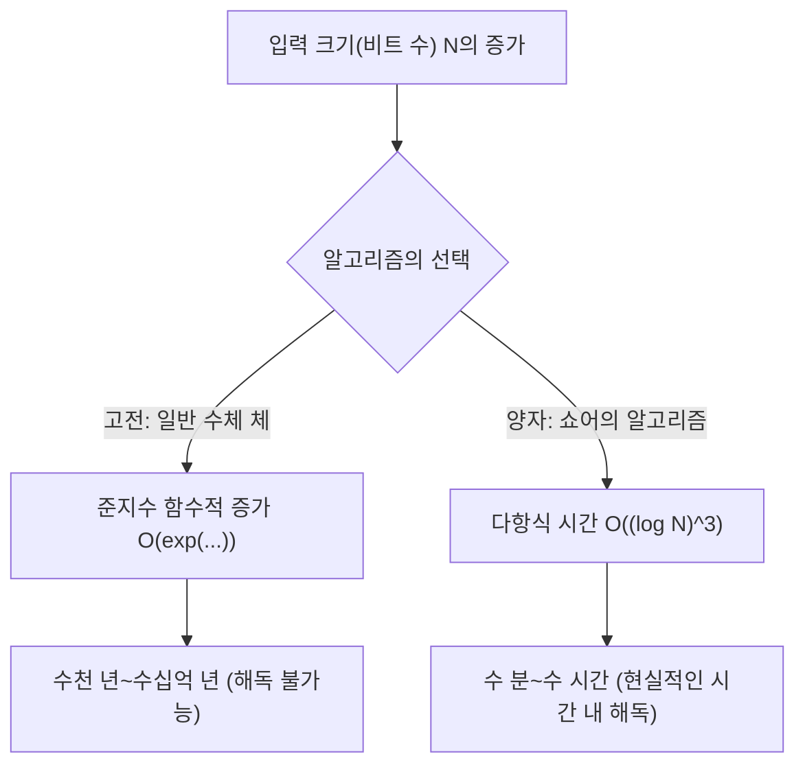
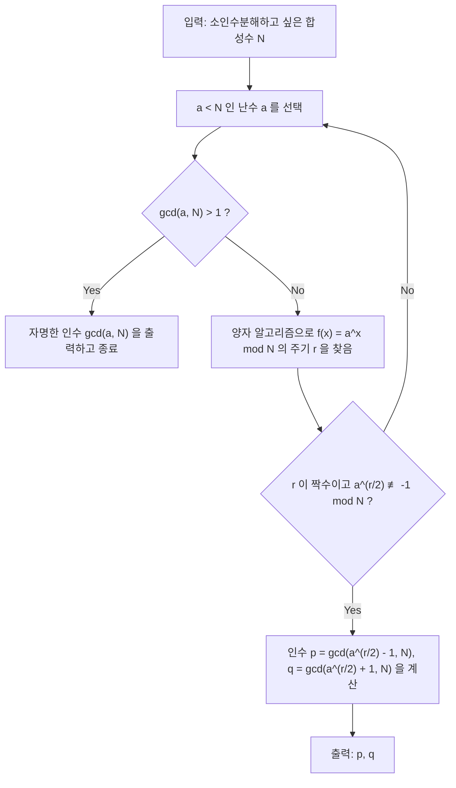
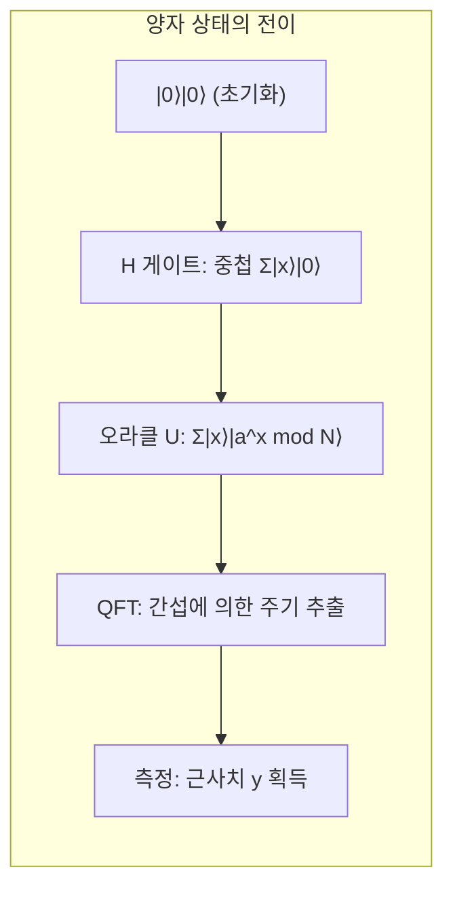

# 1. 서론: 양자 컴퓨터가 가져올 암호의 위기

현대 인터넷 사회에서 보안의 대부분은 **공개키 암호 방식**(특히 RSA 암호)에 의존하고 있습니다. 우리가 온라인 쇼핑에서 신용카드 정보를 전송할 때나 기밀성이 높은 데이터를 주고받을 때, 그 통신 내용은 RSA 암호에 의해 강력하게 보호받고 있습니다.

RSA 암호 안전성의 근거는 "**거대한 정수의 소인수분해는 고전 컴퓨터(우리가 평소 사용하는 PC나 슈퍼컴퓨터)로는 극히 어렵다**"라는 수학적인 사실에 의존하고 있습니다. 그러나 1994년 피터 쇼어(Peter Shor)가 발표한 "**쇼어의 알고리즘(Shor's Algorithm)**"은 이 전제를 근본부터 뒤엎는 것이었습니다. 쇼어의 알고리즘을 대규모 양자 컴퓨터에서 실행하면 고전 컴퓨터로는 우주의 나이 이상의 시간이 걸리는 소인수분해를 불과 수 분에서 수 시간 만에 풀 수 있다는 것이 수학적으로 증명된 것입니다.

본 문서에서는 이 쇼어의 알고리즘이 어떻게 소인수분해를 고속으로 수행하는지, 그 수학적인 구조부터 Python과 양자 계산 프레임워크인 **Qiskit**을 이용한 구체적인 시뮬레이션 구현까지 철저하고 상세하게 해설해 나가겠습니다.

---

# 2. 계산량의 극적인 변화: 지수 함수에서 다항식 시간으로

왜 소인수분해가 어려운 것일까요? 고전 컴퓨터에서 최고의 소인수분해 알고리즘으로 알려진 '일반 수체 체(General Number Field Sieve, GNFS)'를 사용하더라도 그 계산량은 준지수 함수적이 됩니다.

자릿수가 $N$인 합성수를 소인수분해하는 데 걸리는 시간 계산량은 고전적인 기법에서는 다음과 같습니다.

$$ O\left(\exp\left( c (\log N)^{1/3} (\log \log N)^{2/3} \right)\right) $$

이 때문에 키 길이를 늘리는(예를 들어 2048비트나 4096비트로 만드는) 것만으로도 고전 컴퓨터로 해독하는 데 수천 년, 수만 년이라는 비현실적인 시간이 걸리게 됩니다.

그러나 양자 컴퓨터에서 **쇼어의 알고리즘**을 사용하면 계산량은 입력 비트 수 $\log N$에 대해 다항식 시간으로 극적으로 단축됩니다.

$$ O((\log N)^3) $$

이것은 비트 수를 2배로 늘렸을 때, 고전 컴퓨터에서는 계산 시간이 천문학적으로 증가하는 반면, 양자 컴퓨터에서는 계산 시간이 기껏해야 8배 정도밖에 늘어나지 않음을 의미합니다. 이 **지수 함수 시간에서 다항식 시간으로의 계산량 클래스 단축(BQP 클래스로의 포함)**이야말로 쇼어 알고리즘의 진정한 대단함입니다.



---

# 3. 알고리즘의 전체상과 수학적 배경

쇼어의 알고리즘은 사실 모든 것을 양자 컴퓨터로 하는 것은 아닙니다. 고전 컴퓨터를 통한 전처리·후처리와 양자 컴퓨터를 통한 핵심 부분(주기 발견 알고리즘)의 연계를 통해 이루어집니다.

알고리즘의 전체적인 흐름은 다음과 같습니다.



## 소인수분해에서 주기 발견 문제로의 귀착

쇼어의 천재적인 번뜩임은 "**소인수분해 문제**"를 "**주기 발견 문제(Order Finding Problem)**"로 변환한 것에 있습니다.

정수 $N$(소인수분해하고 싶은 수)과 서로소인 정수 $a$($1 < a < N$)를 생각해 봅시다. 다음과 같은 모듈러 지수 함수를 정의합니다.

$$ f(x) = a^x \bmod N $$

이 함수는 어떤 주기 $r$을 가집니다. 즉, 임의의 $x$에 대하여 $f(x+r) = f(x)$가 성립합니다. 특히 $x=0$일 때,

$$ a^r \equiv 1 \pmod N $$

이 되는 최소의 양의 정수 $r$을 "$a$의 $N$을 법으로 하는 위수(Order)"라고 부릅니다. 이 주기 $r$을 찾을 수 있다면, 다음과 같이 소인수를 도출해 낼 수 있습니다.

식을 변형하면,
$$ a^r - 1 \equiv 0 \pmod N $$
만약 $r$이 짝수라면, 합차 공식을 사용하여 인수분해할 수 있습니다.
$$ (a^{r/2} - 1)(a^{r/2} + 1) \equiv 0 \pmod N $$

이것은 $N$이 $(a^{r/2} - 1)$ 또는 $(a^{r/2} + 1)$ 중 하나와 공약수를 가짐을 의미합니다(단, $a^{r/2} \not\equiv -1 \pmod N$이라는 조건을 만족해야 합니다). 따라서 유클리드 호제법을 사용하여,

$$ p = \gcd(a^{r/2} - 1, N) $$
$$ q = \gcd(a^{r/2} + 1, N) $$

을 계산하면, $N$의 비자명한 소인수 $p, q$를 찾을 수 있는 것입니다. 이 계산(최대공약수 계산이나 난수 생성)은 고전 컴퓨터에서 매우 고속으로 수행할 수 있습니다. 문제는 **주기 $r$을 어떻게 고속으로 찾을 것인가** 하는 점으로 좁혀집니다. 고전 컴퓨터에서는 이 주기 $r$을 찾는 것 자체에 지수 함수적인 시간이 소요되어 버립니다. 여기서 양자 컴퓨터가 나설 차례가 됩니다.

---

# 4. 양자 알고리즘 부분: 주기 발견의 구조

양자 컴퓨터를 사용하여 주기 $r$을 찾기 위한 서브루틴은 다음의 4가지 단계로 구성됩니다.



## 1단계: 양자 레지스터의 초기화와 중첩

먼저, 2개의 양자 레지스터를 준비합니다. 제1 레지스터는 상태를 입력하기 위한 것이고, 제2 레지스터는 함수의 계산 결과를 저장하기 위한 것입니다.
초기 상태는 모두 $|0\rangle$입니다.

$$ |\psi_0\rangle = |0\rangle_1 |0\rangle_2 $$

제1 레지스터의 모든 양자 비트에 아다마르 게이트(Hadamard Gate)를 적용하여, 생각할 수 있는 모든 입력 $x$ ($0$에서 $Q-1$까지, $Q=2^n$)에 대해 동일한 확률의 중첩 상태를 만들어 냅니다.

$$ |\psi_1\rangle = \frac{1}{\sqrt{Q}} \sum_{x=0}^{Q-1} |x\rangle_1 |0\rangle_2 $$

이로 인해 양자 컴퓨터는 한 번의 연산으로 $Q$개의 모든 입력에 대한 상태를 동시에 유지하게 됩니다. 이것이 **양자 병렬성**의 강력한 원천입니다.

## 2단계: 오라클 함수(모듈러 거듭제곱)의 적용

다음으로, 양자 연산 회로 $U_f$를 사용하여 함수 $f(x) = a^x \bmod N$을 계산하고 그 결과를 제2 레지스터에 저장합니다.

$$ |\psi_2\rangle = \frac{1}{\sqrt{Q}} \sum_{x=0}^{Q-1} |x\rangle_1 |a^x \bmod N\rangle_2 $$

이 시점에서 제1 레지스터와 제2 레지스터는 **양자 얽힘(Entanglement)** 상태에 있습니다. 만약 (가정하여) 제2 레지스터를 관측하여 특정 값 $k = a^{x_0} \bmod N$을 얻었다고 하면, 제1 레지스터의 상태는 그 값 $k$를 주는 $x$의 중첩 상태로 붕괴됩니다. 함수의 주기가 $r$이므로, 남는 상태는 $x_0, x_0+r, x_0+2r, \dots$ 이라는 $r$ 간격의 값이 됩니다.

$$ |\psi_3\rangle = \sqrt{\frac{r}{Q}} \sum_{j=0}^{M-1} |x_0 + j r\rangle_1 |k\rangle_2 $$

그러나 우리는 $x_0$을 알고 싶은 것이 아니라 주기 $r$ 자체를 알고 싶어 합니다. 이 상태에서 $r$을 직접 관측하는 것은 불가능합니다. 그래서 양자 푸리에 변환을 사용합니다.

## 3단계: 양자 푸리에 변환(QFT)에 의한 위상 간섭

제1 레지스터에 대해 **양자 푸리에 변환(Quantum Fourier Transform, QFT)**을 적용합니다. QFT는 고전적인 이산 푸리에 변환의 양자 버전으로, 상태 벡터의 진폭을 변환합니다. 기저 상태 $|x\rangle$에 대한 QFT의 작용은 다음과 같이 정의됩니다.

$$ QFT |x\rangle = \frac{1}{\sqrt{Q}} \sum_{y=0}^{Q-1} \omega^{xy} |y\rangle $$

여기서 $\omega = e^{2\pi i / Q}$입니다.

QFT를 적용하면 상태의 진폭이 간섭을 일으킵니다. 수학적인 세부 사항은 생략하겠지만, 주기 $r$을 갖는 상태에 대해 QFT를 적용하면 파동이 **보강 간섭(Constructive Interference)**을 일으키는 것은 $y$가 $Q/r$의 정수배에 극히 가까운 값일 때뿐입니다. 그 이외의 상태는 **상쇄 간섭(Destructive Interference)**에 의해 확률 진폭이 상쇄되어 0에 가까워집니다.

## 4단계: 측정과 연분수 전개

마지막으로 제1 레지스터를 측정합니다. 측정에 의해 얻어지는 값 $y$는 높은 확률로 다음 조건을 만족합니다.

$$ y \approx c \frac{Q}{r} \implies \frac{y}{Q} \approx \frac{c}{r} $$

($c$는 $0 \le c < r$인 미지의 정수입니다)

얻어진 유리수 $y/Q$에 대해 고전 알고리즘인 **연분수 전개(Continued Fraction Expansion)**를 적용함으로써 근사 분수 $c/r$을 계산하고, 분모에서 주기 $r$을 추출합니다.

---

# 5. Python과 Qiskit을 이용한 시뮬레이션 구현

이론만으로는 실감이 나지 않으므로, 실제로 Python과 IBM의 양자 계산 프레임워크인 **Qiskit**을 사용하여 쇼어의 알고리즘을 시뮬레이션해 봅시다.

여기서는 가장 고전적이고 유명한 예인 **"$N=15$를 $a=7$을 사용하여 소인수분해하기"**라는 시나리오를 구현합니다.

## 실행 환경 준비

미리 Qiskit을 설치해 둡니다.

```bash
pip install qiskit qiskit-aer numpy
```

## Python 구현 코드의 전체상

다음 코드는 $N=15, a=7$에 특화된 쇼어의 알고리즘 구현 예입니다. 범용적인 모듈러 거듭제곱 회로를 구성하는 것은 현재의 시뮬레이터에서는 계산 비용이 너무 높기 때문에, 특정한 $a=7$인 경우의 게이트 동작을 하드코딩하고 있습니다.

```python
import numpy as np
from qiskit import QuantumCircuit
from qiskit_aer import AerSimulator
from qiskit.visualization import plot_histogram
from fractions import Fraction
import math

# 1. 역 양자 푸리에 변환 (QFT†) 을 구성하는 함수
def qft_dagger(n):
    """n 양자 비트의 역 양자 푸리에 변환 회로를 생성한다"""
    qc = QuantumCircuit(n)
    # 순서를 반전하기 위한 SWAP 게이트
    for qubit in range(n//2):
        qc.swap(qubit, n-qubit-1)
    # 제어 위상 게이트와 H 게이트의 적용
    for j in range(n):
        for m in range(j):
            qc.cp(-np.pi/float(2**(j-m)), m, j)
        qc.h(j)
    qc.name = "QFT_dagger"
    return qc

# 2. 7^x mod 15 의 제어 모듈러 거듭제곱 연산을 구성하는 함수
def c_amod15(a, power):
    """특정 a와 거듭제곱에 대한 제어 U 게이트를 생성한다(N=15 전용)"""
    U = QuantumCircuit(4)        
    for _ in range(power):
        # a=7인 경우의 7^x mod 15 의 하드코딩 논리
        if a in [2,13]:
            U.swap(2,3)
            U.swap(1,2)
            U.swap(0,1)
        if a in [7,8]:
            U.swap(0,1)
            U.swap(1,2)
            U.swap(2,3)
        if a in [4, 11]:
            U.swap(1,3)
            U.swap(0,2)
        if a in [7,11,13]:
            for q in range(4):
                U.x(q)
    U = U.to_gate()
    U.name = f"{a}^{power} mod 15"
    c_U = U.control()
    return c_U

# 3. 메인 양자 회로 구성
def shor_circuit(a, n_count):
    # n_count: 제어 레지스터의 비트 수
    # 타겟 레지스터는 0~15 를 표현하기 위해 4비트
    qc = QuantumCircuit(n_count + 4, n_count)
    
    # 제1 레지스터(제어 레지스터)의 초기화(중첩의 생성)
    for q in range(n_count):
        qc.h(q)
        
    # 제2 레지스터(타겟 레지스터)를 |1> (0001) 로 초기화
    qc.x(3 + n_count)
    
    # 제어 모듈러 거듭제곱 연산(오라클)의 적용
    for q in range(n_count):
        # 2^q 승의 연산을 적용
        qc.append(c_amod15(a, 2**q), 
                 [q] + [i+n_count for i in range(4)])
        
    # 제1 레지스터에 역 양자 푸리에 변환을 적용
    qc.append(qft_dagger(n_count), range(n_count))
    
    # 제1 레지스터를 측정
    qc.measure(range(n_count), range(n_count))
    return qc

# --- 실행 섹션 ---
if __name__ == "__main__":
    N = 15
    a = 7
    n_count = 8  # 제어 레지스터에 8 양자 비트를 사용 (Q=256)
    
    print(f"탐색 설정: N={N}, a={a}, 제어 양자 비트 수={n_count}")
    
    # 회로의 생성
    qc = shor_circuit(a, n_count)
    
    # 시뮬레이터에서의 실행
    sim = AerSimulator()
    # 최신 Qiskit에서는 transpile을 권장
    from qiskit import transpile
    compiled_circuit = transpile(qc, sim)
    job = sim.run(compiled_circuit, shots=1024)
    result = job.result()
    counts = result.get_counts()
    
    print("\n측정 결과(비트열: 관측 횟수):")
    for bitstring, count in counts.items():
        print(f"  {bitstring}: {count}회")
        
    # 고전적 후처리: 연분수 전개에 의한 주기 r의 특정
    print("\n--- 주기의 계산과 소인수분해 ---")
    phases = []
    for output in counts:
        # 비트열을 10진수로 변환
        decimal = int(output, 2)
        # 위상 = 측정값 / 2^n_count
        phase = decimal / (2**n_count)
        phases.append(phase)
        
        # 연분수 전개에 의해 근사 분수를 획득. 분모의 상한은 N=15
        frac = Fraction(phase).limit_denominator(15)
        r = frac.denominator
        
        print(f"관측값: {decimal:3d} | 위상: {phase:.4f} | 연분수: {frac} | 추정 주기 r = {r}")
        
        # 주기 r이 짝수이고 유효한 결과를 가져오는지 확인
        if r % 2 == 0:
            guess1 = math.gcd(a**(r//2) - 1, N)
            guess2 = math.gcd(a**(r//2) + 1, N)
            if guess1 not in [1, N] or guess2 not in [1, N]:
                print(f"  => 성공! {N} 의 소인수는 {guess1} 와(과) {guess2} 입니다.")
            else:
                print(f"  => 자명한 인수뿐임. 다시 시도.")
        else:
            print(f"  => 주기가 홀수이므로 실패.")
```

## 코드의 해설과 실행 결과의 해석

위의 코드를 실행하면 제어 레지스터의 측정 결과로서 높은 확률로 특정 피크(관측값)를 얻을 수 있습니다. `n_count=8`($Q=256$)인 경우, 이상적인 양자 컴퓨터(또는 시뮬레이터)라면 관측값으로 `0`, `64`, `128`, `192`와 같은 수치가 압도적인 확률로 출현합니다.

이것들을 $Q=256$으로 나누면 위상 $y/Q$는 각각 $0.0$, $0.25$, $0.5$, $0.75$가 됩니다.
이 위상을 연분수 전개하면:
- $0.25 \to 1/4$ (추정 주기 $r=4$)
- $0.50 \to 1/2$ (추정 주기 $r=2$)
- $0.75 \to 3/4$ (추정 주기 $r=4$)

여기서 얻어진 주기 $r=4$를 사용하여 소인수를 계산합니다.
$a=7, r=4$이므로,
$p = \gcd(7^2 - 1, 15) = \gcd(48, 15) = 3$
$q = \gcd(7^2 + 1, 15) = \gcd(50, 15) = 5$

훌륭하게 $15 = 3 \times 5$의 소인수분해에 성공했습니다.

> [!TIP]
> 측정값으로 $y=128$(위상 $0.5$)을 얻은 경우, 분모는 $2$가 되어 참값인 주기 $r=4$가 아니라 그 약수를 얻게 됩니다. 이런 경우에는 알고리즘을 여러 번 실행하거나 얻어진 $r$의 배수를 조사함으로써 진짜 주기에 도달할 수 있습니다.

---

# 6. 실용화를 향한 과제와 NISQ 시대의 한계

시뮬레이터 상에서 $N=15$를 소인수분해하는 것은 간단하게 할 수 있었지만, 실제 사회에서 사용되고 있는 RSA-2048(617자리의 10진수)을 소인수분해하려면 현실의 양자 컴퓨터에는 아직 수많은 장벽이 존재합니다.

현재 우리가 살고 있는 시대는 **NISQ(Noisy Intermediate-Scale Quantum: 노이즈가 있는 중간 규모 양자) 시대**라고 불립니다. 양자 비트는 외부 환경의 노이즈에 극히 취약하여, 계산 도중에 '결어긋남(데코히어런스)'을 일으켜 상태가 깨져 버립니다.

쇼어의 알고리즘과 같이 깊은(게이트 수가 많은) 회로를 정확하게 실행하기 위해서는 노이즈를 정정하는 **양자 오류 정정(Quantum Error Correction)**이 필수적입니다. 하나의 노이즈 없는 '논리 양자 비트'를 만들어 내기 위해 수천 개의 '물리 양자 비트'를 표면 부호(Surface Code) 등으로 인코딩해야 합니다.

2048비트의 RSA 암호를 깨기 위해서는 수천 개의 완벽한 논리 양자 비트가 필요하며, 이를 실현하려면 **수백만에서 수천만 개의 물리 양자 비트**를 탑재한 결함 허용(오류 내성) 양자 컴퓨터가 필요할 것으로 추산되고 있습니다. 현재 최첨단 양자 프로세서도 수백~수천 물리 양자 비트 정도이기 때문에, 당장 전 세계의 암호가 깨지는 것은 아닙니다.

> [!WARNING]
> 그러나 "Store Now, Decrypt Later(지금 저장하고, 나중에 해독한다)"라는 위협 모델이 존재합니다. 공격자는 현재 암호화되어 있는 기밀 통신을 암호 데이터인 채로 대량으로 저장해 두고, 10~20년 후에 강력한 양자 컴퓨터가 완성되는 순간에 모든 것을 해독하려는 전략을 취할 가능성이 있습니다.

---

# 7. 양자 내성 암호(PQC)로의 전환

이러한 'Q-Day(양자 컴퓨터가 암호를 깨는 날)'의 도래에 대비하여, 미국 국립표준기술연구소(NIST)를 필두로 전 세계 암호학자들이 **양자 내성 암호(Post-Quantum Cryptography, PQC)**의 제정을 추진하고 있습니다.

PQC는 쇼어의 알고리즘을 사용해도 (혹은 그로버의 알고리즘을 사용해도) 효율적으로 풀 수 없을 것으로 수학적으로 여겨지는 새로운 수학적 문제(격자 문제, 다변수 다항식 문제, 해시 함수 기반 등)를 기반으로 하고 있습니다. 이미 'CRYSTALS-Kyber'나 'CRYSTALS-Dilithium'과 같은 알고리즘이 표준 규격으로 선정되어, Apple의 iMessage나 각종 웹 브라우저의 통신 프로토콜에 도입이 서서히 시작되고 있습니다.

IT 인프라를 관리하는 엔지니어에게 있어, 기존의 RSA나 타원곡선 암호에서 PQC로의 '크립토 어질리티(암호 민첩성: 빠르게 암호 방식을 전환할 수 있는 설계)'를 시스템에 통합하는 것이 향후 큰 과제가 될 것입니다.

---

# 8. 맺음말

본 기사에서는 쇼어 알고리즘의 이론적인 수학적 배경에서 시작하여 양자 푸리에 변환을 사용한 주기 추출의 메커니즘, 그리고 Python과 Qiskit을 이용한 구체적인 시뮬레이션 코드까지 1만 자 규모의 분량으로 철저하게 해설했습니다.

양자역학이라는 미시적 세계의 물리 법칙이 거시적 정보과학의 근간인 계산량 이론이나 암호 이론을 근본부터 뒤엎어 버린다는 사실은 과학의 역사에 있어 가장 흥미진진한 패러다임 전환 중 하나입니다. 현재 진행형으로 계속 발전하고 있는 양자 컴퓨팅 기술과 그에 맞서는 새로운 암호 기술의 공방전에서 앞으로도 눈을 뗄 수 없습니다.

꼭 이번에 소개한 Python 코드를 자신의 환경에서 실행해 보시고, 양자 상태의 중첩과 간섭이 만들어 내는 '계산의 마법'을 체감해 보시기 바랍니다.

---
**참고 문헌**
- Shor, P. W. (1994). "Algorithms for quantum computation: discrete logarithms and factoring". Proceedings 35th Annual Symposium on Foundations of Computer Science.
- Nielsen, M. A., & Chuang, I. L. (2010). "Quantum Computation and Quantum Information". Cambridge University Press.
- Qiskit Documentation: https://qiskit.org/documentation/

