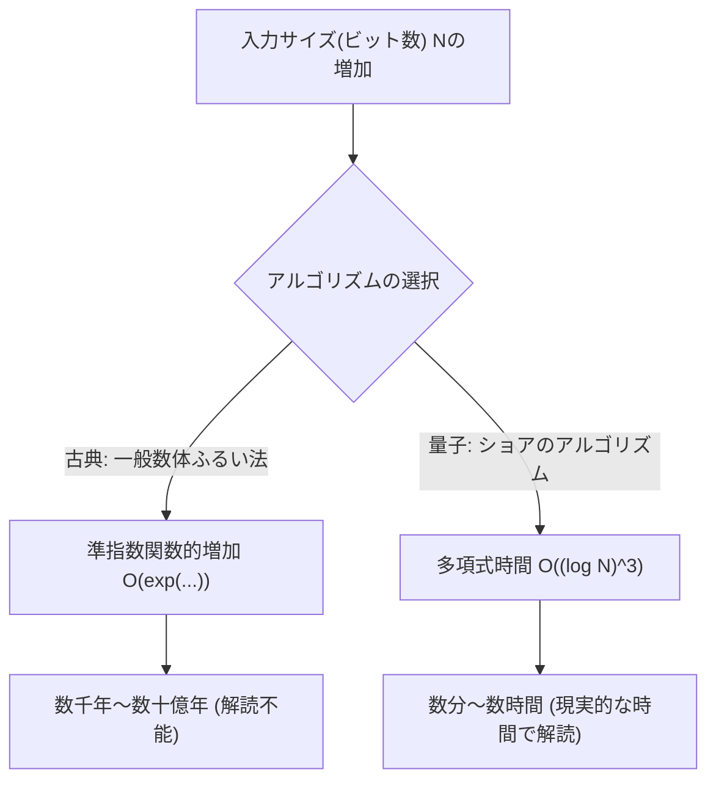
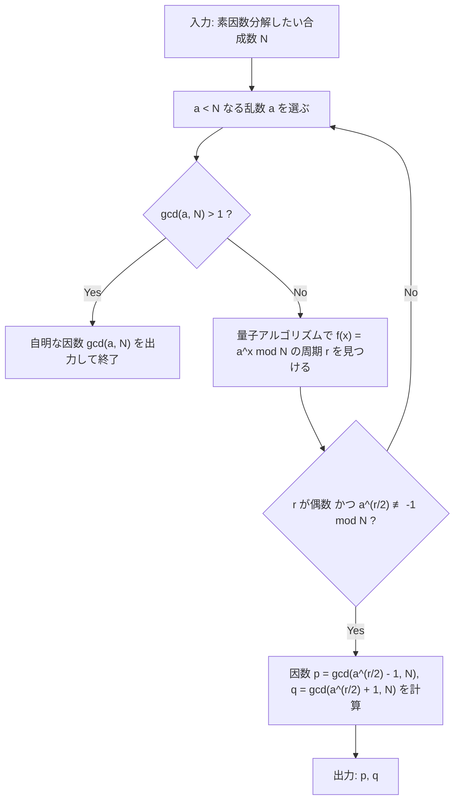
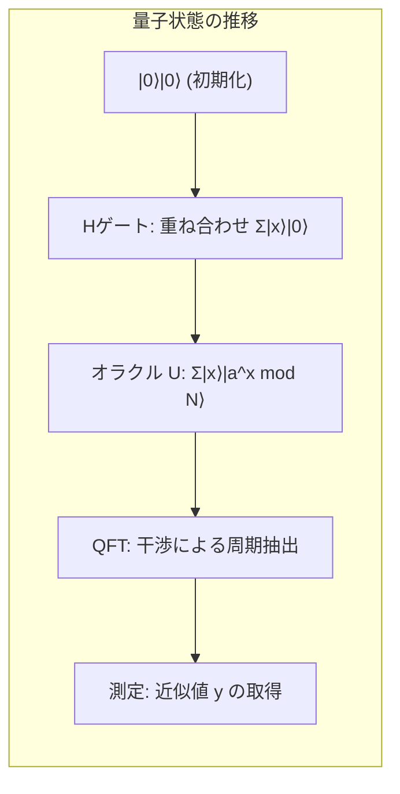

# 1. はじめに：量子コンピュータがもたらす暗号の危機

現代のインターネット社会におけるセキュリティの大部分は、**公開鍵暗号方式**（特にRSA暗号）に依存しています。私たちがオンラインショッピングでクレジットカード情報を送信する際や、機密性の高いデータをやり取りする際、その通信内容はRSA暗号によって強固に守られています。

RSA暗号の安全性の根拠は、「**巨大な整数の素因数分解は、古典コンピュータ（私たちが普段使っているPCやスーパーコンピュータ）では極めて困難である**」という数学的な事実に依存しています。しかし、1994年にピーター・ショア（Peter Shor）が発表した「**ショアのアルゴリズム（Shor's Algorithm）**」は、この前提を根底から覆すものでした。ショアのアルゴリズムを大規模な量子コンピュータ上で実行すれば、古典コンピュータでは宇宙の年齢以上の時間を要する素因数分解を、わずか数分から数時間で解くことができると数学的に証明されたのです。

本記事では、このショアのアルゴリズムがいかにして素因数分解を高速に行うのか、その数学的な仕組みから、Pythonと量子計算フレームワークである**Qiskit**を用いた具体的なシミュレーション実装までを、徹底的に詳細に解説していきます。

---

# 2. 計算量の劇的な変化：指数関数から多項式時間へ

なぜ素因数分解が難しいのでしょうか？古典コンピュータにおける最良の素因数分解アルゴリズムとして知られる「一般数体ふるい法（General Number Field Sieve, GNFS）」を用いたとしても、その計算量は準指数関数的になります。

桁数 $N$ の合成数を素因数分解するのにかかる時間計算量は、古典的な手法では以下のようになります。

$$ O\left(\exp\left( c (\log N)^{1/3} (\log \log N)^{2/3} \right)\right) $$

このため、鍵長を長くする（例えば2048ビットや4096ビットにする）だけで、古典コンピュータでの解読には数千年、数万年といった現実的ではない時間がかかるようになります。

しかし、量子コンピュータ上で**ショアのアルゴリズム**を用いると、計算量は入力のビット数 $\log N$ に対して多項式時間へと劇的に削減されます。

$$ O((\log N)^3) $$

これは、ビット数を2倍にした場合、古典コンピュータでは計算時間が天文学的に増大するのに対し、量子コンピュータでは計算時間がせいぜい8倍程度にしか増えないことを意味します。この**指数関数時間から多項式時間への計算量クラスの削減（BQPクラスへの包含）**こそが、ショアのアルゴリズムの真の凄みです。



---

# 3. アルゴリズムの全体像と数学的背景

ショアのアルゴリズムは、実はすべてを量子コンピュータで行うわけではありません。古典コンピュータによる前処理・後処理と、量子コンピュータによる核心部分（周期発見アルゴリズム）の連携によって成り立っています。

アルゴリズムの全体的な流れは以下のようになります。



## 素因数分解から周期発見問題への帰着

ショアの天才的なひらめきは、「**素因数分解問題**」を「**周期発見問題（Order Finding Problem）**」に変換したことにあります。

整数 $N$（素因数分解したい数）と、互いに素な整数 $a$（$1 < a < N$）を考えます。次のようなモジュラー指数関数を定義します。

$$ f(x) = a^x \bmod N $$

この関数は、ある周期 $r$ を持ちます。つまり、任意の $x$ に対して $f(x+r) = f(x)$ が成り立ちます。特に $x=0$ のとき、

$$ a^r \equiv 1 \pmod N $$

となる最小の正の整数 $r$ を「$a$ の $N$ を法とする位数（Order）」と呼びます。この周期 $r$ を見つけることができれば、次のようにして素因数を導き出すことができます。

式を変形すると、
$$ a^r - 1 \equiv 0 \pmod N $$
もし $r$ が偶数であれば、平方差の公式を用いて因数分解できます。
$$ (a^{r/2} - 1)(a^{r/2} + 1) \equiv 0 \pmod N $$

これは、$N$ が $(a^{r/2} - 1)$ または $(a^{r/2} + 1)$ のいずれかと公約数を持つことを意味します（ただし $a^{r/2} \not\equiv -1 \pmod N$ という条件を満たす必要があります）。したがって、ユークリッドの互除法を用いて、

$$ p = \gcd(a^{r/2} - 1, N) $$
$$ q = \gcd(a^{r/2} + 1, N) $$

を計算すれば、$N$ の非自明な素因数 $p, q$ を見つけることができるのです。この計算（最大公約数の計算や乱数の生成）は、古典コンピュータで非常に高速に行えます。問題は、**周期 $r$ をどのようにして高速に見つけるか**という点に絞られます。古典コンピュータでは、この周期 $r$ を見つけること自体が指数関数的な時間を要してしまいます。ここで量子コンピュータの出番となります。

---

# 4. 量子アルゴリズム部分：周期発見の仕組み

量子コンピュータを用いて周期 $r$ を見つけるためのサブルーチンは、以下の4つのステップで構成されます。



## ステップ1：量子レジスタの初期化と重ね合わせ

まず、2つの量子レジスタを用意します。第1レジスタは状態を入力するためのもので、第2レジスタは関数の計算結果を格納するためのものです。
初期状態は全て $|0\rangle$ です。

$$ |\psi_0\rangle = |0\rangle_1 |0\rangle_2 $$

第1レジスタのすべての量子ビットにアダマールゲート（Hadamard Gate）を適用し、考え得るすべての入力 $x$ （$0$ から $Q-1$ まで、$Q=2^n$）の等確率な重ね合わせ状態を作り出します。

$$ |\psi_1\rangle = \frac{1}{\sqrt{Q}} \sum_{x=0}^{Q-1} |x\rangle_1 |0\rangle_2 $$

これにより、量子コンピュータは一度の演算で $Q$ 個すべての入力に対する状態を同時に保持することになります。これが**量子並列性**の強力な源泉です。

## ステップ2：オラクル関数（モジュラーべき乗）の適用

次に、量子演算回路 $U_f$ を用いて、関数 $f(x) = a^x \bmod N$ を計算し、その結果を第2レジスタに格納します。

$$ |\psi_2\rangle = \frac{1}{\sqrt{Q}} \sum_{x=0}^{Q-1} |x\rangle_1 |a^x \bmod N\rangle_2 $$

この時点で、第1レジスタと第2レジスタは**量子もつれ（エンタングルメント）**の状態にあります。もし（仮に）第2レジスタを観測して特定の値 $k = a^{x_0} \bmod N$ を得たとすると、第1レジスタの状態は、その値 $k$ を与えるような $x$ の重ね合わせ状態に崩壊します。関数の周期が $r$ であるため、残る状態は $x_0, x_0+r, x_0+2r, \dots$ という $r$ 飛ばしの値になります。

$$ |\psi_3\rangle = \sqrt{\frac{r}{Q}} \sum_{j=0}^{M-1} |x_0 + j r\rangle_1 |k\rangle_2 $$

しかし、私たちは $x_0$ を知りたいわけではなく、周期 $r$ 自体を知りたいのです。この状態から $r$ を直接観測することは不可能です。そこで、量子フーリエ変換を用います。

## ステップ3：量子フーリエ変換（QFT）による位相干渉

第1レジスタに対して**量子フーリエ変換（Quantum Fourier Transform, QFT）**を適用します。QFTは古典的な離散フーリエ変換の量子版であり、状態ベクトルの振幅を変換します。基底状態 $|x\rangle$ に対するQFTの作用は以下のように定義されます。

$$ QFT |x\rangle = \frac{1}{\sqrt{Q}} \sum_{y=0}^{Q-1} \omega^{xy} |y\rangle $$

ここで、$\omega = e^{2\pi i / Q}$ です。

QFTを適用すると、状態の振幅が干渉を起こします。数学的な詳細は省きますが、周期 $r$ を持つ状態に対してQFTを適用すると、波が**建設的干渉（Constructive Interference）**を起こすのは、$y$ が $Q/r$ の整数倍に極めて近い値のときだけになります。それ以外の状態は**破壊的干渉（Destructive Interference）**により確率振幅が相殺され、ゼロに近づきます。

## ステップ4：測定と連分数展開

最後に第1レジスタを測定します。測定によって得られる値 $y$ は、高い確率で以下の条件を満たします。

$$ y \approx c \frac{Q}{r} \implies \frac{y}{Q} \approx \frac{c}{r} $$

（$c$ は $0 \le c < r$ の未知の整数です）

得られた有理数 $y/Q$ に対して古典アルゴリズムである**連分数展開（Continued Fraction Expansion）**を適用することで、近似分数 $c/r$ を計算し、分母から周期 $r$ を抽出します。

---

# 5. PythonとQiskitを用いたシミュレーション実装

理論だけでは実感が湧かないため、実際にPythonとIBMの量子計算フレームワークである**Qiskit**を用いて、ショアのアルゴリズムをシミュレーションしてみましょう。

ここでは、最も古典的で有名な例である **「$N=15$ を $a=7$ を用いて素因数分解する」** というシナリオを実装します。

## 実行環境の準備

あらかじめQiskitをインストールしておいてください。

```bash
pip install qiskit qiskit-aer numpy
```

## Python実装コードの全体像

以下のコードは、$N=15, a=7$ に特化したショアのアルゴリズムの実装例です。汎用的なモジュラーべき乗回路を組むのは現在のシミュレータでは計算コストが高すぎるため、特定の $a=7$ の場合のゲート動作をハードコーディングしています。

```python
import numpy as np
from qiskit import QuantumCircuit
from qiskit_aer import AerSimulator
from qiskit.visualization import plot_histogram
from fractions import Fraction
import math

# 1. 逆量子フーリエ変換 (QFT†) を構築する関数
def qft_dagger(n):
    """n量子ビットの逆量子フーリエ変換回路を生成する"""
    qc = QuantumCircuit(n)
    # 順序を反転するためのSWAPゲート
    for qubit in range(n//2):
        qc.swap(qubit, n-qubit-1)
    # 制御位相ゲートとHゲートの適用
    for j in range(n):
        for m in range(j):
            qc.cp(-np.pi/float(2**(j-m)), m, j)
        qc.h(j)
    qc.name = "QFT_dagger"
    return qc

# 2. 7^x mod 15 の制御モジュラーべき乗演算を構築する関数
def c_amod15(a, power):
    """特定のaとべき乗に対する制御Uゲートを生成する(N=15専用)"""
    U = QuantumCircuit(4)        
    for _ in range(power):
        # a=7の場合の 7^x mod 15 のハードコーディング論理
        if a in [2,13]:
            U.swap(2,3)
            U.swap(1,2)
            U.swap(0,1)
        if a in [7,8]:
            U.swap(0,1)
            U.swap(1,2)
            U.swap(2,3)
        if a in [4, 11]:
            U.swap(1,3)
            U.swap(0,2)
        if a in [7,11,13]:
            for q in range(4):
                U.x(q)
    U = U.to_gate()
    U.name = f"{a}^{power} mod 15"
    c_U = U.control()
    return c_U

# 3. メインの量子回路構成
def shor_circuit(a, n_count):
    # n_count: 制御レジスタのビット数
    # ターゲットレジスタは 0〜15 を表現するため 4ビット
    qc = QuantumCircuit(n_count + 4, n_count)
    
    # 第1レジスタ（制御レジスタ）の初期化（重ね合わせの生成）
    for q in range(n_count):
        qc.h(q)
        
    # 第2レジスタ（ターゲットレジスタ）を |1> (0001) に初期化
    qc.x(3 + n_count)
    
    # 制御モジュラーべき乗演算（オラクル）の適用
    for q in range(n_count):
        # 2^q 乗の演算を適用
        qc.append(c_amod15(a, 2**q), 
                 [q] + [i+n_count for i in range(4)])
        
    # 第1レジスタに逆量子フーリエ変換を適用
    qc.append(qft_dagger(n_count), range(n_count))
    
    # 第1レジスタを測定
    qc.measure(range(n_count), range(n_count))
    return qc

# --- 実行セクション ---
if __name__ == "__main__":
    N = 15
    a = 7
    n_count = 8  # 制御レジスタに8量子ビットを使用 (Q=256)
    
    print(f"探索設定: N={N}, a={a}, 制御量子ビット数={n_count}")
    
    # 回路の生成
    qc = shor_circuit(a, n_count)
    
    # シミュレータでの実行
    sim = AerSimulator()
    # 最新のQiskitではtranspileを推奨
    from qiskit import transpile
    compiled_circuit = transpile(qc, sim)
    job = sim.run(compiled_circuit, shots=1024)
    result = job.result()
    counts = result.get_counts()
    
    print("\n測定結果(ビット列: 観測回数):")
    for bitstring, count in counts.items():
        print(f"  {bitstring}: {count}回")
        
    # 古典的後処理: 連分数展開による周期rの特定
    print("\n--- 周期の計算と素因数分解 ---")
    phases = []
    for output in counts:
        # ビット列を10進数に変換
        decimal = int(output, 2)
        # 位相 = 測定値 / 2^n_count
        phase = decimal / (2**n_count)
        phases.append(phase)
        
        # 連分数展開によって近似分数を取得。分母の上限は N=15
        frac = Fraction(phase).limit_denominator(15)
        r = frac.denominator
        
        print(f"観測値: {decimal:3d} | 位相: {phase:.4f} | 連分数: {frac} | 推定周期 r = {r}")
        
        # 周期 r が偶数かつ有効な結果をもたらすか確認
        if r % 2 == 0:
            guess1 = math.gcd(a**(r//2) - 1, N)
            guess2 = math.gcd(a**(r//2) + 1, N)
            if guess1 not in [1, N] or guess2 not in [1, N]:
                print(f"  => 成功！ {N} の素因数は {guess1} と {guess2} です。")
            else:
                print(f"  => 自明な因数のみ。やり直し。")
        else:
            print(f"  => 周期が奇数のため失敗。")
```

## コードの解説と実行結果の解析

上記のコードを実行すると、制御レジスタの測定結果として、高い確率で特定のピーク（観測値）が得られます。`n_count=8`（$Q=256$）の場合、理想的な量子コンピュータ（またはシミュレータ）であれば、観測値として `0`, `64`, `128`, `192` のような数値が圧倒的な確率で出現します。

これらを $Q=256$ で割ると、位相 $y/Q$ はそれぞれ $0.0$, $0.25$, $0.5$, $0.75$ となります。
この位相を連分数展開すると：
- $0.25 \to 1/4$ （推定周期 $r=4$）
- $0.50 \to 1/2$ （推定周期 $r=2$）
- $0.75 \to 3/4$ （推定周期 $r=4$）

ここで得られた周期 $r=4$ を用いて、素因数を計算します。
$a=7, r=4$ なので、
$p = \gcd(7^2 - 1, 15) = \gcd(48, 15) = 3$
$q = \gcd(7^2 + 1, 15) = \gcd(50, 15) = 5$

見事に、$15 = 3 \times 5$ の素因数分解に成功しました。

> [!TIP]
> 測定値として $y=128$（位相 $0.5$）が得られた場合、分母は $2$ となり、真の周期 $r=4$ ではなくその約数を得てしまいます。このような場合は、アルゴリズムを複数回実行するか、得られた $r$ の倍数を調べることで真の周期にたどり着くことができます。

---

# 6. 実用化に向けた課題と NISQ 時代の限界

シミュレータ上で $N=15$ を素因数分解することは簡単にできましたが、実社会で使われているRSA-2048（617桁の10進数）を素因数分解するには、現実の量子コンピュータにはまだ数多くの壁が存在します。

現在私たちが生きている時代は、**NISQ（Noisy Intermediate-Scale Quantum：ノイズあり中規模量子）時代**と呼ばれています。量子ビットは外部環境のノイズに対して極めて脆弱であり、計算途中で「デコヒーレンス」を起こして状態が壊れてしまいます。

ショアのアルゴリズムのような深い（ゲート数が多い）回路を正確に実行するためには、ノイズを訂正する**量子誤り訂正（Quantum Error Correction）**が不可欠です。一つのノイズのない「論理量子ビット」を作り出すために、数千個の「物理量子ビット」を表面符号（Surface Code）などでエンコードする必要があります。

2048ビットのRSA暗号を破るためには、数千個の完璧な論理量子ビットが必要であり、それを実現するには**数百万から数千万個の物理量子ビット**を搭載したフォールトトレラント（誤り耐性）量子コンピュータが必要になると見積もられています。現在の最先端の量子プロセッサでも数百〜数千物理量子ビット程度であるため、直ちに世界中の暗号が破られるわけではありません。

> [!WARNING]
> しかし、「Store Now, Decrypt Later（今保存して、後で解読する）」という脅威モデルが存在します。攻撃者は現在暗号化されている機密通信を暗号データのまま大量に保存しておき、10〜20年後に強力な量子コンピュータが完成した瞬間に全てを解読するという戦略をとる可能性があります。

---

# 7. 耐量子計算機暗号（PQC）への移行

このような「Q-Day（量子コンピュータが暗号を破る日）」の到来に備え、アメリカ国立標準技術研究所（NIST）を筆頭に、世界中の暗号学者が**耐量子計算機暗号（Post-Quantum Cryptography, PQC）**の策定を進めています。

PQCは、ショアのアルゴリズムを用いても（あるいはグローバーのアルゴリズムを用いても）効率的に解くことができないと数学的に考えられている新しい数学的問題（格子問題、多変数多項式問題、ハッシュ関数ベースなど）を基盤としています。すでに「CRYSTALS-Kyber」や「CRYSTALS-Dilithium」といったアルゴリズムが標準規格として選定され、AppleのiMessageや各種ウェブブラウザの通信プロトコルへの導入が徐々に始まっています。

ITインフラを管理するエンジニアにとって、既存のRSAや楕円曲線暗号からPQCへの「クリプト・アジリティ（暗号の俊敏性：素早く暗号方式を切り替えられる設計）」をシステムに組み込むことが、今後の大きなミッションとなるでしょう。

---

# 8. おわりに

本記事では、ショアのアルゴリズムの理論的な数学的背景から始まり、量子フーリエ変換を用いた周期抽出のメカニズム、そしてPythonとQiskitを用いた具体的なシミュレーションコードまで、1万文字規模のボリュームで徹底的に解説を行いました。

量子力学というミクロな世界の物理法則が、マクロな情報科学の根幹である計算量理論や暗号理論を根本から覆してしまうという事実は、科学の歴史において最もエキサイティングなパラダイムシフトの一つです。現在進行形で発展し続ける量子コンピューティング技術と、それに立ち向かう新しい暗号技術の攻防戦から、今後も目が離せません。

ぜひ、今回紹介したPythonコードをご自身の環境で実行し、量子状態の重ね合わせと干渉が生み出す「計算の魔法」を体感してみてください。

---
**参考文献**
- Shor, P. W. (1994). "Algorithms for quantum computation: discrete logarithms and factoring". Proceedings 35th Annual Symposium on Foundations of Computer Science.
- Nielsen, M. A., & Chuang, I. L. (2010). "Quantum Computation and Quantum Information". Cambridge University Press.
- Qiskit Documentation: https://qiskit.org/documentation/
