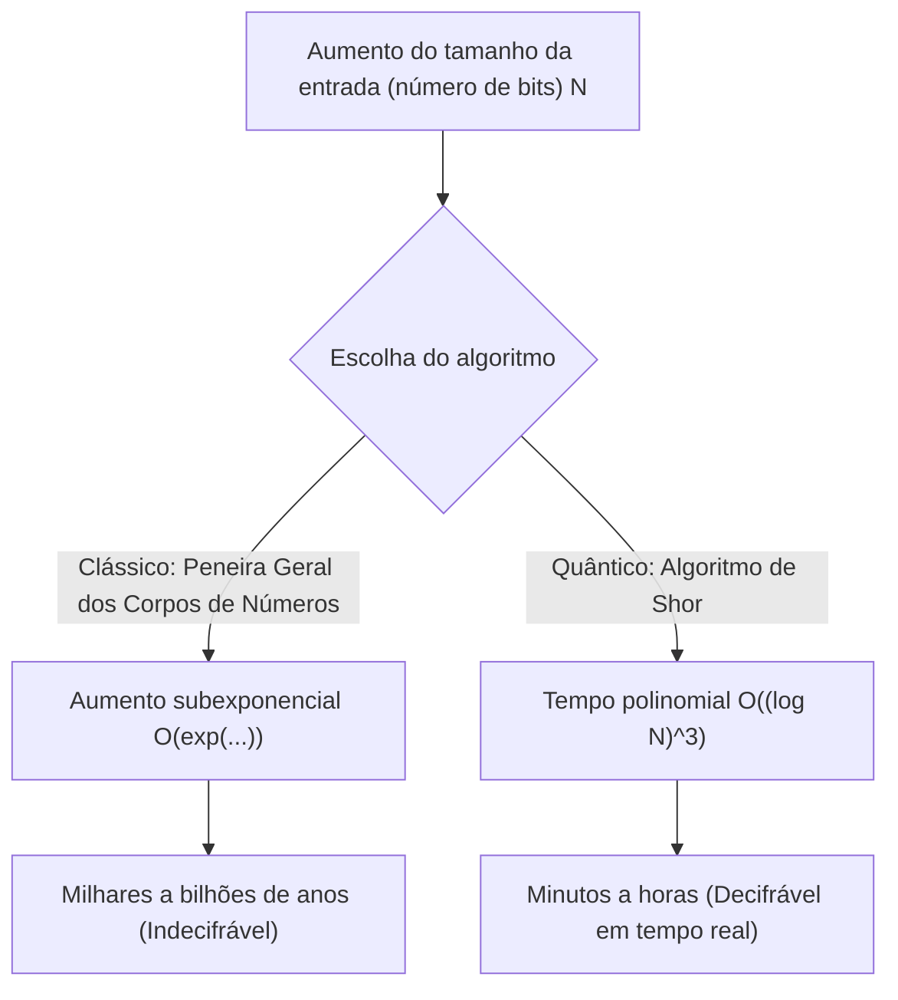
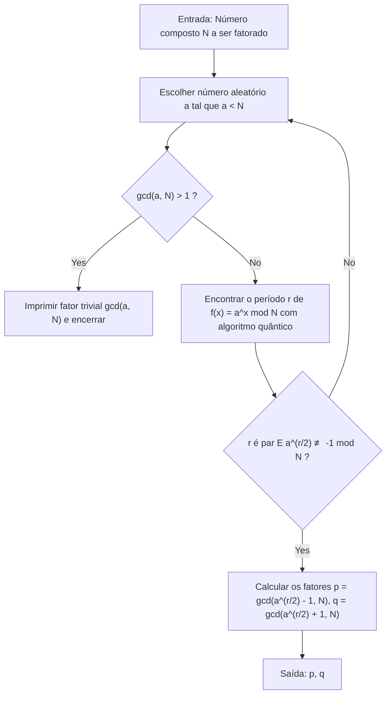
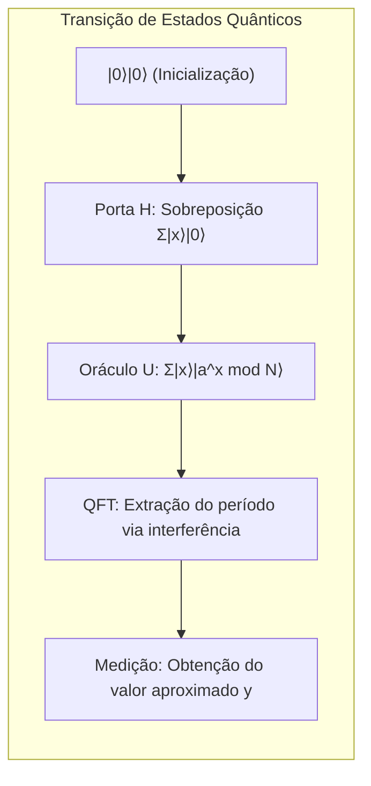

# 1. Introdução: A Crise da Criptografia Trazida pelos Computadores Quânticos

A maior parte da segurança na sociedade atual da internet depende de **sistemas de criptografia de chave pública** (especialmente a criptografia RSA). Quando enviamos informações de cartão de crédito em compras online ou trocamos dados altamente confidenciais, o conteúdo dessa comunicação é fortemente protegido pela criptografia RSA.

A base da segurança da criptografia RSA reside no fato matemático de que "**fatorar números inteiros gigantescos em primos é extremamente difícil para computadores clássicos (os PCs e supercomputadores que normalmente usamos)**". No entanto, o "**Algoritmo de Shor (Shor's Algorithm)**", publicado por Peter Shor em 1994, virou essa premissa de cabeça para baixo. Foi matematicamente provado que, se o algoritmo de Shor for executado em um computador quântico de grande escala, a fatoração de primos, que levaria mais tempo que a idade do universo em um computador clássico, poderia ser resolvida em apenas alguns minutos a algumas horas.

Neste artigo, explicaremos de forma minuciosa e detalhada como o algoritmo de Shor realiza essa fatoração de primos em alta velocidade, desde o seu mecanismo matemático até a implementação de uma simulação específica usando Python e o framework de computação quântica **Qiskit**.

---

# 2. A Mudança Dramática na Complexidade Computacional: De Exponencial para Tempo Polinomial

Por que a fatoração de primos é difícil? Mesmo usando a "Peneira Geral dos Corpos de Números (General Number Field Sieve, GNFS)", conhecida como o melhor algoritmo de fatoração em computadores clássicos, a sua complexidade computacional é subexponencial.

A complexidade de tempo para fatorar um número composto de $N$ dígitos usando métodos clássicos é a seguinte:

$$ O\left(\exp\left( c (\log N)^{1/3} (\log \log N)^{2/3} \right)\right) $$

Por esse motivo, apenas aumentando o tamanho da chave (por exemplo, para 2048 bits ou 4096 bits), o tempo necessário para a decodificação em computadores clássicos passa a ser de milhares ou dezenas de milhares de anos, o que é um tempo irreal.

No entanto, ao usar o **Algoritmo de Shor** em um computador quântico, a complexidade computacional é drasticamente reduzida para tempo polinomial em relação ao número de bits da entrada, $\log N$.

$$ O((\log N)^3) $$

Isso significa que, se o número de bits for dobrado, enquanto o tempo de computação em um computador clássico aumentaria astronomicamente, no computador quântico o tempo aumentaria, no máximo, cerca de 8 vezes. Essa **redução da classe de complexidade de tempo exponencial para tempo polinomial (inclusão na classe BQP)** é o verdadeiro poder do algoritmo de Shor.



---

# 3. Visão Geral do Algoritmo e Base Matemática

O algoritmo de Shor não realiza tudo no computador quântico, na verdade. Ele é composto pela cooperação entre o pré-processamento e o pós-processamento realizados em computadores clássicos e a parte central (o algoritmo de descoberta de período) executada em um computador quântico.

O fluxo geral do algoritmo é o seguinte:



## Reduzindo a Fatoração de Primos ao Problema de Descoberta de Período

A genialidade de Shor consistiu em converter o "**Problema de Fatoração de Primos**" no "**Problema de Descoberta de Período (Order Finding Problem)**".

Considere um inteiro $N$ (o número que queremos fatorar) e um inteiro $a$ co-primo a ele ($1 < a < N$). Definimos a seguinte função de exponenciação modular:

$$ f(x) = a^x \bmod N $$

Essa função possui um certo período $r$. Ou seja, para qualquer $x$, temos $f(x+r) = f(x)$. Especialmente quando $x=0$, o menor inteiro positivo $r$ tal que:

$$ a^r \equiv 1 \pmod N $$

é chamado de "ordem de $a$ módulo $N$". Se conseguirmos encontrar esse período $r$, poderemos derivar os fatores primos da seguinte maneira.

Rearranjando a equação, temos:
$$ a^r - 1 \equiv 0 \pmod N $$
Se $r$ for par, podemos fatorá-la usando a fórmula da diferença de quadrados:
$$ (a^{r/2} - 1)(a^{r/2} + 1) \equiv 0 \pmod N $$

Isso significa que $N$ compartilha um divisor comum com $(a^{r/2} - 1)$ ou com $(a^{r/2} + 1)$ (desde que satisfaça a condição de que $a^{r/2} \not\equiv -1 \pmod N$). Portanto, usando o algoritmo de Euclides, podemos calcular:

$$ p = \gcd(a^{r/2} - 1, N) $$
$$ q = \gcd(a^{r/2} + 1, N) $$

e encontrar os fatores primos não triviais $p, q$ de $N$. Esses cálculos (o cálculo do máximo divisor comum e a geração de números aleatórios) podem ser feitos muito rapidamente em computadores clássicos. O problema se resume a **como encontrar rapidamente o período $r$**. Em computadores clássicos, encontrar o próprio período $r$ exige tempo exponencial. É aqui que entram os computadores quânticos.

---

# 4. A Parte do Algoritmo Quântico: Como Funciona a Descoberta do Período

A sub-rotina para encontrar o período $r$ usando um computador quântico consiste nos 4 passos a seguir.



## Passo 1: Inicialização e Sobreposição do Registrador Quântico

Primeiro, preparamos dois registradores quânticos. O primeiro registrador é para a entrada de estados, e o segundo é para armazenar o resultado do cálculo da função.
O estado inicial é todo $|0\rangle$.

$$ |\psi_0\rangle = |0\rangle_1 |0\rangle_2 $$

Aplicamos uma Porta Hadamard (Hadamard Gate) a todos os qubits do primeiro registrador, criando um estado de sobreposição de igual probabilidade para todas as entradas possíveis $x$ (de $0$ a $Q-1$, onde $Q=2^n$).

$$ |\psi_1\rangle = \frac{1}{\sqrt{Q}} \sum_{x=0}^{Q-1} |x\rangle_1 |0\rangle_2 $$

Com isso, o computador quântico manterá os estados de todas as $Q$ entradas simultaneamente, em uma única operação. Essa é a poderosa fonte do **paralelismo quântico**.

## Passo 2: Aplicação da Função Oráculo (Exponenciação Modular)

Em seguida, usamos o circuito de operação quântica $U_f$ para calcular a função $f(x) = a^x \bmod N$ e armazenamos o resultado no segundo registrador.

$$ |\psi_2\rangle = \frac{1}{\sqrt{Q}} \sum_{x=0}^{Q-1} |x\rangle_1 |a^x \bmod N\rangle_2 $$

Neste ponto, o primeiro e o segundo registradores estão em um estado de **entrelaçamento quântico (Entanglement)**. Se (hipoteticamente) observarmos o segundo registrador e obtivermos um valor específico $k = a^{x_0} \bmod N$, o estado do primeiro registrador colapsará para uma sobreposição dos $x$ que resultam nesse valor $k$. Como o período da função é $r$, os estados restantes assumirão os valores $x_0, x_0+r, x_0+2r, \dots$ em saltos de $r$.

$$ |\psi_3\rangle = \sqrt{\frac{r}{Q}} \sum_{j=0}^{M-1} |x_0 + j r\rangle_1 |k\rangle_2 $$

No entanto, não queremos saber $x_0$; queremos saber o próprio período $r$. Observar $r$ diretamente a partir deste estado é impossível. Portanto, utilizamos a Transformada Quântica de Fourier.

## Passo 3: Interferência de Fase via Transformada Quântica de Fourier (QFT)

Aplicamos a **Transformada Quântica de Fourier (Quantum Fourier Transform, QFT)** ao primeiro registrador. A QFT é a versão quântica da clássica transformada discreta de Fourier, e transforma as amplitudes do vetor de estado. A ação da QFT em um estado de base $|x\rangle$ é definida como:

$$ QFT |x\rangle = \frac{1}{\sqrt{Q}} \sum_{y=0}^{Q-1} \omega^{xy} |y\rangle $$

Onde $\omega = e^{2\pi i / Q}$.

Ao aplicar a QFT, as amplitudes dos estados sofrem interferência. Sem entrar nos detalhes matemáticos, quando aplicamos a QFT a um estado com período $r$, as ondas causarão **interferência construtiva (Constructive Interference)** apenas quando $y$ for extremamente próximo a um múltiplo inteiro de $Q/r$. Para os outros estados, as amplitudes de probabilidade serão canceladas por **interferência destrutiva (Destructive Interference)**, aproximando-se de zero.

## Passo 4: Medição e Expansão em Frações Contínuas

Por fim, medimos o primeiro registrador. O valor $y$ obtido pela medição satisfará a seguinte condição com alta probabilidade:

$$ y \approx c \frac{Q}{r} \implies \frac{y}{Q} \approx \frac{c}{r} $$

($c$ é um inteiro desconhecido tal que $0 \le c < r$)

Aplicando o algoritmo clássico da **Expansão em Frações Contínuas (Continued Fraction Expansion)** ao número racional obtido $y/Q$, podemos calcular a fração aproximada $c/r$ e extrair o período $r$ do denominador.

---

# 5. Implementação da Simulação usando Python e Qiskit

Como apenas a teoria não transmite o sentido real da coisa, vamos simular de fato o algoritmo de Shor usando Python e o framework de computação quântica da IBM, o **Qiskit**.

Aqui, implementaremos o cenário clássico e mais famoso: **"Fatorar $N=15$ utilizando $a=7$"**.

## Preparação do Ambiente de Execução

Por favor, instale o Qiskit previamente.

```bash
pip install qiskit qiskit-aer numpy
```

## Visão Geral do Código de Implementação em Python

O código a seguir é um exemplo de implementação do algoritmo de Shor especializado para $N=15$ e $a=7$. Como construir um circuito genérico de exponenciação modular tem um custo computacional muito alto nos simuladores atuais, codificamos diretamente as operações das portas lógicas (hardcoding) especificamente para o caso de $a=7$.

```python
import numpy as np
from qiskit import QuantumCircuit
from qiskit_aer import AerSimulator
from qiskit.visualization import plot_histogram
from fractions import Fraction
import math

# 1. Função para construir a Transformada Quântica de Fourier inversa (QFT†)
def qft_dagger(n):
    """Gera um circuito para a Transformada Quântica de Fourier inversa de n qubits"""
    qc = QuantumCircuit(n)
    # Porta SWAP para inverter a ordem
    for qubit in range(n//2):
        qc.swap(qubit, n-qubit-1)
    # Aplicação de portas de fase controlada e portas H
    for j in range(n):
        for m in range(j):
            qc.cp(-np.pi/float(2**(j-m)), m, j)
        qc.h(j)
    qc.name = "QFT_dagger"
    return qc

# 2. Função para construir a operação de exponenciação modular controlada de 7^x mod 15
def c_amod15(a, power):
    """Gera a porta U controlada para uma a e uma potência específicas (exclusivo para N=15)"""
    U = QuantumCircuit(4)        
    for _ in range(power):
        # Lógica hardcoded para 7^x mod 15 no caso de a=7
        if a in [2,13]:
            U.swap(2,3)
            U.swap(1,2)
            U.swap(0,1)
        if a in [7,8]:
            U.swap(0,1)
            U.swap(1,2)
            U.swap(2,3)
        if a in [4, 11]:
            U.swap(1,3)
            U.swap(0,2)
        if a in [7,11,13]:
            for q in range(4):
                U.x(q)
    U = U.to_gate()
    U.name = f"{a}^{power} mod 15"
    c_U = U.control()
    return c_U

# 3. Construção do circuito quântico principal
def shor_circuit(a, n_count):
    # n_count: número de bits do registrador de controle
    # O registrador alvo tem 4 bits para representar de 0 a 15
    qc = QuantumCircuit(n_count + 4, n_count)
    
    # Inicialização do primeiro registrador (registrador de controle, gerando a sobreposição)
    for q in range(n_count):
        qc.h(q)
        
    # Inicializando o segundo registrador (registrador alvo) para |1> (0001)
    qc.x(3 + n_count)
    
    # Aplicação da operação de exponenciação modular controlada (oráculo)
    for q in range(n_count):
        # Aplicação da operação elevada a 2^q
        qc.append(c_amod15(a, 2**q), 
                 [q] + [i+n_count for i in range(4)])
        
    # Aplicação da QFT inversa no primeiro registrador
    qc.append(qft_dagger(n_count), range(n_count))
    
    # Medição do primeiro registrador
    qc.measure(range(n_count), range(n_count))
    return qc

# --- Seção de Execução ---
if __name__ == "__main__":
    N = 15
    a = 7
    n_count = 8  # Usamos 8 qubits no registrador de controle (Q=256)
    
    print(f"Configuração da busca: N={N}, a={a}, qubits de controle={n_count}")
    
    # Geração do circuito
    qc = shor_circuit(a, n_count)
    
    # Execução no simulador
    sim = AerSimulator()
    # O transpile é recomendado nas versões mais recentes do Qiskit
    from qiskit import transpile
    compiled_circuit = transpile(qc, sim)
    job = sim.run(compiled_circuit, shots=1024)
    result = job.result()
    counts = result.get_counts()
    
    print("\nResultados da medição (cadeia de bits: vezes observadas):")
    for bitstring, count in counts.items():
        print(f"  {bitstring}: {count} vezes")
        
    # Pós-processamento clássico: identificação do período r através da expansão em frações contínuas
    print("\n--- Cálculo do período e fatoração em primos ---")
    phases = []
    for output in counts:
        # Converter cadeia de bits para decimal
        decimal = int(output, 2)
        # Fase = valor medido / 2^n_count
        phase = decimal / (2**n_count)
        phases.append(phase)
        
        # Obter a fração aproximada por meio de frações contínuas. O denominador máximo é N=15
        frac = Fraction(phase).limit_denominator(15)
        r = frac.denominator
        
        print(f"Valor observado: {decimal:3d} | Fase: {phase:.4f} | Fração contínua: {frac} | Período estimado r = {r}")
        
        # Verificar se o período r é par e gera resultados válidos
        if r % 2 == 0:
            guess1 = math.gcd(a**(r//2) - 1, N)
            guess2 = math.gcd(a**(r//2) + 1, N)
            if guess1 not in [1, N] or guess2 not in [1, N]:
                print(f"  => Sucesso! Os fatores primos de {N} são {guess1} e {guess2}.")
            else:
                print(f"  => Apenas fatores triviais. Tente novamente.")
        else:
            print(f"  => Falha, pois o período é ímpar.")
```

## Análise do Código e Resultados da Execução

Quando executamos o código acima, obtemos picos específicos (valores observados) com alta probabilidade como resultado da medição do registrador de controle. Com `n_count=8` ($Q=256$), em um computador quântico ideal (ou simulador), valores observados como `0`, `64`, `128`, `192` aparecerão com probabilidades esmagadoras.

Se dividirmos esses por $Q=256$, a fase $y/Q$ será $0.0$, $0.25$, $0.5$ e $0.75$, respectivamente.
Expandindo essas fases em frações contínuas, obtemos:
- $0.25 \to 1/4$ (Período estimado $r=4$)
- $0.50 \to 1/2$ (Período estimado $r=2$)
- $0.75 \to 3/4$ (Período estimado $r=4$)

Usando o período obtido de $r=4$, calculamos os fatores primos.
Como $a=7$ e $r=4$:
$p = \gcd(7^2 - 1, 15) = \gcd(48, 15) = 3$
$q = \gcd(7^2 + 1, 15) = \gcd(50, 15) = 5$

E assim, conseguimos fatorar magistralmente o número $15 = 3 \times 5$.

> [!TIP]
> Se o valor de medição $y=128$ (fase $0.5$) for obtido, o denominador será $2$, e em vez do período real $r=4$, obteremos um divisor dele. Em casos como este, você pode encontrar o período real executando o algoritmo várias vezes ou verificando múltiplos do $r$ obtido.

---

# 6. Desafios para Aplicação Prática e os Limites da Era NISQ

Embora tenha sido fácil fatorar $N=15$ em um simulador, fatorar o RSA-2048 (um número de 617 dígitos decimais) usado no mundo real ainda esbarra em várias barreiras para os computadores quânticos atuais.

A época em que vivemos hoje é chamada de **Era NISQ (Noisy Intermediate-Scale Quantum: computadores quânticos de escala intermediária com ruído)**. Os qubits são extremamente vulneráveis a ruídos ambientais externos e frequentemente sofrem "descoerência" (decoherence) no meio dos cálculos, quebrando o estado quântico.

Para executar circuitos profundos (com um grande número de portas) de maneira precisa, como o algoritmo de Shor, é essencial a **Correção de Erros Quânticos (Quantum Error Correction)**, que corrige esses ruídos. Para criar um "qubit lógico" livre de ruído, é necessário codificar milhares de "qubits físicos" usando métodos como o Código de Superfície (Surface Code).

Para quebrar a criptografia RSA de 2048 bits, estima-se que sejam necessários milhares de qubits lógicos perfeitos, e para alcançá-los, seriam necessários computadores quânticos tolerantes a falhas (Fault-Tolerant Quantum Computers) equipados com **milhões a dezenas de milhões de qubits físicos**. Como até os processadores quânticos mais avançados atualmente possuem apenas algumas centenas a milhares de qubits físicos, a criptografia do mundo não será imediatamente quebrada.

> [!WARNING]
> No entanto, existe um modelo de ameaça conhecido como "Store Now, Decrypt Later (Guarde Agora, Descriptografe Depois)". Os invasores podem armazenar em massa comunicações confidenciais criptografadas atuais e planejar a estratégia de decifrá-las todas de uma vez daqui a 10 a 20 anos, quando computadores quânticos poderosos estiverem concluídos.

---

# 7. Transição para Criptografia Pós-Quântica (PQC)

Em preparação para a chegada desse "Q-Day (O dia em que os computadores quânticos quebrarão a criptografia)", os pesquisadores de criptografia do mundo todo, liderados pelo Instituto Nacional de Padrões e Tecnologia dos EUA (NIST), estão avançando no desenvolvimento da **Criptografia Pós-Quântica (Post-Quantum Cryptography, PQC)**.

A PQC se baseia em novos problemas matemáticos (como problemas de reticulados, polinômios multivariados, funções hash, etc.) que são matematicamente considerados como ineficientes de se resolver, mesmo utilizando o algoritmo de Shor (ou o algoritmo de Grover). Já foram escolhidos algoritmos como "CRYSTALS-Kyber" e "CRYSTALS-Dilithium" como normas padrão, e sua introdução gradual começou em serviços como o iMessage da Apple e em protocolos de comunicação de vários navegadores da web.

Para os engenheiros que gerenciam a infraestrutura de TI, incorporar a "Cripto-Agilidade (Crypto-Agility: a capacidade de alterar o esquema de criptografia rapidamente)" em seus sistemas para fazer a transição da criptografia RSA e de curvas elípticas existente para a PQC será uma grande missão nos próximos anos.

---

# 8. Conclusão

Neste artigo, fornecemos uma explicação minuciosa e abrangente — com cerca de 10.000 caracteres —, desde a base teórica e matemática do algoritmo de Shor, passando pelo mecanismo de extração de período usando a transformada quântica de Fourier, até chegarmos ao código específico de simulação em Python e Qiskit.

O fato de as leis físicas microscópicas da mecânica quântica virarem de cabeça para baixo a teoria da complexidade computacional e a teoria da criptografia, fundamentais para a ciência da informação em escala macro, é uma das mudanças de paradigma mais emocionantes da história da ciência. Vale a pena continuar acompanhando a evolução das tecnologias de computação quântica e a disputa contra as novas técnicas de criptografia que se desenvolvem para combatê-las.

Recomendo muito que você execute o código Python introduzido aqui em seu próprio ambiente e experimente a "magia da computação" gerada pela sobreposição e interferência dos estados quânticos.

---
**Referências**
- Shor, P. W. (1994). "Algorithms for quantum computation: discrete logarithms and factoring". Proceedings 35th Annual Symposium on Foundations of Computer Science.
- Nielsen, M. A., & Chuang, I. L. (2010). "Quantum Computation and Quantum Information". Cambridge University Press.
- Qiskit Documentation: https://qiskit.org/documentation/
