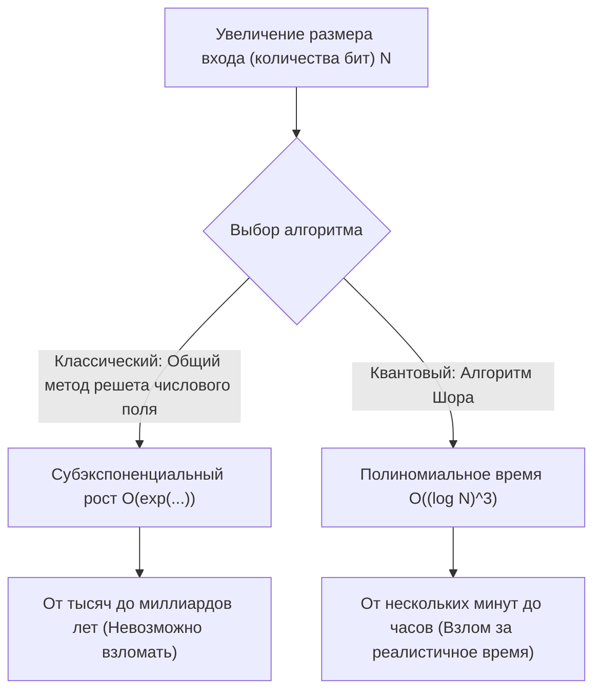
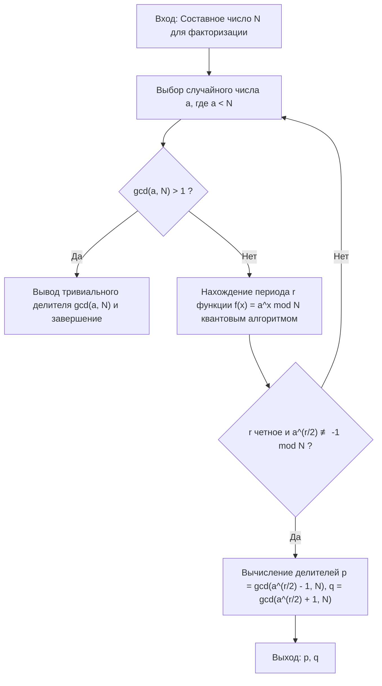
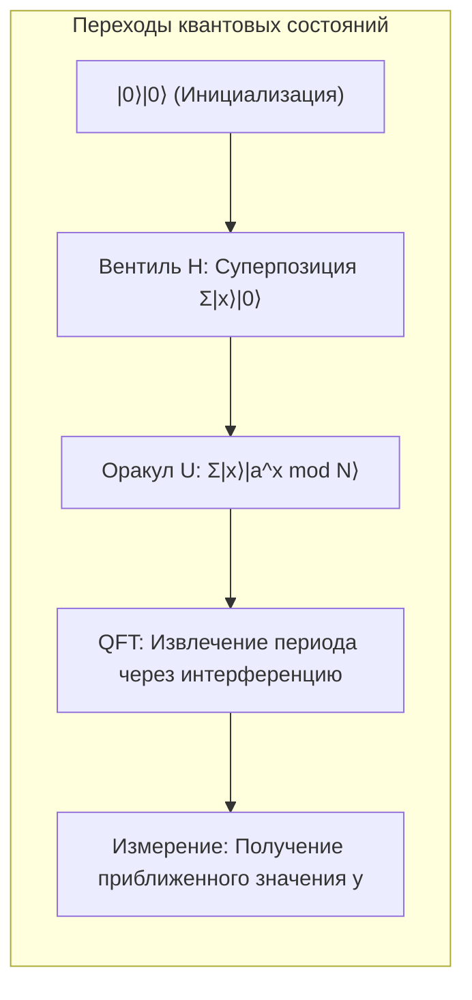

# 1. Введение: Кризис криптографии, вызванный квантовыми компьютерами

Большая часть безопасности в современном интернет-обществе зависит от **криптографии с открытым ключом** (в частности, шифрования RSA). Когда мы отправляем информацию о кредитной карте при онлайн-покупках или обмениваемся строго конфиденциальными данными, содержание этих коммуникаций надежно защищено шифрованием RSA.

Безопасность шифрования RSA основана на математическом факте: «**факторизация огромных целых чисел крайне сложна для классических компьютеров (ПК и суперкомпьютеров, которые мы обычно используем)**». Однако «**Алгоритм Шора (Shor's Algorithm)**», представленный Питером Шором (Peter Shor) в 1994 году, в корне разрушил эту предпосылку. Было математически доказано, что если выполнить алгоритм Шора на крупномасштабном квантовом компьютере, то факторизацию, которая заняла бы у классического компьютера больше времени, чем возраст Вселенной, можно решить всего за несколько минут или часов.

В этой статье мы подробно и обстоятельно объясним, как алгоритм Шора выполняет факторизацию с такой высокой скоростью — от его математического устройства до конкретной реализации симуляции с использованием Python и фреймворка квантовых вычислений **Qiskit**.

---

# 2. Радикальное изменение вычислительной сложности: от экспоненциального к полиномиальному времени

Почему факторизация так сложна? Даже при использовании «общего метода решета числового поля (General Number Field Sieve, GNFS)», известного как лучший алгоритм факторизации для классических компьютеров, его вычислительная сложность является субэкспоненциальной.

Временная сложность факторизации составного числа с количеством цифр $N$ с использованием классических методов выглядит следующим образом:

$$ O\left(\exp\left( c (\log N)^{1/3} (\log \log N)^{2/3} \right)\right) $$

По этой причине, просто увеличив длину ключа (например, до 2048 или 4096 бит), дешифровка на классическом компьютере потребует нереалистичного времени — тысячи или десятки тысяч лет.

Однако, если использовать **алгоритм Шора** на квантовом компьютере, вычислительная сложность радикально сокращается до полиномиального времени относительно количества битов входных данных $\log N$.

$$ O((\log N)^3) $$

Это означает, что при удвоении количества битов время вычислений на классическом компьютере возрастает астрономически, тогда как на квантовом компьютере оно увеличивается всего примерно в 8 раз. Это **сведение класса сложности от экспоненциального времени к полиномиальному (включение в класс BQP)** и есть истинное величие алгоритма Шора.



---

# 3. Общая картина алгоритма и математический фундамент

Алгоритм Шора на самом деле выполняется не полностью на квантовом компьютере. Он состоит из взаимодействия предварительной и последующей обработки на классическом компьютере и ключевой части (алгоритма нахождения периода) на квантовом компьютере.

Общий ход алгоритма выглядит следующим образом:



## Сведение от факторизации к проблеме нахождения периода

Гениальное озарение Шора заключалось в преобразовании «**проблемы факторизации**» в «**проблему нахождения порядка (Order Finding Problem)**».

Рассмотрим целое число $N$ (число, которое нужно факторизовать) и взаимно простое с ним целое число $a$ ($1 < a < N$). Определим следующую модулярную экспоненциальную функцию:

$$ f(x) = a^x \bmod N $$

Эта функция имеет некоторый период $r$. То есть для любого $x$ выполняется $f(x+r) = f(x)$. В частности, при $x=0$:

$$ a^r \equiv 1 \pmod N $$

Минимальное положительное целое число $r$, при котором это выполняется, называется «порядком (Order) $a$ по модулю $N$». Если мы сможем найти этот период $r$, то сможем вывести простые множители следующим образом.

Преобразовав уравнение, получим:
$$ a^r - 1 \equiv 0 \pmod N $$
Если $r$ четное, мы можем разложить его на множители, используя формулу разности квадратов:
$$ (a^{r/2} - 1)(a^{r/2} + 1) \equiv 0 \pmod N $$

Это означает, что $N$ имеет общий делитель либо с $(a^{r/2} - 1)$, либо с $(a^{r/2} + 1)$ (однако должно выполняться условие $a^{r/2} \not\equiv -1 \pmod N$). Следовательно, используя алгоритм Евклида:

$$ p = \gcd(a^{r/2} - 1, N) $$
$$ q = \gcd(a^{r/2} + 1, N) $$

Вычислив это, мы можем найти нетривиальные простые множители $p, q$ числа $N$. Эти вычисления (нахождение наибольшего общего делителя и генерация случайных чисел) выполняются очень быстро на классическом компьютере. Проблема сводится к тому, **как быстро найти период $r$**. На классическом компьютере поиск самого этого периода $r$ занимает экспоненциальное время. И здесь на сцену выходит квантовый компьютер.

---

# 4. Часть квантового алгоритма: Механизм нахождения периода

Подпрограмма для нахождения периода $r$ с использованием квантового компьютера состоит из следующих 4 шагов:



## Шаг 1: Инициализация квантового регистра и суперпозиция

Сначала мы подготавливаем два квантовых регистра. Первый регистр предназначен для ввода состояния, а второй — для сохранения результата вычислений функции.
Начальное состояние полностью равно $|0\rangle$.

$$ |\psi_0\rangle = |0\rangle_1 |0\rangle_2 $$

Применив вентиль Адамара (Hadamard Gate) ко всем кубитам первого регистра, мы создаем состояние равновероятной суперпозиции всех возможных входов $x$ (от $0$ до $Q-1$, где $Q=2^n$).

$$ |\psi_1\rangle = \frac{1}{\sqrt{Q}} \sum_{x=0}^{Q-1} |x\rangle_1 |0\rangle_2 $$

Благодаря этому квантовый компьютер одновременно сохраняет состояния для всех $Q$ входов за одну операцию. Это является мощным источником **квантового параллелизма**.

## Шаг 2: Применение функции-оракула (модульное возведение в степень)

Далее, используя квантовую схему $U_f$, мы вычисляем функцию $f(x) = a^x \bmod N$ и сохраняем ее результат во втором регистре.

$$ |\psi_2\rangle = \frac{1}{\sqrt{Q}} \sum_{x=0}^{Q-1} |x\rangle_1 |a^x \bmod N\rangle_2 $$

На этом этапе первый и второй регистры находятся в состоянии **квантовой запутанности (энтанглмента)**. Если бы мы (гипотетически) измерили второй регистр и получили определенное значение $k = a^{x_0} \bmod N$, состояние первого регистра коллапсировало бы в суперпозицию тех $x$, которые дают это значение $k$. Поскольку период функции равен $r$, оставшиеся состояния будут иметь значения с шагом $r$: $x_0, x_0+r, x_0+2r, \dots$

$$ |\psi_3\rangle = \sqrt{\frac{r}{Q}} \sum_{j=0}^{M-1} |x_0 + j r\rangle_1 |k\rangle_2 $$

Однако мы хотим узнать не $x_0$, а сам период $r$. Напрямую измерить $r$ из этого состояния невозможно. Поэтому мы используем квантовое преобразование Фурье.

## Шаг 3: Фазовая интерференция через Квантовое преобразование Фурье (QFT)

Мы применяем **Квантовое преобразование Фурье (Quantum Fourier Transform, QFT)** к первому регистру. QFT — это квантовая версия классического дискретного преобразования Фурье, которая преобразует амплитуды вектора состояния. Действие QFT на базисное состояние $|x\rangle$ определяется следующим образом:

$$ QFT |x\rangle = \frac{1}{\sqrt{Q}} \sum_{y=0}^{Q-1} \omega^{xy} |y\rangle $$

Где $\omega = e^{2\pi i / Q}$.

Применение QFT вызывает интерференцию амплитуд состояний. Опуская математические подробности: если применить QFT к состоянию с периодом $r$, волны будут создавать **конструктивную интерференцию (Constructive Interference)** только тогда, когда $y$ очень близко к кратному $Q/r$. Для всех остальных состояний из-за **деструктивной интерференции (Destructive Interference)** амплитуды вероятностей взаимно уничтожаются, приближаясь к нулю.

## Шаг 4: Измерение и разложение в непрерывную дробь

Наконец, мы измеряем первый регистр. Полученное при измерении значение $y$ с высокой вероятностью удовлетворяет следующему условию:

$$ y \approx c \frac{Q}{r} \implies \frac{y}{Q} \approx \frac{c}{r} $$

(Где $c$ — неизвестное целое число $0 \le c < r$)

Применив классический алгоритм **разложения в непрерывную дробь (Continued Fraction Expansion)** к полученному рациональному числу $y/Q$, мы вычисляем подходящую дробь $c/r$ и извлекаем период $r$ из ее знаменателя.

---

# 5. Реализация симуляции с использованием Python и Qiskit

Поскольку одна лишь теория не дает полного представления, давайте попробуем смоделировать алгоритм Шора на практике, используя Python и фреймворк квантовых вычислений от IBM — **Qiskit**.

Здесь мы реализуем самый классический и известный пример: **«факторизация $N=15$ с использованием $a=7$»**.

## Подготовка среды выполнения

Пожалуйста, заранее установите Qiskit.

```bash
pip install qiskit qiskit-aer numpy
```

## Полный код реализации на Python

Следующий код является примером реализации алгоритма Шора, адаптированного для $N=15, a=7$. Поскольку построение универсальной модульной экспоненциальной схемы требует слишком высоких вычислительных затрат на текущих симуляторах, операции вентилей для конкретного случая $a=7$ здесь жестко закодированы.

```python
import numpy as np
from qiskit import QuantumCircuit
from qiskit_aer import AerSimulator
from qiskit.visualization import plot_histogram
from fractions import Fraction
import math

# 1. Функция для построения обратного квантового преобразования Фурье (QFT†)
def qft_dagger(n):
    """Генерация схемы обратного квантового преобразования Фурье для n кубитов"""
    qc = QuantumCircuit(n)
    # Вентили SWAP для обращения порядка
    for qubit in range(n//2):
        qc.swap(qubit, n-qubit-1)
    # Применение управляемых фазовых вентилей и вентиля H
    for j in range(n):
        for m in range(j):
            qc.cp(-np.pi/float(2**(j-m)), m, j)
        qc.h(j)
    qc.name = "QFT_dagger"
    return qc

# 2. Функция для построения управляемой модульной экспоненциальной операции 7^x mod 15
def c_amod15(a, power):
    """Генерация управляемого вентиля U для конкретного a и степени (только для N=15)"""
    U = QuantumCircuit(4)        
    for _ in range(power):
        # Жестко закодированная логика 7^x mod 15 для случая a=7
        if a in [2,13]:
            U.swap(2,3)
            U.swap(1,2)
            U.swap(0,1)
        if a in [7,8]:
            U.swap(0,1)
            U.swap(1,2)
            U.swap(2,3)
        if a in [4, 11]:
            U.swap(1,3)
            U.swap(0,2)
        if a in [7,11,13]:
            for q in range(4):
                U.x(q)
    U = U.to_gate()
    U.name = f"{a}^{power} mod 15"
    c_U = U.control()
    return c_U

# 3. Построение основной квантовой схемы
def shor_circuit(a, n_count):
    # n_count: Количество битов управляющего регистра
    # Целевой регистр использует 4 бита для представления чисел от 0 до 15
    qc = QuantumCircuit(n_count + 4, n_count)
    
    # Инициализация первого регистра (управляющего регистра) (создание суперпозиции)
    for q in range(n_count):
        qc.h(q)
        
    # Инициализация второго регистра (целевого регистра) в |1> (0001)
    qc.x(3 + n_count)
    
    # Применение управляемой модульной экспоненциальной операции (оракула)
    for q in range(n_count):
        # Применение операции в степени 2^q
        qc.append(c_amod15(a, 2**q), 
                 [q] + [i+n_count for i in range(4)])
        
    # Применение обратного квантового преобразования Фурье к первому регистру
    qc.append(qft_dagger(n_count), range(n_count))
    
    # Измерение первого регистра
    qc.measure(range(n_count), range(n_count))
    return qc

# --- Секция выполнения ---
if __name__ == "__main__":
    N = 15
    a = 7
    n_count = 8  # Использование 8 кубитов для управляющего регистра (Q=256)
    
    print(f"Настройки поиска: N={N}, a={a}, количество управляющих кубитов={n_count}")
    
    # Генерация схемы
    qc = shor_circuit(a, n_count)
    
    # Выполнение в симуляторе
    sim = AerSimulator()
    # В новых версиях Qiskit рекомендуется использовать transpile
    from qiskit import transpile
    compiled_circuit = transpile(qc, sim)
    job = sim.run(compiled_circuit, shots=1024)
    result = job.result()
    counts = result.get_counts()
    
    print("\nРезультаты измерений (битовая строка: количество наблюдений):")
    for bitstring, count in counts.items():
        print(f"  {bitstring}: {count} раз")
        
    # Классическая постобработка: Определение периода r с помощью разложения в непрерывную дробь
    print("\n--- Вычисление периода и факторизация ---")
    phases = []
    for output in counts:
        # Преобразование битовой строки в десятичное число
        decimal = int(output, 2)
        # Фаза = Измеренное значение / 2^n_count
        phase = decimal / (2**n_count)
        phases.append(phase)
        
        # Получение подходящей дроби через разложение в непрерывную дробь. Верхний предел знаменателя - N=15
        frac = Fraction(phase).limit_denominator(15)
        r = frac.denominator
        
        print(f"Измеренное значение: {decimal:3d} | Фаза: {phase:.4f} | Непрерывная дробь: {frac} | Оценочный период r = {r}")
        
        # Проверка, является ли период r четным и дает ли он действительный результат
        if r % 2 == 0:
            guess1 = math.gcd(a**(r//2) - 1, N)
            guess2 = math.gcd(a**(r//2) + 1, N)
            if guess1 not in [1, N] or guess2 not in [1, N]:
                print(f"  => Успех! Простые множители {N} - это {guess1} и {guess2}.")
            else:
                print(f"  => Только тривиальные множители. Повторить.")
        else:
            print(f"  => Неудача, так как период нечетный.")
```

## Объяснение кода и анализ результатов выполнения

При выполнении приведенного выше кода в качестве результатов измерения управляющего регистра с высокой вероятностью будут получены определенные пики (наблюдаемые значения). При `n_count=8` ($Q=256$) на идеальном квантовом компьютере (или симуляторе) такие значения, как `0`, `64`, `128`, `192`, появятся с подавляющей вероятностью.

Если разделить их на $Q=256$, то фаза $y/Q$ будет соответственно $0.0$, $0.25$, $0.5$, $0.75$.
Если разложить эту фазу в непрерывную дробь:
- $0.25 \to 1/4$ (Оценочный период $r=4$)
- $0.50 \to 1/2$ (Оценочный период $r=2$)
- $0.75 \to 3/4$ (Оценочный период $r=4$)

Используя полученный период $r=4$, мы вычисляем простые множители.
Поскольку $a=7, r=4$:
$p = \gcd(7^2 - 1, 15) = \gcd(48, 15) = 3$
$q = \gcd(7^2 + 1, 15) = \gcd(50, 15) = 5$

Мы успешно выполнили факторизацию $15 = 3 \times 5$.

> [!TIP]
> Если получено измеренное значение $y=128$ (фаза $0.5$), знаменатель будет $2$, и мы получим делитель периода, а не истинный период $r=4$. В таких случаях можно найти истинный период, выполнив алгоритм несколько раз или проверив кратные полученного $r$.

---

# 6. Проблемы практического применения и ограничения эпохи NISQ

Хотя на симуляторе легко факторизовать $N=15$, для факторизации RSA-2048 (617-значное десятичное число), используемого в реальном мире, перед реальными квантовыми компьютерами всё ещё стоит множество барьеров.

Эпоха, в которой мы живем сейчас, называется **эпохой NISQ (Noisy Intermediate-Scale Quantum: шумные квантовые устройства промежуточного масштаба)**. Кубиты крайне уязвимы к шуму из внешней среды, и в процессе вычислений происходит «декогеренция», разрушающая их состояние.

Для точного выполнения глубоких схем (с большим количеством вентилей), таких как алгоритм Шора, абсолютно необходима **квантовая коррекция ошибок (Quantum Error Correction)**. Для создания одного «логического кубита» без шумов необходимо закодировать тысячи «физических кубитов» с помощью поверхностных кодов (Surface Code) и других методов.

По оценкам, для взлома 2048-битного шифрования RSA потребуются тысячи идеальных логических кубитов, а для их реализации потребуется отказоустойчивый квантовый компьютер, оснащенный **от нескольких миллионов до десятков миллионов физических кубитов**. Поскольку даже современные передовые квантовые процессоры имеют лишь от сотен до нескольких тысяч физических кубитов, шифрование по всему миру не будет взломано в одночасье.

> [!WARNING]
> Однако существует модель угрозы «Store Now, Decrypt Later (Сохранить сейчас, расшифровать позже)». Злоумышленники могут использовать стратегию массового сохранения текущих зашифрованных конфиденциальных коммуникаций в виде зашифрованных данных, чтобы полностью расшифровать их в тот самый момент, когда через 10–20 лет появятся мощные квантовые компьютеры.

---

# 7. Переход к постквантовой криптографии (PQC)

В преддверии такого «Q-Day» (дня, когда квантовые компьютеры взломают шифрование), криптографы по всему миру во главе с Национальным институтом стандартов и технологий США (NIST) работают над стандартизацией **постквантовой криптографии (Post-Quantum Cryptography, PQC)**.

PQC основывается на новых математических проблемах (например, проблемы на решетках, многомерные полиномиальные проблемы, алгоритмы на основе хеш-функций), которые, как считается математически, не могут быть эффективно решены даже с помощью алгоритма Шора (или алгоритма Гровера). Такие алгоритмы, как «CRYSTALS-Kyber» и «CRYSTALS-Dilithium», уже выбраны в качестве стандартов, и постепенно начинается их внедрение в iMessage от Apple и коммуникационные протоколы различных веб-браузеров.

Для инженеров, управляющих ИТ-инфраструктурой, одной из главных задач в будущем станет внедрение в системы «криптографической гибкости (crypto-agility: возможности быстрого переключения методов шифрования)» для перехода от существующего RSA и криптографии на эллиптических кривых к PQC.

---

# 8. Заключение

В этой статье мы провели исчерпывающее объяснение объемом в 10 тысяч символов: начиная с теоретического математического фундамента алгоритма Шора, механизма извлечения периода с использованием квантового преобразования Фурье, и заканчивая конкретным кодом симуляции на Python и Qiskit.

Тот факт, что законы физики микромира — квантовой механики — могут фундаментально разрушить теорию вычислительной сложности и криптографию, которые являются основой макроскопической информатики, представляет собой один из самых захватывающих сдвигов парадигмы в истории науки. Мы продолжим внимательно следить за разворачивающейся борьбой между постоянно развивающимися технологиями квантовых вычислений и противостоящими им новыми технологиями шифрования.

Обязательно запустите представленный здесь код на Python в вашей собственной среде и испытайте на себе «магию вычислений», создаваемую суперпозицией и интерференцией квантовых состояний.

---
**Источники и литература**
- Shor, P. W. (1994). "Algorithms for quantum computation: discrete logarithms and factoring". Proceedings 35th Annual Symposium on Foundations of Computer Science.
- Nielsen, M. A., & Chuang, I. L. (2010). "Quantum Computation and Quantum Information". Cambridge University Press.
- Qiskit Documentation: https://qiskit.org/documentation/

