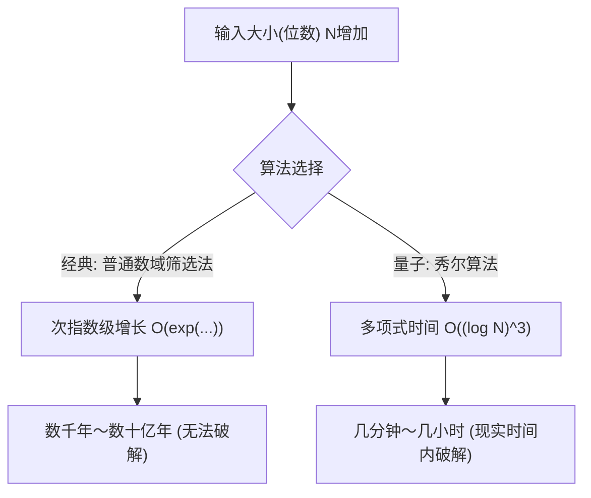
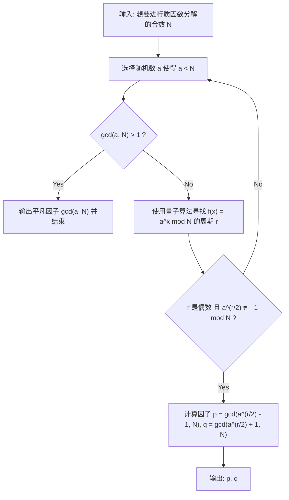
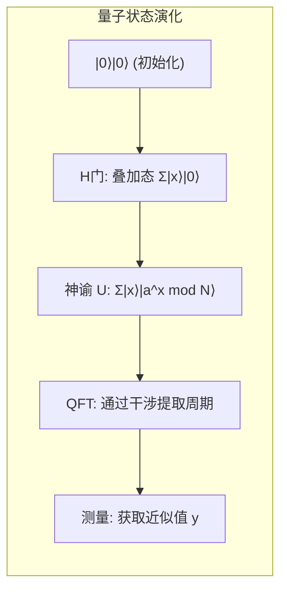

# 1. 引言：量子计算机带来的密码危机

现代互联网社会的大部分安全性都依赖于**公钥密码体制**（尤其是RSA加密）。当我们在网上购物发送信用卡信息，或交换高度机密的数据时，这些通信内容都受到RSA加密的坚固保护。

RSA加密安全性的基础依赖于一个数学事实：“**使用经典计算机（我们日常使用的PC或超级计算机）对巨大的整数进行质因数分解是极其困难的**”。然而，彼得·秀尔（Peter Shor）在1994年发表的“**秀尔算法（Shor's Algorithm）**”从根本上颠覆了这一前提。在数学上已经证明，如果在大型量子计算机上运行秀尔算法，可以在短短几分钟到几个小时内解开经典计算机需要花费超过宇宙年龄的时间才能完成的质因数分解。

在本文中，我们将极其详细地讲解秀尔算法如何高速进行质因数分解，从其数学原理到使用Python和量子计算框架**Qiskit**的具体模拟实现。

---

# 2. 计算复杂度的剧烈变化：从指数级到多项式时间

为什么质因数分解如此困难？即使使用被称为经典计算机中最好的质因数分解算法的“普通数域筛选法（General Number Field Sieve, GNFS）”，其时间复杂度也是次指数级的。

在经典方法中，对位数为 $N$ 的合数进行质因数分解所需的时间复杂度如下：

$$ O\left(\exp\left( c (\log N)^{1/3} (\log \log N)^{2/3} \right)\right) $$

因此，只要增加密钥长度（例如增加到2048位或4096位），在经典计算机上的破解就会耗费数千年、数万年这种不切实际的时间。

但是，如果在量子计算机上使用**秀尔算法**，计算复杂度将针对输入的位数 $\log N$ 剧烈降低到多项式时间。

$$ O((\log N)^3) $$

这意味着，如果将位数翻倍，经典计算机的计算时间会呈天文数字般增长，而在量子计算机上，计算时间最多只会增加约8倍。这种**从指数级时间到多项式时间的计算复杂度类的降低（被包含在BQP类中）**，正是秀尔算法的真正厉害之处。



---

# 3. 算法全貌与数学背景

秀尔算法实际上并非完全在量子计算机上运行。它是通过经典计算机的前处理与后处理，以及量子计算机的核心部分（周期寻找算法）协同工作而构成的。

算法的整体流程如下：



## 从质因数分解归约到周期寻找问题

秀尔的天才之处在于将“**质因数分解问题**”转换为了“**周期寻找问题（Order Finding Problem）**”。

考虑整数 $N$（想要进行质因数分解的数）和一个互质的整数 $a$（$1 < a < N$）。我们定义如下的模指数函数：

$$ f(x) = a^x \bmod N $$

这个函数具有某个周期 $r$。也就是说，对于任意的 $x$，都满足 $f(x+r) = f(x)$。特别是在 $x=0$ 时：

$$ a^r \equiv 1 \pmod N $$

满足这个条件的最小正整数 $r$ 被称为“$a$ 模 $N$ 的阶（Order）”。如果能找到这个周期 $r$，就可以通过以下方式导出质因数。

对公式进行变形：
$$ a^r - 1 \equiv 0 \pmod N $$
如果 $r$ 是偶数，就可以使用平方差公式进行因式分解：
$$ (a^{r/2} - 1)(a^{r/2} + 1) \equiv 0 \pmod N $$

这意味着 $N$ 与 $(a^{r/2} - 1)$ 或 $(a^{r/2} + 1)$ 之一有公约数（但必须满足条件 $a^{r/2} \not\equiv -1 \pmod N$）。因此，使用欧几里得算法计算：

$$ p = \gcd(a^{r/2} - 1, N) $$
$$ q = \gcd(a^{r/2} + 1, N) $$

就可以找到 $N$ 的非平凡质因数 $p, q$。这个计算（计算最大公约数或生成随机数）在经典计算机上可以非常快速地完成。问题的焦点就集中在**如何高速寻找周期 $r$** 上。在经典计算机上，寻找这个周期 $r$ 本身就需要指数级的时间。这里就轮到量子计算机出场了。

---

# 4. 量子算法部分：周期寻找的机制

使用量子计算机寻找周期 $r$ 的子程序由以下4个步骤组成：



## 步骤1：量子寄存器的初始化与叠加

首先，准备两个量子寄存器。第1个寄存器用于输入状态，第2个寄存器用于存储函数的计算结果。
初始状态全为 $|0\rangle$。

$$ |\psi_0\rangle = |0\rangle_1 |0\rangle_2 $$

对第1个寄存器的所有量子比特应用阿达马门（Hadamard Gate），创造出所有可能输入 $x$（从 $0$ 到 $Q-1$，$Q=2^n$）的等概率叠加态。

$$ |\psi_1\rangle = \frac{1}{\sqrt{Q}} \sum_{x=0}^{Q-1} |x\rangle_1 |0\rangle_2 $$

由此，量子计算机将在一次运算中同时保持所有 $Q$ 个输入的状态。这是**量子并行性**的强大源泉。

## 步骤2：应用神谕函数（模幂运算）

接下来，使用量子运算电路 $U_f$ 计算函数 $f(x) = a^x \bmod N$，并将其结果存储到第2寄存器中。

$$ |\psi_2\rangle = \frac{1}{\sqrt{Q}} \sum_{x=0}^{Q-1} |x\rangle_1 |a^x \bmod N\rangle_2 $$

此时，第1寄存器和第2寄存器处于**量子纠缠（Entanglement）**状态。如果（假设）观测第2寄存器并得到了一个特定的值 $k = a^{x_0} \bmod N$，那么第1寄存器的状态将坍缩为给出该值 $k$ 的 $x$ 的叠加态。由于函数的周期是 $r$，剩余的状态将是以 $r$ 为间隔的值，即 $x_0, x_0+r, x_0+2r, \dots$。

$$ |\psi_3\rangle = \sqrt{\frac{r}{Q}} \sum_{j=0}^{M-1} |x_0 + j r\rangle_1 |k\rangle_2 $$

但是，我们想知道的并不是 $x_0$，而是周期 $r$ 本身。从这个状态直接观测 $r$ 是不可能的。因此，我们使用量子傅里叶变换。

## 步骤3：通过量子傅里叶变换（QFT）产生相位干涉

对第1寄存器应用**量子傅里叶变换（Quantum Fourier Transform, QFT）**。QFT是经典离散傅里叶变换的量子版本，它转换状态向量的振幅。QFT对基态 $|x\rangle$ 的作用定义如下：

$$ QFT |x\rangle = \frac{1}{\sqrt{Q}} \sum_{y=0}^{Q-1} \omega^{xy} |y\rangle $$

这里，$\omega = e^{2\pi i / Q}$。

应用QFT后，状态的振幅会产生干涉。省略数学细节，对于具有周期 $r$ 的状态应用QFT时，只有当 $y$ 非常接近 $Q/r$ 的整数倍时，波才会发生**相长干涉（Constructive Interference）**。对于其他状态，由于**相消干涉（Destructive Interference）**，概率振幅会相互抵消并趋向于零。

## 步骤4：测量与连分数展开

最后测量第1寄存器。通过测量得到的值 $y$，以很高的概率满足以下条件：

$$ y \approx c \frac{Q}{r} \implies \frac{y}{Q} \approx \frac{c}{r} $$

（$c$ 是 $0 \le c < r$ 的未知整数）

对得到的有理数 $y/Q$ 应用经典算法**连分数展开（Continued Fraction Expansion）**，计算出近似分数 $c/r$，然后从分母中提取出周期 $r$。

---

# 5. 使用Python和Qiskit的模拟实现

仅凭理论很难有切实的感受，让我们实际使用Python和IBM的量子计算框架**Qiskit**来模拟秀尔算法吧。

在这里，我们将实现最经典著名的例子：**“使用 $a=7$ 对 $N=15$ 进行质因数分解”** 的场景。

## 运行环境准备

请预先安装Qiskit。

```bash
pip install qiskit qiskit-aer numpy
```

## Python实现代码全貌

以下代码是专为 $N=15, a=7$ 编写的秀尔算法实现示例。由于在当前的模拟器中构建通用的模幂电路计算成本过高，因此我们将特定 $a=7$ 情况下的门操作硬编码了。

```python
import numpy as np
from qiskit import QuantumCircuit
from qiskit_aer import AerSimulator
from qiskit.visualization import plot_histogram
from fractions import Fraction
import math

# 1. 构建逆量子傅里叶变换 (QFT†) 的函数
def qft_dagger(n):
    """生成n量子比特的逆量子傅里叶变换电路"""
    qc = QuantumCircuit(n)
    # 用于反转顺序的SWAP门
    for qubit in range(n//2):
        qc.swap(qubit, n-qubit-1)
    # 应用受控相位门和H门
    for j in range(n):
        for m in range(j):
            qc.cp(-np.pi/float(2**(j-m)), m, j)
        qc.h(j)
    qc.name = "QFT_dagger"
    return qc

# 2. 构建 7^x mod 15 的受控模幂运算的函数
def c_amod15(a, power):
    """为特定的a和幂生成受控U门 (N=15专用)"""
    U = QuantumCircuit(4)        
    for _ in range(power):
        # a=7 时 7^x mod 15 的硬编码逻辑
        if a in [2,13]:
            U.swap(2,3)
            U.swap(1,2)
            U.swap(0,1)
        if a in [7,8]:
            U.swap(0,1)
            U.swap(1,2)
            U.swap(2,3)
        if a in [4, 11]:
            U.swap(1,3)
            U.swap(0,2)
        if a in [7,11,13]:
            for q in range(4):
                U.x(q)
    U = U.to_gate()
    U.name = f"{a}^{power} mod 15"
    c_U = U.control()
    return c_U

# 3. 主量子电路构建
def shor_circuit(a, n_count):
    # n_count: 控制寄存器的比特数
    # 目标寄存器为了表示 0〜15，需要 4比特
    qc = QuantumCircuit(n_count + 4, n_count)
    
    # 初始化第1寄存器（控制寄存器）（生成叠加态）
    for q in range(n_count):
        qc.h(q)
        
    # 将第2寄存器（目标寄存器）初始化为 |1> (0001)
    qc.x(3 + n_count)
    
    # 应用受控模幂运算（神谕）
    for q in range(n_count):
        # 应用 2^q 次方的运算
        qc.append(c_amod15(a, 2**q), 
                 [q] + [i+n_count for i in range(4)])
        
    # 对第1寄存器应用逆量子傅里叶变换
    qc.append(qft_dagger(n_count), range(n_count))
    
    # 测量第1寄存器
    qc.measure(range(n_count), range(n_count))
    return qc

# --- 执行部分 ---
if __name__ == "__main__":
    N = 15
    a = 7
    n_count = 8  # 控制寄存器使用8个量子比特 (Q=256)
    
    print(f"搜索设置: N={N}, a={a}, 控制量子比特数={n_count}")
    
    # 生成电路
    qc = shor_circuit(a, n_count)
    
    # 在模拟器上运行
    sim = AerSimulator()
    # 在最新的Qiskit中推荐使用transpile
    from qiskit import transpile
    compiled_circuit = transpile(qc, sim)
    job = sim.run(compiled_circuit, shots=1024)
    result = job.result()
    counts = result.get_counts()
    
    print("\n测量结果(比特串: 观测次数):")
    for bitstring, count in counts.items():
        print(f"  {bitstring}: {count}次")
        
    # 经典后处理: 通过连分数展开确定周期r
    print("\n--- 周期计算与质因数分解 ---")
    phases = []
    for output in counts:
        # 将比特串转换为十进制数
        decimal = int(output, 2)
        # 相位 = 测量值 / 2^n_count
        phase = decimal / (2**n_count)
        phases.append(phase)
        
        # 通过连分数展开获取近似分数。分母上限为 N=15
        frac = Fraction(phase).limit_denominator(15)
        r = frac.denominator
        
        print(f"观测值: {decimal:3d} | 相位: {phase:.4f} | 连分数: {frac} | 估计周期 r = {r}")
        
        # 确认周期 r 是否为偶数并能带来有效结果
        if r % 2 == 0:
            guess1 = math.gcd(a**(r//2) - 1, N)
            guess2 = math.gcd(a**(r//2) + 1, N)
            if guess1 not in [1, N] or guess2 not in [1, N]:
                print(f"  => 成功！ {N} 的质因数是 {guess1} 和 {guess2}。")
            else:
                print(f"  => 仅得到平凡因子。重试。")
        else:
            print(f"  => 周期为奇数，失败。")
```

## 代码解析与执行结果分析

运行上述代码，作为控制寄存器的测量结果，将以极高的概率获得特定的峰值（观测值）。在 `n_count=8`（$Q=256$）的情况下，如果是理想的量子计算机（或模拟器），观测值如 `0`, `64`, `128`, `192` 等出现的概率会非常大。

将它们除以 $Q=256$，相位 $y/Q$ 分别为 $0.0$, $0.25$, $0.5$, $0.75$。
对这些相位进行连分数展开：
- $0.25 \to 1/4$ （估计周期 $r=4$）
- $0.50 \to 1/2$ （估计周期 $r=2$）
- $0.75 \to 3/4$ （估计周期 $r=4$）

使用这里得到的周期 $r=4$，计算质因数。
因为 $a=7, r=4$，
$p = \gcd(7^2 - 1, 15) = \gcd(48, 15) = 3$
$q = \gcd(7^2 + 1, 15) = \gcd(50, 15) = 5$

精彩地，成功完成了 $15 = 3 \times 5$ 的质因数分解。

> [!TIP]
> 如果观测值为 $y=128$（相位 $0.5$），分母将变为 $2$，从而得到其约数而不是真实周期 $r=4$。在这种情况下，可以通过多次运行算法，或者检查所得到的 $r$ 的倍数来找到真实周期。

---

# 6. 走向实用化的课题与 NISQ 时代的局限

虽然在模拟器上可以轻松地对 $N=15$ 进行质因数分解，但要对现实社会中使用的 RSA-2048（617位的十进制数）进行质因数分解，现实的量子计算机还面临许多障碍。

我们现在所处的时代被称为**NISQ（Noisy Intermediate-Scale Quantum：含噪声中等规模量子）时代**。量子比特对外部环境的噪声极其敏感，在计算过程中会发生“退相干”导致状态破坏。

为了准确运行像秀尔算法这样深（门数量多）的电路，必须使用纠正噪声的**量子纠错（Quantum Error Correction）**。为了创造一个没有噪声的“逻辑量子比特”，需要使用表面码（Surface Code）等编码数千个“物理量子比特”。

据估计，为了破解2048位的RSA加密，需要数千个完美的逻辑量子比特，而要实现这一点，需要搭载**数百万到数千万个物理量子比特**的容错量子计算机。即使是当前最先进的量子处理器，也只有几百到几千个物理量子比特的规模，因此全世界的密码不会立即被破解。

> [!WARNING]
> 然而，存在一种称为“Store Now, Decrypt Later（现在存储，以后解密）”的威胁模型。攻击者可能会将现在加密的机密通信以加密数据的形式大量保存下来，并在10到20年后强大的量子计算机完成的瞬间，采取将它们全部解密的策略。

---

# 7. 向抗量子计算密码（PQC）过渡

为了应对这样的“Q-Day（量子计算机破解密码之日）”的到来，以美国国家标准与技术研究院（NIST）为首，全世界的密码学家都在推动**抗量子计算密码（Post-Quantum Cryptography, PQC）**的制定。

PQC基于新的数学问题（如格问题、多变量多项式问题、基于哈希函数等），在数学上被认为即使使用秀尔算法（或使用格罗弗算法）也无法高效求解。已经有诸如“CRYSTALS-Kyber”和“CRYSTALS-Dilithium”等算法被选为标准规范，并正逐步引入Apple的iMessage和各种Web浏览器的通信协议中。

对于管理IT基础设施的工程师来说，将系统从现有的RSA或椭圆曲线加密向PQC过渡，并建立“密码敏捷性（Crypto-Agility：能够快速切换加密方式的设计）”，将是未来的重要使命。

---

# 8. 结语

在本文中，我们从秀尔算法的理论数学背景开始，讲解了使用量子傅里叶变换提取周期的机制，以及使用Python和Qiskit的具体模拟代码，以1万字规模的篇幅进行了极其详细的解说。

量子力学这个微观世界的物理定律，竟然能从根本上颠覆作为宏观信息科学基础的计算复杂性理论和密码学理论，这一事实是科学史上最激动人心的范式转换之一。我们不能将目光从不断发展演进的量子计算技术与应对它的新密码技术的攻防战中移开。

请务必在您自己的环境中运行这次介绍的Python代码，亲身体验量子态的叠加与干涉所产生的“计算魔法”。

---
**参考文献**
- Shor, P. W. (1994). "Algorithms for quantum computation: discrete logarithms and factoring". Proceedings 35th Annual Symposium on Foundations of Computer Science.
- Nielsen, M. A., & Chuang, I. L. (2010). "Quantum Computation and Quantum Information". Cambridge University Press.
- Qiskit Documentation: https://qiskit.org/documentation/
