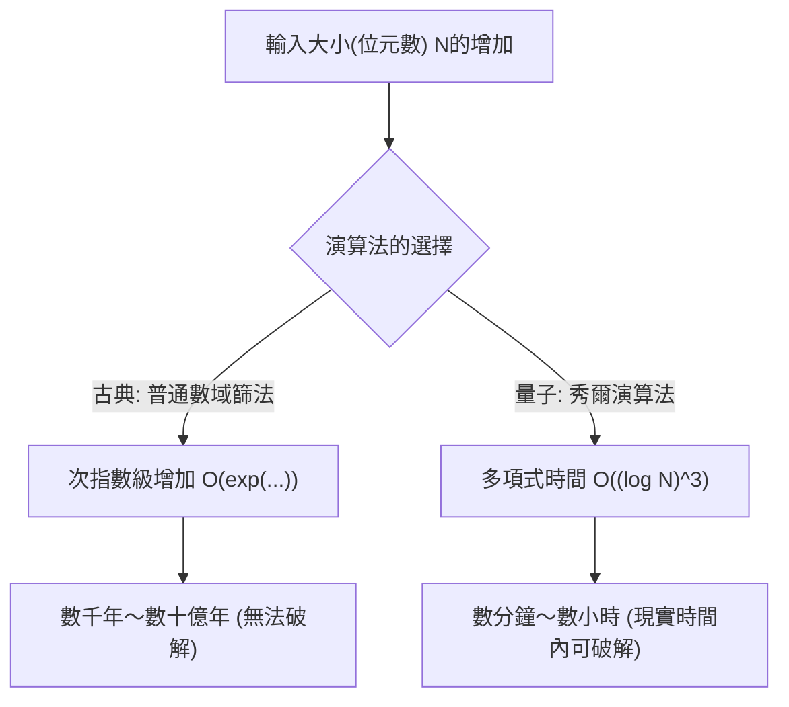
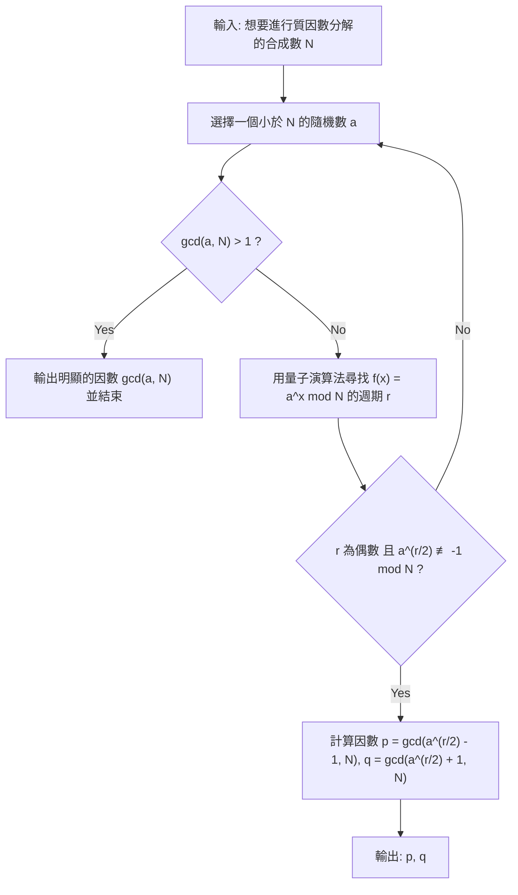
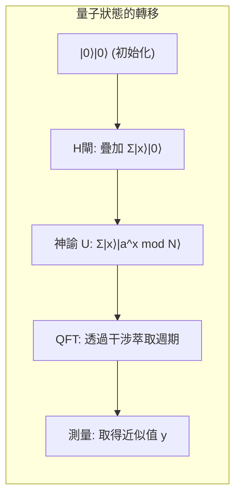

# 1. 簡介：量子電腦帶來的密碼危機

現代網際網路社會中的安全性，大部分依賴於**公鑰加密系統**（尤其是RSA加密）。當我們在線上購物傳送信用卡資訊，或是傳遞高機密性資料時，這些通訊內容都受到RSA加密的強力保護。

RSA加密的安全性基礎，仰賴於一個數學事實：「**將極大的整數進行質因數分解，對古典電腦（我們平時使用的PC或超級電腦）來說是極度困難的**」。然而，彼得·秀爾（Peter Shor）在1994年發表的「**秀爾演算法（Shor's Algorithm）**」，卻從根本上推翻了這個前提。數學上已經證明，如果在大規模的量子電腦上執行秀爾演算法，原本古典電腦需要耗費超過宇宙年齡才能完成的質因數分解，只需短短幾分鐘到幾小時就能解開。

本文將詳細解說秀爾演算法是如何高速進行質因數分解，從其數學原理，到使用Python與量子計算框架**Qiskit**的具體模擬實作，進行徹底且深入的剖析。

---

# 2. 計算複雜度的劇烈變化：從指數函數到多項式時間

為什麼質因數分解這麼困難？即使使用已知在古典電腦上最佳的質因數分解演算法「普通數域篩法（General Number Field Sieve, GNFS）」，其計算複雜度依然是次指數時間的。

使用古典方法，對一個位數為 $N$ 的合成數進行質因數分解的時間複雜度如下：

$$ O\left(\exp\left( c (\log N)^{1/3} (\log \log N)^{2/3} \right)\right) $$

正因如此，只要增加金鑰長度（例如增加到2048位元或4096位元），使用古典電腦破解就需要數千年、數萬年這種不切實際的時間。

但是，如果在量子電腦上使用**秀爾演算法**，相對於輸入的位元數 $\log N$，計算複雜度將會劇烈縮減至多項式時間。

$$ O((\log N)^3) $$

這意味著，當位元數增加為2倍時，古典電腦的計算時間將呈天文數字般暴增，而量子電腦的計算時間頂多只會增加大約8倍。這種**將計算複雜度層級從指數時間縮減到多項式時間（包含於BQP複雜度類別）**的特性，正是秀爾演算法真正的厲害之處。



---

# 3. 演算法全貌與數學背景

其實秀爾演算法並非全部都在量子電腦上執行。它是透過古典電腦的預先處理與後續處理，加上量子電腦負責核心部分（週期尋找演算法）的相互配合所構成。

演算法的整體流程如下：



## 從質因數分解化約為週期尋找問題

秀爾天才般的靈感在於，他將「**質因數分解問題**」轉換成了「**週期尋找問題（Order Finding Problem）**」。

假設有一個整數 $N$（想要質因數分解的數字），以及一個與其互質的整數 $a$（$1 < a < N$）。我們定義以下模指數函數：

$$ f(x) = a^x \bmod N $$

這個函數具有某個週期 $r$。也就是說，對任意的 $x$ 皆滿足 $f(x+r) = f(x)$。特別是當 $x=0$ 時，

$$ a^r \equiv 1 \pmod N $$

能滿足此條件的最小正整數 $r$，我們稱為「$a$ 模 $N$ 的階（Order）」。只要能找到這個週期 $r$，就可以透過以下方式導出質因數。

將式子變形後得到：
$$ a^r - 1 \equiv 0 \pmod N $$
如果 $r$ 是偶數，就可以利用平方差公式進行因式分解：
$$ (a^{r/2} - 1)(a^{r/2} + 1) \equiv 0 \pmod N $$

這意味著 $N$ 與 $(a^{r/2} - 1)$ 或是 $(a^{r/2} + 1)$ 其中之一擁有公因數（不過必須滿足 $a^{r/2} \not\equiv -1 \pmod N$ 這個條件）。因此，我們可以使用輾轉相除法計算：

$$ p = \gcd(a^{r/2} - 1, N) $$
$$ q = \gcd(a^{r/2} + 1, N) $$

藉此就可以找到 $N$ 的非平凡質因數 $p, q$。這些計算（計算最大公因數與產生隨機數）在古典電腦上可以非常高速地完成。因此問題就集中在**如何高速地找到週期 $r$**。在古典電腦上，單是尋找這個週期 $r$ 本身就需要耗費指數時間。這時候就是量子電腦發揮作用的時刻了。

---

# 4. 量子演算法部分：尋找週期的機制

使用量子電腦尋找週期 $r$ 的副程式，由以下4個步驟組成。



## 步驟1：量子暫存器的初始化與疊加

首先準備兩個量子暫存器。第一個暫存器用來輸入狀態，第二個暫存器用來儲存函數的計算結果。
初始狀態全部為 $|0\rangle$。

$$ |\psi_0\rangle = |0\rangle_1 |0\rangle_2 $$

對第一個暫存器的所有量子位元套用阿達馬閘（Hadamard Gate），產生所有可能輸入 $x$ （從 $0$ 到 $Q-1$，$Q=2^n$）等機率的疊加態。

$$ |\psi_1\rangle = \frac{1}{\sqrt{Q}} \sum_{x=0}^{Q-1} |x\rangle_1 |0\rangle_2 $$

如此一來，量子電腦就能在一次運算中同時保有對應 $Q$ 個所有輸入的狀態。這正是**量子平行性**強大的來源。

## 步驟2：套用神諭函數（模指數運算）

接下來，使用量子運算電路 $U_f$ 計算函數 $f(x) = a^x \bmod N$，並將結果儲存於第二個暫存器中。

$$ |\psi_2\rangle = \frac{1}{\sqrt{Q}} \sum_{x=0}^{Q-1} |x\rangle_1 |a^x \bmod N\rangle_2 $$

此時，第一暫存器與第二暫存器處於**量子糾纏（Entanglement）**狀態。如果（假設）我們觀測第二暫存器並得到特定的值 $k = a^{x_0} \bmod N$，那麼第一暫存器的狀態就會塌縮為所有能給出該值 $k$ 的 $x$ 的疊加態。因為函數的週期為 $r$，所以留下來的狀態會是 $x_0, x_0+r, x_0+2r, \dots$ 這樣以 $r$ 為間隔的值。

$$ |\psi_3\rangle = \sqrt{\frac{r}{Q}} \sum_{j=0}^{M-1} |x_0 + j r\rangle_1 |k\rangle_2 $$

但是，我們想知道的並不是 $x_0$，而是週期 $r$ 本身。從這個狀態直接觀測出 $r$ 是不可能的。於是，我們使用量子傅立葉轉換。

## 步驟3：透過量子傅立葉轉換（QFT）進行相位干涉

對第一個暫存器套用**量子傅立葉轉換（Quantum Fourier Transform, QFT）**。QFT是古典離散傅立葉轉換的量子版，能夠轉換狀態向量的振幅。QFT對基底狀態 $|x\rangle$ 的作用定義如下：

$$ QFT |x\rangle = \frac{1}{\sqrt{Q}} \sum_{y=0}^{Q-1} \omega^{xy} |y\rangle $$

這裡的 $\omega = e^{2\pi i / Q}$。

套用QFT後，狀態的振幅會產生干涉。雖然省略了數學細節，但當對具有週期 $r$ 的狀態套用QFT時，只有在 $y$ 極為接近 $Q/r$ 的整數倍時，波才會產生**建設性干涉（Constructive Interference）**。除此之外的其他狀態，會因為**破壞性干涉（Destructive Interference）**使機率振幅互相抵消並趨近於零。

## 步驟4：測量與連分數展開

最後測量第一個暫存器。測量所得的值 $y$，有極高的機率會滿足以下條件：

$$ y \approx c \frac{Q}{r} \implies \frac{y}{Q} \approx \frac{c}{r} $$

（$c$ 是一個滿足 $0 \le c < r$ 的未知整數）

對得到的有理數 $y/Q$ 套用古典演算法**連分數展開（Continued Fraction Expansion）**，便可計算出近似分數 $c/r$，並從分母萃取出週期 $r$。

---

# 5. 使用Python與Qiskit的模擬實作

只看理論很難有實際體會，所以讓我們實際使用Python與IBM的量子計算框架**Qiskit**，來模擬看看秀爾演算法。

在這裡，我們將實作最經典且著名的例子：**「使用 $a=7$ 將 $N=15$ 進行質因數分解」**。

## 執行環境準備

請事先安裝好Qiskit。

```bash
pip install qiskit qiskit-aer numpy
```

## Python實作程式碼全貌

以下程式碼是專門針對 $N=15, a=7$ 的秀爾演算法實作範例。由於建立通用的模指數運算電路對現在的模擬器來說計算成本太高，因此我們將針對 $a=7$ 情況下的閘道動作進行寫死（hardcoding）。

```python
import numpy as np
from qiskit import QuantumCircuit
from qiskit_aer import AerSimulator
from qiskit.visualization import plot_histogram
from fractions import Fraction
import math

# 1. 建構反量子傅立葉轉換 (QFT†) 的函數
def qft_dagger(n):
    """產生n個量子位元的反量子傅立葉轉換電路"""
    qc = QuantumCircuit(n)
    # 用於反轉順序的SWAP閘
    for qubit in range(n//2):
        qc.swap(qubit, n-qubit-1)
    # 套用受控相位閘與H閘
    for j in range(n):
        for m in range(j):
            qc.cp(-np.pi/float(2**(j-m)), m, j)
        qc.h(j)
    qc.name = "QFT_dagger"
    return qc

# 2. 建構 7^x mod 15 的受控模指數運算的函數
def c_amod15(a, power):
    """針對特定的a與次方產生受控U閘(N=15專用)"""
    U = QuantumCircuit(4)        
    for _ in range(power):
        # a=7的情況下 7^x mod 15 的寫死邏輯
        if a in [2,13]:
            U.swap(2,3)
            U.swap(1,2)
            U.swap(0,1)
        if a in [7,8]:
            U.swap(0,1)
            U.swap(1,2)
            U.swap(2,3)
        if a in [4, 11]:
            U.swap(1,3)
            U.swap(0,2)
        if a in [7,11,13]:
            for q in range(4):
                U.x(q)
    U = U.to_gate()
    U.name = f"{a}^{power} mod 15"
    c_U = U.control()
    return c_U

# 3. 主要的量子電路構成
def shor_circuit(a, n_count):
    # n_count: 控制暫存器的位元數
    # 目標暫存器為了表現 0〜15 因此使用 4位元
    qc = QuantumCircuit(n_count + 4, n_count)
    
    # 第一暫存器（控制暫存器）的初始化（產生疊加態）
    for q in range(n_count):
        qc.h(q)
        
    # 將第二暫存器（目標暫存器）初始化為 |1> (0001)
    qc.x(3 + n_count)
    
    # 套用受控模指數運算（神諭）
    for q in range(n_count):
        # 套用 2^q 次方的運算
        qc.append(c_amod15(a, 2**q), 
                 [q] + [i+n_count for i in range(4)])
        
    # 對第一暫存器套用反量子傅立葉轉換
    qc.append(qft_dagger(n_count), range(n_count))
    
    # 測量第一暫存器
    qc.measure(range(n_count), range(n_count))
    return qc

# --- 執行區塊 ---
if __name__ == "__main__":
    N = 15
    a = 7
    n_count = 8  # 控制暫存器使用8個量子位元 (Q=256)
    
    print(f"探索設定: N={N}, a={a}, 控制量子位元數={n_count}")
    
    # 產生電路
    qc = shor_circuit(a, n_count)
    
    # 在模擬器上執行
    sim = AerSimulator()
    # 最新的Qiskit建議使用transpile
    from qiskit import transpile
    compiled_circuit = transpile(qc, sim)
    job = sim.run(compiled_circuit, shots=1024)
    result = job.result()
    counts = result.get_counts()
    
    print("\n測量結果(位元字串: 觀測次數):")
    for bitstring, count in counts.items():
        print(f"  {bitstring}: {count}次")
        
    # 古典後處理: 透過連分數展開找出週期r
    print("\n--- 週期的計算與質因數分解 ---")
    phases = []
    for output in counts:
        # 將位元字串轉換為十進位
        decimal = int(output, 2)
        # 相位 = 測量值 / 2^n_count
        phase = decimal / (2**n_count)
        phases.append(phase)
        
        # 透過連分數展開取得近似分數。分母上限為 N=15
        frac = Fraction(phase).limit_denominator(15)
        r = frac.denominator
        
        print(f"觀測值: {decimal:3d} | 相位: {phase:.4f} | 連分數: {frac} | 估計週期 r = {r}")
        
        # 確認週期 r 是否為偶數且能帶來有效結果
        if r % 2 == 0:
            guess1 = math.gcd(a**(r//2) - 1, N)
            guess2 = math.gcd(a**(r//2) + 1, N)
            if guess1 not in [1, N] or guess2 not in [1, N]:
                print(f"  => 成功！ {N} 的質因數是 {guess1} 與 {guess2}。")
            else:
                print(f"  => 只有平凡因數。請重試。")
        else:
            print(f"  => 週期為奇數因此失敗。")
```

## 程式碼解說與執行結果解析

執行上述程式碼後，作為控制暫存器的測量結果，有極高機率會得到特定的峰值（觀測值）。在 `n_count=8`（$Q=256$）的情況下，如果是理想的量子電腦（或模擬器），像 `0`, `64`, `128`, `192` 這類的數值會以壓倒性的機率作為觀測值出現。

將這些數值除以 $Q=256$ 後，相位 $y/Q$ 分別為 $0.0$, $0.25$, $0.5$, $0.75$。
將這些相位進行連分數展開：
- $0.25 \to 1/4$ （估計週期 $r=4$）
- $0.50 \to 1/2$ （估計週期 $r=2$）
- $0.75 \to 3/4$ （估計週期 $r=4$）

利用這裡得到的週期 $r=4$ 來計算質因數。
因為 $a=7, r=4$，所以：
$p = \gcd(7^2 - 1, 15) = \gcd(48, 15) = 3$
$q = \gcd(7^2 + 1, 15) = \gcd(50, 15) = 5$

漂亮地成功將 $15$ 質因數分解為 $3 \times 5$。

> [!TIP]
> 如果得到的測量值為 $y=128$（相位 $0.5$），分母將會是 $2$，這樣會得到真正的週期 $r=4$ 的因數而非本身。在這種情況下，只要將演算法執行多次，或是檢查所得到 $r$ 的倍數，最終就能找出真正的週期。

---

# 6. 邁向實用化的挑戰與 NISQ 時代的極限

雖然在模擬器上將 $N=15$ 進行質因數分解非常簡單，但要在現實中的量子電腦上分解社會中實際使用的 RSA-2048（617位數的十進位數），目前還存在著許多難以跨越的障礙。

我們現在所處的時代，被稱為 **NISQ（Noisy Intermediate-Scale Quantum：含雜訊中等規模量子）時代**。量子位元對外部環境的雜訊極度敏感，計算途中容易發生「退相干（Decoherence）」導致狀態崩壞。

為了能準確執行像秀爾演算法這種具有深度（閘數量多）的電路，能修正雜訊的**量子錯誤更正（Quantum Error Correction）**是不可或缺的。為了創造出一個沒有雜訊的「邏輯量子位元」，需要透過表面碼（Surface Code）等方式將數千個「實體量子位元」進行編碼。

據估計，要破解2048位元的RSA加密，需要數千個完美的邏輯量子位元，這意味著必須要有搭載**數百萬至數千萬個實體量子位元**的容錯（Fault-tolerant）量子電腦才能實現。而目前最先進的量子處理器也只有幾百到幾千個實體量子位元左右，因此全世界的密碼並不會立刻被破解。

> [!WARNING]
> 然而，存在著一種名為「Store Now, Decrypt Later（現在儲存，日後解密）」的威脅模型。攻擊者可能會將目前加密的機密通訊資料大量儲存起來，等到10至20年後強大的量子電腦問世時，再將其全部解密，這是一種非常可能的策略。

---

# 7. 轉移至後量子密碼學（PQC）

為了因應這種「Q-Day（量子電腦破解密碼之日）」的到來，以美國國家標準暨技術研究院（NIST）為首，全世界的密碼學家正在積極制定**後量子密碼學（Post-Quantum Cryptography, PQC）**標準。

PQC 建立在被認為即使使用秀爾演算法（或葛羅佛演算法）也無法在數學上有效解開的全新數學問題（如晶格問題、多變數多項式問題、雜湊函數等）基礎上。目前像是「CRYSTALS-Kyber」與「CRYSTALS-Dilithium」等演算法已經被選為標準規格，並正逐漸導入 Apple 的 iMessage 或是各大網頁瀏覽器的通訊協定中。

對管理IT基礎設施的工程師來說，在系統中導入從現有 RSA 或橢圓曲線密碼轉換到 PQC 的「密碼敏捷性（Crypto-Agility：能快速切換密碼系統的設計）」，將會是未來的一大任務。

---

# 8. 結語

本文從秀爾演算法的理論數學背景開始，介紹了使用量子傅立葉轉換萃取週期的機制，並深入到使用Python與Qiskit的具體模擬程式碼，以約一萬字的篇幅進行了徹底的解說。

量子力學這種微觀世界的物理法則，竟然能從根本推翻作為宏觀資訊科學基礎的計算複雜度理論與密碼理論，這是科學史上最令人興奮的典範轉移之一。未來我們也絕對不能將目光從持續發展的量子運算技術，以及與之抗衡的新型密碼技術的攻防戰中移開。

請務必在您自己的環境中執行本次介紹的Python程式碼，親身體驗量子狀態的疊加與干涉所創造出來的「計算魔法」。

---
**參考文獻**
- Shor, P. W. (1994). "Algorithms for quantum computation: discrete logarithms and factoring". Proceedings 35th Annual Symposium on Foundations of Computer Science.
- Nielsen, M. A., & Chuang, I. L. (2010). "Quantum Computation and Quantum Information". Cambridge University Press.
- Qiskit Documentation: https://qiskit.org/documentation/

