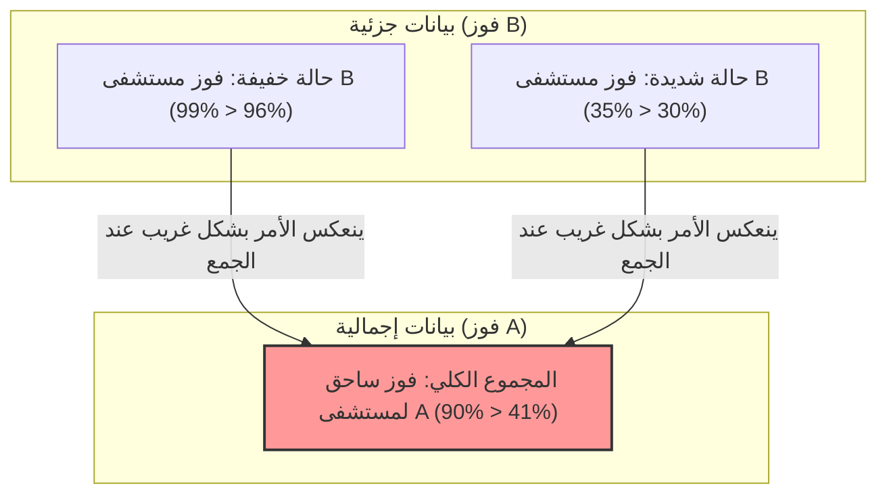

## 1. في أي مستشفى يجب أن تخضع للجراحة؟

لقد أُصبت بمرض خطير وعليك الخضوع لعملية جراحية.
أمامك خياران: مستشفى A ومستشفى B. لقد طلبت بيانات "معدل النجاح" للعمليات الجراحية في كل مستشفى.

**【معدل النجاح الإجمالي】**
- **مستشفى A**: 900 نجاح من أصل 1000 شخص (معدل النجاح **90%**)
- **مستشفى B**: 800 نجاح من أصل 1000 شخص (معدل النجاح **80%**)

عند رؤية هذا، سيعتقد أي شخص أن "مستشفى A هو الأفضل!".
ولكن، بما أنك شخص حذر، قررت التحقيق بشكل أعمق لمعرفة كيف تتغير البيانات بناءً على حالة المرض (خفيفة أم شديدة).

**【معدل نجاح المرضى ذوي الحالات الخفيفة】**
- **مستشفى A**: 99 نجاحاً من أصل 100 شخص (معدل النجاح **99%**)
- **مستشفى B**: 870 نجاحاً من أصل 900 شخص (معدل النجاح **96%**)
$\rightarrow$ في الحالات الخفيفة، **يفوز مستشفى A (99% > 96%)**

**【معدل نجاح المرضى ذوي الحالات الشديدة】**
- **مستشفى A**: 801 نجاحاً من أصل 900 شخص (معدل النجاح **89%**)
- **مستشفى B**: 70 نجاحاً من أصل 100 شخص (معدل النجاح **70%**)
$\rightarrow$ حتى في الحالات الشديدة، **يفوز مستشفى A (89% > 70%)**

مهلاً؟ ألا تعتقد أن هناك شيئاً غريباً؟

بالنسبة للمرضى ذوي الحالات "الخفيفة"، معدل نجاح مستشفى A أعلى.
وبالنسبة للمرضى ذوي الحالات "الشديدة"، معدل نجاح مستشفى A أعلى أيضاً.
ومع ذلك، إذا حسبنا "الإجمالي" لمعدل نجاح جميع المرضى معاً...؟

- إجمالي مستشفى A: $(99 + 801) / 1000 =$ **90%**
- إجمالي مستشفى B: $(870 + 70) / 1000 =$ **94%**... لا، وفقاً للحسابات السابقة فهو **80%؟**

انتظر لحظة، دعنا نلقي نظرة على البيانات الأولى مرة أخرى.
البيانات الأولى كانت هكذا:
- معدل النجاح الإجمالي لمستشفى A: **90%**
- معدل النجاح الإجمالي لمستشفى B: **80%**

ولكن، إذا أعدنا الحساب باستخدام البيانات المقسمة تفصيلياً،
فإن معدل النجاح الإجمالي لمستشفى B يجب أن يكون $(870 + 70) / 1000 = 940 / 1000 =$ **94%**.

**... حسنًا، لقد تم خداعنا!**
في الواقع، خدعة الأرقام هذه هي بالضبط الفخ المرعب للإحصاءات الذي سنشرحه هذه المرة.
دعني أريك البيانات الصحيحة مرة أخرى.

---

## 2. إليك أيها المخدوع: البيانات الحقيقية

**【معدل نجاح المرضى ذوي الحالات الخفيفة】**
- **مستشفى A**: 870 نجاحاً من أصل 900 شخص (معدل النجاح **96%**)
- **مستشفى B**: 99 نجاحاً من أصل 100 شخص (معدل النجاح **99%**)
$\rightarrow$ في الحالات الخفيفة، **يفوز مستشفى B (99% > 96%)**

**【معدل نجاح المرضى ذوي الحالات الشديدة】**
- **مستشفى A**: 30 نجاحاً من أصل 100 شخص (معدل النجاح **30%**)
- **مستشفى B**: 315 نجاحاً من أصل 900 شخص (معدل النجاح **35%**)
$\rightarrow$ حتى في الحالات الشديدة، **يفوز مستشفى B (35% > 30%)**

بمعنى آخر، سواء كانت الحالة خفيفة أو شديدة، **فإن مستشفى B يتفوق بشكل ساحق**.

إذن، دعنا نجمع هذا في "الإجمالي".

- **إجمالي مستشفى A**: $(870 + 30) / (900 + 100) = 900 / 1000 =$ **معدل النجاح 90%**
- **إجمالي مستشفى B**: $(99 + 315) / (100 + 900) = 414 / 1000 =$ **معدل النجاح 41%**

يا للعجب، عندما ننظر إلى "الأجزاء" يفوز مستشفى B في كل شيء، ولكن عندما نجمعها في "الإجمالي"، يصبح الفوز الساحق لمستشفى A!
هذه الظاهرة تسمى **"مفارقة سيمبسون"**.

---

## 3. لماذا يحدث هذا الانعكاس الغريب؟

السر وراء هذه المفارقة يكمن في **"انحياز المعلمات (المقام)"** و **"المتغيرات الخفية (العوامل المربكة)"**.

انظر عن كثب إلى البيانات.
- مستشفى A يقبل **عدداً كبيراً (900 شخص) من "المرضى ذوي الحالات الخفيفة الذين يسهل شفاؤهم"**.
- مستشفى B يقبل **عدداً كبيراً (900 شخص) من "المرضى ذوي الحالات الشديدة الذين يصعب شفاؤهم"**.

نظراً لمهارة أطباء مستشفى B، فقد كان أشبه بـ "الملاذ الأخير"، حيث يستقبل العديد من المرضى ذوي الحالات الشديدة والمعقدة الذين ترفضهم المستشفيات الأخرى. بطبيعة الحال، سيكون معدل نجاح الحالات الشديدة منخفضاً (35%). "معدل النجاح الإجمالي" لمستشفى B تأثر سلبًا بهذا العدد الكبير من الحالات الشديدة ذات معدلات النجاح المنخفضة، مما جعله يبدو منخفضاً بشكل عام (41%).

على العكس من ذلك، يتعامل مستشفى A في الغالب مع الحالات الخفيفة البسيطة، لذلك بدا معدل نجاحه الإجمالي مرتفعاً (90%) فقط بسبب ذلك، ولكن عند المقارنة تحت نفس الظروف (حالات شديدة مقابل شديدة، وخفيفة مقابل خفيفة)، فإن مهاراته أقل من مستشفى B.

إذا تم التعبير عنها رياضياً، فإن السبب هو طبيعة جمع الكسور.
بشكل عام، حتى لو كان $\frac{a}{b} < \frac{A}{B}$ و $\frac{c}{d} < \frac{C}{D}$، فإن
$$ \frac{a+c}{b+d} < \frac{A+C}{B+D} $$
لا يتحقق دائماً. عندما تكون أحجام المقامات مختلفة بشكل كبير، قد ينعكس اتجاه المتباينة.

---

## 4. "مفارقة سيمبسون" في العالم الحقيقي

هذه المفارقة ليست مجرد لغز حسابي، بل إنها تحدث بشكل متكرر في المجتمع الحقيقي، وقد أثارت جدلاً واسعاً في الماضي.

### عام 1973: شبهات التمييز الجنسي في جامعة كاليفورنيا، بيركلي
عندما تم فحص معدلات القبول في برامج الدراسات العليا بجامعة بيركلي، وُجد أن "معدل قبول الذكور (44%)" كان أعلى بكثير من "معدل قبول الإناث (35%)"، مما أثار مشكلة حول وجود تمييز واضح ضد النساء.
ولكن، عندما تم تقسيم البيانات إلى أجزاء صغيرة "حسب القسم" وتحليلها، تم اكتشاف حقيقة مذهلة.
في كل الأقسام تقريباً، **كان معدل قبول الإناث أعلى من معدل قبول الذكور**.

لماذا انعكست الأرقام الإجمالية؟
في الواقع، كانت الإناث يتقدمن بشكل أكبر إلى "الأقسام ذات معدلات القبول المنخفضة (ذات التنافسية العالية)"، بينما كان الذكور يتقدمون بشكل أكبر إلى "الأقسام ذات معدلات القبول المرتفعة (التي يسهل دخولها)" فقط.

### بيانات فعالية لقاح كورونا
انتشرت بيانات تشير إلى أن "معدل الوفيات بين الأشخاص الذين تلقوا اللقاح أعلى من أولئك الذين لم يتلقوه"، مما أحدث ضجة.
هذا أيضاً نتيجة لتجاهل البيانات حسب الفئة العمرية (متغير خفي).
نظراً لأن اللقاح تم إعطاؤه للأولوية لـ "كبار السن (الذين لديهم بالفعل معدل وفيات أعلى)"، فعند جمع معدل الوفيات الإجمالي ببساطة، كانت مجموعة الأشخاص الذين تلقوا اللقاح منحازة بشكل كبير نحو كبار السن، مما جعل معدل الوفيات يبدو أعلى ظاهرياً.

عند المقارنة بعد التقسيم حسب الفئة العمرية، تم التأكيد على أنه في جميع الفئات العمرية "كان معدل الوفيات للأشخاص الذين تلقوا اللقاح أقل".

---

## 5. الخلاصة: البيانات لا تكذب، لكن الناس يمكنهم الكذب باستخدام البيانات

تحذرنا مفارقة سيمبسون من **"خطر اتخاذ القرارات بناءً على البيانات الإجمالية فقط مثل المتوسطات أو الإجماليات"**.

يمتلئ العالم بالشركات والسياسيين ووسائل الإعلام التي تقتطع "الأرقام الإجمالية" فقط للترويج لأنفسهم بطريقة تناسبهم.
حتى لو قيل لك "منتجنا A لديه مستوى رضا إجمالي أعلى من منتج الشركة المنافسة B!"، فربما إذا قمت بتقسيم البيانات إلى "فئة الشباب" و "فئة كبار السن"، ستجد أن منتج الشركة المنافسة B يتفوق في كلا الفئتين.

عند النظر إلى البيانات، فإن امتلاك عين تشكك ولا تنخدع بالأرقام "الإجمالية" السطحية، وتتساءل "هل هناك انحياز شديد في نسب المجموعات بسبب المتغيرات المخفية وراء الكواليس (العمر، الجنس، شدة المرض، إلخ)؟"، هو أقوى سلاح للنجاة في مجتمع المعلومات الحديث.
