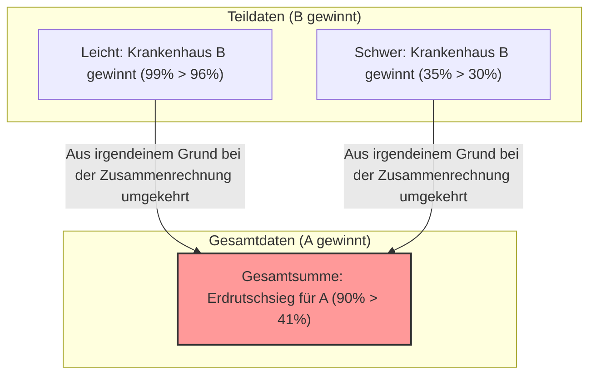

## 1. In welchem Krankenhaus sollten Sie sich operieren lassen?

Sie sind schwer erkrankt und müssen sich einer Operation unterziehen.
Sie haben zwei Optionen vor sich: Krankenhaus A und Krankenhaus B. Sie haben die Daten zur „Erfolgsquote“ der Operationen für jedes Krankenhaus angefordert.

**【Gesamte Erfolgsquote】**
- **Krankenhaus A**: 900 von 1000 Personen erfolgreich (Erfolgsquote **90%**)
- **Krankenhaus B**: 800 von 1000 Personen erfolgreich (Erfolgsquote **80%**)

Wenn man dies sieht, würde jeder denken: „Krankenhaus A ist besser!“.
Da Sie jedoch ein vorsichtiger Mensch sind, haben Sie beschlossen, genauer zu untersuchen, wie sich die Daten je nach Zustand der Krankheit (leicht oder schwer) ändern.

**【Erfolgsquote bei leichten Fällen】**
- **Krankenhaus A**: 99 von 100 Personen erfolgreich (Erfolgsquote **99%**)
- **Krankenhaus B**: 870 von 900 Personen erfolgreich (Erfolgsquote **96%**)
$\rightarrow$ Bei leichten Fällen **gewinnt Krankenhaus A (99% > 96%)**

**【Erfolgsquote bei schweren Fällen】**
- **Krankenhaus A**: 801 von 900 Personen erfolgreich (Erfolgsquote **89%**)
- **Krankenhaus B**: 70 von 100 Personen erfolgreich (Erfolgsquote **70%**)
$\rightarrow$ Auch bei schweren Fällen **gewinnt Krankenhaus A (89% > 70%)**

Moment mal? Finden Sie das nicht seltsam?

Auch für Patienten mit „leichten Fällen“ hat Krankenhaus A eine höhere Erfolgsquote.
Auch für Patienten mit „schweren Fällen“ hat Krankenhaus A eine höhere Erfolgsquote.
Was passiert jedoch, wenn wir die „Gesamterfolgsquote“ aller Patienten berechnen...?

- Krankenhaus A gesamt: $(99 + 801) / 1000 =$ **90%**
- Krankenhaus B gesamt: $(870 + 70) / 1000 =$ **94%**... Nein, nach der vorherigen Berechnung sind es **80%?** 

Warten Sie, lassen Sie uns die ersten Daten noch einmal betrachten.
Die ersten Daten sahen so aus:
- Gesamterfolgsquote Krankenhaus A: **90%**
- Gesamterfolgsquote Krankenhaus B: **80%**

Aber wenn wir mit den detaillierten Daten neu rechnen,
sollte die Gesamterfolgsquote von Krankenhaus B $(870 + 70) / 1000 = 940 / 1000 =$ **94%** betragen.

**…Nein, Sie wurden getäuscht!**
Tatsächlich ist genau dieser Zahlentrick die furchterregende statistische Falle, die wir heute erklären werden.
Lassen Sie mich Ihnen noch einmal die richtigen Daten zeigen.

---

## 2. An Sie, die getäuscht wurden: Die wahren Daten

**【Erfolgsquote bei leichten Fällen】**
- **Krankenhaus A**: 870 von 900 Personen erfolgreich (Erfolgsquote **96%**)
- **Krankenhaus B**: 99 von 100 Personen erfolgreich (Erfolgsquote **99%**)
$\rightarrow$ Bei leichten Fällen **gewinnt Krankenhaus B (99% > 96%)**

**【Erfolgsquote bei schweren Fällen】**
- **Krankenhaus A**: 30 von 100 Personen erfolgreich (Erfolgsquote **30%**)
- **Krankenhaus B**: 315 von 900 Personen erfolgreich (Erfolgsquote **35%**)
$\rightarrow$ Auch bei schweren Fällen **gewinnt Krankenhaus B (35% > 30%)**

Das heißt, sowohl bei leichten als auch bei schweren Fällen ist **Krankenhaus B weit überlegen**.

Lassen Sie uns das nun als „Ganzes“ zusammenrechnen.

- **Krankenhaus A gesamt**: $(870 + 30) / (900 + 100) = 900 / 1000 =$ **Erfolgsquote 90%**
- **Krankenhaus B gesamt**: $(99 + 315) / (100 + 900) = 414 / 1000 =$ **Erfolgsquote 41%**

Unglaublich! Wenn man die „Teile“ betrachtet, gewinnt überall Krankenhaus B, aber wenn man das „Ganze“ zusammennimmt, wird es zu einem Erdrutschsieg für Krankenhaus A!
Dieses Phänomen wird als **„Simpson-Paradoxon“** bezeichnet.

---

## 3. Warum kommt es zu dieser seltsamen Umkehrung?

Die wahre Natur dieses Paradoxons liegt in der **„Verzerrung der Grundgesamtheit (Nenner)“** und **„verborgenen Variablen (Störfaktoren)“**.

Schauen Sie sich die Daten genau an.
- Krankenhaus A nimmt **eine große Anzahl (900 Personen) an „leicht zu heilenden, leichten Fällen“** auf.
- Krankenhaus B nimmt **eine große Anzahl (900 Personen) an „schwer zu heilenden, schweren Fällen“** auf.

Da Krankenhaus B sehr kompetent ist, fungiert es als „letzte Festung“, die viele schwierige, schwere Fälle übernimmt, die von anderen abgelehnt werden. Natürlich ist die Erfolgsquote bei schweren Fällen niedriger (35%). Die „Gesamterfolgsquote“ von Krankenhaus B wird durch diese niedrige Erfolgsquote der vielen schweren Fälle nach unten gezogen und erscheint insgesamt niedrig (41%).

Andererseits behandelt Krankenhaus A hauptsächlich einfache, leichte Fälle, weshalb die Gesamterfolgsquote hoch (90%) erscheint. Wenn man sie jedoch unter den gleichen Bedingungen vergleicht (schwere mit schweren, leichte mit leichten), sind die Fähigkeiten von Krankenhaus A denen von Krankenhaus B unterlegen.

Mathematisch ausgedrückt liegt die Ursache in der Eigenschaft der Addition von Brüchen.
Im Allgemeinen gilt: Selbst wenn $\frac{a}{b} < \frac{A}{B}$ und $\frac{c}{d} < \frac{C}{D}$,
ist $$ \frac{a+c}{b+d} < \frac{A+C}{B+D} $$
nicht immer wahr. Wenn die Größe der Nenner extrem unterschiedlich ist, kann sich die Richtung des Ungleichheitszeichens umkehren.

---

## 4. „Simpson-Paradoxon“ in der realen Welt

Dieses Paradoxon ist nicht nur ein reines Rechenrätsel, sondern tritt auch in der realen Welt häufig auf und hat große Kontroversen ausgelöst.

### Der Verdacht auf sexistische Diskriminierung an der University of California, Berkeley im Jahr 1973
Eine Untersuchung der Zulassungsquoten für die Graduate School in Berkeley ergab, dass die „Zulassungsquote von Männern (44%)“ signifikant höher war als die „Zulassungsquote von Frauen (35%)“, was als offensichtliche Diskriminierung von Frauen zu einem Problem wurde.
Als die Daten jedoch detailliert nach „Fakultäten“ aufgeteilt analysiert wurden, kam eine erstaunliche Tatsache ans Licht.
In fast allen Fakultäten **war die Zulassungsquote von Frauen höher als die von Männern**.

Warum kehrten sich die Gesamtzahlen um?
Tatsächlich bewarben sich Frauen häufiger bei „Fakultäten mit niedriger Zulassungsquote (schwer reinzukommen)“, während sich Männer häufiger bei „Fakultäten mit hoher Zulassungsquote (leicht reinzukommen)“ bewarben.

### Wirksamkeitsdaten von Corona-Impfstoffen
Es gab einmal Aufregung, als Daten kursierten, die besagten: „Geimpfte Personen haben eine höhere Sterblichkeitsquote als Ungeimpfte.“
Auch dies ist das Ergebnis der Ignorierung von alterspezifischen Daten (verborgene Variablen).
Da Impfstoffe prioritär an „ältere Menschen (die von vornherein eine höhere Sterblichkeitsrate haben)“ verabreicht wurden, kam es bei einer bloßen Summierung der Gesamtsterblichkeitsrate zu einer extremen Häufung älterer Menschen in der geimpften Gruppe, wodurch die Sterblichkeitsrate scheinbar höher wurde.

Wenn man sie nach Altersgruppen getrennt vergleicht, wurde bestätigt, dass „Geimpfte in allen Altersgruppen eine niedrigere Sterblichkeitsrate haben“.

---

## 5. Fazit: Daten lügen nicht, aber Menschen können mit Daten lügen

Das Simpson-Paradoxon warnt vor der **„Gefahr, Entscheidungen nur auf der Grundlage von Gesamtdaten wie Durchschnittswerten oder Summen zu treffen“**.

Die Welt ist voll von Unternehmen, Politikern und Medien, die nur die „Gesamtzahlen“ herauspicken, um sich in einem vorteilhaften Licht darzustellen.
Selbst wenn man Ihnen sagt: „Unser Produkt A hat eine höhere Gesamtzufriedenheit als Produkt B der Konkurrenz!“, könnte es sein, dass, wenn man es in „junge Leute“ und „ältere Leute“ aufteilt, das Konkurrenzprodukt B in beiden Gruppen gewinnt.

Wenn Sie sich Daten ansehen, sollten Sie sich nicht von den oberflächlichen „Gesamt“-Zahlen täuschen lassen. Einen kritischen Blick dafür zu haben und zu hinterfragen: „Gibt es eine extreme Verzerrung in den Proportionen der Gruppen aufgrund von verborgenen Variablen (Alter, Geschlecht, Schweregrad usw.) im Hintergrund?“, ist die stärkste Waffe, um in der heutigen Informationsgesellschaft zu überleben.
