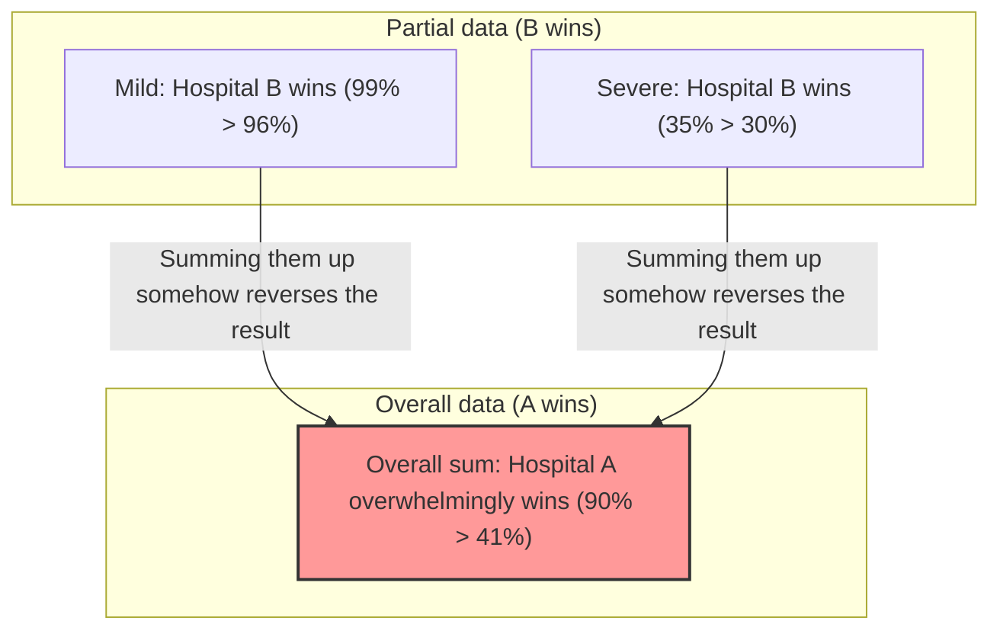

## 1. Which hospital should you get surgery at?

You have fallen seriously ill and must undergo surgery.
Before you, there are two choices: Hospital A and Hospital B. You requested the "success rate" data for surgeries at each hospital.

**[Overall Success Rate]**
- **Hospital A**: 900 out of 1000 people succeeded (Success rate **90%**)
- **Hospital B**: 800 out of 1000 people succeeded (Success rate **80%**)

Looking at this, anyone would think "Hospital A is better!"
However, since you have a cautious personality, you decided to investigate in more detail how the data changes depending on the state of the disease (mild or severe).

**[Success Rate for Mild Patients]**
- **Hospital A**: 99 out of 100 people succeeded (Success rate **99%**)
- **Hospital B**: 870 out of 900 people succeeded (Success rate **96%**)
$\rightarrow$ For mild cases, **Hospital A wins (99% > 96%)**

**[Success Rate for Severe Patients]**
- **Hospital A**: 801 out of 900 people succeeded (Success rate **89%**)
- **Hospital B**: 70 out of 100 people succeeded (Success rate **70%**)
$\rightarrow$ Even for severe cases, **Hospital A wins (89% > 70%)**

Wait? Don't you think something is strange?

For "mild" patients, Hospital A has a higher success rate.
For "severe" patients, Hospital A has a higher success rate.
And yet, when you calculate the "overall" success rate for all patients combined...?

- Hospital A Overall: $(99 + 801) / 1000 =$ **90%**
- Hospital B Overall: $(870 + 70) / 1000 =$ **94%**... Wait, according to the previous calculation, wasn't it **80%?** 

Wait a minute, let's look at the first data again.
The first data was like this.
- Hospital A Overall Success Rate: **90%**
- Hospital B Overall Success Rate: **80%**

However, if we recalculate using the broken-down data,
Hospital B's overall success rate should be $(870 + 70) / 1000 = 940 / 1000 = $ **94%**.

**...Well, you've been fooled!**
Actually, this trick of numbers is exactly the terrifying trap of statistics that we will explain this time.
Let me show you the correct data once more.

---

## 2. To you who were fooled: The real data

**[Success Rate for Mild Patients]**
- **Hospital A**: 870 out of 900 people succeeded (Success rate **96%**)
- **Hospital B**: 99 out of 100 people succeeded (Success rate **99%**)
$\rightarrow$ For mild cases, **Hospital B wins (99% > 96%)**

**[Success Rate for Severe Patients]**
- **Hospital A**: 30 out of 100 people succeeded (Success rate **30%**)
- **Hospital B**: 315 out of 900 people succeeded (Success rate **35%**)
$\rightarrow$ Even for severe cases, **Hospital B wins (35% > 30%)**

In other words, whether mild or severe, **Hospital B is overwhelmingly superior**.

Now, let's combine this into an "overall" figure.

- **Hospital A Overall**: $(870 + 30) / (900 + 100) = 900 / 1000 =$ **Success rate 90%**
- **Hospital B Overall**: $(99 + 315) / (100 + 900) = 414 / 1000 =$ **Success rate 41%**

Surprisingly, even though Hospital B wins in everything when looking at the "parts", Hospital A overwhelmingly wins when combining into the "whole"!
This is the phenomenon known as **"Simpson's Paradox"**.

---

## 3. Why does this bizarre reversal occur?

The true nature of this paradox lies in **"bias in the denominator (population size)"** and **"hidden variables (confounding factors)"**.

Look closely at the data.
- Hospital A accepts **a massive number of "mild patients who are easy to cure" (900 people)**.
- Hospital B accepts **a massive number of "severe patients who are difficult to cure" (900 people)**.

Because Hospital B has highly skilled doctors, it was like a "last resort" hospital taking in many difficult severe patients turned away by others. Naturally, the success rate for severe patients is lower (35%). Hospital B's "overall success rate" was dragged down by the low success rate of this massive number of severe patients, making it appear lower overall (41%).

Conversely, since Hospital A handles mostly simple mild patients, its overall success rate appeared high (90%), but when compared under the same conditions (severe vs. severe, mild vs. mild), its skills were inferior to Hospital B.

Expressed in mathematical formulas, the cause is the property of adding fractions.
In general, even if $\frac{a}{b} < \frac{A}{B}$ and $\frac{c}{d} < \frac{C}{D}$,
$$ \frac{a+c}{b+d} < \frac{A+C}{B+D} $$
does not always hold true. When the sizes of the denominators are extremely different, the direction of the inequality sign can reverse.

---

## 4. "Simpson's Paradox" occurring in the real world

This paradox is not merely an arithmetic puzzle; it frequently occurs in real society and has sparked major controversies.

### The 1973 UC Berkeley Gender Bias Suspicions
When investigating the admission rates for graduate school at UC Berkeley, the "male admission rate (44%)" was significantly higher than the "female admission rate (35%)", which became an issue as apparent discrimination against women.
However, when the data was broken down and analyzed "by department", an astonishing fact came to light.
In almost all departments, **the admission rate for women was higher than for men**.

Why did the overall numbers reverse?
Actually, women applied in large numbers to "departments with low admission rates (highly competitive)", while men applied in large numbers to "departments with high admission rates (easier to get into)".

### Efficacy Data of COVID-19 Vaccines
There was a time when data circulated stating "people who received the vaccine have a higher mortality rate than those unvaccinated", which caused an uproar.
This was also the result of ignoring data by age group (a hidden variable).
Because the vaccine was prioritized for "the elderly (who inherently have a higher mortality rate)", simply summing up the overall mortality rate caused an extreme skew of elderly people in the vaccinated group, making the mortality rate appear artificially higher.

When comparing by age group, it was confirmed that "people who received the vaccine had a lower mortality rate" in all age groups.

---

## 5. Conclusion: Data doesn't lie, but people can lie with data

Simpson's Paradox warns of **"the danger of making judgments based solely on overall data like averages or totals"**.

The world is overflowing with companies, politicians, and media that cherry-pick only "overall numbers" to appeal in ways convenient to them.
Even if told "Our Product A has higher overall satisfaction than Competitor's Product B!", if you break it down into "young demographics" and "elderly demographics", Competitor's Product B might be winning in both groups.

When looking at data, having a skeptical eye that doesn't get fooled by superficial "overall" numbers and asks, "Is there an extreme bias in the proportion of groups due to variables hidden behind (age, gender, severity, etc.)?" becomes the strongest weapon for surviving the modern information society.
