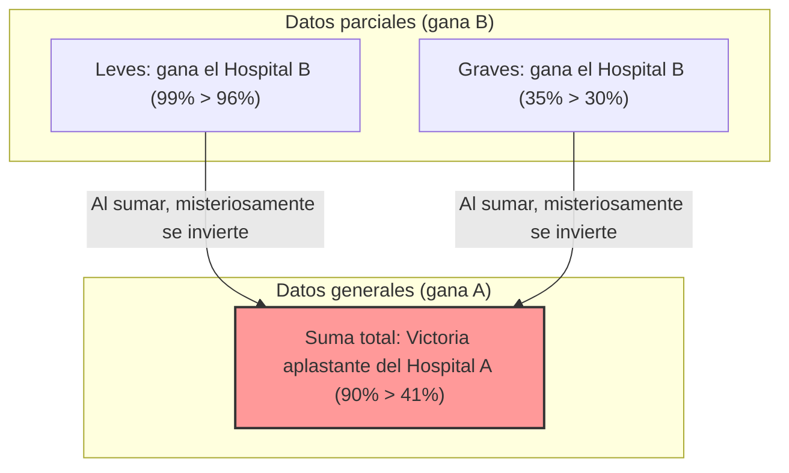

## 1. ¿En qué hospital deberías operarte?

Has contraído una enfermedad grave y debes someterte a una operación.
Frente a ti tienes dos opciones: el Hospital A y el Hospital B. Has solicitado los datos de "tasa de éxito" de las operaciones de cada hospital.

**【Tasa de éxito general】**
- **Hospital A**: De 1000 personas, 900 tuvieron éxito (tasa de éxito **90%**)
- **Hospital B**: De 1000 personas, 800 tuvieron éxito (tasa de éxito **80%**)

Al ver esto, cualquiera pensaría "¡El Hospital A es excelente!".
Sin embargo, como tienes una personalidad precavida, decidiste investigar más a fondo para ver cómo cambian los datos según el estado de la enfermedad (leve o grave).

**【Tasa de éxito en pacientes con síntomas leves】**
- **Hospital A**: De 100 personas, 99 tuvieron éxito (tasa de éxito **99%**)
- **Hospital B**: De 900 personas, 870 tuvieron éxito (tasa de éxito **96%**)
$\rightarrow$ En casos leves, **gana el Hospital A (99% > 96%)**

**【Tasa de éxito en pacientes con síntomas graves】**
- **Hospital A**: De 900 personas, 801 tuvieron éxito (tasa de éxito **89%**)
- **Hospital B**: De 100 personas, 70 tuvieron éxito (tasa de éxito **70%**)
$\rightarrow$ Incluso en casos graves, **gana el Hospital A (89% > 70%)**

¿Eh? ¿No te parece extraño?

Incluso para pacientes "leves", el Hospital A tiene una tasa de éxito mayor.
Para los pacientes "graves", el Hospital A también tiene una tasa de éxito mayor.
Sin embargo, al calcular la tasa de éxito "general" combinando a todos los pacientes... ¿qué sucede?

- Hospital A general: $(99 + 801) / 1000 =$ **90%**
- Hospital B general: $(870 + 70) / 1000 =$ **94%**... no, según el cálculo anterior, ¿**80%**? 

Espera un momento, revisemos los datos iniciales de nuevo.
Los primeros datos eran así:
- Tasa de éxito general del Hospital A: **90%**
- Tasa de éxito general del Hospital B: **80%**

Pero, si recalculamos con los datos divididos detalladamente,
la tasa de éxito general del Hospital B debería ser $(870 + 70) / 1000 = 940 / 1000 = $ **94%**.

**...¡No, has sido engañado!**
En realidad, este truco numérico es la aterradora trampa estadística que explicaremos esta vez.
Permíteme mostrarte los datos correctos de nuevo.

---

## 2. Para ti, que fuiste engañado: Los datos reales

**【Tasa de éxito en pacientes con síntomas leves】**
- **Hospital A**: De 900 personas, 870 tuvieron éxito (tasa de éxito **96%**)
- **Hospital B**: De 100 personas, 99 tuvieron éxito (tasa de éxito **99%**)
$\rightarrow$ En casos leves, **gana el Hospital B (99% > 96%)**

**【Tasa de éxito en pacientes con síntomas graves】**
- **Hospital A**: De 100 personas, 30 tuvieron éxito (tasa de éxito **30%**)
- **Hospital B**: De 900 personas, 315 tuvieron éxito (tasa de éxito **35%**)
$\rightarrow$ Incluso en casos graves, **gana el Hospital B (35% > 30%)**

Es decir, ya sea en casos leves o graves, **el Hospital B es abrumadoramente superior**.

Entonces, intentemos sumar esto para el "total".

- **Hospital A general**: $(870 + 30) / (900 + 100) = 900 / 1000 =$ **tasa de éxito 90%**
- **Hospital B general**: $(99 + 315) / (100 + 900) = 414 / 1000 =$ **tasa de éxito 41%**

¡Vaya!, aunque el Hospital B gana en todas las "partes", ¡cuando los combinamos en "general", el Hospital A obtiene una victoria aplastante!
Este fenómeno es conocido como la **"Paradoja de Simpson"**.

---

## 3. ¿Por qué ocurre esta extraña inversión?

La verdadera naturaleza de esta paradoja radica en el **"sesgo del tamaño de la muestra (denominador)"** y las **"variables ocultas (factores de confusión)"**.

Observa los datos detenidamente.
- El Hospital A acepta **masivamente a "pacientes leves fáciles de curar" (900 personas)**.
- El Hospital B acepta **masivamente a "pacientes graves difíciles de curar" (900 personas)**.

Como el Hospital B tiene muy buenos médicos, es una especie de "último recurso" que acepta a muchos pacientes graves difíciles que son rechazados en otros lugares. Naturalmente, la tasa de éxito de los pacientes graves es menor (35%). La "tasa de éxito general" del Hospital B parece baja en conjunto (41%) porque es arrastrada hacia abajo por esta gran cantidad de pacientes graves con baja tasa de éxito.

Por el contrario, como el Hospital A solo trata a pacientes leves y sencillos, su tasa de éxito general solo parece alta (90%), pero cuando se compara en las mismas condiciones (graves con graves, leves con leves), sus habilidades son inferiores a las del Hospital B.

Expresado matemáticamente, la causa es una propiedad de la suma de fracciones.
En general, incluso si $\frac{a}{b} < \frac{A}{B}$ y $\frac{c}{d} < \frac{C}{D}$, no siempre se cumple que:
$$ \frac{a+c}{b+d} < \frac{A+C}{B+D} $$
Cuando los tamaños de los denominadores son extremadamente diferentes, la dirección del signo de desigualdad puede invertirse.

---

## 4. La "Paradoja de Simpson" ocurrida en el mundo real

Esta paradoja no es solo un rompecabezas aritmético, sino que ocurre frecuentemente en la sociedad real y ha provocado grandes controversias.

### Sospechas de discriminación de género en la Universidad de California, Berkeley en 1973
Cuando se investigó la tasa de admisión a los programas de posgrado de la Universidad de Berkeley, se descubrió que la "tasa de admisión de hombres (44%)" era significativamente mayor que la "tasa de admisión de mujeres (35%)", lo que generó un problema al considerarse una clara discriminación hacia las mujeres.
Sin embargo, cuando se dividieron y analizaron los datos detalladamente "por facultad", se descubrió un hecho sorprendente.
En casi todas las facultades, **la tasa de admisión de mujeres era mayor que la de hombres**.

¿Por qué se invirtieron los números generales?
En realidad, las mujeres se postulaban más a "facultades con bajas tasas de admisión (altamente selectivas)", mientras que los hombres se postulaban más a "facultades con altas tasas de admisión (fáciles de ingresar)".

### Datos de eficacia de la vacuna contra el COVID
Hubo un revuelo cuando circularon datos que indicaban que "las personas vacunadas tienen una tasa de mortalidad más alta que las no vacunadas".
Esto también es el resultado de ignorar los datos por grupos de edad (variable oculta).
Dado que las vacunas se administraron con prioridad a los "ancianos (que inherentemente tienen una mayor tasa de mortalidad)", simplemente sumar las tasas de mortalidad generales hizo que el grupo vacunado estuviera extremadamente sesgado hacia los ancianos, haciendo que la tasa de mortalidad pareciera más alta.

Al dividir y comparar por grupos de edad, se confirmó que en todas las edades "las personas vacunadas tenían una tasa de mortalidad más baja".

---

## 5. Resumen: Los datos no mienten, pero las personas pueden mentir con los datos

La Paradoja de Simpson nos advierte sobre el **"peligro de juzgar basándose únicamente en datos generales como valores promedio o totales"**.

En el mundo abundan empresas, políticos y medios de comunicación que aíslan los "números generales" para promocionarse a su conveniencia.
Incluso si te dicen: "¡Nuestro producto A tiene una satisfacción general mayor que el producto B de la competencia!", quizás si lo divides en "público joven" y "público mayor", el producto B de la competencia esté ganando en ambos grupos.

Al mirar los datos, tener una mirada crítica que no se deje engañar por los números "generales" superficiales y preguntarse: "¿No hay un sesgo extremo en las proporciones de los grupos debido a variables ocultas subyacentes (edad, género, gravedad, etc.)?" se convierte en la mejor arma para sobrevivir en la sociedad de la información actual.
