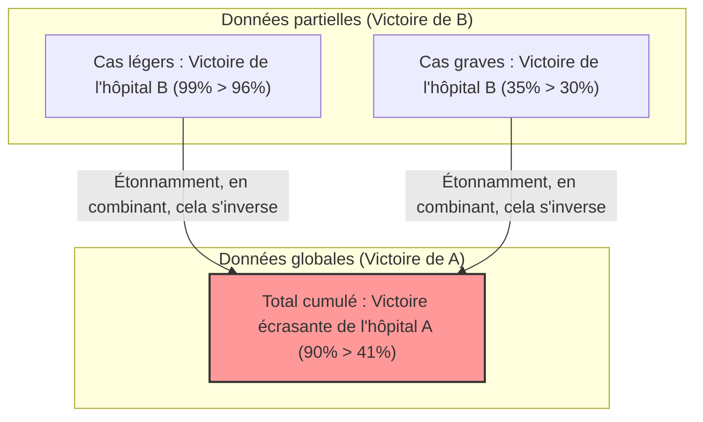

## 1. Dans quel hôpital devriez-vous vous faire opérer ?

Vous êtes atteint d'une maladie grave et devez subir une intervention chirurgicale.
Vous avez le choix entre deux hôpitaux : l'hôpital A et l'hôpital B. Vous avez demandé les données sur le "taux de réussite" des opérations pour chaque hôpital.

**【Taux de réussite global】**
- **Hôpital A** : Sur 1000 personnes, 900 réussites (taux de réussite **90%**)
- **Hôpital B** : Sur 1000 personnes, 800 réussites (taux de réussite **80%**)

En voyant cela, n'importe qui penserait : "L'hôpital A est meilleur !".
Cependant, étant de nature prudente, vous décidez d'examiner plus en détail comment les données varient selon la gravité de la maladie (cas légers ou cas graves).

**【Taux de réussite pour les cas légers】**
- **Hôpital A** : Sur 100 personnes, 99 réussites (taux de réussite **99%**)
- **Hôpital B** : Sur 900 personnes, 870 réussites (taux de réussite **96%**)
$\rightarrow$ Pour les cas légers, **l'hôpital A gagne (99% > 96%)**

**【Taux de réussite pour les cas graves】**
- **Hôpital A** : Sur 900 personnes, 801 réussites (taux de réussite **89%**)
- **Hôpital B** : Sur 100 personnes, 70 réussites (taux de réussite **70%**)
$\rightarrow$ Même pour les cas graves, **l'hôpital A gagne (89% > 70%)**

Tiens ? Ne trouvez-vous pas cela étrange ?

Pour les patients "légers", l'hôpital A a un meilleur taux de réussite.
Pour les patients "graves", l'hôpital A a également un meilleur taux de réussite.
Et pourtant, quand on calcule le taux de réussite "global" combinant tous les patients... ?

- Hôpital A Global : $(99 + 801) / 1000 =$ **90%**
- Hôpital B Global : $(870 + 70) / 1000 =$ **94%**... non, selon le calcul précédent c'était **80% ?**

Attendez, regardons à nouveau les premières données.
Les premières données étaient les suivantes :
- Taux de réussite global de l'hôpital A : **90%**
- Taux de réussite global de l'hôpital B : **80%**

Mais si nous recalculons avec les données détaillées,
Le taux de réussite global de l'hôpital B devrait être de $(870 + 70) / 1000 = 940 / 1000 = $ **94%**.

**... Eh oui, vous vous êtes fait avoir !**
En réalité, cette astuce numérique est précisément le terrible piège statistique que nous allons expliquer cette fois.
Laissez-moi vous montrer les vraies données à nouveau.

---

## 2. À vous qui avez été trompé : Les vraies données

**【Taux de réussite pour les cas légers】**
- **Hôpital A** : Sur 900 personnes, 870 réussites (taux de réussite **96%**)
- **Hôpital B** : Sur 100 personnes, 99 réussites (taux de réussite **99%**)
$\rightarrow$ Pour les cas légers, **l'hôpital B gagne (99% > 96%)**

**【Taux de réussite pour les cas graves】**
- **Hôpital A** : Sur 100 personnes, 30 réussites (taux de réussite **30%**)
- **Hôpital B** : Sur 900 personnes, 315 réussites (taux de réussite **35%**)
$\rightarrow$ Même pour les cas graves, **l'hôpital B gagne (35% > 30%)**

En d'autres termes, que ce soit pour les cas légers ou graves, **l'hôpital B est de loin supérieur**.

Alors, additionnons cela au niveau "global".

- **Hôpital A Global** : $(870 + 30) / (900 + 100) = 900 / 1000 =$ **Taux de réussite 90%**
- **Hôpital B Global** : $(99 + 315) / (100 + 900) = 414 / 1000 =$ **Taux de réussite 41%**

Incroyable ! En regardant les données "partielles", l'hôpital B gagne partout, mais en les combinant au niveau "global", l'hôpital A remporte une victoire écrasante !
C'est ce phénomène que l'on appelle le **"Paradoxe de Simpson"**.

---

## 3. Pourquoi une inversion aussi étrange se produit-elle ?

L'origine de ce paradoxe réside dans un **"déséquilibre des tailles d'échantillon (dénominateurs)"** et la présence d'une **"variable cachée (facteur de confusion)"**.

Regardez attentivement les données.
- L'hôpital A admet **une grande quantité (900 personnes) de "patients légers faciles à soigner"**.
- L'hôpital B admet **une grande quantité (900 personnes) de "patients graves difficiles à soigner"**.

Comme l'hôpital B est très compétent, il agit comme un "hôpital de la dernière chance" qui prend en charge de nombreux patients dans un état grave qui sont refusés ailleurs. Naturellement, le taux de réussite pour les patients graves est plus faible (35%). Le "taux de réussite global" de l'hôpital B est tiré vers le bas par cette grande proportion de patients graves, le faisant paraître globalement plus bas (41%).

À l'inverse, l'hôpital A ne s'occupe que des patients légers et simples à traiter. Par conséquent, son taux de réussite global semble élevé (90%), mais à conditions égales (en comparant les cas graves entre eux, et les cas légers entre eux), il est moins performant que l'hôpital B.

Exprimé mathématiquement, cela est dû aux propriétés de l'addition des fractions.
En général, même si $\frac{a}{b} < \frac{A}{B}$ et $\frac{c}{d} < \frac{C}{D}$,
il n'est pas toujours vrai que :
$$ \frac{a+c}{b+d} < \frac{A+C}{B+D} $$
Lorsque la taille des dénominateurs est extrêmement différente, le sens de l'inégalité peut s'inverser.

---

## 4. Le "paradoxe de Simpson" survenu dans le monde réel

Ce paradoxe n'est pas qu'une simple énigme mathématique ; il se produit fréquemment dans la société réelle et a provoqué de grandes controverses.

### Accusations de discrimination sexuelle à l'Université de Californie à Berkeley en 1973
Lors d'une enquête sur les taux d'admission aux cycles supérieurs à Berkeley, il a été constaté que le "taux d'admission des hommes (44%)" était significativement plus élevé que le "taux d'admission des femmes (35%)", soulevant ainsi un problème de discrimination évidente envers les femmes.
Cependant, en divisant et en analysant finement les données "par département", un fait surprenant a été révélé.
Dans presque tous les départements, **le taux d'admission des femmes était plus élevé que celui des hommes**.

Pourquoi les chiffres globaux se sont-ils inversés ?
En réalité, les femmes postulaient principalement à des "départements ayant un faible taux d'admission (très sélectifs)", tandis que les hommes postulaient principalement à des "départements ayant un taux d'admission élevé (faciles d'accès)".

### Données sur l'efficacité du vaccin contre le COVID
Des données indiquant que "les personnes vaccinées ont un taux de mortalité plus élevé que les personnes non vaccinées" ont circulé et provoqué un tollé.
Ceci est également le résultat d'avoir ignoré les données par tranche d'âge (la variable cachée).
Les vaccins ayant été administrés en priorité aux "personnes âgées (qui ont déjà un taux de mortalité plus élevé de base)", en cumulant simplement les taux de mortalité globaux, le groupe des personnes vaccinées s'est retrouvé avec une proportion extrême de personnes âgées, donnant l'apparence d'un taux de mortalité plus élevé.

En comparant par tranches d'âge, il a été confirmé que dans toutes les tranches d'âge, "les personnes vaccinées ont un taux de mortalité plus faible".

---

## 5. Conclusion : Les données ne mentent pas, mais les gens peuvent mentir avec les données

Le paradoxe de Simpson nous avertit du **"danger de juger uniquement en regardant les données globales, comme les moyennes ou les totaux"**.

Le monde regorge d'entreprises, de politiciens et de médias qui ne retiennent que les "chiffres globaux" pour les mettre en avant de la manière qui les arrange.
Même si l'on vous dit : "Notre produit A a une satisfaction globale supérieure au produit concurrent B !", si l'on sépare les données entre les "jeunes" et les "personnes âgées", il est fort possible que le produit B soit gagnant dans les deux catégories.

Lorsque vous regardez des données, la meilleure arme pour survivre dans la société de l'information d'aujourd'hui est de ne pas se laisser tromper par les chiffres "globaux" en surface, et de toujours garder un esprit critique : "N'y a-t-il pas un déséquilibre extrême dans la proportion des groupes à cause de variables cachées en arrière-plan (âge, sexe, gravité, etc.) ?".
