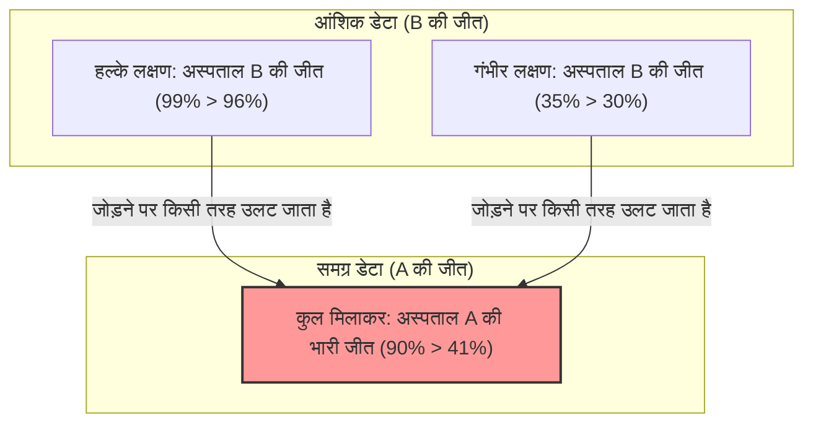

## 1. आपको किस अस्पताल में सर्जरी करानी चाहिए?

आप एक गंभीर बीमारी से पीड़ित हैं और आपको सर्जरी की आवश्यकता है।
आपके सामने दो विकल्प हैं: अस्पताल A और अस्पताल B। आपने प्रत्येक अस्पताल की सर्जरी की "सफलता दर" का डेटा मंगाया है।

**【समग्र सफलता दर】**
- **अस्पताल A**: 1000 में से 900 सफल (सफलता दर **90%**)
- **अस्पताल B**: 1000 में से 800 सफल (सफलता दर **80%**)

इसे देखकर कोई भी सोचेगा, "अस्पताल A बेहतर है!"
हालाँकि, चूंकि आप सतर्क स्वभाव के हैं, इसलिए आपने और अधिक विस्तार से जांच करने का निर्णय लिया कि बीमारी की स्थिति (हल्की या गंभीर) के आधार पर डेटा कैसे बदलता है।

**【हल्के लक्षणों वाले मरीजों की सफलता दर】**
- **अस्पताल A**: 100 में से 99 सफल (सफलता दर **99%**)
- **अस्पताल B**: 900 में से 870 सफल (सफलता दर **96%**)
$\rightarrow$ हल्के लक्षणों के मामले में, **अस्पताल A की जीत (99% > 96%)**

**【गंभीर मरीजों की सफलता दर】**
- **अस्पताल A**: 900 में से 801 सफल (सफलता दर **89%**)
- **अस्पताल B**: 100 में से 70 सफल (सफलता दर **70%**)
$\rightarrow$ गंभीर मामलों में भी, **अस्पताल A की जीत (89% > 70%)**

अरे? क्या आपको नहीं लगता कि यह अजीब है?

"हल्के" मरीजों के लिए भी, अस्पताल A की सफलता दर अधिक है।
"गंभीर" मरीजों के लिए भी, अस्पताल A की सफलता दर अधिक है।
फिर भी, यदि हम सभी मरीजों को मिलाकर "समग्र" सफलता दर की गणना करते हैं...?

- अस्पताल A समग्र: $(99 + 801) / 1000 =$ **90%**
- अस्पताल B समग्र: $(870 + 70) / 1000 =$ **94%**... नहीं, पिछली गणना के अनुसार **80%?** 

रुकिए, आइए एक बार फिर से पहले डेटा को देखते हैं।
शुरुआती डेटा कुछ ऐसा था:
- अस्पताल A की समग्र सफलता दर: **90%**
- अस्पताल B की समग्र सफलता दर: **80%**

लेकिन, यदि हम विस्तृत डेटा के साथ पुनर्गणना करते हैं,
अस्पताल B की समग्र सफलता दर $(870 + 70) / 1000 = 940 / 1000 = $ **94%** होनी चाहिए।

**...नहीं, आपको धोखा दिया गया है!**
दरअसल, संख्याओं की यह चाल ही सांख्यिकी का वह भयानक जाल है जिसके बारे में हम आज बात करेंगे।
आइए आपको एक बार फिर से सही डेटा दिखाते हैं।

---

## 2. जिन्हें धोखा दिया गया उनके लिए: असली डेटा

**【हल्के लक्षणों वाले मरीजों की सफलता दर】**
- **अस्पताल A**: 900 में से 870 सफल (सफलता दर **96%**)
- **अस्पताल B**: 100 में से 99 सफल (सफलता दर **99%**)
$\rightarrow$ हल्के लक्षणों के मामले में, **अस्पताल B की जीत (99% > 96%)**

**【गंभीर मरीजों की सफलता दर】**
- **अस्पताल A**: 100 में से 30 सफल (सफलता दर **30%**)
- **अस्पताल B**: 900 में से 315 सफल (सफलता दर **35%**)
$\rightarrow$ गंभीर मामलों में भी, **अस्पताल B की जीत (35% > 30%)**

दूसरे शब्दों में, चाहे हल्के हों या गंभीर, **अस्पताल B बहुत अधिक बेहतर है**।

अब, आइए इसे "समग्र" रूप से जोड़ते हैं।

- **अस्पताल A समग्र**: $(870 + 30) / (900 + 100) = 900 / 1000 =$ **सफलता दर 90%**
- **अस्पताल B समग्र**: $(99 + 315) / (100 + 900) = 414 / 1000 =$ **सफलता दर 41%**

आश्चर्यजनक रूप से, जब आप "भागों" को देखते हैं तो अस्पताल B सब कुछ जीत रहा है, लेकिन जब आप इसे "समग्र" रूप में मिलाते हैं, तो यह अस्पताल A की भारी जीत बन जाती है!
इसी घटना को **"सिम्पसन का विरोधाभास"** कहा जाता है।

---

## 3. ऐसा अजीब उलटफेर क्यों होता है?

इस विरोधाभास का असली कारण **"जनसंख्या (हर) का पूर्वाग्रह"** और **"छिपे हुए चर (भ्रमित करने वाले कारक)"** में निहित है।

डेटा को ध्यान से देखें।
- अस्पताल A ने **बड़ी संख्या में (900) "आसानी से ठीक होने वाले हल्के मरीजों"** को भर्ती किया है।
- अस्पताल B ने **बड़ी संख्या में (900) "ठीक होने में मुश्किल गंभीर मरीजों"** को भर्ती किया है।

चूंकि अस्पताल B अत्यधिक कुशल है, इसलिए यह "अंतिम उपाय" वाले अस्पताल की तरह है जो कई कठिन और गंभीर मरीजों को लेता है जिन्हें अन्य जगहों पर मना कर दिया जाता है। स्वाभाविक रूप से, गंभीर मरीजों की सफलता दर कम होगी (35%)। अस्पताल B की "समग्र सफलता दर" को इन बड़ी संख्या में गंभीर मरीजों की कम सफलता दर ने नीचे खींच लिया, जिससे यह समग्र रूप से कम (41%) दिखाई दी।

इसके विपरीत, अस्पताल A केवल साधारण और हल्के मरीजों का इलाज कर रहा था, इसलिए इसकी समग्र सफलता दर अधिक (90%) दिखाई दी। लेकिन जब समान परिस्थितियों (गंभीर से गंभीर, हल्के से हल्के) में तुलना की जाती है, तो उनका कौशल अस्पताल B से कम था।

यदि हम इसे एक गणितीय सूत्र के रूप में व्यक्त करते हैं, तो इसका कारण भिन्नों के योग का गुण है।
सामान्य तौर पर, भले ही $\frac{a}{b} < \frac{A}{B}$ और $\frac{c}{d} < \frac{C}{D}$ हों,
$$ \frac{a+c}{b+d} < \frac{A+C}{B+D} $$
यह हमेशा सत्य नहीं होता है। यदि हर (denominator) के आकार बेहद अलग हैं, तो असमानता चिह्न की दिशा उलट सकती है।

---

## 4. वास्तविक दुनिया में "सिम्पसन का विरोधाभास"

यह विरोधाभास केवल एक गणितीय पहेली नहीं है, बल्कि यह वास्तविक समाज में भी अक्सर होता है और इसने बड़े विवादों को जन्म दिया है।

### 1973 कैलिफोर्निया विश्वविद्यालय, बर्कले लिंग भेदभाव का आरोप
जब बर्कले के ग्रेजुएट स्कूल में प्रवेश दर की जांच की गई, तो यह पाया गया कि "पुरुषों की प्रवेश दर (44%)" "महिलाओं की प्रवेश दर (35%)" से काफी अधिक थी, जो महिलाओं के खिलाफ स्पष्ट भेदभाव के रूप में एक समस्या बन गई।
हालाँकि, जब डेटा को "संकाय (department)" के अनुसार विभाजित किया गया और विस्तार से विश्लेषण किया गया, तो एक चौंकाने वाला तथ्य सामने आया।
लगभग सभी संकायों में, **महिलाओं की प्रवेश दर पुरुषों की तुलना में अधिक थी**।

समग्र आंकड़े क्यों उलट गए?
दरअसल, महिलाएं अक्सर "कम प्रवेश दर वाले (कठिन) संकायों" में आवेदन कर रही थीं, जबकि पुरुष "उच्च प्रवेश दर वाले (आसान) संकायों" में अधिक आवेदन कर रहे थे।

### कोविड वैक्सीन प्रभावकारिता डेटा
एक बार एक डेटा प्रसारित हुआ जिसने हंगामा खड़ा कर दिया, जिसमें दावा किया गया कि "वैक्सीन लेने वाले लोगों की मृत्यु दर गैर-टीकाकरण वाले लोगों की तुलना में अधिक है।"
यह भी आयु-विशिष्ट डेटा (एक छिपा हुआ चर) को अनदेखा करने का परिणाम था।
चूंकि टीकों को मुख्य रूप से "बुजुर्गों (जिनकी मृत्यु दर पहले से ही अधिक है)" को प्राथमिकता से दिया गया था, इसलिए जब आप केवल समग्र मृत्यु दर को जोड़ते हैं, तो टीकाकृत समूह में बुजुर्ग लोगों की संख्या बेहद अधिक हो जाती है, जिससे मृत्यु दर भ्रामक रूप से अधिक दिखाई देने लगती है।

जब आयु समूहों द्वारा अलग किया गया और तुलना की गई, तो यह पुष्टि हुई कि "टीकाकरण वाले लोगों की मृत्यु दर" सभी आयु समूहों में कम थी।

---

## 5. निष्कर्ष: डेटा झूठ नहीं बोलता, लेकिन लोग डेटा के साथ झूठ बोल सकते हैं

सिम्पसन का विरोधाभास **"केवल औसत या योग जैसे समग्र डेटा को देखकर निर्णय लेने के खतरे"** की चेतावनी देता है।

दुनिया ऐसी कंपनियों, राजनेताओं और मीडिया से भरी हुई है जो केवल "समग्र आंकड़ों" का उपयोग करते हैं और उन्हें अपने लाभ के लिए पेश करते हैं।
भले ही वे कहें, "हमारे उत्पाद A की समग्र संतुष्टि दर अन्य कंपनी के उत्पाद B की तुलना में अधिक है!", यदि आप इसे "युवा" और "बुजुर्ग" में विभाजित करते हैं, तो हो सकता है कि उत्पाद B दोनों समूहों में बेहतर प्रदर्शन कर रहा हो।

डेटा को देखते समय, सतह पर मौजूद "समग्र" संख्याओं से मूर्ख न बनें। आधुनिक सूचना समाज में जीवित रहने के लिए सबसे मजबूत हथियार यह संदेह करने की क्षमता है कि "क्या किसी छिपे हुए चर (जैसे आयु, लिंग, गंभीरता, आदि) के कारण समूहों के अनुपात में अत्यधिक पूर्वाग्रह तो नहीं है?"।
