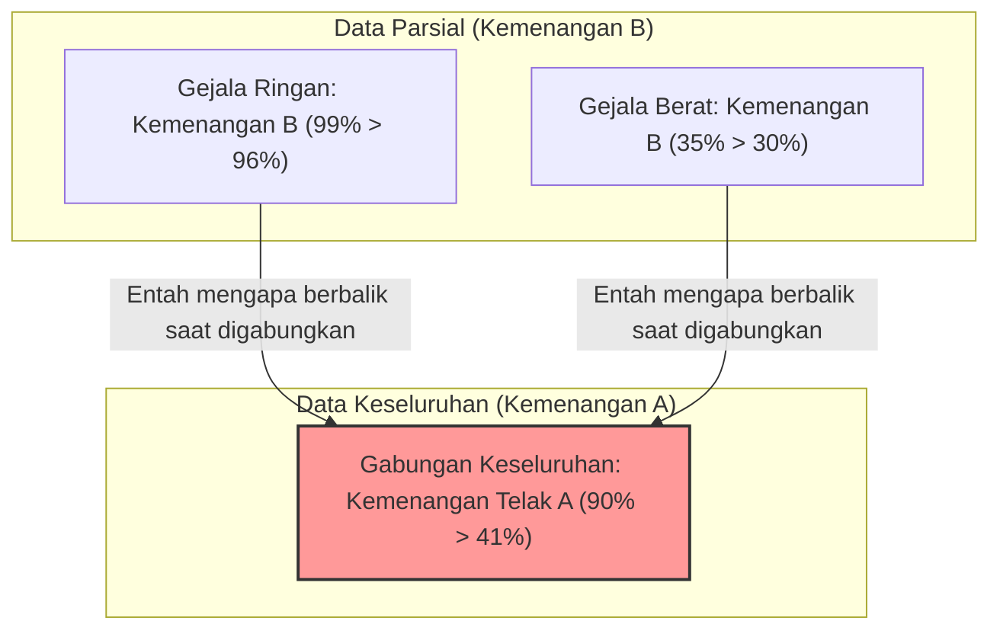

## 1. Di rumah sakit mana sebaiknya menjalani operasi?

Anda menderita penyakit parah dan harus menjalani operasi.
Di depan Anda, ada dua pilihan, yaitu Rumah Sakit A dan Rumah Sakit B. Anda telah meminta data "tingkat keberhasilan" operasi dari masing-masing rumah sakit.

**【Tingkat Keberhasilan Keseluruhan】**
- **Rumah Sakit A**: Dari 1000 orang, 900 berhasil (Tingkat keberhasilan **90%**)
- **Rumah Sakit B**: Dari 1000 orang, 800 berhasil (Tingkat keberhasilan **80%**)

Melihat ini, siapa pun pasti akan berpikir, "Rumah Sakit A lebih hebat!".
Namun, karena Anda memiliki sifat yang hati-hati, Anda memutuskan untuk menyelidiki lebih rinci bagaimana data tersebut berubah tergantung pada kondisi penyakit (gejala ringan atau gejala berat).

**【Tingkat Keberhasilan Pasien Gejala Ringan】**
- **Rumah Sakit A**: Dari 100 orang, 99 berhasil (Tingkat keberhasilan **99%**)
- **Rumah Sakit B**: Dari 900 orang, 870 berhasil (Tingkat keberhasilan **96%**)
$\rightarrow$ Dalam kasus gejala ringan, **Kemenangan untuk Rumah Sakit A (99% > 96%)**

**【Tingkat Keberhasilan Pasien Gejala Berat】**
- **Rumah Sakit A**: Dari 900 orang, 801 berhasil (Tingkat keberhasilan **89%**)
- **Rumah Sakit B**: Dari 100 orang, 70 berhasil (Tingkat keberhasilan **70%**)
$\rightarrow$ Bahkan dalam kasus gejala berat, **Kemenangan untuk Rumah Sakit A (89% > 70%)**

Loh? Bukankah ini aneh?

Bagi pasien dengan "gejala ringan", tingkat keberhasilan di Rumah Sakit A lebih tinggi.
Bagi pasien dengan "gejala berat", tingkat keberhasilan di Rumah Sakit A lebih tinggi.
Namun, bagaimana jika kita menghitung tingkat keberhasilan "keseluruhan" dengan menggabungkan semua pasien...?

- Keseluruhan Rumah Sakit A: $(99 + 801) / 1000 =$ **90%**
- Keseluruhan Rumah Sakit B: $(870 + 70) / 1000 =$ **94%**... Bukan, dari perhitungan sebelumnya hasilnya **80%?** 

Tunggu dulu, mari kita lihat lagi data awalnya.
Data awalnya seperti ini.
- Tingkat keberhasilan keseluruhan Rumah Sakit A: **90%**
- Tingkat keberhasilan keseluruhan Rumah Sakit B: **80%**

Namun, jika kita hitung ulang dengan data yang dibagi lebih rinci,
Tingkat keberhasilan keseluruhan Rumah Sakit B seharusnya menjadi $(870 + 70) / 1000 = 940 / 1000 = $ **94%**.

**...Ternyata, Anda tertipu!**
Sebenarnya, trik angka inilah jebakan mengerikan dari statistik yang akan kita bahas kali ini.
Mari saya tunjukkan lagi data yang benar.

---

## 2. Kepada Anda yang Tertipu: Data yang Sebenarnya

**【Tingkat Keberhasilan Pasien Gejala Ringan】**
- **Rumah Sakit A**: Dari 900 orang, 870 berhasil (Tingkat keberhasilan **96%**)
- **Rumah Sakit B**: Dari 100 orang, 99 berhasil (Tingkat keberhasilan **99%**)
$\rightarrow$ Dalam kasus gejala ringan, **Kemenangan untuk Rumah Sakit B (99% > 96%)**

**【Tingkat Keberhasilan Pasien Gejala Berat】**
- **Rumah Sakit A**: Dari 100 orang, 30 berhasil (Tingkat keberhasilan **30%**)
- **Rumah Sakit B**: Dari 900 orang, 315 berhasil (Tingkat keberhasilan **35%**)
$\rightarrow$ Bahkan dalam kasus gejala berat, **Kemenangan untuk Rumah Sakit B (35% > 30%)**

Dengan kata lain, baik gejala ringan maupun berat, **Rumah Sakit B jauh lebih unggul**.

Lalu, mari kita jumlahkan ini secara "keseluruhan".

- **Keseluruhan Rumah Sakit A**: $(870 + 30) / (900 + 100) = 900 / 1000 =$ **Tingkat Keberhasilan 90%**
- **Keseluruhan Rumah Sakit B**: $(99 + 315) / (100 + 900) = 414 / 1000 =$ **Tingkat Keberhasilan 41%**

Sungguh mengejutkan, ketika dilihat secara "bagian" Rumah Sakit B selalu menang, tetapi saat digabungkan secara "keseluruhan", Rumah Sakit A menang telak!
Inilah fenomena yang disebut **"Paradoks Simpson"**.

---

## 3. Mengapa Pembalikan Aneh Ini Bisa Terjadi?

Penyebab sebenarnya dari paradoks ini terletak pada **"bias parameter (penyebut)"** dan **"variabel tersembunyi (faktor perancu)"**.

Perhatikan datanya baik-baik.
- Rumah Sakit A menerima **"pasien gejala ringan yang mudah sembuh" dalam jumlah besar (900 orang)**.
- Rumah Sakit B menerima **"pasien gejala berat yang sulit sembuh" dalam jumlah besar (900 orang)**.

Karena kemampuan Rumah Sakit B sangat baik, ia layaknya "benteng terakhir" yang menerima banyak pasien gejala berat yang ditolak oleh rumah sakit lain. Tentu saja, tingkat keberhasilan untuk pasien gejala berat menjadi rendah (35%). "Tingkat keberhasilan keseluruhan" Rumah Sakit B terseret turun oleh rendahnya tingkat keberhasilan dari sejumlah besar pasien gejala berat ini, sehingga secara keseluruhan terlihat rendah (41%).

Sebaliknya, karena Rumah Sakit A hanya menangani pasien gejala ringan yang mudah, "tingkat keberhasilan keseluruhan" mereka hanya terlihat tinggi (90%). Namun, jika dibandingkan dalam kondisi yang sama (sesama gejala berat, sesama gejala ringan), kemampuan mereka kalah dari Rumah Sakit B.

Jika dinyatakan dalam rumus matematika, penyebabnya adalah sifat penjumlahan pecahan.
Secara umum, meskipun $\frac{a}{b} < \frac{A}{B}$ dan $\frac{c}{d} < \frac{C}{D}$,
$$ \frac{a+c}{b+d} < \frac{A+C}{B+D} $$
belum tentu selalu berlaku. Jika perbedaan besaran penyebutnya ekstrem, arah tanda ketidaksamaan dapat berbalik.

---

## 4. "Paradoks Simpson" di Dunia Nyata

Paradoks ini bukanlah sekadar teka-teki matematika biasa, melainkan sering terjadi di dunia nyata dan telah memicu perdebatan sengit.

### Dugaan Diskriminasi Gender di University of California, Berkeley pada tahun 1973
Ketika tingkat kelulusan sekolah pascasarjana di UC Berkeley diselidiki, ditemukan bahwa "tingkat kelulusan pria (44%)" secara signifikan lebih tinggi daripada "tingkat kelulusan wanita (35%)", sehingga menjadi masalah karena dianggap ada diskriminasi yang nyata terhadap wanita.
Namun, ketika data dibagi dan dianalisis lebih rinci "per fakultas", fakta yang mengejutkan terungkap.
Di hampir semua fakultas, **tingkat kelulusan wanita lebih tinggi daripada pria**.

Mengapa angka keseluruhannya bisa berbalik?
Sebenarnya, banyak wanita yang melamar ke "fakultas dengan tingkat kelulusan rendah (sulit masuk)", sementara banyak pria yang melamar ke "fakultas dengan tingkat kelulusan tinggi (mudah masuk)".

### Data Efektivitas Vaksin COVID-19
Pernah beredar data yang menyatakan bahwa "Tingkat kematian orang yang telah divaksinasi lebih tinggi daripada mereka yang belum divaksinasi", yang kemudian menimbulkan kehebohan.
Ini juga merupakan hasil dari pengabaian data berdasarkan kelompok usia (variabel tersembunyi).
Karena vaksin diberikan secara prioritas kepada "lansia (yang memang sudah memiliki tingkat kematian tinggi)", jika tingkat kematian keseluruhan hanya digabungkan begitu saja, kelompok yang divaksinasi akan sangat didominasi oleh lansia, sehingga tingkat kematiannya terlihat tinggi secara sekilas.

Ketika dibandingkan berdasarkan kelompok usia, dipastikan bahwa di semua kelompok usia, "orang yang telah divaksinasi memiliki tingkat kematian yang lebih rendah".

---

## 5. Kesimpulan: Data Tidak Berbohong, Tetapi Manusia Bisa Berbohong dengan Data

Paradoks Simpson memperingatkan kita tentang **"bahaya mengambil kesimpulan hanya dengan melihat data keseluruhan, seperti nilai rata-rata atau total"**.

Di dunia ini, bertebaran perusahaan, politisi, atau media yang hanya mengambil "angka keseluruhan" dan menampilkannya sedemikian rupa untuk menguntungkan pihak mereka sendiri.
Bahkan jika dikatakan, "Produk A dari perusahaan kami memiliki tingkat kepuasan keseluruhan yang lebih tinggi daripada produk B dari perusahaan lain!", mungkin saja jika dibagi menjadi "kelompok muda" dan "kelompok lansia", produk B dari perusahaan lain yang menang di kedua kelompok tersebut.

Saat melihat data, agar tidak tertipu oleh angka "keseluruhan" yang tampak di permukaan, memiliki pandangan skeptis dengan bertanya, "Apakah ada bias ekstrem dalam proporsi kelompok akibat variabel tersembunyi di baliknya (seperti usia, jenis kelamin, tingkat keparahan, dll)?" akan menjadi senjata terkuat untuk bertahan di era informasi modern.
