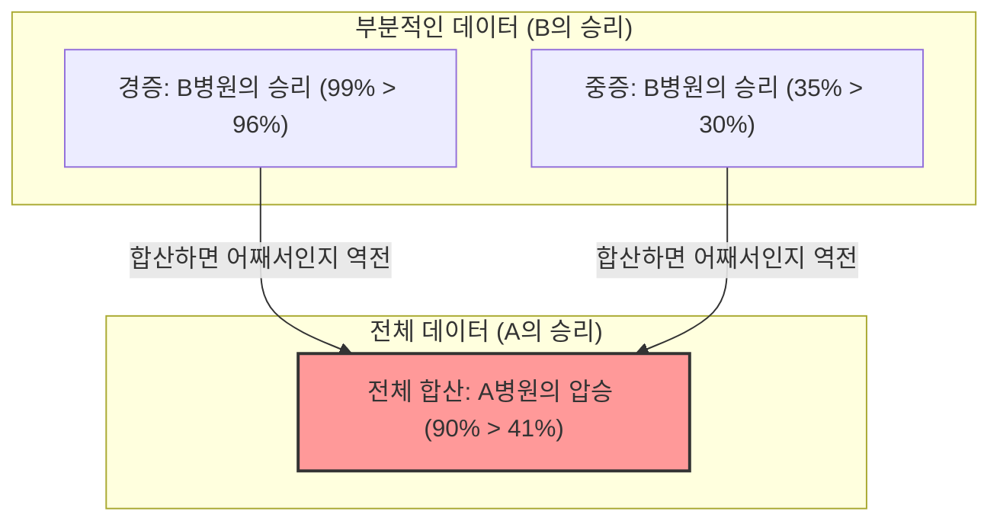

## 1. 어느 병원에서 수술을 받아야 할까?

당신은 중병에 걸려 수술을 받아야만 하게 되었습니다.
눈 앞에는 A병원과 B병원이라는 2개의 선택지가 있습니다. 당신은 각 병원의 수술 '성공률' 데이터를 가져왔습니다.

**【전체 성공률】**
- **A병원**: 1000명 중 900명이 성공 (성공률 **90%**)
- **B병원**: 1000명 중 800명이 성공 (성공률 **80%**)

이것을 보면 누구나 "A병원이 더 우수하다!"라고 생각할 것입니다.
하지만 당신은 신중한 성격이므로 병의 상태(경증인지, 중증인지)에 따라 데이터가 어떻게 변하는지 조금 더 자세히 알아보기로 했습니다.

**【경증 환자의 성공률】**
- **A병원**: 100명 중 99명이 성공 (성공률 **99%**)
- **B병원**: 900명 중 870명이 성공 (성공률 **96%**)
$\rightarrow$ 경증의 경우에는 **A병원의 승리 (99% > 96%)**

**【중증 환자의 성공률】**
- **A병원**: 900명 중 801명이 성공 (성공률 **89%**)
- **B병원**: 100명 중 70명이 성공 (성공률 **70%**)
$\rightarrow$ 중증의 경우에도 **A병원의 승리 (89% > 70%)**

어라? 이상하다고 생각하지 않습니까?

'경증' 환자에게도 A병원이 성공률이 높습니다.
'중증' 환자에게도 A병원이 성공률이 높습니다.
그런데도 환자 전원을 합친 '전체'의 성공률을 계산하면……?

- A병원 전체: $(99 + 801) / 1000 =$ **90%**
- B병원 전체: $(870 + 70) / 1000 =$ **94%**……가 아니라, 아까 계산대로라면 **80%?** 

기다려주세요, 다시 한 번 처음 데이터를 살펴봅시다.
처음 데이터는 이랬습니다.
- A병원 전체의 성공률: **90%**
- B병원 전체의 성공률: **80%**

하지만 세세하게 나눈 데이터로 다시 계산해 보면,
B병원의 전체 성공률은 $(870 + 70) / 1000 = 940 / 1000 = $ **94%**가 되어야 합니다.

**…아니, 속았군요!**
사실 이 숫자의 트릭이야말로 이번에 해설할 통계학의 무서운 함정입니다.
올바른 데이터를 다시 한 번 보여드리겠습니다.

---

## 2. 속은 당신에게: 진짜 데이터

**【경증 환자의 성공률】**
- **A병원**: 900명 중 870명이 성공 (성공률 **96%**)
- **B병원**: 100명 중 99명이 성공 (성공률 **99%**)
$\rightarrow$ 경증의 경우에는 **B병원의 승리 (99% > 96%)**

**【중증 환자의 성공률】**
- **A병원**: 100명 중 30명이 성공 (성공률 **30%**)
- **B병원**: 900명 중 315명이 성공 (성공률 **35%**)
$\rightarrow$ 중증의 경우에도 **B병원의 승리 (35% > 30%)**

즉, 경증이든 중증이든 **B병원이 압도적으로 우수**합니다.

그럼 이것을 '전체'로 합산해 봅시다.

- **A병원 전체**: $(870 + 30) / (900 + 100) = 900 / 1000 =$ **성공률 90%**
- **B병원 전체**: $(99 + 315) / (100 + 900) = 414 / 1000 =$ **성공률 41%**

놀랍게도 '부분'으로 보면 모두 B병원이 이기고 있는데, '전체'로 합치면 A병원의 압승이 되어버렸습니다!
이것이 **'심슨의 역설'**이라고 불리는 현상입니다.

---

## 3. 왜 이런 기묘한 역전이 일어나는가?

이 역설의 정체는 **'모수(분모)의 편향'**과 **'숨겨진 변수(교란 변수)'**에 있습니다.

데이터를 잘 살펴보세요.
- A병원은 **'치료하기 쉬운 경증 환자'를 대량으로 (900명)** 받아들였습니다.
- B병원은 **'치료하기 어려운 중증 환자'를 대량으로 (900명)** 받아들였습니다.

B병원은 실력이 좋아서 다른 곳에서 거절당하는 어려운 중증 환자를 많이 맡는 '최후의 보루'와 같은 병원이었던 것입니다. 당연히 중증 환자의 성공률은 낮아집니다 (35%). B병원의 '전체 성공률'은 이 대량의 중증 환자의 낮은 성공률에 발목이 잡혀 전체적으로 낮게 (41%) 보였던 것입니다.

반대로 A병원은 쉬운 경증 환자만 처리하고 있기 때문에 전체 성공률이 높게 (90%) 보였을 뿐, 같은 조건(중증끼리, 경증끼리)으로 비교하면 B병원보다 실력이 떨어졌던 것입니다.

수식으로 표현하면 분수 덧셈의 성질이 원인입니다.
일반적으로 $\frac{a}{b} < \frac{A}{B}$ 이고 $\frac{c}{d} < \frac{C}{D}$ 이더라도,
$$ \frac{a+c}{b+d} < \frac{A+C}{B+D} $$
가 항상 성립하는 것은 아닙니다. 분모의 크기가 극단적으로 다를 경우 부등호의 방향이 역전될 수 있는 것입니다.

---

## 4. 현실 세계에서 일어난 '심슨의 역설'

이 역설은 단순한 산수 퍼즐이 아니라, 현실 사회에서도 빈번하게 발생하여 큰 논쟁을 불러일으켜 왔습니다.

### 1973년 캘리포니아 대학교 버클리 캠퍼스의 성차별 의혹
버클리 캠퍼스 대학원의 합격률을 조사한 결과, '남성의 합격률(44%)'이 '여성의 합격률(35%)'보다 유의미하게 높아, 여성에 대한 명백한 차별이 있다며 문제가 되었습니다.
하지만 데이터를 '학부별'로 나누어 세세하게 분석한 결과, 놀라운 사실이 밝혀졌습니다.
거의 모든 학부에서 **여성의 합격률이 남성보다 높았던** 것입니다.

왜 전체 숫자가 역전되었을까?
사실 여성은 '합격률이 낮은(좁은 문인) 학부'에 많이 지원했고, 남성은 '합격률이 높은(들어가기 쉬운) 학부'에 많이 지원했을 뿐이었습니다.

### 코로나 백신의 유효성 데이터
'백신을 접종한 사람이 미접종자보다 사망률이 높다'는 데이터가 퍼져 소동이 일어난 적이 있습니다.
이것 또한 연령별 데이터(숨겨진 변수)를 무시한 결과입니다.
백신은 '고령자(애초에 사망률이 높음)'부터 우선적으로 접종되었기 때문에, 전체 사망률을 단순히 합산하면 백신 접종 그룹 쪽에 고령자가 극단적으로 편중되어 겉보기에 사망률이 높아져 보였던 것입니다.

연령별로 나누어 비교하면, 모든 연령대에서 '접종한 사람의 사망률이 더 낮다'는 것이 확인되었습니다.

---

## 5. 결론: 데이터는 거짓말을 하지 않지만, 사람은 데이터로 거짓말을 할 수 있다

심슨의 역설은 **'평균값이나 합계값 등 전체 데이터만 보고 판단하는 것의 위험성'**을 경고하고 있습니다.

세상에는 '전체적인 숫자'만 잘라내어 자신들에게 유리하게 어필하는 기업이나 정치인, 미디어가 넘쳐납니다.
'자사의 제품 A는 타사 제품 B보다 전체 만족도가 높습니다!'라고 하더라도, 어쩌면 '청년층', '장년층'으로 나누어 보면 어느 계층에서든 타사 제품 B가 앞서고 있을지도 모릅니다.

데이터를 볼 때는 표면적인 '전체' 숫자에 속지 말고, '배후에 숨겨진 변수(연령, 성별, 중증도 등)에 의해 그룹의 비율에 극단적인 편향이 없는지?'를 의심하는 눈을 가지는 것이 현대 정보 사회를 살아남기 위한 가장 강력한 무기가 됩니다.
