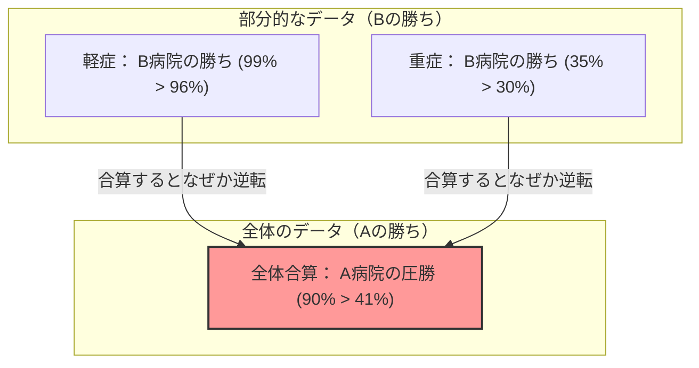

## 1. どちらの病院で手術を受けるべきか？

あなたは重い病気にかかり、手術を受けなければならなくなりました。
目の前には、A病院とB病院という2つの選択肢があります。あなたはそれぞれの病院の手術の「成功率」のデータを取り寄せました。

**【全体の成功率】**
- **A病院**： 1000人のうち、900人が成功（成功率 **90%**）
- **B病院**： 1000人のうち、800人が成功（成功率 **80%**）

これを見れば、誰でも「A病院の方が優秀だ！」と思うはずです。
しかし、あなたは慎重な性格なので、病気の状態（軽症か、重症か）によってデータがどう変わるのか、さらに細かく調べてみることにしました。

**【軽症患者の成功率】**
- **A病院**： 100人のうち、99人が成功（成功率 **99%**）
- **B病院**： 900人のうち、870人が成功（成功率 **96%**）
$\rightarrow$ 軽症の場合は、**A病院の勝ち（99% > 96%）**

**【重症患者の成功率】**
- **A病院**： 900人のうち、801人が成功（成功率 **89%**）
- **B病院**： 100人のうち、70人が成功（成功率 **70%**）
$\rightarrow$ 重症の場合でも、**A病院の勝ち（89% > 70%）**

あれ？ おかしいと思いませんか？

「軽症」の患者にとっても、A病院の方が成功率が高い。
「重症」の患者にとっても、A病院の方が成功率が高い。
それなのに、患者全員を合わせた「全体」の成功率を計算すると……？

- A病院 全体： $(99 + 801) / 1000 =$ **90%**
- B病院 全体： $(870 + 70) / 1000 =$ **94%**……ではなく、さっきの計算だと **80%？** 

待ってください、もう一度最初のデータを見てみましょう。
最初のデータはこうでした。
- A病院 全体の成功率： **90%**
- B病院 全体の成功率： **80%**

しかし、細かく分けたデータで計算し直してみると、
B病院の全体成功率は $(870 + 70) / 1000 = 940 / 1000 = $ **94%** になるはずです。

**…いや、騙されましたね！**
実は、この数字のトリックこそが、今回解説する統計学の恐ろしい罠なのです。
正しいデータをもう一度お見せしましょう。

---

## 2. 騙されたあなたへ：本当のデータ

**【軽症患者の成功率】**
- **A病院**： 900人のうち、870人が成功（成功率 **96%**）
- **B病院**： 100人のうち、99人が成功（成功率 **99%**）
$\rightarrow$ 軽症の場合は、**B病院の勝ち（99% > 96%）**

**【重症患者の成功率】**
- **A病院**： 100人のうち、30人が成功（成功率 **30%**）
- **B病院**： 900人のうち、315人が成功（成功率 **35%**）
$\rightarrow$ 重症の場合でも、**B病院の勝ち（35% > 30%）**

つまり、軽症でも重症でも、**B病院の方が圧倒的に優秀**なのです。

では、これを「全体」で合算してみましょう。

- **A病院 全体**： $(870 + 30) / (900 + 100) = 900 / 1000 =$ **成功率 90%**
- **B病院 全体**： $(99 + 315) / (100 + 900) = 414 / 1000 =$ **成功率 41%**

なんと、「部分」で見るとすべてB病院が勝っているのに、「全体」で合わせるとA病院の圧勝になってしまいました！
これが**「シンプソンのパラドックス」**と呼ばれる現象です。

---

## 3. なぜこんな奇妙な逆転が起こるのか？

このパラドックスの正体は、**「母数（分母）の偏り」**と**「隠れた変数（交絡因子）」**にあります。

データをよく見てください。
- A病院は、**「治りやすい軽症患者」を大量に（900人）**受け入れています。
- B病院は、**「治りにくい重症患者」を大量に（900人）**受け入れています。

B病院は腕が良いので、他で断られるような難しい重症患者をたくさん引き受けている「最後の砦」のような病院だったのです。当然、重症患者の成功率は低くなります（35%）。B病院の「全体の成功率」は、この大量の重症患者の低い成功率に足を引っ張られて、全体として低く（41%）見えてしまったのです。

逆にA病院は、簡単な軽症患者ばかりをこなしているため、全体の成功率が高く（90%）見えていただけで、同じ条件（重症同士、軽症同士）で比べるとB病院より腕が劣っていたのです。

数式で表すと、分数の足し算の性質が原因です。
一般に、$\frac{a}{b} < \frac{A}{B}$ かつ $\frac{c}{d} < \frac{C}{D}$ であっても、
$$ \frac{a+c}{b+d} < \frac{A+C}{B+D} $$
が常に成り立つとは限りません。分母の大きさが極端に違う場合、不等号の向きが逆転することがあるのです。

---

## 4. 現実世界で起きた「シンプソンのパラドックス」

このパラドックスは単なる算数パズルではなく、現実の社会でも頻繁に発生し、大論争を巻き起こしてきました。

### 1973年 カリフォルニア大学バークレー校の性差別疑惑
バークレー校の大学院の合格率を調査したところ、「男性の合格率（44%）」が「女性の合格率（35%）」よりも有意に高く、女性への明らかな差別があるとして問題になりました。
しかし、データを「学部ごと」に分けて細かく分析したところ、驚くべき事実が判明しました。
ほぼすべての学部で、**女性の合格率の方が男性よりも高かった**のです。

なぜ全体の数字が逆転したのか？
実は、女性は「合格率の低い（狭き門の）学部」に多く応募しており、男性は「合格率の高い（入りやすい）学部」に多く応募していただけでした。

### コロナワクチンの有効性データ
「ワクチンを接種した人の方が、未接種の人よりも死亡率が高い」というデータが出回り、騒ぎになったことがあります。
これも年代別のデータ（隠れた変数）を無視した結果です。
ワクチンは「高齢者（もともと死亡率が高い）」から優先的に接種されていたため、全体の死亡率をただ合算すると、ワクチン接種グループの方に高齢者が極端に偏ってしまい、見かけ上死亡率が高くなってしまったのです。

年代ごとに分けて比較すると、すべての年代において「接種した人の方が死亡率が低い」ことが確認されました。

---

## 5. まとめ：データは嘘をつかないが、人はデータで嘘をつける

シンプソンのパラドックスは、**「平均値や合計値などの全体データだけを見て判断することの危険性」**を警告しています。

世の中には、「全体の数字」だけを切り取って自分たちに都合の良いようにアピールする企業や政治家、メディアが溢れています。
「当社の製品Aは、他社製品Bよりも全体の満足度が高いです！」と言われても、もしかしたら「若者層」「高齢者層」に分けてみれば、どちらの層でも他社製品Bの方が勝っているかもしれません。

データを見るときは、表面上の「全体」の数字に騙されず、「背後に隠れた変数（年齢、性別、重症度など）によって、グループの割合に極端な偏りがないか？」を疑う目を持つことが、現代の情報社会を生き抜くための最強の武器となります。
