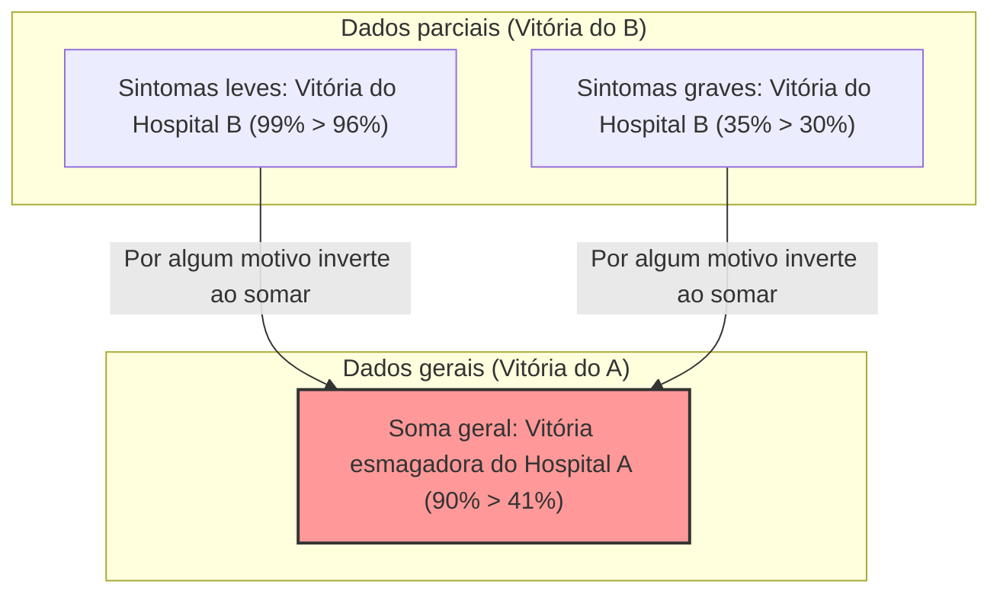

## 1. Em qual hospital você deve fazer a cirurgia?

Você contraiu uma doença grave e precisa passar por uma cirurgia.
Diante de você, há duas opções: Hospital A e Hospital B. Você solicitou os dados da "taxa de sucesso" das cirurgias de cada hospital.

**【Taxa de sucesso geral】**
- **Hospital A**: De 1000 pessoas, 900 tiveram sucesso (Taxa de sucesso **90%**)
- **Hospital B**: De 1000 pessoas, 800 tiveram sucesso (Taxa de sucesso **80%**)

Ao ver isso, qualquer um pensaria: "O Hospital A é melhor!".
No entanto, como você tem uma personalidade cautelosa, decidiu investigar mais a fundo como os dados mudam dependendo da condição da doença (leve ou grave).

**【Taxa de sucesso para pacientes com sintomas leves】**
- **Hospital A**: De 100 pessoas, 99 tiveram sucesso (Taxa de sucesso **99%**)
- **Hospital B**: De 900 pessoas, 870 tiveram sucesso (Taxa de sucesso **96%**)
$\rightarrow$ Em casos leves, **vitória do Hospital A (99% > 96%)**

**【Taxa de sucesso para pacientes com sintomas graves】**
- **Hospital A**: De 900 pessoas, 801 tiveram sucesso (Taxa de sucesso **89%**)
- **Hospital B**: De 100 pessoas, 70 tiveram sucesso (Taxa de sucesso **70%**)
$\rightarrow$ Mesmo em casos graves, **vitória do Hospital A (89% > 70%)**

Ué? Não acha estranho?

Para os pacientes com sintomas "leves", a taxa de sucesso do Hospital A é maior.
Para os pacientes com sintomas "graves", a taxa de sucesso do Hospital A também é maior.
Mesmo assim, ao calcular a taxa de sucesso "geral" combinando todos os pacientes...?

- Hospital A Geral: $(99 + 801) / 1000 =$ **90%**
- Hospital B Geral: $(870 + 70) / 1000 =$ **94%**... não, de acordo com o cálculo anterior era **80%?** 

Espere, vamos olhar os dados iniciais mais uma vez.
Os dados iniciais eram assim:
- Taxa de sucesso geral do Hospital A: **90%**
- Taxa de sucesso geral do Hospital B: **80%**

No entanto, se recalcularmos com os dados divididos detalhadamente,
a taxa de sucesso geral do Hospital B deveria ser $(870 + 70) / 1000 = 940 / 1000 = $ **94%**.

**...Não, você foi enganado!**
Na verdade, esse truque numérico é exatamente a assustadora armadilha estatística que explicarei desta vez.
Deixe-me mostrar os dados corretos novamente.

---

## 2. Para você que foi enganado: Os dados verdadeiros

**【Taxa de sucesso para pacientes com sintomas leves】**
- **Hospital A**: De 900 pessoas, 870 tiveram sucesso (Taxa de sucesso **96%**)
- **Hospital B**: De 100 pessoas, 99 tiveram sucesso (Taxa de sucesso **99%**)
$\rightarrow$ Em casos leves, **vitória do Hospital B (99% > 96%)**

**【Taxa de sucesso para pacientes com sintomas graves】**
- **Hospital A**: De 100 pessoas, 30 tiveram sucesso (Taxa de sucesso **30%**)
- **Hospital B**: De 900 pessoas, 315 tiveram sucesso (Taxa de sucesso **35%**)
$\rightarrow$ Mesmo em casos graves, **vitória do Hospital B (35% > 30%)**

Ou seja, seja para sintomas leves ou graves, **o Hospital B é esmagadoramente superior**.

Então, vamos somar isso no "geral".

- **Hospital A Geral**: $(870 + 30) / (900 + 100) = 900 / 1000 =$ **Taxa de sucesso 90%**
- **Hospital B Geral**: $(99 + 315) / (100 + 900) = 414 / 1000 =$ **Taxa de sucesso 41%**

Por incrível que pareça, embora o Hospital B vença em todas as "partes", ao combiná-las no "geral", o Hospital A obteve uma vitória esmagadora!
Este fenômeno é chamado de **"Paradoxo de Simpson"**.

---

## 3. Por que ocorre essa estranha inversão?

A verdadeira identidade desse paradoxo está no **"viés do parâmetro (denominador)"** e na **"variável oculta (fator de confusão)"**.

Olhe os dados com atenção.
- O Hospital A recebe **uma grande quantidade (900 pessoas) de "pacientes com sintomas leves e fáceis de curar"**.
- O Hospital B recebe **uma grande quantidade (900 pessoas) de "pacientes com sintomas graves e difíceis de curar"**.

Como o Hospital B tem bons médicos, acabou se tornando uma espécie de "último recurso", aceitando muitos pacientes graves e difíceis que seriam recusados em outros lugares. Naturalmente, a taxa de sucesso para pacientes graves é mais baixa (35%). A "taxa de sucesso geral" do Hospital B foi arrastada para baixo pela baixa taxa de sucesso dessa grande quantidade de pacientes graves, parecendo baixa (41%) no geral.

Por outro lado, como o Hospital A lida principalmente com pacientes leves e simples, sua taxa de sucesso geral parecia alta (90%). No entanto, quando comparados nas mesmas condições (graves com graves, leves com leves), a competência deles era inferior à do Hospital B.

Expressando matematicamente, a causa é a propriedade da adição de frações.
Geralmente, mesmo que $\frac{a}{b} < \frac{A}{B}$ e $\frac{c}{d} < \frac{C}{D}$,
$$ \frac{a+c}{b+d} < \frac{A+C}{B+D} $$
nem sempre é verdadeiro. Quando os tamanhos dos denominadores são extremamente diferentes, a direção da desigualdade pode se inverter.

---

## 4. O "Paradoxo de Simpson" que ocorreu no mundo real

Este paradoxo não é apenas um simples quebra-cabeça matemático; ele ocorre com frequência na sociedade real e já causou grandes debates.

### Suspeita de discriminação de gênero na Universidade da Califórnia em Berkeley, em 1973
Ao investigar a taxa de admissão na pós-graduação da UC Berkeley, descobriu-se que a "taxa de admissão dos homens (44%)" era significativamente maior do que a "taxa de admissão das mulheres (35%)", o que se tornou um problema como aparente discriminação contra as mulheres.
No entanto, quando os dados foram divididos e analisados detalhadamente "por departamento", um fato surpreendente foi revelado.
Em quase todos os departamentos, **a taxa de admissão das mulheres era maior do que a dos homens**.

Por que os números gerais se inverteram?
Na verdade, as mulheres simplesmente se inscreviam mais em "departamentos com baixas taxas de admissão (mais concorridos)", enquanto os homens se inscreviam mais em "departamentos com altas taxas de admissão (mais fáceis de entrar)".

### Dados sobre a eficácia da vacina contra a COVID-19
Houve um momento em que dados circularam dizendo que "a taxa de mortalidade entre pessoas vacinadas é maior do que entre pessoas não vacinadas", o que causou um alvoroço.
Isso também foi o resultado de ignorar os dados por faixa etária (variável oculta).
A vacina foi administrada com prioridade aos "idosos (que originalmente têm uma taxa de mortalidade mais alta)", portanto, ao somar simplesmente a taxa de mortalidade geral, o grupo vacinado teve uma proporção extremamente tendenciosa de idosos, fazendo com que a taxa de mortalidade parecesse artificialmente maior.

Quando comparado por faixa etária, confirmou-se que "as pessoas vacinadas têm uma taxa de mortalidade menor" em todas as faixas etárias.

---

## 5. Conclusão: Os dados não mentem, mas as pessoas podem mentir com dados

O Paradoxo de Simpson nos adverte sobre o **"perigo de tomar decisões observando apenas dados gerais, como médias e totais"**.

O mundo está cheio de empresas, políticos e meios de comunicação que pegam apenas os "números gerais" para se promoverem de maneira que os favoreça.
Mesmo que lhe digam "Nosso produto A tem uma taxa de satisfação geral maior do que o produto B de outra empresa!", se você os dividir em "jovens" e "idosos", o produto B da outra empresa pode vencer em ambos os grupos.

Ao analisar dados, não se deixe enganar pelos números "gerais" superficiais. Ter um olhar crítico e questionar "não há um viés extremo nas proporções dos grupos devido a variáveis ocultas por trás (como idade, sexo, gravidade, etc.)?" se torna a arma mais forte para sobreviver na sociedade da informação moderna.
