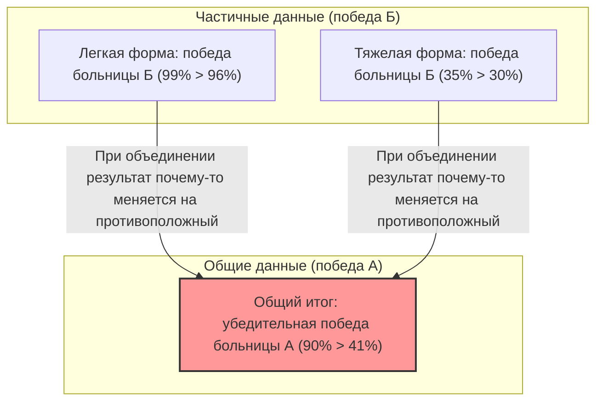

## 1. В какой больнице лучше сделать операцию?

Вы тяжело заболели, и вам необходимо сделать операцию.
Перед вами два варианта: больница А и больница Б. Вы запросили данные о «проценте успеха» операций в каждой из них.

**【Общий процент успеха】**
- **Больница А**： Из 1000 человек операция прошла успешно у 900 (процент успеха **90%**)
- **Больница Б**： Из 1000 человек операция прошла успешно у 800 (процент успеха **80%**)

Посмотрев на это, любой подумает: «Больница А лучше!».
Однако вы человек осторожный и решили более детально изучить, как меняются данные в зависимости от тяжести заболевания (легкая или тяжелая форма).

**【Процент успеха у пациентов с легкой формой】**
- **Больница А**： Из 100 человек операция прошла успешно у 99 (процент успеха **99%**)
- **Больница Б**： Из 900 человек операция прошла успешно у 870 (процент успеха **96%**)
$\rightarrow$ В случае легкой формы заболевания, **выигрывает больница А (99% > 96%)**

**【Процент успеха у пациентов с тяжелой формой】**
- **Больница А**： Из 900 человек операция прошла успешно у 801 (процент успеха **89%**)
- **Больница Б**： Из 100 человек операция прошла успешно у 70 (процент успеха **70%**)
$\rightarrow$ Даже в случае тяжелой формы заболевания, **выигрывает больница А (89% > 70%)**

Эй? Вам не кажется это странным?

Для пациентов с «легкой» формой процент успеха выше в больнице А.
Для пациентов с «тяжелой» формой процент успеха также выше в больнице А.
И все же, если посчитать «общий» процент успеха для всех пациентов вместе...?

- Больница А в целом： $(99 + 801) / 1000 =$ **90%**
- Больница Б в целом： $(870 + 70) / 1000 =$ **94%**……стоп, согласно предыдущим подсчетам, это было **80%?** 

Подождите, давайте еще раз посмотрим на первоначальные данные.
Первоначальные данные были такими:
- Общий процент успеха в больнице А： **90%**
- Общий процент успеха в больнице Б： **80%**

Однако, если мы пересчитаем, используя детально разбитые данные, то общий процент успеха больницы Б должен составить $(870 + 70) / 1000 = 940 / 1000 = $ **94%**.

**…Да, вас обманули!**
На самом деле, именно этот трюк с числами и является пугающей статистической ловушкой, которую мы сегодня разберем.
Давайте я покажу вам правильные данные.

---

## 2. Тем, кого обманули: настоящие данные

**【Процент успеха у пациентов с легкой формой】**
- **Больница А**： Из 900 человек операция прошла успешно у 870 (процент успеха **96%**)
- **Больница Б**： Из 100 человек операция прошла успешно у 99 (процент успеха **99%**)
$\rightarrow$ В случае легкой формы заболевания, **выигрывает больница Б (99% > 96%)**

**【Процент успеха у пациентов с тяжелой формой】**
- **Больница А**： Из 100 человек операция прошла успешно у 30 (процент успеха **30%**)
- **Больница Б**： Из 900 человек операция прошла успешно у 315 (процент успеха **35%**)
$\rightarrow$ Даже в случае тяжелой формы заболевания, **выигрывает больница Б (35% > 30%)**

То есть, как при легкой, так и при тяжелой форме заболевания, **больница Б намного превосходит больницу А**.

Теперь давайте суммируем это в «общем» итоге.

- **Больница А в целом**： $(870 + 30) / (900 + 100) = 900 / 1000 =$ **процент успеха 90%**
- **Больница Б в целом**： $(99 + 315) / (100 + 900) = 414 / 1000 =$ **процент успеха 41%**

Как же так? Если смотреть на «части», больница Б везде выигрывает, но если объединить все в «целое», то больница А одерживает убедительную победу!
Именно это явление и называется **«парадоксом Симпсона»**.

---

## 3. Почему происходит такой странный разворот?

Природа этого парадокса кроется в **«смещении параметров (знаменателя)»** и наличии **«скрытых переменных (вмешивающихся факторов)»**.

Внимательно посмотрите на данные.
- Больница А принимает **в большом количестве (900 человек) «пациентов с легкой формой, которых легко вылечить»**.
- Больница Б принимает **в большом количестве (900 человек) «пациентов с тяжелой формой, которых трудно вылечить»**.

Так как в больнице Б работают отличные специалисты, она стала своеобразной «последней надеждой», принимая множество сложных, тяжелобольных пациентов, от которых отказываются в других местах. Естественно, процент успеха у тяжелобольных пациентов будет ниже (35%). «Общий процент успеха» больницы Б оказался визуально заниженным (41%) из-за того, что его потянул вниз низкий процент успеха этого огромного числа тяжелобольных пациентов.

С другой стороны, больница А в основном занимается лечением простых случаев, пациентов с легкой формой, из-за чего ее общий процент успеха выглядит высоким (90%). Однако при сравнении в равных условиях (тяжелые с тяжелыми, легкие с легкими), ее мастерство оказалось хуже, чем у больницы Б.

Если выразить это математически, причина кроется в свойствах сложения дробей.
В общем случае, даже если $\frac{a}{b} < \frac{A}{B}$ и $\frac{c}{d} < \frac{C}{D}$, это не означает, что
$$ \frac{a+c}{b+d} < \frac{A+C}{B+D} $$
будет выполняться всегда. Когда размеры знаменателей сильно отличаются, направление знака неравенства может измениться на противоположное.

---

## 4. «Парадокс Симпсона» в реальном мире

Этот парадокс — не просто арифметическая головоломка, он часто встречается в реальном обществе и вызывает бурные споры.

### Подозрения в гендерной дискриминации в Калифорнийском университете в Беркли в 1973 году
Когда исследовали процент приема в аспирантуру Беркли, оказалось, что «процент приема среди мужчин (44%)» был значительно выше, чем «процент приема среди женщин (35%)», что стало проблемой, поскольку указывало на очевидную дискриминацию в отношении женщин.
Однако, когда данные были детально разбиты и проанализированы «по факультетам», выявился удивительный факт.
Почти на всех факультетах **процент приема женщин был выше, чем мужчин**.

Почему общие цифры перевернулись?
На самом деле, женщины чаще подавали заявления на «факультеты с низким процентом приема (где высокая конкуренция)», в то время как мужчины чаще подавали заявления на «факультеты с высоким процентом приема (куда легко поступить)».

### Данные об эффективности вакцин против коронавируса
Однажды распространились данные, гласящие: «Уровень смертности среди вакцинированных людей выше, чем среди невакцинированных», что вызвало переполох.
Это также результат игнорирования данных по возрастным группам (скрытой переменной).
Поскольку вакцины в первую очередь предлагались «пожилым людям (у которых уровень смертности изначально выше)», простое сложение общих показателей смертности привело к тому, что в группе вакцинированных оказалось крайне много пожилых людей, из-за чего показатель смертности визуально стал выше.

При сравнении по возрастным группам было подтверждено, что во всех возрастных группах «уровень смертности среди вакцинированных людей ниже».

---

## 5. Заключение: данные не лгут, но люди могут лгать с помощью данных

Парадокс Симпсона предостерегает об **«опасности принятия решений, основываясь только на общих данных, таких как средние значения или суммы»**.

В мире полно компаний, политиков и средств массовой информации, которые выхватывают только «общие цифры», чтобы представить себя в выгодном свете.
Даже если вам говорят: «Наш продукт А имеет более высокий уровень общей удовлетворенности, чем продукт Б конкурента!», возможно, если разделить пользователей на «молодежь» и «пожилых», продукт Б окажется победителем в обеих группах.

При изучении данных не обманывайтесь поверхностными «общими» цифрами, а выработайте привычку сомневаться: «Нет ли крайнего перекоса в пропорциях групп из-за скрытых переменных (возраст, пол, тяжесть заболевания и т.д.)?». Это станет вашим самым сильным оружием для выживания в современном информационном обществе.
