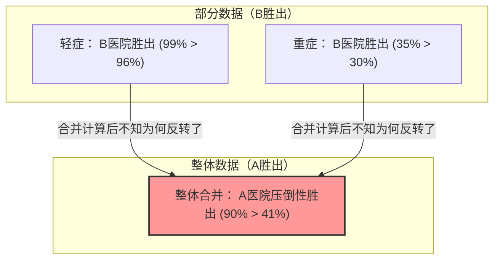

## 1. 应该在两家医院中的哪一家接受手术？

假设你身患重病，必须接受手术。
摆在你面前的有A医院和B医院这两个选择。你获取了两家医院各自的手术“成功率”数据。

**【整体成功率】**
- **A医院**：1000人中，900人成功（成功率 **90%**）
- **B医院**：1000人中，800人成功（成功率 **80%**）

看到这个，任何人都会认为“A医院更优秀！”吧。
但是，由于你性格谨慎，决定进一步详细调查数据会因病情（轻症还是重症）发生怎样的变化。

**【轻症患者成功率】**
- **A医院**：100人中，99人成功（成功率 **99%**）
- **B医院**：900人中，870人成功（成功率 **96%**）
$\rightarrow$ 轻症情况下，**A医院胜出（99% > 96%）**

**【重症患者成功率】**
- **A医院**：900人中，801人成功（成功率 **89%**）
- **B医院**：100人中，70人成功（成功率 **70%**）
$\rightarrow$ 重症情况下，依然是**A医院胜出（89% > 70%）**

咦？不觉得奇怪吗？

对于“轻症”患者来说，A医院的成功率更高。
对于“重症”患者来说，A医院的成功率也更高。
既然如此，如果计算所有患者加起来的“整体”成功率会怎样呢……？

- A医院 整体：$(99 + 801) / 1000 =$ **90%**
- B医院 整体：$(870 + 70) / 1000 =$ **94%**……不对，根据刚才的计算是 **80%？** 

等一下，让我们再看一眼最初的数据。
最初的数据是这样的：
- A医院 整体成功率：**90%**
- B医院 整体成功率：**80%**

但是，如果我们用细分后的数据重新计算，
B医院的整体成功率应该是 $(870 + 70) / 1000 = 940 / 1000 =$ **94%** 才对。

**……没错，你被骗了！**
实际上，这个数字陷阱正是我们这次要解说的统计学中可怕的陷阱。
让我再次向您展示正确的数据吧。

---

## 2. 致被骗的你：真实的数据

**【轻症患者成功率】**
- **A医院**：900人中，870人成功（成功率 **96%**）
- **B医院**：100人中，99人成功（成功率 **99%**）
$\rightarrow$ 轻症情况下，**B医院胜出（99% > 96%）**

**【重症患者成功率】**
- **A医院**：100人中，30人成功（成功率 **30%**）
- **B医院**：900人中，315人成功（成功率 **35%**）
$\rightarrow$ 重症情况下，也是**B医院胜出（35% > 30%）**

也就是说，无论是轻症还是重症，**都是B医院压倒性地优秀**。

那么，让我们把这些在“整体”上合并计算一下。

- **A医院 整体**：$(870 + 30) / (900 + 100) = 900 / 1000 =$ **成功率 90%**
- **B医院 整体**：$(99 + 315) / (100 + 900) = 414 / 1000 =$ **成功率 41%**

没想到，从“部分”来看全都是B医院赢，但在“整体”上合并后，却变成了A医院的大获全胜！
这就是被称为**“辛普森悖论”**的现象。

---

## 3. 为什么会发生这种奇怪的反转？

这个悖论的真面目在于**“基数（分母）的偏差”**和**“隐藏变量（混杂因素）”**。

请仔细看数据。
- A医院接收了**大量（900人）“容易治愈的轻症患者”**。
- B医院接收了**大量（900人）“难以治愈的重症患者”**。

因为B医院医术高超，所以它就像是“最后的堡垒”，接手了许多被其他地方拒收的棘手重症患者。当然，重症患者的成功率会很低（35%）。B医院的“整体成功率”被这大量重症患者的低成功率拖了后腿，导致整体看起来很低（41%）。

相反，A医院因为只处理简单的轻症患者，所以整体成功率看起来很高（90%），但在相同条件（重症与重症比、轻症与轻症比）下比较，它的医术其实是不如B医院的。

用数学公式来表示的话，原因在于分数加法的性质。
通常情况下，即使 $\frac{a}{b} < \frac{A}{B}$ 且 $\frac{c}{d} < \frac{C}{D}$，
$$ \frac{a+c}{b+d} < \frac{A+C}{B+D} $$
也不一定总是成立。当分母的大小差距悬殊时，不等号的方向有时会发生反转。

---

## 4. 现实世界中发生的“辛普森悖论”

这个悖论不仅是个简单的算术谜题，在现实社会中也频繁发生，并曾引发巨大争议。

### 1973年 加州大学伯克利分校的性别歧视疑云
在调查伯克利分校研究生的录取率时，发现“男性的录取率（44%）”显著高于“女性的录取率（35%）”，这被认为是对女性的明显歧视而引发了问题。
然而，当把数据按“各个学院”细分并详细分析后，发现了惊人的事实。
在几乎所有的学院中，**女性的录取率都比男性高**。

为什么整体的数字会反转呢？
实际上，只是因为女性更多地申请了“录取率低（门槛高）的学院”，而男性更多地申请了“录取率高（容易进）的学院”。

### 新冠疫苗的有效性数据
曾有“接种疫苗的人比未接种的人死亡率更高”的数据流传，引起了轩然大波。
这也是无视了按年龄段划分的数据（隐藏变量）的结果。
由于疫苗是优先给“老年人（本来死亡率就高）”接种的，所以如果只是简单地将整体死亡率加总，接种疫苗的群体中老年人的比例就会极度偏高，导致表面上的死亡率看起来更高。

如果按年龄段细分进行比较，就可以确认在所有年龄段中都是“接种过的人死亡率更低”。

---

## 5. 总结：数据不会说谎，但人可以用数据说谎

辛普森悖论警告我们**“仅看平均值或总计值等整体数据来做判断是危险的”**。

世上充斥着那些只截取“整体数字”来为自己做有利宣传的企业、政治家和媒体。
即使听到“我们公司的产品A，比其他公司产品B的整体满意度更高！”，如果把它分成“年轻人群体”和“老年人群体”来看，说不定在哪个群体里都是其他公司产品B更胜一筹。

在看数据时，不要被表面上的“整体”数字所欺骗，而要具备怀疑的眼光，去思考“是否因为背后隐藏的变量（年龄、性别、严重程度等），导致各组的比例出现了极端的偏差？”，这将成为我们在现代信息社会中生存下去的最强武器。
