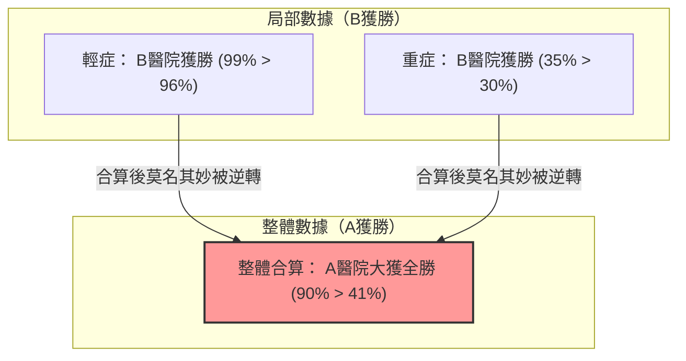

## 1. 應該在哪家醫院接受手術？

您罹患了重病，必須接受手術。
眼前有A醫院和B醫院兩個選擇。您調閱了各家醫院手術「成功率」的數據。

**【整體成功率】**
- **A醫院**： 1000人中，有900人成功（成功率 **90%**）
- **B醫院**： 1000人中，有800人成功（成功率 **80%**）

看到這個，任何人應該都會認為「A醫院比較優秀！」。
不過，由於您性格謹慎，決定根據病情（輕症或重症）來仔細調查數據會有什麼變化。

**【輕症患者成功率】**
- **A醫院**： 100人中，有99人成功（成功率 **99%**）
- **B醫院**： 900人中，有870人成功（成功率 **96%**）
$\rightarrow$ 輕症的情況下，**A醫院獲勝（99% > 96%）**

**【重症患者成功率】**
- **A醫院**： 900人中，有801人成功（成功率 **89%**）
- **B醫院**： 100人中，有70人成功（成功率 **70%**）
$\rightarrow$ 即使在重症的情況下，也是**A醫院獲勝（89% > 70%）**

咦？您不覺得奇怪嗎？

對「輕症」患者而言，A醫院的成功率比較高。
對「重症」患者而言，A醫院的成功率也比較高。
儘管如此，當計算所有患者合計的「整體」成功率時……？

- A醫院 整體： $(99 + 801) / 1000 =$ **90%**
- B醫院 整體： $(870 + 70) / 1000 =$ **94%**……不對，剛才的計算是 **80%？** 

請等一下，讓我們再看一次最初的數據。
最初的數據是這樣的。
- A醫院 整體成功率： **90%**
- B醫院 整體成功率： **80%**

但是，如果用細分的數據重新計算，
B醫院的整體成功率應該是 $(870 + 70) / 1000 = 940 / 1000 = $ **94%** 才對。

**…哎呀，您被騙了！**
其實，這個數字遊戲正是這次要解說的統計學的可怕陷阱。
讓我們再看一次正確的數據。

---

## 2. 致被騙的您：真實的數據

**【輕症患者成功率】**
- **A醫院**： 900人中，有870人成功（成功率 **96%**）
- **B醫院**： 100人中，有99人成功（成功率 **99%**）
$\rightarrow$ 輕症的情況下，**B醫院獲勝（99% > 96%）**

**【重症患者成功率】**
- **A醫院**： 100人中，有30人成功（成功率 **30%**）
- **B醫院**： 900人中，有315人成功（成功率 **35%**）
$\rightarrow$ 即使在重症的情況下，也是**B醫院獲勝（35% > 30%）**

也就是說，無論是輕症還是重症，**B醫院都壓倒性地優秀**。

那麼，我們把這些合算為「整體」來看看。

- **A醫院 整體**： $(870 + 30) / (900 + 100) = 900 / 1000 =$ **成功率 90%**
- **B醫院 整體**： $(99 + 315) / (100 + 900) = 414 / 1000 =$ **成功率 41%**

令人驚訝的是，從「局部」來看都是B醫院獲勝，但將「整體」合算後，卻變成A醫院大獲全勝！
這就是被稱為**「辛普森悖論」**的現象。

---

## 3. 為什麼會發生這種奇妙的逆轉？

這個悖論的真面目，在於**「樣本數（分母）的偏差」**與**「潛藏變數（干擾因子）」**。

請仔細看看數據。
- A醫院收治了**大量（900人）「容易治癒的輕症患者」**。
- B醫院收治了**大量（900人）「難以治癒的重症患者」**。

因為B醫院的醫術高超，所以是個宛如「最後的堡壘」般的醫院，接手了許多在其他地方被拒絕的棘手重症患者。當然，重症患者的成功率會比較低（35%）。B醫院的「整體成功率」，就是被這大量重症患者的低成功率給拖累，導致整體看起來很低（41%）。

相反地，A醫院因為只處理簡單的輕症患者，所以整體成功率看起來很高（90%），但在相同條件（重症對重症，輕症對輕症）下相比，醫術其實是不如B醫院的。

用數學公式來表示，分數加法的性質就是原因。
一般而言，即使 $\frac{a}{b} < \frac{A}{B}$ 且 $\frac{c}{d} < \frac{C}{D}$，
$$ \frac{a+c}{b+d} < \frac{A+C}{B+D} $$
也不一定總是成立。當分母的大小差異懸殊時，不等號的方向是有可能逆轉的。

---

## 4. 現實世界中發生的「辛普森悖論」

這個悖論並非單純的算術謎題，在現實社會中也頻繁發生，並曾引發過巨大的爭議。

### 1973年 加州大學柏克萊分校的性別歧視疑雲
在調查柏克萊分校研究所的錄取率時，發現「男性的錄取率（44%）」顯著高於「女性的錄取率（35%）」，被認為對女性存在明顯歧視而引發了問題。
然而，將數據按照「各科系」分開仔細分析後，卻發現了令人驚訝的事實。
幾乎在所有的科系中，**女性的錄取率都比男性高**。

為什麼整體的數字會逆轉呢？
其實，只是因為女性多半申請「錄取率低（窄門）的科系」，而男性多半申請「錄取率高（容易進入）的科系」而已。

### 新冠疫苗的有效性數據
曾經有「接種疫苗的人，死亡率比未接種的人高」的數據流傳，引起了軒然大波。
這也是忽略了年齡層數據（潛藏變數）的結果。
因為疫苗是從「高齡者（原本死亡率就較高）」開始優先接種的，所以如果只是將整體的死亡率合算起來，高齡者會極端地集中在疫苗接種組，導致表面上的死亡率變高了。

如果按照年齡層分開比較，就確認了在所有的年齡層中，都是「有接種的人死亡率較低」。

---

## 5. 總結：數據不會說謊，但人可以利用數據說謊

辛普森悖論警告了我們**「只看平均值或合計值等整體數據來做判斷的危險性」**。

世上充斥著許多只擷取「整體的數字」，並為了對自己有利而進行宣傳的企業、政治家和媒體。
即使他們說「本公司的產品A，整體的滿意度比他牌產品B還要高！」，但如果分成「年輕族群」與「高齡族群」來看，或許在這兩個族群中，都是他牌產品B勝出也不一定。

在看數據時，不要被表面上「整體」的數字所欺騙，抱持著「是否會因為潛藏在背後的變數（年齡、性別、重症度等），導致各組別的比例產生極端的偏差？」的懷疑眼光，將會是我們在現代資訊社會中生存的最強武器。
