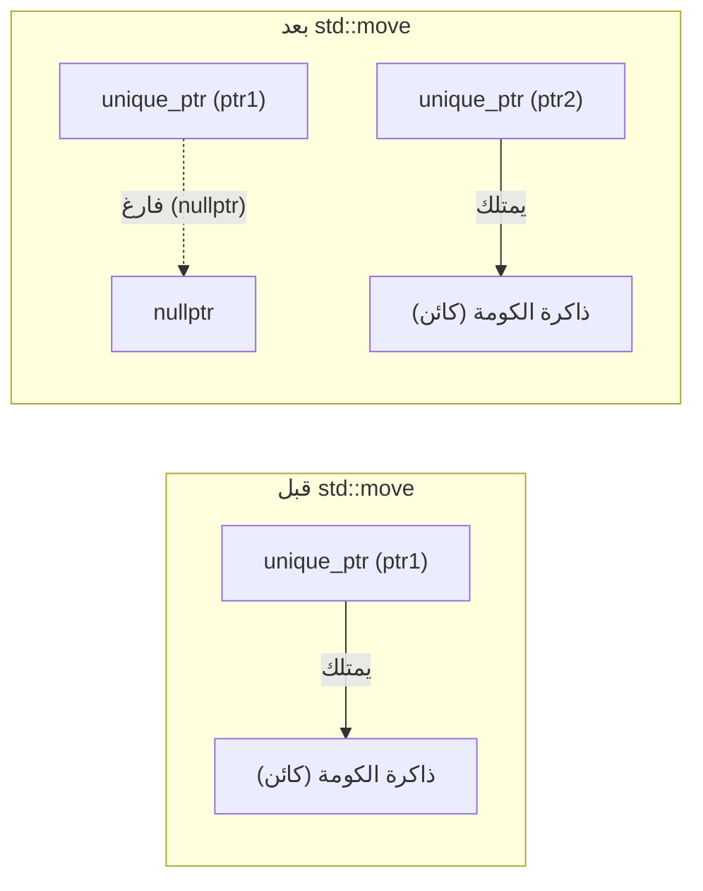
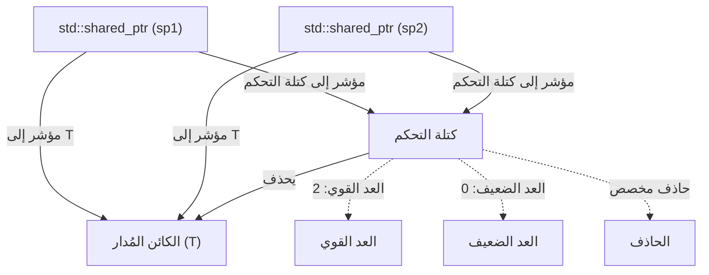
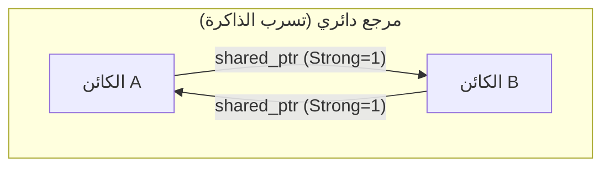
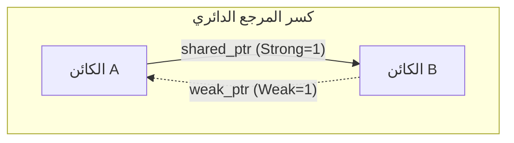

لطالما كانت إدارة الذاكرة في لغة C++ إحدى أكبر التحديات التي تواجه المطورين لسنوات طويلة. كان أسلوب إدارة الذاكرة التقليدي الذي يعتمد على الاستخدام اليدوي لـ `new` و `delete` بيئة خصبة لأخطاء برمجية خطيرة مثل تسرب الذاكرة (Memory Leaks)، والمؤشرات المعلقة (Dangling Pointers)، والتحرير المزدوج للذاكرة (Double Free). ولكن مع ظهور C++ الحديثة (Modern C++) بدءاً من معيار C++11، تغير الوضع بشكل جذري. ويكمن جوهر هذا التغيير في "المؤشرات الذكية" (Smart Pointers).

في هذا المقال، سنشرح بتفصيل شديد آليات عمل `std::unique_ptr` و `std::shared_ptr` و `std::weak_ptr`، والتي تُعد أدوات قوية للقضاء على تسرب الذاكرة وتحقيق إدارة آمنة وفعالة للموارد. سنتناول استراتيجيات الاستخدام المتقدمة، مع التطرق إلى التطبيق الداخلي (مثل كتلة التحكم والعمليات الذرية)، وتأثيرها على الأداء، والصياغة الرياضية لعد المراجع (Reference Counting).

## 1. مقدمة: العصر المظلم لإدارة الذاكرة في C++ وفجر Modern C++

في تطوير C++ قديماً، كان المطور مسؤولاً بشكل مباشر عن تحرير الذاكرة المخصصة على الكومة (Heap).

```cpp
void legacy_function() {
    int* ptr = new int(10);
    // ... بعض العمليات ...
    if (some_condition) {
        return; // حدوث تسرب للذاكرة! لم يتم استدعاء delete
    }
    delete ptr;
}
```

في كود مثل الموضح أعلاه، عند حدوث استثناء (Exception) أو الإرجاع المبكر (Early Return)، يتم تخطي استدعاء `delete` مما يؤدي إلى تسرب الذاكرة. ولمنع ذلك، ظهر نموذج "RAII" (Resource Acquisition Is Initialization). RAII هو أسلوب يربط بين حجز الموارد وتهيئة الكائن (في دالة البناء)، وتحرير الموارد وتدمير الكائن (في دالة الهدم). المؤشرات الذكية هي فئات في المكتبة القياسية تُطبق نمط RAII هذا على إدارة الذاكرة.

## 2. `std::unique_ptr`: ملكية حصرية بدون تكلفة إضافية (Zero-Overhead)

`std::unique_ptr` هو مؤشر ذكي يمتلك "ملكية حصرية" (Exclusive Ownership) للكائن المخصص ديناميكيًا. يمكن لمؤشر `unique_ptr` واحد فقط أن يمتلك مورداً معيناً في أي وقت.

### 2.1 مبدأ التكلفة الصفرية (Zero-Overhead Principle)

الميزة الأكبر لـ `std::unique_ptr` هي أداؤه. في حالته الافتراضية وبدون وجود حاذف مخصص (Custom Deleter)، يكون حجم `std::unique_ptr` مطابقاً تماماً لحجم المؤشر الخام (Raw Pointer). فهو لا يحتوي على أي متغيرات أعضاء غير ضرورية، ولا يستخدم دوال افتراضية (Virtual Functions). بفضل تحسينات المترجم (Compiler Optimization)، يتم تحويل الوصول عبر `std::unique_ptr` إلى كود تجميع (Assembly) مكافئ تماماً لاستخدام المؤشر الخام.

### 2.2 نقل الملكية و `std::move`

نظرًا لامتلاكه ملكية حصرية، لا يمكن نسخ `std::unique_ptr` (تم حذف دالة البناء بالنسخ ومعامل التعيين بالنسخ باستخدام `delete`). لنقل الملكية إلى `unique_ptr` آخر، نستخدم `std::move` للاستفادة من دلالات النقل (Move Semantics).

```cpp
#include <iostream>
#include <memory>

class Resource {
public:
    Resource() { std::cout << "Resource acquired\n"; }
    ~Resource() { std::cout << "Resource destroyed\n"; }
    void do_something() { std::cout << "Doing something\n"; }
};

void process_resource(std::unique_ptr<Resource> ptr) {
    ptr->do_something();
    // عند الخروج من النطاق (Scope)، يتم تدمير ptr وتحرير Resource
}

int main() {
    std::unique_ptr<Resource> my_ptr = std::make_unique<Resource>();
    
    // process_resource(my_ptr); // خطأ: لا يمكن النسخ
    process_resource(std::move(my_ptr)); // نقل الملكية
    
    if (!my_ptr) {
        std::cout << "my_ptr is now empty.\n";
    }
    return 0;
}
```

يوضح مخطط Mermaid التالي مفهوم نقل الملكية باستخدام `std::move`.



### 2.3 تنفيذ حاذف مخصص (Custom Deleter)

عند تغليف واجهات برمجة التطبيقات القديمة (Legacy APIs) الخاصة بلغة C (مثل `FILE*` أو مآخذ التوصيل Sockets)، نحتاج إلى استدعاء دالة غير `delete` (مثل `fclose`) لتحرير الذاكرة. يتيح `std::unique_ptr` تحديد حاذف مخصص كمعلمة قالب ثانية (Template Parameter).

```cpp
#include <cstdio>
#include <memory>

// كائن دالي (Functor) للحاذف المخصص
struct FileDeleter {
    void operator()(FILE* fp) const {
        if (fp) {
            std::cout << "Closing file.\n";
            std::fclose(fp);
        }
    }
};

using UniqueFile = std::unique_ptr<FILE, FileDeleter>;

int main() {
    UniqueFile file(std::fopen("test.txt", "w"));
    if (file) {
        std::fputs("Hello, Smart Pointers!", file.get());
    }
    // عند انتهاء النطاق، يتم استدعاء FileDeleter وبالتالي fclose
    return 0;
}
```

إذا استخدمنا مؤشر دالة أو تعبير لامبدا (Lambda) كحاذف مخصص، فقد يزداد حجم `unique_ptr`، ولكن استخدام كائن دالي عديم الحالة (Stateless Functor) كما هو موضح أعلاه يحافظ على الحجم ليكون مساويًا للمؤشر الخام بفضل **EBCO (Empty Base Class Optimization)** في C++ أو السمة `[[no_unique_address]]` في C++20 (مما يحافظ على التكلفة الصفرية).

## 3. `std::shared_ptr`: الملكية المشتركة وكتلة التحكم

`std::shared_ptr` هو مؤشر ذكي يسمح لعدة مؤشرات بمشاركة ملكية نفس الكائن. يتم تحرير الكائن المُدار فقط عندما يتم تدمير آخر `shared_ptr` يشير إليه.

### 3.1 البنية الداخلية: كتلة التحكم (Control Block)

بالإضافة إلى المؤشر الذي يشير إلى الكائن المُدار، يخصص `std::shared_ptr` بيانات وصفية (Metadata) تسمى **كتلة التحكم (Control Block)** على الكومة لمشاركتها. تتضمن كتلة التحكم المعلومات التالية:

1.  **العد القوي (Strong Count)**: عدد مؤشرات `shared_ptr` التي تمتلك الكائن. عندما يصبح هذا العدد 0، يتم تدمير الكائن.
2.  **العد الضعيف (Weak Count)**: عدد مؤشرات `weak_ptr` التي تراقب الكائن. عندما يصبح كل من العد القوي والعد الضعيف 0، يتم تحرير كتلة التحكم نفسها.
3.  **الحاذف المخصص والمُخصص (Custom Deleter & Allocator)** (إذا تم تحديدهما).



لهذا السبب، يكون حجم الكائن `std::shared_ptr` نفسه عادةً ضعف حجم المؤشر الخام (مؤشر للكائن المُدار، ومؤشر لكتلة التحكم).

### 3.2 الأداء والعمليات الذرية (Atomic Operations)

يتم تنفيذ عداد المراجع داخل كتلة التحكم كـ **عمليات ذرية (Atomic Operations)** لضمان زيادته ونقصانه بأمان في البيئات متعددة الخيوط (Multithreaded).

في معمارية x86/x64، تُستخدم تعليمات ذرية مثل `lock xadd` لزيادة أو إنقاص عداد المراجع. يصاحب ذلك تكلفة إضافية (Overhead) تبلغ عشرات دورات المعالج مقارنة بجمع الأعداد الصحيحة العادية. وبالتالي، فإن تمرير `shared_ptr` بالقيم (Pass by Value) إلى دالة سيؤدي إلى زيادة ونقصان ذري في كل عملية نسخ، مما يؤدي إلى تدهور الأداء.

**أفضل الممارسات**: عند تمرير `shared_ptr` إلى دالة، ما لم تكن هناك حاجة لمشاركة الملكية، يجب تمريره كمرجع ثابت `const std::shared_ptr<T>&`، أو تمرير المؤشر الخام/المرجع بدلاً من ذلك.

### 3.3 `std::make_shared` مقابل `new`

عند إنشاء `shared_ptr`، يجب استخدام `std::make_shared` قدر الإمكان. هناك سببان مهمان لذلك:

1.  **تحسين تخصيص الذاكرة**:
    عند استخدام `new`، يتم إجراء تخصيصين للذاكرة على الكومة: تخصيص للكائن نفسه وتخصيص لكتلة التحكم. بينما يتيح `std::make_shared` تخصيص كتلة ذاكرة واحدة كبيرة تشمل كليهما في عملية تخصيص واحدة، مما يحسن كفاءة الذاكرة المخبئية (Cache).
2.  **أمان الاستثناءات (Exception Safety)**:
    في معايير C++ قبل C++17، لم يكن ترتيب تقييم وسائط الدالة محددًا، لذا إذا تم تخصيص مؤشر باستخدام `new` وحدث استثناء أثناء تقييم وسائط أخرى قبل تمريره إلى دالة بناء `shared_ptr`، كان هناك خطر تسرب الذاكرة. أداة `make_shared` تتجنب هذه المشكلة تماماً.

```cpp
// الطريقة التي يجب تجنبها (تخصيص الذاكرة مرتين)
std::shared_ptr<MyClass> ptr1(new MyClass());

// الطريقة الموصى بها (تخصيص الذاكرة مرة واحدة)
std::shared_ptr<MyClass> ptr2 = std::make_shared<MyClass>();
```

## 4. `std::weak_ptr`: حل مشكلة المراجع الدائرية والمراقبة

تحتوي الملكية المشتركة على نقطة ضعف قاتلة تُعرف باسم "المراجع الدائرية" (Circular References). إذا كان الكائن A والكائن B يشيران إلى بعضهما البعض باستخدام `shared_ptr`، فسيظل العد القوي لكل منهما 1 على الأقل، ولن يصبح 0 أبدًا حتى ينتهي البرنامج، مما يؤدي إلى تسرب الذاكرة.



### 4.1 كسر الدائرة بواسطة `std::weak_ptr`

التي تحل هذه المشكلة هي `std::weak_ptr`. يتم إنشاء `weak_ptr` من `shared_ptr` ويشير إلى الكائن، ولكنه **لا يزيد من العد القوي**. بدلاً من ذلك، يزيد من العد الضعيف. يتيح هذا "مراقبة" الكائن دون امتلاكه.



### 4.2 الوصول الآمن عبر التابع `lock()`

لا يمتلك `weak_ptr` عوامل تشغيل للوصول المباشر إلى الكائن (مثل `->` أو `*`). ويرجع ذلك إلى احتمال أن يكون الكائن المستهدف قد تم تدميره بالفعل. للوصول بأمان، نقوم باستدعاء التابع `lock()` للحصول مؤقتاً على `shared_ptr`.

```cpp
#include <iostream>
#include <memory>

class Node {
public:
    std::string name;
    std::shared_ptr<Node> next;
    std::weak_ptr<Node> prev; // استخدام weak_ptr لمنع المرجع الدائري

    Node(const std::string& n) : name(n) { std::cout << "Created " << name << "\n"; }
    ~Node() { std::cout << "Destroyed " << name << "\n"; }
};

int main() {
    auto nodeA = std::make_shared<Node>("A");
    auto nodeB = std::make_shared<Node>("B");

    nodeA->next = nodeB;
    nodeB->prev = nodeA;

    // الحصول على shared_ptr من weak_ptr للوصول
    if (auto locked_prev = nodeB->prev.lock()) {
        std::cout << "Node B's prev is " << locked_prev->name << "\n";
    } else {
        std::cout << "Node B's prev is already destroyed.\n";
    }

    return 0; // يتم تدمير nodeA و nodeB بشكل صحيح
}
```

## 5. قيود الملكية المشتركة في البيئات متعددة الخيوط

غالبًا ما يُساء فهم أمان الخيوط (Thread Safety) الخاص بـ `shared_ptr`. "تحديث عداد المراجع داخل كتلة التحكم يعتبر آمنًا للخيوط"، ولكن "القراءة والكتابة لنفس الكائن `shared_ptr` بحد ذاته ليست آمنة للخيوط".

- **العمليات الآمنة**: عدة خيوط تقوم كل منها بقراءة وكتابة *نسختها الخاصة* من `shared_ptr` (على الرغم من أنها تشترك في نفس كتلة التحكم).
- **سباق البيانات (خطير)**: عدة خيوط تقوم في وقت واحد بالقراءة والكتابة *لنفس الكائن* `shared_ptr` بالظبط.

إذا كانت هناك حاجة لمشاركة نفس النسخة عبر خيوط متعددة، يجب استخدام `std::atomic<std::shared_ptr<T>>` (في C++20) أو حمايته باستخدام كائن قفل (Mutex) `std::mutex`.

## 6. الصياغة الرياضية لعداد المراجع

يمكن التعبير رياضياً عن انتقال حالة دورة الحياة في كتلة التحكم على النحو التالي.
بفرض أن العد القوي في الوقت $t$ هو $S(t)$، والعد الضعيف هو $W(t)$.

الحالة الأولية (مباشرة بعد `make_shared`):
$$ S(0) = 1, \quad W(0) = 0 $$

عند حدوث عملية نسخ (تكرار لـ `shared_ptr`):
$$ S(t_{next}) = S(t) + 1 $$

شرط تدمير الكائن المُدار (Managed Object):
$$ \lim_{t \to t_d} S(t) = 0 $$

شرط تحرير كتلة التحكم (Control Block) نفسها من الذاكرة:
$$ S(t) = 0 \quad \land \quad W(t) = 0 $$
أي بمعنى آخر،
$$ S(t) + W(t) = 0 $$

كما توضح هذه المعادلات، طالما أن `weak_ptr` مستمر في الوجود ($W(t) > 0$)، فستظل مساحة الذاكرة الصغيرة المخصصة لكتلة التحكم محجوزة حتى لو تم تدمير الكائن المُدار. في بعض الحالات، يُعتبر هذا هو العيب الوحيد لـ `make_shared` (نظراً لدمج ذاكرة الكائن المُدار مع كتلة التحكم، إذا بقي مرجع ضعيف، فإن مساحة الذاكرة الكبيرة المخصصة للكائن المُدار لن تُعاد إلى النظام). ولكن في العادة، تفوق الفوائد المتعلقة بالأداء لـ `make_shared` هذا العيب بكثير.

## 7. الخاتمة

لم تعد إدارة الذاكرة في C++ الحديثة تتطلب التعامل اليدوي باستخدام `new`/`delete`.

1.  بشكل افتراضي، استخدم دائمًا **`std::unique_ptr`** لدمج الملكية الواضحة في تصميمك مع الاستفادة من ميزة التكلفة الصفرية.
2.  استخدم **`std::shared_ptr`** فقط عندما تحتاج حقًا إلى مشاركة دورة الحياة بين عدة مالكين، واستخدم `std::make_shared` للإنشاء.
3.  استخدم **`std::weak_ptr`** في هياكل البيانات التي قد تسبب حلقات (مراجع دائرية) أو في تنفيذ نمط المراقب (Observer Pattern) لمنع تسرب الذاكرة بشكل استباقي.

من خلال الفهم العميق للمؤشرات الذكية واستخدامها في المكان المناسب، يصبح من الممكن بناء بنية برمجية آمنة وقوية دون التضحية بأي شيء من أداء C++.
