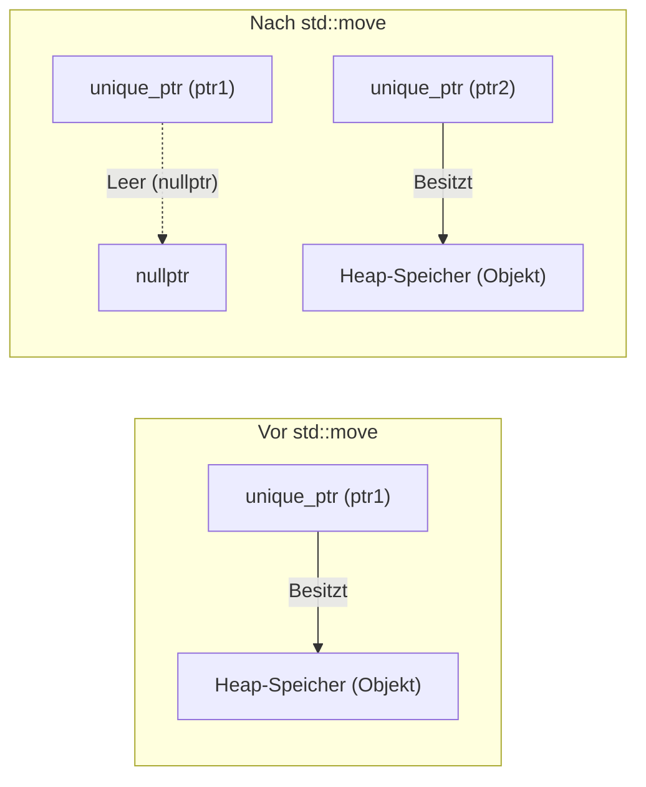
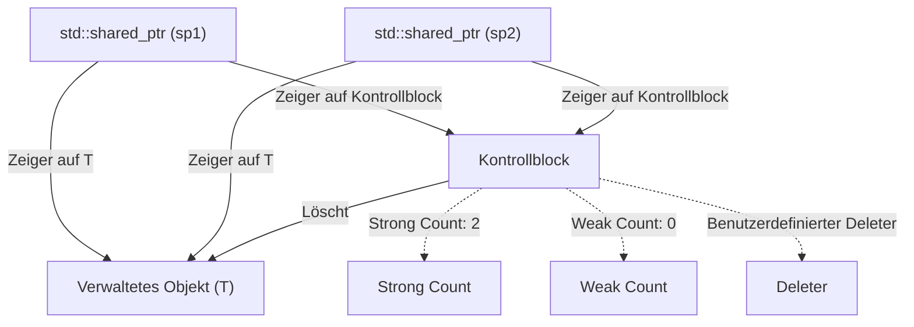
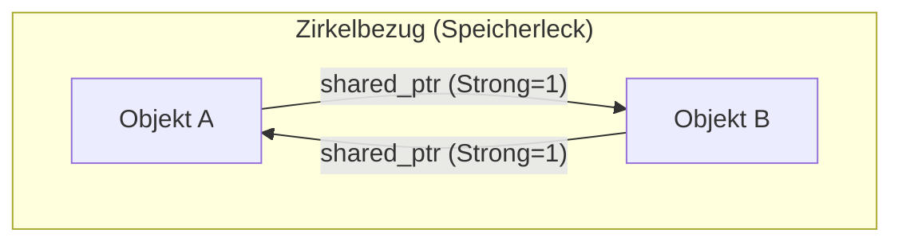
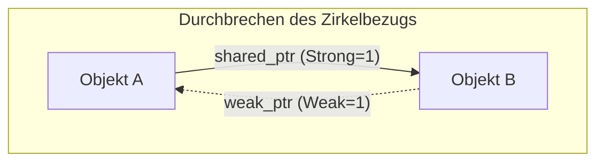

Die Speicherverwaltung in C++ war lange Zeit eine der größten Herausforderungen für Entwickler. Der traditionelle Speicherverwaltungsstil, der auf manuellem `new` und `delete` beruhte, war eine Brutstätte für schwerwiegende Fehler wie Speicherlecks (Memory Leaks), baumelnde Zeiger (Dangling Pointers) und doppelte Freigaben (Double Frees). Mit dem Aufkommen von Modern C++ (seit C++11) hat sich die Situation jedoch dramatisch verändert. Den Kern dieser Veränderung bilden die "Smart Pointer" (Intelligente Zeiger).

In diesem Artikel werden die Funktionsweise und fortgeschrittene Nutzungstechniken von `std::unique_ptr`, `std::shared_ptr` und `std::weak_ptr` – leistungsstarken Werkzeugen zur Beseitigung von Speicherlecks und zur Realisierung einer sicheren und effizienten Ressourcenverwaltung – äußerst detailliert erläutert. Dabei gehen wir auch auf die interne Implementierung (Kontrollblöcke und atomare Operationen), die Auswirkungen auf die Leistung sowie die Formulierung der Referenzzählung durch mathematische Modelle ein.

## 1. Einführung: Das dunkle Zeitalter der C++-Speicherverwaltung und die Morgendämmerung von Modern C++

In der früheren C++-Entwicklung mussten Entwickler selbst dafür sorgen, dass auf dem Heap reservierter Speicher wieder freigegeben wurde.

```cpp
void legacy_function() {
    int* ptr = new int(10);
    // ... Irgendeine Verarbeitung ...
    if (some_condition) {
        return; // Speicherleck tritt auf! delete wird nicht aufgerufen
    }
    delete ptr;
}
```

In Code wie dem obigen wird `delete` übersprungen, wenn eine Ausnahme auftritt oder eine frühzeitige Rückkehr (Early Return) stattfindet, was zu einem Speicherleck führt. Das Paradigma, um dies zu verhindern, ist "RAII (Resource Acquisition Is Initialization)". RAII ist eine Technik, die die Zuweisung von Ressourcen an die Initialisierung eines Objekts (Konstruktor) und die Freigabe von Ressourcen an die Zerstörung des Objekts (Destruktor) bindet. Smart Pointer sind ein Klassen-Stack der Standardbibliothek, der dieses RAII-Idiom auf die Speicherverwaltung anwendet.

## 2. `std::unique_ptr`: Exklusives Eigentum ohne Overhead (Zero-Overhead)

`std::unique_ptr` ist ein Smart Pointer, der "exklusives Eigentum" (Exclusive Ownership) an einem dynamisch zugewiesenen Objekt besitzt. Es kann immer nur ein einziger `unique_ptr` eine bestimmte Ressource besitzen.

### 2.1 Das Prinzip des Zero-Overhead

Der größte Reiz von `std::unique_ptr` ist seine Leistung. Im Standardzustand, ohne benutzerdefinierten Deleter (Custom Deleter), ist die Größe von `std::unique_ptr` exakt identisch mit der eines rohen Zeigers (Raw Pointer). Er besitzt keine unnötigen Elementvariablen und es werden keine virtuellen Funktionen verwendet. Durch Compiler-Optimierungen wird der Zugriff über `std::unique_ptr` in denselben Assembler-Code übersetzt wie der eines rohen Zeigers.

### 2.2 Eigentumsübertragung und `std::move`

Da er exklusives Eigentum besitzt, kann `std::unique_ptr` nicht kopiert werden (Kopierkonstruktor und Kopierzuweisungsoperator sind als `delete` markiert). Um das Eigentum auf einen anderen `unique_ptr` zu übertragen, wird `std::move` verwendet, um Move-Semantik (Move Semantics) zu nutzen.

```cpp
#include <iostream>
#include <memory>

class Resource {
public:
    Resource() { std::cout << "Resource acquired\n"; }
    ~Resource() { std::cout << "Resource destroyed\n"; }
    void do_something() { std::cout << "Doing something\n"; }
};

void process_resource(std::unique_ptr<Resource> ptr) {
    ptr->do_something();
    // Wenn der Gültigkeitsbereich (Scope) verlassen wird, wird ptr zerstört und auch Resource freigegeben
}

int main() {
    std::unique_ptr<Resource> my_ptr = std::make_unique<Resource>();
    
    // process_resource(my_ptr); // Fehler: Kopieren nicht möglich
    process_resource(std::move(my_ptr)); // Eigentumsübertragung
    
    if (!my_ptr) {
        std::cout << "my_ptr is now empty.\n";
    }
    return 0;
}
```

Das folgende Mermaid-Diagramm veranschaulicht das Konzept der Eigentumsübertragung durch `std::move`.



### 2.3 Implementierung eines benutzerdefinierten Deleters

Wenn man Legacy-APIs aus C (wie z. B. `FILE*` oder Sockets) verpackt, muss man für die Speicherfreigabe andere Funktionen als `delete` aufrufen (z. B. `fclose`). `std::unique_ptr` ermöglicht es, im zweiten Template-Argument einen benutzerdefinierten Deleter anzugeben.

```cpp
#include <cstdio>
#include <memory>

// Funktor für benutzerdefinierten Deleter
struct FileDeleter {
    void operator()(FILE* fp) const {
        if (fp) {
            std::cout << "Closing file.\n";
            std::fclose(fp);
        }
    }
};

using UniqueFile = std::unique_ptr<FILE, FileDeleter>;

int main() {
    UniqueFile file(std::fopen("test.txt", "w"));
    if (file) {
        std::fputs("Hello, Smart Pointers!", file.get());
    }
    // Am Ende des Gültigkeitsbereichs wird FileDeleter aufgerufen und fclose ausgeführt
    return 0;
}
```

Die Verwendung von Funktionszeigern oder Lambda-Ausdrücken als benutzerdefinierte Deleter kann die Größe von `unique_ptr` erhöhen. Wenn man jedoch, wie oben gezeigt, zustandslose Funktionsobjekte (Funktoren) verwendet, erhöht sich die Größe durch **EBCO (Empty Base Class Optimization)** in C++ oder `[[no_unique_address]]` in C++20 nicht gegenüber einem rohen Zeiger (der Zero-Overhead bleibt erhalten).

## 3. `std::shared_ptr`: Gemeinsames Eigentum und Kontrollblock

`std::shared_ptr` ist ein Smart Pointer, der es mehreren Zeigern ermöglicht, dasselbe Objekt gemeinsam zu besitzen. Wenn der letzte `shared_ptr` zerstört wird, wird das verwaltete Objekt freigegeben.

### 3.1 Interne Architektur: Der Kontrollblock

`std::shared_ptr` weist neben dem Zeiger auf das verwaltete Objekt Metadaten, den sogenannten **Kontrollblock (Control Block)**, auf dem Heap zu und teilt diese. Der Kontrollblock enthält die folgenden Informationen:

1.  **Strong Count (Starke Referenzzählung)**: Die Anzahl der `shared_ptr`, die das Objekt besitzen. Wenn diese 0 erreicht, wird das Objekt zerstört.
2.  **Weak Count (Schwache Referenzzählung)**: Die Anzahl der `weak_ptr`, die das Objekt überwachen. Wenn sowohl der Strong Count als auch der Weak Count 0 erreichen, wird der Kontrollblock selbst freigegeben.
3.  **Benutzerdefinierter Deleter und Allokator** (falls angegeben).



Aus diesem Grund ist die Größe des `std::shared_ptr`-Objekts selbst normalerweise doppelt so groß wie ein roher Zeiger (ein Zeiger auf das Objekt und ein Zeiger auf den Kontrollblock).

### 3.2 Leistung und atomare Operationen

Die Referenzzählungen im Kontrollblock sind als **atomare Operationen (Atomic Operations)** implementiert, sodass sie auch in Multithreading-Umgebungen sicher inkrementiert und dekrementiert werden können.

Auf x86/x64-Architekturen werden für das Inkrementieren und Dekrementieren der Referenzzählung atomare Befehle wie `lock xadd` verwendet. Dies geht im Vergleich zur normalen Ganzzahl-Addition mit einem Overhead von mehreren Dutzend Zyklen einher. Wenn man also `shared_ptr` per Wertübergabe (Pass-by-Value) an eine Funktion übergibt, erfolgen bei jedem Kopiervorgang ein atomares Inkrement und Dekrement, was die Leistung beeinträchtigt.

**Best Practice**: Wenn man einen `shared_ptr` an eine Funktion übergibt, sollte man ihn entweder als `const std::shared_ptr<T>&` (const-Referenz) oder als rohen Zeiger/Referenz übergeben, es sei denn, man muss das Eigentum teilen.

### 3.3 `std::make_shared` vs `new`

Bei der Erstellung von `shared_ptr` sollte man nach Möglichkeit `std::make_shared` verwenden. Dafür gibt es zwei wesentliche Gründe:

1.  **Optimierung der Speicherzuweisung**:
    Wenn man `new` verwendet, treten zwei Heap-Allokationen auf: eine für das Objekt selbst und eine für den Kontrollblock. Bei Verwendung von `std::make_shared` kann ein einzelner großer Speicherblock, der beides umfasst, in einer einzigen Heap-Allokation reserviert werden, was auch die Cache-Effizienz verbessert.
2.  **Ausnahmesicherheit (Exception Safety)**:
    In Standards vor C++17 war die Auswertungsreihenfolge von Funktionsargumenten nicht festgelegt. Wenn eine Ausnahme bei der Auswertung eines anderen Arguments auftrat, bevor der mit `new` reservierte Zeiger an den Konstruktor von `shared_ptr` übergeben wurde, bestand die Gefahr eines Speicherlecks. `make_shared` vermeidet dieses Problem vollständig.

```cpp
// Zu vermeidende Schreibweise (2 Speicherallokationen)
std::shared_ptr<MyClass> ptr1(new MyClass());

// Empfohlene Schreibweise (1 Speicherallokation)
std::shared_ptr<MyClass> ptr2 = std::make_shared<MyClass>();
```

## 4. `std::weak_ptr`: Auflösung von Zirkelbezügen und Überwachung

Das gemeinsame Eigentum hat eine fatale Schwachstelle: "Zirkelbezüge" (Circular References). Wenn Objekt A und Objekt B mit `shared_ptr` gegenseitig aufeinander verweisen, bleibt der Strong Count für beide mindestens bei 1, wird bis zum Ende des Programms niemals 0 und es kommt zu einem Speicherleck.



### 4.1 Durchbrechen des Zirkelbezugs mit `std::weak_ptr`

Die Lösung für dieses Problem ist `std::weak_ptr`. Ein `weak_ptr` wird aus einem `shared_ptr` erstellt und verweist auf das Objekt, **erhöht aber nicht den Strong Count**. Stattdessen wird der Weak Count erhöht. Dadurch kann man das Objekt "überwachen", ohne Eigentum daran zu besitzen.



### 4.2 Sicherer Zugriff über die `lock()`-Methode

`weak_ptr` hat keine Operatoren für den direkten Zugriff auf das Objekt (`->` oder `*`). Der Grund dafür ist, dass das Zielobjekt möglicherweise bereits zerstört wurde. Um sicher darauf zuzugreifen, ruft man die Methode `lock()` auf, um temporär einen `shared_ptr` zu erhalten.

```cpp
#include <iostream>
#include <memory>

class Node {
public:
    std::string name;
    std::shared_ptr<Node> next;
    std::weak_ptr<Node> prev; // weak_ptr verwenden, um Zirkelbezüge zu vermeiden

    Node(const std::string& n) : name(n) { std::cout << "Created " << name << "\n"; }
    ~Node() { std::cout << "Destroyed " << name << "\n"; }
};

int main() {
    auto nodeA = std::make_shared<Node>("A");
    auto nodeB = std::make_shared<Node>("B");

    nodeA->next = nodeB;
    nodeB->prev = nodeA;

    // shared_ptr von weak_ptr abrufen und zugreifen
    if (auto locked_prev = nodeB->prev.lock()) {
        std::cout << "Node B's prev is " << locked_prev->name << "\n";
    } else {
        std::cout << "Node B's prev is already destroyed.\n";
    }

    return 0; // nodeA und nodeB werden ordnungsgemäß zerstört
}
```

## 5. Einschränkungen des gemeinsamen Eigentums in Multithreading-Umgebungen

Die Threadsicherheit von `shared_ptr` wird oft missverstanden. Zwar gilt: "Die Aktualisierung der Referenzzählung im Kontrollblock ist threadsicher", aber "Das Lesen und Schreiben des `shared_ptr`-Objekts selbst ist nicht threadsicher".

- **Sichere Operationen**: Mehrere Threads lesen und schreiben *jeweils ihre eigenen* `shared_ptr`-Instanzen (die jedoch denselben Kontrollblock teilen).
- **Data Race (Gefährlich)**: Mehrere Threads lesen und schreiben gleichzeitig in *genau dieselbe* `shared_ptr`-Instanz.

Wenn dieselbe Instanz von mehreren Threads gemeinsam genutzt werden muss, muss `std::atomic<std::shared_ptr<T>>` (C++20) verwendet werden oder sie muss durch einen Mutex (`std::mutex`) geschützt werden.

## 6. Mathematische Formulierung der Referenzzählung

Die Zustandsübergänge des Lebenszyklus im Kontrollblock lassen sich mathematisch wie folgt ausdrücken.
Sei $S(t)$ der Strong Count und $W(t)$ der Weak Count zum Zeitpunkt $t$.

Anfangszustand (unmittelbar nach `make_shared`):
$$ S(0) = 1, \quad W(0) = 0 $$

Wenn eine Kopie (Duplikation von `shared_ptr`) erfolgt:
$$ S(t_{next}) = S(t) + 1 $$

Bedingung, unter der das verwaltete Objekt (Managed Object) zerstört wird:
$$ \lim_{t \to t_d} S(t) = 0 $$

Bedingung, unter der der Kontrollblock (Control Block) selbst aus dem Speicher freigegeben wird:
$$ S(t) = 0 \quad \land \quad W(t) = 0 $$
Das heißt:
$$ S(t) + W(t) = 0 $$

Wie diese Formeln zeigen, bleibt der kleine Speicherplatz für den Kontrollblock weiterhin reserviert, solange `weak_ptr` existieren ($W(t) > 0$), auch wenn das verwaltete Objekt bereits zerstört wurde. Dies kann in manchen Fällen der einzige Nachteil von `make_shared` sein (da der Speicher des verwalteten Objekts und der Kontrollblock integriert sind, wird auch der riesige Speicherplatz für das verwaltete Objekt nicht an das System zurückgegeben, solange schwache Referenzen verbleiben). In der Regel überwiegen jedoch die Leistungsvorteile von `make_shared` bei Weitem.

## 7. Fazit

Bei der Speicherverwaltung in Modern C++ ist das manuelle Verwalten von `new`/`delete` nicht mehr zeitgemäß.

1.  Standardmäßig sollte immer **`std::unique_ptr`** verwendet werden, um von Zero-Overhead zu profitieren und klares Eigentum in das Design zu integrieren.
2.  **`std::shared_ptr`** sollte nur dann verwendet werden, wenn der Lebenszyklus wirklich zwischen mehreren Eigentümern geteilt werden muss. Für die Erstellung sollte `std::make_shared` verwendet werden.
3.  Bei der Implementierung von Datenstrukturen, in denen gemeinsame Kreise (Zirkelbezüge) auftreten können, oder bei Observer-Mustern sollte **`std::weak_ptr`** eingesetzt werden, um Speicherlecks proaktiv zu verhindern.

Ein tiefes Verständnis von Smart Pointern und deren gezielter Einsatz an den richtigen Stellen ermöglicht den Aufbau einer sicheren und robusten Softwarearchitektur, ohne die Leistung von C++ auch nur im Geringsten zu opfern.
