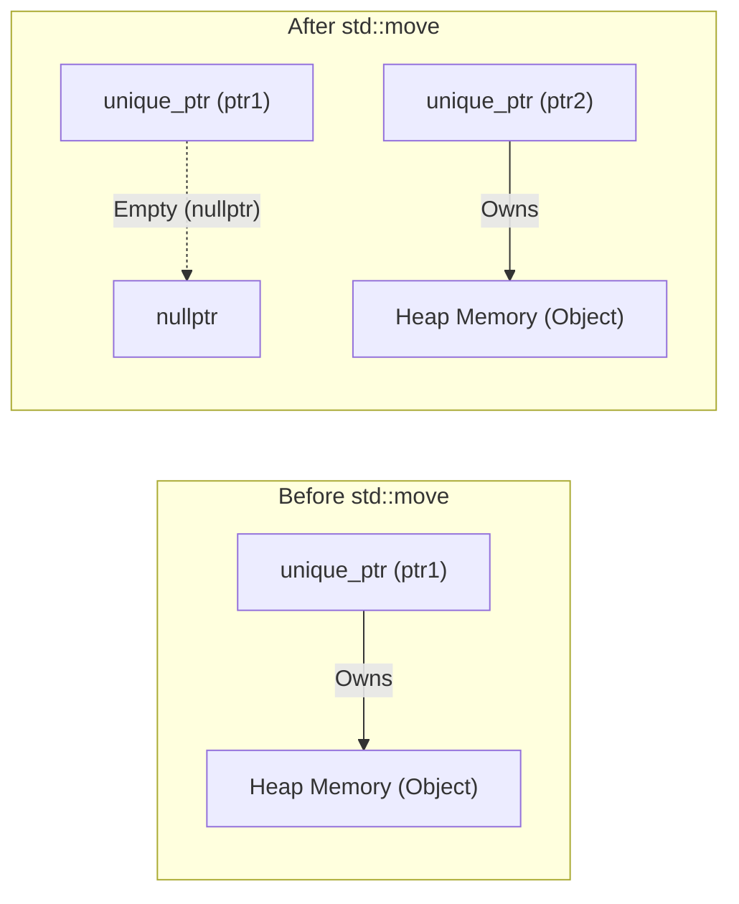
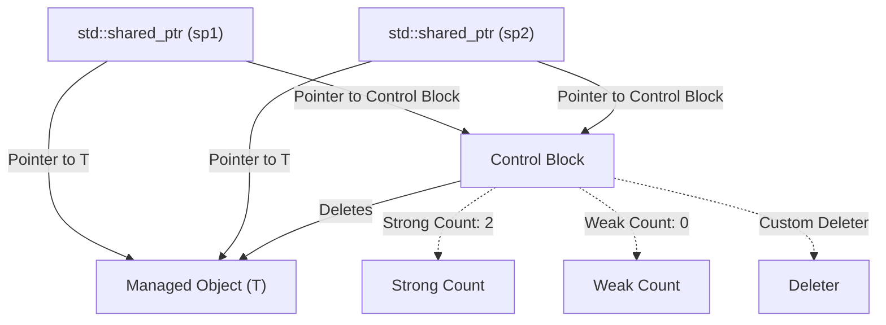
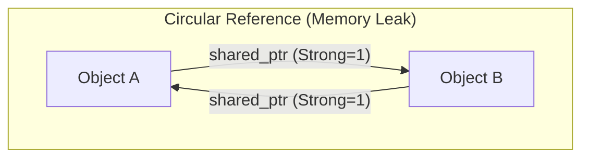
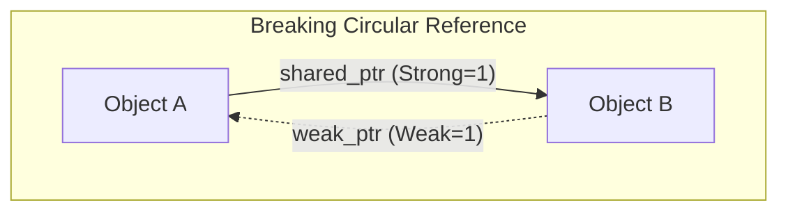

Memory management in C++ has been one of the biggest challenges for developers for many years. The traditional memory management style relying on manual `new` and `delete` has been a hotbed for serious bugs such as memory leaks, dangling pointers, and double frees. However, with the advent of Modern C++ (C++11 and later), the situation has changed dramatically. At the core of this change are "Smart Pointers".

In this article, we will provide an extremely detailed explanation of the mechanisms and advanced usage of `std::unique_ptr`, `std::shared_ptr`, and `std::weak_ptr`—powerful tools for eradicating memory leaks and achieving safe and efficient resource management. We will cover their internal implementation (control blocks and atomic operations), performance impact, and the mathematical formulation of reference counting.

## 1. Introduction: The Dark Age of C++ Memory Management and the Dawn of Modern C++

In past C++ development, developers themselves were responsible for freeing memory allocated on the heap.

```cpp
void legacy_function() {
    int* ptr = new int(10);
    // ... some processing ...
    if (some_condition) {
        return; // Memory leak! delete is not called
    }
    delete ptr;
}
```

In code like the above, if an exception occurs or an early return is executed, `delete` is skipped, resulting in a memory leak. The paradigm to prevent this is "RAII (Resource Acquisition Is Initialization)". RAII is a technique that ties resource allocation to object initialization (constructor) and resource deallocation to object destruction (destructor). Smart pointers are a class stack in the standard library that applies this RAII idiom to memory management.

## 2. `std::unique_ptr`: Zero-Overhead Exclusive Ownership

`std::unique_ptr` is a smart pointer that has "Exclusive Ownership" over a dynamically allocated object. There can always be only one `unique_ptr` that owns a given resource.

### 2.1 The Principle of Zero Overhead

The biggest appeal of `std::unique_ptr` is its performance. In its default state without a custom deleter, the size of a `std::unique_ptr` is exactly the same as a raw pointer. It has no unnecessary member variables and uses no virtual functions. Through compiler optimization, access via `std::unique_ptr` expands to assembly code equivalent to that of a raw pointer.

### 2.2 Transferring Ownership and `std::move`

Because it has exclusive ownership, a `std::unique_ptr` cannot be copied (its copy constructor and copy assignment operator are `delete`d). To transfer ownership to another `unique_ptr`, you must use `std::move` to utilize Move Semantics.

```cpp
#include <iostream>
#include <memory>

class Resource {
public:
    Resource() { std::cout << "Resource acquired\n"; }
    ~Resource() { std::cout << "Resource destroyed\n"; }
    void do_something() { std::cout << "Doing something\n"; }
};

void process_resource(std::unique_ptr<Resource> ptr) {
    ptr->do_something();
    // When leaving scope, ptr is destroyed and Resource is also freed
}

int main() {
    std::unique_ptr<Resource> my_ptr = std::make_unique<Resource>();
    
    // process_resource(my_ptr); // Error: cannot copy
    process_resource(std::move(my_ptr)); // Transfer ownership
    
    if (!my_ptr) {
        std::cout << "my_ptr is now empty.\n";
    }
    return 0;
}
```

The Mermaid diagram below illustrates the concept of transferring ownership using `std::move`.



### 2.3 Implementing Custom Deleters

When wrapping legacy C APIs (such as `FILE*` or sockets), you need to call a function other than `delete` (such as `fclose`) to free memory. `std::unique_ptr` allows you to specify a custom deleter as its second template argument.

```cpp
#include <cstdio>
#include <memory>

// Functor for custom deleter
struct FileDeleter {
    void operator()(FILE* fp) const {
        if (fp) {
            std::cout << "Closing file.\n";
            std::fclose(fp);
        }
    }
};

using UniqueFile = std::unique_ptr<FILE, FileDeleter>;

int main() {
    UniqueFile file(std::fopen("test.txt", "w"));
    if (file) {
        std::fputs("Hello, Smart Pointers!", file.get());
    }
    // FileDeleter is called and fclose is executed at the end of the scope
    return 0;
}
```

Using a function pointer or a lambda expression as a custom deleter may increase the size of the `unique_ptr`. However, if you use a stateless function object (Functor) as shown above, C++'s **EBCO (Empty Base Class Optimization)** or C++20's `[[no_unique_address]]` ensures the size does not increase compared to a raw pointer (maintaining zero overhead).

## 3. `std::shared_ptr`: Shared Ownership and the Control Block

`std::shared_ptr` is a smart pointer for multiple pointers to share ownership of the same object. When the last `shared_ptr` is destroyed, the managed object is freed.

### 3.1 Internal Architecture: Control Block

Apart from the pointer to the managed object, `std::shared_ptr` allocates and shares metadata called a **Control Block** on the heap. The control block contains the following information:

1.  **Strong Count**: The number of `shared_ptr`s that own the object. When this reaches 0, the object is destroyed.
2.  **Weak Count**: The number of `weak_ptr`s monitoring the object. When both the Strong Count and Weak Count reach 0, the control block itself is freed.
3.  **Custom Deleter and Allocator** (if specified).



Because of this, the size of a `std::shared_ptr` object itself is usually twice that of a raw pointer (a pointer to the object and a pointer to the control block).

### 3.2 Performance and Atomic Operations

The reference counts within the control block are implemented as **Atomic Operations** so they can safely increase and decrease even in multi-threaded environments.

On x86/x64 architectures, atomic instructions like `lock xadd` are used to increment and decrement reference counts. This carries an overhead of several dozen cycles compared to normal integer addition. Therefore, if you pass a `shared_ptr` to a function by value, atomic increments and decrements occur with each copy, degrading performance.

**Best Practice**: When passing a `shared_ptr` to a function, unless you need to share ownership, you should pass it as `const std::shared_ptr<T>&` (const reference) or pass a raw pointer/reference.

### 3.3 `std::make_shared` vs `new`

When creating a `shared_ptr`, you should use `std::make_shared` whenever possible. There are two major reasons for this.

1.  **Memory Allocation Optimization**:
    Using `new` results in two heap allocations: one for the object itself and one for the control block. Using `std::make_shared` allows you to secure a single large memory block containing both in one heap allocation, which also improves cache efficiency.
2.  **Exception Safety**:
    In standards prior to C++17, the evaluation order of function arguments was unspecified, so if an exception occurred during the evaluation of other arguments before passing the pointer allocated by `new` to the `shared_ptr` constructor, there was a risk of a memory leak. `make_shared` completely avoids this problem.

```cpp
// Bad practice (2 memory allocations)
std::shared_ptr<MyClass> ptr1(new MyClass());

// Recommended practice (1 memory allocation)
std::shared_ptr<MyClass> ptr2 = std::make_shared<MyClass>();
```

## 4. `std::weak_ptr`: Resolving and Monitoring Circular References

Shared ownership has a fatal weakness called "Circular References". If Object A and Object B point to each other with `shared_ptr`s, their respective Strong Counts are maintained at a minimum of 1 and will never reach 0 until the program terminates, resulting in a memory leak.



### 4.1 Breaking Cycles with `std::weak_ptr`

`std::weak_ptr` solves this problem. A `weak_ptr` is created from a `shared_ptr` and references the object, but **it does not increase the Strong Count**. Instead, it increases the Weak Count. This allows you to "monitor" an object without possessing ownership.



### 4.2 Safe Access Using the `lock()` Method

A `weak_ptr` does not have operators (`->` or `*`) to access the object directly. This is because the target object might have already been destroyed. To access it safely, call the `lock()` method to temporarily obtain a `shared_ptr`.

```cpp
#include <iostream>
#include <memory>

class Node {
public:
    std::string name;
    std::shared_ptr<Node> next;
    std::weak_ptr<Node> prev; // Use weak_ptr to prevent circular references

    Node(const std::string& n) : name(n) { std::cout << "Created " << name << "\n"; }
    ~Node() { std::cout << "Destroyed " << name << "\n"; }
};

int main() {
    auto nodeA = std::make_shared<Node>("A");
    auto nodeB = std::make_shared<Node>("B");

    nodeA->next = nodeB;
    nodeB->prev = nodeA;

    // Get a shared_ptr from weak_ptr to access it
    if (auto locked_prev = nodeB->prev.lock()) {
        std::cout << "Node B's prev is " << locked_prev->name << "\n";
    } else {
        std::cout << "Node B's prev is already destroyed.\n";
    }

    return 0; // nodeA and nodeB are properly destroyed
}
```

## 5. Constraints of Shared Ownership in Multi-Threaded Environments

The thread safety of `shared_ptr` is often misunderstood. "Updating the reference count within the control block is thread-safe", but "reading and writing the `shared_ptr` object itself is not thread-safe".

-   **Safe Operations**: Multiple threads reading and writing *their own respective* `shared_ptr` instances (even though they share the same control block).
-   **Data Race (Dangerous)**: Multiple threads simultaneously reading and writing the *exact same* `shared_ptr` instance.

If you need to share the same instance across multiple threads, you must use `std::atomic<std::shared_ptr<T>>` (C++20) or protect it with a mutex (`std::mutex`).

## 6. Mathematical Formulation of Reference Counting

Expressing the lifecycle state transitions in the control block mathematically yields the following.
Let the Strong Count at time $t$ be $S(t)$ and the Weak Count be $W(t)$.

Initial state (immediately after `make_shared`):
$$ S(0) = 1, \quad W(0) = 0 $$

When a copy (duplication of `shared_ptr`) occurs:
$$ S(t_{next}) = S(t) + 1 $$

Condition for the Managed Object to be destroyed:
$$ \lim_{t \to t_d} S(t) = 0 $$

Condition for the Control Block itself to be freed from memory:
$$ S(t) = 0 \quad \land \quad W(t) = 0 $$
In other words,
$$ S(t) + W(t) = 0 $$

As these formulas show, as long as a `weak_ptr` continues to exist ($W(t) > 0$), the small memory space for the control block will remain allocated even if the managed object has been destroyed. This is the only drawback of `make_shared` (because the managed object's memory and the control block are unified, if a weak reference remains, the large memory space for the managed object is also not returned to the system). However, usually, the performance advantages of `make_shared` overwhelmingly outweigh this.

## 7. Conclusion

Memory management in Modern C++ is no longer about managing `new`/`delete` manually.

1.  Always use **`std::unique_ptr`** by default, taking advantage of zero overhead while incorporating clear ownership into your design.
2.  Use **`std::shared_ptr`** only when you truly need to share lifecycle ownership among multiple owners, and use `std::make_shared` to create it.
3.  For implementing data structures or observer patterns where rings of sharing (circular references) may occur, utilize **`std::weak_ptr`** to proactively prevent memory leaks.

By deeply understanding smart pointers and using them in the right places, it is possible to build safe and robust software architectures without sacrificing C++'s performance in any way.
