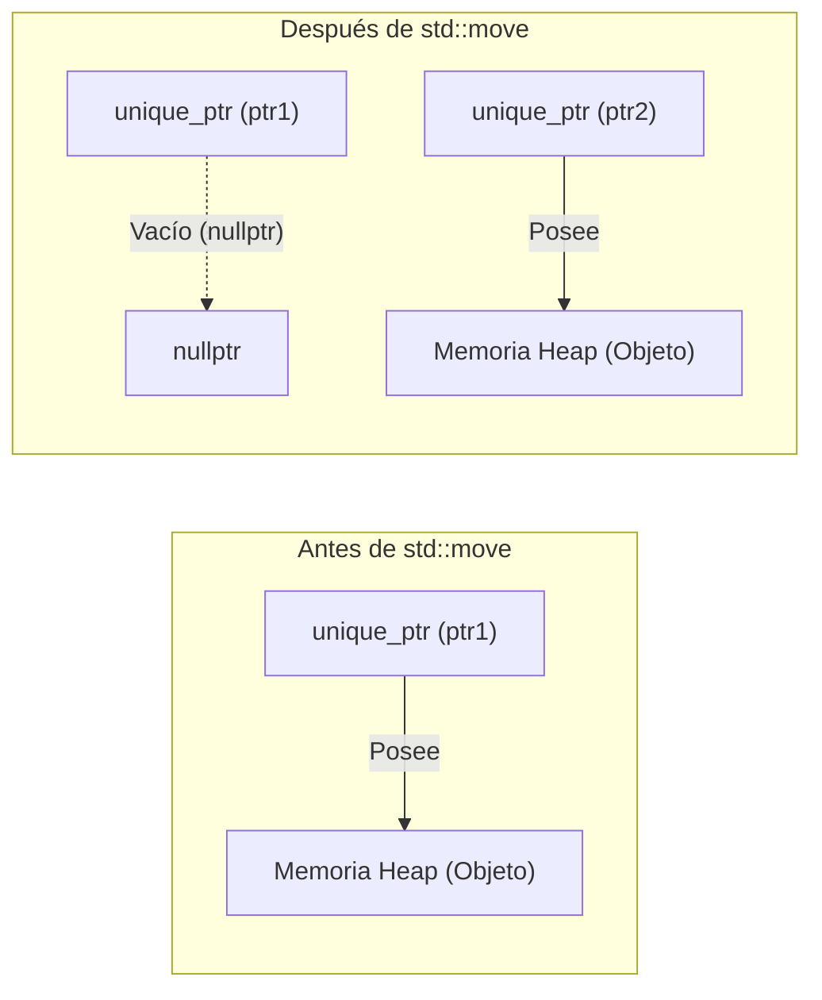
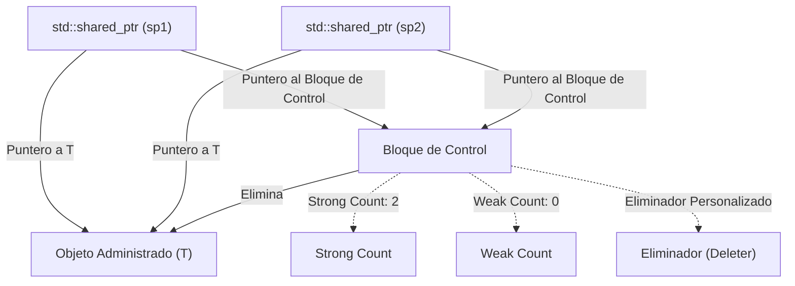
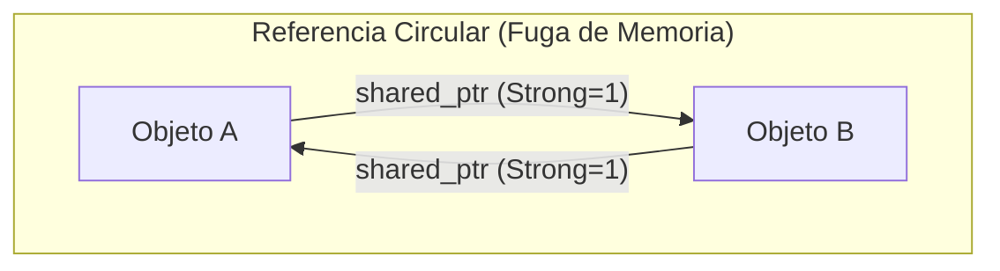
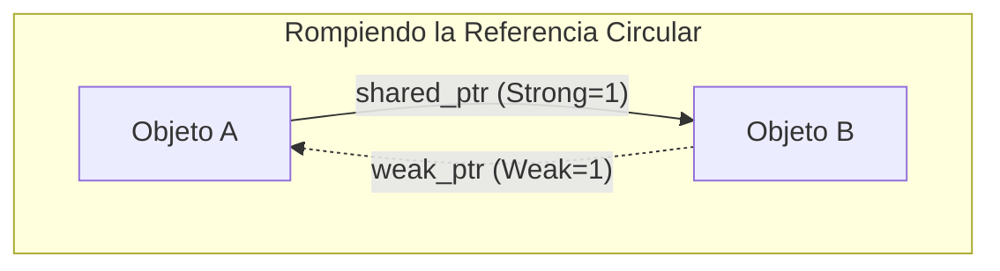

La gestión de memoria en C++ ha sido uno de los mayores desafíos para los desarrolladores durante muchos años. El estilo tradicional de gestión de memoria, que depende del uso manual de `new` y `delete`, era un caldo de cultivo para errores graves como fugas de memoria (memory leaks), punteros colgantes (dangling pointers) y dobles liberaciones. Sin embargo, con la llegada de Modern C++ (C++11 y posteriores), la situación ha cambiado drásticamente. El núcleo de este cambio son los "punteros inteligentes" (Smart Pointers).

En este artículo, explicaremos con extremo detalle el funcionamiento y las técnicas avanzadas de uso de `std::unique_ptr`, `std::shared_ptr` y `std::weak_ptr`, que son herramientas poderosas para erradicar las fugas de memoria y lograr una gestión de recursos segura y eficiente. Abordaremos su implementación interna (bloques de control y operaciones atómicas), su impacto en el rendimiento y la formulación matemática del conteo de referencias.

## 1. Introducción: La era oscura de la gestión de memoria en C++ y el amanecer de Modern C++

En el desarrollo tradicional de C++, la memoria asignada en el heap debía ser liberada bajo la propia responsabilidad del desarrollador.

```cpp
void legacy_function() {
    int* ptr = new int(10);
    // ... algún proceso ...
    if (some_condition) {
        return; // ¡Fuga de memoria! no se llama a delete
    }
    delete ptr;
}
```

En el código anterior, si ocurre una excepción o se realiza un retorno anticipado (early return), se omite el `delete`, provocando una fuga de memoria. El paradigma para evitar esto es "RAII (Resource Acquisition Is Initialization)". RAII es una técnica que vincula la adquisición de recursos a la inicialización de un objeto (constructor) y la liberación de recursos a la destrucción del objeto (destructor). Los punteros inteligentes son un conjunto de clases de la biblioteca estándar que aplican este modismo RAII a la gestión de memoria.

## 2. `std::unique_ptr`: Propiedad exclusiva sin sobrecarga (zero-overhead)

`std::unique_ptr` es un puntero inteligente que tiene "propiedad exclusiva" (Exclusive Ownership) sobre un objeto asignado dinámicamente. Solo puede haber un único `unique_ptr` que posea un recurso determinado en un momento dado.

### 2.1 El principio de cero sobrecarga

El mayor atractivo de `std::unique_ptr` es su rendimiento. En su estado predeterminado, sin un eliminador (deleter) personalizado, el tamaño de `std::unique_ptr` es exactamente el mismo que el de un puntero crudo (Raw Pointer). No tiene variables miembro innecesarias y no utiliza funciones virtuales. Gracias a la optimización del compilador, el acceso a través de un `std::unique_ptr` se expande a un código ensamblador equivalente al de un puntero crudo.

### 2.2 Transferencia de propiedad y `std::move`

Dado que posee propiedad exclusiva, `std::unique_ptr` no se puede copiar (el constructor de copia y el operador de asignación de copia están marcados como `delete`). Para transferir la propiedad a otro `unique_ptr`, se utiliza `std::move` para aprovechar la semántica de movimiento (Move Semantics).

```cpp
#include <iostream>
#include <memory>

class Resource {
public:
    Resource() { std::cout << "Resource acquired\n"; }
    ~Resource() { std::cout << "Resource destroyed\n"; }
    void do_something() { std::cout << "Doing something\n"; }
};

void process_resource(std::unique_ptr<Resource> ptr) {
    ptr->do_something();
    // Al salir del alcance, ptr se destruye y Resource también se libera
}

int main() {
    std::unique_ptr<Resource> my_ptr = std::make_unique<Resource>();
    
    // process_resource(my_ptr); // Error: no se puede copiar
    process_resource(std::move(my_ptr)); // Transferencia de propiedad
    
    if (!my_ptr) {
        std::cout << "my_ptr is now empty.\n";
    }
    return 0;
}
```

El siguiente diagrama de Mermaid ilustra el concepto de transferencia de propiedad mediante `std::move`.



### 2.3 Implementación de un eliminador personalizado (custom deleter)

Al encapsular APIs heredadas de C (por ejemplo, `FILE*` o sockets), es necesario llamar a funciones distintas de `delete` (como `fclose`) para liberar los recursos. `std::unique_ptr` permite especificar un eliminador personalizado (custom deleter) en su segundo argumento de plantilla.

```cpp
#include <cstdio>
#include <memory>

// Functor para el eliminador personalizado
struct FileDeleter {
    void operator()(FILE* fp) const {
        if (fp) {
            std::cout << "Closing file.\n";
            std::fclose(fp);
        }
    }
};

using UniqueFile = std::unique_ptr<FILE, FileDeleter>;

int main() {
    UniqueFile file(std::fopen("test.txt", "w"));
    if (file) {
        std::fputs("Hello, Smart Pointers!", file.get());
    }
    // Al finalizar el alcance, se llama a FileDeleter y se ejecuta fclose
    return 0;
}
```

Si se utilizan punteros a funciones o expresiones lambda como eliminadores personalizados, el tamaño de `unique_ptr` podría aumentar. Sin embargo, al usar un objeto de función (Functor) sin estado, como en el ejemplo anterior, el tamaño no aumenta respecto al de un puntero crudo gracias a la **EBCO (Empty Base Class Optimization)** de C++ o a `[[no_unique_address]]` de C++20 (se mantiene el cero sobrecarga).

## 3. `std::shared_ptr`: Propiedad compartida y bloques de control

`std::shared_ptr` es un puntero inteligente que permite que múltiples punteros compartan la propiedad de un mismo objeto. El objeto administrado se libera cuando se destruye el último `shared_ptr`.

### 3.1 Arquitectura interna: El bloque de control

`std::shared_ptr` comparte metadatos asignados en el heap llamados **Bloque de control (Control Block)**, separados del puntero al objeto administrado. El bloque de control contiene la siguiente información:

1.  **Strong Count (Conteo de referencias fuertes)**: La cantidad de `shared_ptr` que poseen el objeto. Cuando llega a 0, el objeto se destruye.
2.  **Weak Count (Conteo de referencias débiles)**: La cantidad de `weak_ptr` que observan el objeto. Cuando tanto el Strong Count como el Weak Count llegan a 0, se libera el propio bloque de control.
3.  **Eliminador personalizado y asignador** (si se especifican).



Debido a esto, el tamaño del propio objeto `std::shared_ptr` suele ser el doble del de un puntero crudo (un puntero al objeto y un puntero al bloque de control).

### 3.2 Rendimiento y operaciones atómicas

El conteo de referencias dentro del bloque de control está implementado con **operaciones atómicas (Atomic Operations)** para que pueda incrementarse o decrementarse de manera segura incluso en entornos multihilo.

En las arquitecturas x86/x64, se utilizan instrucciones atómicas como `lock xadd` para incrementar y decrementar el conteo de referencias. Esto implica una sobrecarga de docenas de ciclos en comparación con una suma de enteros normal. Por lo tanto, si se pasa un `shared_ptr` a una función por valor, se producirán incrementos y decrementos atómicos en cada copia, lo que degradará el rendimiento.

**Mejor práctica**: Al pasar un `shared_ptr` a una función, a menos que sea necesario compartir la propiedad, se debe pasar como `const std::shared_ptr<T>&` (referencia const) o bien pasar un puntero/referencia crudos.

### 3.3 `std::make_shared` vs `new`

Al crear un `shared_ptr`, se debe utilizar `std::make_shared` siempre que sea posible. Hay dos razones cruciales para ello.

1.  **Optimización de asignación de memoria**:
    Si se usa `new`, ocurren dos asignaciones en el heap: una para el objeto en sí y otra para el bloque de control. Con `std::make_shared`, se puede asignar un único bloque de memoria grande que incluye ambos en una sola asignación en el heap, lo que también mejora la eficiencia de la caché.
2.  **Seguridad contra excepciones**:
    En los estándares anteriores a C++17, el orden de evaluación de los argumentos de una función no estaba especificado. Por lo tanto, si ocurría una excepción al evaluar otros argumentos antes de pasar el puntero asignado con `new` al constructor de `shared_ptr`, existía el riesgo de una fuga de memoria. `make_shared` evita completamente este problema.

```cpp
// Práctica a evitar (2 asignaciones de memoria)
std::shared_ptr<MyClass> ptr1(new MyClass());

// Práctica recomendada (1 asignación de memoria)
std::shared_ptr<MyClass> ptr2 = std::make_shared<MyClass>();
```

## 4. `std::weak_ptr`: Resolución de referencias circulares y observación

La propiedad compartida tiene una debilidad fatal conocida como "referencias circulares" (Circular References). Si el Objeto A y el Objeto B se apuntan mutuamente con un `shared_ptr`, el Strong Count de cada uno se mantendrá como mínimo en 1 y nunca llegará a 0 hasta que termine el programa, provocando una fuga de memoria.



### 4.1 Rompiendo el ciclo con `std::weak_ptr`

`std::weak_ptr` resuelve este problema. Se crea a partir de un `shared_ptr` y hace referencia al objeto, pero **no incrementa el Strong Count**. En su lugar, incrementa el Weak Count. Esto permite "observar" el objeto sin poseerlo.



### 4.2 Acceso seguro mediante el método `lock()`

`weak_ptr` no tiene operadores (`->` o `*`) para acceder directamente al objeto, ya que el objeto destino podría haber sido destruido. Para acceder de forma segura, se debe llamar al método `lock()`, el cual obtiene temporalmente un `shared_ptr`.

```cpp
#include <iostream>
#include <memory>

class Node {
public:
    std::string name;
    std::shared_ptr<Node> next;
    std::weak_ptr<Node> prev; // Se usa weak_ptr para evitar la referencia circular

    Node(const std::string& n) : name(n) { std::cout << "Created " << name << "\n"; }
    ~Node() { std::cout << "Destroyed " << name << "\n"; }
};

int main() {
    auto nodeA = std::make_shared<Node>("A");
    auto nodeB = std::make_shared<Node>("B");

    nodeA->next = nodeB;
    nodeB->prev = nodeA;

    // Obtener un shared_ptr a partir de un weak_ptr para acceder
    if (auto locked_prev = nodeB->prev.lock()) {
        std::cout << "Node B's prev is " << locked_prev->name << "\n";
    } else {
        std::cout << "Node B's prev is already destroyed.\n";
    }

    return 0; // nodeA y nodeB se destruyen adecuadamente
}
```

## 5. Restricciones de la propiedad compartida en entornos multihilo

La seguridad de hilos (thread-safety) de `shared_ptr` suele malinterpretarse. Si bien "la actualización del conteo de referencias en el bloque de control es segura para hilos (thread-safe)", "la lectura y escritura del propio objeto `shared_ptr` no lo es".

- **Operación segura**: Que múltiples hilos lean y escriban en *sus propias* instancias de `shared_ptr` (aunque compartan el mismo bloque de control).
- **Condición de carrera (Peligro)**: Que múltiples hilos lean y escriban en la *misma* instancia de `shared_ptr` al mismo tiempo.

Si es necesario compartir la misma instancia entre múltiples hilos, se debe utilizar `std::atomic<std::shared_ptr<T>>` (C++20) o protegerla con un mutex (`std::mutex`).

## 6. Formulación matemática del conteo de referencias

La transición de estados del ciclo de vida en el bloque de control se puede expresar matemáticamente de la siguiente manera.
Sea $S(t)$ el Strong Count y $W(t)$ el Weak Count en el instante $t$.

Estado inicial (inmediatamente después de `make_shared`):
$$ S(0) = 1, \quad W(0) = 0 $$

Cuando ocurre una copia (duplicación del `shared_ptr`):
$$ S(t_{next}) = S(t) + 1 $$

Condición para que el Objeto Administrado (Managed Object) sea destruido:
$$ \lim_{t \to t_d} S(t) = 0 $$

Condición para que el propio Bloque de Control (Control Block) sea liberado de la memoria:
$$ S(t) = 0 \quad \land \quad W(t) = 0 $$
Es decir,
$$ S(t) + W(t) = 0 $$

Como muestra esta fórmula, mientras siga existiendo un `weak_ptr` ($W(t) > 0$), el pequeño espacio de memoria para el bloque de control permanecerá asignado incluso si el objeto administrado ha sido destruido. Esta puede ser la única desventaja de `make_shared` en algunos casos (dado que la memoria del objeto administrado y la del bloque de control están unificadas, si quedan referencias débiles, el espacio grande de memoria del objeto administrado tampoco se devuelve al sistema). Sin embargo, normalmente las ventajas de rendimiento de `make_shared` superan esto de forma abrumadora.

## 7. Conclusión

La gestión de memoria en Modern C++ ya no se encuentra en la era de administrar manualmente `new`/`delete`.

1.  De forma predeterminada, utiliza siempre **`std::unique_ptr`** para incorporar una propiedad clara en el diseño mientras te beneficias del cero sobrecarga.
2.  Utiliza **`std::shared_ptr`** únicamente cuando realmente necesites compartir el ciclo de vida entre múltiples propietarios, y emplea `std::make_shared` para su creación.
3.  Aprovecha **`std::weak_ptr`** para prevenir fugas de memoria en la implementación de patrones de observador o en estructuras de datos donde puedan ocurrir ciclos compartidos (referencias circulares).

Al comprender profundamente los punteros inteligentes y aplicarlos en el contexto adecuado, es posible construir una arquitectura de software segura y robusta sin sacrificar en absoluto el rendimiento de C++.
