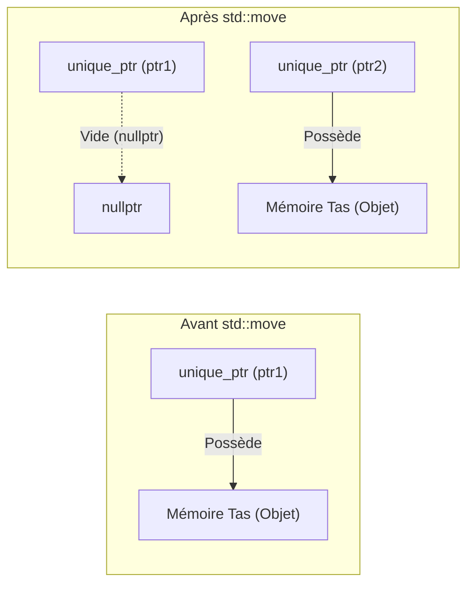
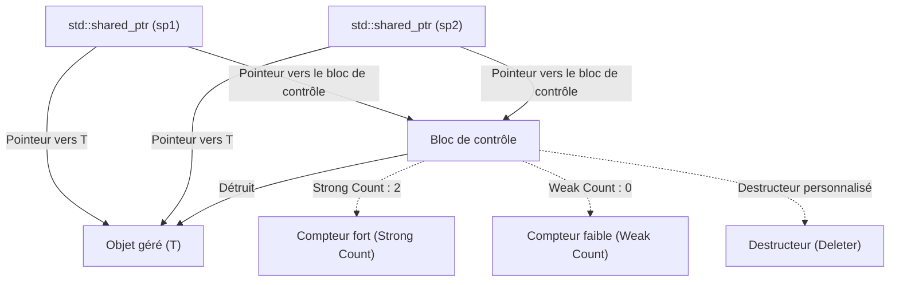
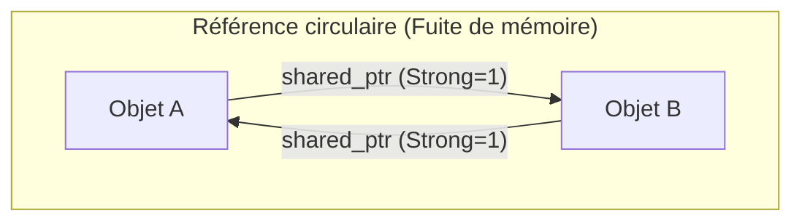
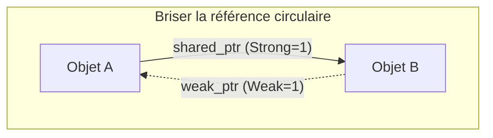

La gestion de la mémoire en C++ a longtemps été l'un des plus grands défis pour les développeurs. Le style traditionnel de gestion de la mémoire, qui repose sur l'utilisation manuelle de `new` et `delete`, a été un terrain propice pour des bugs graves tels que les fuites de mémoire, les pointeurs sauvages (dangling pointers) et les doubles libérations. Cependant, avec l'avènement du C++ moderne (depuis C++11), la situation a radicalement changé. Au cœur de cette évolution se trouvent les "pointeurs intelligents" (Smart Pointers).

Dans cet article, nous allons expliquer de manière très détaillée le fonctionnement et l'utilisation avancée de `std::unique_ptr`, `std::shared_ptr` et `std::weak_ptr`. Ce sont des outils puissants pour éradiquer les fuites de mémoire et réaliser une gestion sûre et efficace des ressources. Nous aborderons leur implémentation interne (blocs de contrôle et opérations atomiques), leur impact sur les performances, ainsi que la formulation mathématique du comptage de références.

## 1. Introduction : L'âge sombre de la gestion de la mémoire en C++ et l'aube du C++ moderne

Auparavant, dans le développement C++, c'était au développeur de prendre la responsabilité de libérer la mémoire allouée sur le tas (heap).

```cpp
void legacy_function() {
    int* ptr = new int(10);
    // ... un certain traitement ...
    if (some_condition) {
        return; // Fuite de mémoire ! delete n'est pas appelé
    }
    delete ptr;
}
```

Dans un code comme celui ci-dessus, si une exception se produit ou si un retour anticipé est effectué, `delete` est ignoré, ce qui entraîne une fuite de mémoire. Le paradigme permettant d'éviter cela est appelé "RAII" (Resource Acquisition Is Initialization). Le RAII est une technique qui lie l'acquisition d'une ressource à l'initialisation d'un objet (constructeur), et la libération de la ressource à la destruction de l'objet (destructeur). Les pointeurs intelligents sont une pile de classes de la bibliothèque standard qui appliquent cet idiome RAII à la gestion de la mémoire.

## 2. `std::unique_ptr` : La propriété exclusive avec zéro surcoût

`std::unique_ptr` est un pointeur intelligent qui possède une "propriété exclusive" (Exclusive Ownership) sur un objet alloué dynamiquement. Il ne peut y avoir qu'un seul `unique_ptr` possédant une ressource donnée à la fois.

### 2.1 Le principe du zéro surcoût

Le plus grand atout de `std::unique_ptr` est sa performance. Dans son état par défaut (sans destructeur personnalisé), la taille de `std::unique_ptr` est exactement la même que celle d'un pointeur brut (Raw Pointer). Il ne possède aucune variable membre inutile et n'utilise pas de fonctions virtuelles. Grâce à l'optimisation du compilateur, l'accès via `std::unique_ptr` se déploie en code assembleur équivalent à celui d'un pointeur brut.

### 2.2 Transfert de propriété et `std::move`

Puisqu'il détient une propriété exclusive, un `std::unique_ptr` ne peut pas être copié (le constructeur de copie et l'opérateur d'affectation par copie ont été supprimés avec `delete`). Pour transférer la propriété à un autre `unique_ptr`, vous devez utiliser la sémantique de déplacement (Move Semantics) via `std::move`.

```cpp
#include <iostream>
#include <memory>

class Resource {
public:
    Resource() { std::cout << "Resource acquired\n"; }
    ~Resource() { std::cout << "Resource destroyed\n"; }
    void do_something() { std::cout << "Doing something\n"; }
};

void process_resource(std::unique_ptr<Resource> ptr) {
    ptr->do_something();
    // En sortant de la portée, ptr est détruit et Resource est également libérée
}

int main() {
    std::unique_ptr<Resource> my_ptr = std::make_unique<Resource>();
    
    // process_resource(my_ptr); // Erreur : copie interdite
    process_resource(std::move(my_ptr)); // Transfert de propriété
    
    if (!my_ptr) {
        std::cout << "my_ptr is now empty.\n";
    }
    return 0;
}
```

Le diagramme Mermaid suivant illustre le concept du transfert de propriété par `std::move`.



### 2.3 Implémentation d'un destructeur personnalisé

Lors de l'encapsulation d'API héritées du C (comme `FILE*` ou des sockets), il est nécessaire d'appeler une fonction autre que `delete` (comme `fclose`) pour libérer la mémoire. Il est possible de spécifier un destructeur personnalisé (custom deleter) comme deuxième argument de modèle (template argument) pour `std::unique_ptr`.

```cpp
#include <cstdio>
#include <memory>

// Foncteur pour le destructeur personnalisé
struct FileDeleter {
    void operator()(FILE* fp) const {
        if (fp) {
            std::cout << "Closing file.\n";
            std::fclose(fp);
        }
    }
};

using UniqueFile = std::unique_ptr<FILE, FileDeleter>;

int main() {
    UniqueFile file(std::fopen("test.txt", "w"));
    if (file) {
        std::fputs("Hello, Smart Pointers!", file.get());
    }
    // FileDeleter est appelé et fclose est exécuté à la fin de la portée
    return 0;
}
```

L'utilisation de pointeurs de fonction ou d'expressions lambda comme destructeurs personnalisés peut augmenter la taille du `unique_ptr`. Cependant, l'utilisation d'un objet fonctionnel (Functor) sans état, comme illustré ci-dessus, permet de ne pas augmenter la taille par rapport à un pointeur brut grâce à l'**EBCO (Empty Base Class Optimization)** en C++ ou à `[[no_unique_address]]` en C++20 (le zéro surcoût est ainsi maintenu).

## 3. `std::shared_ptr` : Propriété partagée et bloc de contrôle

`std::shared_ptr` est un pointeur intelligent qui permet à plusieurs pointeurs de partager la propriété du même objet. L'objet géré est libéré lorsque le dernier `shared_ptr` est détruit.

### 3.1 Architecture interne : Le bloc de contrôle

Outre le pointeur vers l'objet géré, `std::shared_ptr` alloue et partage sur le tas des métadonnées appelées **bloc de contrôle (Control Block)**. Ce bloc de contrôle contient les informations suivantes :

1.  **Strong Count (Compteur fort)** : Le nombre de `shared_ptr` qui possèdent l'objet. Lorsque ce nombre tombe à 0, l'objet est détruit.
2.  **Weak Count (Compteur faible)** : Le nombre de `weak_ptr` qui surveillent l'objet. Lorsque le Strong Count et le Weak Count tombent tous les deux à 0, le bloc de contrôle lui-même est libéré.
3.  **Destructeur personnalisé et allocateur** (s'ils sont spécifiés).



Pour cette raison, la taille de l'objet `std::shared_ptr` lui-même est généralement le double de celle d'un pointeur brut (un pointeur vers l'objet, et un pointeur vers le bloc de contrôle).

### 3.2 Performances et opérations atomiques

Les compteurs de références dans le bloc de contrôle sont implémentés en tant qu'**opérations atomiques (Atomic Operations)** afin qu'ils puissent être incrémentés et décrémentés en toute sécurité, même dans un environnement multithread.

Sur les architectures x86/x64, des instructions atomiques comme `lock xadd` sont utilisées pour modifier les compteurs de références. Cela implique un surcoût de plusieurs dizaines de cycles par rapport à une simple addition d'entiers. Par conséquent, passer un `shared_ptr` par valeur à une fonction entraîne des incrémentations et décrémentations atomiques à chaque copie, ce qui dégrade les performances.

**Bonnes pratiques** : Lorsque vous passez un `shared_ptr` à une fonction, sauf s'il est nécessaire de partager la propriété, vous devez le passer en tant que `const std::shared_ptr<T>&` (référence constante), ou bien passer un pointeur brut / une référence.

### 3.3 `std::make_shared` vs `new`

Lors de la création d'un `shared_ptr`, vous devez utiliser `std::make_shared` dans la mesure du possible. Il y a deux raisons majeures à cela :

1.  **Optimisation de l'allocation mémoire** :
    L'utilisation de `new` entraîne deux allocations sur le tas : l'allocation du corps de l'objet et l'allocation du bloc de contrôle. L'utilisation de `std::make_shared` permet d'allouer un seul grand bloc de mémoire contenant les deux en une seule allocation sur le tas, ce qui améliore également l'efficacité du cache.
2.  **Sécurité des exceptions (Exception Safety)** :
    Dans les normes antérieures à C++17, l'ordre d'évaluation des arguments d'une fonction n'était pas spécifié. Ainsi, si une exception se produisait lors de l'évaluation d'un autre argument avant que le pointeur alloué par `new` ne soit passé au constructeur du `shared_ptr`, il y avait un risque de fuite de mémoire. `make_shared` évite complètement ce problème.

```cpp
// Pratique à éviter (2 allocations mémoire)
std::shared_ptr<MyClass> ptr1(new MyClass());

// Pratique recommandée (1 allocation mémoire)
std::shared_ptr<MyClass> ptr2 = std::make_shared<MyClass>();
```

## 4. `std::weak_ptr` : Résolution des références circulaires et surveillance

La propriété partagée présente une faille critique appelée "références circulaires (Circular References)". Si un objet A et un objet B se pointent mutuellement via des `shared_ptr`, leurs Strong Counts respectifs seront maintenus au moins à 1 et ne tomberont jamais à 0 avant la fin du programme, ce qui provoquera une fuite de mémoire.



### 4.1 Briser le cycle avec `std::weak_ptr`

La solution à ce problème est `std::weak_ptr`. Un `weak_ptr` est créé à partir d'un `shared_ptr` et fait référence à un objet, mais il **n'augmente pas le Strong Count**. À la place, il augmente le Weak Count. Cela permet de "surveiller" un objet sans en prendre la propriété.



### 4.2 Accès sécurisé avec la méthode `lock()`

`weak_ptr` ne possède pas d'opérateurs pour accéder directement à l'objet (`->` ou `*`). C'est parce que l'objet cible peut avoir déjà été détruit. Pour y accéder en toute sécurité, appelez la méthode `lock()` pour obtenir temporairement un `shared_ptr`.

```cpp
#include <iostream>
#include <memory>

class Node {
public:
    std::string name;
    std::shared_ptr<Node> next;
    std::weak_ptr<Node> prev; // Utilisation de weak_ptr pour éviter la référence circulaire

    Node(const std::string& n) : name(n) { std::cout << "Created " << name << "\n"; }
    ~Node() { std::cout << "Destroyed " << name << "\n"; }
};

int main() {
    auto nodeA = std::make_shared<Node>("A");
    auto nodeB = std::make_shared<Node>("B");

    nodeA->next = nodeB;
    nodeB->prev = nodeA;

    // Obtention du shared_ptr à partir du weak_ptr pour l'accès
    if (auto locked_prev = nodeB->prev.lock()) {
        std::cout << "Node B's prev is " << locked_prev->name << "\n";
    } else {
        std::cout << "Node B's prev is already destroyed.\n";
    }

    return 0; // nodeA et nodeB sont correctement détruits
}
```

## 5. Contraintes de la propriété partagée dans un environnement multithread

La sécurité des threads (thread safety) de `shared_ptr` est souvent mal comprise. "La mise à jour des compteurs de références dans le bloc de contrôle est thread-safe", mais "la lecture et l'écriture de l'objet `shared_ptr` lui-même ne sont pas thread-safe".

- **Opération sûre** : Plusieurs threads lisant ou écrivant, *chacun sur sa propre* instance de `shared_ptr` (bien qu'ils partagent le même bloc de contrôle).
- **Course aux données (Danger)** : Plusieurs threads lisant ou écrivant simultanément sur *exactement la même* instance de `shared_ptr`.

Si une même instance doit être partagée par plusieurs threads, il faut utiliser `std::atomic<std::shared_ptr<T>>` (C++20) ou la protéger avec un mutex (`std::mutex`).

## 6. Formulation mathématique du comptage de références

Les transitions d'état du cycle de vie dans le bloc de contrôle peuvent s'exprimer mathématiquement comme suit.
Soit $S(t)$ le Strong Count et $W(t)$ le Weak Count au temps $t$.

État initial (juste après `make_shared`) :
$$ S(0) = 1, \quad W(0) = 0 $$

Lorsqu'une copie (duplication du `shared_ptr`) est effectuée :
$$ S(t_{next}) = S(t) + 1 $$

Condition de destruction de l'objet géré (Managed Object) :
$$ \lim_{t \to t_d} S(t) = 0 $$

Condition de libération en mémoire du bloc de contrôle (Control Block) lui-même :
$$ S(t) = 0 \quad \land \quad W(t) = 0 $$
C'est-à-dire :
$$ S(t) + W(t) = 0 $$

Comme le montrent ces formules, tant qu'un `weak_ptr` continue d'exister ($W(t) > 0$), l'espace mémoire restreint alloué au bloc de contrôle reste réservé même si l'objet géré a été détruit. Cela peut être considéré comme le seul inconvénient de `make_shared` dans certains cas (puisque la mémoire de l'objet géré et le bloc de contrôle sont fusionnés, si une référence faible subsiste, le grand espace mémoire alloué à l'objet géré n'est pas non plus rendu au système). Cependant, en général, les avantages en termes de performances de `make_shared` l'emportent largement.

## 7. Conclusion

La gestion de la mémoire en C++ moderne n'est plus à l'ère de l'utilisation manuelle de `new` et `delete`.

1.  Par défaut, utilisez toujours **`std::unique_ptr`** pour bénéficier de l'absence de surcoût (zéro surcoût) tout en intégrant une propriété claire dans la conception.
2.  Utilisez **`std::shared_ptr`** uniquement s'il est véritablement nécessaire de partager le cycle de vie entre plusieurs propriétaires, et utilisez `std::make_shared` pour le créer.
3.  Pour l'implémentation de structures de données ou du modèle observateur où des cycles de partage (références circulaires) peuvent se produire, utilisez **`std::weak_ptr`** pour éviter les fuites de mémoire.

En comprenant profondément les pointeurs intelligents et en les utilisant à bon escient, il est possible de construire des architectures logicielles sûres et robustes sans sacrifier la performance du C++.
