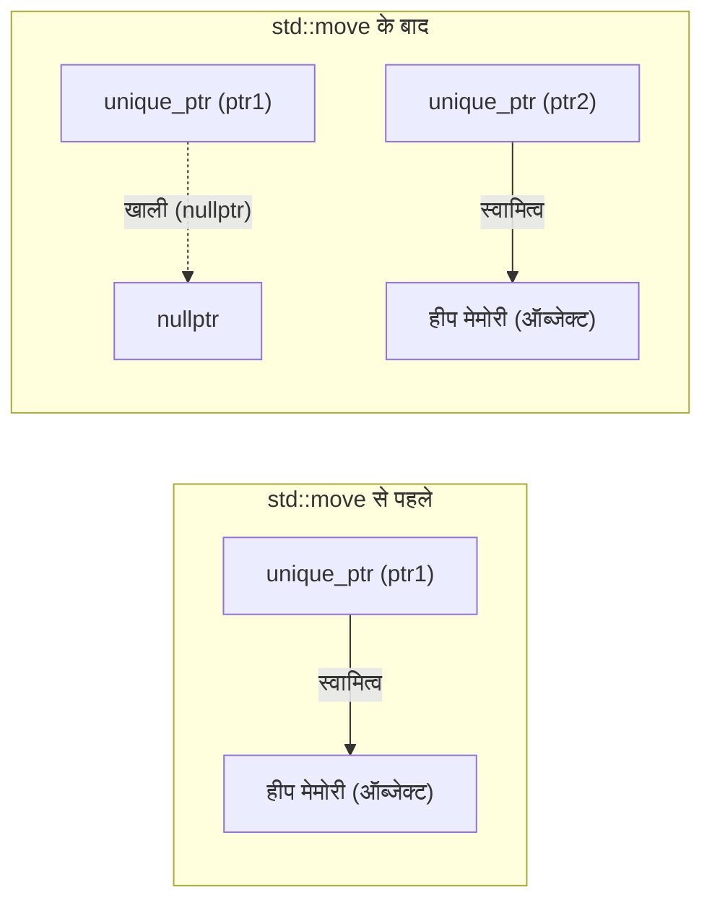
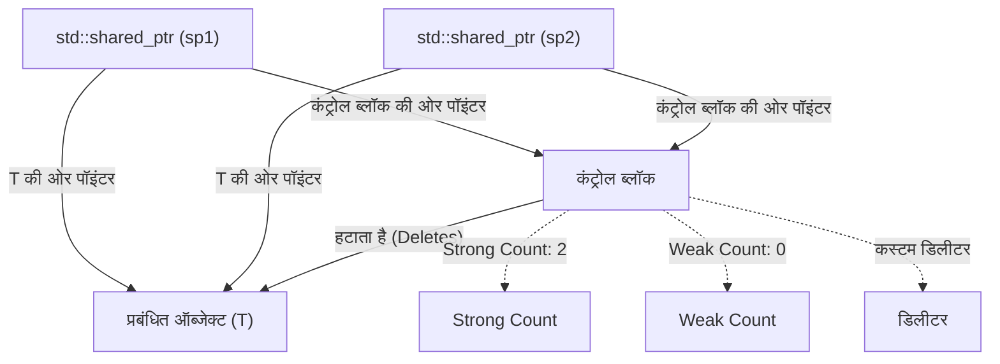
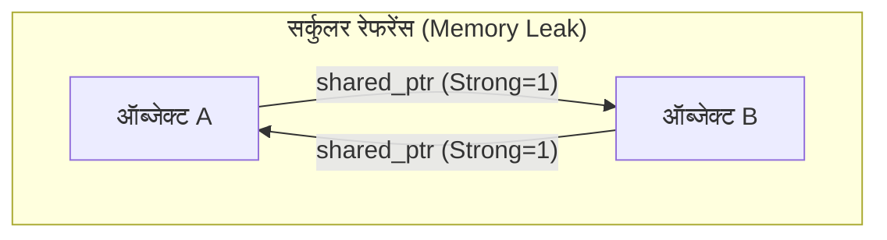
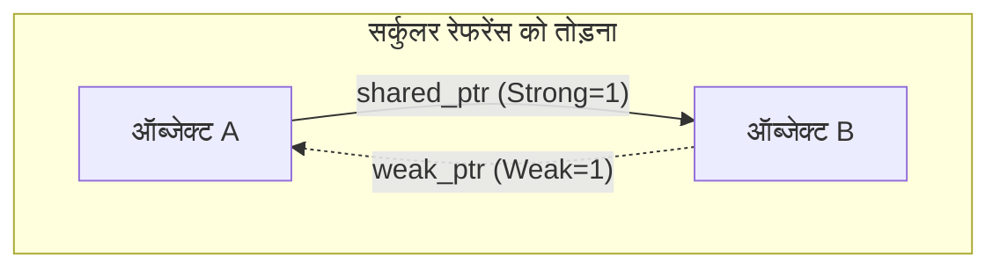

C++ में मेमोरी प्रबंधन लंबे समय से डेवलपर्स के लिए सबसे बड़ी चुनौतियों में से एक रहा है। मैन्युअल `new` और `delete` पर निर्भर पारंपरिक मेमोरी प्रबंधन शैली, मेमोरी लीक, डैंगलिंग पॉइंटर्स और डबल फ्री जैसे गंभीर बग्स का कारण बनती थी। हालाँकि, मॉडर्न C++ (C++11 और उसके बाद) के आगमन के साथ, स्थिति नाटकीय रूप से बदल गई है। इसका मुख्य केंद्र "स्मार्ट पॉइंटर्स (Smart Pointers)" है।

इस लेख में, हम मेमोरी लीक को जड़ से खत्म करने और सुरक्षित तथा कुशल संसाधन प्रबंधन प्राप्त करने के लिए शक्तिशाली उपकरणों, जैसे `std::unique_ptr`, `std::shared_ptr` और `std::weak_ptr` के तंत्र और उन्नत उपयोग तकनीकों के बारे में विस्तार से चर्चा करेंगे। इसमें आंतरिक कार्यान्वयन (कंट्रोल ब्लॉक और एटॉमिक ऑपरेशंस), प्रदर्शन पर प्रभाव, और गणितीय मॉडल का उपयोग करके संदर्भ गणना (reference counting) के सूत्रीकरण पर भी गहराई से बात की जाएगी।

## 1. परिचय: C++ मेमोरी प्रबंधन का अंधकार युग और मॉडर्न C++ की सुबह

पहले के C++ विकास में, डेवलपर्स खुद ही हीप पर आवंटित मेमोरी को मुक्त करने के लिए जिम्मेदार होते थे।

```cpp
void legacy_function() {
    int* ptr = new int(10);
    // ... कुछ प्रक्रिया ...
    if (some_condition) {
        return; // मेमोरी लीक होता है! delete कॉल नहीं किया गया
    }
    delete ptr;
}
```

ऊपर दिए गए कोड में, यदि कोई अपवाद (exception) आता है या जल्दी रिटर्न होता है, तो `delete` छोड़ दिया जाता है, जिससे मेमोरी लीक होती है। इसे रोकने के लिए इस्तेमाल होने वाला प्रतिमान "RAII (Resource Acquisition Is Initialization)" है। RAII एक ऐसी तकनीक है जो संसाधन आवंटन को ऑब्जेक्ट के इनिशियलाइज़ेशन (कंस्ट्रक्टर) से और संसाधन की मुक्ति को ऑब्जेक्ट के विनाश (डिस्ट्रक्टर) से जोड़ती है। स्मार्ट पॉइंटर्स, मेमोरी प्रबंधन में इस RAII इडियम को लागू करने वाले मानक लाइब्रेरी क्लास स्टैक हैं।

## 2. `std::unique_ptr`: शून्य ओवरहेड के साथ विशेष स्वामित्व (Exclusive Ownership)

`std::unique_ptr` एक स्मार्ट पॉइंटर है जिसका डायनामिक रूप से आवंटित ऑब्जेक्ट्स पर "विशेष स्वामित्व (Exclusive Ownership)" होता है। किसी दिए गए संसाधन का मालिक हमेशा केवल एक ही `unique_ptr` हो सकता है।

### 2.1 शून्य ओवरहेड (Zero Overhead) का सिद्धांत

`std::unique_ptr` का सबसे बड़ा आकर्षण इसका प्रदर्शन है। कस्टम डिलीटर (deleter) के बिना डिफ़ॉल्ट स्थिति में, `std::unique_ptr` का आकार कच्चे पॉइंटर (Raw Pointer) के बिल्कुल समान होता है। इसमें कोई अनावश्यक सदस्य चर (member variables) नहीं होते हैं, और वर्चुअल फ़ंक्शन का भी उपयोग नहीं किया जाता है। कंपाइलर ऑप्टिमाइज़ेशन के कारण, `std::unique_ptr` के माध्यम से एक्सेस करने पर कच्चे पॉइंटर के समान असेंबली कोड उत्पन्न होता है।

### 2.2 स्वामित्व का स्थानांतरण और `std::move`

विशेष स्वामित्व होने के कारण, `std::unique_ptr` को कॉपी नहीं किया जा सकता (कॉपी कंस्ट्रक्टर और कॉपी असाइनमेंट ऑपरेटर `delete` कर दिए गए हैं)। स्वामित्व को दूसरे `unique_ptr` में स्थानांतरित करने के लिए, `std::move` का उपयोग करके मूव सेमांटिक्स (Move Semantics) का उपयोग किया जाता है।

```cpp
#include <iostream>
#include <memory>

class Resource {
public:
    Resource() { std::cout << "Resource acquired\n"; }
    ~Resource() { std::cout << "Resource destroyed\n"; }
    void do_something() { std::cout << "Doing something\n"; }
};

void process_resource(std::unique_ptr<Resource> ptr) {
    ptr->do_something();
    // स्कोप से बाहर निकलने पर ptr नष्ट हो जाता है, और Resource भी मुक्त हो जाता है
}

int main() {
    std::unique_ptr<Resource> my_ptr = std::make_unique<Resource>();
    
    // process_resource(my_ptr); // त्रुटि: कॉपी नहीं किया जा सकता
    process_resource(std::move(my_ptr)); // स्वामित्व का स्थानांतरण
    
    if (!my_ptr) {
        std::cout << "my_ptr is now empty.\n";
    }
    return 0;
}
```

नीचे दिया गया Mermaid आरेख `std::move` का उपयोग करके स्वामित्व के स्थानांतरण की अवधारणा को दर्शाता है।



### 2.3 कस्टम डिलीटर (Custom Deleter) का कार्यान्वयन

C भाषा के लिगेसी API (जैसे `FILE*` या सॉकेट) को रैप करते समय, मेमोरी को मुक्त करने के लिए `delete` के अलावा अन्य कार्यों (जैसे `fclose`) को कॉल करना आवश्यक हो सकता है। `std::unique_ptr` के दूसरे टेम्प्लेट आर्गुमेंट के रूप में कस्टम डिलीटर निर्दिष्ट किया जा सकता है।

```cpp
#include <cstdio>
#include <memory>

// कस्टम डिलीटर के लिए फनक्टर (Functor)
struct FileDeleter {
    void operator()(FILE* fp) const {
        if (fp) {
            std::cout << "Closing file.\n";
            std::fclose(fp);
        }
    }
};

using UniqueFile = std::unique_ptr<FILE, FileDeleter>;

int main() {
    UniqueFile file(std::fopen("test.txt", "w"));
    if (file) {
        std::fputs("Hello, Smart Pointers!", file.get());
    }
    // स्कोप समाप्त होने पर FileDeleter कॉल किया जाता है और fclose हो जाता है
    return 0;
}
```

यदि कस्टम डिलीटर के रूप में फ़ंक्शन पॉइंटर या लैम्ब्डा एक्सप्रेशन का उपयोग किया जाता है, तो `unique_ptr` का आकार बढ़ सकता है, लेकिन जैसा कि ऊपर दिखाया गया है, स्टेटलेस फ़ंक्शन ऑब्जेक्ट (Functor) का उपयोग करने से C++ के **EBCO (Empty Base Class Optimization)** या C++20 के `[[no_unique_address]]` के कारण इसका आकार कच्चे पॉइंटर से अधिक नहीं बढ़ता है (शून्य ओवरहेड बना रहता है)।

## 3. `std::shared_ptr`: साझा स्वामित्व (Shared Ownership) और कंट्रोल ब्लॉक

`std::shared_ptr` एक स्मार्ट पॉइंटर है जिसका उपयोग कई पॉइंटर्स द्वारा एक ही ऑब्जेक्ट के स्वामित्व को साझा करने के लिए किया जाता है। जब अंतिम `shared_ptr` नष्ट हो जाता है, तो इसके द्वारा प्रबंधित ऑब्जेक्ट मुक्त हो जाता है।

### 3.1 आंतरिक आर्किटेक्चर: कंट्रोल ब्लॉक

`std::shared_ptr` प्रबंधित ऑब्जेक्ट के पॉइंटर के अलावा, हीप पर **कंट्रोल ब्लॉक (Control Block)** नामक मेटाडेटा आवंटित करता है और उसे साझा करता है। कंट्रोल ब्लॉक में निम्नलिखित जानकारी शामिल होती है:

1. **Strong Count (मजबूत संदर्भ गणना)**: ऑब्जेक्ट का स्वामित्व रखने वाले `shared_ptr` की संख्या। जब यह 0 हो जाता है, तो ऑब्जेक्ट नष्ट हो जाता है।
2. **Weak Count (कमजोर संदर्भ गणना)**: ऑब्जेक्ट की निगरानी करने वाले `weak_ptr` की संख्या। जब Strong Count और Weak Count दोनों 0 हो जाते हैं, तो कंट्रोल ब्लॉक स्वयं मुक्त हो जाता है।
3. **कस्टम डिलीटर और एलोकेटर** (यदि निर्दिष्ट हो)।



इस कारण से, `std::shared_ptr` ऑब्जेक्ट का आकार आमतौर पर कच्चे पॉइंटर से दोगुना (ऑब्जेक्ट की ओर पॉइंटर और कंट्रोल ब्लॉक की ओर पॉइंटर) होता है।

### 3.2 प्रदर्शन और एटॉमिक ऑपरेशंस (Atomic Operations)

कंट्रोल ब्लॉक के भीतर संदर्भ गणना (reference count) को **एटॉमिक ऑपरेशंस (Atomic Operations)** के रूप में लागू किया जाता है, ताकि मल्टीथ्रेडेड वातावरण में भी इसे सुरक्षित रूप से बढ़ाया या घटाया जा सके।

x86/x64 आर्किटेक्चर में, संदर्भ गणना को बढ़ाने या घटाने के लिए `lock xadd` जैसे एटॉमिक निर्देशों का उपयोग किया जाता है। इसमें सामान्य पूर्णांक जोड़ (integer addition) की तुलना में दर्जनों साइकिलों का ओवरहेड होता है। इसलिए, यदि `shared_ptr` को फ़ंक्शन में मान द्वारा (by value) पास किया जाता है, तो प्रत्येक कॉपी पर एटॉमिक इंक्रीमेंट और डिक्रीमेंट होता है, जिससे प्रदर्शन में कमी आती है।

**सर्वोत्तम अभ्यास (Best Practice)**: `shared_ptr` को फ़ंक्शन में पास करते समय, जब तक कि स्वामित्व साझा करना आवश्यक न हो, इसे `const std::shared_ptr<T>&` (const संदर्भ) के रूप में पास करना चाहिए, या कच्चा पॉइंटर/संदर्भ (raw pointer/reference) पास करना चाहिए।

### 3.3 `std::make_shared` vs `new`

`shared_ptr` बनाते समय, जहाँ तक संभव हो `std::make_shared` का उपयोग करना चाहिए। इसके दो प्रमुख कारण हैं:

1. **मेमोरी आवंटन का अनुकूलन**:
   `new` का उपयोग करने पर, ऑब्जेक्ट और कंट्रोल ब्लॉक के लिए हीप आवंटन (heap allocation) दो बार होता है। `std::make_shared` का उपयोग करने पर, दोनों को समाहित करने वाला एक बड़ा मेमोरी ब्लॉक एक ही हीप आवंटन में सुरक्षित किया जा सकता है, जिससे कैश दक्षता (cache efficiency) भी बढ़ती है।
2. **अपवाद सुरक्षा (Exception Safety)**:
   C++17 से पहले के मानकों में, फ़ंक्शन के तर्कों (arguments) के मूल्यांकन का क्रम अनिर्दिष्ट (unspecified) था, इसलिए `new` द्वारा आवंटित पॉइंटर को `shared_ptr` के कंस्ट्रक्टर में पास करने से पहले यदि अन्य तर्कों के मूल्यांकन के दौरान कोई अपवाद आता, तो मेमोरी लीक का जोखिम होता था। `make_shared` इस समस्या से पूरी तरह बचाता है।

```cpp
// बचने योग्य तरीका (2 बार मेमोरी आवंटन)
std::shared_ptr<MyClass> ptr1(new MyClass());

// अनुशंसित तरीका (1 बार मेमोरी आवंटन)
std::shared_ptr<MyClass> ptr2 = std::make_shared<MyClass>();
```

## 4. `std::weak_ptr`: सर्कुलर रेफरेंस (Circular References) का समाधान और निगरानी

साझा स्वामित्व की एक बड़ी कमजोरी "सर्कुलर रेफरेंस (Circular References)" है। यदि ऑब्जेक्ट A और ऑब्जेक्ट B एक-दूसरे को `shared_ptr` द्वारा इंगित कर रहे हैं, तो प्रत्येक का Strong Count कम से कम 1 पर बना रहता है, और प्रोग्राम समाप्त होने तक यह कभी 0 नहीं होता, जिससे मेमोरी लीक होती है।



### 4.1 `std::weak_ptr` द्वारा चक्र (Cycle) को तोड़ना

इस समस्या का समाधान `std::weak_ptr` है। `weak_ptr` को `shared_ptr` से बनाया जाता है और यह ऑब्जेक्ट को संदर्भित करता है, लेकिन **यह Strong Count को नहीं बढ़ाता है**। इसके बजाय, यह Weak Count को बढ़ाता है। इससे स्वामित्व के बिना ऑब्जेक्ट की "निगरानी" की जा सकती है।



### 4.2 `lock()` मेथड के माध्यम से सुरक्षित एक्सेस

`weak_ptr` के पास सीधे ऑब्जेक्ट तक पहुँचने वाले ऑपरेटर (`->` या `*`) नहीं होते हैं। ऐसा इसलिए है क्योंकि लक्षित ऑब्जेक्ट के नष्ट होने की संभावना हो सकती है। इसे सुरक्षित रूप से एक्सेस करने के लिए, `lock()` मेथड को कॉल करके अस्थायी रूप से `shared_ptr` प्राप्त किया जाता है।

```cpp
#include <iostream>
#include <memory>

class Node {
public:
    std::string name;
    std::shared_ptr<Node> next;
    std::weak_ptr<Node> prev; // सर्कुलर रेफरेंस को रोकने के लिए weak_ptr का उपयोग

    Node(const std::string& n) : name(n) { std::cout << "Created " << name << "\n"; }
    ~Node() { std::cout << "Destroyed " << name << "\n"; }
};

int main() {
    auto nodeA = std::make_shared<Node>("A");
    auto nodeB = std::make_shared<Node>("B");

    nodeA->next = nodeB;
    nodeB->prev = nodeA;

    // weak_ptr से shared_ptr प्राप्त करके एक्सेस करना
    if (auto locked_prev = nodeB->prev.lock()) {
        std::cout << "Node B's prev is " << locked_prev->name << "\n";
    } else {
        std::cout << "Node B's prev is already destroyed.\n";
    }

    return 0; // nodeA और nodeB उचित रूप से नष्ट हो जाएंगे
}
```

## 5. मल्टीथ्रेडेड वातावरण में साझा स्वामित्व की सीमाएँ

`shared_ptr` की थ्रेड-सुरक्षा (thread safety) के बारे में अक्सर गलतफहमी होती है। "कंट्रोल ब्लॉक में संदर्भ गणना (reference count) का अपडेट थ्रेड-सेफ होता है", लेकिन "`shared_ptr` ऑब्जेक्ट को स्वयं पढ़ना या लिखना थ्रेड-सेफ नहीं होता है"।

- **सुरक्षित संचालन**: कई थ्रेड्स, *अपने स्वयं के* `shared_ptr` इंस्टेंस (जो समान कंट्रोल ब्लॉक साझा करते हैं) को पढ़ते या लिखते हैं।
- **डेटा रेस (खतरा)**: कई थ्रेड्स, *बिल्कुल एक ही* `shared_ptr` इंस्टेंस पर एक साथ पढ़ते या लिखते हैं।

यदि एक ही इंस्टेंस को कई थ्रेड्स के बीच साझा करने की आवश्यकता है, तो `std::atomic<std::shared_ptr<T>>` (C++20) का उपयोग किया जाना चाहिए, या इसे म्यूटेक्स (`std::mutex`) के साथ सुरक्षित किया जाना चाहिए।

## 6. संदर्भ गणना का गणितीय सूत्रीकरण

कंट्रोल ब्लॉक में जीवनचक्र अवस्था संक्रमण (lifecycle state transition) को गणितीय रूप में निम्न प्रकार से व्यक्त किया जा सकता है:
मान लें कि समय $t$ पर Strong Count $S(t)$ है और Weak Count $W(t)$ है।

प्रारंभिक अवस्था (`make_shared` के तुरंत बाद):
$$ S(0) = 1, \quad W(0) = 0 $$

कॉपी (`shared_ptr` का प्रतिरूपण) होने पर:
$$ S(t_{next}) = S(t) + 1 $$

प्रबंधित ऑब्जेक्ट (Managed Object) के नष्ट होने की स्थिति:
$$ \lim_{t \to t_d} S(t) = 0 $$

कंट्रोल ब्लॉक (Control Block) स्वयं के मेमोरी से मुक्त होने की स्थिति:
$$ S(t) = 0 \quad \land \quad W(t) = 0 $$
अर्थात,
$$ S(t) + W(t) = 0 $$

जैसा कि यह सूत्र दर्शाता है, जब तक `weak_ptr` मौजूद है ($W(t) > 0$), प्रबंधित ऑब्जेक्ट के नष्ट होने के बाद भी कंट्रोल ब्लॉक के लिए छोटी मेमोरी स्पेस सुरक्षित रहती है। यह `make_shared` का एकमात्र नुकसान हो सकता है (चूंकि प्रबंधित ऑब्जेक्ट की मेमोरी और कंट्रोल ब्लॉक एक साथ जुड़े होते हैं, यदि कोई कमजोर संदर्भ बचा रहता है, तो प्रबंधित ऑब्जेक्ट का विशाल मेमोरी स्थान भी सिस्टम को वापस नहीं किया जाता है), लेकिन आमतौर पर `make_shared` का प्रदर्शन लाभ इन कमियों से कहीं अधिक होता है।

## 7. निष्कर्ष

मॉडर्न C++ में मेमोरी प्रबंधन अब मैन्युअल रूप से `new`/`delete` को प्रबंधित करने का युग नहीं है।

1. डिफ़ॉल्ट रूप से हमेशा **`std::unique_ptr`** का उपयोग करें, और शून्य ओवरहेड का लाभ उठाते हुए स्पष्ट स्वामित्व को डिज़ाइन में शामिल करें।
2. केवल तभी **`std::shared_ptr`** का उपयोग करें जब आपको वास्तव में कई मालिकों के बीच जीवनचक्र साझा करने की आवश्यकता हो, और इसे बनाने के लिए `std::make_shared` का उपयोग करें।
3. डेटा संरचनाओं या ऑब्जर्वर पैटर्न को लागू करने में जहां साझा करने का चक्र (सर्कुलर रेफरेंस) उत्पन्न हो सकता है, वहां मेमोरी लीक को रोकने के लिए **`std::weak_ptr`** का लाभ उठाएं।

स्मार्ट पॉइंटर्स को गहराई से समझने और उनका उचित स्थान पर उपयोग करने से, C++ के प्रदर्शन से समझौता किए बिना, सुरक्षित और मजबूत सॉफ्टवेयर आर्किटेक्चर का निर्माण संभव हो जाता है。
