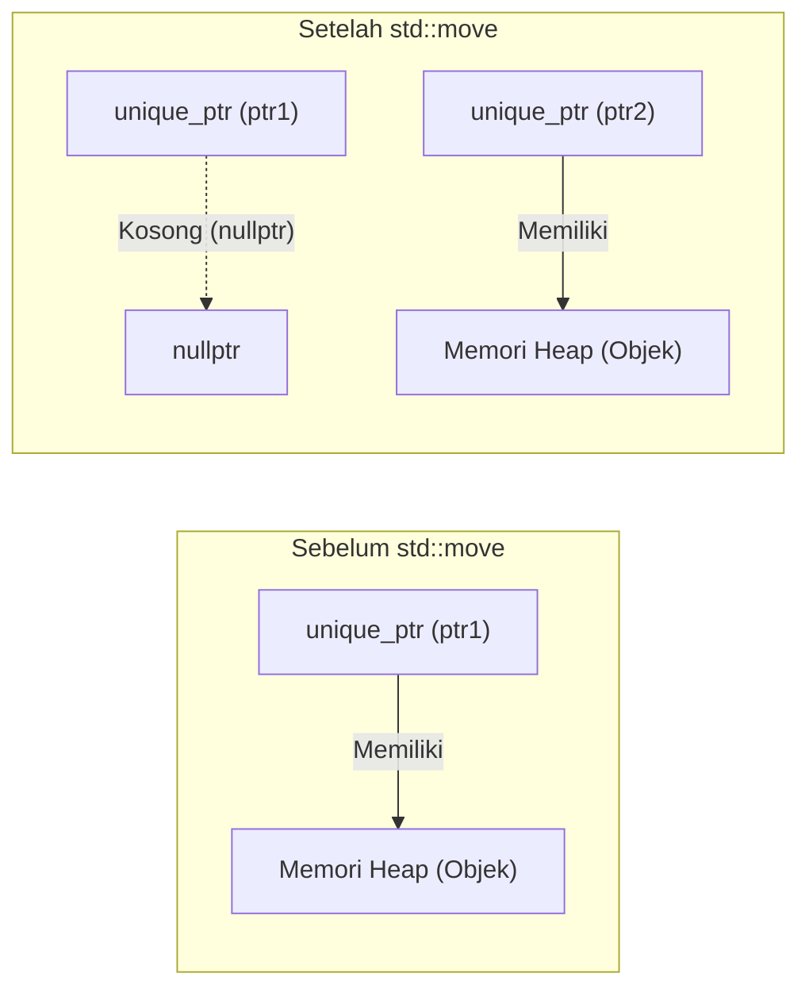
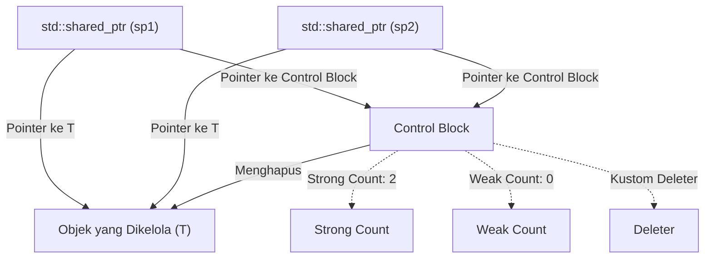
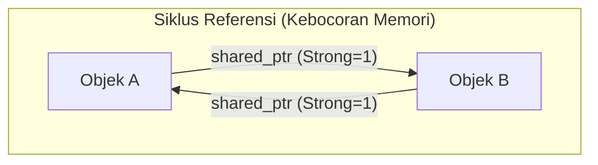
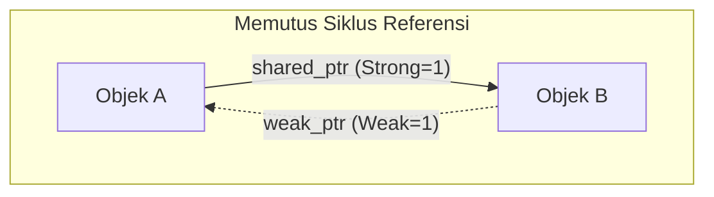

Manajemen memori dalam C++ telah menjadi salah satu tantangan terbesar bagi pengembang selama bertahun-tahun. Gaya manajemen memori tradisional yang bergantung pada `new` dan `delete` secara manual merupakan sarang bagi bug yang serius, seperti kebocoran memori (memory leak), pointer yang menggantung (dangling pointer), dan pembebasan ganda (double free). Namun, dengan munculnya Modern C++ (C++11 dan seterusnya), situasinya telah berubah secara drastis. Inti dari perubahan ini adalah "Smart Pointer".

Dalam artikel ini, kami akan menjelaskan dengan sangat mendetail mekanisme dan panduan pemanfaatan tingkat lanjut dari `std::unique_ptr`, `std::shared_ptr`, dan `std::weak_ptr` yang merupakan alat yang ampuh untuk memberantas kebocoran memori dan mewujudkan manajemen sumber daya yang aman serta efisien. Penjelasan ini akan mencakup implementasi internal (control block dan operasi atomik), dampaknya pada performa, serta perumusan penghitungan referensi (reference counting) menggunakan model matematika.

## 1. Pendahuluan: Zaman Kegelapan Manajemen Memori C++ dan Awal Mula Modern C++

Dalam pengembangan C++ di masa lalu, memori yang dialokasikan pada heap harus dibebaskan oleh pengembang itu sendiri.

```cpp
void legacy_function() {
    int* ptr = new int(10);
    // ... beberapa proses ...
    if (some_condition) {
        return; // Terjadi kebocoran memori! delete tidak dipanggil
    }
    delete ptr;
}
```

Pada kode seperti di atas, jika pengecualian (exception) terjadi atau pengembalian lebih awal (early return) dilakukan, `delete` akan dilewati dan kebocoran memori pun terjadi. Paradigma untuk mencegah hal ini disebut "RAII (Resource Acquisition Is Initialization)". RAII adalah sebuah teknik yang mengikat perolehan sumber daya ke inisialisasi objek (konstruktor), dan pembebasan sumber daya ke penghancuran objek (destruktor). Smart pointer adalah kumpulan kelas pustaka standar yang mengaplikasikan idiom RAII ini pada manajemen memori.

## 2. `std::unique_ptr`: Kepemilikan Eksklusif dengan Nol Overhead (Zero Overhead)

`std::unique_ptr` adalah smart pointer yang memiliki "Kepemilikan Eksklusif (Exclusive Ownership)" atas objek yang dialokasikan secara dinamis. Hanya ada satu `unique_ptr` pada satu waktu yang dapat memiliki suatu sumber daya.

### 2.1 Prinsip Nol Overhead

Daya tarik terbesar dari `std::unique_ptr` adalah performanya. Dalam keadaan default tanpa kustom deleter, ukuran `std::unique_ptr` sepenuhnya sama dengan pointer mentah (Raw Pointer). Tidak memiliki variabel anggota (member variables) yang tidak perlu, dan fungsi virtual juga tidak digunakan. Melalui pengoptimalan kompilator, akses melalui `std::unique_ptr` dikembangkan menjadi kode assembly yang setara dengan pointer mentah.

### 2.2 Perpindahan Kepemilikan dan `std::move`

Karena memiliki kepemilikan eksklusif, `std::unique_ptr` tidak dapat disalin (copy constructor dan copy assignment operator telah di-`delete`). Untuk memindahkan kepemilikan ke `unique_ptr` lain, Anda menggunakan `std::move` untuk memanfaatkan Semantik Perpindahan (Move Semantics).

```cpp
#include <iostream>
#include <memory>

class Resource {
public:
    Resource() { std::cout << "Resource acquired\n"; }
    ~Resource() { std::cout << "Resource destroyed\n"; }
    void do_something() { std::cout << "Doing something\n"; }
};

void process_resource(std::unique_ptr<Resource> ptr) {
    ptr->do_something();
    // Saat keluar dari cakupan (scope), ptr dihancurkan, dan Resource juga dibebaskan
}

int main() {
    std::unique_ptr<Resource> my_ptr = std::make_unique<Resource>();
    
    // process_resource(my_ptr); // Error: tidak dapat disalin
    process_resource(std::move(my_ptr)); // Perpindahan kepemilikan
    
    if (!my_ptr) {
        std::cout << "my_ptr is now empty.\n";
    }
    return 0;
}
```

Diagram Mermaid di bawah ini menunjukkan konsep perpindahan kepemilikan oleh `std::move`.



### 2.3 Implementasi Kustom Deleter (Custom Deleter)

Saat membungkus API warisan (legacy) dari bahasa C (misalnya `FILE*` atau soket), Anda perlu memanggil fungsi selain `delete` (seperti `fclose`) untuk membebaskan memori. `std::unique_ptr` memungkinkan Anda menentukan kustom deleter pada argumen template kedua.

```cpp
#include <cstdio>
#include <memory>

// Functor untuk kustom deleter
struct FileDeleter {
    void operator()(FILE* fp) const {
        if (fp) {
            std::cout << "Closing file.\n";
            std::fclose(fp);
        }
    }
};

using UniqueFile = std::unique_ptr<FILE, FileDeleter>;

int main() {
    UniqueFile file(std::fopen("test.txt", "w"));
    if (file) {
        std::fputs("Hello, Smart Pointers!", file.get());
    }
    // Saat cakupan berakhir, FileDeleter dipanggil dan fclose dieksekusi
    return 0;
}
```

Menggunakan pointer fungsi atau ekspresi lambda sebagai kustom deleter berpotensi meningkatkan ukuran `unique_ptr`, tetapi jika Anda menggunakan objek fungsi tanpa status (Functor) seperti di atas, ukurannya tidak akan bertambah dari pointer mentah berkat **EBCO (Empty Base Class Optimization)** di C++ atau atribut `[[no_unique_address]]` di C++20 (Nol overhead tetap dipertahankan).

## 3. `std::shared_ptr`: Kepemilikan Bersama (Shared Ownership) dan Control Block

`std::shared_ptr` adalah smart pointer yang memungkinkan beberapa pointer untuk berbagi kepemilikan atas objek yang sama. Ketika `shared_ptr` yang terakhir dihancurkan, objek yang dikelola akan dibebaskan.

### 3.1 Arsitektur Internal: Control Block

Secara terpisah dari pointer ke objek yang dikelola, `std::shared_ptr` mengalokasikan dan berbagi metadata yang disebut **Control Block** di heap. Control Block ini berisi informasi berikut:

1.  **Strong Count (Jumlah Referensi Kuat)**: Jumlah `shared_ptr` yang memiliki objek. Ketika nilainya mencapai 0, objek akan dihancurkan.
2.  **Weak Count (Jumlah Referensi Lemah)**: Jumlah `weak_ptr` yang memantau objek. Ketika baik Strong Count maupun Weak Count mencapai 0, Control Block itu sendiri akan dibebaskan.
3.  **Kustom Deleter dan Alokator** (jika ditentukan).



Oleh karena itu, ukuran objek `std::shared_ptr` itu sendiri biasanya dua kali lipat dari pointer mentah (pointer ke objek, dan pointer ke Control Block).

### 3.2 Performa dan Operasi Atomik

Penghitungan referensi (reference count) di dalam Control Block diimplementasikan sebagai **Operasi Atomik (Atomic Operations)** sehingga penambahan dan pengurangannya dapat dilakukan secara aman bahkan dalam lingkungan multithread.

Pada arsitektur x86/x64, instruksi atomik seperti `lock xadd` digunakan untuk menambah atau mengurangi jumlah referensi. Hal ini melibatkan overhead sebesar puluhan siklus dibandingkan dengan penambahan bilangan bulat biasa. Oleh karena itu, meneruskan `shared_ptr` ke sebuah fungsi melalui *pass-by-value* akan menyebabkan penambahan dan pengurangan atomik setiap kali salinan dibuat, sehingga menurunkan performa.

**Praktik Terbaik (Best Practice)**: Saat meneruskan `shared_ptr` ke suatu fungsi, kecuali jika Anda perlu berbagi kepemilikan, Anda sebaiknya meneruskannya sebagai `const std::shared_ptr<T>&` (referensi const) atau meneruskan pointer/referensi mentahnya.

### 3.3 `std::make_shared` vs `new`

Saat membuat `shared_ptr`, Anda harus menggunakan `std::make_shared` sedapat mungkin. Ada dua alasan penting untuk hal ini:

1.  **Pengoptimalan Alokasi Memori**:
    Menggunakan `new` akan menyebabkan dua kali alokasi heap: satu untuk badan objek dan satu untuk control block. Dengan `std::make_shared`, Anda dapat mengalokasikan satu blok memori besar yang mencakup keduanya dalam sekali alokasi heap, sehingga meningkatkan efisiensi cache.
2.  **Keamanan Pengecualian (Exception Safety)**:
    Dalam standar sebelum C++17, urutan evaluasi argumen fungsi belum ditentukan. Karena itu, jika terjadi pengecualian selama evaluasi argumen lain sebelum pointer yang dialokasikan oleh `new` diteruskan ke konstruktor `shared_ptr`, ada risiko kebocoran memori. `make_shared` sepenuhnya menghindari masalah ini.

```cpp
// Cara penulisan yang harus dihindari (2 kali alokasi memori)
std::shared_ptr<MyClass> ptr1(new MyClass());

// Cara penulisan yang disarankan (1 kali alokasi memori)
std::shared_ptr<MyClass> ptr2 = std::make_shared<MyClass>();
```

## 4. `std::weak_ptr`: Menyelesaikan Siklus Referensi (Circular Reference) dan Pemantauan

Kepemilikan bersama memiliki kelemahan fatal yang disebut "Siklus Referensi (Circular References)". Jika Objek A dan Objek B saling menunjuk satu sama lain dengan `shared_ptr`, nilai Strong Count dari masing-masing objek akan dipertahankan setidaknya 1 dan tidak akan pernah mencapai 0 sampai program berakhir, sehingga terjadi kebocoran memori.



### 4.1 Memutus Siklus dengan `std::weak_ptr`

Alat yang dapat memecahkan masalah ini adalah `std::weak_ptr`. `weak_ptr` dibuat dari `shared_ptr` dan merujuk pada objek, namun **tidak meningkatkan nilai Strong Count**. Sebagai gantinya, ia akan menambah Weak Count. Dengan demikian, Anda dapat "memantau" suatu objek tanpa memiliki kepemilikan atasnya.



### 4.2 Akses Aman Melalui Metode `lock()`

`weak_ptr` tidak memiliki operator (`->` atau `*`) untuk mengakses objek secara langsung. Hal ini dikarenakan ada kemungkinan objek target sudah dihancurkan. Untuk mengaksesnya dengan aman, Anda memanggil metode `lock()` agar bisa memperoleh `shared_ptr` sementara.

```cpp
#include <iostream>
#include <memory>

class Node {
public:
    std::string name;
    std::shared_ptr<Node> next;
    std::weak_ptr<Node> prev; // Menggunakan weak_ptr untuk mencegah siklus referensi

    Node(const std::string& n) : name(n) { std::cout << "Created " << name << "\n"; }
    ~Node() { std::cout << "Destroyed " << name << "\n"; }
};

int main() {
    auto nodeA = std::make_shared<Node>("A");
    auto nodeB = std::make_shared<Node>("B");

    nodeA->next = nodeB;
    nodeB->prev = nodeA;

    // Mendapatkan shared_ptr dari weak_ptr lalu mengaksesnya
    if (auto locked_prev = nodeB->prev.lock()) {
        std::cout << "Node B's prev is " << locked_prev->name << "\n";
    } else {
        std::cout << "Node B's prev is already destroyed.\n";
    }

    return 0; // nodeA dan nodeB dihancurkan dengan benar
}
```

## 5. Batasan Kepemilikan Bersama dalam Lingkungan Multithread

Keamanan thread (thread-safety) pada `shared_ptr` sering kali disalahpahami. "Pembaruan pada jumlah referensi di dalam Control Block adalah thread-safe", tetapi "proses baca/tulis dari objek `shared_ptr` itu sendiri tidaklah thread-safe".

- **Operasi yang aman**: Beberapa thread membaca dan menulis instans `shared_ptr` *milik mereka masing-masing* (meskipun berbagai instans ini membagikan Control Block yang sama).
- **Data Race (Bahaya)**: Beberapa thread melakukan proses baca/tulis terhadap instans `shared_ptr` yang *benar-benar sama* secara bersamaan.

Jika instans yang sama perlu dibagikan ke beberapa thread, Anda harus menggunakan `std::atomic<std::shared_ptr<T>>` (C++20) atau melindunginya menggunakan mutex (`std::mutex`).

## 6. Perumusan Penghitungan Referensi Secara Matematika

Transisi status dari siklus hidup di dalam Control Block dapat dinyatakan secara matematis sebagai berikut.
Misalkan Strong Count pada waktu $t$ adalah $S(t)$, dan Weak Count adalah $W(t)$.

Status awal (tepat setelah `make_shared`):
$$ S(0) = 1, \quad W(0) = 0 $$

Ketika salinan (replikasi `shared_ptr`) dibuat:
$$ S(t_{next}) = S(t) + 1 $$

Kondisi di mana Objek yang Dikelola (Managed Object) dihancurkan:
$$ \lim_{t \to t_d} S(t) = 0 $$

Kondisi di mana Control Block itu sendiri dibebaskan dari memori:
$$ S(t) = 0 \quad \land \quad W(t) = 0 $$
Dengan kata lain,
$$ S(t) + W(t) = 0 $$

Seperti yang ditunjukkan oleh rumus ini, selama `weak_ptr` terus ada ($W(t) > 0$), memori kecil yang dialokasikan untuk Control Block akan tetap dipertahankan meskipun objek yang dikelolanya telah dihancurkan. Ini adalah satu-satunya kekurangan dari `make_shared` pada kasus-kasus tertentu (karena memori objek yang dikelola terintegrasi dengan Control Block, maka ruang memori yang besar dari objek tersebut tidak akan dikembalikan ke sistem jika referensi lemahnya masih tersisa). Akan tetapi, pada umumnya manfaat dari segi performa yang diberikan oleh `make_shared` jauh lebih unggul.

## 7. Kesimpulan

Manajemen memori dalam Modern C++ tidak lagi berada di era di mana kita harus mengelola `new`/`delete` secara manual.

1.  Secara default, selalu gunakan **`std::unique_ptr`**, untuk mendapatkan keuntungan dari nol overhead sembari mengintegrasikan kepemilikan yang jelas ke dalam rancangan (desain).
2.  Gunakan **`std::shared_ptr`** hanya ketika benar-benar diperlukan adanya pembagian siklus hidup di antara beberapa pemilik, dan gunakan `std::make_shared` untuk membuatnya.
3.  Dalam struktur data yang mungkin memunculkan lingkaran pembagian (siklus referensi) atau saat mengimplementasikan Observer Pattern, manfaatkan **`std::weak_ptr`** untuk mencegah kebocoran memori sejak dini.

Dengan memahami smart pointer secara mendalam dan memanfaatkannya di tempat yang tepat, Anda dapat membangun arsitektur perangkat lunak yang aman dan tangguh tanpa sedikit pun mengorbankan performa dari C++.
