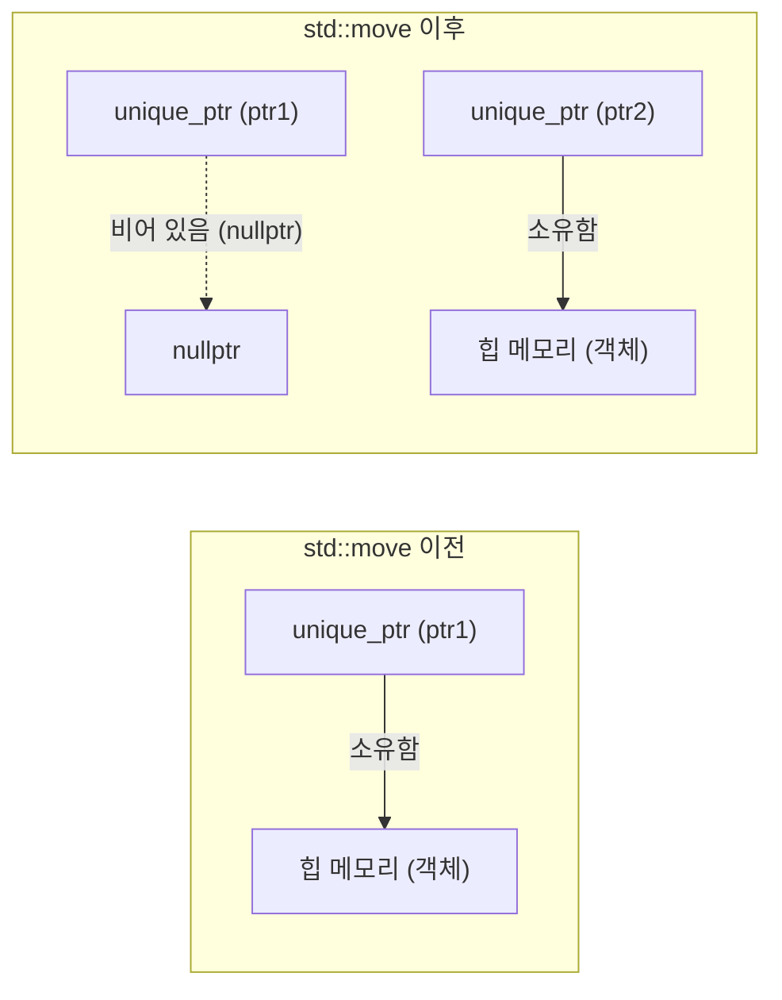
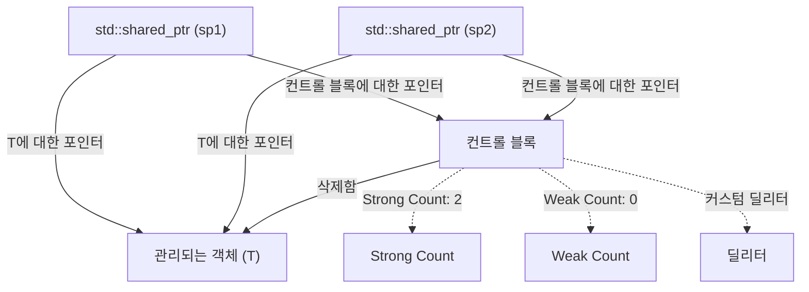
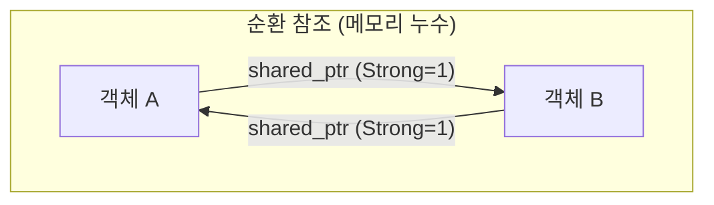
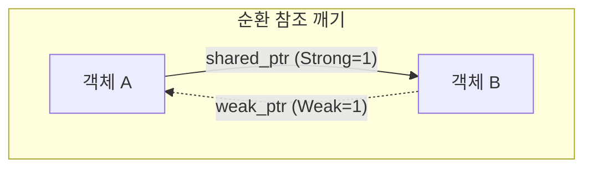

C++에서의 메모리 관리는 오랜 기간 동안 개발자에게 가장 큰 과제 중 하나였습니다. 수동으로 `new`와 `delete`에 의존하는 기존의 메모리 관리 스타일은 메모리 누수, 댕글링 포인터(dangling pointer), 이중 해제(double free)와 같은 심각한 버그를 일으키는 온상이었습니다. 하지만 Modern C++(C++11 이후)의 등장으로 상황은 극적으로 변했습니다. 그 핵심을 이루는 것이 바로 '스마트 포인터(Smart Pointers)'입니다.

본 기사에서는 메모리 누수를 근절하고 안전하며 효율적인 리소스 관리를 실현하기 위한 강력한 도구인 `std::unique_ptr`, `std::shared_ptr`, 그리고 `std::weak_ptr`의 원리와 고급 활용법에 대해, 내부 구현(컨트롤 블록과 원자적 연산), 성능에 미치는 영향, 수학적 모델을 통한 참조 카운트의 공식화를 곁들여 아주 상세히 해설합니다.

## 1. 도입: C++ 메모리 관리의 암흑시대와 Modern C++의 여명

과거의 C++ 개발에서는 힙(heap) 상에 할당된 메모리를 개발자 자신이 책임지고 해제해야만 했습니다.

```cpp
void legacy_function() {
    int* ptr = new int(10);
    // ... 어떤 처리 ...
    if (some_condition) {
        return; // 메모리 누수 발생! delete가 호출되지 않음
    }
    delete ptr;
}
```

위와 같은 코드에서는 예외가 발생하거나 조기 반환(early return)이 이루어질 경우 `delete`가 생략되어 메모리 누수가 발생합니다. 이를 방지하기 위한 패러다임이 'RAII(Resource Acquisition Is Initialization)'입니다. RAII는 리소스 할당을 객체의 초기화(생성자)에, 리소스 해제를 객체의 파괴(소멸자)에 연결하는 기법입니다. 스마트 포인터는 이 RAII 이디엄을 메모리 관리에 응용한 표준 라이브러리의 클래스 템플릿입니다.

## 2. `std::unique_ptr`: 제로 오버헤드의 배타적 소유권

`std::unique_ptr`는 동적으로 할당된 객체에 대해 '배타적 소유권(Exclusive Ownership)'을 가지는 스마트 포인터입니다. 특정 리소스를 소유할 수 있는 `unique_ptr`는 항상 단 하나뿐입니다.

### 2.1 제로 오버헤드의 원칙

`std::unique_ptr`의 가장 큰 매력은 그 성능입니다. 커스텀 딜리터(deleter)를 가지지 않는 기본 상태에서 `std::unique_ptr`의 크기는 원시 포인터(Raw Pointer)와 완전히 동일합니다. 불필요한 멤버 변수는 전혀 가지지 않으며 가상 함수도 사용되지 않습니다. 컴파일러의 최적화에 의해 `std::unique_ptr`를 통한 접근은 원시 포인터와 동등한 어셈블리 코드로 전개됩니다.

### 2.2 소유권 이동과 `std::move`

배타적 소유권을 가지기 때문에 `std::unique_ptr`는 복사할 수 없습니다(복사 생성자와 복사 대입 연산자가 `delete`되어 있습니다). 소유권을 다른 `unique_ptr`로 옮기려면 `std::move`를 사용하여 이동 의미론(Move Semantics)을 활용합니다.

```cpp
#include <iostream>
#include <memory>

class Resource {
public:
    Resource() { std::cout << "Resource acquired\n"; }
    ~Resource() { std::cout << "Resource destroyed\n"; }
    void do_something() { std::cout << "Doing something\n"; }
};

void process_resource(std::unique_ptr<Resource> ptr) {
    ptr->do_something();
    // 스코프를 벗어나면 ptr이 파괴되고, Resource도 해제됨
}

int main() {
    std::unique_ptr<Resource> my_ptr = std::make_unique<Resource>();
    
    // process_resource(my_ptr); // 에러: 복사 불가
    process_resource(std::move(my_ptr)); // 소유권 이동
    
    if (!my_ptr) {
        std::cout << "my_ptr is now empty.\n";
    }
    return 0;
}
```

다음 Mermaid 다이어그램은 `std::move`에 의한 소유권 이동의 개념을 보여줍니다.



### 2.3 커스텀 딜리터 구현

C 언어의 레거시 API(예: `FILE*`이나 소켓 등)를 래핑할 때, 메모리 해제를 위해 `delete` 이외의 함수(`fclose` 등)를 호출해야 할 필요가 있습니다. `std::unique_ptr`는 두 번째 템플릿 인자로 커스텀 딜리터를 지정할 수 있습니다.

```cpp
#include <cstdio>
#include <memory>

// 커스텀 딜리터용 함수 객체(Functor)
struct FileDeleter {
    void operator()(FILE* fp) const {
        if (fp) {
            std::cout << "Closing file.\n";
            std::fclose(fp);
        }
    }
};

using UniqueFile = std::unique_ptr<FILE, FileDeleter>;

int main() {
    UniqueFile file(std::fopen("test.txt", "w"));
    if (file) {
        std::fputs("Hello, Smart Pointers!", file.get());
    }
    // 스코프 종료 시 FileDeleter가 호출되어 fclose 됨
    return 0;
}
```

커스텀 딜리터로 함수 포인터나 람다 표현식을 사용하면 `unique_ptr`의 크기가 증가할 가능성이 있지만, 위와 같이 상태가 없는 함수 객체(Functor)를 사용하면 C++의 **EBCO(Empty Base Class Optimization)** 또는 C++20의 `[[no_unique_address]]` 덕분에 크기가 원시 포인터에서 증가하지 않습니다(제로 오버헤드가 유지됩니다).

## 3. `std::shared_ptr`: 공유 소유권과 컨트롤 블록

`std::shared_ptr`는 여러 포인터가 동일한 객체를 공유하여 소유하기 위한 스마트 포인터입니다. 마지막 `shared_ptr`가 파괴될 때 관리하고 있는 객체가 해제됩니다.

### 3.1 내부 아키텍처: 컨트롤 블록

`std::shared_ptr`는 관리 대상 객체에 대한 포인터와는 별도로 **컨트롤 블록(Control Block)**이라고 불리는 메타데이터를 힙 상에 할당하여 공유합니다. 컨트롤 블록에는 다음 정보가 포함됩니다:

1.  **Strong Count (강한 참조 카운트)**: 객체를 소유하고 있는 `shared_ptr`의 수입니다. 이 값이 0이 되면 객체가 파괴됩니다.
2.  **Weak Count (약한 참조 카운트)**: 객체를 감시하고 있는 `weak_ptr`의 수입니다. Strong Count와 Weak Count가 모두 0이 되면 컨트롤 블록 자체가 해제됩니다.
3.  **커스텀 딜리터와 할당자** (지정된 경우).



이 때문에 `std::shared_ptr` 객체 자체의 크기는 보통 원시 포인터의 2배(객체에 대한 포인터와 컨트롤 블록에 대한 포인터)가 됩니다.

### 3.2 성능과 원자적 연산

컨트롤 블록 내의 참조 카운트는 멀티스레드 환경에서도 안전하게 증감할 수 있도록 **원자적 연산(Atomic Operations)**으로 구현되어 있습니다.

x86/x64 아키텍처에서는 참조 카운트의 증감에 `lock xadd`와 같은 원자적 명령이 사용됩니다. 이는 일반적인 정수 덧셈에 비해 수십 사이클의 오버헤드를 수반합니다. 따라서 값 전달(pass-by-value)로 `shared_ptr`를 함수에 전달하면, 복사할 때마다 원자적인 증가(increment)와 감소(decrement)가 발생하여 성능이 저하됩니다.

**모범 사례(Best Practice)**: `shared_ptr`를 함수에 전달할 때는 소유권을 공유할 필요가 없는 한 `const std::shared_ptr<T>&`(const 참조)로 전달하거나, 원시 포인터/참조를 전달해야 합니다.

### 3.3 `std::make_shared` vs `new`

`shared_ptr`를 생성할 때는 가능한 한 `std::make_shared`를 사용해야 합니다. 여기에는 두 가지 중요한 이유가 있습니다.

1.  **메모리 할당 최적화**:
    `new`를 사용하면 객체 본체의 할당과 컨트롤 블록의 할당이라는 2번의 힙 할당(heap allocation)이 발생합니다. `std::make_shared`를 사용하면 두 가지를 포함하는 하나의 큰 메모리 블록을 1번의 힙 할당으로 확보할 수 있어 캐시 효율도 향상됩니다.
2.  **예외 안전성**:
    C++17 이전 규격에서는 함수 인자의 평가 순서가 미정이었기 때문에, `new`로 확보한 포인터를 `shared_ptr`의 생성자에 전달하기 전에 다른 인자를 평가하는 과정에서 예외가 발생하면 메모리 누수 위험이 있었습니다. `make_shared`는 이 문제를 완전히 회피합니다.

```cpp
// 피해야 할 작성법 (2번의 메모리 할당)
std::shared_ptr<MyClass> ptr1(new MyClass());

// 권장하는 작성법 (1번의 메모리 할당)
std::shared_ptr<MyClass> ptr2 = std::make_shared<MyClass>();
```

## 4. `std::weak_ptr`: 순환 참조 해결 및 감시

공유 소유권에는 '순환 참조(Circular References)'라는 치명적인 약점이 있습니다. 객체 A와 객체 B가 서로 `shared_ptr`로 가리키고 있는 경우, 각각의 Strong Count는 최소 1로 유지되어 프로그램이 종료될 때까지 절대 0이 되지 않으므로 메모리 누수가 발생합니다.



### 4.1 `std::weak_ptr`를 통한 순환 고리 깨기

이 문제를 해결하는 것이 바로 `std::weak_ptr`입니다. `weak_ptr`는 `shared_ptr`로부터 생성되어 객체를 참조하지만, **Strong Count를 증가시키지 않습니다**. 대신 Weak Count를 증가시킵니다. 이를 통해 소유권을 가지지 않고 객체를 '감시'할 수 있습니다.



### 4.2 `lock()` 메서드를 통한 안전한 접근

`weak_ptr`는 객체에 직접 접근하는 연산자(`->`나 `*`)를 가지고 있지 않습니다. 대상 객체가 이미 파괴되었을 가능성이 있기 때문입니다. 안전하게 접근하려면 `lock()` 메서드를 호출하여 일시적으로 `shared_ptr`를 얻어야 합니다.

```cpp
#include <iostream>
#include <memory>

class Node {
public:
    std::string name;
    std::shared_ptr<Node> next;
    std::weak_ptr<Node> prev; // 순환 참조를 방지하기 위해 weak_ptr 사용

    Node(const std::string& n) : name(n) { std::cout << "Created " << name << "\n"; }
    ~Node() { std::cout << "Destroyed " << name << "\n"; }
};

int main() {
    auto nodeA = std::make_shared<Node>("A");
    auto nodeB = std::make_shared<Node>("B");

    nodeA->next = nodeB;
    nodeB->prev = nodeA;

    // weak_ptr에서 shared_ptr를 얻어 접근
    if (auto locked_prev = nodeB->prev.lock()) {
        std::cout << "Node B's prev is " << locked_prev->name << "\n";
    } else {
        std::cout << "Node B's prev is already destroyed.\n";
    }

    return 0; // nodeA와 nodeB는 적절히 파괴됨
}
```

## 5. 멀티스레드 환경에서의 공유 소유권 제약

`shared_ptr`의 스레드 안전성(Thread Safety)에 대해서는 오해하기 쉽습니다. "컨트롤 블록 내의 참조 카운트 갱신은 스레드 안전(Thread Safe)"하지만, "`shared_ptr` 객체 자체의 읽고 쓰기는 스레드 안전하지 않습니다".

- **안전한 조작**: 여러 스레드가 *각자 자신의* `shared_ptr` 인스턴스(단, 동일한 컨트롤 블록을 공유함)를 읽고 쓰는 것.
- **데이터 레이스(위험)**: 여러 스레드가 *완전히 동일한* `shared_ptr` 인스턴스에 대해 동시에 읽고 쓰는 것.

동일한 인스턴스를 여러 스레드에서 공유해야 할 경우에는 `std::atomic<std::shared_ptr<T>>`(C++20)를 사용하거나, 뮤텍스(`std::mutex`)로 보호해야 합니다.

## 6. 참조 카운트의 수학적 공식화

컨트롤 블록에서의 라이프사이클 상태 전이를 수학적으로 표현하면 다음과 같습니다.
시간 $t$에서의 Strong Count를 $S(t)$, Weak Count를 $W(t)$라고 합니다.

초기 상태(`make_shared` 직후):
$$ S(0) = 1, \quad W(0) = 0 $$

복사(`shared_ptr`의 복제)가 이루어지면:
$$ S(t_{next}) = S(t) + 1 $$

관리 객체(Managed Object)가 파괴되는 조건:
$$ \lim_{t \to t_d} S(t) = 0 $$

컨트롤 블록(Control Block) 자체가 메모리에서 해제되는 조건:
$$ S(t) = 0 \quad \land \quad W(t) = 0 $$
즉,
$$ S(t) + W(t) = 0 $$

이 수식이 보여주듯, `weak_ptr`가 계속 존재하는 한($W(t) > 0$), 관리 객체가 파괴되었더라도 컨트롤 블록을 위한 작은 메모리 공간은 계속 확보되어 있습니다. 이것이 `make_shared`의 유일한 단점(관리 객체의 메모리와 컨트롤 블록이 일체화되어 있기 때문에, 약한 참조가 남아 있으면 관리 객체용 거대한 메모리 공간도 시스템에 반환되지 않음)이 되는 경우가 있지만, 보통은 `make_shared`의 성능상 이점이 압도적으로 큽니다.

## 7. 결론

Modern C++에서의 메모리 관리는 더 이상 수동으로 `new`/`delete`를 관리하는 시대가 아닙니다.

1.  기본적으로는 항상 **`std::unique_ptr`**를 사용하고, 제로 오버헤드의 혜택을 누리면서 명확한 소유권을 설계에 포함시킵니다.
2.  정말로 여러 소유자 간에 라이프사이클을 공유해야 할 필요가 있는 경우에만 **`std::shared_ptr`**를 사용하며, 생성에는 `std::make_shared`를 사용합니다.
3.  공유의 고리(순환 참조)가 발생할 수 있는 데이터 구조나 옵저버 패턴(Observer Pattern)의 구현에는 **`std::weak_ptr`**를 활용하여 메모리 누수를 미연에 방지합니다.

스마트 포인터를 깊이 이해하고 적재적소에 활용함으로써, C++의 성능을 전혀 희생하지 않고 안전하고 견고한 소프트웨어 아키텍처를 구축할 수 있게 됩니다.
