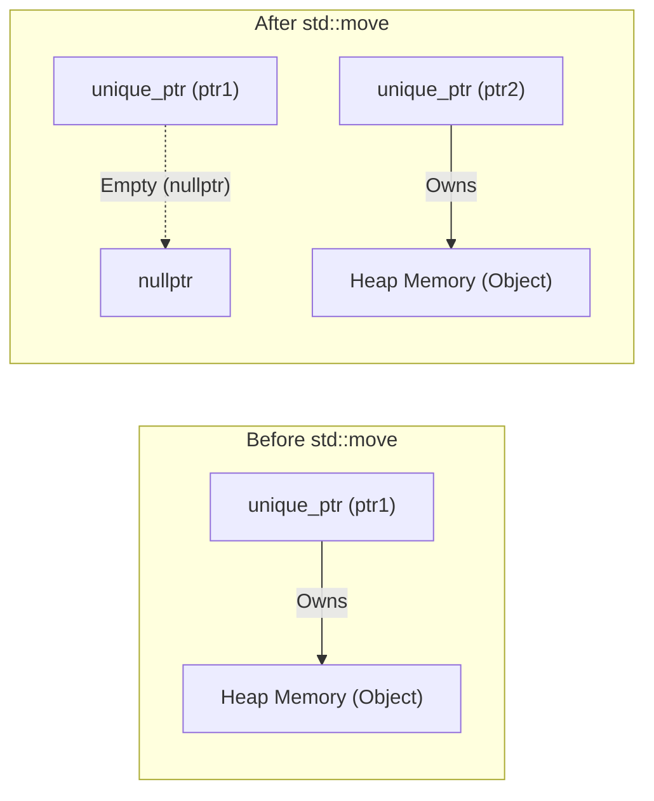
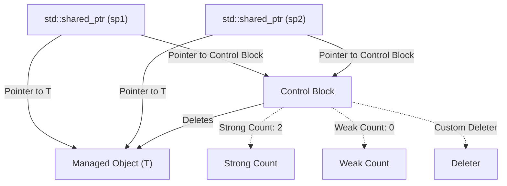
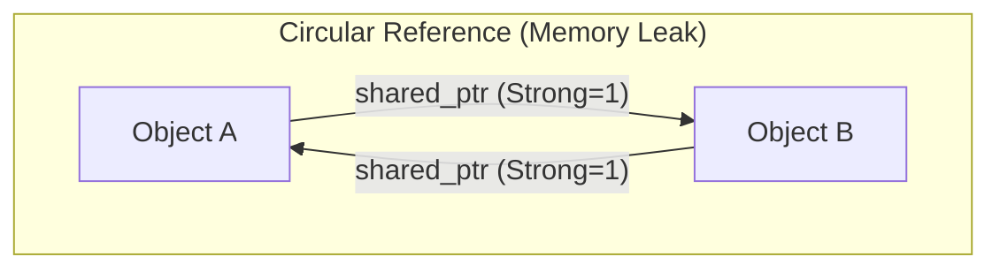
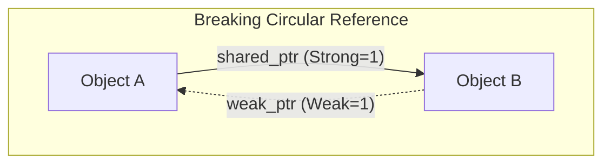

C++におけるメモリ管理は、長年にわたり開発者にとって最大の課題の一つでした。手動での `new` と `delete` に依存する従来のメモリ管理スタイルは、メモリリークやダングリングポインタ、二重解放といった深刻なバグを引き起こす温床となっていました。しかし、Modern C++（C++11以降）の登場により、状況は劇的に変化しました。その中核をなすのが「スマートポインタ（Smart Pointers）」です。

本記事では、メモリリークを根絶し、安全かつ効率的なリソース管理を実現するための強力なツールである `std::unique_ptr`、`std::shared_ptr`、そして `std::weak_ptr` の仕組みと高度な活用術について、内部実装（コントロールブロックやアトミック操作）、パフォーマンスへの影響、数学的モデルによる参照カウントの定式化を交えて極めて詳細に解説します。

## 1. 導入：C++メモリ管理の暗黒時代とModern C++の夜明け

かつてのC++開発では、ヒープ上に確保されたメモリは開発者自身が責任を持って解放する必要がありました。

```cpp
void legacy_function() {
    int* ptr = new int(10);
    // ... 何らかの処理 ...
    if (some_condition) {
        return; // メモリリーク発生！ delete が呼ばれない
    }
    delete ptr;
}
```

上記のようなコードでは、例外が発生した場合や早期リターンが行われた場合に `delete` がスキップされ、メモリリークが発生します。これを防ぐためのパラダイムが「RAII（Resource Acquisition Is Initialization）」です。RAIIは、リソースの確保をオブジェクトの初期化（コンストラクタ）に、リソースの解放をオブジェクトの破棄（デストラクタ）に結びつける手法です。スマートポインタは、このRAIIイディオムをメモリ管理に応用した標準ライブラリのクラススタックです。

## 2. `std::unique_ptr`：ゼロオーバーヘッドの排他的所有権

`std::unique_ptr` は、動的に割り当てられたオブジェクトに対して「排他的な所有権（Exclusive Ownership）」を持つスマートポインタです。あるリソースを所有できる `unique_ptr` は常に1つだけです。

### 2.1 ゼロオーバーヘッドの原則

`std::unique_ptr` の最大の魅力は、そのパフォーマンスです。カスタムデリータを持たないデフォルトの状態では、`std::unique_ptr` のサイズは生のポインタ（Raw Pointer）と完全に同一です。不要なメンバ変数は一切持たず、仮想関数も使用されていません。コンパイラの最適化により、`std::unique_ptr` を介したアクセスは生のポインタと同等のアセンブリコードに展開されます。

### 2.2 所有権の移動と `std::move`

排他的所有権を持つため、`std::unique_ptr` はコピーすることができません（コピーコンストラクタとコピー代入演算子が `delete` されています）。所有権を別の `unique_ptr` に移すには、`std::move` を使用してムーブセマンティクス（Move Semantics）を利用します。

```cpp
#include <iostream>
#include <memory>

class Resource {
public:
    Resource() { std::cout << "Resource acquired\n"; }
    ~Resource() { std::cout << "Resource destroyed\n"; }
    void do_something() { std::cout << "Doing something\n"; }
};

void process_resource(std::unique_ptr<Resource> ptr) {
    ptr->do_something();
    // スコープを抜けると ptr が破棄され、Resource も解放される
}

int main() {
    std::unique_ptr<Resource> my_ptr = std::make_unique<Resource>();
    
    // process_resource(my_ptr); // エラー：コピー不可
    process_resource(std::move(my_ptr)); // 所有権の移動
    
    if (!my_ptr) {
        std::cout << "my_ptr is now empty.\n";
    }
    return 0;
}
```

以下のMermaid図は、`std::move` による所有権の移動の概念を示しています。



### 2.3 カスタムデリータの実装

C言語のレガシーAPI（例えば `FILE*` やソケットなど）をラップする際、メモリの解放に `delete` 以外の関数（`fclose` など）を呼ぶ必要があります。`std::unique_ptr` は第2テンプレート引数にカスタムデリータを指定できます。

```cpp
#include <cstdio>
#include <memory>

// カスタムデリータ用のファンクタ
struct FileDeleter {
    void operator()(FILE* fp) const {
        if (fp) {
            std::cout << "Closing file.\n";
            std::fclose(fp);
        }
    }
};

using UniqueFile = std::unique_ptr<FILE, FileDeleter>;

int main() {
    UniqueFile file(std::fopen("test.txt", "w"));
    if (file) {
        std::fputs("Hello, Smart Pointers!", file.get());
    }
    // スコープ終了時に FileDeleter が呼ばれ fclose される
    return 0;
}
```

カスタムデリータとして関数ポインタやラムダ式を使用すると `unique_ptr` のサイズが増加する可能性がありますが、上記のようにステートレスな関数オブジェクト（Functor）を使用すると、C++の**EBCO（Empty Base Class Optimization）**またはC++20の `[[no_unique_address]]` によりサイズは生のポインタから増加しません（ゼロオーバーヘッドが維持されます）。

## 3. `std::shared_ptr`：共有所有権とコントロールブロック

`std::shared_ptr` は、複数のポインタが同一のオブジェクトを共有して所有するためのスマートポインタです。最後の `shared_ptr` が破棄されたときに、管理しているオブジェクトが解放されます。

### 3.1 内部アーキテクチャ：コントロールブロック

`std::shared_ptr` は、管理対象のオブジェクトへのポインタとは別に、**コントロールブロック（Control Block）**と呼ばれるメタデータをヒープ上に割り当てて共有します。コントロールブロックには以下の情報が含まれます：

1.  **Strong Count (強参照カウント)**：オブジェクトを所有している `shared_ptr` の数。これが0になるとオブジェクトが破棄されます。
2.  **Weak Count (弱参照カウント)**：オブジェクトを監視している `weak_ptr` の数。Strong CountとWeak Countの両方が0になると、コントロールブロック自体が解放されます。
3.  **カスタムデリータとアロケータ**（指定された場合）。



このため、`std::shared_ptr` オブジェクト自体のサイズは通常、生のポインタの2倍（オブジェクトへのポインタと、コントロールブロックへのポインタ）になります。

### 3.2 パフォーマンスとアトミック操作

コントロールブロック内の参照カウントは、マルチスレッド環境でも安全に増減できるよう、**アトミック操作（Atomic Operations）**として実装されています。

x86/x64アーキテクチャでは、参照カウントの増減には `lock xadd` のようなアトミック命令が使用されます。これは通常の整数加算に比べて数十サイクルのオーバーヘッドを伴います。したがって、値渡しで `shared_ptr` を関数に渡すと、コピーのたびにアトミックなインクリメントとデクリメントが発生し、パフォーマンスが低下します。

**ベストプラクティス**：`shared_ptr` を関数に渡す際は、所有権を共有する必要がない限り `const std::shared_ptr<T>&`（const参照）として渡すか、生のポインタ/参照を渡すべきです。

### 3.3 `std::make_shared` vs `new`

`shared_ptr` を生成する際は、可能な限り `std::make_shared` を使用すべきです。これには2つの重大な理由があります。

1.  **メモリ割り当ての最適化**：
    `new` を使用すると、オブジェクト本体の割り当てとコントロールブロックの割り当ての2回のヒープアロケーションが発生します。`std::make_shared` を使用すると、両方を包含する1つの大きなメモリブロックを1回のヒープアロケーションで確保でき、キャッシュ効率も向上します。
2.  **例外安全性**：
    C++17より前の規格では、関数の引数評価順序が未規定であったため、`new` で確保したポインタを `shared_ptr` のコンストラクタに渡す前に他の引数の評価で例外が発生すると、メモリリークのリスクがありました。`make_shared` はこの問題を完全に回避します。

```cpp
// 避けるべき書き方 (2回のメモリアロケーション)
std::shared_ptr<MyClass> ptr1(new MyClass());

// 推奨される書き方 (1回のメモリアロケーション)
std::shared_ptr<MyClass> ptr2 = std::make_shared<MyClass>();
```

## 4. `std::weak_ptr`：循環参照の解決と監視

共有所有権には「循環参照（Circular References）」という致命的な弱点があります。オブジェクトAとオブジェクトBが互いに `shared_ptr` で指し合っている場合、それぞれのStrong Countは最低でも1に維持され、プログラムが終了するまで決して0にならず、メモリリークが発生します。



### 4.1 `std::weak_ptr` による循環の打破

この問題を解決するのが `std::weak_ptr` です。`weak_ptr` は `shared_ptr` から作成され、オブジェクトを参照しますが、**Strong Countを増加させません**。代わりにWeak Countを増加させます。これにより、所有権を持たずにオブジェクトを「監視」することができます。



### 4.2 `lock()` メソッドによる安全なアクセス

`weak_ptr` は直接オブジェクトにアクセスする演算子（`->` や `*`）を持っていません。対象のオブジェクトがすでに破棄されている可能性があるためです。安全にアクセスするには、`lock()` メソッドを呼び出して一時的に `shared_ptr` を取得します。

```cpp
#include <iostream>
#include <memory>

class Node {
public:
    std::string name;
    std::shared_ptr<Node> next;
    std::weak_ptr<Node> prev; // 循環参照を防ぐためにweak_ptrを使用

    Node(const std::string& n) : name(n) { std::cout << "Created " << name << "\n"; }
    ~Node() { std::cout << "Destroyed " << name << "\n"; }
};

int main() {
    auto nodeA = std::make_shared<Node>("A");
    auto nodeB = std::make_shared<Node>("B");

    nodeA->next = nodeB;
    nodeB->prev = nodeA;

    // weak_ptrからshared_ptrを取得してアクセス
    if (auto locked_prev = nodeB->prev.lock()) {
        std::cout << "Node B's prev is " << locked_prev->name << "\n";
    } else {
        std::cout << "Node B's prev is already destroyed.\n";
    }

    return 0; // nodeAとnodeBは適切に破棄される
}
```

## 5. マルチスレッド環境における共有所有権の制約

`shared_ptr` のスレッドセーフティについては誤解されがちです。「コントロールブロック内の参照カウントの更新はスレッドセーフ」ですが、「`shared_ptr` オブジェクト自体の読み書きはスレッドセーフではありません」。

- **安全な操作**：複数のスレッドが、*それぞれ自身の* `shared_ptr` インスタンス（ただし同じコントロールブロックを共有している）を読み書きすること。
- **データレース（危険）**：複数のスレッドが、*全く同じ* `shared_ptr` インスタンスに対して同時に読み書きすること。

同じインスタンスを複数のスレッドで共有する必要がある場合は、`std::atomic<std::shared_ptr<T>>`（C++20）を使用するか、ミューテックス（`std::mutex`）で保護する必要があります。

## 6. 参照カウントの数学的定式化

コントロールブロックにおけるライフサイクルの状態遷移を数学的に表現すると以下のようになります。
時刻 $t$ における Strong Count を $S(t)$、Weak Count を $W(t)$ とします。

初期状態（`make_shared` 直後）：
$$ S(0) = 1, \quad W(0) = 0 $$

コピー（`shared_ptr` の複製）が行われると：
$$ S(t_{next}) = S(t) + 1 $$

管理オブジェクト（Managed Object）が破棄される条件：
$$ \lim_{t \to t_d} S(t) = 0 $$

コントロールブロック（Control Block）自身がメモリから解放される条件：
$$ S(t) = 0 \quad \land \quad W(t) = 0 $$
つまり、
$$ S(t) + W(t) = 0 $$

この数式が示すように、`weak_ptr` が存在し続ける限り（$W(t) > 0$）、管理オブジェクトが破棄されていてもコントロールブロック用の小さなメモリ空間は確保され続けます。これが `make_shared` の唯一の欠点（管理オブジェクトのメモリとコントロールブロックが一体化しているため、弱い参照が残っていると管理オブジェクト用の巨大なメモリ空間もシステムに返還されない）となるケースがありますが、通常は `make_shared` のパフォーマンス上の利点が圧倒的に上回ります。

## 7. 結論

Modern C++におけるメモリ管理は、もはや手動で `new`/`delete` を管理する時代ではありません。

1.  デフォルトでは常に **`std::unique_ptr`** を使用し、ゼロオーバーヘッドの恩恵を受けつつ明確な所有権を設計に組み込みます。
2.  本当に複数の所有者間でライフサイクルを共有する必要がある場合にのみ **`std::shared_ptr`** を使用し、生成には `std::make_shared` を用います。
3.  共有の環（循環参照）が発生しうるデータ構造やオブザーバーパターンの実装には、**`std::weak_ptr`** を活用してメモリリークを未然に防ぎます。

スマートポインタを深く理解し、適材適所で活用することで、C++のパフォーマンスを一切犠牲にすることなく、安全で堅牢なソフトウェアアーキテクチャを構築することが可能になります。
