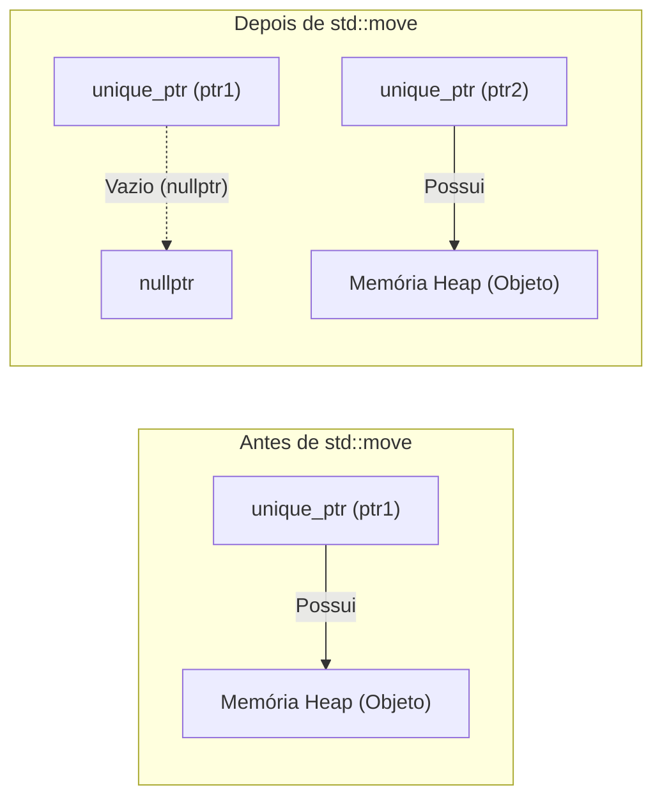
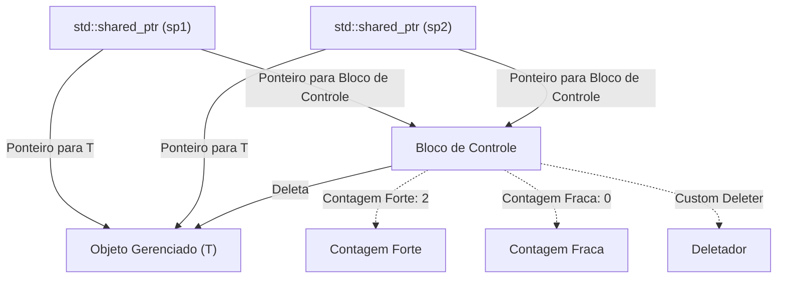
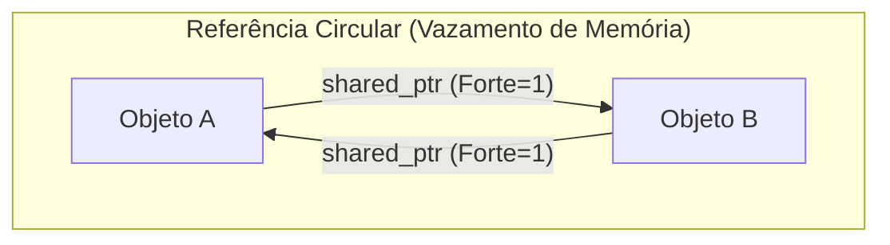
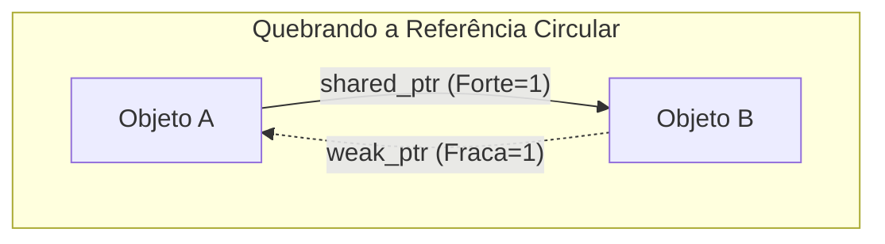

O gerenciamento de memória em C++ tem sido, por muitos anos, um dos maiores desafios para os desenvolvedores. O estilo tradicional de gerenciamento de memória, que depende de `new` e `delete` manuais, tornou-se um terreno fértil para a criação de bugs graves, como vazamentos de memória, ponteiros pendentes (dangling pointers) e dupla liberação. No entanto, com a chegada do Modern C++ (C++11 em diante), a situação mudou drasticamente. No centro dessa mudança estão os "Smart Pointers" (Ponteiros Inteligentes).

Neste artigo, explicaremos de forma extremamente detalhada os mecanismos e técnicas avançadas de uso do `std::unique_ptr`, `std::shared_ptr` e `std::weak_ptr` - ferramentas poderosas para erradicar vazamentos de memória e realizar um gerenciamento de recursos seguro e eficiente. Abordaremos suas implementações internas (blocos de controle e operações atômicas), impacto no desempenho e a formulação da contagem de referências por meio de modelos matemáticos.

## 1. Introdução: A era sombria do gerenciamento de memória em C++ e o alvorecer do Modern C++

No desenvolvimento C++ do passado, a memória alocada no heap precisava ser liberada pelo próprio desenvolvedor, sob sua própria responsabilidade.

```cpp
void legacy_function() {
    int* ptr = new int(10);
    // ... algum processamento ...
    if (some_condition) {
        return; // Ocorre um vazamento de memória! delete não é chamado
    }
    delete ptr;
}
```

Em códigos como o acima, o `delete` é ignorado e ocorre um vazamento de memória se houver uma exceção ou um retorno antecipado. O paradigma para evitar isso é o "RAII (Resource Acquisition Is Initialization)". O RAII é uma técnica que vincula a aquisição de recursos à inicialização do objeto (construtor) e a liberação de recursos à destruição do objeto (destrutor). Os smart pointers são um conjunto de classes da biblioteca padrão que aplicam este idioma RAII ao gerenciamento de memória.

## 2. `std::unique_ptr`: Propriedade exclusiva com zero overhead

O `std::unique_ptr` é um smart pointer que possui "Propriedade Exclusiva (Exclusive Ownership)" sobre um objeto alocado dinamicamente. Sempre haverá apenas um `unique_ptr` que possui um determinado recurso.

### 2.1 Princípio do zero overhead

A maior vantagem do `std::unique_ptr` é o seu desempenho. No seu estado padrão (sem possuir um custom deleter), o tamanho de um `std::unique_ptr` é perfeitamente idêntico ao de um ponteiro bruto (Raw Pointer). Ele não possui nenhuma variável membro desnecessária e funções virtuais não são utilizadas. Devido à otimização do compilador, o acesso feito por meio de um `std::unique_ptr` é expandido para o mesmo código assembly que o de um ponteiro bruto.

### 2.2 Transferência de propriedade e `std::move`

Por possuir propriedade exclusiva, o `std::unique_ptr` não pode ser copiado (o construtor de cópia e o operador de atribuição de cópia foram "deletados" usando `delete`). Para transferir a propriedade para outro `unique_ptr`, utilizamos a semântica de movimento (Move Semantics) através da função `std::move`.

```cpp
#include <iostream>
#include <memory>

class Resource {
public:
    Resource() { std::cout << "Resource acquired\n"; }
    ~Resource() { std::cout << "Resource destroyed\n"; }
    void do_something() { std::cout << "Doing something\n"; }
};

void process_resource(std::unique_ptr<Resource> ptr) {
    ptr->do_something();
    // Ao sair do escopo, ptr é destruído e Resource também é liberado
}

int main() {
    std::unique_ptr<Resource> my_ptr = std::make_unique<Resource>();
    
    // process_resource(my_ptr); // Erro: cópia não permitida
    process_resource(std::move(my_ptr)); // Transferência de propriedade
    
    if (!my_ptr) {
        std::cout << "my_ptr is now empty.\n";
    }
    return 0;
}
```

O diagrama Mermaid a seguir mostra o conceito de transferência de propriedade usando `std::move`.



### 2.3 Implementação de custom deleters

Ao encapsular APIs legadas em C (por exemplo, `FILE*` ou sockets), muitas vezes precisamos chamar uma função diferente de `delete` (como `fclose`) para liberar a memória. O `std::unique_ptr` permite especificar um "custom deleter" (deletador personalizado) no seu segundo argumento de template.

```cpp
#include <cstdio>
#include <memory>

// Functor para o custom deleter
struct FileDeleter {
    void operator()(FILE* fp) const {
        if (fp) {
            std::cout << "Closing file.\n";
            std::fclose(fp);
        }
    }
};

using UniqueFile = std::unique_ptr<FILE, FileDeleter>;

int main() {
    UniqueFile file(std::fopen("test.txt", "w"));
    if (file) {
        std::fputs("Hello, Smart Pointers!", file.get());
    }
    // Ao final do escopo, FileDeleter é chamado e fclose é executado
    return 0;
}
```

Usar ponteiros de função ou expressões lambda como custom deleters pode aumentar o tamanho do `unique_ptr`. No entanto, ao usar um objeto de função (Functor) sem estado como mostrado acima, o tamanho não aumentará em relação a um ponteiro bruto graças à **EBCO (Empty Base Class Optimization)** do C++ ou ao `[[no_unique_address]]` introduzido no C++20 (o zero overhead é mantido).

## 3. `std::shared_ptr`: Propriedade compartilhada e bloco de controle

O `std::shared_ptr` é um smart pointer para compartilhar a propriedade de um mesmo objeto entre múltiplos ponteiros. Quando o último `shared_ptr` é destruído, o objeto gerenciado é liberado.

### 3.1 Arquitetura interna: O Bloco de Controle (Control Block)

Diferente do ponteiro para o objeto sendo gerenciado, o `std::shared_ptr` aloca e compartilha no heap metadados chamados de **Bloco de Controle (Control Block)**. O bloco de controle contém as seguintes informações:

1.  **Strong Count (Contagem Forte)**: O número de instâncias de `shared_ptr` que possuem o objeto. Quando isso chega a 0, o objeto é destruído.
2.  **Weak Count (Contagem Fraca)**: O número de instâncias de `weak_ptr` que estão monitorando o objeto. Quando tanto a Strong Count quanto a Weak Count chegam a 0, o próprio bloco de controle é liberado.
3.  **Custom Deleter e Alocador** (se especificados).



Por esse motivo, o tamanho do próprio objeto `std::shared_ptr` costuma ser o dobro de um ponteiro bruto (um ponteiro para o objeto e outro ponteiro para o bloco de controle).

### 3.2 Desempenho e operações atômicas

As contagens de referência no bloco de controle são implementadas como **Operações Atômicas (Atomic Operations)** para garantir incrementos e decrementos seguros, mesmo em um ambiente multithread.

Nas arquiteturas x86/x64, as instruções atômicas como `lock xadd` são usadas para incrementar ou decrementar a contagem de referências. Isso tem um overhead de dezenas de ciclos de clock quando comparado à simples adição de inteiros. Portanto, passar um `shared_ptr` por valor a uma função acarretará incrementos e decrementos atômicos a cada cópia, degradando o desempenho.

**Melhor Prática**: A menos que seja estritamente necessário compartilhar a propriedade, você deve passar o `shared_ptr` para uma função como `const std::shared_ptr<T>&` (referência const), ou passar como ponteiro/referência bruto.

### 3.3 `std::make_shared` vs `new`

Ao gerar um `shared_ptr`, você deve usar `std::make_shared` sempre que possível. Existem duas razões principais para isso.

1.  **Otimização de alocação de memória**:
    Usar `new` resulta em duas alocações no heap: uma para o objeto em si e outra para o bloco de controle. Usar `std::make_shared` permite alocar de uma só vez um grande bloco de memória no heap que abrange a ambos, melhorando também a eficiência do cache.
2.  **Segurança contra exceções (Exception Safety)**:
    Nos padrões anteriores ao C++17, a ordem de avaliação dos argumentos da função não era definida, e se uma exceção ocorresse na avaliação de outros argumentos antes que o ponteiro alocado com `new` fosse passado para o construtor do `shared_ptr`, havia risco de vazamento de memória. O `make_shared` evita completamente este problema.

```cpp
// Prática a ser evitada (2 alocações de memória)
std::shared_ptr<MyClass> ptr1(new MyClass());

// Prática recomendada (1 alocação de memória)
std::shared_ptr<MyClass> ptr2 = std::make_shared<MyClass>();
```

## 4. `std::weak_ptr`: Resolvendo referências circulares e monitoramento

A propriedade compartilhada possui uma fraqueza fatal chamada "Referências Circulares (Circular References)". Se o Objeto A e o Objeto B apontarem um para o outro com `shared_ptr`, a Strong Count de ambos será mantida em pelo menos 1, e como nunca chegará a 0 até o final do programa, ocorrerá um vazamento de memória.



### 4.1 Quebrando ciclos com `std::weak_ptr`

O `std::weak_ptr` resolve este problema. O `weak_ptr` é gerado a partir de um `shared_ptr` e faz referência ao objeto, mas **não incrementa a Strong Count**. Em vez disso, ele incrementa a Weak Count. Isso permite "monitorar" o objeto sem ter a propriedade sobre ele.



### 4.2 Acesso seguro através do método `lock()`

O `weak_ptr` não possui operadores (como `->` ou `*`) para acessar o objeto de forma direta. Isso ocorre porque existe a possibilidade do objeto de destino já ter sido destruído. Para acessar de forma segura, deve-se chamar o método `lock()` e obter temporariamente um `shared_ptr`.

```cpp
#include <iostream>
#include <memory>

class Node {
public:
    std::string name;
    std::shared_ptr<Node> next;
    std::weak_ptr<Node> prev; // Usa weak_ptr para evitar referência circular

    Node(const std::string& n) : name(n) { std::cout << "Created " << name << "\n"; }
    ~Node() { std::cout << "Destroyed " << name << "\n"; }
};

int main() {
    auto nodeA = std::make_shared<Node>("A");
    auto nodeB = std::make_shared<Node>("B");

    nodeA->next = nodeB;
    nodeB->prev = nodeA;

    // Obtém o shared_ptr a partir do weak_ptr para o acesso
    if (auto locked_prev = nodeB->prev.lock()) {
        std::cout << "Node B's prev is " << locked_prev->name << "\n";
    } else {
        std::cout << "Node B's prev is already destroyed.\n";
    }

    return 0; // nodeA e nodeB são adequadamente destruídos
}
```

## 5. Restrições da propriedade compartilhada em ambientes multithread

A segurança das threads (thread-safety) no `shared_ptr` costuma ser bastante incompreendida. "A atualização da contagem de referências dentro do bloco de controle é thread-safe", no entanto "a leitura e escrita do próprio objeto `shared_ptr` não é thread-safe".

- **Operação Segura**: Múltiplas threads lendo e escrevendo, *cada uma na sua própria* instância do `shared_ptr` (mesmo que compartilhem o mesmo bloco de controle).
- **Data race (Perigo)**: Múltiplas threads lendo e escrevendo simultaneamente sobre a *mesma exata* instância do `shared_ptr`.

Caso precise compartilhar a mesma instância em várias threads, será necessário utilizar `std::atomic<std::shared_ptr<T>>` (C++20) ou protegê-la com um mutex (`std::mutex`).

## 6. Formulação matemática da contagem de referências

Expressando as transições de estados do ciclo de vida dentro do bloco de controle de maneira matemática, temos o seguinte.
Seja $S(t)$ a Strong Count no tempo $t$ e $W(t)$ a Weak Count.

Estado inicial (logo após `make_shared`):
$$ S(0) = 1, \quad W(0) = 0 $$

Quando ocorre uma cópia (duplicação de `shared_ptr`):
$$ S(t_{next}) = S(t) + 1 $$

A condição para que o objeto gerenciado (Managed Object) seja destruído:
$$ \lim_{t \to t_d} S(t) = 0 $$

A condição para que o próprio bloco de controle (Control Block) seja liberado da memória:
$$ S(t) = 0 \quad \land \quad W(t) = 0 $$
Ou seja,
$$ S(t) + W(t) = 0 $$

Como as fórmulas acima sugerem, contanto que um `weak_ptr` continue existindo ($W(t) > 0$), o pequeno espaço de memória para o bloco de controle continuará reservado, mesmo que o objeto gerenciado seja destruído. Esse seria o único cenário em que o uso do `make_shared` traria desvantagem (uma vez que a memória do objeto gerenciado e a do bloco de controle foram alocadas juntas, se restar alguma referência fraca, o grande espaço de memória destinado ao objeto gerenciado não retornará ao sistema). Contudo, na maior parte do tempo, a vantagem no desempenho do `make_shared` supera esse ponto negativo com folga.

## 7. Conclusão

O gerenciamento de memória em Modern C++ não está mais na época de fazer a gestão com `new`/`delete` manualmente.

1.  Como padrão, use **`std::unique_ptr`** sempre, e incorpore no design a sua clara propriedade de exclusividade enquanto ganha as vantagens de ter zero overhead.
2.  Use o **`std::shared_ptr`** apenas caso seja verdadeiramente necessário compartilhar o ciclo de vida entre vários proprietários, e utilize o `std::make_shared` para instanciá-lo.
3.  Faça bom uso do **`std::weak_ptr`** para a implementação do padrão de observador (Observer Pattern) e estruturas de dados que tendem a causar ciclos na propriedade (referências circulares), para, assim, prevenir vazamentos de memória antes que eles aconteçam.

Através do profundo entendimento dos smart pointers e de suas corretas aplicações nos lugares adequados, torna-se possível erguer uma arquitetura de software segura e sólida sem abrir mão de nenhuma das partes da alta performance da linguagem C++.
