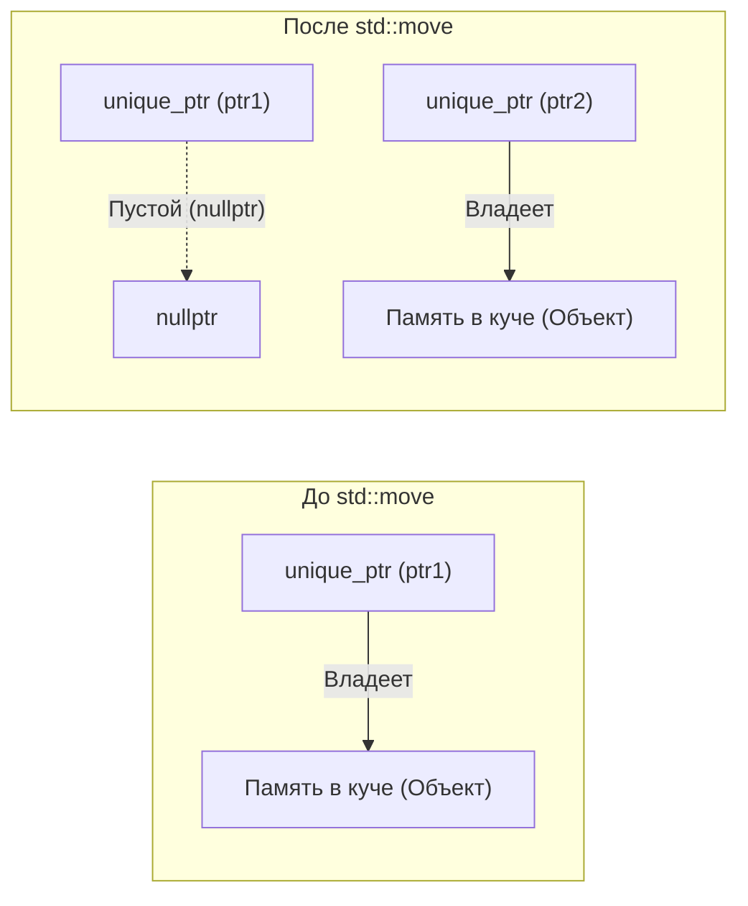
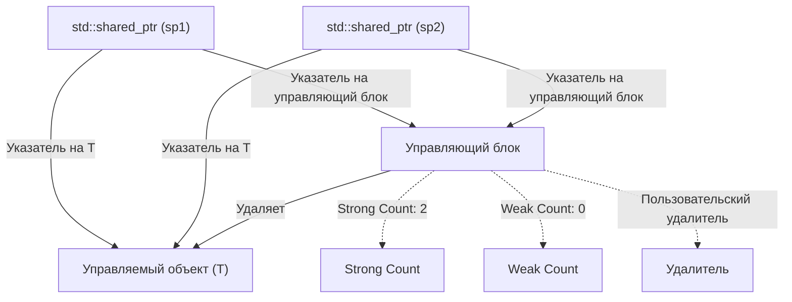
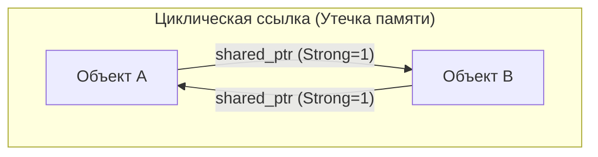
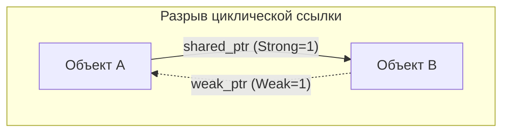

Управление памятью в C++ на протяжении многих лет было одной из главных проблем для разработчиков. Традиционный стиль управления памятью, опирающийся на ручное использование `new` и `delete`, служил рассадником серьезных ошибок, таких как утечки памяти, висячие указатели (dangling pointers) и двойное освобождение (double free). Однако с появлением Modern C++ (начиная с C++11) ситуация кардинально изменилась. Ядром этих изменений стали «умные указатели» (Smart Pointers).

В этой статье мы подробно рассмотрим механизмы и продвинутые методы использования `std::unique_ptr`, `std::shared_ptr` и `std::weak_ptr` — мощных инструментов для полного искоренения утечек памяти и реализации безопасного и эффективного управления ресурсами. Мы затронем их внутреннее устройство (управляющие блоки и атомарные операции), влияние на производительность, а также математическую модель подсчета ссылок.

## 1. Введение: Темные века управления памятью в C++ и рассвет Modern C++

В прошлом при разработке на C++ память, выделяемую в куче (heap), разработчик должен был освобождать самостоятельно.

```cpp
void legacy_function() {
    int* ptr = new int(10);
    // ... какие-то операции ...
    if (some_condition) {
        return; // Утечка памяти! delete не вызывается
    }
    delete ptr;
}
```

В таком коде, если возникает исключение или происходит ранний возврат (early return), вызов `delete` пропускается, и происходит утечка памяти. Парадигма, предотвращающая это, называется «RAII» (Resource Acquisition Is Initialization — Получение ресурса есть инициализация). RAII — это метод, который связывает выделение ресурса с инициализацией объекта (конструктором), а освобождение ресурса — с уничтожением объекта (деструктором). Умные указатели — это набор классов стандартной библиотеки, применяющих идиому RAII к управлению памятью.

## 2. `std::unique_ptr`: Эксклюзивное владение с нулевыми накладными расходами

`std::unique_ptr` — это умный указатель, который обладает «эксклюзивным владением» (Exclusive Ownership) динамически выделенным объектом. В любой момент времени ресурсом может владеть только один `unique_ptr`.

### 2.1 Принцип нулевых накладных расходов

Главное преимущество `std::unique_ptr` — его производительность. В состоянии по умолчанию, без кастомного удалителя (custom deleter), размер `std::unique_ptr` абсолютно идентичен размеру сырого указателя (Raw Pointer). Он не имеет никаких лишних переменных-членов и не использует виртуальные функции. Благодаря оптимизациям компилятора, доступ через `std::unique_ptr` разворачивается в ассемблерный код, эквивалентный сырому указателю.

### 2.2 Перемещение владения и `std::move`

Поскольку `std::unique_ptr` обладает эксклюзивным владением, его нельзя копировать (конструктор копирования и оператор присваивания с копированием удалены с помощью `delete`). Чтобы передать владение другому `unique_ptr`, необходимо использовать семантику перемещения (Move Semantics) с помощью `std::move`.

```cpp
#include <iostream>
#include <memory>

class Resource {
public:
    Resource() { std::cout << "Resource acquired\n"; }
    ~Resource() { std::cout << "Resource destroyed\n"; }
    void do_something() { std::cout << "Doing something\n"; }
};

void process_resource(std::unique_ptr<Resource> ptr) {
    ptr->do_something();
    // При выходе из области видимости ptr уничтожается, и Resource также освобождается
}

int main() {
    std::unique_ptr<Resource> my_ptr = std::make_unique<Resource>();
    
    // process_resource(my_ptr); // Ошибка: копирование невозможно
    process_resource(std::move(my_ptr)); // Перемещение владения
    
    if (!my_ptr) {
        std::cout << "my_ptr is now empty.\n";
    }
    return 0;
}
```

Следующая диаграмма Mermaid демонстрирует концепцию перемещения владения с помощью `std::move`.



### 2.3 Реализация пользовательского удалителя (Custom Deleter)

При оборачивании устаревших API на C (например, `FILE*` или сокетов) для освобождения памяти необходимо вызывать функции, отличные от `delete` (например, `fclose`). В `std::unique_ptr` можно указать пользовательский удалитель в качестве второго параметра шаблона.

```cpp
#include <cstdio>
#include <memory>

// Функтор для пользовательского удалителя
struct FileDeleter {
    void operator()(FILE* fp) const {
        if (fp) {
            std::cout << "Closing file.\n";
            std::fclose(fp);
        }
    }
};

using UniqueFile = std::unique_ptr<FILE, FileDeleter>;

int main() {
    UniqueFile file(std::fopen("test.txt", "w"));
    if (file) {
        std::fputs("Hello, Smart Pointers!", file.get());
    }
    // При выходе из области видимости вызывается FileDeleter и выполняется fclose
    return 0;
}
```

Использование указателей на функции или лямбда-выражений в качестве пользовательского удалителя может увеличить размер `unique_ptr`, однако при использовании функционального объекта без состояния (Functor), как показано выше, благодаря **EBCO (Empty Base Class Optimization)** в C++ или `[[no_unique_address]]` в C++20, размер не будет превышать размер сырого указателя (поддерживаются нулевые накладные расходы).

## 3. `std::shared_ptr`: Совместное владение и управляющий блок

`std::shared_ptr` — это умный указатель, предназначенный для совместного владения одним объектом несколькими указателями. Управляемый объект освобождается, когда уничтожается последний `shared_ptr`, указывающий на него.

### 3.1 Внутренняя архитектура: Управляющий блок

Помимо указателя на управляемый объект, `std::shared_ptr` выделяет в куче и совместно использует метаданные, называемые **управляющим блоком (Control Block)**. Управляющий блок содержит следующую информацию:

1. **Strong Count (Счетчик сильных ссылок)**: Количество `shared_ptr`, владеющих объектом. Когда он становится равен 0, объект уничтожается.
2. **Weak Count (Счетчик слабых ссылок)**: Количество `weak_ptr`, наблюдающих за объектом. Когда и Strong Count, и Weak Count становятся равны 0, освобождается сам управляющий блок.
3. **Пользовательский удалитель и аллокатор** (если они указаны).



Поэтому размер самого объекта `std::shared_ptr` обычно в два раза больше сырого указателя (указатель на объект и указатель на управляющий блок).

### 3.2 Производительность и атомарные операции

Счетчики ссылок в управляющем блоке реализованы с помощью **атомарных операций (Atomic Operations)**, чтобы их можно было безопасно увеличивать и уменьшать в многопоточной среде.

На архитектурах x86/x64 для инкремента и декремента счетчика ссылок используются атомарные инструкции, такие как `lock xadd`. Это влечет за собой накладные расходы в десятки тактов по сравнению с обычным целочисленным сложением. Следовательно, передача `shared_ptr` в функцию по значению вызывает атомарный инкремент и декремент при каждом копировании, что снижает производительность.

**Лучшая практика (Best Practice)**: При передаче `shared_ptr` в функцию его следует передавать как константную ссылку (`const std::shared_ptr<T>&`) или передавать сырой указатель/ссылку, если нет необходимости разделять владение.

### 3.3 `std::make_shared` против `new`

При создании `shared_ptr` следует по возможности использовать `std::make_shared`. Для этого есть две веские причины.

1. **Оптимизация выделения памяти**:
   При использовании `new` происходят две аллокации в куче: для самого объекта и для управляющего блока. Использование `std::make_shared` позволяет выделить один большой блок памяти, содержащий оба компонента, за одну аллокацию, что также улучшает эффективность кэширования.
2. **Безопасность исключений (Exception Safety)**:
   В стандартах до C++17 порядок вычисления аргументов функции не был строго определен. Если при вычислении других аргументов возникало исключение до того, как выделенный с помощью `new` указатель передавался в конструктор `shared_ptr`, существовал риск утечки памяти. `make_shared` полностью решает эту проблему.

```cpp
// Код, которого следует избегать (2 аллокации памяти)
std::shared_ptr<MyClass> ptr1(new MyClass());

// Рекомендуемый код (1 аллокация памяти)
std::shared_ptr<MyClass> ptr2 = std::make_shared<MyClass>();
```

## 4. `std::weak_ptr`: Разрешение циклических ссылок и наблюдение

Совместное владение имеет критическую уязвимость — «циклические ссылки» (Circular References). Если объект A и объект B ссылаются друг на друга с помощью `shared_ptr`, их Strong Count будет поддерживаться как минимум на уровне 1. Они никогда не станут равны 0 до завершения программы, что приведет к утечке памяти.



### 4.1 Разрыв цикла с помощью `std::weak_ptr`

Эту проблему решает `std::weak_ptr`. `weak_ptr` создается из `shared_ptr` и ссылается на объект, но **не увеличивает Strong Count**. Вместо этого он увеличивает Weak Count. Это позволяет «наблюдать» за объектом, не владея им.



### 4.2 Безопасный доступ с помощью метода `lock()`

`weak_ptr` не имеет операторов прямого доступа к объекту (`->` и `*`), поскольку целевой объект уже может быть уничтожен. Для безопасного доступа необходимо временно получить `shared_ptr`, вызвав метод `lock()`.

```cpp
#include <iostream>
#include <memory>

class Node {
public:
    std::string name;
    std::shared_ptr<Node> next;
    std::weak_ptr<Node> prev; // Использование weak_ptr для предотвращения циклических ссылок

    Node(const std::string& n) : name(n) { std::cout << "Created " << name << "\n"; }
    ~Node() { std::cout << "Destroyed " << name << "\n"; }
};

int main() {
    auto nodeA = std::make_shared<Node>("A");
    auto nodeB = std::make_shared<Node>("B");

    nodeA->next = nodeB;
    nodeB->prev = nodeA;

    // Получение shared_ptr из weak_ptr для доступа
    if (auto locked_prev = nodeB->prev.lock()) {
        std::cout << "Node B's prev is " << locked_prev->name << "\n";
    } else {
        std::cout << "Node B's prev is already destroyed.\n";
    }

    return 0; // nodeA и nodeB корректно уничтожаются
}
```

## 5. Ограничения совместного владения в многопоточной среде

Потокобезопасность `shared_ptr` часто понимают неправильно. Хотя «обновление счетчиков ссылок в управляющем блоке является потокобезопасным», «чтение и запись самого объекта `shared_ptr` потоконебезопасны».

- **Безопасные операции**: Несколько потоков читают/пишут *свои собственные* экземпляры `shared_ptr` (но разделяют один и тот же управляющий блок).
- **Состояние гонки (опасно)**: Несколько потоков одновременно читают/пишут один и *тот же* экземпляр `shared_ptr`.

Если один и тот же экземпляр должен совместно использоваться несколькими потоками, необходимо применять `std::atomic<std::shared_ptr<T>>` (C++20) или защищать его мьютексом (`std::mutex`).

## 6. Математическая формулировка подсчета ссылок

Жизненный цикл в управляющем блоке можно математически выразить следующим образом.
Пусть $S(t)$ — Strong Count в момент времени $t$, а $W(t)$ — Weak Count.

Начальное состояние (сразу после `make_shared`):
$$ S(0) = 1, \quad W(0) = 0 $$

При копировании (создании дубликата `shared_ptr`):
$$ S(t_{next}) = S(t) + 1 $$

Условие уничтожения управляемого объекта (Managed Object):
$$ \lim_{t \to t_d} S(t) = 0 $$

Условие освобождения памяти самого управляющего блока (Control Block):
$$ S(t) = 0 \quad \land \quad W(t) = 0 $$
То есть,
$$ S(t) + W(t) = 0 $$

Как показывают эти формулы, пока существует `weak_ptr` ($W(t) > 0$), небольшая область памяти для управляющего блока продолжает существовать, даже если управляемый объект уничтожен. В некоторых случаях это может стать единственным недостатком `make_shared` (поскольку память управляемого объекта и управляющий блок объединены, наличие слабой ссылки препятствует возвращению в систему огромного блока памяти, выделенного под управляемый объект), но обычно преимущества в производительности `make_shared` значительно перевешивают.

## 7. Заключение

Управление памятью в Modern C++ больше не требует ручного манипулирования `new`/`delete`.

1. По умолчанию всегда используйте **`std::unique_ptr`**, внедряя в дизайн четкое владение с нулевыми накладными расходами.
2. Используйте **`std::shared_ptr`** только тогда, когда жизненный цикл объекта действительно должен быть разделен между несколькими владельцами, и создавайте его с помощью `std::make_shared`.
3. Для реализации структур данных или паттерна "Наблюдатель" (Observer), где могут возникать циклы совместного владения (циклические ссылки), применяйте **`std::weak_ptr`**, чтобы предотвратить утечки памяти.

Глубокое понимание умных указателей и их применение в подходящих ситуациях позволяет создавать безопасную и надежную архитектуру программного обеспечения без каких-либо потерь в производительности C++.
