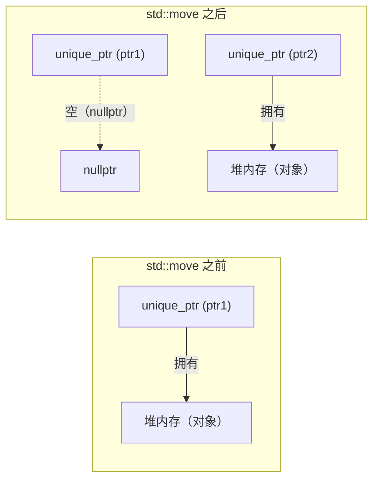
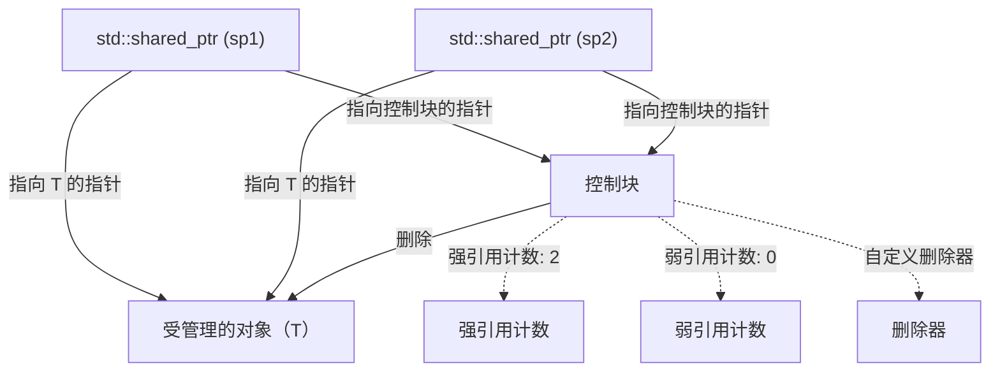
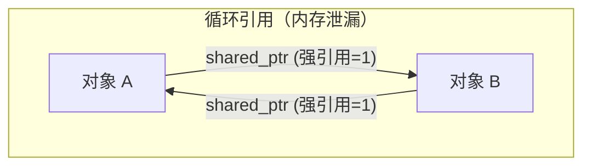
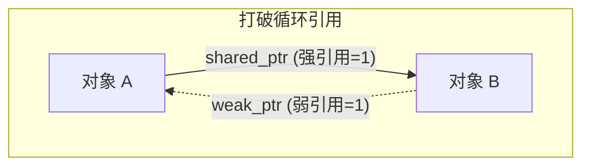

在C++中，内存管理长久以来都是开发者面临的最大挑战之一。依赖于手动 `new` 和 `delete` 的传统内存管理风格，成为了引发内存泄漏、悬垂指针以及重复释放等严重Bug的温床。然而，随着Modern C++（C++11及以后版本）的出现，情况发生了翻天覆地的变化。其核心便是“智能指针（Smart Pointers）”。

本文将极其详细地解说 `std::unique_ptr`、`std::shared_ptr` 以及 `std::weak_ptr` 的机制与高级运用技巧，它们是根除内存泄漏、实现安全且高效的资源管理的强大工具。我们将结合其内部实现（控制块和原子操作）、对性能的影响、以及基于数学模型的引用计数公式化来进行阐述。

## 1. 引入：C++内存管理的黑暗时代与Modern C++的黎明

在过去的C++开发中，在堆上分配的内存必须由开发者自己负责释放。

```cpp
void legacy_function() {
    int* ptr = new int(10);
    // ... 某些处理 ...
    if (some_condition) {
        return; // 发生内存泄漏！delete没有被调用
    }
    delete ptr;
}
```

在上述代码中，如果发生异常或者提前返回，`delete` 将被跳过，从而引发内存泄漏。为了防止这种情况发生，出现了一种范式叫做“RAII（Resource Acquisition Is Initialization，资源获取即初始化）”。RAII是一种将资源的获取与对象的初始化（构造函数）绑定，将资源的释放与对象的销毁（析构函数）绑定的手法。智能指针正是将这种RAII惯用法应用于内存管理的标准库类栈。

## 2. `std::unique_ptr`：零开销的独占所有权

`std::unique_ptr` 是一种对动态分配的对象拥有“独占所有权（Exclusive Ownership）”的智能指针。对于某个资源，同一时刻只能有一个 `unique_ptr` 拥有它。

### 2.1 零开销原则

`std::unique_ptr` 最大的魅力在于其性能。在没有自定义删除器的默认状态下，`std::unique_ptr` 的大小与裸指针（Raw Pointer）完全一致。它不包含任何不必要的成员变量，也没有使用虚函数。通过编译器的优化，通过 `unique_ptr` 进行的访问将被展开为与裸指针等效的汇编代码。

### 2.2 所有权的转移与 `std::move`

由于具有独占所有权，`std::unique_ptr` 无法被复制（拷贝构造函数和拷贝赋值运算符已被 `delete`）。要将所有权转移给另一个 `unique_ptr`，需要使用 `std::move` 来利用移动语义（Move Semantics）。

```cpp
#include <iostream>
#include <memory>

class Resource {
public:
    Resource() { std::cout << "Resource acquired\n"; }
    ~Resource() { std::cout << "Resource destroyed\n"; }
    void do_something() { std::cout << "Doing something\n"; }
};

void process_resource(std::unique_ptr<Resource> ptr) {
    ptr->do_something();
    // 离开作用域时 ptr 被销毁，Resource 也随之释放
}

int main() {
    std::unique_ptr<Resource> my_ptr = std::make_unique<Resource>();
    
    // process_resource(my_ptr); // 错误：不可复制
    process_resource(std::move(my_ptr)); // 转移所有权
    
    if (!my_ptr) {
        std::cout << "my_ptr is now empty.\n";
    }
    return 0;
}
```

下方的Mermaid图展示了通过 `std::move` 转移所有权的概念。



### 2.3 自定义删除器的实现

在封装C语言的旧API（例如 `FILE*` 或套接字等）时，需要调用 `delete` 以外的函数（如 `fclose`）来释放内存。`std::unique_ptr` 可以通过第二个模板参数指定自定义删除器。

```cpp
#include <cstdio>
#include <memory>

// 用于自定义删除器的仿函数
struct FileDeleter {
    void operator()(FILE* fp) const {
        if (fp) {
            std::cout << "Closing file.\n";
            std::fclose(fp);
        }
    }
};

using UniqueFile = std::unique_ptr<FILE, FileDeleter>;

int main() {
    UniqueFile file(std::fopen("test.txt", "w"));
    if (file) {
        std::fputs("Hello, Smart Pointers!", file.get());
    }
    // 作用域结束时将调用 FileDeleter 执行 fclose
    return 0;
}
```

如果使用函数指针或Lambda表达式作为自定义删除器，可能会增加 `unique_ptr` 的大小。但如上所述使用无状态的函数对象（Functor），借助C++的**EBCO（Empty Base Class Optimization，空基类优化）**或C++20的 `[[no_unique_address]]`，其大小不会比裸指针增加（维持了零开销）。

## 3. `std::shared_ptr`：共享所有权与控制块

`std::shared_ptr` 是一种允许多个指针共享同一个对象所有权的智能指针。当最后一个拥有它的 `shared_ptr` 被销毁时，其管理的对象才会被释放。

### 3.1 内部架构：控制块

`std::shared_ptr` 在管理对象的指针之外，还会在堆上分配并共享一个被称为**控制块（Control Block）**的元数据。控制块包含以下信息：

1.  **强引用计数（Strong Count）**：拥有该对象的 `shared_ptr` 的数量。当它变为0时，对象将被销毁。
2.  **弱引用计数（Weak Count）**：监视该对象的 `weak_ptr` 的数量。当强引用计数和弱引用计数都变为0时，控制块自身将被释放。
3.  **自定义删除器和分配器**（如果指定的话）。



因此，`std::shared_ptr` 对象本身的大小通常是裸指针的两倍（一个指向对象的指针，一个指向控制块的指针）。

### 3.2 性能与原子操作

控制块内的引用计数为了在多线程环境下也能安全地进行增减，是通过**原子操作（Atomic Operations）**来实现的。

在x86/x64架构中，引用计数的增减会使用类似 `lock xadd` 的原子指令。与普通的整数加法相比，这会带来数十个时钟周期的开销。因此，如果以传值的方式将 `shared_ptr` 传递给函数，每次复制都会发生原子的递增和递减，从而导致性能下降。

**最佳实践**：在将 `shared_ptr` 传递给函数时，除非需要共享所有权，否则应该以 `const std::shared_ptr<T>&`（const引用）的方式传递，或者传递裸指针/引用。

### 3.3 `std::make_shared` vs `new`

在创建 `shared_ptr` 时，应尽可能使用 `std::make_shared`。这有两个重要原因：

1.  **内存分配优化**：
    使用 `new` 会发生两次堆内存分配：一次是对象本身的分配，另一次是控制块的分配。而使用 `std::make_shared`，可以通过一次堆内存分配同时分配包含两者的一大块内存，这也能提升缓存效率。
2.  **异常安全性**：
    在C++17之前的标准中，函数参数的求值顺序是未指定的。如果将在 `new` 中分配的指针传递给 `shared_ptr` 的构造函数之前，其他参数求值时发生了异常，就会有内存泄漏的风险。`make_shared` 则完全避免了这个问题。

```cpp
// 应该避免的写法（两次内存分配）
std::shared_ptr<MyClass> ptr1(new MyClass());

// 推荐的写法（一次内存分配）
std::shared_ptr<MyClass> ptr2 = std::make_shared<MyClass>();
```

## 4. `std::weak_ptr`：打破循环引用与监视

共享所有权有一个致命的弱点，即“循环引用（Circular References）”。如果对象A和对象B相互之间通过 `shared_ptr` 互相指向对方，它们的强引用计数将至少保持为1，直到程序结束也不会变为0，从而导致内存泄漏。



### 4.1 使用 `std::weak_ptr` 打破循环

解决这个问题的办法是使用 `std::weak_ptr`。`weak_ptr` 由 `shared_ptr` 创建，用来引用对象，但它**不会增加强引用计数（Strong Count）**。相反，它会增加弱引用计数（Weak Count）。通过这种方式，可以在不拥有所有权的情况下“监视”对象。



### 4.2 通过 `lock()` 方法进行安全访问

`weak_ptr` 没有直接访问对象的运算符（如 `->` 或 `*`）。这是因为目标对象可能已经被销毁了。为了安全地访问，需要调用 `lock()` 方法来临时获取一个 `shared_ptr`。

```cpp
#include <iostream>
#include <memory>

class Node {
public:
    std::string name;
    std::shared_ptr<Node> next;
    std::weak_ptr<Node> prev; // 使用 weak_ptr 防止循环引用

    Node(const std::string& n) : name(n) { std::cout << "Created " << name << "\n"; }
    ~Node() { std::cout << "Destroyed " << name << "\n"; }
};

int main() {
    auto nodeA = std::make_shared<Node>("A");
    auto nodeB = std::make_shared<Node>("B");

    nodeA->next = nodeB;
    nodeB->prev = nodeA;

    // 从 weak_ptr 获取 shared_ptr 来进行访问
    if (auto locked_prev = nodeB->prev.lock()) {
        std::cout << "Node B's prev is " << locked_prev->name << "\n";
    } else {
        std::cout << "Node B's prev is already destroyed.\n";
    }

    return 0; // nodeA 和 nodeB 会被正确销毁
}
```

## 5. 多线程环境下的共享所有权限制

关于 `shared_ptr` 的线程安全性，经常会被误解：“控制块内引用计数的更新是线程安全的”，但是“对 `shared_ptr` 对象本身的读写不是线程安全的”。

- **安全的操作**：多个线程分别读写*各自独立的* `shared_ptr` 实例（虽然它们共享同一个控制块）。
- **数据竞争（危险）**：多个线程同时对*完全相同的* `shared_ptr` 实例进行读写。

如果需要在多个线程之间共享同一个实例，则需要使用 `std::atomic<std::shared_ptr<T>>`（C++20）或通过互斥锁（`std::mutex`）进行保护。

## 6. 引用计数的数学公式化

如果在数学上表达控制块中生命周期的状态转换，如下所示。
设时刻 $t$ 的强引用计数（Strong Count）为 $S(t)$，弱引用计数（Weak Count）为 $W(t)$。

初始状态（`make_shared` 之后）：
$$ S(0) = 1, \quad W(0) = 0 $$

当发生复制（复制 `shared_ptr`）时：
$$ S(t_{next}) = S(t) + 1 $$

管理对象（Managed Object）被销毁的条件：
$$ \lim_{t \to t_d} S(t) = 0 $$

控制块（Control Block）自身从内存中释放的条件：
$$ S(t) = 0 \quad \land \quad W(t) = 0 $$
即，
$$ S(t) + W(t) = 0 $$

如这些公式所示，只要 `weak_ptr` 继续存在（$W(t) > 0$），即使管理对象已经被销毁，为控制块分配的一小块内存空间也将继续保留。这在某些情况下成为 `make_shared` 的唯一缺点（由于管理对象的内存和控制块是一体化的，如果还有弱引用存在，管理对象占据的巨大内存空间也不会退还给系统），但在一般情况下，`make_shared` 在性能上的优势占据压倒性地位。

## 7. 结论

Modern C++ 中的内存管理早已不是那个手动管理 `new`/`delete` 的时代了。

1.  在默认情况下，请始终使用 **`std::unique_ptr`**，在享受零开销带来的好处的同时，将明确的所有权引入设计。
2.  只有在真正需要在多个所有者之间共享生命周期时，才应使用 **`std::shared_ptr`**，并且使用 `std::make_shared` 来创建它。
3.  在可能发生共享环（循环引用）的数据结构或观察者模式的实现中，请充分利用 **`std::weak_ptr`** 来防患于未然，避免内存泄漏。

通过深刻理解智能指针，并在合适的场景下灵活运用，就能在不牺牲任何 C++ 性能的前提下，构建出安全且健壮的软件架构。
