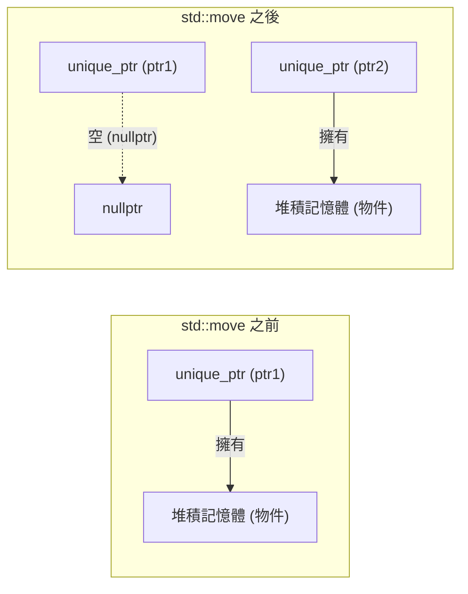
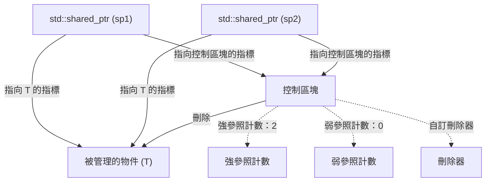
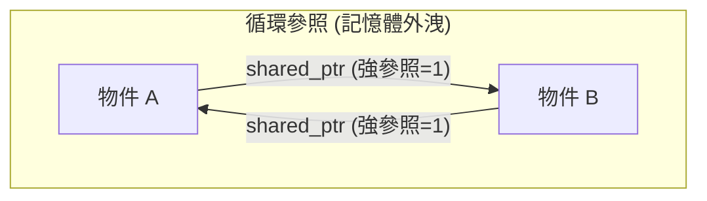
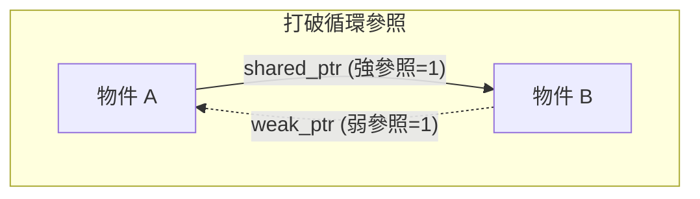

在 C++ 中的記憶體管理，長年以來都是開發者面臨的最大挑戰之一。依賴手動使用 `new` 與 `delete` 的傳統記憶體管理風格，成為了引發記憶體外洩 (Memory Leak)、懸空指標 (Dangling Pointer)、雙重釋放 (Double Free) 等嚴重 Bug 的溫床。然而，隨著 Modern C++ (C++11 起) 的問世，情況發生了戲劇性的變化。其核心正是「智慧指標 (Smart Pointers)」。

本文將針對 `std::unique_ptr`、`std::shared_ptr` 以及 `std::weak_ptr` 這些能夠根除記憶體外洩並實現安全且高效率資源管理的強大工具，介紹其運作機制與進階活用術，並結合內部實作（控制區塊與原子操作）、對效能的影響、以及透過數學模型進行參照計數的公式化，進行極為詳細的解說。

## 1. 簡介：C++ 記憶體管理的黑暗時代與 Modern C++ 的黎明

在過去的 C++ 開發中，開發者必須親自負責釋放配置在堆積 (Heap) 上的記憶體。

```cpp
void legacy_function() {
    int* ptr = new int(10);
    // ... 某些處理 ...
    if (some_condition) {
        return; // 發生記憶體外洩！delete 未被呼叫
    }
    delete ptr;
}
```

在上述的程式碼中，如果發生例外或是進行了提早回傳 (Early Return)，`delete` 將會被跳過，進而引發記憶體外洩。為了防止這種情況，便出現了「RAII (Resource Acquisition Is Initialization)」這個典範。RAII 是一種將資源的獲取綁定於物件的初始化 (建構子)，並將資源的釋放綁定於物件的銷毀 (解構子) 的手法。智慧指標就是將這種 RAII 慣用語應用於記憶體管理的標準函式庫類別。

## 2. `std::unique_ptr`：零開銷的獨佔所有權

`std::unique_ptr` 是一種對於動態配置物件擁有「獨佔所有權 (Exclusive Ownership)」的智慧指標。能夠擁有某項資源的 `unique_ptr` 永遠只有一個。

### 2.1 零開銷原則

`std::unique_ptr` 最大的魅力在於其效能。在未自訂刪除器 (Custom Deleter) 的預設狀態下，`std::unique_ptr` 的大小與原生指標 (Raw Pointer) 完全相同。它不具有任何不必要的成員變數，也沒有使用虛擬函式。透過編譯器最佳化，經由 `std::unique_ptr` 進行的存取將被展開成與原生指標同等的組合語言程式碼。

### 2.2 所有權的轉移與 `std::move`

由於擁有獨佔所有權，`std::unique_ptr` 無法被複製 (其複製建構子與複製指派運算子已被標記為 `delete`)。若要將所有權轉移給另一個 `unique_ptr`，必須使用 `std::move` 來利用移動語意 (Move Semantics)。

```cpp
#include <iostream>
#include <memory>

class Resource {
public:
    Resource() { std::cout << "Resource acquired\n"; }
    ~Resource() { std::cout << "Resource destroyed\n"; }
    void do_something() { std::cout << "Doing something\n"; }
};

void process_resource(std::unique_ptr<Resource> ptr) {
    ptr->do_something();
    // 離開作用域時 ptr 會被銷毀，Resource 也會被釋放
}

int main() {
    std::unique_ptr<Resource> my_ptr = std::make_unique<Resource>();
    
    // process_resource(my_ptr); // 錯誤：無法複製
    process_resource(std::move(my_ptr)); // 轉移所有權
    
    if (!my_ptr) {
        std::cout << "my_ptr is now empty.\n";
    }
    return 0;
}
```

以下的 Mermaid 圖表展示了透過 `std::move` 轉移所有權的概念。



### 2.3 自訂刪除器的實作

當包裝 C 語言的舊式 API (例如 `FILE*` 或 Socket 等) 時，釋放記憶體時需要呼叫 `delete` 以外的函式 (如 `fclose` 等)。`std::unique_ptr` 可以在第二個樣板引數 (Template Argument) 中指定自訂刪除器 (Custom Deleter)。

```cpp
#include <cstdio>
#include <memory>

// 用於自訂刪除器的仿函式 (Functor)
struct FileDeleter {
    void operator()(FILE* fp) const {
        if (fp) {
            std::cout << "Closing file.\n";
            std::fclose(fp);
        }
    }
};

using UniqueFile = std::unique_ptr<FILE, FileDeleter>;

int main() {
    UniqueFile file(std::fopen("test.txt", "w"));
    if (file) {
        std::fputs("Hello, Smart Pointers!", file.get());
    }
    // 離開作用域時會呼叫 FileDeleter 進行 fclose
    return 0;
}
```

若將函式指標或 Lambda 運算式作為自訂刪除器使用，可能會增加 `unique_ptr` 的大小；但如果像上述一樣使用無狀態的函式物件 (Functor)，受惠於 C++ 的 **EBCO (Empty Base Class Optimization)** 或 C++20 的 `[[no_unique_address]]`，其大小不會比原生指標增加 (保持零開銷)。

## 3. `std::shared_ptr`：共享所有權與控制區塊

`std::shared_ptr` 是一種讓多個指標共享並擁有同一個物件的智慧指標。當最後一個 `shared_ptr` 被銷毀時，其管理的物件就會被釋放。

### 3.1 內部架構：控制區塊

`std::shared_ptr` 除了指向被管理物件的指標外，還會在堆積上配置並共享一種被稱為 **控制區塊 (Control Block)** 的詮釋資料 (Metadata)。控制區塊包含以下資訊：

1.  **強參照計數 (Strong Count)**：擁有該物件的 `shared_ptr` 數量。當此數量變為 0 時，物件就會被銷毀。
2.  **弱參照計數 (Weak Count)**：正在監視該物件的 `weak_ptr` 數量。當強參照計數與弱參照計數雙雙變為 0 時，控制區塊本身就會被釋放。
3.  **自訂刪除器與配置器** (如果有被指定)。



因此，`std::shared_ptr` 物件本身的大小通常會是原生指標的 2 倍 (指向物件的指標，以及指向控制區塊的指標)。

### 3.2 效能與原子操作

控制區塊內的參照計數被實作為 **原子操作 (Atomic Operations)**，以確保在多執行緒環境下也能安全地增減。

在 x86/x64 架構中，參照計數的增減會使用如 `lock xadd` 之類的原子指令。與一般的整數加法相比，這會伴隨數十個週期 (Cycles) 的開銷。因此，如果以傳值 (By Value) 的方式將 `shared_ptr` 傳遞給函式，每次複製都會發生原子的遞增與遞減，進而降低效能。

**最佳實務 (Best Practice)**：將 `shared_ptr` 傳遞給函式時，除非需要共享所有權，否則應作為 `const std::shared_ptr<T>&` (常數參照) 來傳遞，或是傳遞原生指標/參照。

### 3.3 `std::make_shared` vs `new`

在建立 `shared_ptr` 時，應盡可能使用 `std::make_shared`。這有兩個重大的原因。

1.  **記憶體配置最佳化**：
    若使用 `new`，會發生兩次堆積配置：一次用於物件本身，另一次用於控制區塊。若使用 `std::make_shared`，則能以一次堆積配置來保留包含兩者在內的一個大型記憶體區塊，並且也能提升快取效率。
2.  **例外安全性**：
    在早於 C++17 的標準中，函式引數的評估順序是未規定的；如果在將 `new` 配置的指標傳給 `shared_ptr` 的建構子之前，其他引數的評估過程中發生了例外，就會有記憶體外洩的風險。`make_shared` 能夠完全避免這個問題。

```cpp
// 應避免的寫法 (2 次記憶體配置)
std::shared_ptr<MyClass> ptr1(new MyClass());

// 推薦的寫法 (1 次記憶體配置)
std::shared_ptr<MyClass> ptr2 = std::make_shared<MyClass>();
```

## 4. `std::weak_ptr`：循環參照的解決與監視

共享所有權有著一個被稱為「循環參照 (Circular References)」的致命弱點。當物件 A 與物件 B 互相以 `shared_ptr` 指向對方時，各自的強參照計數最少都會維持在 1，直到程式結束為止都絕對不會變成 0，進而導致記憶體外洩。



### 4.1 透過 `std::weak_ptr` 打破循環

解決這個問題的就是 `std::weak_ptr`。`weak_ptr` 是由 `shared_ptr` 所建立並參照著該物件，但**不會增加強參照計數**。取而代之的是增加弱參照計數。藉由這種方式，可以在不擁有所有權的情況下「監視」物件。



### 4.2 透過 `lock()` 方法進行安全存取

`weak_ptr` 並不具備直接存取物件的運算子 (`->` 或 `*`)。這是因為目標物件有可能已經被銷毀了。為了安全地進行存取，必須呼叫 `lock()` 方法來暫時取得一個 `shared_ptr`。

```cpp
#include <iostream>
#include <memory>

class Node {
public:
    std::string name;
    std::shared_ptr<Node> next;
    std::weak_ptr<Node> prev; // 使用 weak_ptr 以防止循環參照

    Node(const std::string& n) : name(n) { std::cout << "Created " << name << "\n"; }
    ~Node() { std::cout << "Destroyed " << name << "\n"; }
};

int main() {
    auto nodeA = std::make_shared<Node>("A");
    auto nodeB = std::make_shared<Node>("B");

    nodeA->next = nodeB;
    nodeB->prev = nodeA;

    // 從 weak_ptr 取得 shared_ptr 來進行存取
    if (auto locked_prev = nodeB->prev.lock()) {
        std::cout << "Node B's prev is " << locked_prev->name << "\n";
    } else {
        std::cout << "Node B's prev is already destroyed.\n";
    }

    return 0; // nodeA 與 nodeB 都會被適當地銷毀
}
```

## 5. 多執行緒環境下的共享所有權限制

關於 `shared_ptr` 的執行緒安全性 (Thread Safety) 很容易被誤解：「控制區塊內參照計數的更新是執行緒安全的」，但是「`shared_ptr` 物件本身的讀寫並非執行緒安全」。

- **安全的操作**：多個執行緒讀寫 *各自獨立的* `shared_ptr` 實例 (但共享同一個控制區塊)。
- **資料競爭 (危險)**：多個執行緒同時讀寫 *完全相同的* `shared_ptr` 實例。

如果必須在多個執行緒之間共享同一個實例，則需要使用 `std::atomic<std::shared_ptr<T>>` (C++20)，或是使用互斥鎖 (`std::mutex`) 進行保護。

## 6. 參照計數的數學公式化

將控制區塊中生命週期的狀態轉換以數學方式表示如下：
假設時間 $t$ 時的強參照計數為 $S(t)$，弱參照計數為 $W(t)$。

初始狀態 (`make_shared` 剛執行完後)：
$$ S(0) = 1, \quad W(0) = 0 $$

當進行複製 (`shared_ptr` 的複製) 時：
$$ S(t_{next}) = S(t) + 1 $$

被管理的物件 (Managed Object) 被銷毀的條件：
$$ \lim_{t \to t_d} S(t) = 0 $$

控制區塊 (Control Block) 本身從記憶體中被釋放的條件：
$$ S(t) = 0 \quad \land \quad W(t) = 0 $$
也就是說，
$$ S(t) + W(t) = 0 $$

正如這個數學式所顯示的，只要 `weak_ptr` 繼續存在 ($W(t) > 0$)，即使被管理的物件已經被銷毀，用於控制區塊的微小記憶體空間仍會持續保留。這在某些情況下會成為 `make_shared` 唯一的缺點 (由於被管理物件的記憶體與控制區塊是一體化的，如果有弱參照殘留，那麼用於被管理物件的龐大記憶體空間也不會歸還給系統)，但通常 `make_shared` 在效能上的優勢會帶來壓倒性的好處。

## 7. 結論

在 Modern C++ 中的記憶體管理，已經不再是手動管理 `new`/`delete` 的時代了。

1.  預設情況下應總是使用 **`std::unique_ptr`**，在享受零開銷恩惠的同時，將明確的所有權納入設計之中。
2.  只有在真正需要於多個擁有者之間共享生命週期時，才使用 **`std::shared_ptr`**，並且使用 `std::make_shared` 來建立。
3.  在可能會發生共享循環 (循環參照) 的資料結構，或是在實作觀察者模式 (Observer Pattern) 時，活用 **`std::weak_ptr`** 來防範記憶體外洩於未然。

深入理解智慧指標並在適當的地方活用它們，將能在完全不犧牲 C++ 效能的情況下，建構出安全且堅固的軟體架構。
