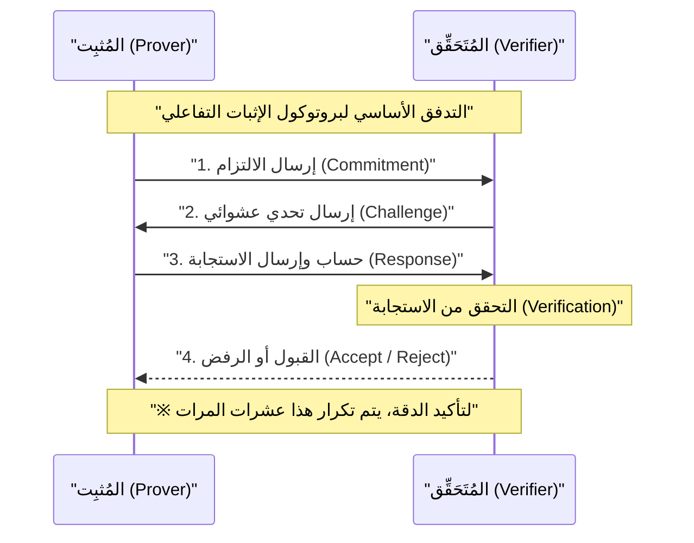
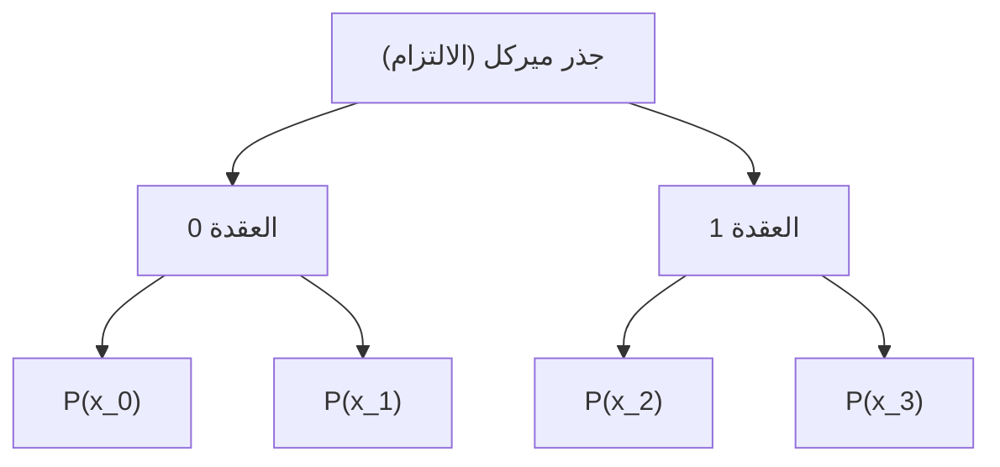

## مقدمة

في المجتمع الرقمي الحديث، تعد خصوصية البيانات وقابلية التوسع من أهم التحديات. مع تزايد مخاطر تسرب المعلومات الشخصية والاستخدام غير المصرح به، هناك حاجة ملحة لتقنية "تثبت أنك تمتلك معلومات معينة دون الكشف عنها للطرف الآخر". ما يحقق ذلك هو **إثبات المعرفة الصفرية (Zero-Knowledge Proof: ZKP)**.

إثبات المعرفة الصفرية هو مفهوم في نظرية التشفير اقترحه لأول مرة شافي غولدفاسر (Shafi Goldwasser)، سيلفيو ميكالي (Silvio Micali)، وتشارلز راكوف (Charles Rackoff) في الثمانينيات، ولكنه ظل لفترة طويلة مقتصرًا على البحث النظري. ومع ذلك، مع ظهور تقنية البلوكتشين و Web3، تغير الوضع تمامًا. برز ZKP فجأة كـ "عصا سحرية" تحل في الوقت نفسه مشكلة قابلية التوسع (حدود القدرة على المعالجة) ومشكلة الخصوصية (أن جميع المعاملات عامة ومكشوفة) التي تواجهها شبكات البلوكتشين العامة مثل الإيثريوم (Ethereum).

في هذه المقالة، سنشرح بتفصيل عميق وتقني كل شيء بدءًا من المفاهيم الأساسية لإثبات المعرفة الصفرية، مرورًا بالآليات الرياضية والتشفيرية العميقة لـ **zk-SNARKs** و **zk-STARKs** السائدة حاليًا، وصولاً إلى أحدث أمثلة تطبيقاتها في Web3 والأمن مثل ZK-Rollups والهويات اللامركزية (DID).

---

## ما هو إثبات المعرفة الصفرية (ZKP)؟

إثبات المعرفة الصفرية (ZKP) يشير إلى بروتوكول يسمح للمُثبِت (Prover) بإثبات صحة قضية معينة للمُتَحَقِّق (Verifier) "دون نقل أي معلومات أخرى سوى حقيقة أن القضية صحيحة".

### المتطلبات الثلاثة التي يجب أن يفي بها ZKP

لكي يعتبر البروتوكول ZKP صالحًا، يجب أن يستوفي بدقة الخصائص الثلاث التالية:

1. **الكمال (Completeness)**
   إذا كانت القضية صحيحة واتبع كل من المُثبِت والمُتَحَقِّق البروتوكول بشكل صحيح، فيجب على المُتَحَقِّق قبول (Accept) الإثبات باحتمالية ساحقة.
2. **السلامة (Soundness)**
   إذا كانت القضية خاطئة، فإنه من المستحيل (باستثناء احتمالية ضئيلة يمكن تجاهلها) لأي مُثبِت، مهما كانت قدرته الحسابية عالية أو نواياه سيئة، أن يخدع المُتَحَقِّق ويجعله يقبل الإثبات.
3. **المعرفة الصفرية (Zero-Knowledge)**
   إذا كانت القضية صحيحة، لا يمكن للمُتَحَقِّق الحصول على أي معلومات من عملية الإثبات سوى حقيقة "أن القضية صحيحة". يتم إثبات ذلك رياضيًا من خلال وجود "محاكي (Simulator)" يمكنه محاكاة عملية الإثبات من منظور المُتَحَقِّق.

### الإثبات التفاعلي والإثبات غير التفاعلي

هناك نوعان من ZKP: **الإثبات التفاعلي (Interactive ZKP)**، حيث يتبادل المُثبِت والمُتَحَقِّق الاتصالات عدة مرات، و**الإثبات غير التفاعلي (Non-Interactive ZKP)**، حيث يرسل المُثبِت بيانات الإثبات مرة واحدة فقط.

#### الإثبات التفاعلي (Interactive ZKP)

تم تصميم ZKP في البداية كبروتوكول تفاعلي. وتعتبر قصة "كهف علي بابا" الشهيرة مثالاً على ذلك. التسلسل العام للبروتوكول هو كما يلي:

هذه الطريقة قوية، ولكنها تتطلب أن يكون المُتَحَقِّق متصلاً بالإنترنت (أونلاين)، مما يجعلها غير مريحة للتطبيق في أنظمة موزعة غير متزامنة مثل البلوكتشين. في البلوكتشين، يجب أن يكون أي شخص قادرًا على التحقق من الإثباتات السابقة في أي وقت.

#### تحويل فيات-شامير (Fiat-Shamir Heuristic) وعدم التفاعلية

الطريقة الثورية لتحويل الإثبات التفاعلي إلى إثبات غير تفاعلي (Non-Interactive Zero-Knowledge Proof: NIZK) هي **تحويل فيات-شامير**.

بدلاً من "التحدي العشوائي" الذي يرسله المُتَحَقِّق، يقوم المُثبِت بإنشاء "تحدي شبه عشوائي" ذاتيًا باستخدام تجزئة (Hash) لالتزامه الخاص والمعلومات العامة. بافتراض أن دالة التجزئة التشفيرية (مثل SHA-256 أو Keccak) تعمل كـ "أوراكل عشوائي (Random Oracle)"، لا يمكن للمُثبِت التنبؤ بالتحدي أو التلاعب به مسبقًا. وبهذا يمكنه إكمال الإثبات بإرسال رسالة واحدة مع الحفاظ على نفس مستوى أمان الإثبات التفاعلي.

---

## التفاصيل التقنية لـ zk-SNARKs

حاليًا، يعتبر **zk-SNARKs** (Zero-Knowledge Succinct Non-Interactive Argument of Knowledge) هو الأكثر استخدامًا بين أنواع ZKP. كما يوحي اسمه، يمتلك خاصية المعرفة الصفرية (zk)، حجم إثباته صغير جدًا و التحقق منه سريع (Succinct)، غير تفاعلي (Non-Interactive)، وهو نقاش حول المعرفة (Argument of Knowledge).

يعتمد zk-SNARKs على الهندسة الجبرية المتقدمة ونظرية التشفير. يقوم بتحويل تنفيذ البرامج أو الحسابات إلى التحقق من معادلات متعددات الحدود المحددة.

### 1. الدوائر الحسابية والتحويل إلى R1CS (Rank-1 Constraint System)

أولاً، يتم تحويل أي حساب مراد إثباته (خوارزمية أو منطق عقد ذكي) إلى **دائرة حسابية (Arithmetic Circuit)** تتكون من بوابات الجمع وبوابات الضرب.

بعد ذلك، يتم تحويل هذه الدائرة الحسابية إلى مجموعة من معادلات المصفوفات تسمى **R1CS (Rank-1 Constraint System)**. R1CS هي مسألة إيجاد مصفوفات $A, B, C$ التي تفي بالشرط التالي بالنسبة لمتجه المتغيرات $x$:

$$ (A \cdot x) \circ (B \cdot x) = C \cdot x $$

هنا، يمثل $\circ$ جداء هادامارد (الضرب عنصر بعنصر). يضمن هذا القيد أن جميع البوابات المنطقية (خاصة بوابات الضرب) في الدائرة قد تم حسابها بشكل صحيح.

### 2. التحويل إلى QAP (Quadratic Arithmetic Program)

نظرًا لوجود عدد لا يحصى من قيود مصفوفات R1CS، فإن التحقق منها بشكل فردي غير فعال للغاية. لذلك، باستخدام استيفاء لاغرانج (Lagrange interpolation)، يتم ضغط هذه القيود إلى معادلة متعددة حدود واحدة. هذا هو **QAP (Quadratic Arithmetic Program)**.

من خلال التحويل إلى QAP، تتلخص المشكلة المراد إثباتها في: "هل تقبل متعددة الحدود المعينة $P(x)$ القسمة على متعددة حدود أخرى معروفة $Z(x)$؟".

$$ P(x) = L(x) \cdot R(x) - O(x) $$

هنا، $L(x), R(x), O(x)$ هي متعددات حدود مجتمعة تتوافق مع كل صف من المصفوفات $A, B, C$ على التوالي. إذا كان المُثبِت يعرف الحل الصحيح (Witness)، فإن القيمة عند كل جذر (نقطة تقييم) لـ $P(x)$ ستكون 0، مما يعني أن $P(x)$ تمتلك متعددة الحدود المستهدفة $Z(x)$ كعامل. أي أنه توجد متعددة حدود $H(x)$ بحيث تتحقق المعادلة التالية:

$$ P(x) = H(x) \cdot Z(x) $$

يكفي أن يتحقق المُتَحَقِّق مما إذا كانت هذه المعادلة $P(s) = H(s) \cdot Z(s)$ صحيحة عند نقطة سرية عشوائية $s$، وبذلك يمكنه التحقق فورًا من أن الحساب بأكمله قد تم بشكل صحيح. هذا هو سر الـ "الإيجاز (Succinctness)".

### 3. تشفير المنحنى الإهليلجي والازدواج (Bilinear Pairings)

ومع ذلك، إذا كان المُتَحَقِّق يعرف النقطة السرية $s$، فسيكون بإمكان المُثبِت تلفيق متعددة حدود مزيفة وتلبية المعادلة (انهيار السلامة). لذلك، يجب إجراء الحسابات بينما تظل $s$ مشفرة (باستخدام التشفير المتماثل) بحيث لا يعرفها أحد.

ما يحقق ذلك هو **ازدواج المنحنى الإهليلجي (Bilinear Pairings)**.
الازدواج $e$ هو دالة خاصة يمكنها، من قيمتين مشفرتين، حساب قيمة تعادل تشفير حاصل ضربهما.

$$ e(g_1^a, g_2^b) = e(g_1, g_2)^{ab} $$

حتى بدون معرفة $s$ نفسها، يمكن للمُثبِت حساب القيم المشفرة لمتعددات الحدود $P(s)$ و $H(s)$ باستخدام القيم المشفرة لقوى $s$ (والتي تسمى السلسلة المرجعية المشتركة: CRS - Common Reference String). يستخدم المُتَحَقِّق دالة الازدواج للتحقق مما إذا كانت العلاقة $P(s) = H(s) \cdot Z(s)$ قائمة على القيم وهي مشفرة.

### 4. الإعداد الموثوق (Trusted Setup)

أكبر نقطة ضعف في zk-SNARKs (وخاصة الأنظمة المبكرة مثل Groth16) هي أنها تتطلب عملية لإنشاء النقطة السرية $s$، أو ما يسمى بـ **الإعداد الموثوق (Trusted Setup)**. إذا احتفظ منشئ النقطة $s$ بقيمتها بدلاً من تدميرها، فسيكون بإمكانه إنشاء أي إثبات مزيف (مشكلة النفايات السامة - Toxic Waste).

لمنع ذلك، يتم تنفيذ "مراسم (Ceremony)" باستخدام الحوسبة متعددة الأطراف (MPC). حيث يتعاون العديد من المشاركين لتوفير العشوائية، وإذا قام مشارك واحد على الأقل بتدمير قيمته العشوائية بصدق، فسيتم الحفاظ على أمان النظام بأكمله. ومع ذلك، فقد استمرت الأبحاث لسنوات للتخلص من هذا الاعتماد.

---

## التفاصيل التقنية لـ zk-STARKs

ظهر **zk-STARKs** (Zero-Knowledge Scalable Transparent Argument of Knowledge) كاستجابة للاعتماد على الإعداد الموثوق ومخاطر فك تشفير المنحنى الإهليلجي بواسطة أجهزة الكمبيوتر الكمومية.

تم تطوير STARKs بواسطة إيلي بن ساسون (Eli Ben-Sasson) وآخرين. وكما يدل اسم "الشفافية (Transparent)"، فإنه لا يتطلب إعدادًا موثوقًا على الإطلاق. وكما يدل اسم "القابلية للتوسع (Scalable)"، فإنه يحافظ على كفاءة حجم الإثبات ووقت التحقق حتى مع زيادة حجم الحسابات.

### 1. التزامات متعددات الحدود وبروتوكول FRI

لا يعتمد zk-STARKs على تشفير المنحنى الإهليلجي، بل يؤسس أمانه **فقط على دوال التجزئة**. ولذلك، يمتلك خصائص مقاومة للتشفير ما بعد الكم (Post-Quantum Cryptography).

يتم التحقق من الحسابات بعد تحويلها إلى تنسيق يسمى AIR (Algebraic Intermediate Representation)، باستخدام خصائص متعددات الحدود أحادية أو متعددة الأبعاد. يكمن جوهر STARKs في بروتوكول **FRI (Fast Reed-Solomon Interactive Oracle Proof of Proximity)**.

بروتوكول FRI هو تقنية للتحقق مما "إذا كانت دالة معينة قريبة بما فيه الكفاية من متعددة حدود بدرجة معينة (Proximity)". يلتزم المُثبِت بقيم متعددة الحدود كأوراق (Leaves) في شجرة ميركل (Merkle Tree) (وهو ما يعرف بالتزام متعددة الحدود).

يطلب المُتَحَقِّق الكشف عن عدة نقاط عشوائية، ويستخدم براهين ميركل للتأكد من أنها مضمنة في الالتزام. من خلال تكرار ذلك بشكل متكرر، يُضمن باحتمالية ساحقة أن درجة متعددة الحدود الأصلية منخفضة بالفعل.

### مقارنة بين zk-SNARKs و zk-STARKs

| الميزة | zk-SNARKs | zk-STARKs |
| :--- | :--- | :--- |
| **الافتراضات التشفيرية** | المنحنيات الإهليلجية، الازدواج | دوال التجزئة المقاومة للتصادم |
| **الإعداد الموثوق** | مطلوب (البعض مثل Plonk يعتبر عامًا Universal) | غير مطلوب (شفاف Transparent) |
| **مقاومة الحوسبة الكمومية** | لا يوجد | يوجد |
| **حجم الإثبات** | صغير جدًا (~200 بايت) | كبير نسبيًا (عشرات الكيلوبايتات) |
| **التكلفة الحسابية لإنشاء الإثبات** | عالية | أقل نسبيًا من SNARKs |
| **تكلفة التحقق (رسوم الغاز)** | منخفضة جدًا (ثابتة) | منخفضة (تزداد لوغاريتميًا) |

في السنوات الأخيرة، ظهرت أنواع من SNARKs "لا تتطلب إعدادًا موثوقًا، أو تتطلبه مرة واحدة فقط" مثل Plonk و Halo2، وبدأت الحدود بين SNARKs و STARKs تتلاشى تدريجيًا، لكن الاختلافات الأساسية في النهج الرياضي تظل مهمة.

---

## أحدث التطبيقات لإثبات المعرفة الصفرية في Web3 والأمن

انتقل ZKP من النظرية إلى التطبيق العملي، وهو الآن يحدث ثورة في طليعة Web3 والأمن السيبراني.

### 1. التوسع الجذري للإيثريوم باستخدام ZK-Rollups

تواجه شبكات البلوكتشين من الطبقة الأولى (L1) مثل الإيثريوم قيودًا كبيرة في قابلية التوسع (المعضلة الثلاثية) بسبب تركيزها القوي على اللامركزية والأمن. الحل النهائي للطبقة الثانية (L2) لحل هذه المشكلة هو **ZK-Rollups**.

في ZK-Rollups، يتم تنفيذ ومعالجة آلاف المعاملات خارج السلسلة (L2)، ويتم إنشاء "ZKP واحد (Validity Proof)" يثبت أنها قد تم تنفيذها جميعًا بشكل صحيح. يحتاج العقد الذكي على سلسلة L1 فقط للتحقق من هذا الإثبات.

الميزة الكبرى لـ ZK-Rollups، على عكس Optimistic Rollups (مثل Arbitrum و Optimism)، هي أنها لا تتطلب فترة تحدي (عادة 7 أيام) لإثبات الاحتيال (Fraud Proof). نظرًا لأن الصحة مضمونة تشفيريًا، يكتمل سحب الأموال (النهائية - Finality) إلى L1 في اللحظة التي يتم فيها التحقق من الإثبات. تتنافس حاليًا مشاريع مثل zkSync، Starknet، Scroll، و Polygon zkEVM بشراسة في التطوير، وتحقيق **zkEVM** المتوافق مع آلة الإيثريوم الافتراضية (EVM) يؤدي إلى نمو سريع في النظام البيئي.

### 2. الهوية المحافظة على الخصوصية (ZKP for Identity)

ستتغير أيضًا طريقة التحقق من الهوية الشخصية في العالم الرقمي بشكل جذري بفضل ZKP.
على سبيل المثال، عند الإجابة على سؤال "هل عمرك 18 عامًا أو أكثر؟"، تتطلب الأنظمة التقليدية تقديم رخصة قيادة أو جواز سفر، مما يؤدي إلى مشاركة معلومات شخصية غير ضرورية كاسمك وعنوانك مع الطرف الآخر.

باستخدام ZKP، بناءً على شهادة رقمية (Verifiable Credential) صادرة عن جهة حكومية، يصبح من الممكن **إثبات الحقيقة رياضيًا** وهي "استنادًا إلى تاريخ ميلادي، عمري 18 عامًا أو أكثر في تاريخ اليوم" فقط. كل ما يحتاجه المُتَحَقِّق هو التحقق من التوقيع على الشهادة و ZKP، ولا يمكنه معرفة تاريخ ميلادك الفعلي أو هويتك.

حتى في مشاريع "إثبات الإنسانية (Proof of Personhood)" مثل Worldcoin، بدلاً من تخزين أو مشاركة بيانات قزحية العين مباشرة، يتم استخدام ZKP لإثبات "أنك إنسان فريد" فقط.

### 3. العقود الذكية السرية والاستخدام المؤسسي

طالما شكلت خاصية "جميع البيانات علنية" في شبكات البلوكتشين العامة عائقًا كبيرًا أمام الشركات للتعامل مع المعاملات السرية ومعلومات سلسلة التوريد على البلوكتشين.

باستخدام تقنية ZKP (مثل الشبكات المتخصصة في الخصوصية مثل Aleo و Aztec)، من الممكن نقش صحة تحديث الحالة فقط على السلسلة العامة مع الحفاظ على تشفير قيم الإدخال والإخراج للمعاملات، وحتى منطق العقد الذكي المنفذ. هذا يتيح منع الاستباق (Front-running / MEV) في التمويل اللامركزي (DeFi)، وبناء شبكات اتحاد سرية (Consortium) بين الشركات مع التمتع بالأمن العالي للسلاسل العامة.

---

## التحديات المستقبلية والآفاق لـ ZKP

على الرغم من أن ZKP بلا شك تقنية أساسية للجيل القادم، إلا أن هناك بعض التحديات المتبقية.

1. **تكلفة حساب إنشاء الإثبات وتسريع الأجهزة**
   يتطلب إنشاء ZKP حسابات هائلة لمتعددات الحدود، وتحويل فورييه السريع (FFT)، والضرب القياسي المتعدد (MSM). في الوقت الحاضر، تتقدم الأبحاث بسرعة لتطوير أجهزة مخصصة (FPGA و ASIC) لتسريع إنشاء هذا الإثبات، وهو ما يسمى بـ **تعدين ZKP** (Prover Network).
2. **التقييس وتحسين تجربة المطورين (DX)**
   تنتشر العديد من اللغات المخصصة لكتابة دوائر ZKP مثل Circom، Cairo، Noir، و Leo. سيكون توحيد المعايير لهذه اللغات، ونضوج المترجمات (Compilers) التي تنشئ تلقائيًا دوائر ZKP من لغات موجودة مثل Rust أو C++، هو المفتاح لتبني ZKP من قبل مهندسي البرمجيات العامين.

## خاتمة

لقد تطور إثبات المعرفة الصفرية (ZKP) من مجرد "تقنية لزيادة سرية العملات المشفرة" إلى "تقنية متعددة الأغراض تعيد تعريف الثقة (Trust) على الإنترنت بأكمله". الإثباتات الصغيرة المحسوبة في أعماق المعادلات الرياضية ونظرية التشفير، ستوسع من قابلية التوسع في البلوكتشين بشكل لا نهائي، وستكون بمثابة درع قوي لحماية خصوصيتنا.

نحو تحقيق التبني الجماعي الحقيقي لـ Web3 وبناء جيل قادم من الإنترنت آمن وخاص، سيستمر إثبات المعرفة الصفرية في العمل كأهم قطعة. علينا أن نراقب عن كثب تطور تقنية ZKP في المستقبل.

---
*المراجع والروابط ذات الصلة*
- Groth, J. (2016). "On the Size of Pairing-based Non-interactive Arguments"
- Ben-Sasson, E., et al. (2018). "Scalable, transparent, and post-quantum secure computational integrity"
- Vitalik Buterin's blog on zk-SNARKs and zk-STARKs
