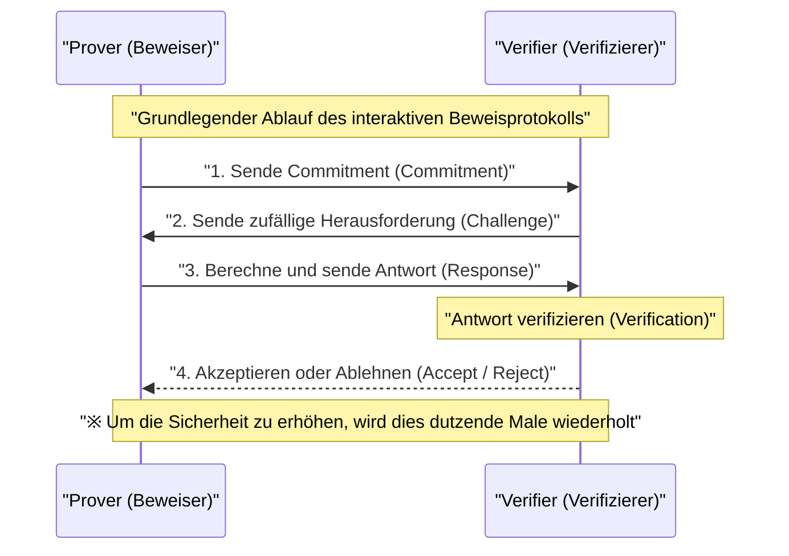
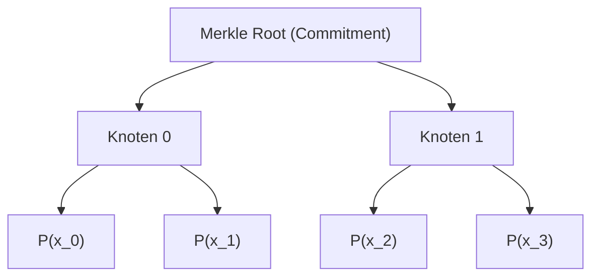
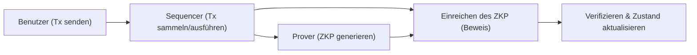

## Einführung

In der heutigen digitalen Gesellschaft sind Datenschutz und Skalierbarkeit zwei der wichtigsten Herausforderungen. Angesichts des steigenden Risikos von Datenlecks und dem unbefugten Missbrauch persönlicher Informationen besteht ein großer Bedarf an einer Technologie, mit der man "beweisen kann, dass man bestimmte Informationen besitzt, ohne diese Informationen dem Gegenüber preiszugeben". Dies wird durch **Zero-Knowledge-Proofs (ZKP)** (wörtlich: Null-Wissen-Beweise) ermöglicht.

Zero-Knowledge-Proofs sind ein kryptographisches Konzept, das in den 1980er Jahren erstmals von Shafi Goldwasser, Silvio Micali und Charles Rackoff vorgeschlagen wurde, aber lange Zeit auf theoretische Forschung beschränkt blieb. Mit dem Aufstieg der Blockchain-Technologie und Web3 hat sich die Situation jedoch schlagartig geändert. ZKP ist als "Zauberstab" ins Rampenlicht gerückt, der gleichzeitig das Skalierbarkeitsproblem (die Grenzen der Verarbeitungskapazität) und das Datenschutzproblem (die Tatsache, dass alle Transaktionen öffentlich sind), mit denen öffentliche Blockchains wie Ethereum konfrontiert sind, löst.

In diesem Artikel werden wir von den grundlegenden Konzepten der Zero-Knowledge-Proofs über die tiefgreifenden mathematischen und kryptographischen Mechanismen der derzeit vorherrschenden **zk-SNARKs** und **zk-STARKs** bis hin zu den neuesten Web3- und Sicherheitsanwendungen wie ZK-Rollups und dezentralen Identitäten (DID) äußerst detailliert und technisch fundiert berichten.

---

## Was sind Zero-Knowledge-Proofs (ZKP)?

Ein Zero-Knowledge-Proof (ZKP) bezieht sich auf ein Protokoll, bei dem ein Beweiser (Prover) gegenüber einem Verifizierer (Verifier) beweist, dass eine bestimmte Aussage wahr ist, "ohne jegliche andere Informationen zu übertragen, als die Tatsache, dass die Aussage wahr ist".

### Drei Anforderungen, die ein ZKP erfüllen muss

Um als ZKP zu gelten, müssen die folgenden drei Eigenschaften strikt erfüllt sein:

1. **Vollständigkeit (Completeness)**
   Wenn die Aussage wahr ist und sowohl der Beweiser als auch der Verifizierer das Protokoll korrekt befolgen, muss der Verifizierer den Beweis mit überwältigender Wahrscheinlichkeit akzeptieren (Accept).
2. **Korrektheit (Soundness)**
   Wenn die Aussage falsch ist, ist es für einen noch so rechenstarken und böswilligen Beweiser unmöglich, den Verifizierer so zu täuschen, dass er den Beweis akzeptiert (bis auf eine vernachlässigbar geringe Wahrscheinlichkeit).
3. **Zero-Knowledge (Null-Wissen)**
   Wenn die Aussage wahr ist, kann der Verifizierer aus dem Beweisprozess keinerlei andere Informationen gewinnen als die Tatsache, "dass die Aussage wahr ist". Aus der Sicht des Verifizierers wird dies durch die mathematische Definition bewiesen, dass es möglich ist, den Beweisprozess zu simulieren (es existiert ein Simulator).

### Interaktive und nicht-interaktive Beweise

Es gibt zwei Arten von ZKP: **interaktive Beweise**, bei denen Beweiser und Verifizierer mehrfach kommunizieren, und **nicht-interaktive Beweise**, bei denen der Beweiser die Beweisdaten nur einmal sendet und der Vorgang damit abgeschlossen ist.

#### Interaktive Beweise (Interactive ZKP)

Frühe ZKPs wurden als interaktive Protokolle entworfen. Die berühmte Analogie der "Ali Baba Höhle" fällt in diese Kategorie. Der allgemeine Ablauf des Protokolls ist wie folgt:

Diese Methode ist leistungsstark, erfordert jedoch, dass der Verifizierer online ist, was für asynchrone verteilte Systeme wie Blockchains unpraktisch ist. In einer Blockchain muss jeder in der Lage sein, vergangene Beweise jederzeit zu verifizieren.

#### Fiat-Shamir-Heuristik und Nicht-Interaktivität

Eine bahnbrechende Methode zur Umwandlung interaktiver Beweise in nicht-interaktive Beweise (Non-Interactive Zero-Knowledge Proof: NIZK) ist die **Fiat-Shamir-Heuristik**.

Anstelle der vom Verifizierer gesendeten "zufälligen Herausforderung" erzeugt der Beweiser selbst eine "pseudozufällige Herausforderung", indem er den Hashwert seines eigenen Commitments und der öffentlichen Informationen verwendet. Unter der Voraussetzung, dass eine kryptographische Hashfunktion (z. B. SHA-256 oder Keccak) als Random Oracle fungiert, kann der Beweiser die Herausforderung nicht im Voraus vorhersagen oder manipulieren und kann den Beweis mit einer einzigen Nachrichtensendung abschließen, während er die gleiche Sicherheit wie ein interaktiver Beweis aufrechterhält.

---

## Technische Details von zk-SNARKs

Derzeit ist **zk-SNARKs** (Zero-Knowledge Succinct Non-Interactive Argument of Knowledge) das am weitesten verbreitete ZKP. Wie der Name schon sagt, handelt es sich um ein Wissensargument (Argument of Knowledge), das Zero-Knowledge (zk) besitzt, eine sehr kleine Beweisgröße aufweist, schnell zu verifizieren ist (Succinct) und nicht-interaktiv (Non-Interactive) ist.

Die Grundlage von zk-SNARKs bildet fortschrittliche algebraische Geometrie und Kryptographie. Es wandelt die Ausführung eines Programms oder einer Berechnung in die Verifizierung von Gleichungen bestimmter Polynome um.

### 1. Umwandlung in Arithmetische Schaltkreise und R1CS (Rank-1 Constraint System)

Zunächst wird eine beliebige Berechnung (ein Algorithmus oder eine Smart-Contract-Logik), die bewiesen werden soll, in einen **arithmetischen Schaltkreis (Arithmetic Circuit)** umgewandelt, der aus Additions- und Multiplikationsgattern besteht.

Als nächstes wird dieser arithmetische Schaltkreis in eine Menge von Matrixgleichungen umgewandelt, die **R1CS (Rank-1 Constraint System)** genannt wird. R1CS ist das Problem, für einen Variablenvektor $x$ die Matrizen $A, B, C$ zu finden, die die folgende Einschränkung erfüllen:

$$ (A \cdot x) \circ (B \cdot x) = C \cdot x $$

Hier steht $\circ$ für das Hadamard-Produkt (elementweises Produkt). Diese Einschränkung garantiert, dass alle logischen Gatter (insbesondere Multiplikationsgatter) im Schaltkreis korrekt berechnet wurden.

### 2. Umwandlung in QAP (Quadratic Arithmetic Program)

Da es unzählige R1CS-Matrixeinschränkungen gibt, wäre es sehr ineffizient, diese einzeln zu verifizieren. Daher werden diese Einschränkungen mithilfe der Lagrange-Interpolation in eine einzige Polynomgleichung komprimiert. Dies ist das **QAP (Quadratic Arithmetic Program)**.

Durch die Umwandlung in ein QAP reduziert sich das zu beweisende Problem auf die Frage: "Ist ein bestimmtes Polynom $P(x)$ durch ein anderes bekanntes Polynom $Z(x)$ teilbar?".

$$ P(x) = L(x) \cdot R(x) - O(x) $$

Hier sind $L(x), R(x), O(x)$ Polynome, die den jeweiligen Zeilen der Matrizen $A, B, C$ entsprechen. Wenn der Beweiser die richtige Lösung (Witness) kennt, wird der Wert an jeder Wurzel (Auswertungspunkt) von $P(x)$ Null, sodass $P(x)$ das Zielpolynom $Z(x)$ als Faktor hat. Das heißt, es existiert ein bestimmtes Polynom $H(x)$, sodass die folgende Gleichung gilt:

$$ P(x) = H(x) \cdot Z(x) $$

Der Verifizierer kann sofort überprüfen, ob die gesamte Berechnung korrekt durchgeführt wurde, indem er lediglich kontrolliert, ob diese Gleichung $P(s) = H(s) \cdot Z(s)$ an einem zufälligen geheimen Punkt $s$ gilt. Dies ist das Geheimnis der "Prägnanz" (Succinctness).

### 3. Elliptische-Kurven-Kryptographie und Paarungen (Bilinear Pairings)

Wenn der Verifizierer jedoch den geheimen Punkt $s$ kennen würde, könnte der Beweiser ein gefälschtes Polynom konstruieren, um die Gleichung zu erfüllen (Zusammenbruch der Korrektheit). Daher muss die Berechnung durchgeführt werden, während $s$ so verschlüsselt ist (mithilfe homomorpher Verschlüsselung), dass niemand es kennt.

Dies wird durch **elliptische Kurven-Paarungen (Bilinear Pairings)** erreicht.
Die Paarung $e$ ist eine spezielle Funktion, mit der man aus zwei verschlüsselten Werten einen Wert berechnen kann, der der Verschlüsselung ihres Produkts entspricht.

$$ e(g_1^a, g_2^b) = e(g_1, g_2)^{ab} $$

Selbst wenn der Beweiser $s$ nicht kennt, verwendet er die verschlüsselten Werte der Potenzen von $s$ (dies wird CRS: Common Reference String genannt), um die verschlüsselten Werte der Polynome $P(s)$ und $H(s)$ zu berechnen. Der Verifizierer nutzt die Paarungsfunktion, um zu überprüfen, ob die Beziehung $P(s) = H(s) \cdot Z(s)$ im verschlüsselten Zustand gilt.

### 4. Trusted Setup (Vertrauenswürdige Einrichtung)

Die größte Schwäche von zk-SNARKs (insbesondere des frühen Groth16) ist, dass ein sogenanntes **Trusted Setup** erforderlich ist, also ein Prozess zur Generierung des geheimen Punktes $s$. Wenn der Ersteller von $s$ den Wert behält und nicht vernichtet, kann er jeden beliebigen falschen Beweis generieren (Toxic Waste Problem).

Um dies zu verhindern, wird eine sogenannte "Ceremony" mithilfe von Multi-Party Computation (MPC) durchgeführt. Dabei kooperieren viele Teilnehmer, um Zufälligkeit bereitzustellen, und solange mindestens ein Teilnehmer ehrlich ist und seinen eigenen Zufallswert vernichtet, bleibt die Sicherheit des gesamten Systems gewahrt. Die Forschung zur Beseitigung dieser Abhängigkeit wurde jedoch über viele Jahre hinweg fortgesetzt.

---

## Technische Details von zk-STARKs

Als Antwort auf die Abhängigkeit vom Trusted Setup und das Risiko der Entschlüsselung der elliptischen Kurven-Kryptographie durch Quantencomputer entstand **zk-STARKs** (Zero-Knowledge Scalable Transparent Argument of Knowledge).

Die von Eli Ben-Sasson und anderen entwickelten STARKs benötigen, wie der Name "Transparent" (Transparenz) andeutet, überhaupt kein Trusted Setup. Zudem zeichnen sie sich durch die Eigenschaft aus, dass, wie der Name "Scalable" (Skalierbarkeit) impliziert, Beweisgröße und Verifizierungszeit auch bei zunehmendem Rechenaufwand effizient bleiben.

### 1. Polynom-Commitment und das FRI-Protokoll

zk-STARKs basieren nicht auf elliptischer Kurven-Kryptographie, sondern stützen ihre Sicherheit **ausschließlich auf Hashfunktionen**. Daher besitzen sie die Eigenschaften von Post-Quanten-Kryptographie (Post-Quantum Cryptography).

Die Überprüfung der Berechnung erfolgt unter Ausnutzung der Eigenschaften von ein- oder mehrdimensionalen Polynomen, nachdem sie in ein Format namens AIR (Algebraic Intermediate Representation) konvertiert wurde. Der Kern von STARKs liegt im **FRI (Fast Reed-Solomon Interactive Oracle Proof of Proximity)**-Protokoll.

Das FRI-Protokoll ist eine Technik zur Überprüfung, "ob eine bestimmte Funktion ausreichend nahe (Proximity) an einem Polynom eines bestimmten Grades liegt". Der Beweiser bindet sich (Commitment) an die Werte des Polynoms als Blätter eines Merkle-Baums (Merkle Tree) (Polynom-Commitment).

Der Verifizierer verlangt die Offenlegung einiger zufälliger Punkte und verwendet Merkle-Beweise, um sicherzustellen, dass diese im Commitment enthalten sind. Indem dies rekursiv wiederholt wird, wird mit überwältigender Wahrscheinlichkeit garantiert, dass der Grad des ursprünglichen Polynoms tatsächlich niedrig ist.

### Vergleich zwischen zk-SNARKs und zk-STARKs

| Eigenschaft | zk-SNARKs | zk-STARKs |
| :--- | :--- | :--- |
| **Kryptographische Annahmen** | Elliptische Kurven, Paarungen | Kollisionsresistente Hashfunktionen |
| **Trusted Setup** | Erforderlich (Plonk etc. sind universell) | Nicht erforderlich (Transparent) |
| **Quantenresistenz** | Nein | Ja |
| **Beweisgröße** | Sehr klein (~200 Byte) | Etwas größer (Dutzende KB) |
| **Rechenaufwand zur Beweisgenerierung** | Hoch | Relativ niedriger als bei SNARKs |
| **Verifizierungskosten (Gas-Gebühren)** | Sehr niedrig (konstant) | Niedrig (steigen logarithmisch) |

In den letzten Jahren sind SNARKs wie Plonk oder Halo2 aufgetaucht, die "kein Trusted Setup benötigen oder bei denen es nur einmal durchgeführt werden muss", sodass die Grenzen zwischen SNARKs und STARKs allmählich verschwimmen, aber die grundlegenden Unterschiede im mathematischen Ansatz bleiben wichtig.

---

## Neueste Anwendungen von Zero-Knowledge-Proofs in Web3 und Sicherheit

ZKP hat den Übergang von der Theorie zur Praxis vollzogen und revolutioniert derzeit die Frontlinien von Web3 und Cybersicherheit.

### 1. Ultimative Skalierung von Ethereum durch ZK-Rollups

L1 (Layer 1) Blockchains wie Ethereum haben aufgrund ihrer starken Ausrichtung auf Dezentralisierung und Sicherheit erhebliche Einschränkungen bei der Skalierbarkeit (das Trilemma). Die definitive L2 (Layer 2) Lösung für dieses Problem sind **ZK-Rollups**.

Bei ZK-Rollups werden Tausende von Transaktionen off-chain (L2) ausgeführt und verarbeitet, und es wird "ein ZKP (Validity Proof)" generiert, das beweist, dass alle korrekt ausgeführt wurden. Der Smart Contract auf der L1-Chain muss lediglich diesen Beweis verifizieren.

Der größte Vorteil von ZK-Rollups besteht im Gegensatz zu Optimistic Rollups (wie Arbitrum oder Optimism) darin, dass keine Herausforderungsperiode (Challenge Period, typischerweise 7 Tage) für Betrugsbeweise (Fraud Proofs) erforderlich ist. Da die Korrektheit kryptographisch garantiert ist, ist das Abheben von Geldern auf L1 (Finality) in dem Moment abgeschlossen, in dem der Beweis verifiziert wird. Derzeit liefern sich Projekte wie zkSync, Starknet, Scroll und Polygon zkEVM einen harten Entwicklungswettbewerb, und die Realisierung von **zkEVM**, das mit der EVM (Ethereum Virtual Machine) kompatibel ist, treibt das schnelle Wachstum des Ökosystems voran.

### 2. Datenschutzwahrende Identitäten (ZKP for Identity)

Die Art und Weise, wie die Personenidentifikation in der digitalen Welt gehandhabt wird, wird sich durch ZKP grundlegend ändern.
Bislang musste man beispielsweise auf die Frage "Sind Sie über 18 Jahre alt?" in herkömmlichen Systemen einen Führerschein oder Reisepass vorlegen und dabei unnötige persönliche Informationen wie Name und Adresse an die andere Partei weitergeben.

Mithilfe von ZKP ist es möglich, auf der Grundlage digitaler Zertifikate (Verifiable Credentials), die von Behörden ausgestellt wurden, **nur die Tatsache mathematisch zu beweisen**, "dass ich, berechnet aus meinem Geburtsdatum, am aktuellen Datum über 18 Jahre alt bin". Der Verifizierer muss lediglich die Signatur des Zertifikats und den ZKP überprüfen, ohne das Geburtsdatum oder die Identität des Benutzers zu erfahren.

Auch Proof of Personhood-Projekte (Beweis der Menschlichkeit) wie Worldcoin speichern oder teilen keine Irisdaten direkt, sondern nutzen einen Mechanismus auf Basis von ZKP, um lediglich zu beweisen, dass man "ein einzigartiger Mensch ist".

### 3. Vertrauliche Smart Contracts und Unternehmensnutzung

Die Eigenschaft öffentlicher Blockchains, dass "alle Daten öffentlich sind", war ein großes Hindernis für Unternehmen, die vertrauliche Transaktionen oder Lieferketteninformationen auf der Blockchain verarbeiten wollen.

Durch den Einsatz von ZKP-Technologie (wie bei datenschutzorientierten Netzwerken wie Aleo oder Aztec) können die Eingabewerte, die Ausgabewerte und sogar die Logik des ausgeführten Smart Contracts selbst verschlüsselt bleiben, während nur die Korrektheit der Zustandsaktualisierung auf der öffentlichen Blockchain festgehalten wird. Dies ermöglicht die Verhinderung von Front-Running (MEV) im DeFi-Bereich (Decentralized Finance) und den Aufbau vertraulicher Konsortium-Netzwerke zwischen Unternehmen, wobei gleichzeitig die hohe Sicherheit einer öffentlichen Blockchain genutzt wird.

---

## Zukünftige Herausforderungen und Perspektiven von ZKP

ZKP ist zweifellos eine Basistechnologie der nächsten Generation, es bleiben jedoch einige Herausforderungen.

1. **Rechenkosten für die Beweisgenerierung und Hardwarebeschleunigung**
   Die Generierung eines ZKP erfordert enorme Polynomoperationen, FFT (Fast Fourier Transform) und MSM (Multi-Scalar Multiplication). Derzeit schreitet die Erforschung spezieller Hardware (FPGA und ASIC) zur Beschleunigung dieser Beweisgenerierung, auch bekannt als **ZKP-Mining** (Prover Network), rasant voran.
2. **Standardisierung und Verbesserung der Developer Experience (DX)**
   Es gibt eine Vielzahl spezialisierter Sprachen zum Schreiben von ZKP-Schaltkreisen, wie Circom, Cairo, Noir und Leo. Standardisierungen, die diese vereinheitlichen, sowie die Ausreifung von Compilern, die automatisch ZKP-Schaltkreise aus bestehendem Rust- oder C++-Code generieren, werden der Schlüssel für die Einführung von ZKP durch gewöhnliche Softwareentwickler sein.

## Fazit

Zero-Knowledge-Proofs (ZKP) haben sich von einer reinen "Technologie zur Erhöhung der Anonymität von Kryptowährungen" zu einer "universellen Technologie, die das Vertrauen (Trust) im gesamten Internet neu definiert" entwickelt. Kleine Beweise, die tief in mathematischen Formeln und der Kryptographie berechnet werden, erweitern die Skalierbarkeit der Blockchain grenzenlos und dienen als robuster Schild zum Schutz unserer Privatsphäre.

Auf dem Weg zu einer echten Massenadaption von Web3 und dem Aufbau eines sicheren und privaten Internets der nächsten Generation wird das Zero-Knowledge-Proof weiterhin als wichtigstes Puzzleteil fungieren. Die zukünftige Entwicklung der ZKP-Technologie sollte man unbedingt im Auge behalten.

---
*Referenzen & Verwandte Links*
- Groth, J. (2016). "On the Size of Pairing-based Non-interactive Arguments"
- Ben-Sasson, E., et al. (2018). "Scalable, transparent, and post-quantum secure computational integrity"
- Vitalik Buterin's blog on zk-SNARKs and zk-STARKs
