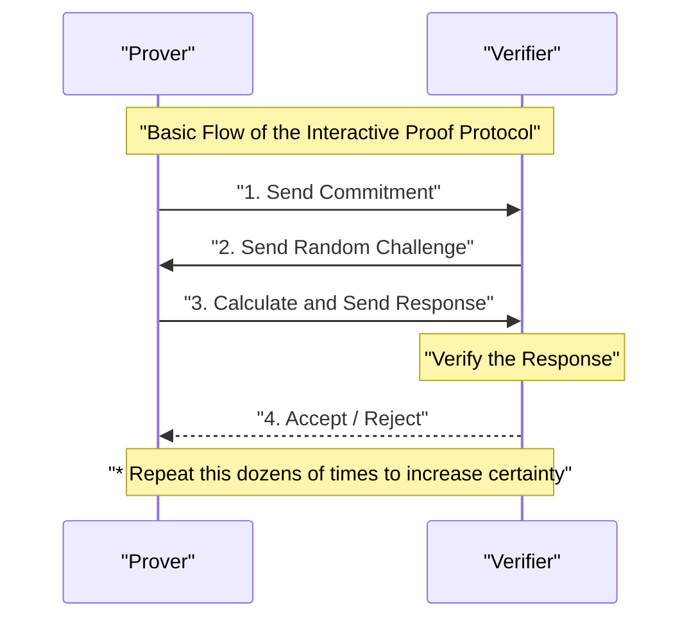
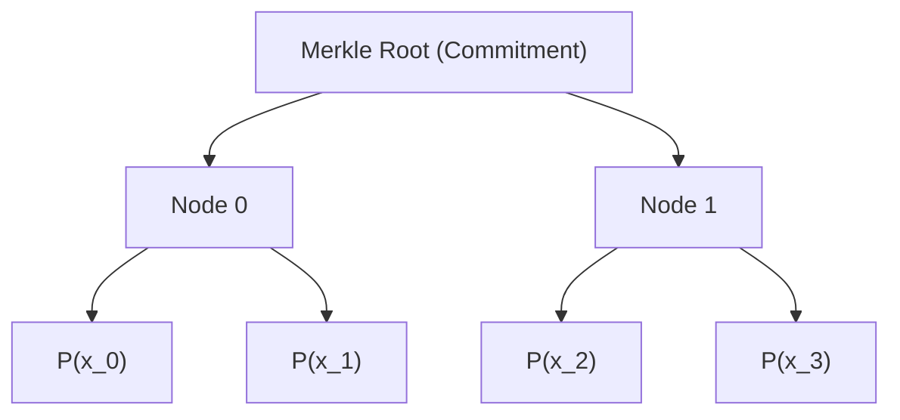
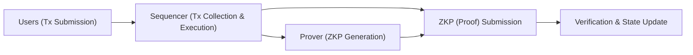

## Introduction

In modern digital society, data privacy and scalability have become two of the most critical challenges. As the risks of personal information leaks and unauthorized use increase, there is a strong demand for technology that allows you to "prove that you have certain information without revealing the information itself to the other party." This is realized by **Zero-Knowledge Proofs (ZKP)**.

Zero-Knowledge Proofs is a concept in cryptography first proposed in the 1980s by Shafi Goldwasser, Silvio Micali, and Charles Rackoff, but for a long time, it remained primarily a theoretical research topic. However, with the rise of blockchain technology and Web3, the situation completely changed. ZKP has suddenly been thrust into the spotlight as the "magic wand" that simultaneously solves the scalability problems (limits of processing capacity) and privacy problems (the fact that all transactions are public) faced by public blockchains like Ethereum.

In this article, we will provide a highly detailed and technically deep explanation, ranging from the basic concepts of Zero-Knowledge Proofs to the profound mathematical and cryptographic mechanisms of the currently mainstream **zk-SNARKs** and **zk-STARKs**, and finally to the latest application examples in Web3 and security, such as ZK-Rollups and Decentralized Identity (DID).

---

## What is a Zero-Knowledge Proof (ZKP)?

A Zero-Knowledge Proof (ZKP) refers to a protocol in which a prover can prove to a verifier that a certain proposition is true, "without transmitting any information other than the fact that the proposition is true."

### The 3 Requirements for ZKP

To be established as a ZKP, the following three properties must be strictly satisfied:

1. **Completeness**
   If the proposition is true, and both the prover and the verifier follow the protocol correctly, the verifier must accept the proof with an overwhelming probability.
2. **Soundness**
   If the proposition is false, no matter how computationally powerful and malicious the prover is, it is impossible (except for a negligibly small probability) to deceive the verifier into accepting the proof.
3. **Zero-Knowledge**
   If the proposition is true, the verifier cannot obtain any information from the proof process other than the fact that "the proposition is true." From the verifier's perspective, this is proven by the mathematical definition that it is possible to simulate the proof process (a simulator exists).

### Interactive and Non-Interactive Proofs

There are two types of ZKPs: **Interactive Proofs**, where the prover and verifier communicate multiple times, and **Non-Interactive Proofs**, where the prover sends the proof data only once.

#### Interactive ZKP

Early ZKPs were designed as interactive protocols. The famous "Ali Baba's Cave" allegory falls under this category. The general flow of the protocol is as follows:

This method is powerful, but the verifier must be online, making it inconvenient to apply to asynchronous distributed systems like blockchains. In a blockchain, anyone must be able to verify past proofs at any time.

#### Fiat-Shamir Heuristic and Non-Interactivity

A breakthrough technique for converting interactive proofs into Non-Interactive Zero-Knowledge Proofs (NIZK) is the **Fiat-Shamir Heuristic**.

Instead of the "random challenge" sent by the verifier, the prover self-generates a "pseudo-random challenge" using their own commitment and the hash value of public information. Assuming that a cryptographic hash function (such as SHA-256 or Keccak) functions as a random oracle, the prover cannot predict or manipulate the challenge in advance, allowing the proof to be completed with a single message transmission while maintaining the same level of security as an interactive proof.

---

## Technical Details of zk-SNARKs

Currently, the most widely used ZKP is **zk-SNARKs** (Zero-Knowledge Succinct Non-Interactive Argument of Knowledge). As the name suggests, it is an Argument of Knowledge that has zero-knowledge properties (zk), features very small proof sizes and fast verification (Succinct), and is Non-Interactive.

The foundation of zk-SNARKs is advanced algebraic geometry and cryptography. It converts the execution and computation of programs into the verification of specific polynomial equations.

### 1. Conversion to Arithmetic Circuits and R1CS (Rank-1 Constraint System)

First, any computation you want to prove (such as an algorithm or smart contract logic) is converted into an **Arithmetic Circuit** consisting of addition and multiplication gates.

Next, this arithmetic circuit is converted into a set of matrix equations called **R1CS (Rank-1 Constraint System)**. R1CS is the problem of finding matrices $A, B, C$ that satisfy the following constraint for a variable vector $x$:

$$ (A \cdot x) \circ (B \cdot x) = C \cdot x $$

Here, $\circ$ represents the Hadamard product (element-wise product). This constraint ensures that all logic gates (especially multiplication gates) in the circuit are calculated correctly.

### 2. Conversion to QAP (Quadratic Arithmetic Program)

Since there are countless R1CS matrix constraints, verifying them individually is highly inefficient. Therefore, Lagrange interpolation is used to compress these constraints into a single polynomial equation. This is the **QAP (Quadratic Arithmetic Program)**.

Through the conversion to QAP, the problem to be proven is reduced to the question: "Is a specific polynomial $P(x)$ divisible by another known polynomial $Z(x)$?"

$$ P(x) = L(x) \cdot R(x) - O(x) $$

Here, $L(x), R(x), O(x)$ are combinations of polynomials corresponding to each row of matrices $A, B, C$, respectively. If the prover knows the correct solution (Witness), the value becomes 0 at each root (evaluation point) of $P(x)$, so $P(x)$ will have the target polynomial $Z(x)$ as a factor. In other words, there exists a polynomial $H(x)$ such that the following equation holds:

$$ P(x) = H(x) \cdot Z(x) $$

The verifier only needs to check whether this equation $P(s) = H(s) \cdot Z(s)$ holds at a certain random secret point $s$ to instantly verify that the entire computation was performed correctly. This is the secret of its "Succinctness."

### 3. Elliptic Curve Cryptography and Bilinear Pairings

However, if the verifier knows the secret point $s$, it would be possible for the prover to fabricate a fake polynomial to satisfy the equation (a collapse of soundness). Therefore, it is necessary to perform computations while keeping $s$ encrypted (using homomorphic encryption) so that no one knows it.

This is achieved using **Bilinear Pairings** on elliptic curves.
A pairing $e$ is a special function that can calculate a value equivalent to the encryption of the product of two encrypted values.

$$ e(g_1^a, g_2^b) = e(g_1, g_2)^{ab} $$

Even without knowing $s$ itself, the prover calculates the encrypted values of the polynomials $P(s)$ and $H(s)$ using encrypted values of powers of $s$ (this is called the CRS: Common Reference String). The verifier uses the pairing function to verify whether the relationship $P(s) = H(s) \cdot Z(s)$ holds while the values remain encrypted.

### 4. Trusted Setup

The biggest weakness of zk-SNARKs (especially early ones like Groth16) is that they require a process to generate the secret point $s$, known as a **Trusted Setup**. If the creator of $s$ retains the value without destroying it, they can generate arbitrary fake proofs (the Toxic Waste problem).

To prevent this, a ritual called a "Ceremony" is conducted using Multi-Party Computation (MPC). Numerous participants cooperate to provide randomness, and as long as at least one participant honestly destroys their random value, the security of the entire system is maintained. However, research to eliminate this dependency has been ongoing for many years.

---

## Technical Details of zk-STARKs

**zk-STARKs** (Zero-Knowledge Scalable Transparent Argument of Knowledge) emerged as an answer to the reliance on trusted setups and the risk of elliptic curve cryptography being decrypted by quantum computers.

Developed by Eli Ben-Sasson and others, STARKs feature no need for a trusted setup, living up to the name "Transparent," and maintain efficient proof sizes and verification times even as the amount of computation increases, living up to the name "Scalable."

### 1. Polynomial Commitments and the FRI Protocol

zk-STARKs base their security entirely on **hash functions**, rather than elliptic curve cryptography. Therefore, they have the properties of Post-Quantum Cryptography.

Computation verification is performed by utilizing the properties of one-dimensional or multi-dimensional polynomials after being converted into a format called AIR (Algebraic Intermediate Representation). The core of STARKs lies in the **FRI (Fast Reed-Solomon Interactive Oracle Proof of Proximity)** protocol.

The FRI protocol is a technique for verifying "whether a certain function is sufficiently close to a polynomial of a specific degree (Proximity)." The prover commits the polynomial's values as leaves of a Merkle Tree (Polynomial Commitment).

The verifier requests the disclosure of several random points and uses Merkle proofs to confirm that they are included in the commitment. By repeating this recursively, it guarantees with overwhelming probability that the original polynomial actually has a low degree.

### Comparison of zk-SNARKs and zk-STARKs

| Feature | zk-SNARKs | zk-STARKs |
| :--- | :--- | :--- |
| **Cryptographic Assumptions** | Elliptic curves, Pairings | Collision-resistant hash functions |
| **Trusted Setup** | Required (Universal for Plonk, etc.) | Not required (Transparent) |
| **Quantum Resistance** | No | Yes |
| **Proof Size** | Very small (~200 Bytes) | Somewhat large (Tens of KB) |
| **Proof Generation Computational Cost** | High | Relatively lower than SNARKs |
| **Verification Cost (Gas Fee)** | Very low (Constant) | Low (Increases logarithmically) |

In recent years, SNARKs that "do not require a trusted setup, or only require it once" like Plonk and Halo2 have appeared, and the boundary between SNARKs and STARKs is gradually blurring, but the fundamental difference in mathematical approaches remains important.

---

## Latest Applications of Zero-Knowledge Proofs in Web3 and Security

Having transitioned from theory to practice, ZKPs are now sparking a revolution at the forefront of Web3 and cybersecurity.

### 1. Ultimate Scaling of Ethereum with ZK-Rollups

L1 (Layer 1) blockchains like Ethereum have significant constraints on scalability (the trilemma) due to their emphasis on decentralization and security. The definitive L2 (Layer 2) solution to solve this is **ZK-Rollups**.

In a ZK-Rollup, thousands of transactions are executed and processed off-chain (L2), generating a "single ZKP (Validity Proof)" indicating that they were all executed correctly. The smart contract on the L1 chain only needs to verify this proof.

The biggest advantage of ZK-Rollups is that, unlike Optimistic Rollups (such as Arbitrum and Optimism), they do not require a challenge period (typically 7 days) for Fraud Proofs. Because correctness is cryptographically guaranteed, fund withdrawals to L1 (Finality) are completed the moment the proof is verified. Currently, projects like zkSync, Starknet, Scroll, and Polygon zkEVM are engaged in fierce development competition, and the realization of **zkEVMs**, which are compatible with the EVM (Ethereum Virtual Machine), is driving rapid ecosystem growth.

### 2. Privacy-Preserving Identity (ZKP for Identity)

The nature of personal authentication in the digital world will also be fundamentally changed by ZKPs.
For example, in response to the question, "Are you 18 or older?", conventional systems required presenting a driver's license or passport, handing over unnecessary personal information like name and address to the other party.

By using ZKPs, based on a digital certificate (Verifiable Credential) issued by a public institution, it becomes possible to **mathematically prove only the fact** that "calculated from my date of birth, I am 18 or older on the current date." The verifier only needs to verify the certificate's signature and the ZKP, without knowing the user's date of birth or identity.

Projects for Proof of Personhood like Worldcoin also incorporate a mechanism to prove only that one is a "unique human" using ZKPs, rather than storing and sharing iris data directly.

### 3. Confidential Smart Contracts and Enterprise Use

The property of public blockchains that "all data is public" has been a major barrier for companies handling confidential transactions and supply chain information on the blockchain.

By using ZKP technology (such as privacy-focused networks like Aleo and Aztec), the input values, output values of transactions, and even the smart contract logic executed can be kept encrypted, while only the validity of state updates is etched onto the public chain. This makes it possible to prevent front-running (MEV) in DeFi (Decentralized Finance) and to build confidential consortium networks among enterprises, all while enjoying the high security of public chains.

---

## Future Challenges and Prospects for ZKP

While ZKPs are undoubtedly a next-generation foundational technology, several challenges remain.

1. **Proof Generation Computational Costs and Hardware Acceleration**
   Generating a ZKP requires massive polynomial operations, FFT (Fast Fourier Transform), and MSM (Multi-Scalar Multiplication). Currently, research into dedicated hardware (FPGAs and ASICs) to accelerate this proof generation, known as **ZKP Mining** (Prover Networks), is rapidly advancing.
2. **Standardization and Improvement of Developer Experience (DX)**
   Dedicated languages for writing ZKP circuits, such as Circom, Cairo, Noir, and Leo, are proliferating. A standard unifying these and the maturation of compilers that automatically generate ZKP circuits from existing languages like Rust and C++ will be key to general software engineers adopting ZKPs.

## Conclusion

Zero-Knowledge Proofs (ZKP) have evolved from merely a "technology to enhance cryptocurrency anonymity" to a "general-purpose technology redefining trust across the internet." Small proofs calculated deep within mathematics and cryptography will infinitely scale blockchain capabilities and act as a strong shield protecting our privacy.

Towards true mass adoption of Web3 and the construction of a secure and private next-generation internet, Zero-Knowledge Proofs will continue to function as the most crucial piece. We must keep a close eye on the future evolution of ZKP technology.

---
*References and Related Links*
- Groth, J. (2016). "On the Size of Pairing-based Non-interactive Arguments"
- Ben-Sasson, E., et al. (2018). "Scalable, transparent, and post-quantum secure computational integrity"
- Vitalik Buterin's blog on zk-SNARKs and zk-STARKs
