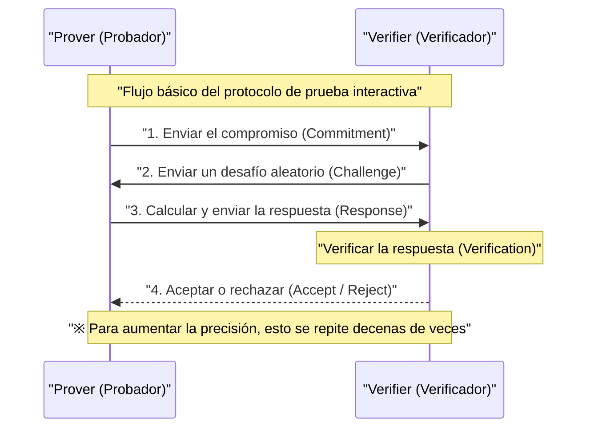
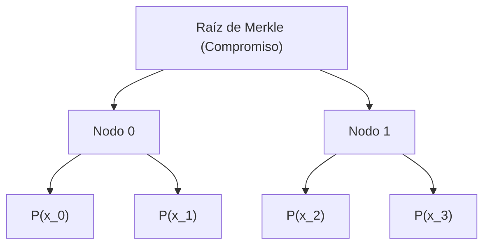
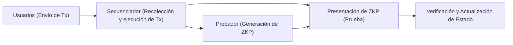

## Introducción

En la sociedad digital actual, la privacidad de los datos y la escalabilidad se han convertido en dos de los problemas más importantes. Con el aumento del riesgo de fuga de información personal y uso no autorizado, existe una fuerte demanda de una tecnología que "demuestre que uno tiene cierta información sin revelar la información en sí a la otra parte". Esto se logra mediante la **Prueba de Conocimiento Cero (Zero-Knowledge Proof: ZKP)**.

La prueba de conocimiento cero es un concepto de teoría criptográfica propuesto por primera vez en la década de 1980 por Shafi Goldwasser, Silvio Micali y Charles Rackoff, pero permaneció como un estudio teórico durante mucho tiempo. Sin embargo, con el surgimiento de la tecnología blockchain y Web3, la situación ha cambiado por completo. Como una "varita mágica" para resolver simultáneamente el problema de escalabilidad (límites de capacidad de procesamiento) y el problema de privacidad (todas las transacciones son públicas) que enfrentan las blockchains públicas como Ethereum, las ZKP de repente fueron el centro de atención.

En este artículo, profundizaremos técnica y detalladamente desde los conceptos básicos de las pruebas de conocimiento cero, hasta los profundos mecanismos matemáticos y criptográficos de **zk-SNARKs** y **zk-STARKs** (actualmente dominantes), y ejemplos recientes de aplicaciones en Web3 y seguridad, como ZK-Rollups y la identidad descentralizada (DID).

---

## ¿Qué es la Prueba de Conocimiento Cero (ZKP)?

La prueba de conocimiento cero (ZKP) se refiere a un protocolo en el cual un probador (Prover) demuestra a un verificador (Verifier) que una proposición es cierta, de tal manera que "no se transmite absolutamente ninguna otra información más que el hecho de que la proposición es cierta".

### 3 requisitos que debe cumplir una ZKP

Para establecerse como una ZKP, debe cumplir estrictamente con las tres propiedades siguientes:

1. **Completitud (Completeness)**
   Si la proposición es verdadera y tanto el probador como el verificador siguen correctamente el protocolo, el verificador debe aceptar la prueba con una probabilidad abrumadora.
2. **Solidez (Soundness)**
   Si la proposición es falsa, sin importar cuán alta sea la capacidad de cálculo y cuán malicioso sea el probador, es imposible engañar al verificador para que acepte la prueba (excepto por una probabilidad tan pequeña que puede ser ignorada).
3. **Conocimiento Cero (Zero-Knowledge)**
   Si la proposición es verdadera, el verificador no puede obtener ninguna información del proceso de prueba más allá del hecho de que "la proposición es verdadera". Desde la perspectiva del verificador, se demuestra mediante la definición matemática de que es posible simular el proceso de prueba (existe un simulador).

### Pruebas interactivas y no interactivas

Existen dos tipos de ZKP: **pruebas interactivas**, donde el probador y el verificador se comunican múltiples veces, y **pruebas no interactivas**, donde el probador envía los datos de la prueba solo una vez.

#### Pruebas interactivas (Interactive ZKP)

Las primeras ZKP se diseñaron como protocolos interactivos. La famosa metáfora de la "Cueva de Alí Babá" entra en esta categoría. El flujo de un protocolo general es el siguiente:

Este método es poderoso, pero el verificador debe estar en línea, lo cual es inconveniente para aplicar en sistemas descentralizados asincrónicos como blockchain. En blockchain, cualquiera debe poder verificar pruebas pasadas en cualquier momento.

#### Transformación de Fiat-Shamir (Fiat-Shamir Heuristic) y no interactividad

Un método revolucionario para convertir pruebas interactivas en pruebas no interactivas (Non-Interactive Zero-Knowledge Proof: NIZK) es la **Transformación de Fiat-Shamir**.

En lugar del "desafío aleatorio" enviado por el verificador, el probador autogenera un "desafío pseudoaleatorio" utilizando su propio compromiso y el valor hash de la información pública. Suponiendo que una función hash criptográfica (como SHA-256 o Keccak) funcione como un oráculo aleatorio (Random Oracle), el probador no puede predecir ni manipular el desafío con anticipación, lo que le permite completar la prueba enviando un solo mensaje manteniendo el mismo nivel de seguridad que una prueba interactiva.

---

## Detalles técnicos de zk-SNARKs

Actualmente, las ZKP más utilizadas son las **zk-SNARKs** (Zero-Knowledge Succinct Non-Interactive Argument of Knowledge). Como su nombre indica, tienen conocimiento cero (zk), el tamaño de la prueba es muy pequeño y la verificación es rápida (Succinct), y es un argumento de conocimiento no interactivo (Non-Interactive Argument of Knowledge).

La base de las zk-SNARKs es geometría algebraica avanzada y teoría criptográfica. Convierten la ejecución de programas y cálculos en la verificación de ecuaciones polinómicas específicas.

### 1. Transformación a circuitos aritméticos y R1CS (Rank-1 Constraint System)

Primero, cualquier cálculo que se desee probar (un algoritmo o la lógica de un contrato inteligente) se convierte en un **circuito aritmético (Arithmetic Circuit)** que consiste en puertas de suma y multiplicación.

A continuación, este circuito aritmético se convierte en un conjunto de ecuaciones matriciales llamado **R1CS (Rank-1 Constraint System)**. R1CS es el problema de encontrar las matrices $A, B, C$ que cumplan con la siguiente restricción para un vector de variables $x$:

$$ (A \cdot x) \circ (B \cdot x) = C \cdot x $$

Aquí, $\circ$ representa el producto de Hadamard (producto elemento a elemento). Esta restricción garantiza que todas las puertas lógicas del circuito (especialmente las puertas de multiplicación) se calculen correctamente.

### 2. Transformación a QAP (Quadratic Arithmetic Program)

Dado que hay innumerables restricciones matriciales en R1CS, verificarlas individualmente es muy ineficiente. Por lo tanto, utilizando la interpolación de Lagrange, estas restricciones se comprimen en una sola ecuación polinómica. Esto es el **QAP (Quadratic Arithmetic Program)**.

Al transformarlo en un QAP, el problema a probar se reduce a la pregunta: "¿Es un polinomio específico $P(x)$ divisible por otro polinomio conocido $Z(x)$?".

$$ P(x) = L(x) \cdot R(x) - O(x) $$

Aquí, $L(x), R(x), O(x)$ son combinaciones de polinomios correspondientes a cada fila de las matrices $A, B, C$ respectivamente. Si el probador conoce la solución correcta (Witness), el valor será 0 en cada raíz (punto de evaluación) de $P(x)$, por lo que $P(x)$ tendrá el polinomio objetivo $Z(x)$ como factor. Es decir, existe cierto polinomio $H(x)$ tal que se cumple la siguiente ecuación:

$$ P(x) = H(x) \cdot Z(x) $$

El verificador puede verificar instantáneamente que todo el cálculo se realizó correctamente comprobando si esta ecuación $P(s) = H(s) \cdot Z(s)$ es cierta en un punto secreto aleatorio $s$. Este es el secreto de "Succinct (Conciso)".

### 3. Criptografía de curva elíptica y emparejamientos (Bilinear Pairings)

Sin embargo, si el verificador conociera el punto secreto $s$, el probador podría falsificar un polinomio para satisfacer la ecuación (colapso de la solidez). Por lo tanto, es necesario realizar los cálculos manteniendo $s$ encriptado para que nadie lo conozca (utilizando encriptación homomórfica).

Lo que logra esto es el **emparejamiento de curva elíptica (Bilinear Pairings)**.
El emparejamiento $e$ es una función especial que permite calcular, a partir de dos valores encriptados, un valor equivalente al encriptado de su producto.

$$ e(g_1^a, g_2^b) = e(g_1, g_2)^{ab} $$

El probador, sin conocer $s$ en sí, utiliza los valores encriptados de las potencias de $s$ (esto se llama CRS: Common Reference String) para calcular los valores encriptados de los polinomios $P(s)$ y $H(s)$. El verificador utiliza la función de emparejamiento para verificar si se cumple la relación $P(s) = H(s) \cdot Z(s)$ mientras los valores permanecen encriptados.

### 4. Configuración confiable (Trusted Setup)

La mayor debilidad de las zk-SNARKs (especialmente el inicial Groth16) es que requieren un proceso para generar el punto secreto $s$, la llamada **configuración confiable**. Si el generador de $s$ conserva ese valor sin destruirlo, sería capaz de generar cualquier prueba falsa (el problema de Toxic Waste).

Para prevenir esto, se lleva a cabo una ceremonia llamada "Ceremony" que utiliza Multi-Party Computation (MPC). Muchos participantes colaboran para proporcionar aleatoriedad, y si al menos uno de los participantes descarta honestamente su valor aleatorio, el sistema mantendrá la seguridad en general. Sin embargo, la investigación para eliminar esta dependencia ha continuado durante muchos años.

---

## Detalles técnicos de zk-STARKs

Como respuesta a la dependencia de la configuración confiable y al riesgo de descifrar la criptografía de curva elíptica por parte de las computadoras cuánticas, aparecieron las **zk-STARKs** (Zero-Knowledge Scalable Transparent Argument of Knowledge).

Las STARKs, desarrolladas por Eli Ben-Sasson y otros, no requieren de una configuración confiable, haciendo honor a la palabra "Transparent" (Transparencia), y tienen la característica de que el tamaño de la prueba y el tiempo de verificación se mantienen eficientes incluso si aumenta la cantidad de cálculo, honrando la palabra "Scalable" (Escalabilidad).

### 1. Compromiso polinómico y protocolo FRI

Las zk-STARKs no basan su seguridad en la criptografía de curva elíptica, sino **exclusivamente en funciones hash**. Por lo tanto, poseen propiedades de criptografía poscuántica (Post-Quantum Cryptography).

La verificación del cálculo se realiza utilizando las propiedades de polinomios de una o múltiples dimensiones después de convertirse a un formato llamado AIR (Algebraic Intermediate Representation). El núcleo de las STARKs reside en el protocolo **FRI (Fast Reed-Solomon Interactive Oracle Proof of Proximity)**.

El protocolo FRI es una técnica para verificar si "cierta función es lo suficientemente cercana (Proximity) a un polinomio de un grado específico". El probador compromete los valores del polinomio como hojas de un árbol de Merkle (Merkle Tree) (compromiso polinómico).

El verificador solicita que se revelen varios puntos aleatorios y utiliza la prueba de Merkle para confirmar que están incluidos en el compromiso. Al repetir esto de forma recursiva, se garantiza con abrumadora probabilidad que el grado del polinomio original es, de hecho, bajo.

### Comparación entre zk-SNARKs y zk-STARKs

| Característica | zk-SNARKs | zk-STARKs |
| :--- | :--- | :--- |
| **Supuestos criptográficos** | Curva elíptica, emparejamientos | Funciones hash resistentes a colisiones |
| **Configuración confiable** | Necesaria (Plonk, etc., son universales) | Innecesaria (Transparente) |
| **Resistencia cuántica** | No | Sí |
| **Tamaño de la prueba** | Muy pequeño (~200 Bytes) | Algo grande (decenas de KB) |
| **Costo computacional de generación de prueba** | Alto | Relativamente más bajo que SNARKs |
| **Costo de verificación (Gas)** | Muy bajo (constante) | Bajo (crece de forma logarítmica) |

En los últimos años, con la aparición de "SNARKs que no requieren una configuración confiable, o que solo la requieren una vez", como Plonk y Halo2, la frontera entre SNARKs y STARKs se está volviendo cada vez más difusa, pero la diferencia en los enfoques matemáticos fundamentales sigue siendo importante.

---

## Las últimas aplicaciones de las pruebas de conocimiento cero en Web3 y Seguridad

Tras pasar de la teoría a la práctica, las ZKP están revolucionando ahora la primera línea de la Web3 y la ciberseguridad.

### 1. Escalado definitivo de Ethereum mediante ZK-Rollups

Las blockchains L1 (capa 1) como Ethereum se enfrentan a importantes limitaciones de escalabilidad (el trilema) debido a su énfasis en la descentralización y la seguridad. La solución definitiva a nivel L2 (capa 2) para resolver esto son los **ZK-Rollups**.

En un ZK-Rollup, se ejecutan y procesan miles de transacciones fuera de la cadena (L2) y se genera "una ZKP (Validity Proof)" que demuestra que todas se ejecutaron correctamente. El contrato inteligente en la cadena L1 solo tiene que verificar esta prueba.

La mayor ventaja de los ZK-Rollups es que, a diferencia de los Optimistic Rollups (como Arbitrum u Optimism), no requieren un período de desafío (normalmente 7 días) para las pruebas de fraude (Fraud Proof). Debido a que la corrección está garantizada criptográficamente, el retiro de fondos a la L1 (Finality) se completa en el momento en que se verifica la prueba. Actualmente, proyectos como zkSync, Starknet, Scroll y Polygon zkEVM libran una feroz competencia en desarrollo, y la consecución de una **zkEVM** (compatible con Ethereum Virtual Machine) está acelerando drásticamente el ecosistema.

### 2. Identidad con protección de privacidad (ZKP for Identity)

La forma de autenticación personal en el mundo digital también está cambiando fundamentalmente gracias a las ZKP.
Por ejemplo, en respuesta a la pregunta "¿Tienes 18 años o más?", los sistemas convencionales requerían presentar una licencia de conducir o un pasaporte, entregando a la otra parte información personal innecesaria como el nombre y la dirección.

Usando ZKP, es posible **probar matemáticamente solo el hecho** de que, "calculando a partir de mi fecha de nacimiento en un certificado digital (Verifiable Credential) emitido por un organismo público, tengo 18 años o más en la fecha actual". El verificador solo necesita verificar la firma del certificado y la ZKP, sin poder conocer la fecha de nacimiento ni la identidad del usuario.

Incluso en proyectos de prueba de humanidad (Proof of Personhood) como Worldcoin, en lugar de almacenar y compartir los datos del iris directamente, se incorpora un mecanismo que utiliza ZKP para probar únicamente "el hecho de ser un ser humano único".

### 3. Contratos inteligentes confidenciales y uso empresarial

La naturaleza "totalmente pública" de las cadenas de bloques públicas ha sido una gran barrera para que las empresas gestionen transacciones confidenciales y la información de la cadena de suministro en la cadena de bloques.

Usando la tecnología ZKP (por ejemplo, redes especializadas en privacidad como Aleo o Aztec), es posible registrar solo la validez de la actualización del estado en la cadena pública manteniendo cifrados los valores de entrada, los valores de salida e incluso la propia lógica del contrato inteligente ejecutado. Esto hace posible la prevención de la manipulación de precios (MEV) en DeFi (finanzas descentralizadas) y la construcción de redes de consorcios confidenciales entre empresas, todo mientras se disfruta de la alta seguridad de una cadena pública.

---

## Retos futuros y perspectivas de ZKP

Si bien ZKP es, sin duda, una tecnología fundamental de próxima generación, todavía quedan algunos retos.

1. **Costo computacional de la generación de pruebas y aceleración de hardware**
   La generación de ZKP requiere un enorme volumen de cálculos de polinomios, FFT (Transformada Rápida de Fourier) y MSM (Multiplicación Multiescalar). Actualmente, el desarrollo de hardware especializado (FPGA y ASIC) para acelerar esta generación de pruebas, es decir, la investigación de la **minería ZKP** (Prover Network), avanza rápidamente.
2. **Estandarización y mejora de la experiencia del desarrollador (DX)**
   Existe una proliferación de lenguajes dedicados para describir circuitos ZKP, como Circom, Cairo, Noir, Leo, etc. La madurez de un estándar que unifique todo esto y la creación de compiladores que generen automáticamente circuitos ZKP a partir de lenguajes como Rust o C++ serán la clave para la adopción de ZKP por parte de los ingenieros de software en general.

## Conclusión

La Prueba de Conocimiento Cero (ZKP) ha evolucionado de ser una simple "tecnología para aumentar el anonimato de las criptomonedas" a una "tecnología de propósito general que redefine la confianza (Trust) de todo el internet". Las pequeñas pruebas, calculadas en las profundidades de las matemáticas y la teoría de la criptografía, expanden infinitamente la escalabilidad de la cadena de bloques y sirven como un escudo sólido para proteger nuestra privacidad.

Hacia la verdadera adopción masiva de Web3 y la construcción de un Internet de próxima generación seguro y privado, las pruebas de conocimiento cero continuarán funcionando como la pieza más importante. No podemos quitarle los ojos de encima a la futura evolución de la tecnología ZKP.

---
*Referencias y enlaces relacionados*
- Groth, J. (2016). "On the Size of Pairing-based Non-interactive Arguments"
- Ben-Sasson, E., et al. (2018). "Scalable, transparent, and post-quantum secure computational integrity"
- Vitalik Buterin's blog on zk-SNARKs and zk-STARKs
