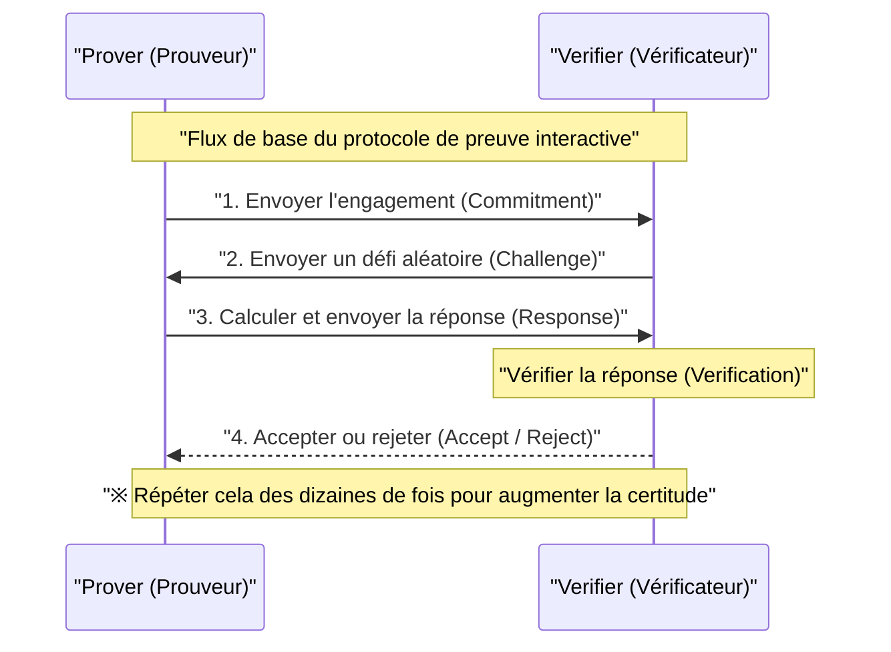
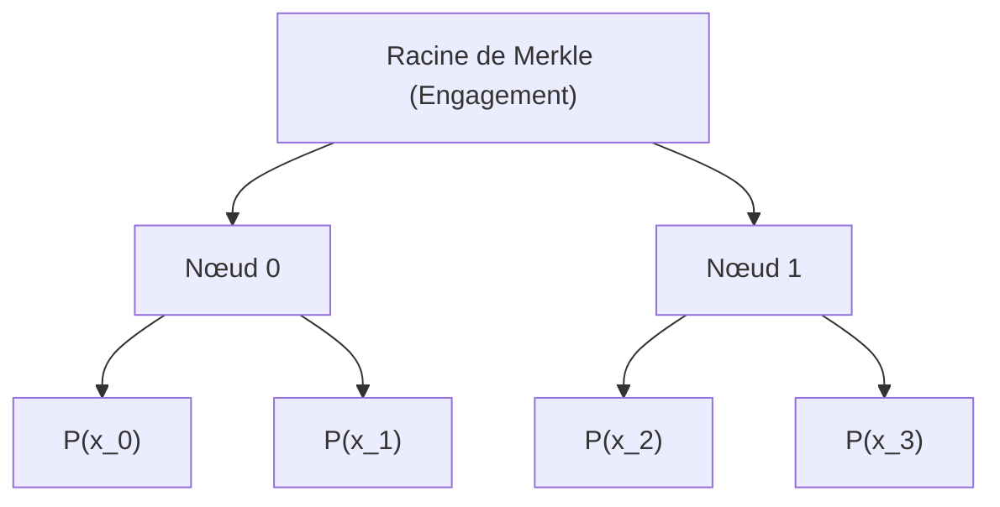
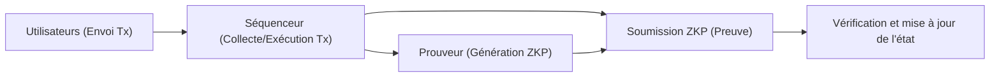

## Introduction

Dans la société numérique moderne, la confidentialité des données et l'évolutivité sont devenues deux des enjeux les plus importants. Face aux risques croissants de fuite et d'utilisation abusive des informations personnelles, il y a une forte demande pour une technologie qui permette de « prouver que l'on possède une information sans la révéler à l'autre partie ». C'est ce que réalise la **preuve à divulgation nulle de connaissance (Zero-Knowledge Proof : ZKP)**.

La preuve à divulgation nulle de connaissance est un concept de théorie cryptographique proposé pour la première fois dans les années 1980 par Shafi Goldwasser, Silvio Micali et Charles Rackoff, mais qui est longtemps resté au stade de la recherche théorique. Cependant, avec l'émergence de la technologie blockchain et du Web3, la situation a radicalement changé. Le ZKP est soudainement apparu sur le devant de la scène comme une « baguette magique » permettant de résoudre simultanément les problèmes d'évolutivité (limites de capacité de traitement) et de confidentialité (le fait que toutes les transactions soient publiques) auxquels sont confrontées les blockchains publiques comme Ethereum.

Dans cet article, nous explorerons en détail et en profondeur les concepts fondamentaux des preuves à divulgation nulle, les mécanismes mathématiques et cryptographiques profonds des **zk-SNARKs** et **zk-STARKs** actuellement dominants, ainsi que des exemples d'applications récentes dans le Web3 et la sécurité, tels que les ZK-Rollups et l'identité décentralisée (DID).

---

## Qu'est-ce que la preuve à divulgation nulle de connaissance (ZKP) ?

La preuve à divulgation nulle de connaissance (ZKP) désigne un protocole dans lequel un prouveur (Prover) prouve à un vérificateur (Verifier) qu'une certaine proposition est vraie, de telle manière qu'« aucune information autre que la véracité de cette proposition ne soit transmise ».

### Les 3 exigences que le ZKP doit satisfaire

Pour être considéré comme un ZKP, le protocole doit satisfaire strictement aux trois propriétés suivantes :

1. **Complétude (Completeness)**
   Si la proposition est vraie et que le prouveur et le vérificateur suivent tous deux correctement le protocole, le vérificateur doit accepter la preuve (Accept) avec une probabilité écrasante.
2. **Solidité (Soundness)**
   Si la proposition est fausse, même un prouveur malveillant doté d'une puissance de calcul extrême ne pourra (sauf probabilité négligeable) tromper le vérificateur pour lui faire accepter la preuve.
3. **Divulgation nulle (Zero-Knowledge)**
   Si la proposition est vraie, le vérificateur ne peut obtenir du processus de preuve aucune information autre que le fait que « la proposition est vraie ». Du point de vue du vérificateur, cela est prouvé par la définition mathématique qu'il est possible de simuler le processus de preuve (qu'il existe un simulateur).

### Preuves interactives et preuves non interactives

Il existe deux types de ZKP : les **preuves interactives**, dans lesquelles le prouveur et le vérificateur communiquent plusieurs fois, et les **preuves non interactives**, dans lesquelles le prouveur envoie les données de la preuve une seule fois pour terminer le processus.

#### Preuves interactives (Interactive ZKP)

Les premiers ZKP ont été conçus comme des protocoles interactifs. La célèbre parabole de la « grotte d'Ali Baba » en est un exemple. Le déroulement général du protocole est le suivant :

Cette méthode est puissante, mais elle exige que le vérificateur soit en ligne et s'avère peu pratique à appliquer à des systèmes distribués asynchrones comme la blockchain. Dans une blockchain, n'importe qui doit pouvoir vérifier une preuve passée à tout moment.

#### Transformation de Fiat-Shamir (Fiat-Shamir Heuristic) et non-interactivité

La **transformation de Fiat-Shamir** est une méthode révolutionnaire pour convertir une preuve interactive en une preuve non interactive (Non-Interactive Zero-Knowledge Proof : NIZK).

Au lieu du « défi aléatoire » envoyé par le vérificateur, le prouveur génère lui-même un « défi pseudo-aléatoire » à l'aide de son propre engagement et de la valeur de hachage des informations publiques. En supposant qu'une fonction de hachage cryptographique (par exemple SHA-256 ou Keccak) agisse comme un oracle aléatoire, le prouveur ne peut ni prédire ni manipuler le défi à l'avance, ce qui lui permet de compléter la preuve en envoyant un seul message tout en maintenant une sécurité équivalente à celle d'une preuve interactive.

---

## Détails techniques des zk-SNARKs

Actuellement, les **zk-SNARKs** (Zero-Knowledge Succinct Non-Interactive Argument of Knowledge) sont les ZKP les plus largement utilisés. Comme leur nom l'indique, ils possèdent la propriété de divulgation nulle (zk), offrent des preuves de très petite taille et rapides à vérifier (Succinct), sont non interactifs (Non-Interactive) et constituent un argument de connaissance (Argument of Knowledge).

Le fondement des zk-SNARKs repose sur la géométrie algébrique avancée et la théorie cryptographique. Ils convertissent l'exécution ou le calcul d'un programme en la vérification d'une équation polynomiale spécifique.

### 1. Conversion en circuit arithmétique et R1CS (Rank-1 Constraint System)

Tout d'abord, tout calcul que l'on souhaite prouver (un algorithme ou la logique d'un contrat intelligent) est converti en un **circuit arithmétique (Arithmetic Circuit)** composé de portes d'addition et de multiplication.

Ensuite, ce circuit arithmétique est converti en un ensemble d'équations matricielles appelé **R1CS (Rank-1 Constraint System)**. Le R1CS est le problème de trouver, pour un vecteur de variables $x$, des matrices $A, B, C$ qui satisfont la contrainte suivante :

$$ (A \cdot x) \circ (B \cdot x) = C \cdot x $$

Où $\circ$ représente le produit de Hadamard (produit élément par élément). Cette contrainte garantit que toutes les portes logiques (en particulier les portes de multiplication) du circuit sont calculées correctement.

### 2. Conversion en QAP (Quadratic Arithmetic Program)

Puisqu'il existe un nombre infini de contraintes matricielles R1CS, il serait très inefficace de les vérifier individuellement. Par conséquent, à l'aide de l'interpolation de Lagrange, ces contraintes sont compressées en une seule équation polynomiale. C'est ce qu'on appelle le **QAP (Quadratic Arithmetic Program)**.

Par la conversion en QAP, le problème à prouver se réduit à la question : « Un polynôme spécifique $P(x)$ est-il divisible par un autre polynôme connu $Z(x)$ ? ».

$$ P(x) = L(x) \cdot R(x) - O(x) $$

Ici, $L(x), R(x), O(x)$ sont des combinaisons des polynômes correspondant respectivement à chaque ligne des matrices $A, B, C$. Si le prouveur connaît la bonne solution (Witness), la valeur de $P(x)$ sera de 0 à chaque racine (point d'évaluation), ce qui signifie que $P(x)$ aura le polynôme cible $Z(x)$ comme facteur. En d'autres termes, il existe un polynôme $H(x)$ tel que l'équation suivante soit satisfaite :

$$ P(x) = H(x) \cdot Z(x) $$

Le vérificateur peut vérifier instantanément que l'ensemble du calcul a été effectué correctement en vérifiant simplement si cette équation $P(s) = H(s) \cdot Z(s)$ tient pour un point secret aléatoire $s$. C'est le secret de la « concision (Succinct) ».

### 3. Cryptographie sur les courbes elliptiques et couplages (Bilinear Pairings)

Cependant, si le vérificateur connaît le point secret $s$, il devient possible pour le prouveur de forger de faux polynômes pour satisfaire l'équation (effondrement de la solidité). Par conséquent, il est nécessaire d'effectuer le calcul tout en gardant $s$ chiffré (en utilisant le chiffrement homomorphe) afin que personne ne le connaisse.

Ceci est réalisé grâce aux **couplages sur courbes elliptiques (Bilinear Pairings)**.
Le couplage $e$ est une fonction spéciale qui permet, à partir de deux valeurs chiffrées, de calculer une valeur équivalente au chiffrement de leur produit.

$$ e(g_1^a, g_2^b) = e(g_1, g_2)^{ab} $$

Le prouveur, sans connaître $s$ lui-même, calcule les valeurs chiffrées des polynômes $P(s)$ et $H(s)$ en utilisant des valeurs chiffrées des puissances de $s$ (appelées CRS : Common Reference String). Le vérificateur utilise la fonction de couplage pour vérifier si la relation $P(s) = H(s) \cdot Z(s)$ tient, tout en conservant les valeurs sous forme chiffrée.

### 4. Configuration de confiance (Trusted Setup)

La plus grande faiblesse des zk-SNARKs (en particulier des premiers comme Groth16) est la nécessité d'un processus pour générer le point secret $s$, appelé **configuration de confiance (Trusted Setup)**. Si le générateur de $s$ conservait sa valeur au lieu de la détruire, il pourrait générer n'importe quelle fausse preuve (problème des déchets toxiques ou Toxic Waste).

Pour éviter cela, on organise une cérémonie appelée « Ceremony » utilisant le calcul multiparti (MPC - Multi-Party Computation). De nombreux participants collaborent pour fournir de l'aléatoire, et tant qu'au moins un participant détruit honnêtement sa propre valeur aléatoire, la sécurité de l'ensemble du système est préservée. Cependant, la recherche pour éliminer cette dépendance se poursuit depuis des années.

---

## Détails techniques des zk-STARKs

Les **zk-STARKs** (Zero-Knowledge Scalable Transparent Argument of Knowledge) sont apparus comme une réponse à la dépendance à la configuration de confiance et au risque que la cryptographie sur courbes elliptiques soit brisée par les ordinateurs quantiques.

Développés par Eli Ben-Sasson et d'autres, les STARKs se caractérisent, comme leur nom « Transparent » l'indique, par le fait qu'ils ne nécessitent aucune configuration de confiance, et comme « Scalable » (évolutif) l'indique, par le fait que la taille de la preuve et le temps de vérification restent efficaces même lorsque la complexité du calcul augmente.

### 1. Engagements polynomiaux et protocole FRI

Les zk-STARKs fondent leur sécurité **uniquement sur des fonctions de hachage**, et non sur la cryptographie des courbes elliptiques. Par conséquent, ils possèdent les propriétés d'une cryptographie post-quantique (Post-Quantum Cryptography).

La vérification du calcul est effectuée en utilisant les propriétés de polynômes unidimensionnels ou multidimensionnels, après que le calcul ait été converti dans un format appelé AIR (Algebraic Intermediate Representation). Le cœur des STARKs réside dans le protocole **FRI (Fast Reed-Solomon Interactive Oracle Proof of Proximity)**.

Le protocole FRI est une technique permettant de vérifier « si une certaine fonction est suffisamment proche d'un polynôme d'un degré spécifique (Proximity) ». Le prouveur s'engage sur les valeurs du polynôme en tant que feuilles d'un arbre de Merkle (Merkle Tree) (engagement polynomial).

Le vérificateur demande la révélation de quelques points aléatoires et utilise des preuves de Merkle pour confirmer qu'ils sont inclus dans l'engagement. En répétant cela récursivement, il est garanti avec une probabilité écrasante que le degré du polynôme d'origine est effectivement faible.

### Comparaison entre zk-SNARKs et zk-STARKs

| Caractéristique | zk-SNARKs | zk-STARKs |
| :--- | :--- | :--- |
| **Hypothèse cryptographique** | Courbes elliptiques, couplages | Fonctions de hachage résistantes aux collisions |
| **Configuration de confiance** | Requise (Plonk etc. sont universels) | Non requise (Transparent) |
| **Résistance quantique** | Non | Oui |
| **Taille de la preuve** | Très petite (~200 octets) | Assez grande (des dizaines de Ko) |
| **Coût de calcul de la génération de preuve** | Élevé | Relativement plus faible que les SNARKs |
| **Coût de vérification (Frais de gaz)** | Très faible (constant) | Faible (augmente de manière logarithmique) |

Ces dernières années, des « SNARKs ne nécessitant pas de configuration de confiance, ou nécessitant une seule configuration » tels que Plonk ou Halo2 sont apparus, et la frontière entre les SNARKs et les STARKs devient progressivement floue, mais la différence fondamentale dans l'approche mathématique reste importante.

---

## Applications récentes des preuves à divulgation nulle dans le Web3 et la sécurité

Passé de la théorie à la pratique, le ZKP révolutionne actuellement le Web3 et la cybersécurité.

### 1. La mise à l'échelle ultime d'Ethereum par les ZK-Rollups

Les blockchains de couche 1 (L1) comme Ethereum sont confrontées à des contraintes importantes en matière d'évolutivité (le trilemme), car elles privilégient la décentralisation et la sécurité. La solution de couche 2 (L2) définitive à ce problème est constituée par les **ZK-Rollups**.

Dans un ZK-Rollup, des milliers de transactions sont exécutées et traitées hors chaîne (L2), et un « seul ZKP (Proof of Validity) » est généré pour montrer qu'elles ont toutes été exécutées correctement. Le contrat intelligent sur la chaîne L1 n'a plus qu'à vérifier cette preuve.

Le plus grand avantage des ZK-Rollups, contrairement aux Optimistic Rollups (comme Arbitrum ou Optimism), est qu'aucune période de contestation (généralement 7 jours) n'est requise pour les preuves de fraude (Fraud Proofs). Puisque l'exactitude est garantie de manière cryptographique, le retrait des fonds (Finalité) vers la L1 est complété dès que la preuve est vérifiée. Actuellement, des projets comme zkSync, Starknet, Scroll ou Polygon zkEVM se livrent une concurrence acharnée, et la réalisation de **zkEVM** compatibles avec l'EVM (Ethereum Virtual Machine) stimule une croissance rapide de l'écosystème.

### 2. Identité préservant la confidentialité (ZKP for Identity)

L'authentification personnelle dans le monde numérique est également fondamentalement transformée par le ZKP.
Par exemple, pour répondre à la question « Avez-vous plus de 18 ans ? », les systèmes traditionnels exigent de présenter un permis de conduire ou un passeport, ce qui transmet également des informations personnelles inutiles telles que le nom et l'adresse.

Avec le ZKP, sur la base d'un certificat numérique émis par un organisme public (Verifiable Credential), il devient possible de **prouver mathématiquement uniquement le fait** que « d'après ma date de naissance, j'ai plus de 18 ans à la date d'aujourd'hui ». Le vérificateur n'a besoin que de vérifier la signature du certificat et le ZKP, et ne peut pas connaître la date de naissance ni l'identité de l'utilisateur.

Même dans les projets de preuve d'humanité (Proof of Personhood) comme Worldcoin, au lieu de stocker et de partager directement les données de l'iris, un mécanisme employant le ZKP est utilisé pour prouver uniquement « qu'il s'agit d'un être humain unique ».

### 3. Contrats intelligents confidentiels et utilisation en entreprise

La nature publique des blockchains (« toutes les données sont publiques ») constituait un obstacle majeur pour les entreprises souhaitant traiter des transactions confidentielles et des informations sur les chaînes d'approvisionnement sur la blockchain.

En utilisant la technologie ZKP (par exemple des réseaux axés sur la confidentialité comme Aleo et Aztec), il est possible de graver uniquement la validité des mises à jour de l'état sur la chaîne publique, tout en gardant les valeurs d'entrée et de sortie des transactions, voire la logique même du contrat intelligent exécuté, sous forme chiffrée. Cela empêche le front-running (MEV) dans la finance décentralisée (DeFi) et permet la construction de réseaux de consortiums confidentiels entre entreprises, tout en bénéficiant de la haute sécurité de la chaîne publique.

---

## Défis futurs et perspectives du ZKP

Le ZKP est indéniablement une technologie fondamentale de la prochaine génération, mais il reste quelques défis.

1. **Coût de calcul de la génération de preuve et accélération matérielle**
   La génération de ZKP nécessite des opérations polynomiales massives, des FFT (transformées de Fourier rapides) et des MSM (multiplications multi-scalaires). Actuellement, la recherche avance rapidement sur le développement de matériel dédié (FPGA ou ASIC) pour accélérer cette génération de preuves, ce que l'on appelle le **minage ZKP** (Réseau de Prouveurs).
2. **Standardisation et amélioration de l'expérience développeur (DX)**
   Des langages dédiés pour écrire des circuits ZKP tels que Circom, Cairo, Noir et Leo se multiplient. Des normes unifiées pour les rassembler et la maturation de compilateurs capables de générer automatiquement des circuits ZKP à partir de Rust ou C++ existants seront la clé pour l'adoption du ZKP par les ingénieurs logiciels en général.

## Conclusion

La preuve à divulgation nulle de connaissance (ZKP) a évolué d'une simple « technologie pour accroître l'anonymat des cryptomonnaies » vers une « technologie à usage général qui redéfinit la confiance (Trust) sur l'ensemble d'Internet ». Les petites preuves calculées dans les profondeurs des équations et de la théorie cryptographique élargissent infiniment l'évolutivité de la blockchain et agissent comme un bouclier robuste pour protéger notre vie privée.

Vers la véritable adoption massive du Web3 et la construction d'un Internet de nouvelle génération sécurisé et privé, la preuve à divulgation nulle de connaissance continuera de fonctionner comme la pièce la plus vitale. Il faudra garder un œil sur l'évolution future de la technologie ZKP.

---
*Références et liens connexes*
- Groth, J. (2016). "On the Size of Pairing-based Non-interactive Arguments"
- Ben-Sasson, E., et al. (2018). "Scalable, transparent, and post-quantum secure computational integrity"
- Blog de Vitalik Buterin sur les zk-SNARKs et zk-STARKs
