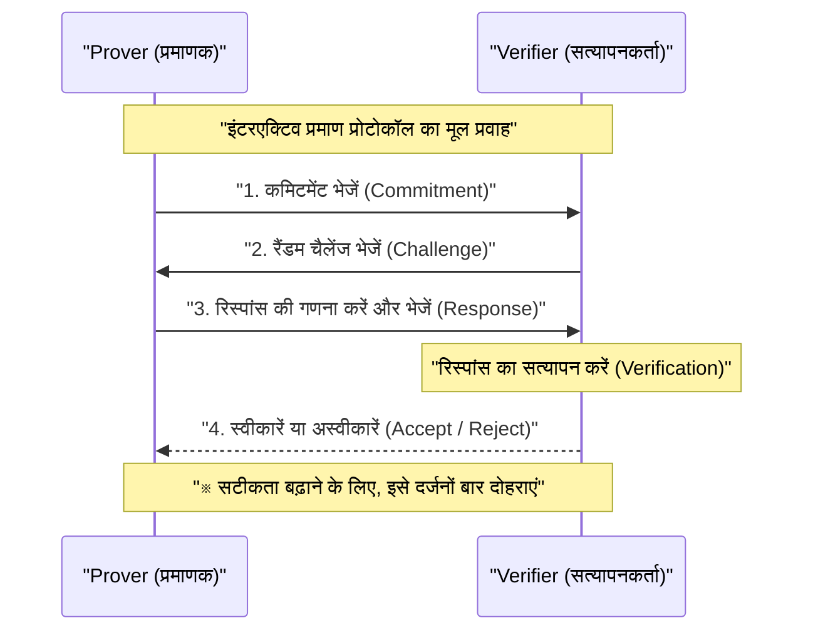
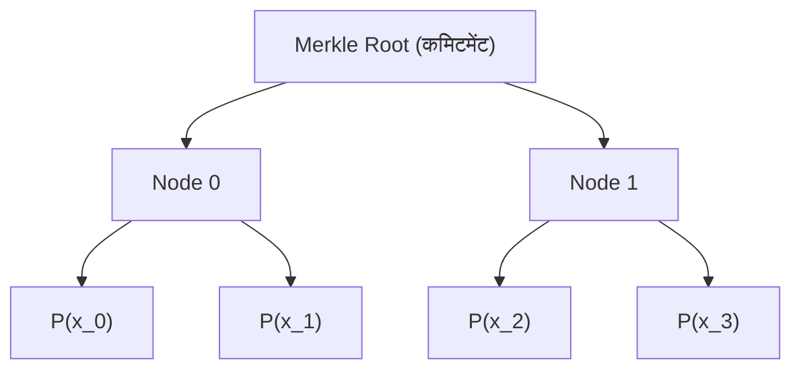
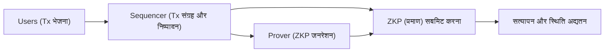

## प्रस्तावना

आधुनिक डिजिटल समाज में, डेटा गोपनीयता और स्केलेबिलिटी दो सबसे महत्वपूर्ण मुद्दे बन गए हैं। व्यक्तिगत जानकारी लीक होने और इसके दुरुपयोग के बढ़ते जोखिम के बीच, ऐसी तकनीक की अत्यधिक मांग है जो "अपनी जानकारी दूसरों को बताए बिना यह साबित कर सके कि आप उस जानकारी को रखते हैं"। इसे संभव बनाने वाली तकनीक **शून्य-ज्ञान प्रमाण (Zero-Knowledge Proof: ZKP)** है।

शून्य-ज्ञान प्रमाण 1980 के दशक में पहली बार Shafi Goldwasser, Silvio Micali, और Charles Rackoff द्वारा प्रस्तावित एक क्रिप्टोग्राफ़िक अवधारणा है, जो लंबे समय तक केवल सैद्धांतिक अनुसंधान तक सीमित रही। हालांकि, ब्लॉकचेन तकनीक और Web3 के उदय से स्थिति पूरी तरह बदल गई है। ZKP एक "जादू की छड़ी" के रूप में उभरा है जो एक ही समय में Ethereum जैसे पब्लिक ब्लॉकचेन द्वारा सामना की जाने वाली स्केलेबिलिटी समस्या (प्रोसेसिंग क्षमता की सीमा) और गोपनीयता समस्या (सभी ट्रांज़ैक्शन का सार्वजनिक होना) को हल करता है।

इस लेख में, हम शून्य-ज्ञान प्रमाण की बुनियादी अवधारणाओं से लेकर वर्तमान में मुख्यधारा में चल रहे **zk-SNARKs** और **zk-STARKs** के गहरे गणितीय और क्रिप्टोग्राफिक तंत्रों, और ZK-Rollups एवं विकेंद्रीकृत पहचान (DID) जैसे नवीनतम Web3 और सुरक्षा अनुप्रयोगों तक बहुत विस्तृत और तकनीकी गहराई के साथ चर्चा करेंगे।

---

## शून्य-ज्ञान प्रमाण (ZKP) क्या है?

शून्य-ज्ञान प्रमाण (ZKP) एक ऐसे प्रोटोकॉल को संदर्भित करता है जिसमें सिद्ध करने वाला (Prover) सत्यापनकर्ता (Verifier) को यह साबित करता है कि कोई कथन सत्य है, लेकिन "वह उस कथन के सत्य होने के तथ्य के अलावा कोई भी अन्य जानकारी संचारित नहीं करता है"।

### ZKP द्वारा पूरी की जाने वाली 3 आवश्यकताएं

ZKP के रूप में स्थापित होने के लिए, निम्नलिखित 3 विशेषताओं को सख्ती से पूरा करना आवश्यक है:

1. **पूर्णता (Completeness)**
   यदि कथन सत्य है, और प्रोवर और वेरिफायर दोनों सही ढंग से प्रोटोकॉल का पालन करते हैं, तो वेरिफायर को बहुत अधिक संभावना के साथ उस प्रमाण को स्वीकार (Accept) करना होगा।
2. **सत्यता (Soundness)**
   यदि कथन असत्य है, तो चाहे प्रोवर कितना भी शक्तिशाली और दुर्भावनापूर्ण क्यों न हो, वेरिफायर को धोखा देकर प्रमाण स्वीकार करवाना (एक नगण्य संभावना को छोड़कर) असंभव है।
3. **शून्य-ज्ञान (Zero-Knowledge)**
   यदि कथन सत्य है, तो वेरिफायर प्रमाण प्रक्रिया से "कथन सत्य है" के तथ्य के अलावा कोई भी जानकारी प्राप्त नहीं कर सकता है। वेरिफायर के दृष्टिकोण से, यह गणितीय परिभाषा द्वारा साबित होता है कि प्रमाण प्रक्रिया का अनुकरण (simulate) करना संभव है (एक सिमुलेटर मौजूद है)।

### इंटरएक्टिव प्रमाण और गैर-इंटरएक्टिव प्रमाण

ZKP के दो प्रकार होते हैं: **इंटरएक्टिव (संवादात्मक) प्रमाण**, जिसमें प्रोवर और वेरिफायर कई बार संवाद करते हैं, और **गैर-इंटरएक्टिव (असंवादात्मक) प्रमाण**, जिसमें प्रोवर केवल एक बार प्रमाण डेटा भेजता है और प्रक्रिया समाप्त हो जाती है।

#### इंटरएक्टिव प्रमाण (Interactive ZKP)

शुरुआती ZKP को इंटरएक्टिव प्रोटोकॉल के रूप में डिज़ाइन किया गया था। प्रसिद्ध "अलीबाबा की गुफा" की कहानी इसका एक उदाहरण है। एक सामान्य प्रोटोकॉल का प्रवाह इस प्रकार है:

यह विधि शक्तिशाली है, लेकिन इसके लिए वेरिफायर का ऑनलाइन होना आवश्यक है, जिससे ब्लॉकचेन जैसी एसिंक्रोनस (asynchronous) वितरित प्रणालियों (distributed systems) पर लागू करना असुविधाजनक हो जाता है। ब्लॉकचेन में, हर किसी को किसी भी समय पिछले प्रमाणों को सत्यापित करने में सक्षम होना चाहिए।

#### फिएट-शमीर रूपांतरण (Fiat-Shamir Heuristic) और गैर-इंटरएक्टिव बनाना

इंटरएक्टिव प्रमाणों को गैर-इंटरएक्टिव शून्य-ज्ञान प्रमाणों (NIZK) में बदलने की एक क्रांतिकारी तकनीक **फिएट-शमीर रूपांतरण (Fiat-Shamir Heuristic)** है।

वेरिफायर द्वारा भेजे गए "रैंडम चैलेंज" के बजाय, प्रोवर अपने स्वयं के कमिटमेंट और सार्वजनिक जानकारी के हैश मान का उपयोग करके "छद्म-रैंडम चैलेंज" उत्पन्न करता है। यदि हम यह मान लें कि क्रिप्टोग्राफिक हैश फ़ंक्शन (जैसे SHA-256 या Keccak) रैंडम ओरेकल (random oracle) के रूप में कार्य करते हैं, तो प्रोवर चुनौतियों का पहले से अनुमान या हेरफेर नहीं कर सकता है। इस प्रकार इंटरएक्टिव प्रमाण के समान सुरक्षा बनाए रखते हुए, एक संदेश भेजकर प्रमाण पूरा किया जा सकता है।

---

## zk-SNARKs का तकनीकी विवरण

वर्तमान में ZKP में सबसे व्यापक रूप से इस्तेमाल किया जाने वाला **zk-SNARKs** (Zero-Knowledge Succinct Non-Interactive Argument of Knowledge) है। जैसा कि नाम से ही स्पष्ट है, यह शून्य-ज्ञान (zk) रखता है, प्रमाण का आकार बहुत छोटा है, सत्यापन बहुत तेज़ (Succinct) है, और यह गैर-इंटरएक्टिव (Non-Interactive) ज्ञान का तर्क (Argument of Knowledge) है।

zk-SNARKs का आधार उन्नत बीजीय ज्यामिति (algebraic geometry) और क्रिप्टोग्राफी है। यह प्रोग्राम निष्पादन और गणना को विशिष्ट बहुपद (polynomial) समीकरणों के सत्यापन में बदल देता है।

### 1. अंकगणितीय सर्किट (Arithmetic Circuit) और R1CS (Rank-1 Constraint System) में रूपांतरण

सबसे पहले, किसी भी गणना जिसे आप साबित करना चाहते हैं (एल्गोरिदम या स्मार्ट कॉन्ट्रैक्ट का लॉजिक) उसे एक **अंकगणितीय सर्किट (Arithmetic Circuit)** में परिवर्तित किया जाता है जिसमें जोड़ (addition) और गुणा (multiplication) गेट होते हैं।

इसके बाद, इस अंकगणितीय सर्किट को **R1CS (Rank-1 Constraint System)** नामक मैट्रिक्स समीकरणों के सेट में परिवर्तित किया जाता है। R1CS चर (variable) वेक्टर $x$ के लिए ऐसे मैट्रिसेस $A, B, C$ को खोजने की समस्या है जो निम्नलिखित बाधा को पूरा करते हैं:

$$ (A \cdot x) \circ (B \cdot x) = C \cdot x $$

यहाँ, $\circ$ हैडामार्ड उत्पाद (Hadamard product) (तत्व-वार गुणा) को दर्शाता है। यह बाधा सुनिश्चित करती है कि सर्किट में सभी लॉजिक गेट (विशेष रूप से गुणन गेट) सही ढंग से गणना किए गए हैं।

### 2. QAP (Quadratic Arithmetic Program) में रूपांतरण

चूँकि R1CS में अनगिनत मैट्रिक्स बाधाएं मौजूद हैं, इसलिए उन्हें व्यक्तिगत रूप से सत्यापित करना बहुत अक्षम है। इसलिए, लैग्रेंज इंटरपोलेशन (Lagrange interpolation) का उपयोग करके, इन बाधाओं को एक एकल बहुपद समीकरण (polynomial equation) में संकुचित (compress) किया जाता है। यही **QAP (Quadratic Arithmetic Program)** है।

QAP में परिवर्तित करके, साबित की जाने वाली समस्या इस प्रश्न में बदल जाती है: "क्या कोई विशिष्ट बहुपद $P(x)$, किसी अन्य ज्ञात बहुपद $Z(x)$ द्वारा पूरी तरह से विभाजित हो जाता है?"

$$ P(x) = L(x) \cdot R(x) - O(x) $$

यहाँ, $L(x), R(x), O(x)$ क्रमशः मैट्रिसेस $A, B, C$ की पंक्तियों (rows) के अनुरूप बहुपदों के संयोजन हैं। यदि प्रोवर सही उत्तर (Witness) जानता है, तो $P(x)$ के प्रत्येक मूल (root) पर मान 0 होगा, जिससे $P(x)$ लक्ष्य बहुपद $Z(x)$ को एक गुणनखंड (factor) के रूप में रखेगा। अर्थात्, एक ऐसा बहुपद $H(x)$ मौजूद है जिससे निम्नलिखित समीकरण सत्य होता है:

$$ P(x) = H(x) \cdot Z(x) $$

वेरिफायर एक यादृच्छिक (random) गुप्त बिंदु (secret point) $s$ पर यह जाँच कर सकता है कि क्या समीकरण $P(s) = H(s) \cdot Z(s)$ सत्य है, जिससे वह तुरंत सत्यापित कर सकता है कि पूरी गणना सही ढंग से की गई थी। यह "Succinct (संक्षिप्तता)" का रहस्य है।

### 3. इलिप्टिक कर्व क्रिप्टोग्राफी (Elliptic Curve Cryptography) और पेयरिंग (Bilinear Pairings)

हालाँकि, यदि वेरिफायर गुप्त बिंदु $s$ को जानता है, तो प्रोवर एक जाली बहुपद गढ़ सकता है और समीकरण को पूरा कर सकता है (सत्यता का पतन)। इसलिए, बिना किसी को $s$ बताए गणना करना आवश्यक है (होमोमोर्फिक एन्क्रिप्शन का उपयोग करके)।

इसे **इलिप्टिक कर्व पेयरिंग (Bilinear Pairings)** के उपयोग से महसूस किया जाता है।
पेयरिंग $e$ एक विशेष फ़ंक्शन है जो दो एन्क्रिप्टेड मानों से एक मान की गणना कर सकता है जो उनके गुणनफल (product) के एन्क्रिप्शन के बराबर है।

$$ e(g_1^a, g_2^b) = e(g_1, g_2)^{ab} $$

प्रोवर, बिना $s$ को जाने, $s$ की घातों (powers) के एन्क्रिप्टेड मानों (इसे CRS: Common Reference String कहा जाता है) का उपयोग करके बहुपद $P(s)$ और $H(s)$ के एन्क्रिप्टेड मानों की गणना करता है। वेरिफायर पेयरिंग फ़ंक्शन का उपयोग करके यह सत्यापित करता है कि एन्क्रिप्टेड मानों के साथ $P(s) = H(s) \cdot Z(s)$ का संबंध सत्य है या नहीं।

### 4. ट्रस्टेड सेटअप (Trusted Setup)

zk-SNARKs (विशेष रूप से शुरुआती Groth16 जैसी प्रणाली) की सबसे बड़ी कमजोरी यह है कि गुप्त बिंदु $s$ उत्पन्न करने की प्रक्रिया के लिए एक तथाकथित **ट्रस्टेड सेटअप (Trusted Setup)** की आवश्यकता होती है। यदि $s$ का निर्माता इसके मान को नष्ट किए बिना बनाए रखता है, तो वह मनमाना जाली प्रमाण उत्पन्न कर सकता है (Toxic Waste समस्या)।

इसे रोकने के लिए, Multi-Party Computation (MPC) का उपयोग करके "Ceremony" नामक एक अनुष्ठान किया जाता है। कई प्रतिभागी रैंडमनेस प्रदान करने के लिए सहयोग करते हैं, और यदि कम से कम एक प्रतिभागी ईमानदारी से अपने यादृच्छिक मान को नष्ट कर देता है, तो पूरी प्रणाली की सुरक्षा बनी रहती है। हालाँकि, इस निर्भरता को खत्म करने के लिए वर्षों से शोध जारी है।

---

## zk-STARKs का तकनीकी विवरण

ट्रस्टेड सेटअप पर निर्भरता और क्वांटम कंप्यूटर द्वारा इलिप्टिक कर्व क्रिप्टोग्राफी को तोड़ने के जोखिम के समाधान के रूप में **zk-STARKs** (Zero-Knowledge Scalable Transparent Argument of Knowledge) सामने आया।

Eli Ben-Sasson और अन्य लोगों द्वारा विकसित STARKs, "Transparent (पारदर्शिता)" नाम के अनुरूप बिना किसी ट्रस्टेड सेटअप की आवश्यकता के काम करता है, और "Scalable (स्केलेबिलिटी)" के अनुरूप, गणना की मात्रा बढ़ने पर भी प्रमाण का आकार और सत्यापन समय कुशलता से बनाए रखता है।

### 1. पॉलीनोमियल कमिटमेंट (Polynomial Commitment) और FRI प्रोटोकॉल

zk-STARKs इलिप्टिक कर्व क्रिप्टोग्राफी के बजाय **केवल हैश फ़ंक्शन** पर अपनी सुरक्षा का आधार रखता है। इसलिए, इसमें पोस्ट-क्वांटम क्रिप्टोग्राफी (क्वांटम-सुरक्षित क्रिप्टोग्राफी) के गुण हैं।

गणना के सत्यापन को AIR (Algebraic Intermediate Representation) नामक प्रारूप में परिवर्तित किया जाता है, जिसके बाद एक-आयामी (1D) या बहु-आयामी (multidimensional) बहुपदों (polynomials) के गुणों का उपयोग करके सत्यापन किया जाता है। STARKs का मूल **FRI (Fast Reed-Solomon Interactive Oracle Proof of Proximity)** प्रोटोकॉल है।

FRI प्रोटोकॉल एक ऐसी तकनीक है जो यह सत्यापित करती है कि "क्या कोई फलन (function) एक विशिष्ट डिग्री (degree) वाले बहुपद के काफी करीब (Proximity) है"। प्रोवर मर्कल ट्री (Merkle Tree) की पत्तियों (leaves) के रूप में बहुपद मानों को कमिट करता है (Polynomial Commitment)।

वेरिफायर प्रोवर से कुछ रैंडम बिंदुओं (points) का खुलासा करने का अनुरोध करता है, और मर्कल प्रूफ (Merkle Proof) का उपयोग करके यह पुष्टि करता है कि वे कमिटमेंट में शामिल हैं। इसे बार-बार (recursively) दोहराकर, यह बहुत अधिक संभावना के साथ गारंटी देता है कि मूल बहुपद की डिग्री (degree) वास्तव में कम है।

### zk-SNARKs और zk-STARKs की तुलना

| विशेषता | zk-SNARKs | zk-STARKs |
| :--- | :--- | :--- |
| **क्रिप्टोग्राफिक धारणा** | इलिप्टिक कर्व, पेयरिंग | कोलिजन-रेसिस्टेंट हैश फ़ंक्शन |
| **ट्रस्टेड सेटअप** | आवश्यक (Plonk जैसे कुछ यूनिवर्सल हैं) | अनावश्यक (Transparent) |
| **क्वांटम-प्रतिरोध** | नहीं | हाँ |
| **प्रमाण का आकार** | बहुत छोटा (~200 Byte) | थोड़ा बड़ा (कुछ दर्जनों KB) |
| **प्रमाण उत्पन्न करने की कम्प्यूटेशनल लागत** | उच्च | SNARKs की तुलना में अपेक्षाकृत कम |
| **सत्यापन लागत (Gas फीस)** | बहुत कम (स्थिर) | कम (लॉगरिदमिक रूप से बढ़ता है) |

हाल के वर्षों में, Plonk और Halo2 जैसे "SNARKs जिन्हें ट्रस्टेड सेटअप की आवश्यकता नहीं होती, या केवल एक बार की आवश्यकता होती है" उभरे हैं, और SNARKs तथा STARKs के बीच की सीमा धीरे-धीरे धुंधली होती जा रही है, लेकिन मूलभूत गणितीय दृष्टिकोण का अंतर अभी भी महत्वपूर्ण है।

---

## शून्य-ज्ञान प्रमाण के Web3 और सुरक्षा में नवीनतम अनुप्रयोग

सिद्धांत से व्यवहार की ओर बढ़ते हुए, ZKP अब Web3 और साइबर सुरक्षा में सबसे आगे क्रांति ला रहा है।

### 1. ZK-Rollups द्वारा Ethereum की अल्टीमेट स्केलिंग

Ethereum जैसे L1 (लेयर 1) ब्लॉकचेन विकेंद्रीकरण (decentralization) और सुरक्षा पर इतना अधिक जोर देते हैं कि वे स्केलेबिलिटी के मामले में एक बड़ी बाधा (trilemma) का सामना करते हैं। इसका समाधान करने वाला अंतिम L2 (लेयर 2) सॉल्यूशन **ZK-Rollups** है।

ZK-Rollups में, हजारों ट्रांज़ैक्शन को ऑफ-चेन (L2) संसाधित किया जाता है, और एक एकल "ZKP (Validity Proof)" उत्पन्न किया जाता है जो यह दर्शाता है कि वे सभी सही ढंग से निष्पादित (execute) किए गए थे। L1 चेन पर स्मार्ट कॉन्ट्रैक्ट को केवल इस प्रमाण को सत्यापित करना होता है।

ZK-Rollups का सबसे बड़ा लाभ यह है कि Optimistic Rollups (जैसे Arbitrum या Optimism) के विपरीत, इसमें फ्रॉड प्रूफ (Fraud Proof) के लिए कोई चैलेंज अवधि (आमतौर पर 7 दिन) की आवश्यकता नहीं होती है। चूँकि क्रिप्टोग्राफिक रूप से सटीकता की गारंटी होती है, इसलिए प्रमाण के सत्यापित होते ही L1 से धन की निकासी (Finality) पूरी हो जाती है। वर्तमान में, zkSync, Starknet, Scroll, और Polygon zkEVM जैसे प्रोजेक्ट्स के बीच भयंकर प्रतिस्पर्धा चल रही है, और EVM (Ethereum Virtual Machine) के अनुकूल **zkEVM** के विकास से इकोसिस्टम तेज़ी से बढ़ रहा है।

### 2. प्राइवेसी-प्रिजर्विंग आइडेंटिटी (ZKP for Identity)

डिजिटल दुनिया में व्यक्तिगत प्रमाणीकरण (authentication) का तरीका भी ZKP से मौलिक रूप से बदल जाएगा।
उदाहरण के लिए, "क्या आप 18 वर्ष से अधिक आयु के हैं?" प्रश्न के लिए, पारंपरिक प्रणालियों में आपको अपना ड्राइविंग लाइसेंस या पासपोर्ट प्रस्तुत करना पड़ता है, जो दूसरे पक्ष को आपका नाम या पता जैसी अनावश्यक व्यक्तिगत जानकारी भी प्रदान कर देता है।

ZKP के साथ, सार्वजनिक संस्थानों द्वारा जारी डिजिटल प्रमाणपत्रों (Verifiable Credentials) के आधार पर, **केवल इस तथ्य को गणितीय रूप से प्रमाणित करना संभव है** कि "मेरी जन्म तिथि के आधार पर, मैं वर्तमान तिथि पर 18 वर्ष से अधिक आयु का हूँ।" वेरिफायर को केवल प्रमाणपत्र के हस्ताक्षर और ZKP को सत्यापित करने की आवश्यकता है, और उसे उपयोगकर्ता की जन्म तिथि या पहचान जानने की आवश्यकता नहीं है।

Worldcoin जैसे Proof of Personhood (मानवता का प्रमाण) प्रोजेक्ट्स में, आईरिस (iris) डेटा को सीधे संग्रहीत और साझा करने के बजाय ZKP का उपयोग किया जाता है, ताकि केवल यह प्रमाणित किया जा सके कि व्यक्ति "एक अद्वितीय इंसान" है।

### 3. गोपनीय स्मार्ट कॉन्ट्रैक्ट और एंटरप्राइज़ उपयोग

सार्वजनिक ब्लॉकचेन की यह विशेषता कि "सभी डेटा सार्वजनिक रूप से दिखाई देते हैं", उन कंपनियों के लिए एक बड़ी बाधा थी जो ब्लॉकचेन पर गोपनीय लेनदेन या आपूर्ति श्रृंखला (supply chain) डेटा को संभालना चाहते हैं।

ZKP तकनीक (जैसे Aleo या Aztec जैसे गोपनीयता-केंद्रित नेटवर्क) का उपयोग करके, ट्रांज़ैक्शन के इनपुट, आउटपुट, और यहां तक कि निष्पादित किए जा रहे स्मार्ट कॉन्ट्रैक्ट के लॉजिक को एन्क्रिप्टेड रखा जा सकता है, जबकि पब्लिक चेन पर केवल स्थिति अपडेट की सटीकता दर्ज की जाती है। यह DeFi (विकेंद्रीकृत वित्त) में फ्रंट-रनिंग (MEV) को रोकने में मदद करता है, और पब्लिक चेन की उच्च सुरक्षा का आनंद लेते हुए कंपनियों के बीच गोपनीय कंसोर्टियम नेटवर्क के निर्माण को सक्षम बनाता है।

---

## ZKP की भविष्य की चुनौतियाँ और संभावनाएँ

ZKP निश्चित रूप से अगली पीढ़ी की मूलभूत तकनीक है, लेकिन इसमें अभी भी कुछ चुनौतियां बाकी हैं:

1. **प्रमाण उत्पन्न करने की कम्प्यूटेशनल लागत और हार्डवेयर एक्सेलेरेशन**
   ZKP उत्पन्न करने के लिए बड़े पैमाने पर बहुपद गणना, FFT (Fast Fourier Transform), और MSM (Multi-Scalar Multiplication) की आवश्यकता होती है। वर्तमान में, प्रमाण निर्माण में तेज़ी लाने के लिए समर्पित हार्डवेयर (FPGA या ASIC) विकसित करने और **ZKP माइनिंग** (Prover Network) को विकसित करने के लिए बड़े पैमाने पर अनुसंधान चल रहा है।
2. **मानकीकरण (Standardization) और डेवलपर अनुभव (DX) में सुधार**
   Circom, Cairo, Noir, और Leo जैसी कई विशेष भाषाएँ ZKP सर्किट लिखने के लिए उभरी हैं। इन भाषाओं को एकीकृत करने वाले मानकों का विकास, और ऐसे कंपाइलर जो मौजूदा Rust या C++ से स्वचालित रूप से ZKP सर्किट उत्पन्न कर सकें, सामान्य सॉफ्टवेयर इंजीनियरों द्वारा ZKP को अपनाने की कुंजी होंगे।

## निष्कर्ष

शून्य-ज्ञान प्रमाण (ZKP) मात्र "क्रिप्टोकरेंसी की गुमनामी बढ़ाने वाली तकनीक" से विकसित होकर "पूरे इंटरनेट के लिए विश्वास (Trust) को फिर से परिभाषित करने वाली सामान्य-उद्देश्य तकनीक" में बदल गया है। गणितीय सूत्रों और क्रिप्टोग्राफी की गहराइयों में गढ़ा गया एक छोटा सा प्रमाण ब्लॉकचेन की स्केलेबिलिटी को असीम रूप से बढ़ाएगा और हमारी गोपनीयता की रक्षा करने वाली एक ढाल के रूप में कार्य करेगा।

Web3 को बड़े पैमाने पर अपनाने (mass adoption) और एक सुरक्षित तथा निजी अगली पीढ़ी के इंटरनेट के निर्माण की दिशा में, शून्य-ज्ञान प्रमाण सबसे महत्वपूर्ण घटक के रूप में काम करना जारी रखेगा। ZKP तकनीक के भविष्य के विकास पर हमारी नज़र बनी रहनी चाहिए।

---
*संदर्भ और संबंधित लिंक*
- Groth, J. (2016). "On the Size of Pairing-based Non-interactive Arguments"
- Ben-Sasson, E., et al. (2018). "Scalable, transparent, and post-quantum secure computational integrity"
- Vitalik Buterin's blog on zk-SNARKs and zk-STARKs
