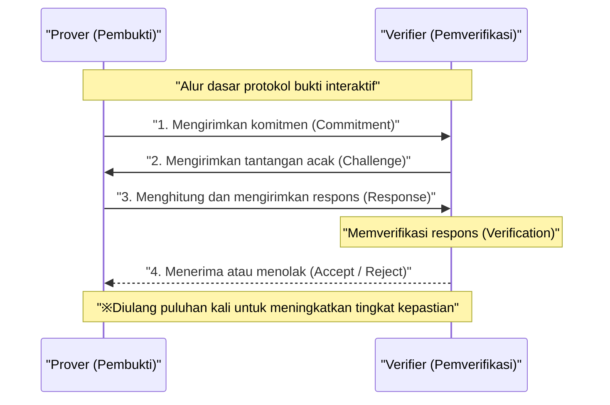
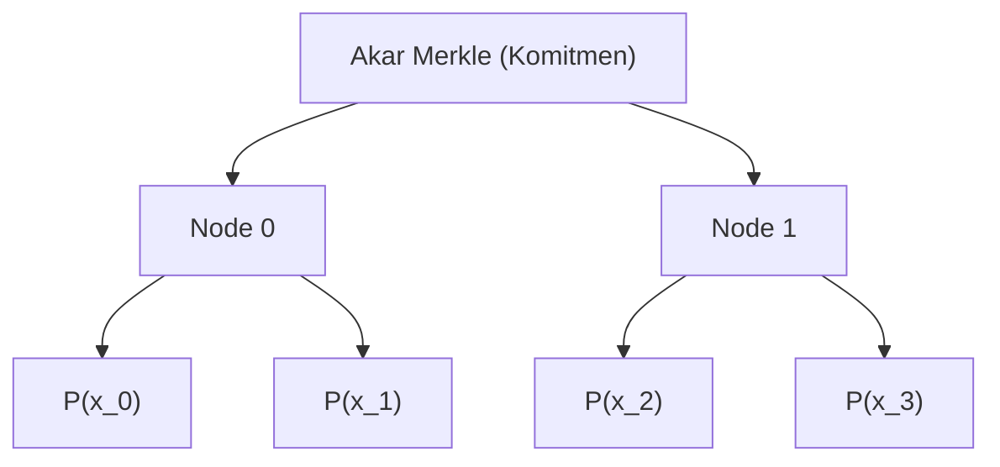
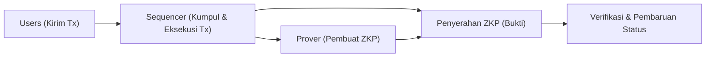

## Pendahuluan

Dalam masyarakat digital modern, privasi data dan skalabilitas menjadi dua tantangan yang paling penting. Di tengah meningkatnya risiko kebocoran dan penyalahgunaan informasi pribadi, ada kebutuhan yang kuat akan teknologi yang memungkinkan seseorang untuk "membuktikan bahwa mereka memiliki suatu informasi tanpa mengungkapkan informasi itu sendiri kepada pihak lain". Hal ini diwujudkan oleh **Zero-Knowledge Proof (ZKP) atau Bukti Tanpa Pengetahuan**.

Zero-Knowledge Proof adalah konsep teori kriptografi yang pertama kali diusulkan pada tahun 1980-an oleh Shafi Goldwasser, Silvio Micali, dan Charles Rackoff, namun untuk waktu yang lama hanya sebatas penelitian teoretis. Akan tetapi, dengan munculnya teknologi blockchain dan Web3, situasinya berubah drastis. ZKP kini mendapat sorotan sebagai "tongkat ajaib" yang mampu menyelesaikan sekaligus masalah skalabilitas (batas kapasitas pemrosesan) dan masalah privasi (semua transaksi bersifat publik) yang dihadapi oleh blockchain publik seperti Ethereum.

Dalam artikel ini, kami akan menjelaskan secara sangat terperinci dan mendalam dari sudut pandang teknis, mulai dari konsep dasar Zero-Knowledge Proof, mekanisme matematis dan kriptografis yang mendalam dari **zk-SNARKs** dan **zk-STARKs** yang saat ini menjadi arus utama, hingga contoh aplikasi terkininya pada Web3 dan keamanan seperti ZK-Rollups dan Identitas Terdesentralisasi (DID).

---

## Apa itu Zero-Knowledge Proof (ZKP)?

Zero-Knowledge Proof (ZKP) mengacu pada protokol di mana saat seorang Pembuktian (Prover) membuktikan kepada seorang Pemverifikasi (Verifier) bahwa suatu proposisi adalah benar, "tidak ada informasi lain yang disampaikan selain fakta bahwa proposisi tersebut benar".

### 3 Syarat yang Harus Dipenuhi ZKP

Agar suatu protokol dapat disebut sebagai ZKP, ia harus memenuhi tiga karakteristik berikut secara ketat:

1. **Kelengkapan (Completeness)**
   Jika proposisi itu benar, dan baik pembukti maupun pemverifikasi mengikuti protokol dengan benar, maka pemverifikasi harus menerima (Accept) bukti tersebut dengan probabilitas yang sangat tinggi.
2. **Kekukuhan (Soundness)**
   Jika proposisi itu salah, seberapa tinggi pun kemampuan komputasi pembukti yang berniat jahat, tidak mungkin (kecuali dengan probabilitas yang sangat kecil sehingga dapat diabaikan) bagi mereka untuk menipu pemverifikasi agar menerima bukti tersebut.
3. **Sifat Tanpa Pengetahuan (Zero-Knowledge)**
   Jika proposisi itu benar, pemverifikasi tidak dapat memperoleh informasi apa pun dari proses pembuktian selain fakta bahwa "proposisi itu benar". Dari sudut pandang pemverifikasi, ini dibuktikan oleh definisi matematis yang menyatakan bahwa proses pembuktian dapat disimulasikan (terdapat sebuah simulator).

### Bukti Interaktif dan Bukti Non-Interaktif

Dalam ZKP, terdapat dua jenis: **Bukti Interaktif** di mana pembukti dan pemverifikasi berkomunikasi beberapa kali, dan **Bukti Non-Interaktif** di mana pembukti hanya mengirimkan data bukti sekali dan selesai.

#### Bukti Interaktif (Interactive ZKP)

ZKP awal dirancang sebagai protokol interaktif. Analogi terkenal "Gua Ali Baba" termasuk dalam kategori ini. Alur umum protokolnya adalah sebagai berikut:

Metode ini sangat kuat, tetapi mengharuskan pemverifikasi untuk selalu online, sehingga kurang praktis diterapkan pada sistem terdistribusi asinkron seperti blockchain. Di blockchain, siapa pun harus dapat memverifikasi bukti-bukti masa lalu kapan saja.

#### Transformasi Fiat-Shamir (Fiat-Shamir Heuristic) dan Non-Interaktivitas

Metode terobosan untuk mengubah bukti interaktif menjadi bukti non-interaktif (Non-Interactive Zero-Knowledge Proof: NIZK) adalah **Transformasi Fiat-Shamir**.

Sebagai pengganti "tantangan acak" yang dikirim oleh pemverifikasi, pembukti menghasilkan sendiri "tantangan pseudo-acak" menggunakan komitmennya sendiri dan nilai hash dari informasi publik. Dengan asumsi bahwa fungsi hash kriptografi (misalnya SHA-256 atau Keccak) berfungsi sebagai oracle acak, pembukti tidak dapat memprediksi atau memanipulasi tantangan sebelumnya. Hal ini memungkinkan penyelesaian pembuktian hanya dengan satu kali pengiriman pesan, namun tetap menjaga tingkat keamanan yang setara dengan bukti interaktif.

---

## Detail Teknis zk-SNARKs

Saat ini, jenis ZKP yang paling banyak digunakan adalah **zk-SNARKs** (Zero-Knowledge Succinct Non-Interactive Argument of Knowledge). Sesuai dengan namanya, ini merupakan argumen pengetahuan (Argument of Knowledge) yang memiliki sifat tanpa pengetahuan (zk), dengan ukuran bukti yang sangat kecil dan cepat diverifikasi (Succinct), serta bersifat non-interaktif (Non-Interactive).

Fondasi dari zk-SNARKs adalah geometri aljabar tingkat lanjut dan teori kriptografi. Ia mengubah eksekusi program atau komputasi menjadi verifikasi persamaan polinomial tertentu.

### 1. Sirkuit Aritmatika dan Transformasi ke R1CS (Rank-1 Constraint System)

Pertama-tama, komputasi apa pun yang ingin dibuktikan (algoritma atau logika smart contract) diubah menjadi **Sirkuit Aritmatika (Arithmetic Circuit)** yang terdiri dari gerbang penjumlahan (addition gates) dan gerbang perkalian (multiplication gates).

Selanjutnya, sirkuit aritmatika ini diubah menjadi sekumpulan persamaan matriks yang disebut **R1CS (Rank-1 Constraint System)**. R1CS adalah masalah mencari matriks $A, B, C$ yang memenuhi kendala berikut untuk sebuah vektor variabel $x$.

$$ (A \cdot x) \circ (B \cdot x) = C \cdot x $$

Di sini, $\circ$ melambangkan perkalian Hadamard (perkalian elemen per elemen). Kendala ini memastikan bahwa semua gerbang logika dalam sirkuit (terutama gerbang perkalian) telah dihitung dengan benar.

### 2. Transformasi ke QAP (Quadratic Arithmetic Program)

Karena kendala matriks R1CS bisa sangat banyak, memverifikasinya satu per satu akan sangat tidak efisien. Oleh karena itu, interpolasi Lagrange digunakan untuk mengompresi kendala-kendala ini menjadi sebuah persamaan polinomial tunggal. Inilah yang disebut **QAP (Quadratic Arithmetic Program)**.

Dengan transformasi ke QAP, masalah yang perlu dibuktikan direduksi menjadi: "Apakah sebuah polinomial tertentu $P(x)$ dapat dibagi habis oleh polinomial lain yang diketahui, $Z(x)$?"

$$ P(x) = L(x) \cdot R(x) - O(x) $$

Di sini, $L(x), R(x), O(x)$ masingmasing adalah kombinasi polinomial yang sesuai dengan setiap baris matriks $A, B, C$. Jika pembukti mengetahui solusi yang benar (Witness), maka pada setiap akar (titik evaluasi) dari $P(x)$ nilainya akan menjadi 0, sehingga $P(x)$ akan memiliki polinomial target $Z(x)$ sebagai faktor. Dengan kata lain, terdapat suatu polinomial $H(x)$ sehingga berlaku persamaan berikut:

$$ P(x) = H(x) \cdot Z(x) $$

Pemverifikasi hanya perlu memeriksa apakah persamaan $P(s) = H(s) \cdot Z(s)$ berlaku pada sebuah titik rahasia acak $s$, dan ia dapat langsung memverifikasi bahwa keseluruhan perhitungan telah dilakukan dengan benar. Inilah rahasia dari "Succinct" (keringkasan).

### 3. Kriptografi Kurva Eliptik dan Pasangan (Bilinear Pairings)

Namun, jika pemverifikasi mengetahui titik rahasia $s$, pembukti dapat merekayasa polinomial palsu yang memenuhi persamaan tersebut (keruntuhan kekukuhan). Oleh karena itu, komputasi harus dilakukan dengan mengenkripsi $s$ (menggunakan enkripsi homomorfik) sehingga tidak diketahui oleh siapa pun.

Hal ini diwujudkan dengan **Pasangan Kurva Eliptik (Bilinear Pairings)**.
Pasangan (Pairing) $e$ adalah sebuah fungsi khusus yang mampu menghitung nilai enkripsi dari perkalian dua buah nilai yang terenkripsi.

$$ e(g_1^a, g_2^b) = e(g_1, g_2)^{ab} $$

Pembukti menghitung nilai terenkripsi dari polinomial $P(s)$ dan $H(s)$ menggunakan nilai terenkripsi dari pangkat $s$ (disebut CRS: Common Reference String), tanpa perlu mengetahui $s$ itu sendiri. Pemverifikasi menggunakan fungsi pasangan untuk memverifikasi apakah hubungan $P(s) = H(s) \cdot Z(s)$ berlaku, langsung dalam bentuk nilai yang terenkripsi.

### 4. Pengaturan Terpercaya (Trusted Setup)

Kelemahan terbesar zk-SNARKs (terutama Groth16 versi awal) adalah perlunya proses untuk menghasilkan titik rahasia $s$, yang disebut **Pengaturan Terpercaya (Trusted Setup)**. Jika pembuat $s$ tidak membuangnya dan menyimpannya, mereka dapat menghasilkan bukti palsu apa pun (masalah Limbah Beracun / Toxic Waste).

Untuk mencegahnya, sebuah upacara yang disebut "Ceremony" diadakan menggunakan Komputasi Multi-Pihak (Multi-Party Computation / MPC). Banyak peserta bekerja sama untuk menyediakan nilai acak, dan jika setidaknya satu peserta membuang nilai acaknya dengan jujur, keamanan seluruh sistem akan tetap terjaga. Namun, penelitian untuk menghilangkan ketergantungan ini telah berlangsung selama bertahun-tahun.

---

## Detail Teknis zk-STARKs

Sebagai jawaban atas ketergantungan pada pengaturan terpercaya dan risiko dekripsi kriptografi kurva eliptik oleh komputer kuantum, muncullah **zk-STARKs** (Zero-Knowledge Scalable Transparent Argument of Knowledge).

STARKs yang dikembangkan oleh Eli Ben-Sasson dan kawan-kawan memiliki karakteristik sesuai namanya, yaitu "Transparent" (Transparan) karena sama sekali tidak memerlukan pengaturan terpercaya, dan "Scalable" (Terukur) di mana ukuran bukti dan waktu verifikasi tetap efisien meskipun jumlah komputasi meningkat.

### 1. Komitmen Polinomial dan Protokol FRI

zk-STARKs tidak menggunakan kriptografi kurva eliptik, melainkan mendasarkan keamanannya **hanya pada fungsi hash**. Oleh karena itu, ia memiliki sifat sebagai kriptografi pasca-kuantum (Post-Quantum Cryptography).

Verifikasi perhitungan dilakukan menggunakan sifat polinomial satu dimensi atau multi-dimensi setelah diubah menjadi format yang disebut AIR (Algebraic Intermediate Representation). Inti dari STARKs terletak pada protokol **FRI (Fast Reed-Solomon Interactive Oracle Proof of Proximity)**.

Protokol FRI adalah teknologi untuk memverifikasi "apakah suatu fungsi cukup dekat dengan polinomial dengan derajat tertentu (Proximity)". Pembukti melakukan komitmen (komitmen polinomial) dengan menjadikan nilai-nilai polinomial sebagai daun (leaf) dari Pohon Merkle (Merkle Tree).

Pemverifikasi akan meminta pembukaan beberapa titik secara acak, lalu menggunakan bukti Merkle (Merkle Proof) untuk mengonfirmasi bahwa titik-titik tersebut termasuk dalam komitmen. Dengan mengulang proses ini secara rekursif, dapat dijamin dengan probabilitas yang sangat besar bahwa derajat polinomial aslinya memang rendah.

### Perbandingan antara zk-SNARKs dan zk-STARKs

| Karakteristik | zk-SNARKs | zk-STARKs |
| :--- | :--- | :--- |
| **Asumsi Kriptografis** | Kurva eliptik, pasangan (pairing) | Fungsi hash tahan bentrokan (collision-resistant) |
| **Pengaturan Terpercaya** | Diperlukan (seperti Plonk bersifat universal) | Tidak diperlukan (Transparent) |
| **Tahan Kuantum** | Tidak | Ya |
| **Ukuran Bukti** | Sangat kecil (~200 Byte) | Agak besar (puluhan KB) |
| **Biaya Komputasi Pembuatan Bukti** | Tinggi | Relatif lebih rendah dari SNARKs |
| **Biaya Verifikasi (Biaya Gas)** | Sangat rendah (konstan) | Rendah (meningkat secara logaritmik) |

Dalam beberapa tahun terakhir, dengan munculnya "SNARKs yang tidak memerlukan pengaturan terpercaya atau hanya sekali saja" seperti Plonk atau Halo2, batas antara SNARKs dan STARKs perlahan menjadi kabur, tetapi perbedaan pendekatan matematis dasar antara keduanya tetap penting.

---

## Aplikasi Terkini Zero-Knowledge Proof pada Web3 dan Keamanan

Setelah beralih dari teori ke praktik, ZKP saat ini sedang memicu revolusi di garis depan Web3 dan keamanan siber.

### 1. Skala Puncak Ethereum Melalui ZK-Rollups

Blockchain L1 (Layer 1) seperti Ethereum terlalu memprioritaskan desentralisasi dan keamanan sehingga menghadapi keterbatasan besar dalam skalabilitas (trilema). Solusi L2 (Layer 2) definitif untuk memecahkan masalah ini adalah **ZK-Rollups**.

Pada ZK-Rollup, ribuan transaksi dieksekusi dan diproses secara off-chain (L2), lalu menghasilkan "sebuah ZKP (Bukti Validitas / Validity Proof)" yang menunjukkan bahwa semua transaksi tersebut telah dieksekusi dengan benar. Smart contract pada rantai L1 hanya perlu memverifikasi bukti ini.

Keuntungan terbesar dari ZK-Rollups adalah, berbeda dengan Optimistic Rollups (seperti Arbitrum atau Optimism), ia tidak memerlukan masa tantangan (biasanya 7 hari) untuk bukti kecurangan (Fraud Proof). Karena kebenarannya dijamin secara kriptografis, penarikan dana ke L1 (Finalitas) akan selesai seketika begitu bukti berhasil diverifikasi. Saat ini, proyek-proyek seperti zkSync, Starknet, Scroll, dan Polygon zkEVM sedang bersaing ketat dalam pengembangan, dan perwujudan **zkEVM** yang kompatibel dengan EVM (Ethereum Virtual Machine) mendorong pertumbuhan ekosistem dengan sangat pesat.

### 2. Identitas Pelindung Privasi (ZKP untuk Identitas)

Cara autentikasi pribadi di dunia digital juga akan berubah secara fundamental oleh ZKP.
Sebagai contoh, ketika ditanya "Apakah Anda berusia 18 tahun ke atas?", pada sistem konvensional, Anda harus menunjukkan SIM atau paspor, yang secara tidak langsung memberikan informasi pribadi yang tidak diperlukan seperti nama dan alamat kepada pihak lain.

Dengan menggunakan ZKP, berdasarkan sertifikat digital (Verifiable Credential) yang diterbitkan oleh instansi publik, seseorang **hanya perlu membuktikan secara matematis fakta** bahwa "Berdasarkan tanggal lahir saya, saat ini saya berusia 18 tahun ke atas". Pemverifikasi hanya perlu memverifikasi tanda tangan sertifikat dan ZKP, tanpa bisa mengetahui tanggal lahir atau identitas asli pengguna.

Pada proyek Proof of Personhood (bukti kemanusiaan) seperti Worldcoin, data selaput pelangi (iris) mata tidak disimpan atau dibagikan secara langsung. Sebaliknya, mereka menggunakan ZKP untuk membuktikan "hanya bahwa seseorang adalah manusia yang unik".

### 3. Smart Contract Rahasia dan Penggunaan di Tingkat Perusahaan (Enterprise)

Sifat blockchain publik di mana "semua data dipublikasikan" sebelumnya menjadi hambatan besar bagi perusahaan ketika mereka ingin mengelola transaksi rahasia atau informasi rantai pasokan di atas blockchain.

Dengan menggunakan teknologi ZKP (misalnya pada jaringan yang berfokus pada privasi seperti Aleo atau Aztec), kita dapat mengenkripsi nilai masukan transaksi, nilai keluaran, bahkan logika smart contract yang dieksekusi, dan hanya mencatatkan kebenaran dari pembaruan status ke dalam rantai publik. Hal ini memungkinkan pencegahan front-running (MEV) dalam DeFi (Keuangan Terdesentralisasi) serta pembentukan jaringan konsorsium rahasia antarperusahaan, sembari tetap menikmati tingkat keamanan yang tinggi dari rantai publik.

---

## Tantangan dan Prospek ZKP ke Depan

ZKP tidak diragukan lagi merupakan teknologi dasar generasi berikutnya, tetapi masih menyisakan beberapa tantangan:

1. **Biaya Komputasi Pembuatan Bukti dan Akselerasi Perangkat Keras**
   Pembuatan ZKP memerlukan operasi polinomial yang sangat besar, FFT (Fast Fourier Transform), dan MSM (Multi-Scalar Multiplication). Saat ini, penelitian tentang pengembangan perangkat keras khusus (FPGA atau ASIC) untuk mempercepat pembuatan bukti ini, atau yang disebut **Penambangan ZKP (Prover Network)**, sedang berkembang pesat.
2. **Standardisasi dan Peningkatan Pengalaman Pengembang (DX)**
   Banyak bahasa khusus yang bermunculan untuk menulis sirkuit ZKP, seperti Circom, Cairo, Noir, Leo, dan lain-lain. Kemampuan untuk menyatukan standar ini dan kematangan kompiler yang secara otomatis dapat menghasilkan sirkuit ZKP dari bahasa pemrograman yang ada seperti Rust atau C++ akan menjadi kunci bagi para rekayasawan perangkat lunak umum untuk mengadopsi ZKP.

## Penutup

Zero-Knowledge Proof (ZKP) telah berevolusi dari sekadar "teknologi untuk meningkatkan anonimitas mata uang kripto" menjadi "teknologi serbaguna yang mendefinisikan ulang kepercayaan (trust) di seluruh internet". Bukti kecil yang dihitung dari kedalaman formula matematika dan teori kriptografi ini akan menjadi perisai kuat yang melindungi privasi kita, sekaligus memperluas skalabilitas blockchain tanpa batas.

Dalam mewujudkan adopsi massal Web3 yang sesungguhnya dan membangun internet generasi mendatang yang aman dan privat, Zero-Knowledge Proof akan terus berfungsi sebagai bagian yang paling penting. Evolusi teknologi ZKP ke depannya sangat patut untuk terus diperhatikan.

---
*Referensi dan Tautan Terkait*
- Groth, J. (2016). "On the Size of Pairing-based Non-interactive Arguments"
- Ben-Sasson, E., et al. (2018). "Scalable, transparent, and post-quantum secure computational integrity"
- Vitalik Buterin's blog on zk-SNARKs and zk-STARKs
