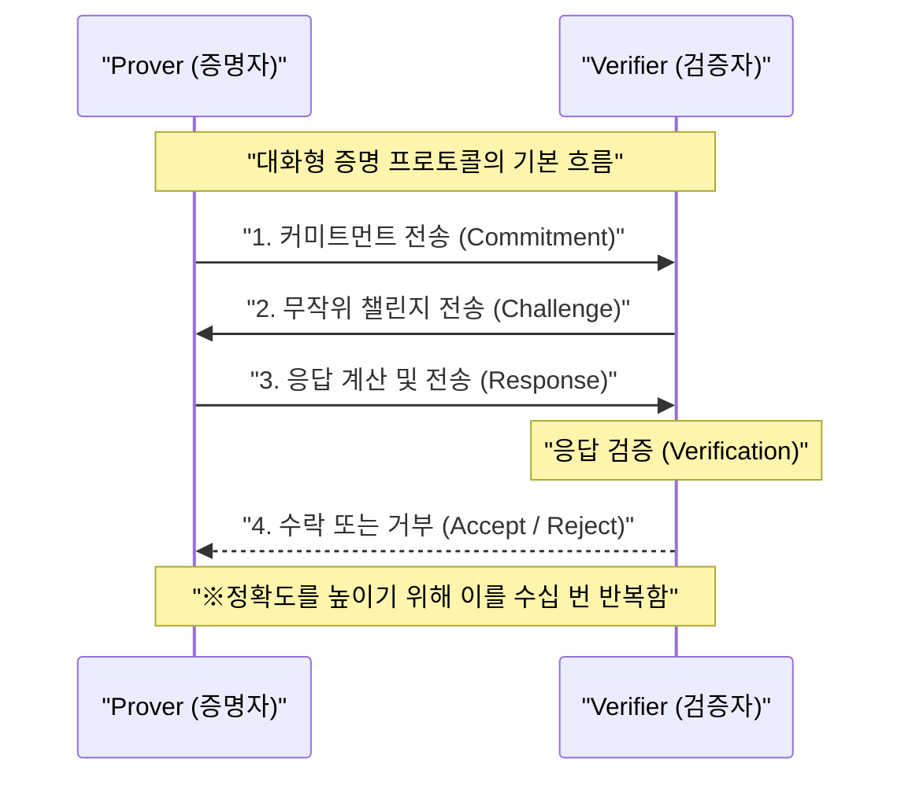
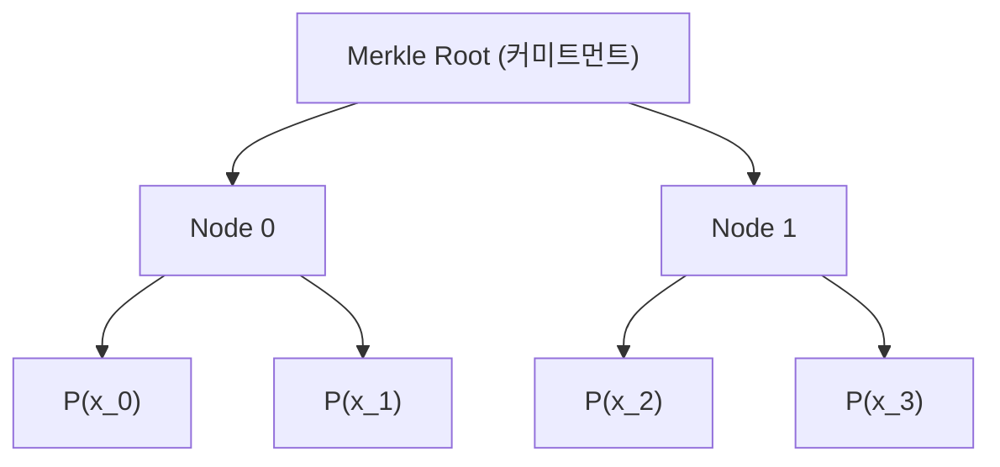
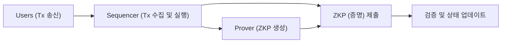

## 들어가며

현대 디지털 사회에서 데이터 프라이버시와 확장성(scalability)은 가장 중요한 두 가지 과제가 되었습니다. 개인정보 유출이나 부정 사용의 위험이 높아지는 가운데, "자신에 관한 정보를 상대방에게 밝히지 않고 자신이 그 정보를 가지고 있음을 증명하는" 기술이 강력하게 요구되고 있습니다. 이를 실현하는 것이 **영지식 증명(Zero-Knowledge Proof: ZKP)**입니다.

영지식 증명은 1980년대에 Shafi Goldwasser, Silvio Micali, Charles Rackoff에 의해 처음 제창된 암호 이론의 개념이지만, 오랫동안 이론적인 연구에 머물러 있었습니다. 그러나 블록체인 기술과 Web3의 대두로 상황은 완전히 바뀌었습니다. 이더리움(Ethereum) 등의 퍼블릭 블록체인이 직면한 확장성 문제(처리 능력의 한계)와 프라이버시 문제(모든 트랜잭션이 공개되는 것)를 동시에 해결하는 "마법의 지팡이"로서 ZKP는 일약 각광받게 되었습니다.

본 기사에서는 영지식 증명의 기본적인 개념부터 현재 주류를 이루고 있는 **zk-SNARKs** 및 **zk-STARKs**의 심오한 수학적·암호학적 메커니즘, 그리고 ZK-Rollups나 분산형 신원 증명(DID)과 같은 최신 Web3·보안 응용 사례에 이르기까지 매우 상세하고 기술적으로 깊이 있게 해설합니다.

---

## 영지식 증명(ZKP)이란 무엇인가?

영지식 증명(ZKP)이란 어떤 명제가 참이라는 것을 증명자(Prover)가 검증자(Verifier)에게 증명할 때, "그 명제가 참이라는 것 이외의 어떠한 정보도 전달하지 않는" 프로토콜을 뜻합니다.

### ZKP가 충족해야 할 3가지 요건

ZKP로 성립하기 위해서는 다음의 3가지 특성을 엄밀하게 충족해야 합니다.

1. **완전성 (Completeness)**
   명제가 참이고 증명자와 검증자 양측이 올바르게 프로토콜을 따른다면, 검증자는 압도적인 확률로 그 증명을 수락(Accept)해야 합니다.
2. **건전성 (Soundness)**
   명제가 거짓이라면, 아무리 계산 능력이 뛰어나고 악의적인 증명자라 할지라도 검증자를 속여 증명을 수락하게 만드는 것은 (무시할 수 있을 정도로 작은 확률을 제외하고) 불가능합니다.
3. **영지식성 (Zero-Knowledge)**
   명제가 참인 경우, 검증자는 "명제가 참이다"라는 사실 이외의 어떠한 정보도 증명 과정에서 얻을 수 없습니다. 검증자의 관점에서 보면, 증명 과정을 시뮬레이션하는 것이 가능하다(시뮬레이터가 존재한다)는 수학적 정의에 의해 증명됩니다.

### 대화형 증명과 비대화형 증명

ZKP에는 증명자와 검증자가 여러 번 통신을 주고받는 **대화형 증명(Interactive ZKP)**과 증명자가 한 번만 증명 데이터를 전송하고 끝나는 **비대화형 증명(Non-Interactive ZKP)**의 두 종류가 존재합니다.

#### 대화형 증명 (Interactive ZKP)

초기의 ZKP는 대화형 프로토콜로 설계되었습니다. 유명한 "알리바바의 동굴" 비유가 이에 해당합니다. 일반적인 프로토콜의 흐름은 다음과 같습니다.

이 방법은 강력하지만, 검증자가 온라인 상태여야 하므로 블록체인과 같은 비동기적인 분산 시스템에 적용하기에는 불편합니다. 블록체인에서는 누구나 언제든지 과거의 증명을 검증할 수 있어야 합니다.

#### 피아트-샤미르 변환과 비대화화

대화형 증명을 비대화형 증명(Non-Interactive Zero-Knowledge Proof: NIZK)으로 변환하기 위한 획기적인 기법이 바로 **피아트-샤미르 변환(Fiat-Shamir Heuristic)**입니다.

검증자가 전송하는 "무작위 챌린지" 대신, 증명자가 자신의 커미트먼트와 공개 정보의 해시값을 사용하여 "유사 무작위 챌린지"를 스스로 생성합니다. 암호학적 해시 함수(예: SHA-256이나 Keccak 등)가 랜덤 오라클로 기능한다는 전제하에, 증명자는 챌린지를 사전에 예측하거나 조작할 수 없으며, 대화형 증명과 동등한 보안성을 유지한 채 단 한 번의 메시지 전송으로 증명을 완료할 수 있습니다.

---

## zk-SNARKs의 기술적 세부 사항

현재 ZKP 중에서 가장 널리 사용되는 것이 **zk-SNARKs**(Zero-Knowledge Succinct Non-Interactive Argument of Knowledge)입니다. 이름 그대로 영지식성(zk)을 가지며, 증명 크기가 매우 작고 검증이 빠르며(Succinct), 비대화형(Non-Interactive)인 지식의 논증(Argument of Knowledge)입니다.

zk-SNARKs의 기반이 되는 것은 고도의 대수기하학과 암호 이론입니다. 프로그램의 실행이나 계산을 특정 다항식의 방정식 검증으로 변환합니다.

### 1. 산술 회로와 R1CS(Rank-1 Constraint System)로의 변환

먼저, 증명하고자 하는 임의의 계산(알고리즘이나 스마트 컨트랙트의 로직)을 덧셈 게이트와 곱셈 게이트로 이루어진 **산술 회로(Arithmetic Circuit)**로 변환합니다.

다음으로, 이 산술 회로를 **R1CS(Rank-1 Constraint System)**라는 행렬 방정식의 집합으로 변환합니다. R1CS는 변수 벡터 $x$에 대해 다음과 같은 제약을 만족하는 행렬 $A, B, C$를 찾는 문제입니다.

$$ (A \cdot x) \circ (B \cdot x) = C \cdot x $$

여기서 $\circ$는 아다마르 곱(요소별 곱)을 나타냅니다. 이 제약은 회로 내의 모든 논리 게이트(특히 곱셈 게이트)가 올바르게 계산되었음을 보장합니다.

### 2. QAP(Quadratic Arithmetic Program)로의 변환

R1CS의 행렬 제약은 무수히 존재하기 때문에 이를 개별적으로 검증하는 것은 매우 비효율적입니다. 따라서 라그랑주 보간법을 사용하여 이러한 제약들을 단일 다항식 방정식으로 압축합니다. 이것이 **QAP(Quadratic Arithmetic Program)**입니다.

QAP로의 변환을 통해 증명해야 할 문제는 "특정 다항식 $P(x)$가 미리 알려진 다른 다항식 $Z(x)$로 나누어 떨어지는가?"라는 문제로 귀결됩니다.

$$ P(x) = L(x) \cdot R(x) - O(x) $$

여기서 $L(x), R(x), O(x)$는 각각 행렬 $A, B, C$의 각 행에 해당하는 다항식을 결합한 것입니다. 만약 증명자가 올바른 해(Witness)를 알고 있다면, $P(x)$의 각 근(평가점)에서 값이 0이 되므로 $P(x)$는 타깃 다항식 $Z(x)$를 인수로 갖게 됩니다. 즉, 어떤 다항식 $H(x)$가 존재하여 다음 식이 성립합니다.

$$ P(x) = H(x) \cdot Z(x) $$

검증자는 어떤 무작위의 비밀 점 $s$에서 이 방정식 $P(s) = H(s) \cdot Z(s)$가 성립하는지 확인하는 것만으로 계산 전체가 올바르게 수행되었는지를 순식간에 검증할 수 있습니다. 이것이 "간결성(Succinct)"의 비밀입니다.

### 3. 타원 곡선 암호와 페어링 (Bilinear Pairings)

그러나 검증자가 비밀 점 $s$를 알고 있다면 증명자가 가짜 다항식을 날조하여 방정식을 만족시키는 것이 가능해집니다(건전성의 붕괴). 따라서 $s$를 아무도 알 수 없게 암호화(동형 암호를 이용)한 상태에서 계산을 수행해야 합니다.

이를 실현하는 것이 **타원 곡선 페어링(Bilinear Pairings)**입니다.
페어링 $e$는 암호화된 두 값으로부터 이들의 곱을 암호화한 것에 해당하는 값을 계산할 수 있는 특수한 함수입니다.

$$ e(g_1^a, g_2^b) = e(g_1, g_2)^{ab} $$

증명자는 $s$ 자체를 모르더라도 $s$의 거듭제곱이 암호화된 값(이를 CRS: Common Reference String이라 부릅니다)을 사용하여 다항식 $P(s)$나 $H(s)$의 암호화된 값을 계산합니다. 검증자는 페어링 함수를 사용하여 암호화된 값 상태 그대로 $P(s) = H(s) \cdot Z(s)$의 관계가 성립하는지를 검증합니다.

### 4. 신뢰할 수 있는 설정 (Trusted Setup)

zk-SNARKs(특히 초기의 Groth16 등)의 가장 큰 약점은 비밀 점 $s$를 생성하는 과정, 이른바 **신뢰할 수 있는 설정(Trusted Setup)**이 필요하다는 점입니다. 만약 $s$의 생성자가 그 값을 파기하지 않고 보유하고 있다면 임의의 가짜 증명을 생성할 수 있게 됩니다(Toxic Waste 문제).

이를 방지하기 위해 다자간 컴퓨팅(Multi-Party Computation: MPC)을 활용한 "세리머니(Ceremony)"라는 의식이 진행됩니다. 다수의 참여자가 협력하여 무작위성을 제공하고, 적어도 1명의 참여자가 정직하게 자신의 무작위 값을 파기한다면 시스템 전체의 보안이 유지되는 구조입니다. 그러나 이러한 의존성을 제거하기 위한 연구가 오랫동안 계속되어 왔습니다.

---

## zk-STARKs의 기술적 세부 사항

신뢰할 수 있는 설정에 대한 의존성과 양자 컴퓨터에 의한 타원 곡선 암호 해독 위험에 대한 해답으로 등장한 것이 **zk-STARKs**(Zero-Knowledge Scalable Transparent Argument of Knowledge)입니다.

Eli Ben-Sasson 등이 개발한 STARKs는 "투명성(Transparent)"이라는 이름대로 신뢰할 수 있는 설정이 전혀 필요하지 않으며, "확장성(Scalable)"이라는 이름대로 계산량이 증가해도 증명 크기와 검증 시간이 효율적으로 유지된다는 특징을 가지고 있습니다.

### 1. 다항식 커미트먼트와 FRI 프로토콜

zk-STARKs는 타원 곡선 암호가 아닌, **해시 함수에만** 보안의 근거를 두고 있습니다. 따라서 양자 내성 암호(Post-Quantum Cryptography)로서의 성질을 가집니다.

계산의 검증은 AIR(Algebraic Intermediate Representation)라는 형식으로 변환된 후, 1차원 또는 다차원 다항식의 성질을 이용하여 수행됩니다. STARKs의 핵심은 **FRI(Fast Reed-Solomon Interactive Oracle Proof of Proximity)** 프로토콜에 있습니다.

FRI 프로토콜은 "어떤 함수가 특정 차수의 다항식에 충분히 가까운가(Proximity)"를 검증하는 기술입니다. 증명자는 다항식의 값을 머클 트리(Merkle Tree)의 리프(leaf)로 커밋(다항식 커미트먼트)합니다.

검증자는 무작위로 몇 개의 점을 공개하도록 요구하고, 머클 프루프(Merkle Proof)를 사용하여 그것들이 커미트먼트에 포함되어 있는지 확인합니다. 이를 재귀적으로 반복함으로써 원래 다항식의 차수가 실제로 낮다는 것을 압도적인 확률로 보장합니다.

### zk-SNARKs와 zk-STARKs의 비교

| 특징 | zk-SNARKs | zk-STARKs |
| :--- | :--- | :--- |
| **암호학적 가정** | 타원 곡선, 페어링 | 충돌 저항성 해시 함수 |
| **신뢰할 수 있는 설정** | 필요 (Plonk 등은 범용적) | 불필요 (Transparent) |
| **양자 내성** | 없음 | 있음 |
| **증명 크기** | 매우 작음 (~200 Byte) | 다소 큼 (수십 KB) |
| **증명 생성의 계산 비용** | 높음 | SNARKs보다 비교적 낮음 |
| **검증 비용 (가스비)** | 매우 낮음 (일정함) | 낮음 (대수적으로 증가) |

최근에는 Plonk나 Halo2처럼 "신뢰할 수 있는 설정이 불필요하거나, 한 번만 수행하면 되는 SNARKs"가 등장하면서 SNARKs와 STARKs의 경계가 점차 모호해지고 있지만, 기본적인 수학적 접근 방식의 차이는 중요합니다.

---

## 영지식 증명의 Web3 및 보안에의 최신 응용

이론에서 실전으로 넘어온 ZKP는 현재 Web3와 사이버 보안의 최전선에서 혁명을 일으키고 있습니다.

### 1. ZK-Rollups를 통한 이더리움의 궁극적 스케일링

이더리움과 같은 L1(레이어1) 블록체인은 탈중앙화와 보안을 중시한 나머지 확장성에 큰 제약(트릴레마)을 안고 있습니다. 이를 해결하는 L2(레이어2) 솔루션의 결정판이 **ZK-Rollups**입니다.

ZK-Rollup에서는 수천 개의 트랜잭션을 오프체인(L2)에서 실행 및 처리하고, 그것들이 모두 올바르게 실행되었음을 나타내는 "하나의 ZKP(Validity Proof)"를 생성합니다. L1 체인 상의 스마트 컨트랙트는 이 증명만 검증하면 됩니다.

ZK-Rollups의 가장 큰 장점은 Optimistic Rollups(Arbitrum이나 Optimism 등)와 달리, 사기 증명(Fraud Proof)을 위한 챌린지 기간(보통 7일)이 불필요하다는 점입니다. 암호학적으로 정확성이 보장되어 있기 때문에 증명이 검증되는 순간 L1으로의 자금 인출(Finality)이 완료됩니다. 현재 zkSync, Starknet, Scroll, Polygon zkEVM 등의 프로젝트가 치열한 개발 경쟁을 펼치고 있으며, EVM(Ethereum Virtual Machine)과 호환성을 가지는 **zkEVM**의 구현이 생태계를 급성장시키고 있습니다.

### 2. 개인정보 보호 신원 증명 (ZKP for Identity)

디지털 세계에서의 개인 인증 방식도 ZKP에 의해 근본적으로 바뀝니다.
예를 들어, "당신은 18세 이상입니까?"라는 질문에 대해 기존 시스템에서는 운전면허증이나 여권을 제시하여 이름이나 주소와 같은 불필요한 개인정보까지 상대방에게 넘겨주어야 했습니다.

ZKP를 사용하면 공공기관이 발급한 디지털 인증서(Verifiable Credential)를 바탕으로, "내 생년월일로 계산했을 때 현재 날짜 기준으로 18세 이상이다"라는 **사실만을 수학적으로 증명**하는 것이 가능해집니다. 검증자는 인증서의 서명과 ZKP를 검증하기만 하면 되며, 사용자의 생년월일이나 신원을 알 수 없습니다.

Worldcoin과 같은 인류 증명(Proof of Personhood) 프로젝트에서도 홍채 데이터를 직접 저장하거나 공유하지 않고, ZKP를 사용하여 "고유한 인간임"만을 증명하는 시스템이 도입되어 있습니다.

### 3. 기밀 스마트 컨트랙트와 기업 활용

퍼블릭 블록체인의 "모든 데이터가 공개된다"는 특성은 기업이 기밀 거래나 공급망 정보를 블록체인에서 다룰 때 큰 장벽이었습니다.

ZKP 기술(예: Aleo나 Aztec 같은 프라이버시 특화 네트워크)을 사용하면 트랜잭션의 입력값, 출력값, 나아가 실행되는 스마트 컨트랙트의 로직 자체를 암호화한 채 상태 업데이트의 정당성만을 퍼블릭 체인에 기록할 수 있습니다. 이를 통해 DeFi(탈중앙화 금융)에서의 선행 매매(Front-running, MEV) 방지나 기업 간의 기밀 컨소시엄 네트워크 구축이 퍼블릭 체인의 높은 보안을 누리면서도 실현 가능해집니다.

---

## ZKP의 향후 과제와 전망

ZKP는 틀림없는 차세대 기반 기술이지만, 몇 가지 과제도 남아 있습니다.

1. **증명 생성의 계산 비용과 하드웨어 가속**
   ZKP의 생성에는 방대한 다항식 연산이나 FFT(고속 푸리에 변환), MSM(다중 스칼라 곱셈)이 필요합니다. 현재 이 증명 생성을 가속하기 위한 전용 하드웨어(FPGA나 ASIC)의 개발, 이른바 **ZKP 마이닝**(Prover Network) 연구가 빠르게 진행되고 있습니다.
2. **표준화와 개발자 경험(DX) 향상**
   Circom, Cairo, Noir, Leo 등 ZKP 회로를 작성하기 위한 전용 언어가 난립하고 있습니다. 이들을 통일하는 표준 규격이나 기존의 Rust나 C++에서 자동으로 ZKP 회로를 생성하는 컴파일러의 성숙이 일반 소프트웨어 엔지니어들의 ZKP 도입에 핵심이 될 것입니다.

## 마무리

영지식 증명(ZKP)은 단순한 "암호화폐의 익명성을 높이는 기술"에서 "인터넷 전체의 신뢰(Trust)를 재정의하는 범용 기술"로 진화했습니다. 수식과 암호 이론의 깊은 곳에서 계산된 작은 증명이 블록체인의 확장성을 무한히 넓히고 우리의 프라이버시를 강력하게 지키는 방패가 됩니다.

Web3의 진정한 대중화(Mass Adoption), 그리고 안전하고 프라이빗한 차세대 인터넷 구축을 향해 영지식 증명은 가장 중요한 퍼즐 조각으로 계속 기능할 것입니다. 앞으로의 ZKP 기술 진화에서 눈을 뗄 수 없습니다.

---
*참고 문헌 및 관련 링크*
- Groth, J. (2016). "On the Size of Pairing-based Non-interactive Arguments"
- Ben-Sasson, E., et al. (2018). "Scalable, transparent, and post-quantum secure computational integrity"
- Vitalik Buterin's blog on zk-SNARKs and zk-STARKs
