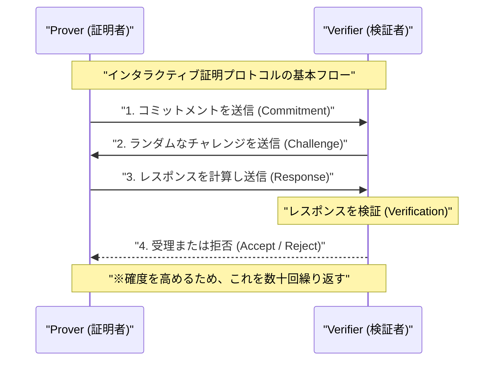
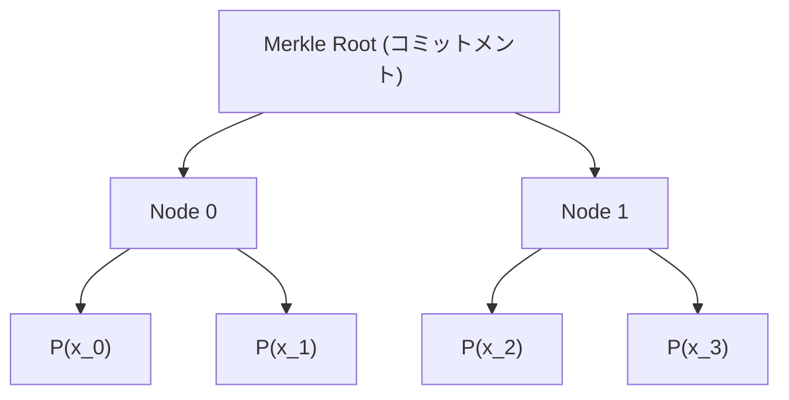
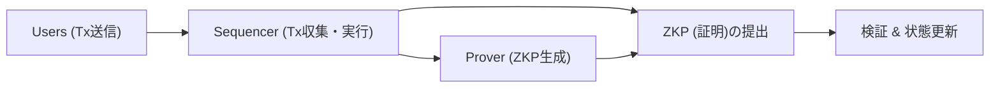

## はじめに

現代のデジタル社会において、データプライバシーとスケーラビリティは最も重要な課題の2つとなっています。個人情報の漏洩や不正利用のリスクが高まる中、「自分に関する情報を相手に明かすことなく、自分がその情報を持っていることを証明する」技術が強く求められています。これを実現するのが**ゼロ知識証明（Zero-Knowledge Proof: ZKP）**です。

ゼロ知識証明は、1980年代にShafi Goldwasser、Silvio Micali、Charles Rackoffによって初めて提唱された暗号理論の概念ですが、長らく理論的な研究にとどまっていました。しかし、ブロックチェーン技術とWeb3の台頭により、状況は一変しました。Ethereumなどのパブリックブロックチェーンが直面するスケーラビリティ問題（処理能力の限界）とプライバシー問題（すべてのトランザクションが公開されること）を同時に解決する「魔法の杖」として、ZKPは一躍脚光を浴びることとなったのです。

本記事では、ゼロ知識証明の基本的な概念から、現在主流となっている**zk-SNARKs**および**zk-STARKs**の深淵なる数学的・暗号学的メカニズム、そしてZK-Rollupsや分散型アイデンティティ（DID）といった最新のWeb3・セキュリティへの応用例に至るまで、極めて詳細かつ技術的に深く掘り下げて解説します。

---

## ゼロ知識証明（ZKP）とは何か？

ゼロ知識証明（ZKP）とは、ある命題が真であることを、証明者（Prover）が検証者（Verifier）に対して証明する際に、「その命題が真であること以外のいかなる情報も伝達しない」ようなプロトコルのことを指します。

### ZKPが満たすべき3つの要件

ZKPとして成立するためには、以下の3つの特性を厳密に満たす必要があります。

1. **完全性（Completeness）**
   命題が真であり、かつ証明者と検証者の双方が正しくプロトコルに従うならば、検証者は圧倒的な確率でその証明を受理（Accept）しなければなりません。
2. **健全性（Soundness）**
   命題が偽であるならば、いかに計算能力が高く、悪意のある証明者であったとしても、検証者を騙して証明を受理させることは（無視できるほど小さな確率を除いて）不可能です。
3. **ゼロ知識性（Zero-Knowledge）**
   命題が真である場合、検証者は「命題が真である」という事実以外のいかなる情報も、証明プロセスから得ることはできません。検証者の視点から見れば、証明プロセスをシミュレートすることが可能である（シミュレータが存在する）という数学的定義によって証明されます。

### インタラクティブ証明と非インタラクティブ証明

ZKPには、証明者と検証者が複数回の通信を行う**インタラクティブ（対話型）証明**と、証明者が一度だけ証明データを送信して終わる**非インタラクティブ（非対話型）証明**の2種類が存在します。

#### インタラクティブ証明（Interactive ZKP）

初期のZKPは対話型プロトコルとして設計されました。有名な「アリババの洞窟」の例え話がこれに該当します。一般的なプロトコルの流れは以下のようになります。

この方法は強力ですが、検証者がオンラインでなければならず、ブロックチェーンのような非同期的な分散システムに適用するには不便です。ブロックチェーンでは、誰もがいつでも過去の証明を検証できなければなりません。

#### フィアット・シャミア変換（Fiat-Shamir Heuristic）と非対話化

インタラクティブ証明を非インタラクティブ証明（Non-Interactive Zero-Knowledge Proof: NIZK）に変換するための画期的な手法が**フィアット・シャミア変換**です。

検証者が送信する「ランダムなチャレンジ」の代わりに、証明者が自分自身のコミットメントと公開情報のハッシュ値を用いて「擬似ランダムなチャレンジ」を自己生成します。暗号学的ハッシュ関数（例えばSHA-256やKeccakなど）がランダムオラクルとして機能することを前提とすれば、証明者はチャレンジを事前に予測・操作することができず、インタラクティブ証明と同等のセキュリティを保ったまま、1回のメッセージ送信で証明を完了させることができます。

---

## zk-SNARKsの技術的詳細

現在、ZKPの中で最も広く利用されているのが**zk-SNARKs**（Zero-Knowledge Succinct Non-Interactive Argument of Knowledge）です。名前の通り、ゼロ知識性（zk）を持ち、証明サイズが非常に小さく検証が高速（Succinct）で、非対話型（Non-Interactive）である知識の議論（Argument of Knowledge）です。

zk-SNARKsの基盤となるのは、高度な代数幾何学と暗号理論です。プログラムの実行や計算を、特定の多項式の方程式の検証へと変換します。

### 1. 算術回路とR1CS（Rank-1 Constraint System）への変換

まず、証明したい任意の計算（アルゴリズムやスマートコントラクトのロジック）を、加算ゲートと乗算ゲートからなる**算術回路（Arithmetic Circuit）**に変換します。

次に、この算術回路を**R1CS（Rank-1 Constraint System）**という行列方程式の集合に変換します。R1CSは、変数ベクトル $x$ に対して、次のような制約を満たす行列 $A, B, C$ を見つける問題です。

$$ (A \cdot x) \circ (B \cdot x) = C \cdot x $$

ここで、$\circ$ はアダマール積（要素ごとの積）を表します。この制約は、回路内のすべての論理ゲート（特に乗算ゲート）が正しく計算されていることを保証します。

### 2. QAP（Quadratic Arithmetic Program）への変換

R1CSの行列制約は無数に存在するため、これらを個別に検証するのは非常に非効率です。そこで、ラグランジュ補間を用いて、これらの制約を単一の多項式方程式に圧縮します。これが**QAP（Quadratic Arithmetic Program）**です。

QAPへの変換により、証明すべき問題は「特定の多項式 $P(x)$ が、別の既知の多項式 $Z(x)$ で割り切れるか？」という問題に帰着します。

$$ P(x) = L(x) \cdot R(x) - O(x) $$

ここで、$L(x), R(x), O(x)$ はそれぞれ行列 $A, B, C$ の各行に対応する多項式を組み合わせたものです。もし証明者が正しい解（Witness）を知っていれば、$P(x)$ の各根（評価点）で値が0になるため、$P(x)$ はターゲット多項式 $Z(x)$ を因数として持つことになります。すなわち、ある多項式 $H(x)$ が存在して、次式が成り立ちます。

$$ P(x) = H(x) \cdot Z(x) $$

検証者は、あるランダムな秘密の点 $s$ において、この方程式 $P(s) = H(s) \cdot Z(s)$ が成立するかどうかをチェックするだけで、計算全体が正しく行われたことを瞬時に検証できるのです。これが「Succinct（簡潔性）」の秘密です。

### 3. 楕円曲線暗号とペアリング（Bilinear Pairings）

しかし、検証者が秘密の点 $s$ を知っていては、証明者が偽の多項式を捏造して方程式を満たすことが可能になってしまいます（健全性の崩壊）。そこで、$s$ を誰にも知られないように暗号化（準同型暗号を利用）したまま計算を行う必要があります。

これを実現するのが**楕円曲線ペアリング（Bilinear Pairings）**です。
ペアリング $e$ は、2つの暗号化された値から、それらの積の暗号化に相当する値を計算できる特殊な関数です。

$$ e(g_1^a, g_2^b) = e(g_1, g_2)^{ab} $$

証明者は、$s$ 自体を知らなくても、$s$ の累乗の暗号化された値（これをCRS: Common Reference String と呼びます）を用いて、多項式 $P(s)$ や $H(s)$ の暗号化された値を計算します。検証者は、ペアリング関数を用いて暗号化された値のまま $P(s) = H(s) \cdot Z(s)$ の関係が成立しているかを検証します。

### 4. トラステッド・セットアップ（Trusted Setup）

zk-SNARKs（特に初期のGroth16など）の最大の弱点は、秘密の点 $s$ を生成するプロセス、いわゆる**トラステッド・セットアップ**が必要なことです。もし、$s$ の生成者がその値を破棄せずに保持していれば、任意の偽の証明を生成できてしまいます（Toxic Waste問題）。

これを防ぐため、Multi-Party Computation（MPC）を用いた「Ceremony」と呼ばれる儀式が実施されます。多数の参加者が協力してランダムネスを提供し、少なくとも1人の参加者が正直に自身のランダムな値を破棄すれば、システム全体のセキュリティが保たれる仕組みです。しかし、この依存関係を排除するための研究が長年続けられてきました。

---

## zk-STARKsの技術的詳細

トラステッド・セットアップへの依存と、量子コンピュータによる楕円曲線暗号の解読リスクに対する回答として登場したのが**zk-STARKs**（Zero-Knowledge Scalable Transparent Argument of Knowledge）です。

Eli Ben-Sassonらによって開発されたSTARKsは、「Transparent（透明性）」の名の通りトラステッド・セットアップを一切必要とせず、「Scalable（スケーラビリティ）」の名の通り、計算量が増えても証明サイズと検証時間が効率的に保たれるという特徴を持っています。

### 1. 多項式コミットメントとFRIプロトコル

zk-STARKsは楕円曲線暗号ではなく、**ハッシュ関数のみ**にセキュリティの根拠を置いています。そのため、耐量子計算機暗号（Post-Quantum Cryptography）としての性質を持ちます。

計算の検証は、AIR（Algebraic Intermediate Representation）と呼ばれる形式に変換された後、一次元または多次元の多項式の性質を利用して行われます。STARKsの核心は、**FRI（Fast Reed-Solomon Interactive Oracle Proof of Proximity）**プロトコルにあります。

FRIプロトコルは、「ある関数が特定の次数の多項式に十分近いか（Proximity）」を検証する技術です。証明者は、多項式の値をマークルツリー（Merkle Tree）のリーフとしてコミット（多項式コミットメント）します。

検証者は、ランダムな数点を開示するように要求し、マークルプルーフを用いてそれらがコミットメントに含まれていることを確認します。これを再帰的に繰り返すことで、元の多項式の次数が実際に低いことを圧倒的な確率で保証します。

### zk-SNARKsとzk-STARKsの比較

| 特徴 | zk-SNARKs | zk-STARKs |
| :--- | :--- | :--- |
| **暗号学的仮定** | 楕円曲線、ペアリング | 衝突耐性ハッシュ関数 |
| **トラステッド・セットアップ** | 必要（Plonkなどはユニバーサル） | 不要（Transparent） |
| **耐量子性** | なし | あり |
| **証明サイズ** | 非常に小さい（~200 Byte） | やや大きい（数十 KB） |
| **証明生成の計算コスト** | 高い | SNARKsより比較的低い |
| **検証コスト（Gas代）** | 非常に低い（一定） | 低い（対数的に増加） |

近年では、PlonkやHalo2のように「トラステッド・セットアップが不要、あるいは一度だけで済むSNARKs」が登場し、SNARKsとSTARKsの境界は徐々に曖昧になりつつありますが、基本的な数学的アプローチの違いは重要です。

---

## ゼロ知識証明のWeb3とセキュリティへの最新の応用

理論から実践へと移行したZKPは、現在Web3やサイバーセキュリティの最前線で革命を起こしています。

### 1. ZK-RollupsによるEthereumの究極的スケーリング

EthereumのようなL1（レイヤー1）ブロックチェーンは、分散性とセキュリティを重視するあまり、スケーラビリティに大きな制約（トリレンマ）を抱えています。これを解決するL2（レイヤー2）ソリューションの決定版が**ZK-Rollups**です。

ZK-Rollupでは、何千ものトランザクションをオフチェーン（L2）で実行・処理し、それらがすべて正しく実行されたことを示す「1つのZKP（Validity Proof）」を生成します。L1チェーン上のスマートコントラクトは、この証明を検証するだけで済みます。

ZK-Rollupsの最大の利点は、Optimistic Rollups（ArbitrumやOptimismなど）とは異なり、不正証明（Fraud Proof）のためのチャレンジ期間（通常7日間）が不要である点です。暗号学的に正しさが保証されているため、証明が検証された瞬間にL1への資金の引き出し（Finality）が完了します。現在、zkSync、Starknet、Scroll、Polygon zkEVMなどのプロジェクトが熾烈な開発競争を繰り広げており、EVM（Ethereum Virtual Machine）と互換性を持つ**zkEVM**の実現がエコシステムを急成長させています。

### 2. プライバシー保護アイデンティティ（ZKP for Identity）

デジタル世界における個人認証のあり方もZKPによって根本から変わります。
例えば、「あなたは18歳以上ですか？」という質問に対して、従来のシステムでは運転免許証やパスポートを提示し、氏名や住所といった不要な個人情報まで相手に渡してしまっていました。

ZKPを用いれば、公的機関が発行したデジタル証明書（Verifiable Credential）を元に、「私の生年月日から計算すると、現在の日付において18歳以上である」という**事実だけを数学的に証明**することが可能になります。検証者は証明書の署名とZKPを検証するだけでよく、ユーザーの生年月日や身元を知ることはできません。

WorldcoinのようなProof of Personhood（人間性の証明）プロジェクトでも、虹彩データを直接保存・共有するのではなく、ZKPを用いて「一意の人間であること」だけを証明する仕組みが取り入れられています。

### 3. 機密スマートコントラクトとエンタープライズ利用

パブリックブロックチェーンの「すべてのデータが公開される」という性質は、企業が機密の取引やサプライチェーン情報をブロックチェーン上で扱う際の大きな障壁でした。

ZKP技術（例えばAleoやAztecなどのプライバシー特化型ネットワーク）を用いれば、トランザクションの入力値、出力値、さらには実行されるスマートコントラクトのロジック自体を暗号化したまま、状態の更新の正当性だけをパブリックチェーンに刻むことができます。これにより、DeFi（分散型金融）におけるフロントランニング（MEV）の防止や、企業間での機密コンソーシアムネットワークの構築が、パブリックチェーンの高いセキュリティを享受しながら実現可能となります。

---

## ZKPの今後の課題と展望

ZKPは間違いなく次世代の基盤技術ですが、いくつかの課題も残されています。

1. **証明生成の計算コストとハードウェアアクセラレーション**
   ZKPの生成には、膨大な多項式演算やFFT（高速フーリエ変換）、MSM（マルチスカラー乗算）が必要です。現在、この証明生成を高速化するための専用ハードウェア（FPGAやASIC）の開発、いわゆる**ZKPマイニング**（Prover Network）の研究が急速に進んでいます。
2. **標準化と開発者体験（DX）の向上**
   Circom、Cairo、Noir、Leoなど、ZKP回路を記述するための専用言語が乱立しています。これらを統一する標準規格や、既存のRustやC++から自動的にZKP回路を生成するコンパイラの成熟が、一般的なソフトウェアエンジニアによるZKP導入の鍵となるでしょう。

## おわりに

ゼロ知識証明（ZKP）は、単なる「暗号通貨の匿名性を高める技術」から、「インターネット全体のトラスト（信用）を再定義する汎用技術」へと進化を遂げました。数式と暗号理論の奥深くで計算された小さな証明が、ブロックチェーンのスケーラビリティを無限に拡張し、私たちのプライバシーを強固に守る盾となります。

Web3の真のマスアダプション、そしてセキュアでプライベートな次世代インターネットの構築に向けて、ゼロ知識証明は最も重要なピースとして機能し続けるでしょう。今後のZKP技術の進化から目が離せません。

---
*参考文献・関連リンク*
- Groth, J. (2016). "On the Size of Pairing-based Non-interactive Arguments"
- Ben-Sasson, E., et al. (2018). "Scalable, transparent, and post-quantum secure computational integrity"
- Vitalik Buterin's blog on zk-SNARKs and zk-STARKs
