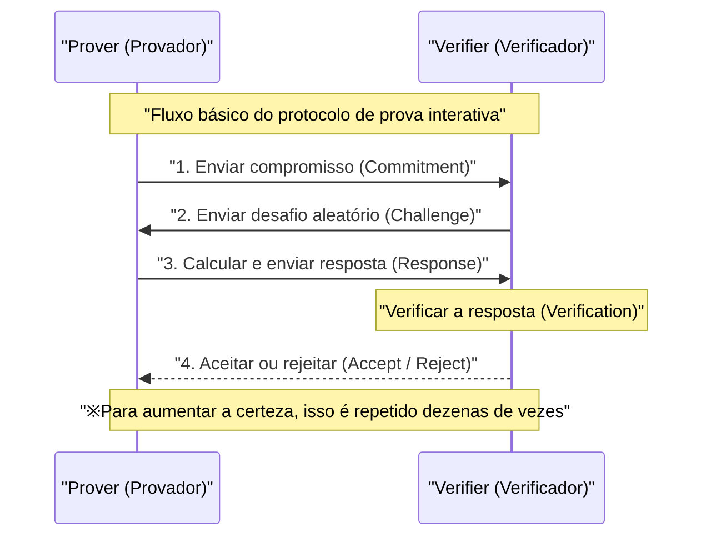
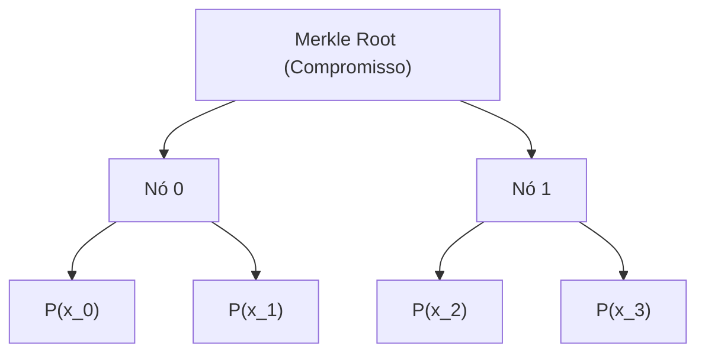
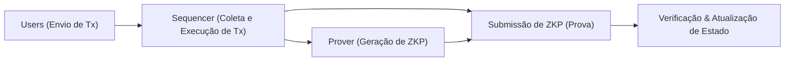

## Introdução

Na sociedade digital moderna, a privacidade de dados e a escalabilidade tornaram-se dois dos desafios mais importantes. Com o aumento do risco de vazamento de informações pessoais e uso não autorizado, há uma forte demanda por tecnologias que permitam "provar que você possui determinada informação sem revelá-la à outra parte". Isso é alcançado pela **Prova de Conhecimento Zero (Zero-Knowledge Proof: ZKP)**.

A Prova de Conhecimento Zero é um conceito de teoria criptográfica proposto pela primeira vez na década de 1980 por Shafi Goldwasser, Silvio Micali e Charles Rackoff, mas que permaneceu restrito à pesquisa teórica por um longo tempo. No entanto, com a ascensão da tecnologia blockchain e da Web3, a situação mudou drasticamente. A ZKP ganhou destaque repentino como a "varinha mágica" para resolver simultaneamente o problema de escalabilidade (limites de capacidade de processamento) e o problema de privacidade (todas as transações sendo públicas) enfrentados por blockchains públicas como o Ethereum.

Neste artigo, exploraremos detalhadamente e tecnicamente desde os conceitos fundamentais das Provas de Conhecimento Zero, os profundos mecanismos matemáticos e criptográficos dos atualmente populares **zk-SNARKs** e **zk-STARKs**, até os exemplos mais recentes de aplicações em Web3 e segurança, como ZK-Rollups e Identidade Descentralizada (DID).

---

## O que é uma Prova de Conhecimento Zero (ZKP)?

Uma Prova de Conhecimento Zero (ZKP) refere-se a um protocolo onde, ao provar que uma certa proposição é verdadeira, um provador (Prover) não transmite nenhuma informação a um verificador (Verifier) "além do fato de que a proposição é verdadeira".

### 3 Requisitos que a ZKP Deve Satisfazer

Para ser estabelecida como uma ZKP, os três seguintes atributos devem ser estritamente atendidos:

1. **Completude (Completeness)**
   Se a proposição for verdadeira e tanto o provador quanto o verificador seguirem o protocolo corretamente, o verificador deve aceitar (Accept) a prova com uma probabilidade esmagadora.
2. **Solidez (Soundness)**
   Se a proposição for falsa, mesmo o provador mais malicioso e com grande poder computacional não poderá enganar o verificador para aceitar a prova (exceto por uma probabilidade insignificantemente pequena).
3. **Conhecimento Zero (Zero-Knowledge)**
   Se a proposição for verdadeira, o verificador não pode obter do processo de prova nenhuma informação além do fato de que "a proposição é verdadeira". Do ponto de vista do verificador, prova-se por definição matemática que é possível simular o processo de prova (existe um simulador).

### Provas Interativas e Não Interativas

Existem dois tipos de ZKP: **provas interativas (Interactive ZKP)**, onde o provador e o verificador se comunicam múltiplas vezes, e **provas não interativas (Non-Interactive ZKP)**, onde o provador envia os dados da prova apenas uma vez e finaliza.

#### Provas Interativas (Interactive ZKP)

As primeiras ZKPs foram projetadas como protocolos interativos. A famosa alegoria da "Caverna de Ali Babá" enquadra-se nisso. O fluxo geral do protocolo é o seguinte:

Este método é poderoso, mas o verificador deve estar online, o que o torna inconveniente para aplicação em sistemas distribuídos assíncronos como blockchain. Em uma blockchain, qualquer pessoa deve ser capaz de verificar provas passadas a qualquer momento.

#### Transformação de Fiat-Shamir (Fiat-Shamir Heuristic) e Não Interatividade

A **Transformação de Fiat-Shamir** é um método inovador para converter uma prova interativa em uma prova não interativa (Non-Interactive Zero-Knowledge Proof: NIZK).

Em vez do "desafio aleatório" enviado pelo verificador, o provador autogera um "desafio pseudoaleatório" usando seu próprio compromisso e o valor de hash das informações públicas. Assumindo que uma função de hash criptográfica (como SHA-256 ou Keccak) funcione como um oráculo aleatório, o provador não pode prever ou manipular o desafio antecipadamente e pode completar a prova com um único envio de mensagem, mantendo a mesma segurança de uma prova interativa.

---

## Detalhes Técnicos de zk-SNARKs

Atualmente, a ZKP mais amplamente utilizada é o **zk-SNARKs** (Zero-Knowledge Succinct Non-Interactive Argument of Knowledge). Como o nome sugere, é um argumento de conhecimento (Argument of Knowledge) que possui conhecimento zero (zk), tamanho de prova muito pequeno e verificação rápida (Succinct) e é não interativo (Non-Interactive).

A base do zk-SNARKs é a geometria algébrica avançada e a teoria criptográfica. Ele converte a execução ou cálculo de um programa na verificação de uma equação polinomial específica.

### 1. Conversão para Circuitos Aritméticos e R1CS (Rank-1 Constraint System)

Primeiro, qualquer cálculo a ser provado (um algoritmo ou lógica de contrato inteligente) é convertido em um **circuito aritmético (Arithmetic Circuit)** que consiste em portas de adição e portas de multiplicação.

Em seguida, este circuito aritmético é convertido em um conjunto de equações de matriz chamado **R1CS (Rank-1 Constraint System)**. O R1CS é o problema de encontrar matrizes $A, B, C$ que satisfaçam a seguinte restrição para um vetor de variáveis $x$:

$$ (A \cdot x) \circ (B \cdot x) = C \cdot x $$

Aqui, $\circ$ representa o produto de Hadamard (produto elemento a elemento). Essa restrição garante que todas as portas lógicas do circuito (especialmente as portas de multiplicação) sejam calculadas corretamente.

### 2. Conversão para QAP (Quadratic Arithmetic Program)

Como existem inúmeras restrições de matriz do R1CS, verificá-las individualmente é muito ineficiente. Portanto, usando a interpolação de Lagrange, essas restrições são comprimidas em uma única equação polinomial. Isso é o **QAP (Quadratic Arithmetic Program)**.

Ao converter para QAP, o problema a ser provado se reduz ao problema de "Pode um polinômio específico $P(x)$ ser divisível por outro polinômio conhecido $Z(x)$?".

$$ P(x) = L(x) \cdot R(x) - O(x) $$

Aqui, $L(x), R(x), O(x)$ são combinações dos polinômios correspondentes a cada linha das matrizes $A, B, C$, respectivamente. Se o provador souber a solução correta (Witness), o valor em cada raiz (ponto de avaliação) de $P(x)$ será 0, portanto, $P(x)$ terá o polinômio alvo $Z(x)$ como um fator. Ou seja, existe um polinômio $H(x)$ e a seguinte equação se mantém:

$$ P(x) = H(x) \cdot Z(x) $$

O verificador pode verificar instantaneamente se todo o cálculo foi realizado corretamente apenas verificando se esta equação $P(s) = H(s) \cdot Z(s)$ se mantém em um ponto secreto aleatório $s$. Esse é o segredo da "Sucintez (Succinctness)".

### 3. Criptografia de Curva Elíptica e Emparelhamentos (Bilinear Pairings)

No entanto, se o verificador souber o ponto secreto $s$, o provador poderá forjar um polinômio falso para satisfazer a equação (quebra da solidez). Portanto, é necessário realizar o cálculo mantendo $s$ criptografado (usando criptografia homomórfica) para que ninguém o conheça.

Isto é alcançado pelos **emparelhamentos de curva elíptica (Bilinear Pairings)**.
Um emparelhamento $e$ é uma função especial que pode calcular um valor equivalente à criptografia de seu produto a partir de dois valores criptografados.

$$ e(g_1^a, g_2^b) = e(g_1, g_2)^{ab} $$

O provador pode calcular os valores criptografados dos polinômios $P(s)$ e $H(s)$ usando o valor criptografado da potência de $s$ (chamado de CRS: Common Reference String), mesmo sem conhecer o próprio $s$. O verificador utiliza a função de emparelhamento para verificar se a relação $P(s) = H(s) \cdot Z(s)$ é mantida enquanto os valores permanecem criptografados.

### 4. Configuração Confiável (Trusted Setup)

A maior fraqueza dos zk-SNARKs (especialmente os iniciais como o Groth16) é que eles requerem um processo para gerar o ponto secreto $s$, chamado de **Configuração Confiável (Trusted Setup)**. Se o criador do $s$ mantiver o valor em vez de destruí-lo, ele poderá gerar qualquer prova falsa (problema do Lixo Tóxico / Toxic Waste).

Para prevenir isso, é realizada uma cerimônia chamada "Ceremony", que utiliza Computação Multipartidária (MPC). Vários participantes colaboram para fornecer aleatoriedade, e se pelo menos um participante destruir honestamente seu próprio valor aleatório, a segurança de todo o sistema é mantida. No entanto, pesquisas para eliminar essa dependência vêm sendo conduzidas há muitos anos.

---

## Detalhes Técnicos de zk-STARKs

Como resposta à dependência da Configuração Confiável e ao risco de decodificação da criptografia de curva elíptica por computadores quânticos, surgiram os **zk-STARKs** (Zero-Knowledge Scalable Transparent Argument of Knowledge).

Desenvolvido por Eli Ben-Sasson e outros, o STARKs não requer nenhuma Configuração Confiável (Trusted Setup), como o nome "Transparente (Transparent)" sugere, e tem a característica de que o tamanho da prova e o tempo de verificação são mantidos eficientes mesmo se o volume de cálculo aumentar, como sugere o nome "Escalável (Scalable)".

### 1. Compromisso Polinomial e Protocolo FRI

Os zk-STARKs não dependem de criptografia de curva elíptica, mas ancoram a sua segurança **apenas em funções hash**. Portanto, eles possuem propriedades de criptografia pós-quântica (Post-Quantum Cryptography).

A verificação do cálculo é realizada convertendo-o num formato chamado AIR (Algebraic Intermediate Representation) e, em seguida, utilizando as propriedades dos polinómios unidimensionais ou multidimensionais. O núcleo do STARKs está no protocolo **FRI (Fast Reed-Solomon Interactive Oracle Proof of Proximity)**.

O protocolo FRI é uma tecnologia para verificar "se uma determinada função está suficientemente próxima de um polinômio de um grau específico (Proximity)". O provador compromete os valores do polinômio como folhas de uma árvore de Merkle (Merkle Tree) (compromisso polinomial).

O verificador exige a revelação de alguns pontos aleatórios e utiliza provas de Merkle (Merkle Proofs) para confirmar que estão incluídos no compromisso. Ao repetir isso recursivamente, garante-se com probabilidade esmagadora que o grau do polinômio original é realmente baixo.

### Comparação entre zk-SNARKs e zk-STARKs

| Característica | zk-SNARKs | zk-STARKs |
| :--- | :--- | :--- |
| **Suposições Criptográficas** | Curvas elípticas, Emparelhamentos | Funções hash resistentes a colisões |
| **Configuração Confiável** | Necessária (Plonk etc. são universais) | Não necessária (Transparente) |
| **Resistência Quântica** | Não | Sim |
| **Tamanho da Prova** | Muito pequeno (~200 Byte) | Um pouco maior (dezenas de KB) |
| **Custo Computacional da Geração da Prova** | Alto | Relativamente menor que SNARKs |
| **Custo de Verificação (Taxa de Gas)** | Muito baixo (constante) | Baixo (aumenta logaritmicamente) |

Nos últimos anos, surgiram SNARKs que "não requerem Configuração Confiável, ou precisam de apenas uma vez", como Plonk e Halo2, e a fronteira entre SNARKs e STARKs está gradualmente se tornando tênue, mas a diferença fundamental na abordagem matemática é importante.

---

## As Últimas Aplicações de Provas de Conhecimento Zero na Web3 e Segurança

A ZKP, que passou da teoria à prática, está atualmente causando uma revolução na vanguarda da Web3 e da segurança cibernética.

### 1. Dimensionamento Extremo do Ethereum por ZK-Rollups

As blockchains de camada 1 (L1) como o Ethereum enfrentam grandes limitações de escalabilidade (o trilema) porque enfatizam a descentralização e a segurança. A solução definitiva de camada 2 (L2) para resolver isso é o **ZK-Rollups**.

No ZK-Rollup, milhares de transações são executadas e processadas off-chain (L2), e uma única "ZKP (Validity Proof)" é gerada para mostrar que todas foram executadas corretamente. O contrato inteligente na cadeia L1 só precisa verificar esta prova.

A maior vantagem do ZK-Rollups é que, diferentemente do Optimistic Rollups (como Arbitrum ou Optimism), não há necessidade de um período de contestação (geralmente 7 dias) para provas de fraude (Fraud Proof). Como a correção é garantida criptograficamente, a retirada de fundos (Finality) para a L1 é concluída no momento em que a prova é verificada. Atualmente, projetos como zkSync, Starknet, Scroll e Polygon zkEVM estão em intensa competição de desenvolvimento, e a realização do **zkEVM**, que é compatível com o EVM (Ethereum Virtual Machine), está impulsionando o rápido crescimento do ecossistema.

### 2. Identidade com Preservação de Privacidade (ZKP for Identity)

A forma como a autenticação pessoal funciona no mundo digital também mudará fundamentalmente com a ZKP.
Por exemplo, para a pergunta "Você tem 18 anos ou mais?", os sistemas tradicionais exigiam a apresentação de uma carteira de motorista ou passaporte, entregando informações pessoais desnecessárias como nome e endereço à outra parte.

Usando ZKP, é possível provar **apenas o fato matematicamente** de que "com base na minha data de nascimento, tenho 18 anos ou mais na data atual" utilizando certificados digitais emitidos por órgãos governamentais (Verifiable Credential). O verificador só precisa validar a assinatura do certificado e a ZKP, e não pode saber a data de nascimento ou a identidade do usuário.

Projetos de Prova de Humanidade (Proof of Personhood) como o Worldcoin também não armazenam ou compartilham diretamente os dados da íris, mas usam a ZKP para implementar um sistema que comprova "apenas ser um ser humano único".

### 3. Contratos Inteligentes Confidenciais e Uso Corporativo

A natureza de "todos os dados serem públicos" nas blockchains públicas sempre foi uma barreira importante para as empresas lidarem com transações confidenciais ou informações da cadeia de suprimentos na blockchain.

Utilizando a tecnologia ZKP (por exemplo, redes focadas em privacidade como Aleo e Aztec), é possível registrar na blockchain pública apenas a validade da atualização do estado, mantendo os valores de entrada e saída das transações e até mesmo a própria lógica do contrato inteligente executado criptografados. Isto possibilita prevenir o front-running (MEV) em DeFi (Finanças Descentralizadas) e construir redes de consórcio confidenciais entre empresas, enquanto se desfruta da alta segurança da blockchain pública.

---

## Desafios Futuros e Perspectivas da ZKP

A ZKP é inegavelmente uma tecnologia fundamental da próxima geração, mas ainda restam alguns desafios.

1. **Custo Computacional da Geração de Provas e Aceleração de Hardware**
   A geração da ZKP requer enormes cálculos de polinômios, FFT (Transformada Rápida de Fourier) e MSM (Multiplicação Multi-Escalar). Atualmente, a pesquisa em hardware especializado (FPGA e ASIC) para acelerar essa geração de provas, conhecida como **Mineração ZKP** (Prover Network), está avançando rapidamente.
2. **Padronização e Melhoria da Experiência do Desenvolvedor (DX)**
   Múltiplas linguagens dedicadas para escrever circuitos ZKP, como Circom, Cairo, Noir, Leo, estão proliferando. O padrão que as unifica e a maturidade de compiladores que gerem automaticamente circuitos ZKP a partir de Rust ou C++ existentes serão a chave para a adoção da ZKP por engenheiros de software comuns.

## Conclusão

As Provas de Conhecimento Zero (ZKP) evoluíram de ser apenas uma "tecnologia para aumentar o anonimato das criptomoedas" para uma "tecnologia de propósito geral que redefine a confiança (trust) de toda a Internet". As pequenas provas calculadas nas profundezas da matemática e da teoria da criptografia expandem infinitamente a escalabilidade da blockchain e funcionam como um forte escudo para proteger nossa privacidade.

Rumo à verdadeira adoção em massa da Web3 e à construção de uma Internet de próxima geração segura e privada, as Provas de Conhecimento Zero continuarão a funcionar como a peça mais importante. Não podemos tirar os olhos da futura evolução da tecnologia ZKP.

---
*Referências e Links Relacionados*
- Groth, J. (2016). "On the Size of Pairing-based Non-interactive Arguments"
- Ben-Sasson, E., et al. (2018). "Scalable, transparent, and post-quantum secure computational integrity"
- Vitalik Buterin's blog on zk-SNARKs and zk-STARKs
