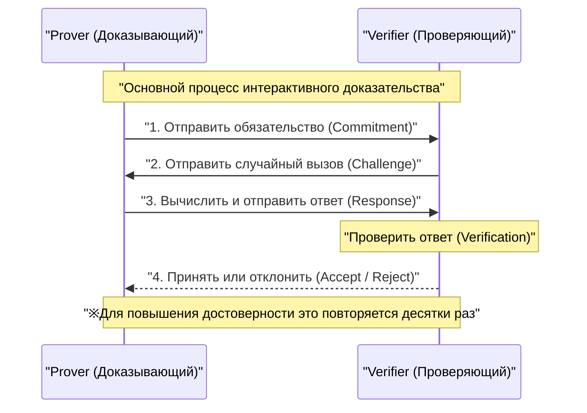
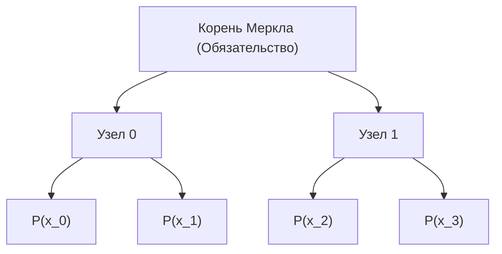
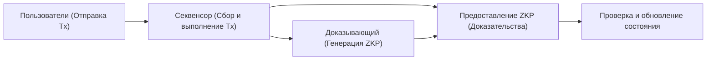

## Введение

В современном цифровом обществе конфиденциальность данных и масштабируемость стали двумя наиболее важными проблемами. По мере роста риска утечек и несанкционированного использования личной информации, возникает острая необходимость в технологии, позволяющей «доказать, что вы обладаете определенной информацией, не раскрывая саму эту информацию другой стороне». Именно это и реализует **доказательство с нулевым разглашением (Zero-Knowledge Proof: ZKP)**.

Доказательство с нулевым разглашением — это криптографическая концепция, впервые предложенная в 1980-х годах Шафи Гольдвассер, Сильвио Микали и Чарльзом Ракоффом, однако долгое время она оставалась лишь предметом теоретических исследований. Но с появлением технологии блокчейн и Web3 ситуация кардинально изменилась. ZKP оказалось в центре внимания как «волшебная палочка», способная одновременно решить проблему масштабируемости (ограничения пропускной способности) и проблему конфиденциальности (все транзакции публичны), с которыми сталкиваются публичные блокчейны, такие как Ethereum.

В этой статье мы подробно и глубоко с технической точки зрения рассмотрим основные концепции доказательства с нулевым разглашением, глубокие математические и криптографические механизмы **zk-SNARKs** и **zk-STARKs**, которые в настоящее время являются основными, а также последние примеры их применения в Web3 и сфере безопасности, такие как ZK-Rollups и децентрализованная идентификация (DID).

---

## Что такое доказательство с нулевым разглашением (ZKP)?

Доказательство с нулевым разглашением (ZKP) означает протокол, при котором доказывающий (Prover) доказывает проверяющему (Verifier), что некое утверждение истинно, но при этом «не передает абсолютно никакой информации, кроме самого факта истинности этого утверждения».

### 3 требования, которым должно удовлетворять ZKP

Чтобы считаться ZKP, протокол должен строго выполнять следующие три свойства:

1. **Полнота (Completeness)**
   Если утверждение истинно, и доказывающий с проверяющим добросовестно следуют протоколу, проверяющий должен принять доказательство (Accept) с подавляющей вероятностью.
2. **Корректность (Soundness)**
   Если утверждение ложно, то никакой доказывающий-злоумышленник, какими бы вычислительными мощностями он ни обладал, не сможет обмануть проверяющего и заставить его принять доказательство (за исключением пренебрежимо малой вероятности).
3. **Нулевое разглашение (Zero-Knowledge)**
   Если утверждение истинно, проверяющий не может получить из процесса доказательства никакой другой информации, кроме того факта, что «утверждение истинно». С точки зрения проверяющего, это доказывается математическим определением того, что процесс доказательства можно смоделировать (существует симулятор).

### Интерактивные и неинтерактивные доказательства

ZKP делится на два типа: **интерактивное доказательство**, при котором доказывающий и проверяющий обмениваются сообщениями несколько раз, и **неинтерактивное доказательство**, при котором доказывающий отправляет данные доказательства только один раз.

#### Интерактивное доказательство (Interactive ZKP)

Ранние ZKP разрабатывались как интерактивные протоколы. Известная притча о «пещере Али-Бабы» является примером такого подхода. Основной поток протокола выглядит следующим образом:

Этот метод эффективен, но требует, чтобы проверяющий находился онлайн, что делает его неудобным для применения в асинхронных распределенных системах, таких как блокчейн. В блокчейне любой желающий должен иметь возможность в любое время проверить прошлые доказательства.

#### Эвристика Фиата-Шамира (Fiat-Shamir Heuristic) и переход к неинтерактивности

Революционным методом преобразования интерактивных доказательств в неинтерактивные (Non-Interactive Zero-Knowledge Proof: NIZK) является **преобразование (эвристика) Фиата-Шамира**.

Вместо «случайного вызова», отправляемого проверяющим, доказывающий самостоятельно генерирует «псевдослучайный вызов», используя собственное обязательство (commitment) и хеш-значение публичной информации. При условии, что криптографическая хеш-функция (например, SHA-256 или Keccak) работает как случайный оракул (Random Oracle), доказывающий не может заранее предсказать или манипулировать вызовом. Таким образом, доказательство завершается одной отправкой сообщения с сохранением безопасности, эквивалентной интерактивному доказательству.

---

## Технические подробности zk-SNARKs

В настоящее время наиболее широко используемым видом ZKP является **zk-SNARKs** (Zero-Knowledge Succinct Non-Interactive Argument of Knowledge). Как следует из названия, это аргумент знания (Argument of Knowledge), который обладает нулевым разглашением (zk), имеет очень маленький размер доказательства и быстро проверяется (Succinct), а также является неинтерактивным (Non-Interactive).

В основе zk-SNARKs лежит передовая алгебраическая геометрия и криптография. Они преобразуют выполнение программ и вычисления в проверку уравнений определенных многочленов.

### 1. Арифметические схемы и преобразование в R1CS (Rank-1 Constraint System)

Сначала любое вычисление, которое необходимо доказать (алгоритм или логика смарт-контракта), преобразуется в **арифметическую схему (Arithmetic Circuit)**, состоящую из вентилей сложения и умножения.

Затем эта арифметическая схема преобразуется в набор матричных уравнений, называемый **R1CS (Rank-1 Constraint System)**. R1CS — это задача поиска матриц $A, B, C$, удовлетворяющих следующему ограничению для вектора переменных $x$:

$$ (A \cdot x) \circ (B \cdot x) = C \cdot x $$

Здесь $\circ$ обозначает произведение Адамара (поэлементное умножение). Это ограничение гарантирует, что все логические вентили в схеме (особенно вентили умножения) вычислены правильно.

### 2. Преобразование в QAP (Quadratic Arithmetic Program)

Поскольку матричных ограничений R1CS существует огромное количество, проверять их по отдельности крайне неэффективно. Поэтому с помощью интерполяции Лагранжа эти ограничения сжимаются в единое полиномиальное уравнение. Это называется **QAP (Quadratic Arithmetic Program)**.

За счет преобразования в QAP задача, которую необходимо доказать, сводится к вопросу: «Делится ли определенный многочлен $P(x)$ на другой известный многочлен $Z(x)$?»

$$ P(x) = L(x) \cdot R(x) - O(x) $$

Здесь $L(x), R(x), O(x)$ — многочлены, составленные из соответствующих строк матриц $A, B, C$. Если доказывающий знает правильное решение (Witness), значение $P(x)$ будет равно 0 в каждом корне (точке оценки), поэтому $P(x)$ будет иметь целевой многочлен $Z(x)$ в качестве множителя. То есть существует некоторый многочлен $H(x)$, для которого выполняется:

$$ P(x) = H(x) \cdot Z(x) $$

Проверяющий может мгновенно проверить правильность выполнения всего вычисления, просто проверив, выполняется ли это уравнение $P(s) = H(s) \cdot Z(s)$ в некоторой случайной секретной точке $s$. В этом заключается секрет «Succinct» (краткости).

### 3. Эллиптическая криптография и спаривание (Bilinear Pairings)

Однако, если бы проверяющий знал секретную точку $s$, доказывающий мог бы подделать ложный многочлен для удовлетворения уравнения (нарушение корректности). Поэтому вычисления необходимо проводить, пока $s$ остается зашифрованным от всех (с использованием гомоморфного шифрования).

Это достигается с помощью **эллиптического спаривания (Bilinear Pairings)**.
Спаривание $e$ — это специальная функция, которая из двух зашифрованных значений позволяет вычислить значение, эквивалентное шифрованию их произведения.

$$ e(g_1^a, g_2^b) = e(g_1, g_2)^{ab} $$

Доказывающий, не зная самой $s$, использует зашифрованные значения степеней $s$ (это называется CRS: Common Reference String) для вычисления зашифрованных значений многочленов $P(s)$ и $H(s)$. Проверяющий использует функцию спаривания, чтобы проверить выполнение отношения $P(s) = H(s) \cdot Z(s)$, оперируя при этом зашифрованными значениями.

### 4. Доверенная установка (Trusted Setup)

Главной слабостью zk-SNARKs (особенно ранних версий, таких как Groth16) является необходимость процесса генерации секретной точки $s$, так называемой **доверенной установки (Trusted Setup)**. Если создатель $s$ сохранит это значение вместо того, чтобы уничтожить его, он сможет сгенерировать любые ложные доказательства (проблема Toxic Waste).

Для предотвращения этого проводится ритуал, называемый «Ceremony», с использованием многосторонних вычислений (Multi-Party Computation, MPC). В нем участвует множество участников, предоставляя случайные данные. Если хотя бы один участник честно уничтожит свое случайное значение, безопасность всей системы будет сохранена. Тем не менее, исследования по устранению этой зависимости продолжались долгие годы.

---

## Технические подробности zk-STARKs

В качестве ответа на зависимость от доверенной установки и риск взлома эллиптической криптографии квантовыми компьютерами появились **zk-STARKs** (Zero-Knowledge Scalable Transparent Argument of Knowledge).

Разработанные Эли Бен-Сассоном (Eli Ben-Sasson) и его коллегами, STARKs обладают характеристиками, отраженными в их названии: они «прозрачны» (Transparent) и вообще не требуют доверенной установки, а также «масштабируемы» (Scalable), поскольку размер доказательства и время проверки остаются эффективными даже при увеличении объема вычислений.

### 1. Полиномиальные обязательства и протокол FRI

В отличие от zk-SNARKs, zk-STARKs не используют эллиптическую криптографию, а основывают свою безопасность **исключительно на хеш-функциях**. Благодаря этому они обладают свойствами постквантовой криптографии (Post-Quantum Cryptography).

Проверка вычислений выполняется после их преобразования в формат под названием AIR (Algebraic Intermediate Representation) с использованием свойств одномерных или многомерных полиномов. Сердцем STARKs является протокол **FRI (Fast Reed-Solomon Interactive Oracle Proof of Proximity)**.

Протокол FRI — это технология проверки того, «насколько близка определенная функция к полиному определенной степени» (Proximity). Доказывающий фиксирует значения полинома в качестве листьев дерева Меркла (Merkle Tree) (это называется полиномиальным обязательством).

Проверяющий запрашивает раскрытие нескольких случайных точек и использует доказательства Меркла (Merkle proof), чтобы подтвердить, что они включены в обязательство. Рекурсивно повторяя этот процесс, он с подавляющей вероятностью гарантирует, что степень исходного многочлена действительно низкая.

### Сравнение zk-SNARKs и zk-STARKs

| Характеристика | zk-SNARKs | zk-STARKs |
| :--- | :--- | :--- |
| **Криптографические предположения** | Эллиптические кривые, спаривание | Криптографические хеш-функции, устойчивые к коллизиям |
| **Доверенная установка** | Требуется (в Plonk и др. — универсальная) | Не требуется (Transparent) |
| **Квантовая устойчивость** | Нет | Есть |
| **Размер доказательства** | Очень маленький (~200 байт) | Довольно большой (десятки КБ) |
| **Вычислительные затраты на создание доказательства** | Высокие | Относительно ниже, чем у SNARKs |
| **Затраты на проверку (Gas)** | Очень низкие (постоянные) | Низкие (логарифмический рост) |

В последние годы появились SNARKs, такие как Plonk и Halo2, которым «не требуется доверенная установка или она нужна только один раз», поэтому граница между SNARKs и STARKs постепенно стирается, но принципиальная разница в математическом подходе остается важной.

---

## Новейшие применения доказательства с нулевым разглашением в Web3 и безопасности

Перейдя от теории к практике, ZKP в настоящее время производит революцию на переднем крае Web3 и кибербезопасности.

### 1. Максимальное масштабирование Ethereum с помощью ZK-Rollups

Блокчейны уровня 1 (L1), такие как Ethereum, придают большое значение децентрализации и безопасности, но из-за этого имеют серьезные ограничения масштабируемости (трилемма). Окончательным решением уровня 2 (L2), устраняющим эту проблему, являются **ZK-Rollups**.

В ZK-Rollup тысячи транзакций выполняются и обрабатываются вне сети (L2), и генерируется «одно ZKP (Validity Proof)», подтверждающее правильность их выполнения. Смарт-контракту в блокчейне L1 остается только проверить это доказательство.

Главным преимуществом ZK-Rollups, в отличие от Optimistic Rollups (например, Arbitrum или Optimism), является отсутствие необходимости в периоде оспаривания (challenge period, обычно 7 дней) для доказательства мошенничества (Fraud Proof). Поскольку правильность криптографически гарантирована, как только доказательство проверено, вывод средств (Finality) на L1 завершается мгновенно. В настоящее время такие проекты, как zkSync, Starknet, Scroll и Polygon zkEVM, ведут ожесточенную конкуренцию в разработке, и реализация **zkEVM**, совместимой с EVM (виртуальной машиной Ethereum), способствует быстрому росту экосистемы.

### 2. Идентификация с сохранением конфиденциальности (ZKP for Identity)

ZKP также в корне меняет способы личной аутентификации в цифровом мире.
Например, на вопрос «Вам больше 18 лет?» в традиционных системах мы показываем водительские права или паспорт, передавая собеседнику ненужную личную информацию, такую как имя или адрес.

Используя ZKP, на основе цифрового сертификата (Verifiable Credential), выданного государственным органом, можно **математически доказать только тот факт**, что «согласно моей дате рождения, на текущую дату мне больше 18 лет». Проверяющему достаточно проверить подпись сертификата и ZKP, и он не сможет узнать вашу дату рождения или личность.

Проекты «доказательства личности» (Proof of Personhood), такие как Worldcoin, также не хранят и не передают данные радужной оболочки глаза напрямую. Вместо этого они используют ZKP, чтобы доказать только то, что «вы — уникальный человек».

### 3. Конфиденциальные смарт-контракты и корпоративное использование

Свойство публичных блокчейнов, при котором «все данные открыты», было серьезным препятствием для компаний при работе с конфиденциальными транзакциями или информацией о цепочках поставок в блокчейне.

Используя технологии ZKP (например, сети, ориентированные на конфиденциальность, такие как Aleo или Aztec), можно записывать в публичный блокчейн только подтверждение правильности обновления состояния, оставляя входные и выходные значения транзакций и даже саму логику выполняемого смарт-контракта в зашифрованном виде. Это позволяет предотвратить фронтраннинг (MEV) в DeFi (децентрализованных финансах) и создать конфиденциальные сети консорциумов между компаниями, наслаждаясь при этом высокой безопасностью публичных блокчейнов.

---

## Будущие проблемы и перспективы ZKP

ZKP, несомненно, является фундаментальной технологией следующего поколения, но остаются и некоторые проблемы.

1. **Вычислительные затраты на генерацию доказательств и аппаратное ускорение**
   Генерация ZKP требует огромного количества полиномиальных операций, быстрого преобразования Фурье (FFT) и мультискалярного умножения (MSM). В настоящее время быстро продвигаются исследования в области разработки специализированного аппаратного обеспечения (FPGA или ASIC) для ускорения генерации доказательств, так называемый **майнинг ZKP** (Prover Network).
2. **Стандартизация и улучшение опыта разработчиков (DX)**
   Появилось множество специализированных языков для написания схем ZKP, таких как Circom, Cairo, Noir, Leo и другие. Зрелость компиляторов, которые автоматически генерируют схемы ZKP из существующих языков, таких как Rust или C++, и единые стандарты, объединяющие их, станут ключом к внедрению ZKP обычными инженерами-программистами.

## Заключение

Доказательство с нулевым разглашением (ZKP) превратилось из просто «технологии повышения анонимности криптовалют» в «универсальную технологию, переопределяющую доверие во всем интернете». Небольшие доказательства, вычисленные в глубинах формул и криптографии, станут щитом, который бесконечно расширяет масштабируемость блокчейна и надежно защищает нашу конфиденциальность.

На пути к истинному массовому внедрению Web3 и созданию безопасного и приватного интернета следующего поколения, доказательство с нулевым разглашением будет продолжать играть роль важнейшего элемента. Мы должны внимательно следить за дальнейшей эволюцией технологий ZKP.

---
*Источники и полезные ссылки*
- Groth, J. (2016). "On the Size of Pairing-based Non-interactive Arguments"
- Ben-Sasson, E., et al. (2018). "Scalable, transparent, and post-quantum secure computational integrity"
- Vitalik Buterin's blog on zk-SNARKs and zk-STARKs
