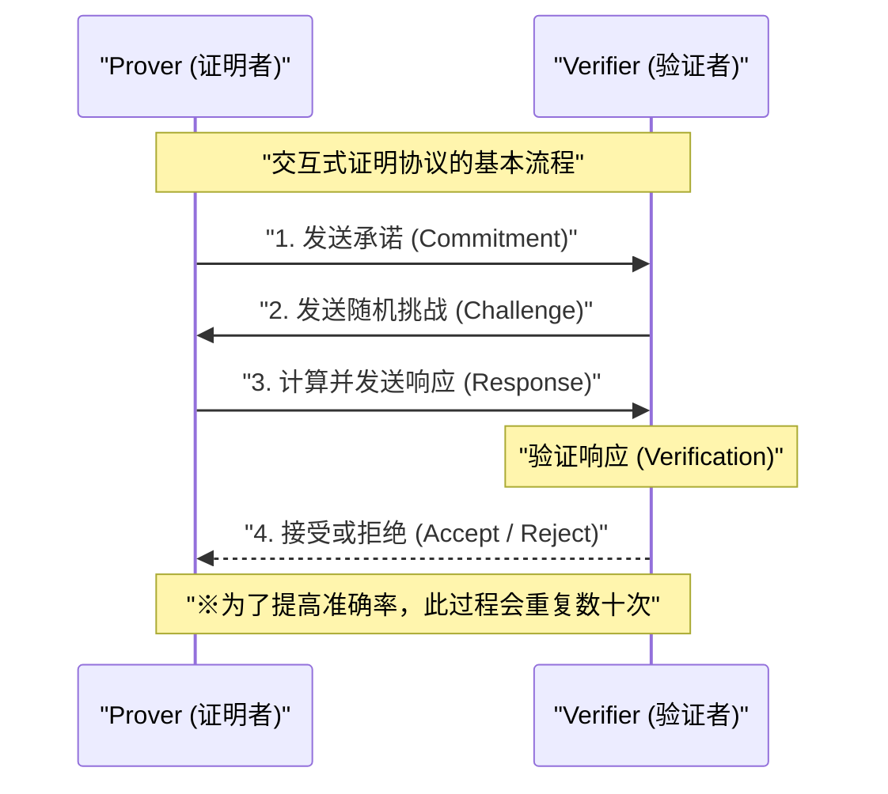
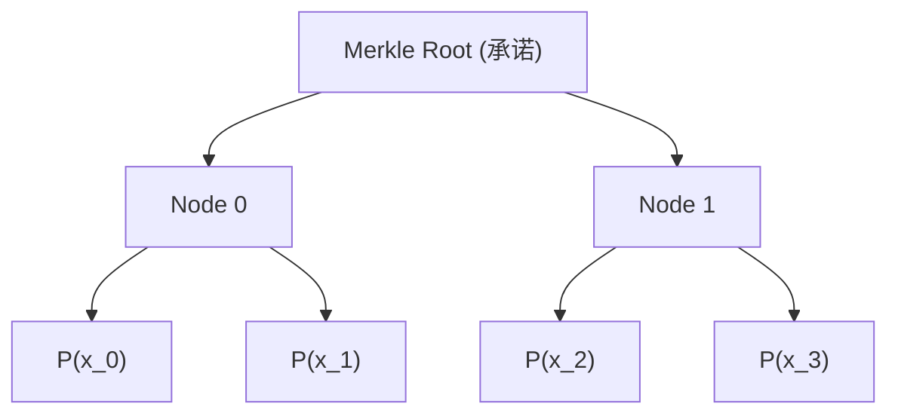
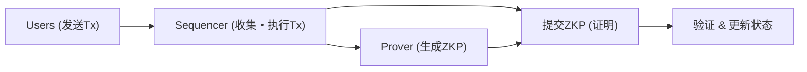

## 引言

在现代数字社会中，数据隐私和可扩展性已成为最重要的两个课题。随着个人信息泄露和被滥用的风险不断增加，“在不向对方透露关于自己信息的情况下，证明自己拥有该信息”的技术需求变得日益强烈。实现这一点的正是**零知识证明（Zero-Knowledge Proof: ZKP）**。

零知识证明是20世纪80年代由Shafi Goldwasser、Silvio Micali和Charles Rackoff首次提出的密码学理论概念，但在很长一段时间内仅停留在理论研究阶段。然而，随着区块链技术和Web3的崛起，情况发生了巨大变化。以太坊等公有链面临着可扩展性问题（处理能力的极限）和隐私问题（所有交易都是公开的），而ZKP作为能同时解决这两大问题的“魔法棒”，一跃成为了众人瞩目的焦点。

本文将极尽详细地、从技术深处探讨零知识证明的基本概念、目前成为主流的**zk-SNARKs**及**zk-STARKs**深奥的数学和密码学机制，以及ZK-Rollups、去中心化身份（DID）等在Web3与安全领域的最新应用实例。

---

## 什么是零知识证明（ZKP）？

零知识证明（ZKP）是指在证明者（Prover）向验证者（Verifier）证明某个命题为真时，“除了该命题为真这一事实外，不传递任何其他信息”的协议。

### ZKP必须满足的3个条件

要成立为ZKP，必须严格满足以下3个特性：

1. **完备性（Completeness）**
   如果命题为真，且证明者和验证者双方都正确遵循协议，那么验证者必须以压倒性的概率接受（Accept）该证明。
2. **可靠性（Soundness）**
   如果命题为假，那么无论证明者拥有多么强大的计算能力，或是多么恶意的证明者，都不可能欺骗验证者使其接受证明（除极小且可忽略的概率外）。
3. **零知识性（Zero-Knowledge）**
   如果命题为真，验证者除了“命题为真”这一事实外，无法从证明过程中获取任何其他信息。从验证者的视角来看，其能够模拟证明过程（存在模拟器）这一事实，通过数学定义证明了这一点。

### 交互式证明与非交互式证明

ZKP有两种形式：证明者和验证者需要进行多次通信的**交互式证明**，以及证明者只需发送一次证明数据即告完成的**非交互式证明**。

#### 交互式证明（Interactive ZKP）

早期的ZKP被设计为交互式协议。著名的“阿里巴巴山洞”的故事就是对此的形象比喻。一般协议的流程如下：

这种方法虽然强大，但要求验证者必须在线，将其应用于区块链这种异步的分布式系统中会非常不便。在区块链中，任何人必须能够随时验证过去的证明。

#### 菲亚特-沙米尔变换（Fiat-Shamir Heuristic）与非交互化

将交互式证明转化为非交互式证明（Non-Interactive Zero-Knowledge Proof: NIZK）的革命性方法就是**菲亚特-沙米尔变换**。

它不再由验证者发送“随机挑战”，而是由证明者使用自身的承诺和公开信息的哈希值，自我生成一个“伪随机挑战”。前提是密码学哈希函数（例如SHA-256或Keccak等）作为随机预言机（Random Oracle）发挥作用，证明者无法提前预测或操纵挑战，从而在保持与交互式证明同等安全性的情况下，仅通过发送一次消息就能完成证明。

---

## zk-SNARKs的技术细节

目前在ZKP中被最广泛使用的是**zk-SNARKs**（Zero-Knowledge Succinct Non-Interactive Argument of Knowledge，零知识简洁非交互式知识论证）。顾名思义，它具备零知识性（zk），证明体积非常小且验证高速（Succinct），是一种非交互式（Non-Interactive）的知识论证（Argument of Knowledge）。

zk-SNARKs的基础是高级代数几何和密码学理论。它将程序的执行和计算转化为对特定多项式方程的验证。

### 1. 转化为算术电路与R1CS（Rank-1 Constraint System）

首先，将想要证明的任意计算（算法或智能合约的逻辑）转化为由加法门和乘法门组成的**算术电路（Arithmetic Circuit）**。

接着，将该算术电路转化为名为**R1CS（Rank-1 Constraint System，一阶约束系统）**的矩阵方程集合。R1CS的问题是：对于变量向量 $x$，找到满足以下约束的矩阵 $A, B, C$。

$$ (A \cdot x) \circ (B \cdot x) = C \cdot x $$

在这里，$\circ$ 表示哈达玛乘积（逐元素乘积）。这个约束确保了电路中所有的逻辑门（特别是乘法门）都被正确计算。

### 2. 转化为QAP（Quadratic Arithmetic Program）

由于R1CS的矩阵约束数量庞大，逐一验证它们是非常低效的。因此，利用拉格朗日插值法，将这些约束压缩成一个单一的多项式方程。这就是**QAP（Quadratic Arithmetic Program，二次算术程序）**。

通过向QAP的转化，需要证明的问题归结为：“特定的多项式 $P(x)$ 是否能被另一个已知多项式 $Z(x)$ 整除？”这一问题。

$$ P(x) = L(x) \cdot R(x) - O(x) $$

在这里，$L(x), R(x), O(x)$ 分别是由矩阵 $A, B, C$ 各行对应的多项式组合而成。如果证明者知道正确的解（Witness），由于在 $P(x)$ 的每个根（求值点）上的值都为0，那么 $P(x)$ 就将目标多项式 $Z(x)$ 作为其因式。即存在一个多项式 $H(x)$，使得下式成立：

$$ P(x) = H(x) \cdot Z(x) $$

验证者只需在一个随机的秘密点 $s$ 上，检查该方程 $P(s) = H(s) \cdot Z(s)$ 是否成立，就能瞬间验证整个计算是否正确执行。这就是“简洁性（Succinct）”的秘密所在。

### 3. 椭圆曲线密码学与配引（Bilinear Pairings）

但是，如果验证者知道秘密点 $s$，证明者就可以伪造虚假的多项式来满足方程（导致可靠性崩溃）。因此，必须在谁也不知道 $s$ 的情况下对其进行加密（利用同态加密），并在加密状态下进行计算。

实现这一目标的是**椭圆曲线配对（Bilinear Pairings）**。
配对 $e$ 是一种特殊的函数，能够从两个加密后的值中计算出相当于它们乘积的加密值。

$$ e(g_1^a, g_2^b) = e(g_1, g_2)^{ab} $$

证明者即使不知道 $s$ 本身，也能利用 $s$ 的幂的加密值（这被称为 CRS: Common Reference String，公共参考字符串）计算出多项式 $P(s)$ 和 $H(s)$ 的加密值。验证者使用配对函数，在加密值的状态下验证 $P(s) = H(s) \cdot Z(s)$ 的关系是否成立。

### 4. 可信设置（Trusted Setup）

zk-SNARKs（特别是早期的Groth16等）最大的弱点在于生成秘密点 $s$ 的过程，即需要所谓的**可信设置（Trusted Setup）**。如果 $s$ 的生成者保留了该值而没有将其销毁，他们就可以生成任意的虚假证明（Toxic Waste，有毒废料问题）。

为了防止这种情况，会执行被称为“仪式（Ceremony）”的过程，利用多方计算（MPC）。许多参与者合作提供随机性，只要至少有一位参与者诚实地销毁了自己的随机值，整个系统的安全性就能得到保障。然而，为了消除这种依赖关系，研究人员长年以来一直在不断努力。

---

## zk-STARKs的技术细节

为了解决对可信设置的依赖以及量子计算机破解椭圆曲线密码学的风险，**zk-STARKs**（Zero-Knowledge Scalable Transparent Argument of Knowledge，零知识可扩展透明知识论证）应运而生。

由Eli Ben-Sasson等人开发的STARKs，正如其“透明性（Transparent）”之名，完全不需要可信设置；而正如其“可扩展性（Scalable）”之名，它具有在计算量增加时，证明体积和验证时间仍能保持高效的特点。

### 1. 多项式承诺与FRI协议

zk-STARKs不使用椭圆曲线密码学，而是将安全性基础完全建立在**哈希函数**上。因此，它具有抗量子计算密码学（Post-Quantum Cryptography）的特性。

计算的验证在被转化为名为AIR（Algebraic Intermediate Representation，代数中间表示）的格式后，利用一维或多维多项式的性质进行。STARKs的核心在于**FRI（Fast Reed-Solomon Interactive Oracle Proof of Proximity，快速里德-所罗门交互式预言机近似证明）**协议。

FRI协议是一种验证“某函数是否足够接近特定次数的多项式（Proximity）”的技术。证明者将多项式的值作为默克尔树（Merkle Tree）的叶子节点进行承诺（多项式承诺）。

验证者要求公开随机的几个点，并利用默克尔证明确认它们包含在承诺中。通过递归地重复这一过程，可以以压倒性的概率保证原始多项式的次数实际上很低。

### zk-SNARKs与zk-STARKs的比较

| 特性 | zk-SNARKs | zk-STARKs |
| :--- | :--- | :--- |
| **密码学假设** | 椭圆曲线、配对 | 抗碰撞哈希函数 |
| **可信设置** | 需要（Plonk等为通用型） | 不需要（Transparent） |
| **抗量子性** | 无 | 有 |
| **证明体积** | 非常小（~200 Byte） | 较大（数十 KB） |
| **证明生成计算成本** | 高 | 相对SNARKs较低 |
| **验证成本（Gas费）** | 非常低（恒定） | 低（对数级增长） |

近年来，随着Plonk和Halo2等“不需要可信设置，或只需进行一次设置的SNARKs”的出现，SNARKs和STARKs的界限正逐渐变得模糊，但它们之间基础数学方法的差异依然重要。

---

## 零知识证明在Web3与安全领域的最新应用

从理论走向实践的ZKP，目前正在Web3和网络安全的最前沿掀起一场革命。

### 1. 采用ZK-Rollups实现以太坊的终极扩容

像以太坊这样的L1（第一层）区块链，因为过于重视去中心化和安全性，在可扩展性上受到了很大的限制（区块链不可能三角）。解决这一问题的L2（第二层）决定性方案就是**ZK-Rollups**。

在ZK-Rollup中，数千笔交易在链下（L2）被执行和处理，并生成“一个ZKP（有效性证明）”来证明它们都已被正确执行。L1链上的智能合约只需验证这个证明即可。

ZK-Rollups最大的优势在于，与Optimistic Rollups（如Arbitrum或Optimism等）不同，它不需要为了欺诈证明（Fraud Proof）而设置挑战期（通常为7天）。由于其正确性在密码学上得到了保证，在证明被验证的瞬间，向L1提取资金（确定性，Finality）即告完成。目前，zkSync、Starknet、Scroll、Polygon zkEVM等项目正展开激烈的开发竞争，与EVM（以太坊虚拟机）兼容的**zkEVM**的实现正在促使生态系统快速增长。

### 2. 隐私保护身份（ZKP for Identity）

数字世界中的个人认证方式也将被ZKP从根本上改变。
例如，面对“你满18岁了吗？”这个问题，在传统系统中需要出示驾驶证或护照，从而将姓名、地址等不必要的个人信息也交给了对方。

如果使用ZKP，就可以基于公共机构颁发的数字证书（Verifiable Credential），在数学上仅仅证明“根据我的出生日期计算，在当前日期我已年满18岁”这一**事实**。验证者只需验证证书的签名和ZKP，无法得知用户的出生日期和具体身份。

在Worldcoin这样的人格证明（Proof of Personhood）项目中，也没有直接保存和共享虹膜数据，而是引入了ZKP机制，仅仅证明“是一个独一无二的人类”。

### 3. 机密智能合约与企业应用

公有链“所有数据都公开”的特性，曾经是企业在区块链上处理机密交易或供应链信息时的巨大障碍。

利用ZKP技术（例如Aleo或Aztec等专注于隐私的网络），可以在保持交易输入值、输出值甚至执行的智能合约逻辑本身加密的状态下，仅将状态更新的正确性记录在公有链上。这使得在享受公有链高安全性的同时，能够防止DeFi（去中心化金融）中的抢跑（MEV），或在企业间构建机密联盟网络成为可能。

---

## ZKP未来的挑战与展望

ZKP毫无疑问是下一代的基础技术，但仍存在一些挑战。

1. **证明生成的计算成本与硬件加速**
   ZKP的生成需要进行庞大的多项式运算、FFT（快速傅里叶变换）以及MSM（多标量乘法）。目前，为加速这一证明生成过程，开发专用硬件（FPGA或ASIC），即所谓的**ZKP挖矿**（Prover Network）的研究正在迅速推进。
2. **标准化与开发者体验（DX）的提升**
   目前，用于编写ZKP电路的专用语言（如Circom、Cairo、Noir、Leo等）五花八门。统一这些语言的标准规范，以及能从现有的Rust或C++代码自动生成ZKP电路的编译器的成熟，将是普通软件工程师能够广泛应用ZKP的关键。

## 结语

零知识证明（ZKP）已经从单纯的“提高加密货币匿名性的技术”，进化为“重新定义整个互联网信任机制的通用技术”。在深奥的数学公式与密码学理论中计算出的微小证明，将无限扩展区块链的可扩展性，并成为坚固保护我们隐私的盾牌。

在迈向Web3的真正大规模普及（Mass Adoption）以及构建安全、隐私的下一代互联网的过程中，零知识证明将继续作为最重要的一块拼图发挥作用。ZKP技术的未来发展绝对不容错过。

---
*参考文献与相关链接*
- Groth, J. (2016). "On the Size of Pairing-based Non-interactive Arguments"
- Ben-Sasson, E., et al. (2018). "Scalable, transparent, and post-quantum secure computational integrity"
- Vitalik Buterin's blog on zk-SNARKs and zk-STARKs
